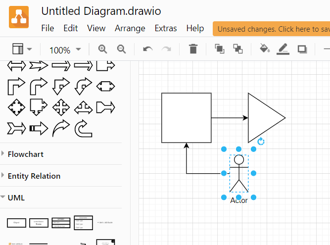
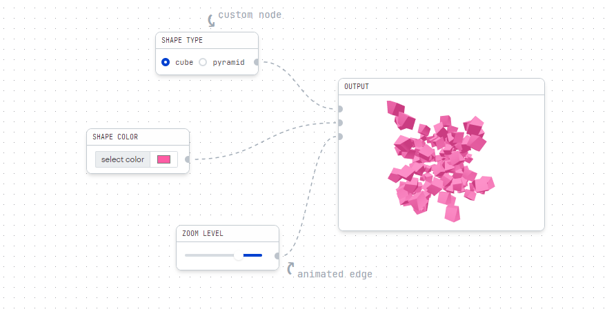
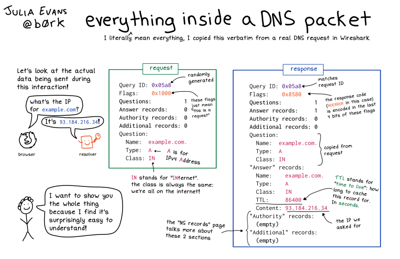

## Good old news!
- 2022-04-07 [An update to Raspberry Pi OS Bullseye - Raspberry Pi](https://www.raspberrypi.com/news/raspberry-pi-bullseye-update-april-2022/)
> Raspberry PI drops the default user and allows the user and SSH configuration via Imager.
> Long time awaited feature!

## Good Reads
- 2022-03-21 [Why Don't You Use ...](https://www.brendangregg.com/blog/2022-03-19/why-dont-you-use.html)
> Working for a famous tech company, I get asked a lot "Why don't you use technology X?" X may be an application, programming language, operating system, hypervisor, processor, or tool. It may be because:
> It performs poorly.
> It is too expensive.
> It is not open source.
> It lacks features.
> It lacks a community.
> ...
- 2022-03-26 [What made the NES so interesting?](https://nicole.express/2022/the-nes-as-an-artifact.html)
> I often like to cover oddities here; details of computers and arcade systems people may not have heard of, that didn’t sell well but had unique or interesting characteristics. But focusing on oddities like that can disguise the fact that sometimes, even systems that were very popular can stand out for unique design. Such be it with the Nintendo Entertainment System: had Nintendo’s console flopped, it’d definitely have a post already. But it doesn’t. Let’s fix that! And answer a simple question I was asked: what’s the deal with special chip games?
- 2022-04-11 [Taking Flight Without a Smart Phone dev/tails](https://devtails.xyz/taking-flight-without-a-smart-phone)
> In February, I wrote about getting rid of my iPhone and replacing it with a Nokia 6300 4G. I am incredibly happy with the results of this experience. I gained a new sense of presence with the real world and killed some bad scrolling habits. Unfortunately, KaiOS on the Nokia left much to be desired and our current society makes it very difficult to live without a smart phone.
>
> 
- 2022-04-11 [NodeJS packages don't deserve your trust](https://josephg.com/blog/node-sandbox/)
> Another week, another npm supply chain attack. Yikes! People on hacker news are wringing their hands about what should be done. The problem seems dire. [EventSource/eventsource.js at de137927e13d8afac153d2485152ccec48948a7a · Yaffle/EventSource](https://github.com/Yaffle/EventSource/blob/de137927e13d8afac153d2485152ccec48948a7a/src/eventsource.js#L1047-L1090)

## Fun
- 2022-04-07 [Using Windows after 15 years on Linux · duncanlock.net](https://duncanlock.net/blog/2022/04/06/using-windows-after-15-years-on-linux/)
> Windows is such a mess! It’s sort of shocking how much of a mess it is. Desktop Linux is often criticized for this, but Windows is much worse, somehow! It’s really inconsistent. Half of it is “new” UI and half of it is old Win32/GDI type UI - just as bad
> 🧸
- 2022-04-11 [Impressions from a first-time Mac user Logan Marchione](https://loganmarchione.com/2022/04/impressions-from-a-first-time-mac-user/)
> ⚠️ Warning Apple fanboys: this is a rant ⚠️
> 🧸🧸
- 2022-04-10 [RFC9225 - Software Defects Considered Harmful](https://www.rfc-editor.org/rfc/rfc9225.txt)
> Best Current Practises:
>
> 1. Authors MUST NOT implement bugs.
> 2. If bugs are introduced in code, they MUST be clearly documented.
> 3. When implementing specifications that are broken by design, it is
>       RECOMMENDED to aggregate multiple smaller bugs into one larger
>       bug.  This will be easier to document: rather than having a lot
>       of hard-to-track inconsequential bugs, there will be only a few
>       easy-to-recognise significant bugs.
> 4. The aphorism "It's not a bug, it's a feature" is considered rude.
> 5. Assume all external input is the result of (a series of) bugs.
>     (Especially in machine-to-machine applications such as
>     implementations of network protocols.)
> 6. In fact, assume all internal inputs also are the result of bugs.
- 2022-04-11 [Weightless Cats - Do Space Cats Land On Their Feet? - YouTube](https://www.youtube.com/watch?v=O9XtK6R1QAk)
> Cats in zero-g lose their auto-righting reflex; 🙀
- 2022-04-11 🍄 Mushrooms! I trust Bloomberg, BBC and NY Times!
  - 2022-04-11 [Effect of Magic Mushrooms Improves Brain Connections to Ease Depression: Study - Bloomberg](https://www.bloomberg.com/news/articles/2022-04-11/magic-mushrooms-improve-brain-connections-to-ease-depression)
  > Magic mushrooms connect regions of the brain that are more segregated in people with depression, paving the way to treat the condition differently than with conventional medications.
  - 2022-04-11 [Psilocybin Helps Alleviate Depression Symptoms, Small Study Says - The New York Times](https://www.nytimes.com/2022/04/11/health/psilocybin-depression.html)
  > The chemical derived from psychedelic mushrooms helped alleviate symptoms of depression and generated detectable neural responses that lasted weeks.
  - 2022-04-11 [Psychedelic frees up depressed brain, study shows - BBC News](https://www.bbc.com/news/health-61070591)

## Watch
- 2022-04-10 [#icepilots - YouTube](https://www.youtube.com/hashtag/icepilots)
> Ice Pilots NWT is a reality television documentary series that portrays Buffalo Airways, an airline based in Yellowknife, Northwest Territories, Canada. Buffalo flies WWII-era propeller planes year-round in the Canadian North.
> - 2022-04-10 [Ice Pilots NWT TV Series 2009–2014 - IMDb](https://www.imdb.com/title/tt1542981/)
> - 2022-04-10 [GALLERY - BUFFALO AIRWAYS](https://buffaloairways.com/gallery/#iLightbox[gallery_image_1]/33)
> - 2022-04-10 [C-47 Pilot and Maintenance Manuals](https://www.usaf-sig.org/index.php/references/downloads/category/41-c-47)

## Design Patterns

## Projects
- 2022-03-21 [Curtiss-Wright Debuts First Raspberry Pi Powered Ultra-Small Form Factor Rugged Mission Computer for Defense and Aerospace Applications](https://www.curtisswrightds.com/news/press-release/raspberry-pi-powered-ultra-small-form-factor-rugged-mission-computer.html)
> Defense Solutions division, a leading supplier of modular open systems approach (MOSA) solutions engineered to succeed, today introduced the Parvus® DuraCOR® Pi, the embedded industry’s first Raspberry Pi (RPi) powered mission computer for defense and aerospace applications.  The ultra-small form factor (USFF) DuraCOR Pi, fully ruggedized to deliver optimal performance in harsh operating environments, is the first mission computer to deliver 100% compatibility with the vast Pi Developer Ecosystem in a fully MIL-STD rugged sealed housing.
- 2022-03-21 [Introduction Plaintext Productivity](https://plaintext-productivity.net/)
> This guide is meant to document the things I have done, the software I have used, and the decisions I have made to be really fast and really well-organized at work, and to help prioritize and maintain focus on my current activities. One key decision, made for speed above all else, is to capture as much of my thinking and work in plaintext as I can. Thus the name: Plaintext Productivity. I will explain my reasoning behind choosing plaintext in each section in which it is relevant.
- 2022-03-23 [jgraph/drawio-desktop: Official electron build of diagrams.net](https://github.com/jgraph/drawio-desktop)
> drawio-desktop is a diagramming and whiteboarding desktop app based on Electron that wraps the core draw.io editor.

- 2022-03-25 [Home React Flow](https://reactflow.dev/)
> A highly customizable React component for building node-based editors and interactive diagrams

- 2022-03-26 [Running GUI apps within Docker containers – Trickster Dev](https://www.trickster.dev/post/running-gui-apps-within-docker-containers/)
> Suppose we have Docker installed on macOS or other Unix/Linux system. How do we run Firefox within Docker container? For a first attempt, let us consider the following Dockerfile:
```bash
FROM ubuntu:latest
RUN apt-get update && apt-get install -y firefox x11vnc xvfb
RUN echo "exec firefox" > ~/.xinitrc && chmod +x ~/.xinitrc
CMD ["x11vnc", "-create", "-noxrecord", "-noxfixes", "-noxdamage", "-forever", "-passwd", "trustno1"]
```
- 2022-04-07 [showdownjs/showdown: A bidirectional Markdown to HTML to Markdown converter written in Javascript](https://github.com/showdownjs/showdown)
> Showdown is a JavaScript Markdown to HTML converter, based on the original works by John Gruber. Showdown can be used client side (in the browser) or server side (with Node.js).
> Check out a live demo here: http://demo.showdownjs.com/
- 2022-04-11 [ern0/howto-wasm-minimal: How to create minimal wasm module](https://github.com/ern0/howto-wasm-minimal)
> How to create minimal wasm module - PoC
> Why WASM?
> 😵‍💫 Writing web app in any language which is not JavaScript is just pure joy.

## 🥑 Rust
- 2022-04-11 [What I learned from making a DNS client in Rust](https://blog.adamchalmers.com/making-a-dns-client/)
> Over the last few weeks I built my own DNS client. Mostly because I thought dig (the standard DNS client) was kinda clunky. Partly because I wanted to learn more about DNS. So here's how I built it, and how you can build your own too. It's a great weekend project, and I learned a lot from finishing it.
> 
- 2022-04-11 [What Is Rust's unsafe? Nora Codes](https://nora.codes/post/what-is-rusts-unsafe/)
> Rust promises safety as one of its core tenets; it is, in some ways, the raison d'être of the language. It does not, however, go about providing that safety in the traditional way, using a runtime and a garbage collector; rather, Rust uses a very advanced
- 2022-04-11 [iced-rs/iced: A cross-platform GUI library for Rust, inspired by Elm](https://github.com/iced-rs/iced)
> iced is currently experimental software. A cross-platform GUI library for Rust focused on simplicity and type-safety.

## JavaScript

## .NET/ C#
- 2022-04-06 [.NET type for personally identifiable information PII](https://gaevoy.com/2022/03/18/personally-identifiable-information-data-types.html?utm_source=csharpdigest&utm_medium=email&utm_campaign=408)
> According to the law in many countries, you must treat PII data in a special way. For example, there is a number of restrictions on the use of personal data according to GDPR regulation in the European Union. I’m going to list some requirements based on t
> What if we introduce an explicit type for PII, like `PiiString`. The idea is to have `PiiString` type as much interchangeable with String as possible to simplify refactoring existing code which uses the String. Then, within the application boundary it should behave like usual String, however crossing application boundaries it should be encoded/encrypted/hashed.

# PowerShell
- 2022-04-11 [PowerShell - Aliases](https://devtut.github.io/powershell/aliases.html#get-alias)
> about PowerShell aliases

## Authorization & Authentication
- 2022-04-03 [Combining Bearer Token and Cookie Authentication in ASP.NET - Rick Strahl's Web Log](https://weblog.west-wind.com/posts/2022/Mar/29/Combining-Bearer-Token-and-Cookie-Auth-in-ASPNET?utm_source=csharpdigest&utm_medium=email&utm_campaign=409)
> And we're back for another episode in the seedy TV drama that is ASP.NET Authentication. In today's show we'll discuss the mysterious case of combining multiple authentication schemes in a single application. Tune in at 11 for the scary conclusion...
>
> In this post I'll talk about:
> - Combining JWT Bearer Token and Cookie Authentication
> - Using Manual JWT Tokens
> - Using Manual Cookies
> - Using only ASP.NET's low level Auth features - not using ASP.NET Core Identity

## Video Editing/ GoPro / ffmpeg

