## Good Reads
- 2022-06-10 [The mindless tyranny of 'what if it changes?' as a software design principle - Blogomatano](https://chriskiehl.com/article/the-tyranny-of-what-if-it-changes)
> "What if it changes?" isn't just a question. It's a powerful heuristic for software design that can be used to justify almost anything. Everyone should use it more. It's great precisely because it's rooted in pure speculation. Once you've freed yourself from the baggage of reality, there's nothing easier than inventing scenarios where your special code will be useful under the new imaginary future conditions.
- 2022-06-06 🤯🧠🤯🧠🤯🧠 [Tools for better thinking Untools](https://untools.co/)
> Collection of thinking tools and frameworks to help you solve problems, make decisions and understand systems.
- 2022-06-05 [I Cheated on My Microsoft Interview The Facet Blog](https://www.facet.net/posts/i-cheated-on-my-microsoft-interview)
> I’ve struggled with this a lot over the years, but I finally decided to share my story. I don’t think I would have made it past the first round of interviews at Microsoft if I hadn’t gotten so lucky. So pretty much, my entire career is built on one amazing stroke of luck.
> 2022-06-05 [Comments on I Cheated on My Microsoft Interview on Hacker News](https://news.ycombinator.com/item?id=31628886)

## How the things work
- 2022-06-11 [Interactive Illustrations from "Code: The Hidden Language of Computer Hardware and Software, 2nd Edition" by Charles Petzold](https://www.codehiddenlanguage.com/)  
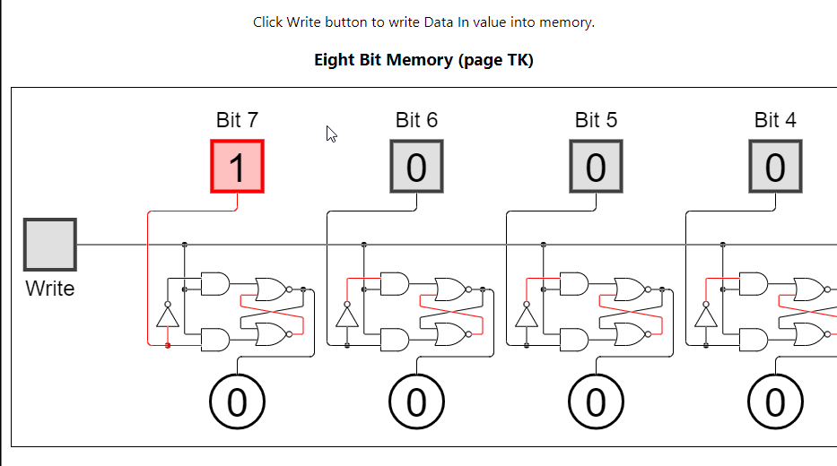
- 2022-06-10 [Mathematical Notation for JavaScript Developers Explained](https://runjs.app/blog/mathematical-notation-for-javascript-developers-explained)
> Being able to understand and implement mathematics in JavaScript can be very useful. This is particularly true when working with highly visual and interactive applications, something JavaScript is well suited to. However, it can be hard to make sense of it all and how it translates to code without a background in mathematics.
- 2022-06-10 [How do Video Games Stay in Sync? An Intro to the Fascinating Networking of Real Time Games. by Eric Lastname Geek Culture May, 2022 Medium](https://medium.com/geekculture/how-do-video-games-stay-in-sync-an-intro-to-the-fascinating-networking-of-real-time-games-e923e66e8a0f)
> Have you ever wondered how real-time games can keep multiple clients in sync even when there are large latencies between users? How can you see other players reacting to your actions near instantly, in spite of the fact that the communication between your computer and the server is not instant?
- 2022-06-07 📺 [Plain Text - Dylan Beattie - NDC Oslo 2021 - YouTube](https://www.youtube.com/watch?v=_mZBa3sqTrI)
> Kohuept (Billy Joel Live in Leningrad)
> About KOI8-R and other Cyrillic encoding problems. Unicode, UTF8 and Emoji. Fun stuff.
- 2022-06-06 [Video live streaming: Notes on RTMP, HLS, and WebRTC](https://www.daily.co/blog/video-live-streaming/)
> Kwindla (CEO) got started designing tools for kids to learn coding. That grew into explorations of collaboration systems; he's been building video calling frameworks since the days of the Nokia 6600.

## Fun
- 2022-06-14 [The Floppotron 3.0 » Silent's Homepage](http://silent.org.pl/home/2022/06/13/the-floppotron-3-0/)
> To avoid scaring the non-technical readers away at the beginning, I’ll start with the basic operating principles and explain where these sounds come from.
- 2022-06-17 [B00merang-Project/Windows-3.11: A GTK theme based on Windows 3.11 appearance](https://github.com/B00merang-Project/Windows-3.11)
> A GTK theme based on Windows 3.11 appearance
- 2022-06-16 [Cool desktops don’t change 😎 - Tyler Cipriani](https://tylercipriani.com/blog/2022/06/15/choose-boring-desktop-technology/)
> So, Vi will be around in 2068, whereas Visual Studio Code will be defunct before the end of this decade.
- 2022-06-14 `retro one` [Beer Me! — If Operating Systems Were Beers](https://beerme.com/beeros.php)
> DOS Beer: Requires you to use your own can opener, and requires you to read the directions carefully before opening the can. Originally only came in an 8-oz. can, but now comes in a 16-oz. can. However, the can is divided into 8 compartments of 2 oz. each...
- 2022-06-14 📺 [What Does It Take To Port 16-Bit Windows 1.0 Applications Into Native Windows 11 Programs? - YouTube](https://www.youtube.com/watch?v=kh0CdLPkJVE)
- 2022-06-12 [Code Review: How to make enemies RepoHealth](http://repohealth.io/blog/code-review-how-to-make-enemies/)
> The first step in this passive-aggressive war on your unsuspecting co-workers is the code style comments. Most companies have code style guidelines. Learn them! And then start asking for changes that are not explicitly mentioned.
- 2022-06-12 [xkcd: Code Talkers](https://xkcd.com/257/) a fun history reference  
  
  - 2022-06-12 [Code talker - Wikipedia](https://en.wikipedia.org/wiki/Code_talker) Native speakers of the Assiniboine language served as code talkers during World War II to encrypt communications.[9] One of these code talkers was Gilbert Horn Sr., who grew up in the Fort Belknap Indian Reservation of Montana and became a tribal judge an
  - 2022-06-12 [Navajo Code Talker Dictionary](https://www.history.navy.mil/research/library/online-reading-room/title-list-alphabetically/n/navajo-code-talker-dictionary.html)
- 2022-06-08 [Sigma on Twitter: "At one point, Red Hat Linux had a "Redneck" language option for its installer. I'll just leave these images here: https://t.co/hE23ZQbPxE" / Twitter](https://twitter.com/fakirmeditation/status/1533094947158900736)

  

🧨 🍾🍾🍾 See 'em all! 🚗

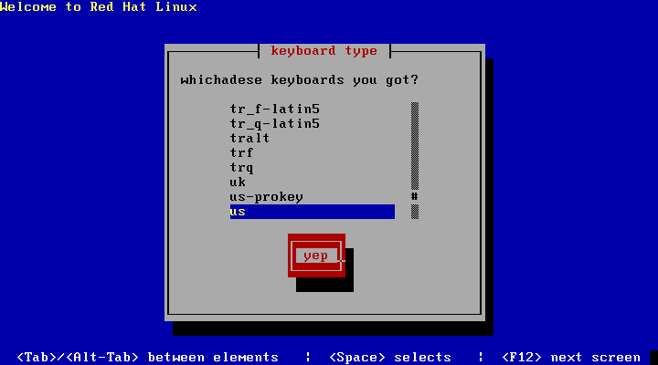  
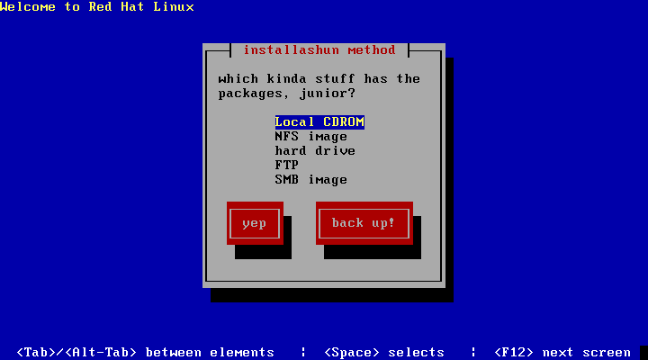  
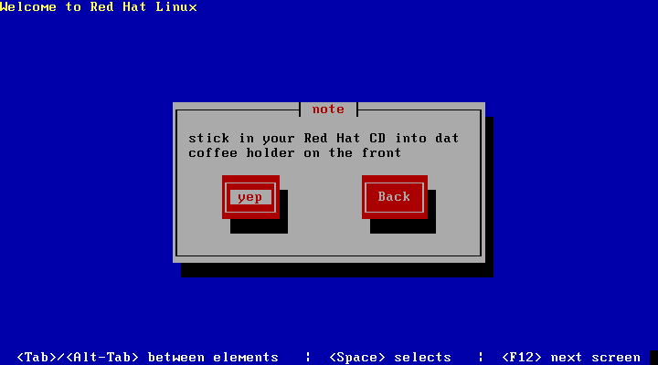  
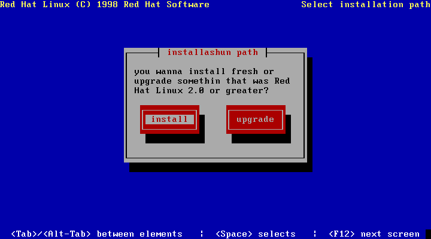  
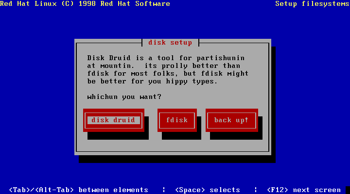  
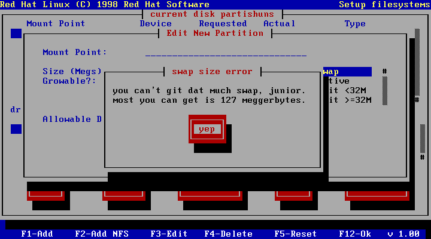  
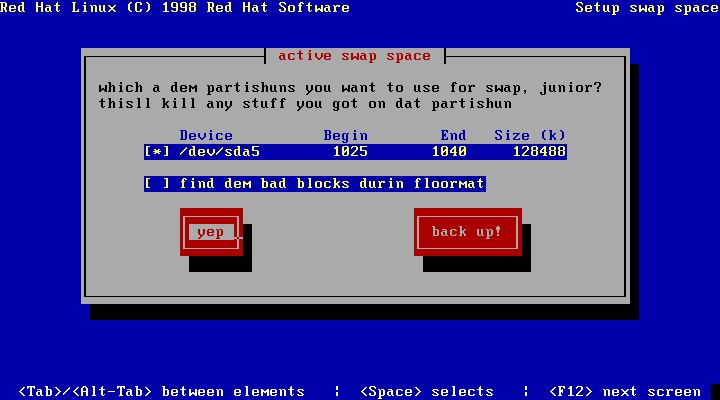  
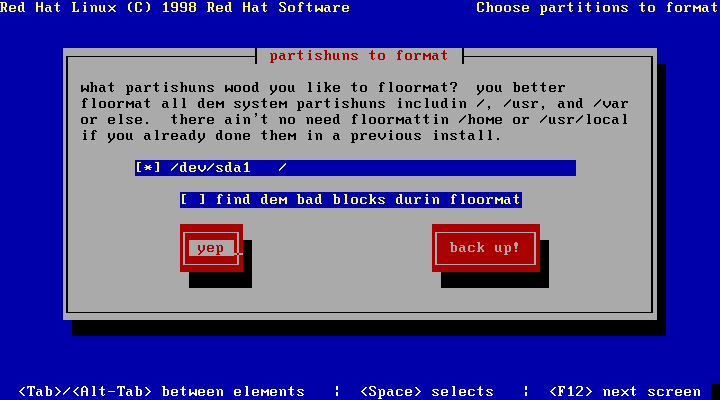  
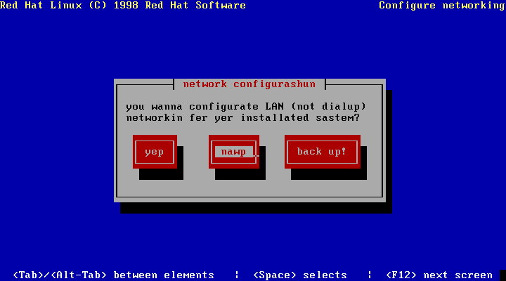  
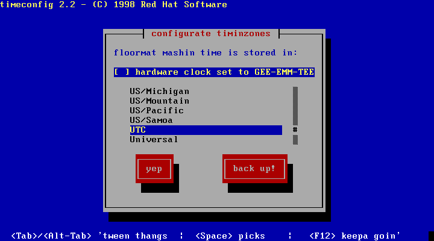  
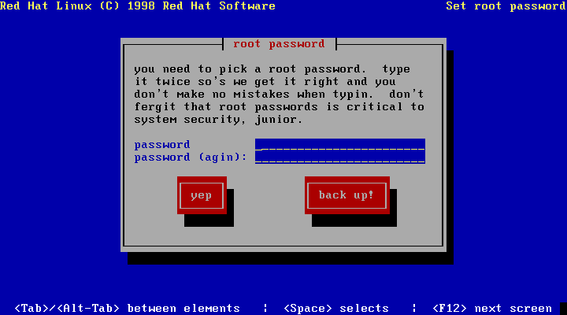  
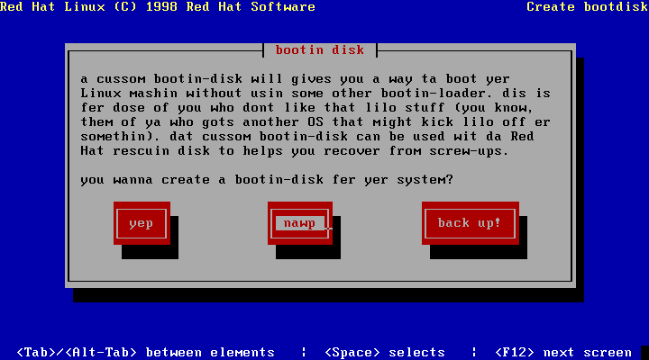  
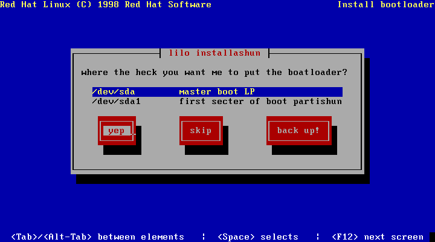  
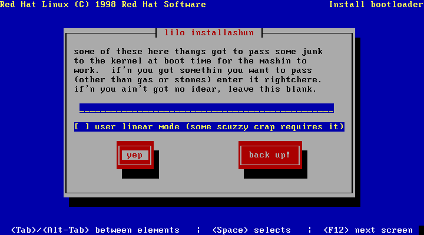  
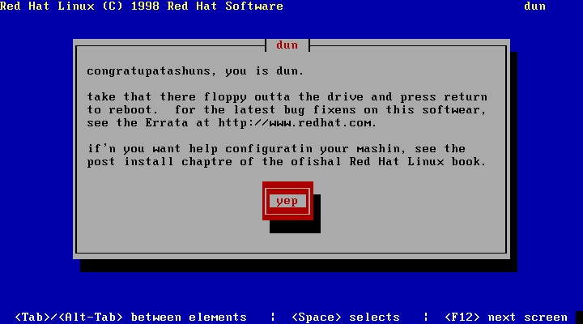  

- 2022-05-22 [List of hobbies - Wikipedia](https://en.wikipedia.org/wiki/List_of_hobbies)
> What ya gonna do next?

## Games
- 2022-06-11 [A Trail Tale](https://atrailtale.com/)
> A hiker game
- 2022-06-04 🎮 `FREE GAMES!` [Top games + source code from Gamedev.js Jam 2022 The GitHub Blog](https://github.blog/2022-05-31-top-games-source-code-from-gamedev-js-jam-2022/)
> The recently-ended Gamedev.js Jam 2022 encouraged game developers to create web games and share their sources on GitHub. GitHub Star @end3r shares the best 13 entries and sees what experts and other participants think of them.
- 2022-06-03 [Software Library: MS-DOS Games : Free Software : Free Download, Borrow and Streaming : Internet Archive](https://archive.org/details/softwarelibrary_msdos_games)
> Software for MS-DOS machines that represent entertainment and games. The collection includes action, strategy, adventure and other unique genres of game and entertainment software.
> Lots of MS-DOS GAMES!

## The X-Files
:::danger
Disclaimer: unverified controversy.
:::

- 2022-06-16 [The Cult in Google](https://medium.com/@kwilliamlloyd/the-cult-in-google-3c1a910214d1)
> I worked for Google for about three and a half years as a video producer. I was fired because I raised alarm about a doomsday cult that dominated my former team there.
- 2022-06-08 [Fallout 76 Developers Crunched Under ZeniMax’s Mismanagement](https://kotaku.com/bethesda-zenimax-fallout-76-crunch-development-1849033233)
> About pain and suffering, but now the game looks much better!

## TTY Linux
- 2022-06-18 [elfmz/far2l: Linux port of FAR v2](https://github.com/elfmz/far2l)
> Linux fork of FAR Manager v2 (http://farmanager.com/)
> Works also on OSX/MacOS and BSD (but later not tested on regular manner)
> BETA VERSION.
> Use on your own risk!
- 2022-06-17 [C/C++ Development Environment for Emacs](https://tuhdo.github.io/c-ide.html)
> In this guide, I will help you to setup an efficient working C/C++ environment. Despite looking long, the setup is short and easy

## Algorithms
- 2022-06-15 [That XOR Trick](https://florian.github.io//xor-trick/)
> There are a whole bunch of popular interview questions that can be solved in one of two ways: Either using common data structures and algorithms in a sensible manner, or by using some properties of XOR in a seemingly hard to understand way.

## Security/Cryptography
- 2022-06-14 [How to encrypt a big file using OpenSSL and someone's public key](https://www.czeskis.com/random/openssl-encrypt-file.html)

## Job hunt/interviews

## Projects
- 2022-06-17 [The World's Most Satisfying Checkbox Not Boring Software](https://www.andy.works/words/the-most-satisfying-checkbox)
> The basic checkbox serves its purpose dutifully. In truth, it was never designed to be the hero.
- 2022-06-15 [Cheat Sheet For If I'm Gone](https://thoughtscollected.tech/posts/for-when-im-gone/)
> The way that I run my home is inherently tied to technology and is therefore somewhat complex. Logins, investments, crypto, and warranties all need to be accessed in different ways. This complexity means that without someone that knows this information, getting things done in my absence would be extremely difficult if I was not able to help.
- 2022-06-15 [bypass-paywalls-chrome/README.md at master · iamadamdev/bypass-paywalls-chrome](https://github.com/iamadamdev/bypass-paywalls-chrome/blob/master/README.md)
> Bypass Paywalls is a web browser extension to help bypass paywalls for selected sites.
- 2022-06-12 [mbrlabs/Lorien: Infinite canvas drawing/whiteboarding app for Windows, Linux and macOS. Made with Godot.](https://github.com/mbrlabs/Lorien)
- 2022-06-10 [Timeline](https://timeline.knightlab.com/)
> Easy-to-make, beautiful timelines.
- 2022-06-10 [PlasmoHQ/plasmo: The browser extension framework](https://github.com/PlasmoHQ/plasmo)
> The Plasmo Framework is a battery-packed browser extension SDK made by hackers for hackers. Build your product and stop worrying about config files and the odd peculiarities of building browser extensions.
- 2022-06-09 [WebReflection/highlighted-code: A textarea builtin extend to automatically provide code highlights based on one of the languages available via highlight.js](https://github.com/WebReflection/highlighted-code)
> A textarea builtin extend to automatically provide code highlights based on one of the languages available via highlight.js.
- 2022-06-05 [Gitea - Git with a cup of tea](https://gitea.io/en-us/)
> A painless self-hosted Git service.
Gitea is a community managed lightweight code hosting solution written in Go. It is published under the MIT license.
- 2022-05-26 [Lee Holmes WebSockets from Scratch](https://www.leeholmes.com/websockets-from-scratch/)
> A bag pack with WebSockets!

## Markdown Chrome Extensions
- 2022-06-11 [Copy as Markdown - Chrome Web Store](https://chrome.google.com/webstore/detail/copy-as-markdown/nlaionblcaejecbkcillglodmmfhjhfi)
> Browser extension to copy hyperlinks, images, and selected text as Markdown
- 2022-06-11 [Copy as Markdown - Chrome Web Store](https://chrome.google.com/webstore/detail/copy-as-markdown/fkeaekngjflipcockcnpobkpbbfbhmdn)
> Copy as Markdown is a Chrome extension which can help you copy the following things as Markdown to your system clipboard
- 2022-06-11 [Copycat - Chrome Web Store](https://chrome.google.com/webstore/detail/copycat/jdjbiojkklnaeoanimopafmnmhldejbg)
> This extension creates a right-click menu to provide copy functionality, which is used by right-clicking on the supported content of pages.

## Fitness
- 2022-06-11 [How to Do a Handstand: Get Your First Handstand in 30 Days Nerd Fitness](https://www.nerdfitness.com/blog/a-beginners-guide-to-handstands/#handstand_progression_level_1)
> A handstand is one of the coolest exercises ever, but it’s also one of the most advanced moves to learn.

## Typescript/JavaScript
- 2022-06-07 `typescript` [trpc/trpc: 🧙‍♀️ End-to-end typesafe APIs made easy](https://github.com/trpc/trpc)
> tRPC allows you to easily build & consume fully typesafe APIs, without schemas or code generation.
- 2022-06-07 [BuilderIO/partytown: Relocate resource intensive third-party scripts off of the main thread and into a web worker. 🎉](https://github.com/BuilderIO/partytown)
> Partytown is a lazy-loaded library to help relocate resource intensive scripts into a web worker, and off of the main thread. Its goal is to help speed up sites by dedicating the main thread to your code, and offloading third-party scripts to a web worker.

## Identity Management
- 2022-06-07 [supertokens/supertokens-core: Open source alternative to Auth0 / Firebase Auth / AWS Cognito](https://github.com/supertokens/supertokens-core)
> Add secure login and session management to your apps. SDKs available for popular languages and front-end frameworks e.g. Node.js, Go, Python, React.js, React Native, Vanilla JS, etc.

## Security / Cryptography
- 2022-06-01 📺 [7 Cryptography Concepts EVERY Developer Should Know - YouTube](https://www.youtube.com/watch?v=NuyzuNBFWxQ)
- 2022-05-26 📺 [Dangerous Code Hidden in Plain Sight for 12 years - YouTube](https://www.youtube.com/watch?v=eTcVLqKpZJc)
- 2022-05-25 📺 [Don't make random HTTP requests. - YouTube](https://www.youtube.com/watch?v=RCJdPiogUIk)
- 2022-05-25 [A Glossary of Blind SSRF Chains – Assetnote](https://blog.assetnote.io/2021/01/13/blind-ssrf-chains/)
> Server Side Request Forgery occurs when you can coerce a server to make arbitrary requests on your behalf. As the requests are being made by the server, it may be possible to access internal resources due to where the server is positioned in the network. On cloud environments, SSRF poses a more significant risk due to the presence of metadata endpoints that may contain sensitive credentials or secrets.
- 2022-05-25 [GitLab 11.4.7 Remote Code Execution](https://liveoverflow.com/gitlab-11-4-7-remote-code-execution-real-world-ctf-2018/)
> SSRF targeting redis for RCE via IPv6/IPv4 address embedding chained with CLRF injection in the git:// protocol.
- 2022-05-25 [swisskyrepo/PayloadsAllTheThings: A list of useful payloads and bypass for Web Application Security and Pentest/CTF](https://github.com/swisskyrepo/PayloadsAllTheThings)
> A list of useful payloads and bypasses for Web Application Security. Feel free to improve with your payloads and techniques ! I ❤️ pull requests :)

## Retro
- 2022-06-06 [Windows 9x Video Minidriver HD+ OS/2 Museum](http://www.os2museum.com/wp/windows-9x-video-minidriver-hd/)
> The OS/2 Museum has made available the first version of a display driver disk for Windows 9x running on VirtualBox. The driver uses a linear framebuffer and supports 8/16/24/32bpp modes with resolutions up to 1920×1200 pixels (see more below). The driver
- 2022-05-28 [Running Windows 3.x - DOSBox Part 4](https://www.linuxandubuntu.com/home/running-windows-3x-dosbox-part-4)

## PowerShell
- 2022-05-29 [Base64 Encoder and Decoder Algorithm in PowerShell - with Examples - OpenTechTips](https://opentechtips.com/base64-algorithm-in-powershell-with-examples/)

## Watch me ;)
- 2022-06-02 [Priest 2011 film - Wikipedia](https://en.wikipedia.org/wiki/Priest_(2011_film))
> Priest is a 2011 American action horror film directed by Scott Stewart
> A centuries-long war between humans and vampires has devastated the planet's surface and led to a theocracy under an organization called The Church. Despite the vampires' vulnerability to sunlight, and all of mankind's technological advances, the vampires' greater strength and speed made them impossible to defeat until humanity sheltered them in giant walled cities and trained a group of elite warriors, the Priests, which turned the tide.
