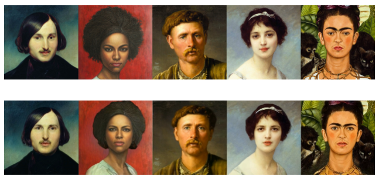

## Good Reads
- 2022-07-20 [Being on-call sucks — Bobbie Chen](https://bobbiechen.com/blog/2022/7/20/being-on-call-sucks)
> At tech companies, it is fairly common for developers to be "on-call". As Increment magazine (published by Stripe, a leading payment-processing software company) explains...
> ... A bit of on-call wisdom
- 2022-07-22 [What I don’t like about working at a remote job](https://www.priconceptions.com/notebook/remote-jobs-bad)
> Working remotely permanently had been my wish ever since my managers started calling me back into the office. There was no possible way I would suffer through hours of commuting to feel awkward in an office again.
> However, with time came getting used to my situation. Even in the best possible world, your brain is always seeking something better. Although I really, really love remote work (please don’t take it away from me), I’ve noticed some things that make me sad about it.
- 2022-06-28 [The Grug Brained Developer](https://grugbrain.dev/)
> A layman's guide to thinking like the self-aware smol brained

## How the things work
- 2022-07-20 [What happens when you press a key in your terminal?](https://jvns.ca/blog/2022/07/20/pseudoterminals/)
> I’ve been confused about what’s going on with terminals for a long time.
> But this past week I was using xterm.js to display an interactive terminal in a browser and I finally thought to ask a pretty basic question: when you press a key on your keyboard in a terminal (like Delete, or Escape, or a), which bytes get sent?
> As usual we’ll answer that question by doing some experiments and seeing what happens :)
- 2022-07-20 [Beej's Guides](https://beej.us/guide/)
> These guides look nice and clean
- [Beej's Guide to C](https://beej.us/guide/bgc/) [WIP]\
> This is a rather comprehensive guide to C for folks who already know how to program in another language. The first half of the book is written in a tutorial style, while the second half is a reference section complete with examples (inspired by the incomparable *Turbo C Bible*). The goal is to keep this up-to-date with the latest C standards.

## Fun
- 2022-07-20 [A Little Story About the `yes` Unix Command Matthias Endler](https://endler.dev/2017/yes/)
> What's the simplest Unix command you know?
> There's echo, which prints a string to stdout and true, which always terminates with an exit code of 0.
>
> Among the series of simple Unix commands, there's also yes. If you execute it without arguments, you get an infinite stream of y's, separated by a newline:
- 2022-07-20 [MegaPortraits: One-shot Megapixel Neural Head Avatars](https://samsunglabs.github.io/MegaPortraits/)

- 2022-06-22 [commitment/commit_messages.txt at master · ngerakines/commitment](https://github.com/ngerakines/commitment/blob/master/commit_messages.txt)
> Random commit messages
```
Derp
Derp search/replace fuckup
Derp, asset redirection in dev mode
Derp. Fix missing constant post rename
Derpy hooves
Do things better, faster, stronger
Does anyone read this? I'll be at the coffee shop accross the street.
Does not work.
Does this work
Don't Ask Me, I Have No Idea Why This Works Either
Don't push this commit
Don't tell me you're too blind to see
Done, to whoever merges this, good luck.
Don’t even try to refactor it.
Don’t mess with Voodoo
Duh
Easteregg
Either Hot Shit or Total Bollocks
Errare humanum est.
FONDLED THE CODE
FOR REAL.
FUCKING XUPPERNAMEX
Feed. You. Stuff. No time.
Final commit, ready for tagging
Fingers crossed!
Finished fondling.
First Blood
```


## Games

### Emacs Games abd fun stuff
- 2022-07-10 [Fun and Games in Emacs - Mastering Emacs](https://www.masteringemacs.org/article/fun-games-in-emacs)
> It’s yet another Monday and you’re hard at work on those TPS reports for your boss, Lumbergh. Why not play Emacs’s Zork-like text adventure game to take your mind off the tedium of work?
- `M-x hanoi-unix`
- `5x5`
- `M-x animate-birthday-present`
- `C-h f blackbox`
- `M-x bubbles-set-game-...`: (easy, medium, difficult, hard)
- `M-x doctor`
- `M-x dunnet` Emacs’s very own Zork-like text adventure game.
- `M-x gomoku`
- `M-x life`
- `M-x pong`
- `M-x snake`
- `M-x tetris`
- `M-x morse-region` and `M-x unmorse-region` -  translate a region into morse code
- `M-x dissociated-press` The Dissociated Press is a very simple command that applies something like a random walk markov-chain generator to a body of text in a buffer and generates nonsensical text from the source body.
- `M-x spook` - command inserts random words (usually into emails) designed to confuse/overload
- 2022-07-10 [EmacsWiki: Category Games](https://www.emacswiki.org/emacs/CategoryGames)

## The X-Files
:::danger
Disclaimer: unverified controversy.
:::

- 2022-07-20 [Microsoft investigates Teams outage as services drop for thousands of users Reuters](https://www.reuters.com/article/microsoft-outages-idCAKBN2OW03G)
> on a recent deployment that contained a broken connection to an internal storage service
> - really bad outage, but my Teams worked fine on that day
- 2022-07-11 [Did People Used To Look Older? - YouTube](https://www.youtube.com/watch?v=vjqt8T3tJIE)
- 2022-06-22 [The REAL Story On Why Space Cadet Pinball Was Removed ft. Windows on Itanium - YouTube](https://www.youtube.com/watch?v=3EPTfOTC4Jw)

## Projects
- 2022-07-20 ✏️ [Ok! So...](https://okso.app/)
> Just a drawing app!
- 2022-07-20 [StereoKit/StereoKit: An easy-to-use mixed reality library for building HoloLens and VR applications with C# and OpenXR!](https://github.com/StereoKit/StereoKit)
> StereoKit is an easy-to-use open source mixed reality library for building HoloLens and VR applications with C# and OpenXR! Inspired by libraries like XNA and Processing, StereoKit is meant to be fun to use and easy to develop with, yet still quite capable of creating professional and business ready software.
- 2022-07-18 [marktext/marktext: 📝A simple and elegant markdown editor, available for Linux, macOS and Windows.](https://github.com/marktext/marktext)
> MarkText is an MIT licensed open source project, and the latest version will always be downloadable for free from the GitHub release page.

### C# and PowerShell OCR with IronTesseract and Windows.Media.Ocr
- 2022-07-10 [C# OCR Image to Text Generator 125 Languages Pack IronOCR](https://ironsoftware.com/csharp/ocr/tutorials/how-to-read-text-from-an-image-in-csharp-net/)
```
using IronOcr;
var Result = new IronTesseract().Read(@"img\Screenshot.png");
Console.WriteLine(Result.Text);
```
- 2022-07-10 [OCR sample - Code Samples Microsoft Docs](https://docs.microsoft.com/en-us/samples/microsoft/windows-universal-samples/ocr/)
> Shows how to use Windows.Media.Ocr API. Optical character recognition (OCR) API allows for application developer to extract text in the specific language from an image.

- 2022-07-10 📌 [PowerShell-Misc/Get-Win10OcrTextFromImage.ps1 at master · HumanEquivalentUnit/PowerShell-Misc](https://github.com/HumanEquivalentUnit/PowerShell-Misc/blob/master/Get-Win10OcrTextFromImage.ps1)
> ! It worked!
- 2022-07-10 [ocr - call external powershell script using variables for script location and parameters - Stack Overflow](https://stackoverflow.com/questions/67129906/call-external-powershell-script-using-variables-for-script-location-and-paramete)
- 2022-07-10 [PowerShell Gallery root.psm1 1.1.0](https://www.powershellgallery.com/packages/PsOcr/1.1.0/Content/root.psm1)
```
 Add-Type -AssemblyName System.Runtime.WindowsRuntime
    
  # WinRT assemblies are loaded indirectly:
  $null = [Windows.Storage.StorageFile, Windows.Storage, ContentType = WindowsRuntime]
  $null = [Windows.Media.Ocr.OcrEngine, Windows.Foundation, ContentType = WindowsRuntime]
  $null = [Windows.Foundation.IAsyncOperation`1, Windows.Foundation, ContentType = WindowsRuntime]
  $null = [Windows.Graphics.Imaging.SoftwareBitmap, Windows.Foundation, ContentType = WindowsRuntime]
  $null = [Windows.Storage.Streams.RandomAccessStream, Windows.Storage.Streams, ContentType = WindowsRuntime]
  $null = [WindowsRuntimeSystemExtensions]
```

## Security / Cryptography
### X.509
- 2022-07-03 [Understanding X.509 digital certificate thumbprints Morgan Simonsen's Blog](https://morgansimonsen.com/2013/04/16/understanding-x-509-digital-certificate-thumbprints/#comments)
> I got an interesting question about X.509 certificate thumbprints today from a colleague. Specifically, he wanted to know if you could renew a certificate and keep the thumbprint. The answer is no, unfortunately. So I thought I would explain why you can’t.
- 2022-07-03 [How Certificates Work: Public Key; Security Services Microsoft Docs](https://docs.microsoft.com/en-us/previous-versions/windows/it-pro/windows-server-2003/cc776447(v=ws.10)?redirectedfrom=MSDN)
> Digital certificates are electronic credentials that are used to assert the online identities of individuals, computers, and other entities on a network. Digital certificates function similarly to identification cards such as passports and drivers licenses. They are issued by certification authorities (CAs) that must validate the identity of the certificate-holder both before the certificate is issued and when the certificate is used. Common uses include business scenarios requiring authentication, encryption, and digital signing.
- 2022-07-03 [Cryptography - Win32 apps Microsoft Docs](https://docs.microsoft.com/en-us/windows/win32/seccrypto/cryptography-portal?redirectedfrom=MSDN)
> Microsoft cryptographic technologies include CryptoAPI, Cryptographic Service Providers (CSP), CryptoAPI Tools, CAPICOM, WinTrust, issuing and managing certificates, and developing customizable public key infrastructures. Certificate and smart card enrollment, certificate management, and custom module development are also described.

### Web Authentication API
- 2022-06-26 [Web Authentication API - Web APIs MDN](https://developer.mozilla.org/en-US/docs/Web/API/Web_Authentication_API)
> Secure context: This feature is available only in secure contexts (HTTPS), in some or all supporting browsers.
- 2022-06-26 [Guide to Web Authentication](https://webauthn.guide/?utm_source=programmingdigest&utm_medium=email&utm_campaign=478)
> While Web Authentication is an important tool, it is always important to remember that security is not a single technology; it is a way of thinking that should be incorporated into every step of how software is designed and developed.

## HTML to Markdown
- 2022-07-03 [mysticmind/reversemarkdown-net: ReverseMarkdown.Net is a Html to Markdown converter library in C#. Conversion is very reliable since HtmlAgilityPack HAP library is used for traversing the Html DOM](https://github.com/mysticmind/reversemarkdown-net)
>ReverseMarkdown is a Html to Markdown (http://daringfireball.net/projects/markdown/syntax) converter library in C#. Conversion is very reliable since
>HtmlAgilityPack (HAP) library is used for traversing the Html DOM.
- 2022-07-03 [breakdance/breakdance: It's time for your markup to get down! HTML to markdown converter. Breakdance is a highly pluggable, flexible and easy to use.](https://github.com/breakdance/breakdance)
> Breakdance is a node.js library for converting HTML to markdown. Highly pluggable, flexible and easy to use. It's time for your markup to get down.
- 2022-07-03 [Malabarba/html-to-markdown: HTML to Markdown converter written in emacs-lisp.](https://github.com/Malabarba/html-to-markdown)
> HTML to Markdown converter written in Emacs-lisp.
> This package defines two main functions: html-to-markdown and html-to-markdown-string.
> The functions are written entirely in Emacs-lisp (which means they'll work on any platform with no external dependencies), and they convert HTML source code into Markdown format. Of course, HTML has many more features than Markdown, so any tags that can't be converted are left as-is (or deleted, if the user so requests).
- 2022-07-03 📌 [island205/h2m: Tool for converting HTML to Markdown, like html2markdown.](https://github.com/island205/h2m)
> Tool for converting HTML to Markdown, like html2markdown.
> online converter: http://island205.github.io/h2m/
- 2022-07-03 [netgusto/upndown: HTML to Markdown javascript converter](https://github.com/netgusto/upndown)
> JavaScript HTML to Markdown converter, for Node.js and the browser.
- 2022-07-03 [mixmark-io/turndown: 🛏 An HTML to Markdown converter written in JavaScript](https://github.com/mixmark-io/turndown)
> Convert HTML into Markdown with JavaScript.
- 2022-07-03 [kates/html2markdown: Converts HTML to Markdown](https://github.com/kates/html2markdown)
> HTML2Markdown
> JavaScript implementation for converting HTML to Markdown text. Browser and Node.js support.
- 2022-07-03 [showdownjs/showdown: A bidirectional Markdown to HTML to Markdown converter written in Javascript](https://github.com/showdownjs/showdown)
> Showdown is a JavaScript Markdown to HTML converter, based on the original works by John Gruber. Showdown can be used client side (in the browser) or server side (with Node.js).

## TTY UI
- 2022-06-25 [ggerganov/imtui: ImTui: Immediate Mode Text-based User Interface C++ Library](https://github.com/ggerganov/imtui)
> Use Git or checkout with SVN using the web URL.
- 2022-06-25 [ArthurSonzogni/FTXUI: C++ Functional Terminal User Interface.](https://github.com/ArthurSonzogni/FTXUI)
> Use Git or checkout with SVN using the web URL.
- 2022-07-07 [migueldeicaza/gui.cs: Console-based user interface toolkit for .NET applications.](https://github.com/migueldeicaza/gui.cs)

## Retro
### Random Retro Neko!
- 2022-07-11 [*NEKO* Welcome to the Web Neko Server!](https://webneko.net/?rose)
> It's Neko! (3.0)
> Hi, I'm Neko. If you want to play chase the mouse, just click on me..
> To stop playing, click me again.
- 2022-07-11 [Linux / Unix Desktop Fun: Cat And Mouse Chase All Over Your Screen - nixCraft](https://www.cyberciti.biz/open-source/oneko-app-creates-cute-cat-chasing-around-your-mouse/)
> Oneko is a little fun app. It will change your cursor into mouse and creates a little cute cat and the cat start chasing around your mouse cursor. The word “neko” means “cat” in Japanese and it was originally written by a Japanese author as a Macintosh desktop accessory.
- 2022-07-11 [leiqunni/Neko98: Neko for Windows is a little white cat who runs around on the desktop and chases the mouse cursor.](https://github.com/leiqunni/Neko98)
> Neko for Windows is a little white cat who runs around on the desktop and chases the mouse cursor. You can customize how Neko appears in many ways, and can even make him run on top of all other windows. Neko was ported by me from the original X-Windows source code that was written by Masayuki Koba.
- 2022-07-11 [crgimenes/neko: Neko is a cross-platform open-source animated cursor-chasing cat. This is the reimplementation write in Go.](https://github.com/crgimenes/neko)

###  Nyan Cat


- 2022-06-26 [cristurm/nyan-cat: Nyan Cat made with HTML5+CSS3+JavaScript](https://github.com/cristurm/nyan-cat)
> Use Git or checkout with SVN using the web URL.
- 2022-06-26 [Nyan Cat - HTML5+CSS3+JS](http://cristurm.github.io/nyan-cat/)
- 2022-06-25 [koron/nyancat-vim](https://github.com/koron/nyancat-vim)
- 2022-06-25 [NYAN.CAT!](https://www.nyan.cat/index.php?cat=elevator)
- 2022-06-25 [Thailand Nyan Cat Emojis & Text Copy & Paste](https://emojicombos.com/thailand-nyan-cat)
- 2022-07-07 [nyan/nyanCat/Resources at master · SFFan123/nyan](https://github.com/SFFan123/nyan/tree/master/nyanCat/Resources)

## Watch me ;)

- 2022-07-23 [Richard Stallman Free Software and the GNU General Public License - YouTube](https://www.youtube.com/watch?v=VpCfN5NSIcQ)
- 2022-06-26 [Sorting Algorithms: Speed Is Found In The Minds of People - Andrei Alexandrescu - CppCon 2019 - YouTube](https://www.youtube.com/watch?v=FJJTYQYB1JQ)
> [SHEDLOAD](https://dictionary.cambridge.org/us/dictionary/english/shedload)
>  Don't do extra work. Extra work is not compensated in computer science, it is not like in school.
> This `goto` is the most honorable thing I've done in my life! So I stand by it!
> Always* use infinite loops.
> *except in most cases
- 2022-06-24 [Branchless Programming in C++ - Fedor Pikus - CppCon 2021 - YouTube](https://www.youtube.com/watch?v=g-WPhYREFjk)
- 2022-07-07 [Scott Hanselman - Developing for Linux on Windows - NDC Porto 2022 - YouTube](https://www.youtube.com/watch?v=tuhzVDc0Slg)
