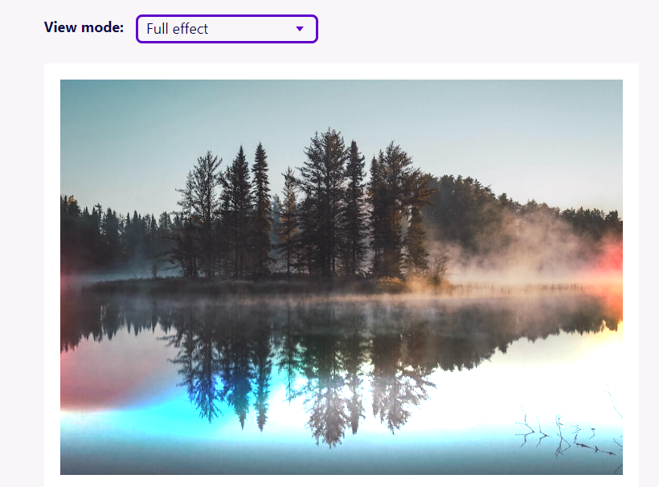

## Good Reads / Videos

- 2022-08-11 [The Missing Semester of Your CS Education · the missing semester of your cs education](https://missing.csail.mit.edu/)
- 2022-08-12 [Seven Things I Learnt Doing Stand-Up Comedy Michael Gomes Vieira](https://michaelgv.uk/posts/2022/08/seven-things-i-learnt-doing-stand-up-comedy/)
> From March to April 2022 I took part in a 6 week stand-up comedy course for beginners at The Comedy Store in Central London. At the end of the course, myself and the other comedians performed a 5 minute set in front of an audience of over 150 people. Here are some of the things that I learnt from taking part in the course.
- 2022-08-21 [Shifting Our API's Pagination Method: From Offset to Cursor-Based](https://www.moderntreasury.com/journal/shifting-our-apis-pagination-method-from-offset-to-cursor-based)
> Cursor based pagination works a bit differently. A cursor is a value that references an entry, and can be thought of like a divider in a filing cabinet—it separates the content that comes before it from the content that comes after it. The cursor given by the server will reference the next entry that comes after the last entry you received from the server response. To use our earlier alphabet example, after you receive the first set of results for A, B, and C, the cursor is set at D—the next entry that comes after the last entry you received.
- 2022-08-27 [André Staltz - Time Till Open Source Alternative](https://staltz.com/time-till-open-source-alternative.html)
  - [argosopentech/argos-translate: Open-source offline translation library written in Python](https://github.com/argosopentech/argos-translate)
  > Open-source offline translation library written in Python
  - 2022-08-27 [Bitwarden Open Source Password Manager Bitwarden](https://bitwarden.com/)
  > Password Manager
  > Move fast and securely with the password manager trusted by millions.
  > Drive collaboration, boost productivity, and experience the power of open source with Bitwarden, the easiest way to secure all your passwords and sensitive information.
- 2022-08-30 [Cost of a integer cast in Go Ben E. C. Boyter](https://boyter.org/posts/cost-of-integer-cast-in-go/)
> Recently have been doing interviews at work for Go developers.
>
> The filter for this is a simple review exercise. We present a small chunk of code and ask them to review it over 15 minutes pointing out any issues they see. The idea is to respect their and our time. It works pretty well and we can determine how much experience someone has by their ability to pick up the obvious vs subtle bugs.
- 2022-09-06 [Yak Shaving: A Short Lesson on Staying Focused - American Express Technology](https://americanexpress.io/yak-shaving/)
> Yak shaving is a term used to describe the process of working on a task that requires a series of other tasks to be completed first. The term originated in the 1970s when a programmer would have to shave a yak to make a rug before he could use the rug to sit on while he programmed.

## Retro

- 2022-08-12 [Windows 3.1](https://codepen.io/matthijss/pen/wzYjJQ)
- 2022-08-12 [XP.css - A design system for building faithful recreations of old UIs](https://botoxparty.github.io/XP.css/#dropdown)
- 2022-08-12 [98.css - A design system for building faithful recreations of old UIs](https://jdan.github.io/98.css/)
- 2022-08-12 [system.css A design system for building retro Apple-inspired interfaces](https://sakofchit.github.io/system.css/)
- 2022-08-12 [casualwriter/casual-markdown-page: Markdown as Web Page/Site](https://github.com/casualwriter/casual-markdown-page)
- 2022-08-30 [Oregon Trail Game 1990](https://archive.org/details/msdos_Oregon_Trail_The_1990)
- 2022-08-30 [90's Cursor Effects](https://tholman.com/cursor-effects/)
> A collection of cursor effects, inspired by the 90's.
- 2022-09-18 [The Twisted Life of Clippy Seattle Met](https://www.seattlemet.com/news-and-city-life/2022/08/origin-story-of-clippy-the-microsoft-office-assistant)
> In the ’90s, Microsoft created an annoying paperclip that it quickly retired. Its developers never imagined the virtual assistant would become a cultural icon.
> “What a lot of people don’t understand is, in the ’90s, the majority of people had not touched a computer,” says Fries. “They didn’t know how a menu worked.” Fries, who’d ascended to program manager at the company, and her colleague Barry Linnett decided they would need to think outside all those dialog boxes to reach beginners.

## Web / JavaScript

- 2022-06-24 [Copy HTML with native Clipboard API - SteGriff](https://stegriff.co.uk/upblog/copy-html-with-native-clipboard-api/)

My experimental snippet:
```js
(async () => {
    function sleep(ms) {
        return new Promise((resolve, reject) => {
            setTimeout(resolve, ms)
        })
    }

    function setClipboard(html) {
    const type = "text/html";
    const blob = new Blob([html], { type });
    const data = [ new ClipboardItem({ [type]: blob })];

    navigator.clipboard.write(data).then(
        function () {
            console.log("Done");
        },
        function (err) {
            console.error(err);
        }
    );
    }
    console.log("Wait");
    await sleep(3000);
    console.log("Go!");
    setClipboard(String.raw`
<table>
<tr>
<td><b>Hello</b></td><td>World</td>
</tr>
<tr>
<td><b>Done</b></td><td>AAA</td>
</tr>
</table>
`);

})()
```
- 2022-09-03 [Building an aircraft radar system in JavaScript Charlie Gerard](https://charliegerard.dev/blog/aircraft-radar-system-rtl-sdr-web-usb/)
> I’ve been interested in building a radar system for a while now. I’ve been following the development of the RTL-SDR for a while, and I’ve been wanting to build a system that uses it. I’ve also been wanting to build a web app that uses WebUSB to communicate with a USB device. So I decided to combine the two and build a web app that uses a RTL-SDR to display aircraft on a map.


## CSS

- 2022-07-12 [Holograms, light-leaks and how to build CSS-only shaders - Robb Owen](https://robbowen.digital/wrote-about/css-blend-mode-shaders/?utm_source=programmingdigest&utm_medium=email&utm_campaign=480)
```
I might be understating it a bit, but WebGL is a big deal. You only need to spend five minutes on one of the many design awards sites to see site-after-site fully leaning into the power of canvas. Tools like threejs bring the power of 3D and GLSL shaders to the browser and, with that, a whole new level of visual effects.
```

- 2022-08-26 [Create a 3D CSS Printer that Actually Prints! - SitePoint](https://www.sitepoint.com/3d-css-printer/)
- 2022-08-26 [3D CSS Plane 😎 Tap to Toggle + Mouse Move Parallax](https://codepen.io/jh3y/pen/NWdNMBJ)
- 2022-08-26 [CSS 3D Print Shop 😁](https://codepen.io/jh3y/pen/JjEegBK)
- 2022-09-17 [MVP.css - Minimalist stylesheet for HTML elements](https://andybrewer.github.io/mvp/?utm_source=hackernewsletter&utm_medium=email&utm_term=design)
> A minimalist stylesheet for HTML elements
> No class names, no frameworks, just semantic HTML and you're done.


## C# / .NET

- 2022-08-26 🤩 [SharpLab](https://sharplab.io/)
> SharpLab is an interactive playground for .NET code. It allows you to run and debug your C# code directly in the browser. It also allows you to share your code with others and see their changes in real-time.
- 2022-08-26 [ashmind/SharpLab: .NET language playground](https://github.com/ashmind/SharpLab)
- 2022-08-30 [badamczewski/PowerUp: ⚡ Decompilation Tools and High Productivity Utilities ⚡](https://github.com/badamczewski/PowerUp)
> PowerUp is a collection of productivity utilities, disassembly and decompilation tools for multiple languages and platforms.
> The project features the following utilities and tools:
  - Live IDE Watcher (For C#, F#, GO, Rust and C++ (clang)).
  - .NET JIT Dissasembler.
  - .NET IL Compiler.
  - .NET Console with rich formatting.

- 2022-09-02 [C# does Shell, Part 3 - CodeProject](https://www.codeproject.com/Articles/3728/Csharp-does-Shell-Part-3)
> This article is about Application Desktop Toolbars, which are applications that can align to the screen much like the taskbar. The article will develop a base class for developing such apps.


## Projects
- 2022-08-30 [1 week of Stable Diffusion multimodal.art](https://multimodal.art/news/1-week-of-stable-diffusion)
- 2022-07-29 [tabler/tabler: Tabler is free and open-source HTML Dashboard UI Kit built on Bootstrap](https://github.com/tabler/tabler)
- 2022-08-14 [diimdeep/awesome-split-keyboards: A collection of ergonomic split keyboards ⌨](https://github.com/diimdeep/awesome-split-keyboards)
 
- 2022-08-16 [No-Signup Tools](https://www.nosignup.tools/)
> No-Signup Tools is a collection of tools that don't require you to create an account to use them. It's a great resource for developers and designers who want to quickly test something without having to create an account.
- 2022-08-22 [7 Colour E-Ink Display For Raspberry Pi Inky Impression 5.7" 7 Colour ePaper/eInk HAT - Tutorial Australia](https://core-electronics.com.au/guides/colour-e-ink-display-raspberry-pi/)
- 2022-08-22 [Inky Impression 5.7" 7 colour ePaper/eInk HAT - PiShop.us](https://www.pishop.us/product/inky-impression-5-7-7-colour-epaper-eink-hat/)
> The Inky Impression is a 5.7" 7 colour ePaper/eInk HAT for the Raspberry Pi. It's a great way to add a high quality display to your Raspberry Pi project. The Inky Impression is a 5.7" 7 colour ePaper/eInk HAT for the Raspberry Pi. It's a great way to add a high quality display to your Raspberry Pi project.
- 2022-08-25 [Programming Idioms](https://www.programming-idioms.org/)
> Programming Idioms is a collection of common programming idioms, each with a simple example in a variety of languages. It's a great resource for developers who want to learn a new language or just want to see how a common task is done in a different language.
- 2022-08-26 📌 [Emojicode](https://www.emojicode.org/)
> Emojicode is a programming language that uses emojis as its syntax. It is designed to be easy to learn and fun to use. Emojicode is open source and available under the MIT license.


## GO
- 2022-09-16 [golang-design/clipboard: 📋 cross-platform clipboard package that supports accessing text and image in Go macOS/Linux/Windows/Android/iOS](https://github.com/golang-design/clipboard)

## Emacs

- 2022-07-18 ⭐ [emacs-tw/awesome-emacs: A community driven list of useful Emacs packages, libraries and other items.](https://github.com/emacs-tw/awesome-emacs#c)
- 2022-07-23 [fourier/borland-blue-theme: Emacs Theme based on Borland Turbo C for DOS](https://github.com/fourier/borland-blue-theme)
> Installation
> Easiest way to install using MELPA. If you have MELPA installed, run
```
M-x package-install RET borland-blue-theme RET
```
> Alternatively put the this directory to the custom-theme-load and add the following to your init file:
```
(push (substitute-in-file-name "~/.emacs.d/borland-blue-theme/") custom-theme-load-path)
(load-theme 'borland-blue t)
```
- 2022-07-18 [Markdown Mode for Emacs](https://jblevins.org/projects/markdown-mode/)
> markdown-mode is a major mode for editing Markdown-formatted text.
- 2022-07-29 [M-x emacs-reddit](https://www.reddit.com/r/emacs/)
- 2022-07-29 [rougier/nano-theme: GNU Emacs / N Λ N O Theme](https://github.com/rougier/nano-theme)
- 2022-07-29 [EmacsConf and Emacs hangouts - YouTube](https://www.youtube.com/c/EmacsConf/videos)

## Media - Images

- 2022-07-29 [Buttery Smooth "10fps" – Wunk](https://wunkolo.github.io/post/2020/02/buttery-smooth-10fps/)
```
When I am making animations, with the intent of ultimately becoming a GIF file on the internet, I pretty much always target 50 fps.
```


## Media FFmpeg

- 2022-07-05 [FFmpeg cheat sheet for 360 video](https://gist.github.com/nickkraakman/e351f3c917ab1991b7c9339e10578049)

### Visual Studio DTE in Powershell

Control Visual Studio from Powershell using the DTE (Development Tools Environment) COM Object.

- 2022-08-06 [.net - How to use DTE in PowerShell? - Stack Overflow](https://stackoverflow.com/questions/15210806/how-to-use-dte-in-powershell)

```
I found a simple answer by playing with the idea in ISE for a little while.

Basically, the call to GetActiveObject returns a COM object, which can be used directly in PowerShell. After executing LoadDTELibs, you can get an instance of DTE by calling GetActiveObject and then refer to the result directly.

So...
```

```powershell
PS> $dte = [System.Runtime.InteropServices.Marshal]::GetActiveObject("VisualStudio.DTE.11.0")
```

```powershell
PS> $dte = [System.Runtime.InteropServices.Marshal]::GetActiveObject("VisualStudio.DTE")
```

```
PS> $dte.solution.Create("D:\Testing", "Acme.sln")
PS> $dte.solution.SaveAs("D:\Testing\Acme.sln")
```

- 2022-08-06 [#PSTip Get a list of all Com objects available](https://powershellmagazine.com/2013/06/27/pstip-get-a-list-of-all-com-objects-available/)
```
Get-ChildItem HKLM:\Software\Classes -ErrorAction SilentlyContinue | Where-Object {
	$_.PSChildName -match '^\w+\.\w+$' -and (Test-Path -Path "$($_.PSPath)\CLSID")
} | Select-Object -ExpandProperty PSChildName
```

- 2022-08-06 [DTE Interface EnvDTE Microsoft Docs](https://docs.microsoft.com/en-us/dotnet/api/envdte.dte?view=visualstudiosdk-2022)
```
Sub DTEExample()
    Dim objTextDoc As TextDocument
    Dim objEP As EditPoint

    ' Create a new text document.
    DTE.ItemOperations.NewFile("General\Text File")
    ' Get a handle to the new document.
    Set objTextDoc = DTE.ActiveDocument.Object("TextDocument")
    Set objEP = objTextDoc.StartPoint.CreateEditPoint
    ' Create an EditPoint and add some text.
    objEP.Insert "A test sentence."
End Sub
```

```
$dte.ActiveDocument | Get-Member -MemberType All
```

## Cheatsheets

- 2022-08-18 [C# Cheatsheet](https://gist.github.com/jwill9999/68c0da6c4c58efb42e25f887152256e1)
- 2022-08-18 [Kotlin Programming Language Cheat Sheet Part 1](https://gist.github.com/dodyg/5823184)
- 2022-08-21 [Microsoft Azure Administrator Associate AZ-104 Cheat Sheet - Blog](https://www.testpreptraining.com/blog/microsoft-azure-administrator-associate-az-104-cheat-sheet/)
> Just an idea to organize all the links
- 2022-08-21 [SSH - Cheat Sheet](https://www.marcobehler.com/guides/ssh-cheat-sheet)
- 2022-08-21 [SSH Cheatsheet – CheatSheet](https://cheatsheet.dennyzhang.com/cheatsheet-ssh-a4)

## SSH

- 2022-08-21 [Improving the security of your SSH private key files — Martin Kleppmann’s blog](https://martin.kleppmann.com/2013/05/24/improving-security-of-ssh-private-keys.html)
```
A better solution is to use ssh-keygen -o.
```

- 2022-08-21 [Use ssh-keygen to create SSH key pairs and more](https://www.techtarget.com/searchsecurity/tutorial/Use-ssh-keygen-to-create-SSH-key-pairs-and-more)
```
PS c:> type $env:USERPROFILE\.ssh\id_rsa.pub | ssh peter@192.0.2.16 "cat >> .ssh/authorized_keys"
```

## JWT

- 2022-08-13 [Decode JWT in JS](https://jrxcodes.com/how-to-decode-jwt-in-javascript)
- 2022-08-13 [Decode JWT access and id tokens via PowerShell Blog](https://www.michev.info/Blog/Post/2140/decode-jwt-access-and-id-tokens-via-powershell)

### Screen capture API
Record screen video with Screen Capture API
- 2022-08-28 [Using the Screen Capture API - Web APIs MDN](https://developer.mozilla.org/en-US/docs/Web/API/Screen_Capture_API/Using_Screen_Capture)
- 2022-08-28 [Screen Capture on your browser with ffmpeg.wasm by dannadori Medium](https://dannadori.medium.com/screen-capture-on-your-browser-with-ffmpeg-wasm-b9ce333067aa)
```
Until a while ago, I was a Linux user and I used ffmpeg to make gif animations for my Blog. I recently moved to Windows and was wondering how I could make a gif animation. I found out that I could make them with ffmpeg for Windows.
```

## Games - Factorio
- 2022-09-17 📌 [Factorio Cheat Sheet](https://factoriocheatsheet.com/#belts)
- 2022-09-17 [deniszholob/factorio-cheat-sheet: Cheat Sheet for Factorio](https://github.com/deniszholob/factorio-cheat-sheet)
- 2022-09-17 [Factorio Calculator](https://kirkmcdonald.github.io/calc.html#data=1-1-19&mprod=10&items=iron-ore:r:15)


## Watch
- 2022-09-18 [Excel Esports: ALL-STAR BATTLE - YouTube](https://www.youtube.com/watch?v=x1RVNGDSdw4)
> Competitive Excel is a thing.
- 2022-08-26 [Programming’s Greatest Mistakes - Mark Rendle - NDC Copenhagen 2022 - YouTube](https://www.youtube.com/watch?v=qC_ioJQpv4E)
> The biggest mistake in programming is not learning from your mistakes.
- 2022-09-05 [Beverly Crusher - Full Performance Live on KEXP - YouTube](https://www.youtube.com/watch?v=bT-oFqCjcqc)
> Local Seattle band
