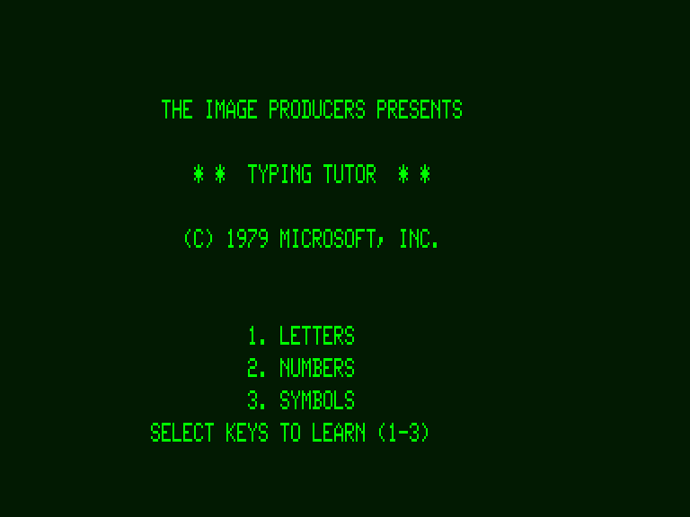

## AI Generated Aww of the moth


## Wiki Updates:

Added [docs/psy/Nonviolent Communication.md](/docs/psy/Nonviolent%20Communication)
> **Nonviolent Communication (NVC)** is an approach to communication based on principles of nonviolence. It is not a technique to end disagreements, but rather a method designed to increase empathy and improve the quality of life of those who utilize the method and the people around them.


Added [docs/self-hosted/video-streaming-owncast.md](/docs/self-hosted/video-streaming-owncast)
> **Owncast** is a self-hosted live video and web chat server for use with existing popular broadcasting software.


## Good Reads / Videos

- 2022-10-08 [How Ray Tracing Modern CGI Works And How To Do It 600x Faster - YouTube](https://www.youtube.com/watch?v=gsZiJeaMO48)
> Informative video about ray tracing in 3D graphics.
- 2022-10-04 [The Illustrated Stable Diffusion – Jay Alammar – Visualizing machine learning one concept at a time.](https://jalammar.github.io/illustrated-stable-diffusion/)
> AI image generation is the most recent AI capability blowing people’s minds (mine included). The ability to create striking visuals from text descriptions has a magical quality to it and points clearly to a shift in how humans create art. The release of Stable Diffusion is a clear milestone in this development because it made a high-performance model available to the masses (performance in terms of image quality, as well as speed and relatively low resource/memory requirements).


## Fun
- 2022-10-08 [js13kGames 2022 winners 🏆 The GitHub Blog](https://github.blog/2022-10-06-js13k-2022-winners/)
> 🎮🎮🎮🎮🎮🎮🎮🎮🎮🎮🎮🎮🎮
> Amazing Games, I've played Dante, Soul Surf, DEAD AGAIN.
- 2022-10-03 [webrcade/webrcade: Feed-driven gaming](https://github.com/webrcade/webrcade)


- 2022-10-08 [joschuck/matrix-webcam: Take your video conference from within the matrix.](https://github.com/joschuck/matrix-webcam?utm_source=hackernewsletter&utm_medium=email&utm_term=fun)


## The X-Files
- 2022-10-08 [Jewish Calendar](https://stevemorse.org/hebrewcalendar/hebrewcalendar.htm)
> About how the Jewish Calendar works.
- 2022-10-05 [Kubernetes Hardening Guide](https://media.defense.gov/2022/Aug/29/2003066362/-1/-1/0/CTR_KUBERNETES_HARDENING_GUIDANCE_1.2_20220829.PDF)
> National Security Agency Cybersecurity and Infrastructure Security Agency Cybersecurity Technical Report
> Not exactly an X-File...


## Retro

- 2022-10-08 [Microsoft Typing Tutor](https://www.classic-computers.org.nz/system-80/software-manuals/manuals-Typing-Tutor.pdf)



## Web / JavaScript

## JavaScript Libraries
- 2022-10-09 [Day.js · 2kB JavaScript date utility library](https://day.js.org/)
> Day.js is a minimalist JavaScript library that parses, validates, manipulates, and displays dates and times for modern browsers with a largely Moment.js-compatible API.


## CSS


## C# / .NET


## Projects and Tools

- 2022-10-08 [AykutSarac/jsoncrack.com: 🔮 Seamlessly visualize your JSON data instantly into graphs; paste, import or fetch!](https://github.com/AykutSarac/jsoncrack.com)
- 2022-10-08 [parvardegr/sharing: Sharing is a command-line tool to share directories and files from the CLI to iOS and Android devices without the need of an extra client app](https://github.com/parvardegr/sharing)
> very simple http based desktop/phone sharing tool
- 2022-10-05 [42wim/matterbridge](https://github.com/42wim/matterbridge)
> bridge between mattermost, IRC, gitter, xmpp, slack, discord, telegram, rocketchat, twitch, ssh-chat, zulip, whatsapp, keybase, matrix, microsoft teams, nextcloud, mumble (go lang)


## GO

## Emacs
- 2022-10-08 [Get Things Done with Emacs](https://www.labri.fr/perso/nrougier/GTD/index.html?utm_source=hackernewsletter&utm_medium=email&utm_term=code)
> How to organize your life with Emacs

## Security
- 2022-10-08 [Penetration testing wireless keyboards: Are your devices vulnerable?](http://kth.diva-portal.org/smash/record.jsf?pid=diva2%3A1701492&dswid=1463)
- [PDF Penetration testing wireless keyboards](https://kth.diva-portal.org/smash/get/diva2:1701492/FULLTEXT01.pdf)
- 2022-10-08 [Penetration testing wireless keyboards Hacker News](https://news.ycombinator.com/item?id=33123406)
```
Summary of the results (page 137):
  Protocol   Sniffing   Injection
  Plexgear   Yes        Yes
  Rapoo      Yes        Yes
  Logitech   No         Yes
  Corsair    Yes        Yes
  iiglo      Yes        Yes
  Exibel     Yes        Yes
  Razer      No         No
```

## Azure 

- 2022-10-07 [Managed Identities with Azure AD Active Directory Tutorial - YouTube](https://www.youtube.com/watch?v=sA_mXKy_dKU)

## Cheat Sheets
- 2022-10-05 [x64 Cheat Sheet](https://cs.brown.edu/courses/cs033/docs/guides/x64_cheatsheet.pdf)
> Assembly language cheat sheet for x64 architecture
