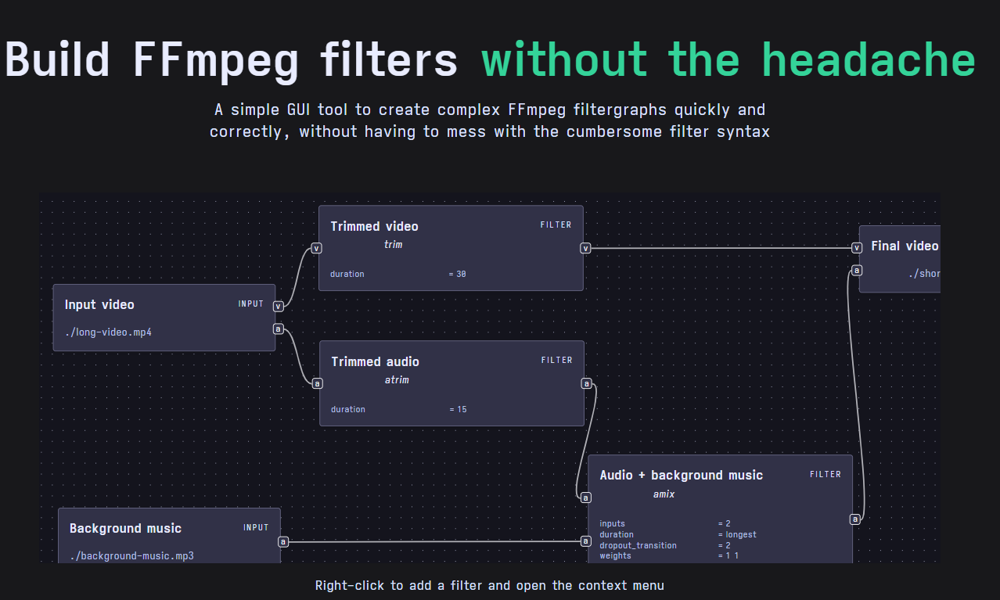
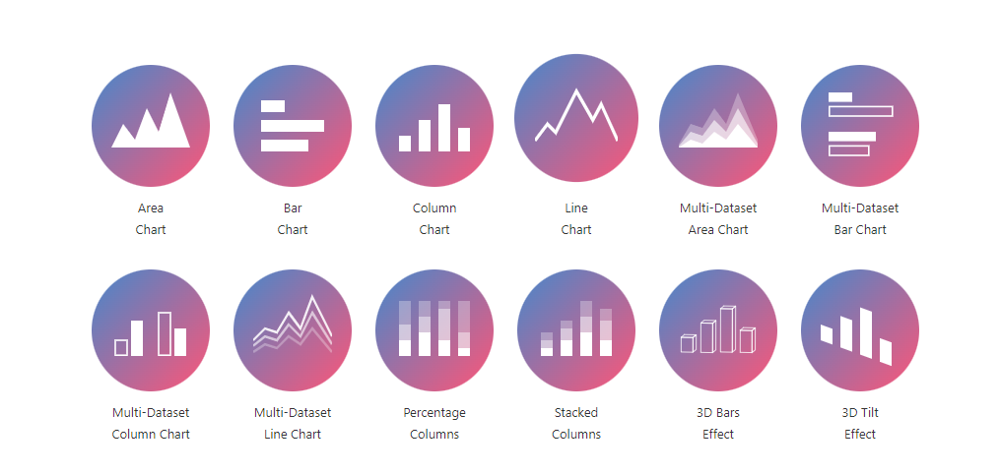

## Good reads

- 2022-11-05 [Folklore.org: -2000 Lines Of Code](https://www.folklore.org/StoryView.py?story=Negative_2000_Lines_Of_Code.txt)

  > -2000 Lines Of Code
  > Author: Andy Hertzfeld
  > Date:  February 1982
  > Characters: Bill Atkinson
  > Topics: Software Design, Management, Lisa
  > Summary:   It's hard to measure progress by lines of code

- 2022-11-04 [Use RSS for privacy and efficiency :: rsapkf/www](https://rsapkf.org/weblog/q2z)

  > Social media sites are riddled with ads, trackers, and dark patterns. As much as I'd love to avoid using them for privacy reasons or time concerns, it's just not possible to keep up to date with current events without them.RSS ("Really Simple Syndication") gives you the best of both worlds. For the uninitiated, it is a way to "subscribe" to websites without having to browse them individually or signing up for newsletters. With a collection of RSS feeds, you can keep up with the latest updates from multiple sources (that offer an RSS feed) from within your feed reader.

- 2022-10-30 [Things your manager might not know](https://jvns.ca/blog/things-your-manager-might-not-know/)

  > Here are the facts your manager might not know about you and your team that we’ll cover in this post: 
  > What’s slowing the team down
  > Exactly what individual people on the team are working on
  > Where the technical debt is
  > How to help you get better at your job
  > What your goals are
  > What issues they should be escalating
  > What extra work you’re doing
  > How compensation/promotions work at the company
- 2022-10-30 [My Top 10 Tips for Doing Time In ‘the Hole’ The Marshall Project](https://www.themarshallproject.org/2022/09/30/how-i-survived-a-year-in-the-hole-without-losing-my-mind)

  > In prison, going to “the hole” can mean spending 23 hours a day alone in a tiny cell. Here, incarcerated author Michael J. Nichols shares his top 10 tips for enduring long stretches of “administrative segregation.”

- 2022-10-29 [How to communicate effectively as a developer](https://www.karlsutt.com/articles/communicating-effectively-as-a-developer/) 

  > Writing effectively is a superpower, there is no denying it. As a software engineer, you write a lot. Most of the writing you do is for computers. Businesses, however, consist of people.
  > 


## X-Files

- 2022-11-04 [Pex4Fun - Microsoft Research](https://www.microsoft.com/en-us/research/project/pex4fun/)

  > And it is gone now. Why?

- 2022-11-04 [GOTO: .NET Source Browser](https://source.dot.net/#System.Private.CoreLib/src/libraries/System.Private.CoreLib/src/System/Number.Parsing.cs,f6db9e1598c92825)

  > Tell me more about goto! .NET Source Browser is very helpful tool

  ```csharp
      // Skip past any whitespace at the beginning.
      if ((styles & NumberStyles.AllowLeadingWhite) != 0 && IsWhite(num))
      {
          do
          {
              index++;
              if ((uint)index >= (uint)value.Length)
                  goto FalseExit;
              num = value[index];
          }
          while (IsWhite(num));
      }
      // ....
  Exit:
      return status;
  
  FalseExit: // parsing failed
      result = 0;
      status = ParsingStatus.Failed;
      goto Exit;
  OverflowExit:
      result = 0;
      status = ParsingStatus.Overflow;
      goto Exit;
  ```

- 2022-10-27 [Why has Microsoft finally trademarked Clippy? - Office Watch](https://office-watch.com/2021/clippy-why-microsoft-trademarked/) 

  > In June 2021, Microsoft applied for a Clippy image trademark.
  >
  > Source: [Justica](https://trademarks.justia.com/907/82/n-90782739.html)

## Retro

- 2022-11-01 [Ep.6: We got a Soviet PDP-11 DVK-3, never used in 30 years! Computers of Chernobyl - YouTube](https://www.youtube.com/watch?v=r1EWsWxObjA)

  > Just a fun research about old hardware

- 2022-10-27 [Make WordArt - Online word art generator](https://www.makewordart.com/)

  > Bring back the 90's with online WordArt
  >
  > 

## Projects

- 2022-11-04 [Educational Channels](https://limnology.co/)

  > Top 70000 educational YouTube channels in 20 languages by category
- 2022-10-31 [FiloSottile/mkcert: A simple zero-config tool to make locally trusted development certificates with any names you'd like.](https://github.com/FiloSottile/mkcert)
  
  > mkcert is a simple tool for making locally-trusted development certificates. It requires no configuration.

- 2022-10-30 [sickcodes/Docker-OSX: Run macOS VM in a Docker! Run near native OSX-KVM in Docker! X11 Forwarding! CI/CD for OS X Security Research! Docker mac Containers.](https://github.com/sickcodes/Docker-OSX)

- 2022-10-29 [FFmpeg.guide - One stop solution to all things FFmpeg](https://ffmpeg.guide/)

  > A simple GUI tool to create complex FFmpeg filtergraphs quickly and correctly, without having to mess with the cumbersome filter syntax
  > 

## CSS

- 2022-10-30 📊 [Charts.css](http://chartscss.org/)

  > CSS data visualization framework 
  > 

- 2022-10-28 [An exploration of what's possible with CSS and Pokémon Cards](https://deck-24abcd.netlify.app/) 

  > Card animation repo: [pokemon-cards-css/src at main · simeydotme/pokemon-cards-css](https://github.com/simeydotme/pokemon-cards-css/tree/main/src)
  > 


## Self-hosted

- 2022-11-01 [FreshRSS, a free, self-hostable feeds aggregator](https://freshrss.org/)

  > FreshRSS is a self-hosted RSS and Atom feed aggregator.
  > It is lightweight, easy to work with, powerful, and customizable.

## Markdown

- 2022-10-16 [marktext/marktext: 📝A simple and elegant markdown editor, available for Linux, macOS and Windows.](https://github.com/marktext/marktext)

> MarkText is an MIT licensed open source project, and the latest version will always be downloadable for free from the GitHub release page. 
> 

## Something I watched

- 2022-11-04 [Plain Text - Dylan Beattie - NDC Copenhagen 2022 - YouTube](https://www.youtube.com/watch?v=gd5uJ7Nlvvo)

  > Amazing talk about ASCII, code pages and all weird stuff
- 2022-11-04 [Keynote: Why web tech is like this - Steve Sanderson - YouTube](https://www.youtube.com/watch?v=3QEoJRjxnxQ) 

  >   From when the Web was invented to the current days
- 2022-11-03 [Typical C++, But Why? - Björn Fahller - NDC TechTown 2022 - YouTube](https://www.youtube.com/watch?v=PmVmaT1JNbw)

  > Better stronger type coding suggestions

- 2022-11-03 [C++ Weekly - Ep 213 - CTRE: Compile Time Regular Expressions - YouTube](https://www.youtube.com/watch?v=8aRfJp1oZGA&list=PLs3KjaCtOwSaqPapPV4pc1SRjypnwrXYV&index=2)

  > C++ Weekly about [hanickadot/compile-time-regular-expressions: Compile Time Regular Expression in C++](https://github.com/hanickadot/compile-time-regular-expressions)


## Just for fun

- 2022-10-27 [Interview with Senior JS Developer in 2022 - YouTube](https://www.youtube.com/watch?v=Uo3cL4nrGOk)

- 2022-10-27 [Interview with a GNU/Linux user in 2022 - Partition 1 - YouTube](https://www.youtube.com/watch?v=lE4UXdJSJM4)
