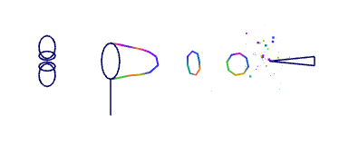
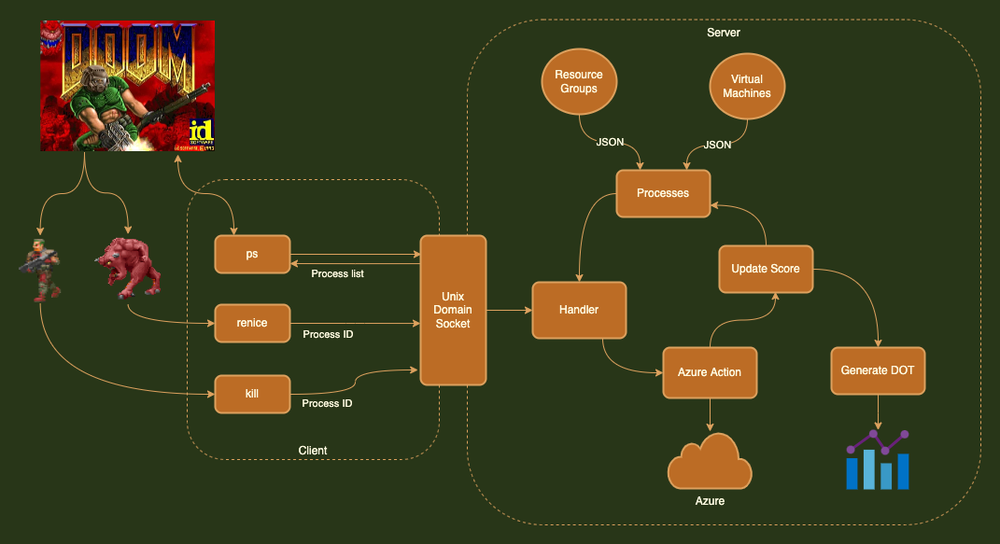
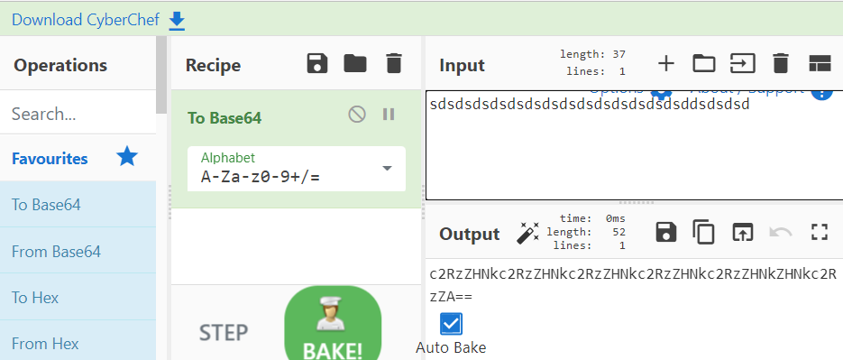

## Good reads

- 2022-11-06 [Reducing BigQuery Costs: How We Fixed A $1 Million Query — Data Science & Engineering 2022](https://shopify.engineering/reducing-bigquery-costs)

  > During the infrastructural exploration of a pipeline my team was building, we discovered a query that could have cost us nearly $1 million USD a month in BigQuery. Below, we’ll detail how we reduced this and share our tips for lowering costs in BigQuery.

## Fun

- 2022-11-12 [Bubbles][https://oimo.io/works/bubbles/] and  [Bubbles Hacker News](https://news.ycombinator.com/item?id=33566924) people call it a "toy"

  > 

- 2022-11-12 [secureworks/chaosbernie: Azure as an external process source for psDoom-ng](https://github.com/secureworks/chaosbernie) - Kill ur klaud! 

  >  Chaos Bernie implements Azure as an external process source for psDoom-ng.
  > Warning Azure resources will be permanently and irrevocably destroyed: use at your own risk!
  > 

- 2022-11-07 [notepad-plus-plus/Notepad_plus.cpp at master · notepad-plus-plus/notepad-plus-plus](https://github.com/notepad-plus-plus/notepad-plus-plus/blob/master/PowerEditor/src/Notepad_plus.cpp#L7104)

  > What else can we find inside Notepad++
```cpp
{TEXT("Notepad++"), QuoteParams::rapid, true, SC_CP_UTF8, L_TEXT, TEXT("The creation of Notepad++ is due to my need for a decent editor to edit the source code of Notepad++")},
{TEXT("Notepad++ #1"), QuoteParams::rapid, true, SC_CP_UTF8, L_TEXT, TEXT("I hate reading other people's code.\nSo I wrote mine, made it as open source project, and watch others suffer.")},
{TEXT("Notepad++ #2"), QuoteParams::rapid, true, SC_CP_UTF8, L_TEXT, TEXT("Good programmers use Notepad++ to code.\nExtreme programmers use MS Word to code, in Comic Sans, center aligned.")},
{TEXT("Notepad++ #3"), QuoteParams::rapid, true, SC_CP_UTF8, L_TEXT, TEXT("The best things in life are free.\nNotepad++ is free.\nSo Notepad++ is the best.\n")},
{TEXT("Richard Stallman"), QuoteParams::rapid, true, SC_CP_UTF8, L_TEXT, TEXT("If I'm the Father of Open Source, it was conceived through artificial insemination using stolen sperm without my knowledge or consent.")},
{TEXT("Martin Golding"), QuoteParams::rapid, true, SC_CP_UTF8, L_TEXT, TEXT("Always code as if the guy who ends up maintaining your code will be a violent psychopath who knows where you live.")},
{TEXT("L. Peter Deutsch"), QuoteParams::slow, false, SC_CP_UTF8, L_TEXT, TEXT("To iterate is human, to recurse divine.")},
{TEXT("Seymour Cray"), QuoteParams::rapid, true, SC_CP_UTF8, L_TEXT, TEXT("The trouble with programmers is that you can never tell what a programmer is doing until it's too late.")},
{TEXT("Brian Kernighan"), QuoteParams::rapid, true, SC_CP_UTF8, L_TEXT, TEXT("Debugging is twice as hard as writing the code in the first place. Therefore, if you write the code as cleverly as possible, you are, by definition, not smart enough to debug it.")},
```

## Games

- 2022-11-05 [ZType – Typing Game - Type to Shoot](https://zty.pe/)

  > 

- 2022-11-06 [The Bézier Game](https://bezier.method.ac/) 

  > Learn how to use Bezier curves
  > 

## Projects

- 2022-11-09 [Idiot proof git](https://softwaredoug.com/blog/2022/11/09/idiot-proof-git-aliases.html)

> I’m an idiot. And git is hard. A lot of places use a rebase-based Git workflow, and I’ve made git less hard with a set of handy aliases. Put these in your ~/.gitconfig and turn git into an actually less painful command line tool to use.

- 2022-11-08 [Recreating sci-fi terminals using VHS – Lost Boy](https://blog.ldodds.com/2022/11/08/recreating-sci-fi-terminals-using-vhs/)
> I heard about VHS recently. It’s a tool for creating recordings of command-line tools, so you can create little demos and tutorials about how to use them.
>  You can write a script to run commands, manipulate and theme the ter
> Github:  [charmbracelet/vhs: Your CLI home video recorder 📼](https://github.com/charmbracelet/vhs)
- 2022-11-06 [gchq/CyberChef: The Cyber Swiss Army Knife - a web app for encryption, encoding, compression and data analysis](https://github.com/gchq/CyberChef) 

  >  

- 2022-11-06 [yeemachine/kalidoface-3d: Face and Body Tracking for VRM 3D models on the web.](https://github.com/yeemachine/kalidoface-3d)
  
  > Kalidoface 3D - Face and Full-Body tracking for Vtubing on the web!
  > A sequal to Kalidoface which supports Live2D avatars, Kalidoface 3D is a web app that brings support for 3D Vtuber avatars. It now features more dynamic camera angles, and even full-body tracking options using the latest Mediapipe human pose detection models. Add the web app to your homescreen to use it in standalone full screen or even use it in OBS as a browser object directly.
  >
  > -  [Kalidoface 3D - Face & Full Body Tracking](https://3d.kalidoface.com/)
  > -  [yeemachine/kalidokit: Blendshape and kinematics calculator for Mediapipe/Tensorflow.js Face, Eyes, Pose, and Finger tracking models.](https://github.com/yeemachine/kalidokit)
  > -  [yeemachine/kalidoface: Become a virtual character with just your webcam!](https://github.com/yeemachine/kalidoface)

## C

- 2022-11-13 Building a simple shell in C

  > A basic shell that prints a prompt, waits for user to enter command and prints what they entered on the next line

  - [Building a simple shell in C - Part 1](https://blog.ehoneahobed.com/building-a-simple-shell-in-c-part-1)
  - [Building a simple shell in C - Part 2](https://blog.ehoneahobed.com/building-a-simple-shell-in-c-part-2)
  - [Building a simple shell in C - Part 3](https://blog.ehoneahobed.com/building-a-simple-shell-in-c-part-3)

- 2022-11-13 [Build Your Own Text Editor](https://viewsourcecode.org/snaptoken/kilo/)

  > Welcome! This is an instruction booklet that shows you how to build a text editor in C.
  >
  >  The text editor is antirez’s kilo, with some changes. It’s about 1000 lines of C in a single file with no dependencies, and it implements all the basic features you expect in a minimal editor, as well as syntax highlighting and a search feature.

## Java

- 2022-11-13 [Java Programming for Kids](http://yfain.github.io/Java4Kids/)

  > This book is not only for kids! This is just a good-written, illustrated guide on writing your first Java application.

## Powershell

- 2022-11-06 [PowerShell: Getting Started - Utilizing the Web: Part 4 Controlling Internet Explorer via IE COM Object — The Ginger Ninja](https://www.gngrninja.com/script-ninja/2016/9/25/powershell-getting-started-controlling-internet-explorer)

  > In case you are missing Internet Explorer 11... it is still there! 

```powershell

$ieObject = New-Object -ComObject 'InternetExplorer.Application'
$ieObject | Get-Member
$ieObject.Visible = $true
```

## CMAKE
- 2022-11-06 [cmake_templates/normal/library at master · acdemiralp/cmake_templates](https://github.com/acdemiralp/cmake_templates/tree/master/normal/library) 

  > random CMake templates 


## Tools

- 2022-11-11 [HTTrack Website Copier - Free Software Offline Browser GNU GPL](https://www.httrack.com/) Offline web!

  > HTTrack is a free (GPL, libre/free software) and easy-to-use offline browser utility.
  >
  > It allows you to download a World Wide Web site from the Internet to a local directory, building recursively all directories, getting HTML, images, and other files from the server to your computer. HTTrack arranges the original site's relative link-structure. Simply open a page of the "mirrored" website in your browser, and you can browse the site from link to link, as if you were viewing it online. HTTrack can also update an existing mirrored site, and resume interrupted downloads. HTTrack is fully configurable, and has an integrated help system.

## X-Files

\- 2022-11-12 [Man who lived in Charles de Gaulle airport for 18 years dies in airport France The Guardian](https://www.theguardian.com/world/2022/nov/12/iranian-man-who-lived-in-paris-charles-de-gaulle-airport-for-18-years-dies)

> Man, you will be remembered

\- 2022-11-12 [Changing times or, why is every layoff 10-15%?](https://blog.eladgil.com/p/changing-times-or-why-is-every-layoff)

> A discussion on Hacker News

2022-11-09 [GitHub stars won't pay your rent](https://kitze.io/posts/github-stars-wont-pay-your-rent)

> How to be a successful open-source developer and how not to make any money!

## For later

- 2022-11-13 [Social isolation and the brain in the pandemic era Nature Human Behaviour](https://www.nature.com/articles/s41562-022-01453-0)

  > Intense sociality has been a catalyst for human culture and civilization, and our social relationships at a personal level play a pivotal role in our health and well-being. These relationships are, however, sensitive to the time we invest in them. To understand how and why this should be, we first outline the evolutionary background in primate sociality from which our human social world has emerged. We then review defining features of that human sociality, putting forward a framework within which one can understand the consequences of mass social isolation during the COVID-19 pandemic, including mental health deterioration, stress, sleep disturbance and substance misuse. We outline recent research on the neural basis of prolonged social isolation, highlighting especially higher-order neural circuits such as the default mode network. Our survey of studies covers the negative effects of prolonged social deprivation and the multifaceted drivers of day-to-day pandemic experiences.

## Free Ads!


How do I explain Barista that I want a dark bitter coffee, without getting "brown"  sour one at the end?

