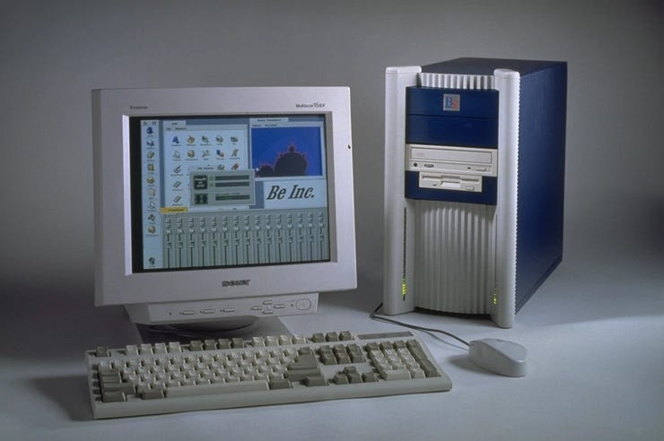
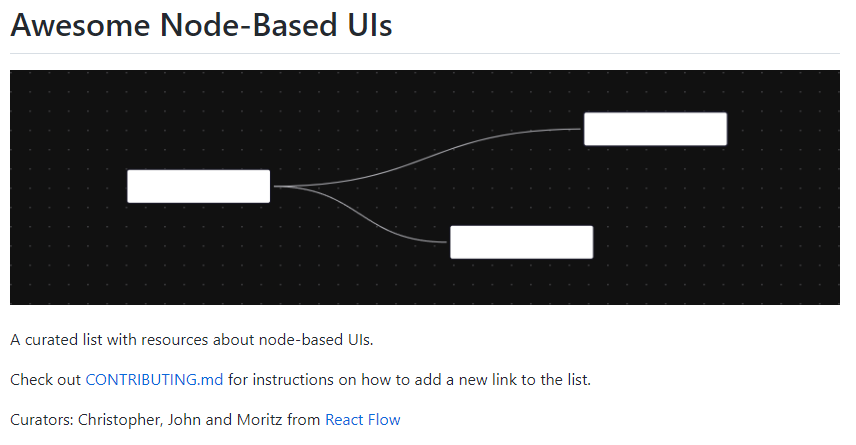

## Good reads

- 2022-11-18 [How does Windows decide whether your computer has limited or full Internet access? - The Old New Thing](https://devblogs.microsoft.com/oldnewthing/20221115-00/?p=107399)

  > Windows attempts to download a file from a dedicated Web server. Depending on which version of Windows, it’s `http://www.msftncsi.com/ncsi.txt` or `http://www.msftconnecttest.com/connecttest.txt`. If the download is successful and contains the correct contents, then Windows concludes that you have full Internet access.

## Retro

- 2022-11-14 ['Be' is nice. End of story. - by Bradford Morgan White](https://www.abortretry.fail/p/be-is-nice-end-of-story)

  > That's a story about BeOS!
  > 

## Games

- 2022-11-19 [ByteOverlord/Watch_Quake: Quake 1 port for Apple Watch](https://github.com/ByteOverlord/Watch_Quake)

  > 

## Projects

- 2022-11-17 [Home - Apple Rankings by The Appleist Brian Frange - Comedian Brian Frange](https://applerankings.com/)

  > These are real apples!
  > 
- 2022-11-17 [wbkd/awesome-node-based-uis: A curated list with resources about node-based UIs](https://github.com/wbkd/awesome-node-based-uis)

  > 

- 2022-11-20 [What makes Git so hard to use? HighFlux](https://www.highflux.io/blog/what-makes-git-hard-to-use)

  > Several tools are already out there:
  >
  > - [Gitless](https://gitless.com/) [2](https://www.highflux.io/blog/what-makes-git-hard-to-use#fn-2-0a8e45)
  > - [Sturdy](https://getsturdy.com/)
  > - [legit](https://github.com/frostming/legit)
  > - [jj](https://github.com/martinvonz/jj)
  > - [Sapling](https://sapling-scm.com/): just opensourced yesterday by Meta
  > - [HighFlux](https://www.highflux.io/docs/install): our product, currently in beta

- 2022-11-19 [Bannalia: trivial notes on themes diverse: Inside boost::unordered_flat_map](https://bannalia.blogspot.com/2022/11/inside-boostunorderedflatmap.html?m=1)
  > Starting in Boost 1.81 (December 2022), Boost.Unordered provides, in addition to its previous implementations of C++ unordered associative containers, the new containers boost::unordered_flat_map and boost::unordered_flat_set (for the sake of brevity, we will only refer to the former in the remaining of this article). If boost::unordered_map strictly adheres to the C++ specification for std::unordered_map, boost::unordered_flat_map deviates in a number of ways from the standard to offer dramatic performance improvements in exchange; in fact, boost::unordered_flat_map ranks amongst the fastest hash containers currently available to C++ users.

- 2022-11-17 [foxlet/macOS-Simple-KVM: Tools to set up a quick macOS VM in QEMU, accelerated by KVM.](https://github.com/foxlet/macOS-Simple-KVM)

  >  So... it is here in C++... because how else would you test your opensource C++ with no apple device?

- 2022-11-13 [AnalogJ/scrutiny: Hard Drive S.M.A.R.T Monitoring, Historical Trends & Real World Failure Thresholds](https://github.com/AnalogJ/scrutiny)

  >  If you run a server with more than a couple of hard drives, you're probably already familiar with S.M.A.R.T and the `smartd` daemon. If not, it's an incredible open source project described as the following:
  > smartd is a daemon that monitors the Self-Monitoring, Analysis and Reporting Technology (SMART) system built into many ATA, IDE and SCSI-3 hard drives. The purpose of SMART is to monitor the reliability of the hard drive and predict drive failures, and to carry out different types of drive self-tests.
  > 

## Go

- 2022-11-18 [Go Style styleguide](https://google.github.io/styleguide/go/)
  

## Tools

- 2022-11-19 [nathants/mighty-snitch: noticing and preventing network requests should be easy](https://github.com/nathants/mighty-snitch)

  > 

## CSS

- 2022-11-19 [Tree views in css](https://iamkate.com/code/tree-views/)

  > A tree view (collapsible list) can be created using only html and css, without the need for JavaScript. Accessibility software will see the tree view as lists nested inside disclosure widgets, and the standard keyboard interaction is supported automatically.
  > 

- 2022-11-19 [Marek Gibney on Twitter: "With a single css rule, one can create interactive trees in pure html. https://t.co/0GEIsRtqMC" / Twitter](https://twitter.com/marekgibney/status/1593950777739218947)

  > 

- 2022-11-18 [candle](https://codepen.io/Takuma_BMe/pen/BaVdNLK)
- 2022-11-18 [Candle Made with CSS Hacker News](https://news.ycombinator.com/item?id=33652245)

  > 


## Kiosk

- 2022-11-19 [How to use a Raspberry Pi in kiosk mode - Raspberry Pi](https://www.raspberrypi.com/tutorials/how-to-use-a-raspberry-pi-in-kiosk-mode/)

  > 

- 2022-11-18 [Use This Kernel Parameter in Your Kiosk - Connor's Blog](https://cedwards.xyz/use-this-kernel-parameter-in-your-kiosk/)

  > [r/PBSOD](https://www.reddit.com/r/pbsod) is a fun subreddit all about posting pictures of broken kiosks and information/entertainment systems in public. It stands for Public Blue Screen of Death which is a Windowsism but Linux systems are posted there too.
```sh
$ sysctl -w kernel.panic=60
```

## FFmpeg

- 2022-11-19 [Paolo Melchiorre - Resize a video with FFmpeg for Mastodon](https://www.paulox.net/2022/11/17/resize-a-video-with-ffmpeg-for-mastodon/)
```sh
$ ffmpeg -i input.mp4 -vf scale=1920:-1 -vcodec libx265 -crf 24 output.mp4
```

## X-Files

- 2022-11-19 [I got laid off at Microsoft. What I regret - YouTube](https://www.youtube.com/watch?v=-mZbLX8EsWk)
  > Reassuring video from someone who was laid off from MS
  >
  > 
