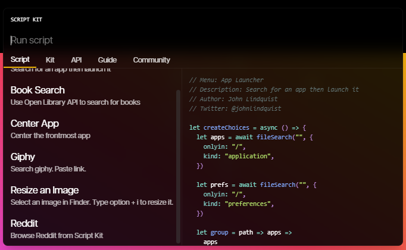
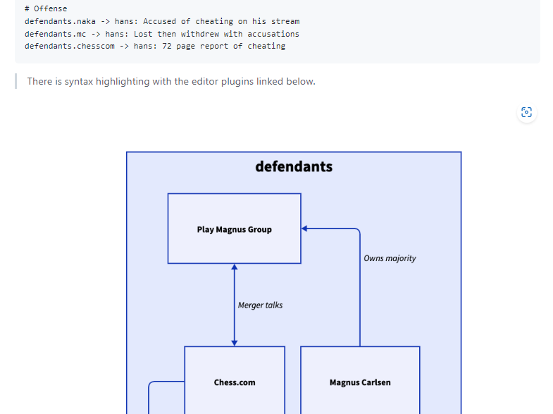
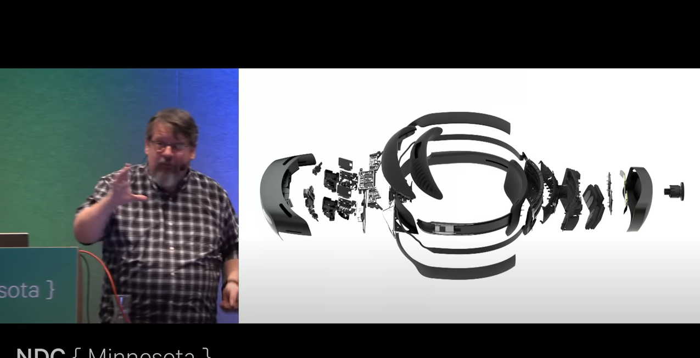
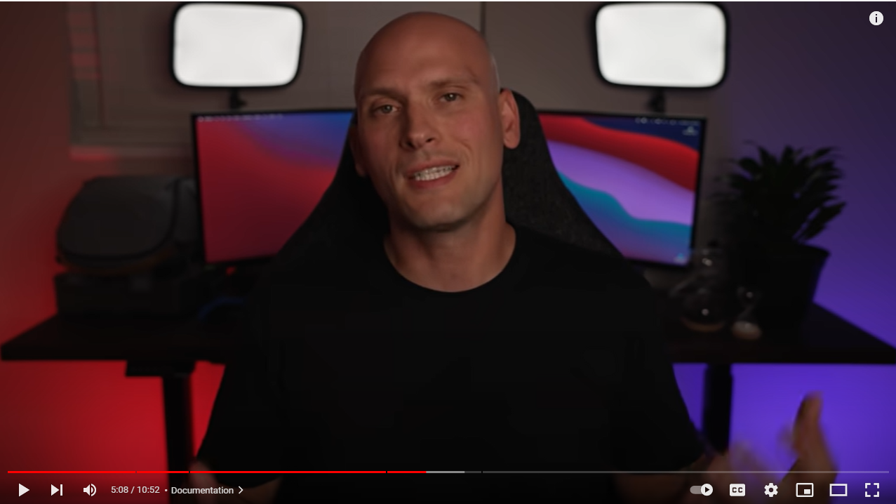

---
layout: post
title:  "Links from my inbox 2022-11-27"
date:   2022-11-27T12:17:00-08:00
categories: links
---

## Good reads

2022-11-22 [Debugging tips and tools - Meziantou's blog](https://www.meziantou.net/debugging-tips-and-tools.htm)

> Here are some tips and tools to help you debug your .NET applications. The goal is not to be exhaustive, but to give you some ideas on how to debug your applications.

2022-11-21 [How it works - Briar](https://briarproject.org/how-it-works/)
> P2P Encrypted messages
> Briar is a messaging app designed for activists, journalists, and anyone else who needs a safe, easy and robust way to communicate. Unlike traditional messaging apps, Briar doesn’t rely on a central server - messages are synchronized directly between the users’ devices. If the internet’s down, Briar can sync via Bluetooth or Wi-Fi, keeping the information flowing in a crisis. If the internet’s up, Briar can sync via the Tor network, protecting users and their relationships from surveillance.

## Fun

2022-11-24 [Ethernet RJ45 clip to secure/repair/fix broken tab by guss67 - Thingiverse](https://www.thingiverse.com/thing:4687836)

> And this is awesome!
> 

## Retro

2022-11-24 [ekeeke/Genesis-Plus-GX: An enhanced port of Genesis Plus - accurate & portable Sega 8/16 bit emulator](https://github.com/ekeeke/Genesis-Plus-GX)

## Job Interviews

2022-11-22 [Job Interview question samples `https://bit.ly/InterviewDevsResource` ](http://billyhollis.com/Downloads/InterviewQuestionsSummaryAndReferenceFixed.pdf) 
> from this talk [Keynote: Lies Developers Tell Themselves - Billy Hollis - NDC Minnesota - YouTube](https://www.youtube.com/watch?v=cADdwFk2-7U)

## Projects

2022-11-25 [Script Kit: Shortcut to Everything](https://www.scriptkit.com/)
>  Shortcut to Everything
> An open-source kit to optimize your developer workflow
> 

2022-11-25 [Soundux/Soundux: 🔊 A cross-platform soundboard](https://github.com/Soundux/Soundux)
> Soundux is a cross-platform soundboard that features a simple user interface. With Soundux you can 
> play audio to a specific application on Linux and to your VB-CABLE sink on Windows.
> 
>
> But what was interesting, this program is created with  with [webview/webview: Tiny cross-platform webview library for C/C++/Golang. Uses WebKit Gtk/Cocoa and Edge Windows](https://github.com/webview/webview)

2022-11-24 [brycedrennan/imaginAIry: AI imagined images. Pythonic generation of stable diffusion images.](https://github.com/brycedrennan/imaginAIry)

2022-11-22 [terrastruct/d2: D2 is a modern diagram scripting language that turns text to diagrams.](https://github.com/terrastruct/d2)

> 

## CSS

2022-11-27 [An Interactive Guide to Flexbox in CSS](https://www.joshwcomeau.com/css/interactive-guide-to-flexbox/)

## X-Files

2022-11-24 [Smart Move, Google](https://garrit.xyz/posts/2022-11-24-smart-move-google) `maps.google.com` now redirects to `google.com/maps`
> Back home I opened Google Maps again, and noticed that `maps.google.com` now redirects to `google.com/maps`. This implies that the permissions I give to Google Maps now apply to all of Googles services hosted under this domain. 

2022-11-24 [Discovery: ‘Special’ muscle can promote gluco EurekAlert!](https://www.eurekalert.org/news-releases/965506)
> From the same mind whose research propelled the notion that “sitting too much is not the same as exercising too little,” comes a groundbreaking discovery set to turn a sedentary lifestyle on its ear: The soleus muscle in the calf, though only 1% of your body weight, can do big things to improve the metabolic health in the rest of your body if activated correctly.  
> - 2022-11-24 [Discovery Unlocks Potential of 'Special' Muscle - YouTube](https://www.youtube.com/watch?v=yaK6TThRMdE&t=6s)

## Video

2022-11-26 [Keynote: The Next Decade of Software Development - Richard Campbell - NDC Minnesota - YouTube](https://www.youtube.com/watch?v=twMM9NQXRaI)

2022-11-24 [Taking Notes is a WASTE OF TIME When You're Learning To Code! DO THIS INSTEAD! - YouTube](https://www.youtube.com/watch?v=VCWzQpUwsaw)
> 
> Vicky S
>
> 1. Don't Bother taking notes for the first 2 months rather focus on the course or tutorial.
> 2. After learning the basics, start building projects and comment on every single line.
> 3. Write documentation, basically explaining the purpose of your project (watch other tutorials on how to write documentation in VScode).
> 4. Only take notes of those concepts which you use very often and find it difficult to remember them.
> Thank you, Dorian it really helped a lot :)

2022-11-23 [Contemporary C++ in action - Daniela Engert - NDC TechTown2022 - YouTube](https://www.youtube.com/watch?v=lHCisBcw3kA)
> Really hardcore talk! 
> 
>
> -  [DanielaE/CppOnSea2022: Demo Application from the talk](https://github.com/DanielaE/CppOnSea2022)
> -  Libs
>    -  https://think-async.com
>    -  https://ffmpeg.org
>    -  https://www.libsdl.org