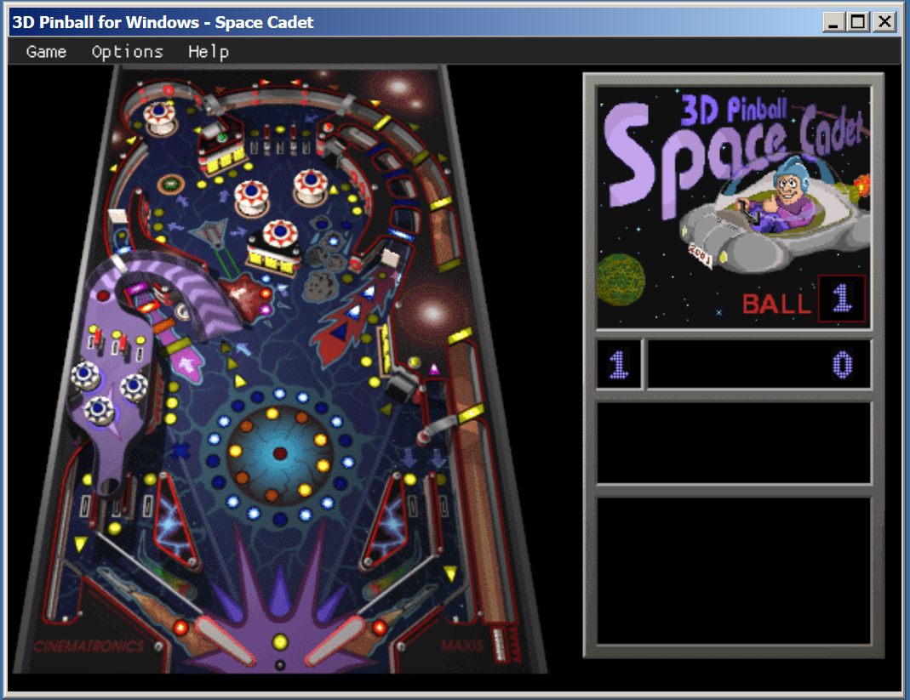
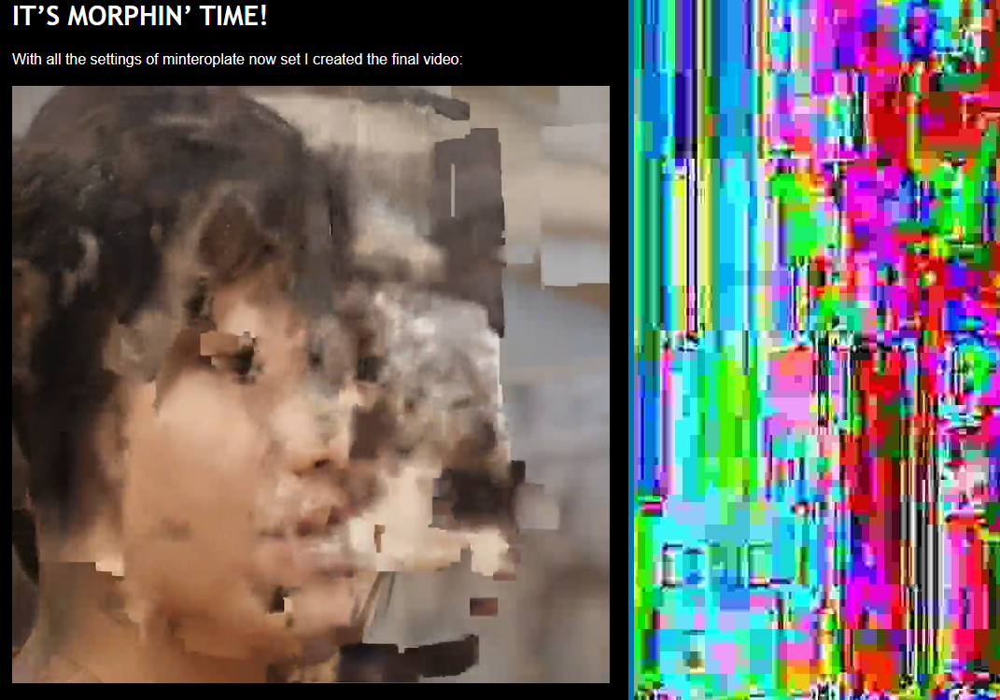

---
layout: post
title:  "Links from my inbox 2022-12-14"
date:   2022-12-14T10:09:00-08:00
categories: links
---


## My AI Content

I have generated these articles with ChatGPT today... 

2022-12-14 [Whiskers the Software Developer: A Fairy Tale](https://blog.zharii.com/docs/chatGPT/2022-12-14-Whiskers-the-Software-Developer--A-Fairy-Tale.md)

> Once upon a time, in a kingdom far, far away, there lived a cat named Whiskers who was a brilliant software developer. For many years, Whiskers worked tirelessly on a variety of projects, using his sharp mind and quick paws to create beautiful and functional code.

2022-12-14 [The Essential Skills of a Successful Software Developer](https://blog.zharii.com/docs/chatGPT/2022-12-14-The-Essential-Skills-of-a-Successful-Software-Developer)

> The most valuable qualities of a software developer include their ability to problem-solve, communicate effectively, be organized and detail-oriented, and be adaptable and willing to learn. These skills enable them to excel in their work and make significant contributions to the success of their organization.

2022-12-14 [How Software Developers Can Overcome Procrastination and Boost Productivity](https://blog.zharii.com/docs/chatGPT/2022-12-14-How-Software-Developers-Can-Overcome-Procrastination-and-Boost-Productivity.md) 

> Procrastination is a common challenge for many people, and software developers are no exception. With the complex and demanding nature of their work, it can be easy for developers to fall into the trap of putting off important tasks and letting deadlines slip. However, left unchecked, procrastination can have serious negative consequences on both personal and professional levels. So, how can software developers fight back against this insidious habit and stay focused and productive?

2022-12-14 [5 Harmless Ways Software Developers Can Have Fun at Work](https://blog.zharii.com/docs/chatGPT/2022-12-14-5-Harmless-Ways-Software-Developers-Can-Have-Fun-at-Work.md) 

> 1. Play "code golf" - try to solve a programming problem in the fewest number of characters possible
> 2. Have a "code jam" - get together with a group of coworkers and try to solve a programming challenge together
> 3. Share interesting programming articles or videos with your team
> 4. Organize a "hack day" where team members can work on personal projects or experiment with new technologies
> 5. Join an online coding competition or hackathon for a fun and engaging way to challenge yourself and improve your skills.


## Good reads

2022-12-13 [The best things and stuff of 2022](http://blog.fogus.me/2022/12/13/the-best-things-and-stuff-of-2022/)

- *[Predicting the tide with an analog computer made from Lego](http://pepijndevos.nl/2022/01/30/predicting-the-tide-with-an-analog-computer-made-from-lego.html)* – *The idea of minimalist computing devices is taken to the next level by Pepijn de Vos wherein he discusses a device made from Lego that implements Sir William Thomson’s tide predicting approach.*
  

2022-12-10 [DDD, Hexagonal, Onion, Clean, CQRS, … How I put it all together – @hgraca](https://herbertograca.com/2017/11/16/explicit-architecture-01-ddd-hexagonal-onion-clean-cqrs-how-i-put-it-all-together/)

> *This post is part of* *[The Software Architecture Chronicles](https://herbertograca.com/2017/07/03/the-software-architecture-chronicles/)**, a* *[series of posts about Software Architecture](https://herbertograca.com/category/development/series/software-architecture/)**. In them, I write about what I’ve learned about Software Architecture, how I think of it, and how I use that knowledge. The contents of this post might make more sense if you read the previous posts in this series.*
>
> 


## Fun

2022-12-05 [Asteroid Launcher](https://neal.fun/asteroid-launcher/)

> 

2022-12-05 [3D Pinball for Windows - Space Cadet](https://alula.github.io/SpaceCadetPinball/)

> 

## ChatGTP

2022-12-11 [The GPT-3 Architecture, on a Napkin](https://dugas.ch/artificial_curiosity/GPT_architecture.html)

> There are so many brilliant posts on GPT-3, [demonstrating what it can do](https://www.gwern.net/GPT-3), [pondering its](https://leogao.dev/2020/05/29/GPT-3-A-Brief-Summary/) [consequences](https://maraoz.com/2020/07/18/openai-gpt3/), [vizualizing how it works](http://jalammar.github.io/illustrated-gpt2/). With all these out there, it still took a crawl through several papers and blogs before I was confident that I had grasped the architecture.
>
> So the goal for this page is humble, but simple: help others build an *as detailed as possible* understanding of the GPT-3 architecture.
>
> 

2022-12-10 [Disputing A Parking Fine with ChatGPT - Notes by Lex](https://notesbylex.com/disputing-a-parking-fine-with-chatgpt.html)

2022-12-10 [f/awesome-chatgpt-prompts: This repo includes ChatGPT promt curation to use ChatGPT better.](https://github.com/f/awesome-chatgpt-prompts)

2022-12-09 [The best ChatGPT examples from around the web](https://www.learngpt.com/about)

> Hacker news for prompts 


## Projects 

2022-12-13 [odnoletkov/advent-of-code-jq: Solving Advent of Code with jq](https://github.com/odnoletkov/advent-of-code-jq) 

> Solving [Advent of Code 2022](https://adventofcode.com/) with jq

2022-12-11 [Giant VR Robots Are Building Railways In Japan - Virtual Uncle](https://virtualuncle.com/2022/04/26/giant-vr-robots-are-building-railways-in-japan/)

> 

2022-12-10 [This to That Glue Advice](https://www.thistothat.com/cgi-bin/glue.cgi?lang=en&this=Plastic&that=Metal)

>
>  

2022-12-10 [albfan/miraclecast: Connect external monitors to your system via Wifi-Display specification also known as Miracast](https://github.com/albfan/miraclecast)

2022-12-07 [awesome-macos-command-line](https://git.herrbischoff.com/awesome-macos-command-line/about/)

2022-12-05 [Installing FreeBSD on a Raspberry Pi](https://cromwell-intl.com/open-source/samba-active-directory/freebsd-raspberry-pi.html)

## Video Editing

2022-12-13 [LosslessCut](https://mifi.no/losslesscut/)

> The Swiss Army Knife of Lossless Video/Audio Editing
>
> 

## Videos

2022-12-06 [Keynote: Abstraction Patterns - Kate Gregory - NDC TechTown 2022 - YouTube](https://www.youtube.com/watch?v=rfIX0FzKHF0)

> A consultant is someone who borrows your watch to tell you the time, (... and then keeps the watch)
>
> To Conor Hoekstra, for the truth about speaking
> To Guy Davidson, for Beautiful C++
> To Tony Van Eerd, for a SOLID talk at C++ Now 2021

2022-12-04 [mis Using FFmpeg’s Motion Interpolation Options Antonio Roberts](https://www.hellocatfood.com/misusing-ffmpegs-motion-interpolation-options/) It's morphing time! 

> 

```sh
ffmpeg -i faces.mp4 -filter:v "setpts=40*PTS,minterpolate='fps=25:scd=none:me_mode=bidir:vsbmc=1:search_param=2000'" -y search_param_2000.mp4
```

