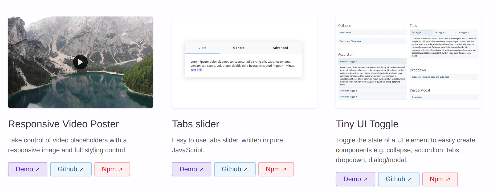
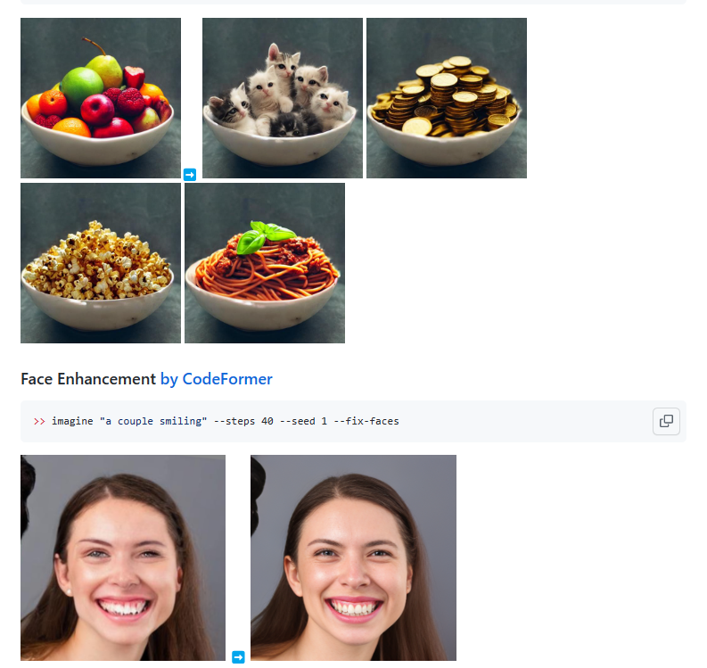
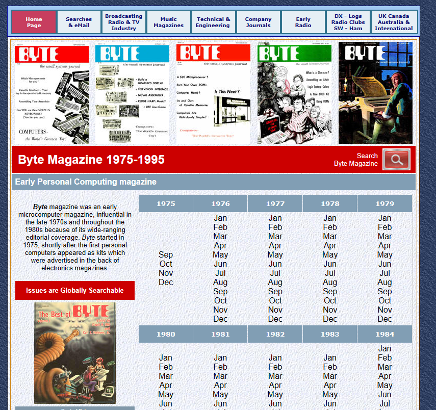
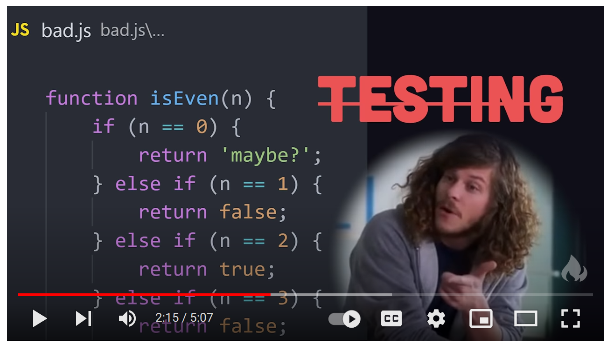

> These links got out of hand... I thought I should read more Hacker News... No, I should not read MORE Hacker News.

## Good Reads

2023-02-12 [How a single line of code brought down a half-billion euro rocket launch](https://jam.dev/blog/famous-bugs-rocket-launch/)

> It’s Tuesday, June 4th, 1996, and the European Space Agency is set to launch its new Ariane 5 rocket for the first time. This is the culmination of a decade of design, testing and a budget spending billions of euros.
>
> Ariane-5 rocket in preparation for launch (Credits ESA 1996)

2023-02-10 [Is Seattle a 15-minute city? It depends on where you want to walk](https://nathenry.com/writing/2023-02-07-seattle-walkability.html) 

> What makes this article interesting, besides the main content,  are references  to apps, maps and APIs from where the data got fetched. 
>
> **This could be a pivotal year for mobility in Seattle.** In the final week of January, Seattle [won $25.7 million](https://www.seattlebikeblog.com/2023/01/30/sen-cantwell-seattle-wins-25-7m-grant-for-safe-streets-mostly-in-sodo/) in federal grants to build safer streets, [made transit free](https://www.whereweconverge.com/post/seattle-to-provide-free-orca-cards-to-seattle-housing-authority-residents) for 10,000 Seattle Housing Authority residents, and [solicited public feedback](https://www.seattle.gov/opcd/one-seattle-plan/) on a major update to the city’s Comprehensive Plan. To transform this momentum into meaningful change, we need a catalyst—a coherent, powerful vision for moving around Seattle.
>
> Consider the [**15-minute city**](https://www.15minutecity.com/): first imagined by Carlos Moreno and [most fully realized](https://tomorrow.city/a/paris-the-15-minute-city) (so far) in Paris, this model describes a metropolis where residents can satisfy the full spectrum of their daily needs within a 15-minute walk or bike ride.
>
> [](https://www.instagram.com/p/CQgHgrTn4pt/)Concept diagram of the 15-minute city. Source: [@re_visionuk](https://www.instagram.com/re_visionuk/)

​	2023-01-17 [The Cab Ride I'll Never Forget Kent Nerburn](https://kentnerburn.com/the-cab-ride-ill-never-forget/)

> There was a time in my life twenty years ago when I was driving a cab for a living. It was a cowboy’s life, a gambler’s life, a life for someone who wanted no boss, constant movement and the thrill of a dice roll every time a new passenger got into the cab.
>
> What I didn’t count on when I took the job was that it was also a ministry. Because I drove the night shift, my cab became a rolling confessional. Passengers would climb in, sit behind me in total anonymity and tell me of their lives.


## Game(s)!

2023-02-06 [Flappy Birdle - Flappy Bird meets Wordle by AE Studio](https://flappybirdle.com/)

> 

## Apache Spark, SQL, BigData

2023-02-12 [Spark SQL Shuffle Partitions - Spark By {Examples}](https://sparkbyexamples.com/spark/spark-shuffle-partitions/) 

> In this Apache Spark Tutorial, you will learn Spark with Scala code examples and every sample example explained here is available at [Spark Examples Github Project](https://github.com/spark-examples) for reference. All Spark examples provided in this Apache Spark Tutorial are basic, simple, and easy to practice for beginners who are enthusiastic to learn Spark, and these sample examples were tested in our development environment.

2023-02-12 [SQL Window Functions: Ranking](https://antonz.org/sql-window-functions-ranking/)

> *This is an excerpt from my book [SQL Window Functions Explained](https://antonz.org/sql-window-functions-book). The book is a clear and visual introduction to the topic with lots of practical exercises.*
>
> Ranking means coming up with all kinds of ratings, starting from the winners of the World Swimming Championships and ending with the Forbes 500.
>
> We will rank records from the toy `employees` table:
>
> ```
> ┌────┬───────┬────────┬────────────┬────────┐
> │ id │ name  │  city  │ department │ salary │
> ├────┼───────┼────────┼────────────┼────────┤
> │ 11 │ Diane │ London │ hr         │ 70     │
> │ 12 │ Bob   │ London │ hr         │ 78     │
> │ 21 │ Emma  │ London │ it         │ 84     │
> │ 22 │ Grace │ Berlin │ it         │ 90     │
> │ 23 │ Henry │ London │ it         │ 104    │
> │ 24 │ Irene │ Berlin │ it         │ 104    │
> │ 25 │ Frank │ Berlin │ it         │ 120    │
> │ 31 │ Cindy │ Berlin │ sales      │ 96     │
> │ 32 │ Dave  │ London │ sales      │ 96     │
> │ 33 │ Alice │ Berlin │ sales      │ 100    │
> └────┴───────┴────────┴────────────┴────────┘
> ```
>
> [playground](https://sqlime.org/#employees.db) • [download](https://antonz.org/sql-window-functions-book/employees.sql)
>
> Table of contents:
>
> - [Salary rating](https://antonz.org/sql-window-functions-ranking/#salary-rating)
> - [Window ordering vs. result ordering](https://antonz.org/sql-window-functions-ranking/#window-ordering-vs-result-ordering)
> - [Sorting uniqueness](https://antonz.org/sql-window-functions-ranking/#sorting-uniqueness)
> - [Salary rating by department](https://antonz.org/sql-window-functions-ranking/#salary-rating-by-department)
> - [Salary groups](https://antonz.org/sql-window-functions-ranking/#salary-groups)
> - [Ranking functions](https://antonz.org/sql-window-functions-ranking/#ranking-functions)
> - [Keep it up](https://antonz.org/sql-window-functions-ranking/#keep-it-up)

2023-02-12 [Apache Spark Core—Deep Dive—Proper Optimization Daniel Tomes Databricks - YouTube](https://www.youtube.com/watch?v=daXEp4HmS-E) 

> Optimizing spark jobs through a true understanding of spark core. Learn: What is a partition? What is the difference between read/shuffle/write partitions? How to increase parallelism and decrease output files? Where does shuffle data go between stages? What is the "right" size for your spark partitions and files? Why does a job slow down with only a few tasks left and never finish? Why doesn't adding nodes decrease my compute time?
>
> 

2023-02-11 [How to Train Really Large Models on Many GPUs? Lil'Log](https://lilianweng.github.io/posts/2021-09-25-train-large/) 

> In recent years, we are seeing better results on many NLP benchmark tasks with larger pre-trained [language models](https://lilianweng.github.io/posts/2019-01-31-lm/). How to train large and deep neural networks is challenging, as it demands a large amount of GPU memory and a long horizon of training time.
>
> However an individual GPU worker has limited memory and the sizes of many large models have grown beyond a single GPU. There are several parallelism paradigms to enable model training across multiple GPUs, as well as a variety of model architecture and memory saving designs to help make it possible to train *very large* neural networks.

2023-01-25 [Event Hubs ingestion performance and throughput Vincent-Philippe Lauzon’s](https://vincentlauzon.com/2018/06/05/event-hubs-ingestion-performance-and-throughput/)

>  Here are some recommendations in the light of the performance and throughput results:
>
> - If we send **many events**: always reuse connections, i.e. do not create a connection only for one event. This is valid for both AMQP and HTTP. A simple [Connection Pool pattern](https://github.com/vplauzon/streaming/blob/master/ClientPerf/ClientConsole/EventHubClientPool.cs) makes this easy.
> - If we send **many events** & **throughput** is a concern: use AMQP.
> - If we send **few events** and **latency** is a concern: use HTTP / REST.
> - If events naturally comes in **batch of many events**: use batch API.
> - If events **do not** naturally comes in **batch of many events**: simply stream events. **Do not try** to batch them unless network IO is constrained.
> - If a **latency** of **0.1 seconds** is a concern: move the call to Event Hubs away from your critical performance path.
>
> Let’s now look at the tests we did to come up with those recommendations.

## Projects

2023-01-13 [GitHub - sickcodes/Docker-OSX](https://github.com/sickcodes/Docker-OSX) 

>  Run macOS VM in a Docker! Run near native OSX-KVM in Docker! X11 Forwarding! CI/CD for OS X Security Research! Docker mac Containers.
> 

2023-02-12 [Vanilla List The Vanilla JavaScript Repository](https://vanillalist.top/)

> a directory of "vanilla" JavaScript controls and plugins.
> 

2023-02-12 [Design Patterns in TypeScript](https://refactoring.guru/design-patterns/typescript) 

> 

2023-02-12 [Nevin1901/erlog: Minimalist log collector](https://github.com/Nevin1901/erlog)

> ErLog is a minimalist log collection service. You can either forward structured logs from existing log libraries (eg: zerolog or winston), or use the collector to forward structured logs from stdout or stderr (coming soon).

2023-02-10 [DSchroer/dslcad: DSLCad is a programming language & interpreter for building 3D models.](https://github.com/DSchroer/dslcad)

> DSLCAD is a programming language & interpreter for building 3D models.
>
> Inspired by OpenSCAD, it has a language and 3D viewer to simplify the modeling experience.
>
> 

2023-02-10 [Logic Gate Simulator Academo.org - Free, interactive, education.](https://academo.org/demos/logic-gate-simulator/)

> A free, simple, online logic gate simulator. Investigate the behaviour of AND, OR, NOT, NAND, NOR and XOR gates. Select gates from the dropdown list and click "add node" to add more gates. Drag from the hollow circles to the solid circles to make connections. Right click connections to delete them. See below for more detailed instructions.

2023-02-12 [`GitHub - brycedrennan/imaginAIry: AI imagined images. Pythonic generation of stable diffusion images.`](https://github.com/brycedrennan/imaginAIry) 

>  AI imagined images. Pythonic generation of stable diffusion images.
>
> "just works" on Linux and macOS(M1) (and maybe windows?).
> 
>
> 

## Work and Planning

2023-02-10 [Why backlogs are harmful, why they never shrink, and what to do instead](https://lucasfcosta.com/2023/02/07/backlogs-are-useless.html)

> Do you remember your backlog ever shrinking? Of course you don’t. Backlogs *never* shrink.
>
> Backlogs never shrink because the list of things we’d *eventually* like to do never shrinks, and **that’s what backlogs are: a bunch of unimportant tasks that we’ll \*eventually\* get to, but not today.**

2023-02-10 [How to build an in-house on-call training program - Blog](https://fiberplane.com/blog/how-to-build-an-in-house-on-call-training-program) 

> A critical element of a successful SRE team is maintaining an on-call schedule. Engineers need to be at the ready on a predetermined rotation to fix issues on existing services and infrastructure as they arise.
>
> Having an on-call schedule is only part of the equation. Your SRE and DevOps engineers need to be trained in how to actually resolve issues. A complete training program ensures that proper procedure becomes second nature for your team, so that they can arrive at resolutions as quickly as possible.
>
> Let’s take a closer look at why these programs are necessary, what an effective in-house, on-call training program generally looks like, and how to leverage one to train and mentor new members of your SRE team.

2023-01-09 [8 Hard Truths I learned when I got laid off from my SWE job Steven Buccini](https://www.stevenbuccini.com/8-hard-truths-on-getting-laid-off) 

> I got laid off from a software engineering job in April of 2020.
>
> I haven’t talked about this publicly for a variety of reasons, including Hard Truth #6 (Honesty Can Only Hurt You). And everything worked out for me in the end.[1](https://www.stevenbuccini.com/8-hard-truths-on-getting-laid-off#fn:1) So why even bother publishing a post about my experience, and why now? I got laid off in April 2020 when all the talking heads were saying a recession was inevitable. Sound familiar?

## Health ❤️❤️❤️❤️🖤

2023-01-10 [MuscleWiki: Find exercises that work specific muscles](https://musclewiki.com) 

> 


## Retro

2023-01-17 [BYTE MAGAZINE: Early computer publication](https://worldradiohistory.com/Byte_Magazine.htm)

> BYTE Magazine archives
>
> 

2023-01-13 [History of Web Browser Engines from 1990 until today](https://eylenburg.github.io/browser_engines.htm) 

> Huge timeline image!

## Funny

2023-02-11 [10 Programmer Stereotypes - YouTube](https://www.youtube.com/watch?v=_k-F-MMvQV4)

> 

## Wisdom!

2023-02-08 [Ask HN: How do you deal with information and internet addiction? Hacker News](https://news.ycombinator.com/item?id=34710830)

```
labrador 12 hours ago | next [–]

I handle it by collecting quotes that tell me to knock it off. I've since started to focus on just the things I really care about:

  The purpose of knowledge is action, not knowledge.
  ― Aristotle

  Knowledge isn't free. You have to pay attention
  ― Richard Feynman

  "Information is not truth"
  ― Yuval Noah Harari

  If I were the plaything of every thought, I would be a fool, not a wise man.
  ― Rumi

  Dhamma is in your mind, not in the forest. You don't have to go and look anywhere else.
  ― Ajahn Chah

  Man has set for himself the goal of conquering the world,
  but in the process he loses his soul.
  ― Alexander Solzhenitsyn

  The wise man knows the Self,
  And he plays the game of life.
  But the fool lives in the world
  Like a beast of burden.
  ― Ashtavakra Gita (4―1)

  We must be true inside, true to ourselves,
  before we can know a truth that is outside us.
  ― Thomas Merton

  Saying yes frequently is an additive strategy. Saying no is a subtractive strategy. Keep saying no to a lot of things - the negative and unimportant ones - and once in awhile, you will be left with an idea which is so compelling that it would be a screaming no-brainer 'yes'.
- unknown
```

## Other ;)

2022-12-30 [Comprehensive Guide to Extremely Advanced-Level Clown Strategies - Google Docs](https://docs.google.com/document/d/1umXUJy-If1bzdN-Mw3LIr12YYzVFkRv10R-6akE1v5o/edit) 

> Someone wrote almost a book on how to play Clown in Dead by Daylight... respect! gg!

