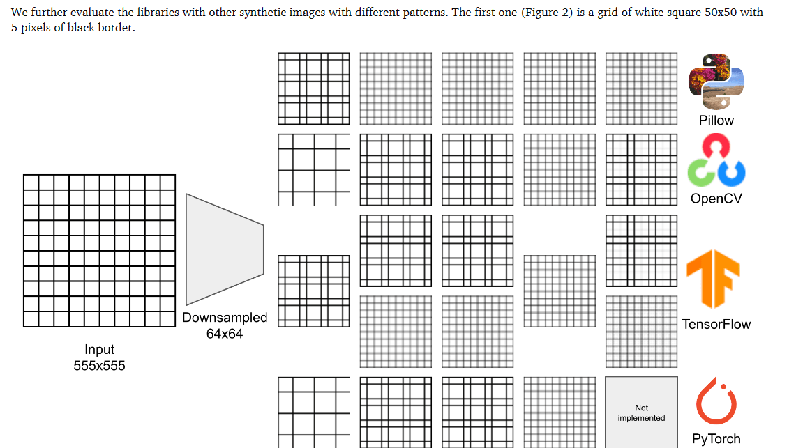
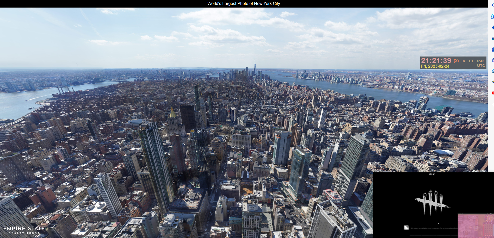
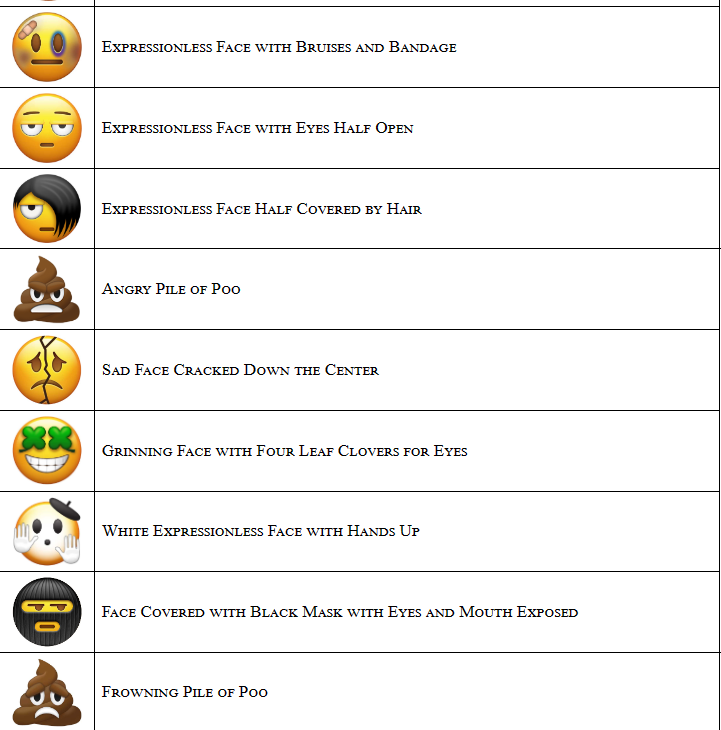
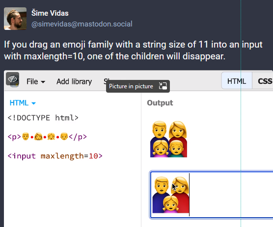
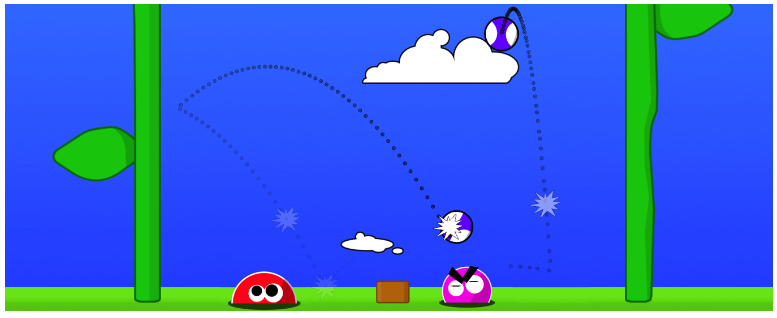
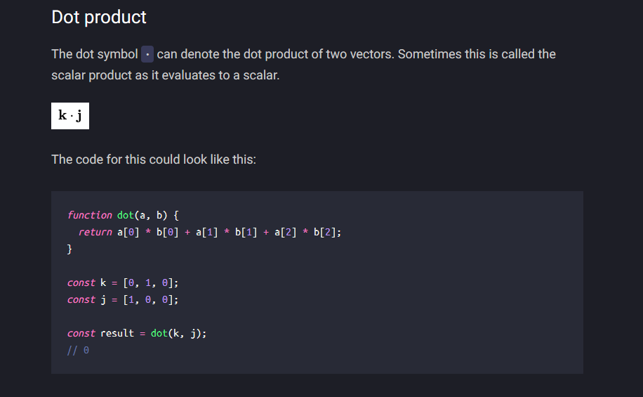
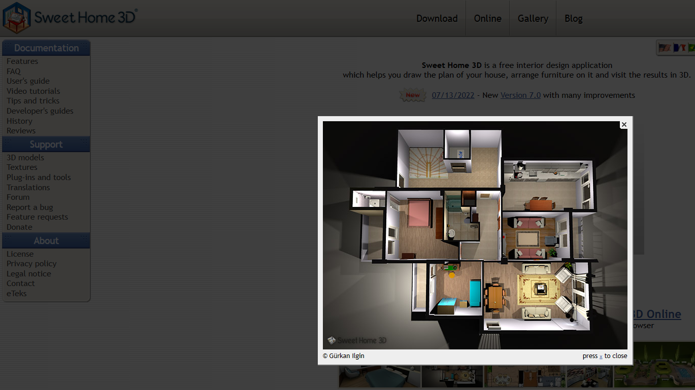
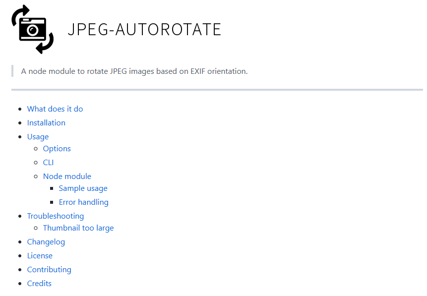

---
layout: post
title:  "Links from my inbox 2023-02-22"
date:   2023-02-22T11:35:00-08:00
categories: links
---

## Good Reads

2023-02-24 [iggredible/Learn-Vim: Learning Vim and Vimscript doesn't have to be hard. This is the guide that you're looking for 📖](https://github.com/iggredible/Learn-Vim)

> It is a guide to learn the good parts of Vim, a powerful text editor. It covers topics such as starting Vim, editing text, moving around, searching, macros, registers, buffers, windows, tabs and more. Written in a clear and concise style with examples and exercises. The guide is suitable for beginners who want to learn Vim quickly and efficiently.

2023-02-16 [The dangers behind image resizing](https://zuru.tech/blog/the-dangers-behind-image-resizing)

>  

## Fun

2023-02-18 [World's Largest Photo of New York City](https://www.earthcam.net/projects/empirestatebuilding/gigapixelpanorama/2021/)

> 80k megapixel panorama photograph of New York City (2021)
> This is my screren!
> 

2023-02-17 [Rejected Emoji Proposals](https://charlottebuff.com/unicode/misc/rejected-emoji-proposals/) 

> 
> Oh, 💩!

2023-02-24 [If you drag an emoji family with a string size of 11 into an input with maxlength=10, one of the children will disappear.](https://mastodon.social/@simevidas/109919980697679274)

> 

2023-02-24 [Even hackers are reportedly getting laid off by organized crime groups](https://www.businessinsider.com/hackers-ransomware-getting-laid-off-amid-better-cybersecurity-report-2023-2)

## Games

2023-02-21 [I made a game, Tippy Coco](https://tippycoco.com)

> Tippy Coco is a free, open-source game by Chris Coyne (chriscoyne.com / @malgorithms). The inspiration for this game was Slime Volleyball, a 1999 Java Applet by Daniel Wedge & Quin Pendragon. I called an earlier version of this game They Came from the Ground.

> The game is programmed in JavaScript (well, TypeScript) and uses simple HTML Canvas drawing.

> Music in Tippy Coco is by my friend Christian Rudder, of the band Bishop Allen. "Rejected!" and "Slam!" and "Kiss" were voiced by Jennie, Cameron, and Abbott Coyne. And the character TippyCoco is named after our friends' dog, TippiCocoa.
> 

## Teaching the Machine!

2023-02-23 [Yann LeCun's Publications](http://yann.lecun.com/exdb/publis/index.html)

> A set of examples and publications I am currently following for Machine Learning exercise. I  subconsciously do not trust these machine learners and now I am trying to figure out why :D. 

2023-02-21 [Mathematical notation for JavaScript developers explained](https://runjs.app/blog/mathematical-notation-for-javascript-developers-explained)

> This article explains how to use mathematical notation in JavaScript, such as dot and cross symbols for scalar and vector products, sigma and pi symbols for summation and multiplication of sequences, bars for absolute value and norm of vectors, etc. It also provides code snippets that demonstrate how to implement these operations using built-in methods or libraries
> 

2023-02-20 [GitHub - PacktPublishing/Hands-On-Machine-Learning-with-CPP: Hands-On Machine Learning with C++, published by Packt](https://github.com/PacktPublishing/Hands-On-Machine-Learning-with-CPP)

> **Got this!** 
> [Amazon.com: Hands-On Machine Learning with C++: Build, train, and deploy end-to-end machine learning and deep learning pipelines eBook : Kolodiazhnyi, Kirill: Kindle Store](https://www.amazon.com/gp/product/B0881XCLY8/)
> 

2023-02-18 [Introduction to Machine Learning using C++ Engineering Education EngEd Program Section](https://www.section.io/engineering-education/an-introduction-to-machine-learning-using-c++/)

> The article aims to teach beginners how to use C++ for machine learning by providing a clear and concise tutorial with code examples. It also encourages readers to explore more advanced topics and applications of machine learning using C++
>
> Yeah, I have asked BingGPT: 
> 📢 please summarize the article in your own words: extract main points and ideas as a list, write a short summary for each item.
>
> Use more fluent language, pleasant to read.
>
> https://www.section.io/engineering-education/an-introduction-to-machine-learning-using-c++/

## C# and .NET

2023-02-20 [What is .NET, and why should you choose it? - .NET Blog](https://devblogs.microsoft.com/dotnet/why-dotnet/)

> The article explains what .NET is and why developers should choose it as their platform for building applications. It highlights the benefits of .NET such as being free, cross-platform, open source, fast, secure, and supported by Microsoft and a large community. It also describes how .NET works as a unified platform that consists of multiple components such as languages, libraries, frameworks, tools, and runtimes. The article gives examples of different types of applications that can be built with .NET such as web apps, mobile apps, desktop apps, cloud services, games, IoT devices, and more. It also showcases some success stories of companies and developers who have used .NET to create innovative solutions for various domains.
> - 2023-02-20 [Thoughts on 'What is .NET, and why should you choose it?'](https://andrewlock.net/thoughts-on-what-is-dotnet-and-why-should-you-choose-it/)
> - 2023-02-20 [C# Tip: List Pattern to match an collection against a sequence of patterns - Code4IT](https://www.code4it.dev/csharptips/list-pattern)

## Tools

2023-02-19 [danielgatis/rembg: Rembg is a tool to remove images background](https://github.com/danielgatis/rembg) 

>  Works! But Python.
> 

2023-02-18 [robinmoisson/staticrypt: Password protect a static HTML page](https://github.com/robinmoisson/staticrypt)

> [HN](https://news.ycombinator.com/item?id=34849024)
> StatiCrypt uses AES-256 to encrypt your HTML file with your passphrase and return a static page including a password prompt and the javascript decryption logic that you can safely upload anywhere (see [what the page looks like](https://robinmoisson.github.io/staticrypt/example/example_encrypted.html)).

2023-02-18 [How to Extract Images from a Video Using FFmpeg - Bannerbear](https://www.bannerbear.com/blog/how-to-extract-images-from-a-video-using-ffmpeg/)

2023-02-18 [Sweet Home 3D - Draw floor plans and arrange furniture freely](https://www.sweethome3d.com/)

> Sweet Home 3D is a free interior design application
> which helps you draw the plan of your house, arrange furniture on it and visit the results in 3D.
>
> Need to get back to this tool to model the home of my dream!
> 
>
> - [Jam3/math-as-code: a cheat-sheet for mathematical notation in code form](https://github.com/Jam3/math-as-code)

2023-02-16 [johansatge/jpeg-autorotate: 📸 Node module to rotate JPEG images based on EXIF orientation.](https://github.com/johansatge/jpeg-autorotate)

> 

2023-02-16 [How To Build A Magazine Layout With CSS Grid Areas — Smashing Magazine](https://www.smashingmagazine.com/2023/02/build-magazine-layout-css-grid-areas/)

> As a bonus, we will also touch on `object-fit` and `aspect-ratio`, which come in handy as well.
> 

## A Keypad to Control my Entire Desk Setup

2023-02-24 [GitHub - davidz-yt/desk-controller: A Keypad to Control my Entire Desk Setup](https://github.com/davidz-yt/desk-controller)

2023-02-24 [Work From Hype - YouTube](https://www.youtube.com/channel/UCcCYTCDxsMl84_btikjY40Q)

- http://www.hidmacros.eu 
- https://espanso.org/
- https://github.com/hwtnb/SylphyHornPlusWin11
- https://github.com/haimgel/display-switch

## Security

2023-02-21 [Snort - Network Intrusion Detection & Prevention System](https://www.snort.org/) 

> I just put it here, it is so cool
>
> Snort is the foremost Open Source Intrusion Prevention System (IPS) in the world. Snort IPS uses a series of rules that help define malicious network activity and uses those rules to find packets that match against them and generates alerts for users.
>
> Snort can be deployed inline to stop these packets, as well. Snort has three primary uses: As a packet sniffer like tcpdump, as a packet logger — which is useful for network traffic debugging, or it can be used as a full-blown network intrusion prevention system. Snort can be downloaded and configured for personal and business use alike.

2023-02-19 [Security Event Triage: Detecting Malicious Traffic with Signature and Session Analysis Pluralsight](https://app.pluralsight.com/course-player?clipId=30d9fe2c-fbcd-4e22-bc73-e31f5f43d6a7) 

> Pluralsight training where I've learned about **S N O R T !** 
>
> Good training.

## Watch

2023-02-23 [a day in the life of an engineer working from home - YouTube](https://www.youtube.com/watch?v=Rgx8dpiPwpA) 

> Oh, this is fun!
> 2023-02-19 [if Apple made window blinds... - YouTube](https://www.youtube.com/watch?v=Hv6EMd8dlQk)

2023-02-21 [Standard C++ toolset - Anastasia Kazakova - Meeting C++ 2022 - YouTube](https://www.youtube.com/watch?v=-UW0Fc03th4)

> C++ is about to turn 40. Though the ecosystem was very diverse and incomplete for many years, it is getting better! In this talk, I will discuss:
> The typical “project model - compiler - debugger” triad, and how it still depends on the area of usage (Embedded or Game Development).
> How the build systems and dependency managers are now more standard.
> How Clang affected the standard toolset in all areas, forming not only a baseline for compilers, but also formatters, code analyzers, and IDEs.
> How many code analyzers exist for C++ and why there is still room for improvement.
> How unit testing and code coverage solutions can be used effectively.
> And finally, how the language committee is learning to listen to and help standard toolset contributors.

## Oh, Scala
> I just put it here

2023-02-16 [From ES6 to Scala: Basics - Scala.js](https://www.scala-js.org/doc/sjs-for-js/es6-to-scala-part1.html)
2023-02-15 [GitHub - alexandru/scala-best-practices: A collection of Scala best practices](https://github.com/alexandru/scala-best-practices)
2023-02-15 [lauris/awesome-scala: A community driven list of useful Scala libraries, frameworks and software.](https://github.com/lauris/awesome-scala)
2023-02-15 [Scalafix · Refactoring and linting tool for Scala](https://scalacenter.github.io/scalafix/)
2023-02-14 [zouzias/spark-hello-world: A simple hello world using Apache Spark](https://github.com/zouzias/spark-hello-world)
2023-02-14 [sbt Reference Manual — Installing sbt on Windows](https://www.scala-sbt.org/1.x/docs/Installing-sbt-on-Windows.html)
2023-02-14 [lolski/sbt-cheatsheet: Simple, no-nonsense guide to getting your Scala project up and running](https://github.com/lolski/sbt-cheatsheet)
2023-02-14 [marconilanna/scala-boilerplate: Starting point for Scala projects](https://github.com/marconilanna/scala-boilerplate)
2023-02-13 [Hyperspace indexes for Apache Spark - Azure Synapse Analytics Microsoft Learn](https://learn.microsoft.com/en-us/azure/synapse-analytics/spark/apache-spark-performance-hyperspace?pivots=programming-language-scala)
2023-02-13 [The Azure Spark Showdown - Databricks VS Synapse Analytics - Simon Whiteley - YouTube](https://www.youtube.com/watch?v=FjsnVueXijQ)
2023-02-06 [ossu/computer-science: Path to a free self-taught education in Computer Science!](https://github.com/ossu/computer-science)

## Value Objects

> I am just to lazy to read this
> Some of this stuff could be totally wrong, and I agree and disagree with everything

2023-01-08 [Value Objects · objc.io](https://www.objc.io/issues/7-foundation/value-objects/)

2023-01-08 [Java Value Objects in Action with Valhalla - JEP Café #15 - YouTube](https://www.youtube.com/watch?v=ViZkEgshiXI)

2023-01-08 [Value Objects Explained](https://patricklouys.com/2017/06/04/value-objects-explained/)

2023-01-08 [Value Objects - DDD w/ TypeScript Khalil Stemmler](https://khalilstemmler.com/articles/typescript-value-object/)

2023-01-08 [Value Object Refactoring Shaun Finglas](https://blog.shaunfinglas.co.uk/2015/02/value-object-refactoring.html)

2022-12-28 [Domain-Driven Design Reference](https://www.domainlanguage.com/wp-content/uploads/2016/05/DDD_Reference_2015-03.pdf)

