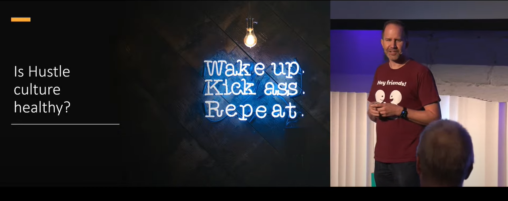
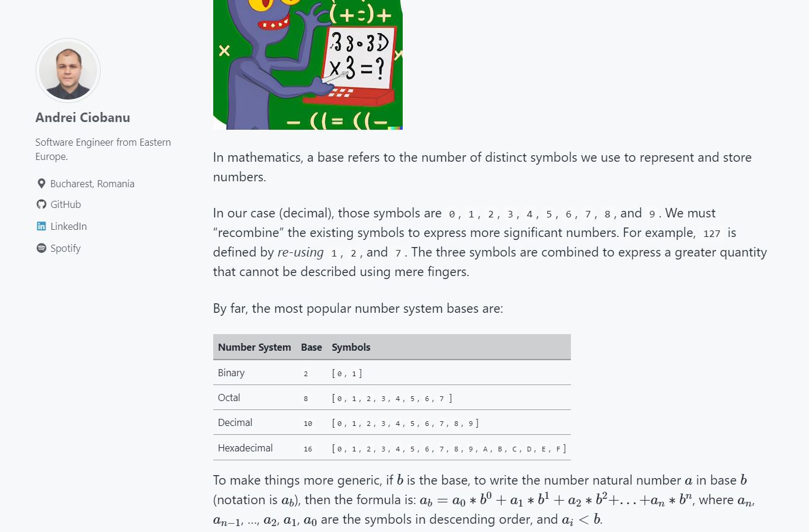
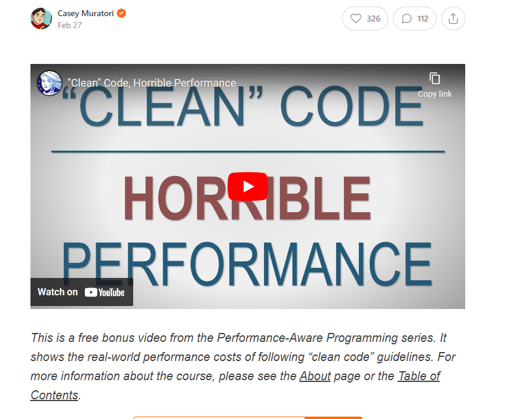
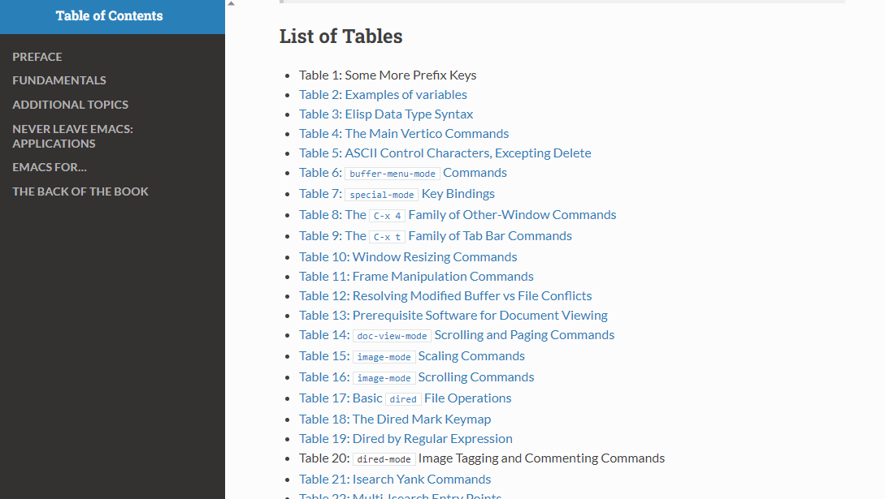

---
layout: post
title:  "Links from my inbox 2023-03-11"
date:   2023-03-11T09:42:00-08:00
categories: links
---

## Highlights

2023-03-08 [Rules for Radical Cpp Engineers - Improve Your C++ Code, Team, & Organization - David Sankel CppCon - YouTube](https://www.youtube.com/watch?v=ady2mUIQpt4)

> David Sankel is talking about politics and driving political change in your organization. The talk is based on 
> [Rules for Radicals - Wikipedia](https://en.wikipedia.org/wiki/Rules_for_Radicals) by Saul Alinsky.
>
> 
> The Rules
>
> - "Power is not only what you have but what the enemy thinks you have."
> - "Never go outside the expertise of your people."
> - "Whenever possible go outside the expertise of the enemy."
> - "Make the enemy live up to its own book of rules."
> - "Ridicule is man's most potent weapon. There is no defense. It is almost impossible to counterattack ridicule. Also it infuriates the opposition, who then react to your advantage."
> - "A good tactic is one your people enjoy."
> - "A tactic that drags on too long becomes a drag."
> - "Keep the pressure on."
> - "The threat is usually more terrifying than the thing itself. "
> - "The major premise for tactics is the development of operations that will maintain a constant pressure upon the opposition."
> - "If you push a negative hard and deep enough it will break through into its counterside; this is based on the principle that every positive has its negative."
> - "The price of a successful attack is a constructive alternative."
> - "Pick the target, freeze it, personalize it, and polarize it. "
>
> and [Ella Jo Baker - Wikipedia](https://en.wikipedia.org/wiki/Ella_Baker)

2023-03-11 [Keynote - Building Teams Through Systems Thinking and Stories - Scott Hanselman - YouTube](https://www.youtube.com/watch?v=VFIw0LlULyc) 

> 
>
> A fun talk which will improve your mood and charge your Tesla!
> a talk by **Scott Hanselman** that explores the role of the senior engineer as a colleague to an early-in-career engineer, the difference between learning how to code and learning how to think about systems, and the difference between mentorship and sponsorship. The video aims to facilitate a welcoming culture of learning and exploration and normalize not knowing the answer.

## Good Reads

2023-03-07 [12 Habits of Successful Senior Software Developers Alex Hyett](https://www.alexhyett.com/habits-of-successful-software-developers/)

> 1. Not being afraid to ask questions
> 2. Test your own code
> 3. Being quick to ask for help
> 4. Be reliable
> 5. Question everything
> 6. Automate everything
> 7. Take ownership of your work
> 8. Keep Learning
> 9. Leave the code in a better state than you found it
> 10. Get very good at solving problems
> 11. See the big picture
> 12. Think first, code last

2023-03-03 📌 [Demystifying bitwise operations, a gentle C tutorial andreinc](https://www.andreinc.net/2023/02/01/demystifying-bitwise-ops)

> This article is an early draft tutorial on bitwise operations, a fundamental part of computer science. It explains how computers represent and manipulate data and the importance of bitwise operations in writing performance-critical code.
> 

2023-03-03 [Why Python keeps growing, explained The GitHub Blog](https://github.blog/2023-03-02-why-python-keeps-growing-explained/)

> Python is the most popular programming language in the world. It’s used by millions of developers, and it’s the language of choice for many of the world’s most popular websites and applications. But why is Python so popular? Why does it keep growing? And what does the future hold for Python? In this post, we’ll explore the reasons why Python is so popular, and why it’s likely to keep growing in the future.
>
> 2023-03-03 [Why Python keeps growing, explained Hacker News Discussion](https://news.ycombinator.com/item?id=35006777)
> 

2023-02-28 ["Clean" Code, Horrible Performance - by Casey Muratori](https://www.computerenhance.com/p/clean-code-horrible-performance)

> An article and video that criticizes some of the common practices of “clean” code that can lead to poor performance and complexity in software development.
> 

## Projects

2023-03-08 [Free The Game Boy - Battery free Game Boy](https://www.freethegameboy.info/)

> This page is about the ENGAGE project, which is a battery-free, energy harvesting Game Boy that can play retro games using solar panels and button presses. The page describes the challenges and solutions of designing such a device.
>
> 

2023-03-11 [Self hosting in 2023 - Grifel](https://grifel.dev/decentralization/)

> Inspired by @JeffGeerling and his videos about creating a Pi Cluster I bought myself a second hand Raspberry Pi 4b 4GB for around 60$. There are of course alternatives to it, but I’ve had one of those running already for almost a year with literally 0 downtime.
> 

## 30 Days

2023-03-03 [Asabeneh/30-Days-Of-Python ](https://github.com/Asabeneh/30-Days-Of-Python)

> 30 days of Python programming challenge is a step-by-step guide to learn the Python programming language in 30 days. This challenge may take more than100 days, follow your own pace.

2023-03-03 [Asabeneh/30-Days-Of-JavaScript](https://github.com/Asabeneh/30-Days-Of-JavaScript)

> 30 days of JavaScript programming challenge is a step-by-step guide to learn JavaScript programming language in 30 days. This challenge may take more than 100 days, please just follow your own pace.

2023-03-03 [swapnilsparsh/30DaysOfJavaScript](https://github.com/swapnilsparsh/30DaysOfJavaScript)

> Projects made during the 30 days of the JavaScript challenge

2023-03-03 [xeoneux/30-Days-of-Code](https://github.com/xeoneux/30-Days-of-Code)

> 👨‍💻 30 Days of Code by HackerRank Solutions in C, C++, C#, F#, Go, Java, JavaScript, Python, Ruby, Swift & TypeScript. PRs Welcome! 😄

2023-03-03 [Asabeneh/30-Days-Of-React](https://github.com/Asabeneh/30-Days-Of-React)

> 30 Days of React challenge is a step by step guide to learn React in 30 days. It requires HTML, CSS, and JavaScript knowledge. You should be comfortable with JavaScript before you start to React. If you are not comfortable with JavaScript check out 30DaysOfJavaScript. This is a continuation of 30 Days Of JS. This challenge may take more than 100 days, follow your own pace.

2023-03-03 [ThinamXx/300Days__MachineLearningDeepLearning](https://github.com/ThinamXx/300Days__MachineLearningDeepLearning)

> I am sharing my Journey of 300DaysOfData in Machine Learning and Deep Learning.

2023-03-03 [cHowTv/300days-of-hacking](https://github.com/cHowTv/300days-of-hacking)

> This program is aimed at teaching young and aspiring hackers the skills they need to stand out in the pretesting community... Keep your eyes out for updates on this repo. Professionals/Beginners are welcomed to fork and contribute to the community...

## C++

2023-03-08 [gabime/spdlog: Fast C++ logging library.](https://github.com/gabime/spdlog)

> Very fast, header-only/compiled, C++ logging library.

2023-03-08 [fmtlib/fmt: A modern formatting library](https://github.com/fmtlib/fmt)

> **{fmt}** is an open-source formatting library providing a fast and safe alternative to C stdio and C++ iostreams.

Some research about bringing Rust's Result in C++ code:

- 2023-03-02 [C++ equivalent of Rust enums - Stack Overflow](https://stackoverflow.com/questions/64017982/c-equivalent-of-rust-enums)

- 2023-03-02 [Noah11012/result-for-cpp: C++ implementation of Rust's Result](https://github.com/Noah11012/result-for-cpp)

## Azure

2023-03-07 [Tutorial: Use Azure Functions to process real-time data from Azure Event Hubs and persist to Azure Cosmos DB - DEV Community](https://dev.to/azure/tutorial-use-azure-functions-to-process-real-time-data-from-azure-event-hubs-and-persist-to-azure-cosmos-db-2co8)

> a tutorial on how to use Azure Functions to process real-time data from Azure Event Hubs and persist it to Azure Cosmos DB. It demonstrates how to combine a real-time data ingestion component with a Serverless processing layer using a sample app.

> If you want to ingest data from Event Hub to Cosmos DB, one possible solution is to use Azure Functions with an Event Hub trigger and a Cosmos DB output binding. This way, you can process real-time data from Event Hubs and persist it to Cosmos DB123.
>
> To implement this solution, you need to:
>
> Create an Event Hub namespace and an event hub
>
> Create a Cosmos DB account, database and container
>
> Create a Function App with an Event Hub trigger function
>
> Configure the function settings with the connection strings for Event Hubs and Cosmos DB
>
> Add a Cosmos DB output binding annotation to your function code
>
> Write your function logic to process the event data and return a document object for Cosmos DB

## Emacs

2023-03-03 [Use GNU Emacs](https://www2.lib.uchicago.edu/keith/emacs/)

> Use GNU Emacs. The Plain Text Computing Environment
>
> 

## Markdown WYSIWYG editors

- 2023-03-02 [AppFlowy.IO](https://appflowy.io/)
- 2023-03-02 [A Markdown Editor for the 21st Century Zettlr](https://www.zettlr.com/)
- 2023-03-02 [marktext/marktext: 📝A simple and elegant markdown editor, available for Linux, macOS and Windows.](https://github.com/marktext/marktext)
- 2023-03-02 [ghostwriter - No excuses. No distractions. Just write.](https://ghostwriter.kde.org/)

## Web and JavaScript

2023-03-07 [js-snow-bookmarklet/bookmarklet.js at master · wonderful72pike/js-snow-bookmarklet](https://github.com/wonderful72pike/js-snow-bookmarklet/blob/master/bookmarklet.js)

> Just a simple and fun bookmarklet! ❄ ❄
>
> ❄ ❄ ❄ ❄ ❄
>
> ❄  ❄  `____` ❄
>
> ❄❄ ❄ ❄ ❄❄

## Workplace

- 2023-03-03 [viraptor/reverse-interview: Questions to ask the company during your interview](https://github.com/viraptor/reverse-interview)
  
  > This is a list of questions which may be interesting to a tech job applicant. The points are not ordered and many may not apply to a given position or work type. It was started as my personal list of questions, which grew over time to include both things I'd like to see more of and red flags which I'd like to avoid. I've also noticed how few questions were asked by people I interviewed and I think those were missed opportunities.
