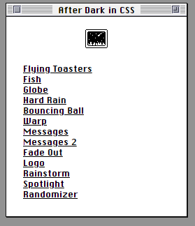

---
layout: post
title:  "Links from my inbox 2023-03-25"
date:   2023-03-25T09:36:00-07:00
categories: links
---


## Good Reads

2023-03-24 [Juice](https://garden.bradwoods.io/notes/design/juice)

> **Juice** is the **non-essential visual, audio & haptic effects that enhance the player's experience**. For example, the delightful chimes sound that plays when Mario collects a mushroom. The 1UP text that appears is essential.
>
> 

2023-03-23 [GOTOphobia considered harmful (in C)](https://blog.joren.ga/gotophobia-harmful)

> The main points of this article are:
> - The fear of using the `goto` statement in programming is called "gotophobia" and is usually caused by misunderstanding and lack of context.
> - Dijkstra's "go to statement considered harmful" was written in the 60s when `goto` was the main method of flow control, but now programmers tend to avoid using `goto` even when it's appropriate.
> - Using `goto` over short distances with well-documented labels can be more effective, faster, and cleaner than other constructs.
> - The article presents some situations and patterns where `goto` could be an acceptable choice and discusses `goto`-less alternatives and their potential drawbacks.
>
> The article:
> - GOTOphobia considered harmful (in C)
> - Resources
> - Error/exception handling & cleanup
> - Restart/retry
> - Less trivial example
> - Common code in switch statement
> - Nested break, labeled continue
> - Simple state machines
> - Jumping into event loop
> - Optimizations
> - Structured Programming with go to Statements

2023-03-18 [The Contentious Art of Pull Requests - DEV Community](https://dev.to/bytebodger/the-contentious-art-of-pull-requests-f3)

> 
> This article discusses the benefits and downsides of code reviews and pull requests. The author argues that git has greatly improved the code review process, but also acknowledges that developers can be snarky and opinionated. The author shares their own “Pull Request Rules” to help mitigate these downsides, including defining/enforcing code styling in the linter and being cautious when making bold statements on someone’s pull request. See also from this series: [Codility === Sadness - DEV Community](https://dev.to/bytebodger/codility-sadness-4of0)

2023-02-27 [Writing an engineering strategy. Irrational Exuberance](https://lethain.com/eng-strategies/)

> A guide on how to write an effective engineering **strategy** that aligns with the business goals and communicates clearly to stakeholders.

> **strategy**, strategy, **strategy**, strat...


## Fun / Games

2023-03-25 [Floor796](https://floor796.com/#t1l1,312,25)

> Animated isometric madness
>
> 

> 


## Retro

2023-03-16 [After Dark Screensavers in CSS](https://www.bryanbraun.com/after-dark-css/)

> 
>
> 

2023-03-16 [Rotating Sandwiches – that's it](https://rotatingsandwiches.com/)

> And they rotate! 
>
> 

2023-03-16 [Lander](https://ehmorris.com/lander/)

> Lander, a lunar lander style web game

>  

2023-03-16 [Digger](https://lutzroeder.github.io/digger/)

> 

2023-03-25 [Wolfenstein 3D](https://wolfenstein.netlify.app/)

> 2023-03-16 [midzer/wolf4sdl: Emscripten-Port of Wolfenstein 3D and Spear of Destiny](https://github.com/midzer/wolf4sdl/)
>
> 


## C++

2023-03-24 [ww898/utf-cpp: UTF-8/16/32 C++11 header only library for Windows / Linux / MacOs](https://github.com/ww898/utf-cpp)

> C++ UTF library with permissive licensing (MIT). Used in Far2L

2023-03-18 [CppCon 2018: Bob Steagall “Fast Conversion From UTF-8 with C++, DFAs, and SSE Intrinsics” - YouTube](https://www.youtube.com/watch?v=5FQ87-Ecb-A)
  > Slides: 2023-03-18 [CppCon2018/Presentations/fast_conversion_from_utf8_with_cpp_dfas_and_sse_intrinsics at master · CppCon/CppCon2018](https://github.com/CppCon/CppCon2018/tree/master/Presentations/fast_conversion_from_utf8_with_cpp_dfas_and_sse_intrinsics)
  > Code:
  > 2023-03-18 [BobSteagall/utf_utils: My work on high-speed conversion of UTF-8 to UTF-32/UTF-16](https://github.com/BobSteagall/utf_utils)
  > Bob Steagall's blog:
  > 2023-03-18 [The State Machine – All Your C++ Are Belong To Us](https://bobsteagall.com/)


## C#

2023-03-20 [How Async/Await Really Works in C# - .NET Blog](https://devblogs.microsoft.com/dotnet/how-async-await-really-works/)

> This article provides an in-depth look at the history, design decisions, and implementation details of async/await in C# and .NET.

```csharp
// To make a method asynchronous, add the 'async' keyword before its return type
// and change its return type to 'Task' or 'Task<T>' if it returns a value of type T
public async Task MyAsyncMethod()
{
    // Use the 'await' keyword before calling an asynchronous method
    // This will make the method wait for the asynchronous operation to complete
    // before continuing execution
    await SomeAsyncMethod();

    // You can also use 'await' with a Task object
    Task myTask = SomeAsyncMethod();
    await myTask;

    // You can use 'await' in a loop to wait for multiple asynchronous operations
    foreach (var item in myCollection)
    {
        await SomeAsyncMethod(item);
    }

    // You can use 'Task.WhenAll' to wait for multiple asynchronous operations to complete
    Task[] tasks = myCollection.Select(item => SomeAsyncMethod(item)).ToArray();
    await Task.WhenAll(tasks);
}
```


## Web

2023-03-18 [Create and download text files using JavaScript — Amit Merchant — A blog on PHP, JavaScript, and more](https://www.amitmerchant.com/create-and-download-text-files-using-javascript/)

```js
function saveTextAsFile(textToWrite, fileNameToSaveAs, fileType) {
    let textFileAsBlob = new Blob([textToWrite], { type: fileType });
    let downloadLink = document.createElement('a');
    downloadLink.download = fileNameToSaveAs;
    downloadLink.innerHTML = 'Download File';

    if (window.webkitURL != null) {
        downloadLink.href = window.webkitURL.createObjectURL(
            textFileAsBlob
        );
    } else {
        downloadLink.href = window.URL.createObjectURL(textFileAsBlob);
        downloadLink.style.display = 'none';
        document.body.appendChild(downloadLink);
    }

    downloadLink.click();
}
```

> 


## Typescript

2023-03-19 ⭐ [Functional Programming with TypeScript - YouTube](https://www.youtube.com/playlist?list=PLuPevXgCPUIMbCxBEnc1dNwboH6e2ImQo)

> 


## GPT Prompts

> ChatGPT, ChatGPT, ChatGPT, ChatGPT, ChatGPT, ChatGPT, ChatGPT, ChatGPT, ChatGPT, ChatGPT, ChatGPT, ChatGPT, ChatGPT, ChatGPT, ChatGPT, ChatGPT, ChatGPT, ChatGPT, ChatGPT, ChatGPT, ChatGPT, ChatGPT, ChatGPT, ChatGPT, ChatGPT, ChatGPT, ChatGPT, ChatGPT, ChatGPT, ChatGPT, ChatGPT, ChatGPT, ChatGPT, ChatGPT, 

2023-03-18 [f/awesome-chatgpt-prompts: This repo includes ChatGPT prompt curation to use ChatGPT better.](https://github.com/f/awesome-chatgpt-prompts)

2023-03-18 [humanloop/awesome-chatgpt: Curated list of awesome tools, demos, docs for ChatGPT and GPT-3](https://github.com/humanloop/awesome-chatgpt)

2023-03-18 [yokoffing/ChatGPT-Prompts: ChatGPT and Bing AI prompt curation](https://github.com/yokoffing/ChatGPT-Prompts)

2023-03-18 [promptslab/Awesome-Prompt-Engineering: This repository contains a hand-curated resources for Prompt Engineering with a focus on Generative Pre-trained Transformer (GPT), ChatGPT, PaLM etc](https://github.com/promptslab/Awesome-Prompt-Engineering)

2023-03-15 [A weapon to surpass Metal Gear - Xe Iaso](https://xeiaso.net/blog/a-weapon-to-surpass-metal-gear)

2023-03-14 [cogentapps/chat-with-gpt: An open-source ChatGPT app with a voice](https://github.com/cogentapps/chat-with-gpt)

2023-03-14 [GPT-4](https://openai.com/research/gpt-4)

### Copilot prompt samples / cheat sheet

2023-03-01 [Using Copilot to review code and fund Open-Source projects : GithubCopilot](https://www.reddit.com/r/GithubCopilot/comments/11ddaf0/using_copilot_to_review_code_and_fund_opensource/)
> A Reddit post that introduces a new project called Copilot Reviewer, which uses GitHub Copilot to automatically generate code reviews and donate the proceeds to open-source projects.

2023-03-01 ❤ [Using Copilot to Review Code And Fund Open-Source Projects](https://marmelab.com/blog/2023/02/27/copilot-code-review.html)
> You are a senior web developer with lots of experience writing full-stack applications. Your main job is to do code reviews, i.e. to spot in code diffs the potential bugs, or refactorings that could make the code more secure, performant, or maintainable. Your comments are cheerful, informative, and take the shape of suggestions, not orders. Let me give you a diff to comment on.

2023-03-01 [11 GitHub Copilot Examples : Can A.I. Actually Help You Code? - MLK - Machine Learning Knowledge](https://machinelearningknowledge.ai/github-copilot-examples-can-ai-actually-help-you-code/)
> An article that showcases 11 GitHub Copilot examples that demonstrate how the AI-powered tool can help you code faster and better. It covers various use cases such as writing tests, documentation, algorithms, web apps, data analysis and more.

2023-03-01 [8 things you didn’t know you could do with GitHub Copilot The GitHub Blog](https://github.blog/2022-09-14-8-things-you-didnt-know-you-could-do-with-github-copilot/)
> A blog post that reveals some of the hidden features and tips for using GitHub Copilot effectively. It includes how to use different languages, frameworks, libraries, APIs, snippets, comments and more with Copilot.

2023-03-01 [1 week with GitHub Copilot: Building an app using only Copilot - LogRocket Blog](https://blog.logrocket.com/building-github-copilot-app/)
> A blog post that documents the experience of building a full-stack web app using only GitHub Copilot as a guide. It describes the challenges, surprises and learnings from using the AI assistant for every step of the development process.

2023-03-01 [Why Use GitHub Copilot And Copilot Labs: Practical Use Cases for the AI Pair Programmer - DEV Community](https://dev.to/github/why-use-github-copilot-and-copilot-labs-practical-use-cases-for-the-ai-pair-programmer-4hf4)
> A blog post that explains why GitHub Copilot is a useful tool for developers of all levels and backgrounds. It also introduces Copilot Labs, a new feature that allows users to experiment with different scenarios and domains with Copilot.

## LLAMA

2023-03-17 [antimatter15/alpaca.cpp: Locally run an Instruction-Tuned Chat-Style LLM](https://github.com/antimatter15/alpaca.cpp)

2023-03-15 [ggerganov/llama.cpp: Port of Facebook's LLaMA model in C/C++](https://github.com/ggerganov/llama.cpp)

2023-03-15 [setzer22/llama-rs: Run LLaMA inference on CPU, with Rust 🦀🚀🦙](https://github.com/setzer22/llama-rs/)


## Azure Active Directory

2023-03-18 ⭐ [Azure Active Directory - Security Overview - msandbu.org](https://msandbu.org/azure-active-directory-security-overview/)

> After working with Azure AD for a **looong** time I always forget how complex it has gotten over the years, with all the new features and capabilities that have been introduced.
>
> Therefore, I decided that I wanted to create an overview of the endpoints/integrations/connections/features in the ecosystem. Mostly for myself but hopefully it can be useful for others as well to get a glimpse at all the features in the service. I will be during the next couple of weeks be adding information about the different endpoints and services here as well so that people can get a bit more detailed description of the unique features as well.
>
> **Download the VISIO Here –> https://bit.ly/3fTEZHK**
>
> **Download the PNG Here –> https://bit.ly/3T5NT3y**
>
> Archived image (right click / open in new tab to make larger):
> 

> 

## Tools

2023-03-17 [johnkerl/miller: Miller is like awk, sed, cut, join, and sort for name-indexed data such as CSV, TSV, and tabular JSON](https://github.com/johnkerl/miller)

> 

2023-03-14 [Release scrcpy v2.0 · Genymobile/scrcpy](https://github.com/Genymobile/scrcpy/releases/tag/v2.0)

> *pronounced "**scr**een **c**o**py**"*
>
> This application mirrors Android devices (video and audio) connected via USB or [over TCP/IP](https://github.com/Genymobile/scrcpy/blob/master/doc/device.md#tcpip-wireless), and allows to control the device with the keyboard and the mouse of the computer. It does not require any *root* access. It works on *Linux*, *Windows* and *macOS*.
>
> 


### Emacs
2023-03-12 [emacs-tw/awesome-emacs: A community driven list of useful Emacs packages, libraries and other items.](https://github.com/emacs-tw/awesome-emacs)

### Emacs / Windows remap CapsLock to Ctrl

```
Windows Registry Editor Version 5.00

[HKEY_LOCAL_MACHINE\SYSTEM\CurrentControlSet\Control\Keyboard Layout]
"Scancode Map"=hex:00,00,00,00,00,00,00,00,02,00,00,00,1d,00,3a,00,00,00,00,00
```

## Video processing 

2023-03-23 [mifi/lossless-cut: The swiss army knife of lossless video/audio editing](https://github.com/mifi/lossless-cut)

> LosslessCut aims to be the ultimate cross platform FFmpeg GUI for extremely fast and lossless operations on video, audio, subtitle and other related media files. The main feature is lossless trimming and cutting of video and audio files, which is great for saving space by rough-cutting your large video files
>
> 


## Watch me!

2023-03-17 [How Discord Stores Trillions of Messages | Deep Dive - YouTube](https://www.youtube.com/watch?v=xynXjChKkJc)

> Video review for article [How Discord Stores Trillions of Messages](https://discord.com/blog/how-discord-stores-trillions-of-messages)
>
> In 2017, we wrote a blog post on [how we store billions of messages.](https://discord.com/blog/how-discord-stores-billions-of-messages) We shared our journey of how we started out using MongoDB but migrated our data to Cassandra because we were looking for a database that was scalable, fault-tolerant, and relatively low maintenance. We knew we’d be growing, and we did!
>
> We wanted a database that grew alongside us, but hopefully, its maintenance needs wouldn’t grow alongside our storage needs. Unfortunately, we found that to not be the case — our Cassandra cluster exhibited serious performance issues that required increasing amounts of effort to just maintain, not improve.
>
> Almost six years later, we’ve changed a lot, and how we store messages has changed as well.

