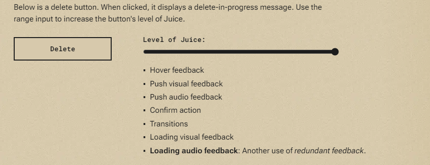

---
layout: post
title:  "Links from my inbox 2023-03-25"
date:   2023-03-25T09:36:00-07:00
categories: links
---

## Good Reads

2023-03-24 [Juice](https://garden.bradwoods.io/notes/design/juice)

> **Juice** is the **non-essential visual, audio & haptic effects that enhance the player's experience**. For example, the delightful chimes sound that plays when Mario collects a mushroom. The 1UP text that appears is essential.
>
> 

2023-03-23 [GOTOphobia considered harmful (in C)](https://blog.joren.ga/gotophobia-harmful)

> The main points of this article are:
> - The fear of using the `goto` statement in programming is called "gotophobia" and is usually caused by misunderstanding and lack of context.
> - Dijkstra's "go to statement considered harmful" was written in the 60s when `goto` was the main method of flow control, but now programmers tend to avoid using `goto` even when it's appropriate.
> - Using `goto` over short distances with well-documented labels can be more effective, faster, and cleaner than other constructs.
> - The article presents some situations and patterns where `goto` could be an acceptable choice and discusses `goto`-less alternatives and their potential drawbacks.
>
> The article:
> - GOTOphobia considered harmful (in C)
> - Resources
> - Error/exception handling & cleanup
> - Restart/retry
> - Less trivial example
> - Common code in switch statement
> - Nested break, labeled continue
> - Simple state machines
> - Jumping into event loop
> - Optimizations
> - Structured Programming with go to Statements

## C++

2023-03-24 [ww898/utf-cpp: UTF-8/16/32 C++11 header only library for Windows / Linux / MacOs](https://github.com/ww898/utf-cpp)

> C++ UTF library with permissive licensing (MIT). Used in Far2L

## Video

2023-03-23 [mifi/lossless-cut: The swiss army knife of lossless video/audio editing](https://github.com/mifi/lossless-cut)

> LosslessCut aims to be the ultimate cross platform FFmpeg GUI for extremely fast and lossless operations on video, audio, subtitle and other related media files. The main feature is lossless trimming and cutting of video and audio files, which is great for saving space by rough-cutting your large video files
>
> 

