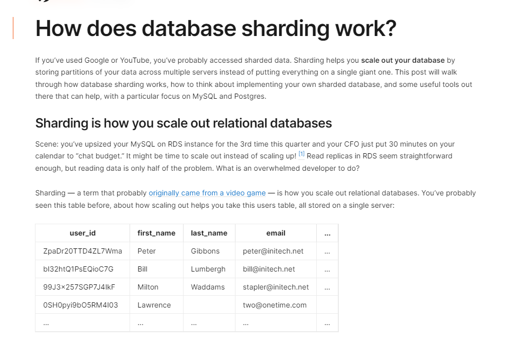
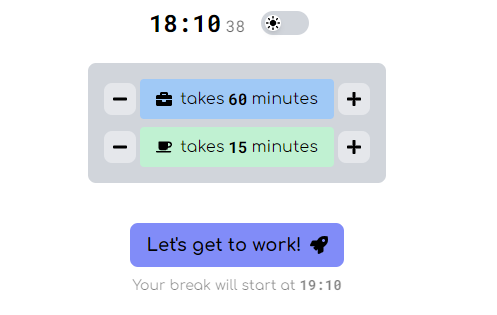
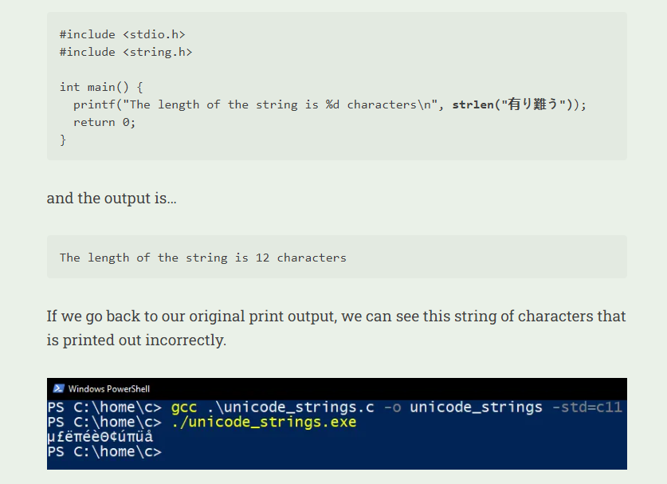

---
layout: post
title:  "Links from my inbox 2023-04-13"
date:   2023-04-13T17:21:00-07:00
categories: links
---


## Good Reads

2023-04-09 [How to stop ruminating - by George Sudarkoff](https://www.sudarkoff.blog/p/how-to-stop-ruminating)

> Rumination is when our minds latch onto a story and just won’t let go, going on and on about it. It’s exhausting! Distracting yourself is fairly common advice, but it’s a bit like trying to ignore a splinter. Maybe it’ll get dislodged from your body and get washed down the drain when you’re showering. But until that happens, it keeps reminding you about itself. Worse yet, it might get inflamed and cause more problems down the line.
>
> Here’s a more productive approach that allowed so many of my clients to get lasting relief from rumination:
>
> 1. Pay attention to the triggers.
> 2. Examine the stories you’re telling yourself, and identify the cognitive distortions your mind might be employing.
> 3. Don’t believe everything you think.
> 4. Practice self-compassion.
> 5. Realize that it’s a practice.

2023-04-08 [How to Design Programs, Second Edition](https://htdp.org/2023-3-6/Book/index.html)

> 

2023-04-03 [How To Do Hard Things - No Small Plans - Every](https://every.to/no-small-plans/how-to-do-hard-things)

> [Russ Harris](https://www.amazon.com/ACT-Made-Simple-Easy-Read/dp/1684033012), author of several popular ACT books, offers a framework of 7 "R"s that can help support action in its early stages:
>
> - **Reminders** - using apps, timers, or other means to remind us of the new behavior
> - **Records** - keeping track of our behavior throughout the day
> - **Rewards** - giving ourselves positive reinforcement for engaging in a behavior
> - **Routines** - building the new behavior around an existing daily habit
> - **Relationships** - finding a friend to do the new behavior with, or who you can talk to about the progress you’re making
> - **Reflecting** - taking time to reflect on the progress you’re making through journaling, discussion with a friend, or in your mind
> - **Restructuring** - making changes to the environment to make it easier to do the new behavior – i.e., throwing out unhealthy food or preparing at night for a morning run

2023-04-06 [The real "must have" tools for programmers - James Dunne](https://jamesdunne.dev/posts/must-have-programming-tools/)

> In no particular order, the best tools for taking care of your mind are:
>
> 1. Quality sleep
> 2. Hydration
> 3. Exercise
> 4. Family and social time
> 5. Notebook and pen

## How the things work?

2023-04-07 [How does database sharding work?](https://planetscale.com/blog/how-does-database-sharding-work)

> 2023-04-07 [Database “sharding” came from UO? – Raph's Website](https://www.raphkoster.com/2009/01/08/database-sharding-came-from-uo/)
> 

2023-04-03 [Database Sharding Explained](https://architecturenotes.co/database-sharding-explained/)

> This article explains what database sharding is, how it works, and the best ways to use it. It also talks about the potential server architectures and data layout. The article is written in a clear and concise manner with examples and comparisons to help readers understand the concept of database sharding better.

> 


2023-04-01 [Clocks and Causality - Ordering Events in Distributed Systems](https://www.exhypothesi.com/clocks-and-causality/)

> 

## Projects

2023-03-31 🚩 [Making an OBS 'Mute' Indicator - Parts Not Included](https://www.partsnotincluded.com/making-obs-mute-indicator/)

> 


## Tools

2023-04-14 [Personal color test-케이테스트](https://ktestone.com/kapable.github.io/personalColorEng/)

> Do it! Very funny!

> 

2023-04-13 [Phind: AI search engine](https://www.phind.com/)

>  2023-04-13 [Show HN: GPT-4-powered web searches for developers | Hacker News](https://news.ycombinator.com/item?id=35543668)
>
> 


## Career advice

2023-04-04 [How to be a -10x Engineer](https://taylor.town/-10x)

> Nullify the output of 10 engineers.
>
> Change requirements as far into development as possible. To avoid blame, obfuscate requirements from the start.
>
> Create 400 hours of busywork.
>
> Ask your team to perform tasks that resemble work. Common examples include presentations, diagrams, and ticket management. Create pointless rituals.
>
> Create 400 hours of burnout/turnover.
>
> Be thankless. Foist blame. Sow confusion. Get angry. Cause others to work overtime.
>
> Hold 10 engineers hostage in a technical discussion.
>
> Let engineers discuss ideas. Encourage them to pursue elegance over pragmatism. Ensure nobody has the authority to make any decisions.

## Job / Codding interviews

2023-04-11 [yangshun/tech-interview-handbook: 💯 Curated coding interview preparation materials for busy software engineers](https://github.com/yangshun/tech-interview-handbook)

2023-04-14 [Software Engineer interviews: Everything you need to prepare | Tech Interview Handbook](https://www.techinterviewhandbook.org/software-engineering-interview-guide/)

> 

2023-04-07 👉 [trekhleb/javascript-algorithms: 📝 Algorithms and data structures implemented in JavaScript with explanations and links to further readings](https://github.com/trekhleb/javascript-algorithms)


## ADHD

2023-04-07 [Comics  Dani Donovan: ADHD Comics](https://www.adhddd.com/comics/)

> 

2023-04-07 [Brain pls work](https://brainpls.work/)

> ADHD-friendly Pomodoro web app
> 
>
>  2023-04-07 [Show HN: ADHD-friendly Pomodoro web app | Hacker News](https://news.ycombinator.com/item?id=35471129)


## Web

2023-03-24 [Laying Out a Print Book With CSS | Ian G McDowell's Blog](https://iangmcdowell.com/blog/posts/laying-out-a-book-with-css/)

> Basic Layout
>
> It still looks like a web-page, it’s time to apply some print conventions. The chapter headings need some room, and maybe a sweet underline. The body text should be a column, with indented paragraphs. That kind of stuff.
>
> A note on my CSS: Yes, I’m all over the place with my units (Inches! Pixels! Points! Ems!), and there’s no rhyme or reason to the order of my declarations. In my defense: it doesn’t matter. I’m not going to prod with this. No one’s going to be stuck maintaining it. And, god willing, I’ll never have to extend it. But you’re welcome to clean it up for use in your own project.

```css
h2 {
    text-align: center;
    font-family: "Jost";  
    margin-top: 1.4in;
    margin-bottom: .9in;
    font-weight: 300;
    display: inline-block; 
    /* Pad box to position the "underline" that's rendered using the border */
    padding: 0.1in 0.2in;
    border-bottom: 1px solid;
    line-height: 1em;
    font-size: 15pt;
}

p {
    margin:0;
    text-indent: 1.5em;
    font-size: 12pt;
    line-height: 14.3pt;
    text-align: justify;
    text-justify: inter-word;
    word-spacing: -.7px;
}

p:first-child {
    text-indent: 0;
}

.chapter {
    text-align: left;
}
```

> 


## = C ? C : C++

2023-04-06 [C Strings and my slow descent to madness - by Diego Crespo](https://www.deusinmachina.net/p/c-strings-and-my-slow-descent-to)

> 

2023-04-14 🔥 [Words and buttons online](https://wordsandbuttons.online/all_programming.html)

> [Redundant stories about redundancy](https://wordsandbuttons.online/redundant_stories_about_redundancy.html)
>
> Component redundancy is used heavily in safety-critical and mission-critical systems for reliability improvement. But outside this niche, it's surprisingly little known in the world of software. Which is a shame since it's a simple but economical idea. It costs nothing to keep in mind, and it saves you a lot on hotfixes and emergency repairs.
>
> \#programming
>
> [Challenge your performance intuition with C++ sine](https://wordsandbuttons.online/challenge_your_performance_intuition_with_cpp_sine.html)
>
> One more interactive quiz. This time, it's all about the sine function. Which one is faster and when?
>
> \#programming [#quizzes](https://wordsandbuttons.online/all_quizzes.html)
>
> [Yet another alternative to floating-point numbers](https://wordsandbuttons.online/yet_another_alternative_to_floating_point_numbers.html)
>
> This shows how computable intervals written in rational bounds may not only account for the input error but keep computational error under control as well.
>
> [#mathematics](https://wordsandbuttons.online/all_mathematics.html) #programming [#quizzes](https://wordsandbuttons.online/all_quizzes.html)
>
> [Why is it ok to divide by 0.0?](https://wordsandbuttons.online/why_is_it_ok_to_divide_by_0_0.html)
>
> This explains why dividing by zero in floating-point numbers is ok.
>
> [#mathematics](https://wordsandbuttons.online/all_mathematics.html) #programming
>
> [Error codes are not numbers. But they are. Can we exploit that?](https://wordsandbuttons.online/error_codes_are_not_numbers_but_they_are_can_we_exploit_that.html)
>
> An interactive explanation of how we can use floating-point NaNs as error code holders in C++.
>
> [#demos](https://wordsandbuttons.online/all_demos.html) [#mathematics](https://wordsandbuttons.online/all_mathematics.html) #programming


## Software 

2023-04-14 [Software Project Checklist - Hix](https://hix.dev/tutorials/general/software-project-checklist)

> - [Version Control](https://hix.dev/tutorials/general/software-project-checklist#version-control)
> - [Unit Tests](https://hix.dev/tutorials/general/software-project-checklist#unit-tests)
> - [Integration Tests](https://hix.dev/tutorials/general/software-project-checklist#integration-tests)
> - [End-to-end Tests](https://hix.dev/tutorials/general/software-project-checklist#end-to-end-tests)
> - [Code Test Coverage](https://hix.dev/tutorials/general/software-project-checklist#code-test-coverage)
> - [Static Code Analysis](https://hix.dev/tutorials/general/software-project-checklist#static-code-analysis)
> - [Runtime Code Analysis](https://hix.dev/tutorials/general/software-project-checklist#runtime-code-analysis)
> - [Dependency Analysis](https://hix.dev/tutorials/general/software-project-checklist#dependency-analysis)
> - [Monitoring Errors](https://hix.dev/tutorials/general/software-project-checklist#monitoring-errors)
> - [Monitoring Performance](https://hix.dev/tutorials/general/software-project-checklist#monitoring-performance)
> - [Environment Management](https://hix.dev/tutorials/general/software-project-checklist#environment-management)
> - [Feature Flags](https://hix.dev/tutorials/general/software-project-checklist#feature-flags)
> - [Development environment setup](https://hix.dev/tutorials/general/software-project-checklist#development-environment-setup)
> - [Pre-commit configuration](https://hix.dev/tutorials/general/software-project-checklist#pre-commit-configuration)
> - [Continuous Integration](https://hix.dev/tutorials/general/software-project-checklist#continuous-integration)
> - [Continuous Deployment](https://hix.dev/tutorials/general/software-project-checklist#continuous-deployment)
> - [Packages and Libraries](https://hix.dev/tutorials/general/software-project-checklist#packages-and-libraries)
> - [Multiple language versions](https://hix.dev/tutorials/general/software-project-checklist#multiple-language-versions)
> - [Multiple OS](https://hix.dev/tutorials/general/software-project-checklist#multiple-os)
> - [Back-end Projects](https://hix.dev/tutorials/general/software-project-checklist#back-end-projects)
> - [HTTP Server](https://hix.dev/tutorials/general/software-project-checklist#http-server)
> - [Web Sockets](https://hix.dev/tutorials/general/software-project-checklist#web-sockets)
> - [Data Storage](https://hix.dev/tutorials/general/software-project-checklist#data-storage)
> - [File Storage](https://hix.dev/tutorials/general/software-project-checklist#file-storage)
> - [Data Serialization](https://hix.dev/tutorials/general/software-project-checklist#data-serialization)
> - [Searching](https://hix.dev/tutorials/general/software-project-checklist#searching)
> - [Server-Side Validation](https://hix.dev/tutorials/general/software-project-checklist#server-side-validation)
> - [Authentication](https://hix.dev/tutorials/general/software-project-checklist#authentication)
> - [Authorization](https://hix.dev/tutorials/general/software-project-checklist#authorization)
> - [Administration](https://hix.dev/tutorials/general/software-project-checklist#administration)
> - [Multi-Tenancy](https://hix.dev/tutorials/general/software-project-checklist#multi-tenancy)
> - [Background Jobs](https://hix.dev/tutorials/general/software-project-checklist#background-jobs)
> - [Emails](https://hix.dev/tutorials/general/software-project-checklist#emails)
> - [File-Templating](https://hix.dev/tutorials/general/software-project-checklist#file-templating)
> - [Internationalization](https://hix.dev/tutorials/general/software-project-checklist#internationalization)
> - [Payment Processing](https://hix.dev/tutorials/general/software-project-checklist#payment-processing)
> - [Front-end Projects](https://hix.dev/tutorials/general/software-project-checklist#front-end-projects)
> - [UI Kit](https://hix.dev/tutorials/general/software-project-checklist#ui-kit)
> - [State Management](https://hix.dev/tutorials/general/software-project-checklist#state-management)
> - [Inputs](https://hix.dev/tutorials/general/software-project-checklist#inputs)
> - [Rich-Text Editors](https://hix.dev/tutorials/general/software-project-checklist#rich-text-editors)
> - [Forms](https://hix.dev/tutorials/general/software-project-checklist#forms)
> - [Client-Side Validation](https://hix.dev/tutorials/general/software-project-checklist#client-side-validation)
> - [Translations](https://hix.dev/tutorials/general/software-project-checklist#translations)
> - [Animations](https://hix.dev/tutorials/general/software-project-checklist#animations)
> - [Analytics](https://hix.dev/tutorials/general/software-project-checklist#analytics)
> - [Quick Summary](https://hix.dev/tutorials/general/software-project-checklist#quick-summary)
> - [Current State of Things](https://hix.dev/tutorials/general/software-project-checklist#current-state-of-things)
> - [The Future](https://hix.dev/tutorials/general/software-project-checklist#the-future)
> - [Conclusion](https://hix.dev/tutorials/general/software-project-checklist#conclusion)


## Education for free!

2023-03-25 [CSE325 Lecture Videos - YouTube](https://www.youtube.com/playlist?list=PL3GWPKM6L17H0RyU2o7p9gCnepjSTaHia)

> Low-Level C Programming – CSE 325 Lecture Videos

📢 2023-04-13 [Ask HN: What are some of the best university courses available online for free? | Hacker News](https://news.ycombinator.com/item?id=35536042)

> Herb Gross's ultra-classic old-school chalkboard delivery of "Calculus of Complex Variables, Differential Equations, and Linear Algebra" should not be missed:
>
> https://youtu.be/BOx8LRyr8mU
>
> It turns out he also produced a complete series on the precursor material, "Single Variable Calculus" as well, which I only just now discovered:
>
> [https://ocw.mit.edu/courses/res-18-006-calculus-revisited-si...](https://ocw.mit.edu/courses/res-18-006-calculus-revisited-single-variable-calculus-fall-2010/resources/lecture-1-analytic-geometry/)
>
> This professor has a great delivery and a ton of enthusiasm for the subject material, (but you can't just watch it, to absorb it you have to take notes, maybe recreate the examples in Python or something).
>
> MIT's 16.687 - Private pilot ground school. If you want to become a private pilot or start your career, this is the place to begin. The professors are approachable and the content is comprehensive. [https://ocw.mit.edu/courses/16-687-private-pilot-ground-scho...](https://ocw.mit.edu/courses/16-687-private-pilot-ground-school-january-iap-2019/) all of the videos for the lectures are available on Youtube - [https://www.youtube.com/playlist?list=PLUl4u3cNGP63cUdAG3v31...](https://www.youtube.com/playlist?list=PLUl4u3cNGP63cUdAG3v311Vl72ozOiK25)

> [ avinassh](https://news.ycombinator.com/user?id=avinassh) [1 day ago](https://news.ycombinator.com/item?id=35540782) | [prev](https://news.ycombinator.com/item?id=35536042#35543171) | [next](https://news.ycombinator.com/item?id=35536042#35539856) [[–\]](javascript:void(0)) Intro to Database Systems by Andy Pavlo - [https://www.youtube.com/watch?v=oeYBdghaIjc&list=PLSE8ODhjZX...](https://www.youtube.com/watch?v=oeYBdghaIjc&list=PLSE8ODhjZXjbohkNBWQs_otTrBTrjyohi)MIT 6.824 Distributed Systems by Robert Morris - [https://www.youtube.com/watch?v=cQP8WApzIQQ&list=PLrw6a1wE39...](https://www.youtube.com/watch?v=cQP8WApzIQQ&list=PLrw6a1wE39_tb2fErI4-WkMbsvGQk9_UB)
>
> Syllabus and coursework for the database course: https://15445.courses.cs.cmu.edu/fall2022/schedule.html
>
> It looks really good
>
> It looks interesting and relevant!
>
> Edit: link to course planning and labs https://pdos.csail.mit.edu/6.824/schedule.html
>
> "The Making of Modern Ukraine" by Timothy Snyder: [https://www.youtube.com/playlist?list=PLh9mgdi4rNewfxO7LhBoz...](https://www.youtube.com/playlist?list=PLh9mgdi4rNewfxO7LhBoz_1Mx1MaO6sw_)
>
> As Prof. Snyder mentions in his introductory lecture, it is kind of wild that there are zero other classes, at any American university, focusing specifically on Ukraine given its importance in the current geopolitical climate.
>
> Prof. Snyder is a great lecturer and the dynamics that shape Ukraine are fascinating and useful for understanding European history more broadly.
>
> I really liked The Theoretical Minimum lectures on classical and quantum mechanics by Leonard Susskind (suggestion: google up the guy, he’s cool) at Stanford. You can buy books, but the lectures are all free on YouTube.
>
> Classical mechanics playlist can be found here https://youtube.com/playlist?list=PL47F408D36D4CF129 and then there’s quantum mechanics available too, should be easily discoverable. And also there’s just https://theoreticalminimum.com/
>
> gilbert strang's linear algebra https://youtube.com/playlist?list=PL49CF3715CB9EF31D. he has a few other linear algebra themed courses on there. very good because (1) he’s an incredible teacher, and (2) linear algebra is beautiful
>
> The Science of the Solar System (Planetary Astronomy)
>
> by Caltech Professor Mike "plutokiller" Brown
>
> https://www.coursera.org/learn/solar-system
>
> I really liked this course. Here's the blurb:
>
> *Learn about the science behind the current exploration of the solar system in this free class. Use principles from physics, chemistry, biology, and geology to understand the latest from Mars, comprehend the outer solar system, ponder planets outside our solar system, and search for habitability in our neighborhood and beyond. This course is generally taught at an advanced level assuming a prior knowledge of undergraduate math and physics, but the majority of the concepts and lectures can be understood without these prerequisites. The quizzes and final exam are designed to make you think critically about the material you have learned rather than to simply make you memorize facts. The class is expected to be challenging but rewarding.*
>
> It is also taught at Caltech, see https://mikebrown.caltech.edu/teaching/science-solar-system
>
> Databases by prof. Widom, from Stanford. Currently the course is at edX, and split into 5 mini-courses. Everything in the course is well thought out and apparently polished and perfected over years of teaching practice and experience. There is nothing useless in the video lectures, and the course homework probes every topic from the lectures.
>
> https://online.stanford.edu/courses/soe-ydatabases-databases
>
> Songwriting, at Coursera, from Berklee College of Music. The guy just sits in a dark room, and explains the process of writing lyrics to songs. He just explains it very well.
>
> https://www.coursera.org/learn/songwriting-lyrics
>
> Financial Markets by Robert Shiller https://oyc.yale.edu/economics/econ-252
>
> 


## Seattle 

2023-04-09 [Seattle Space Needle Panocam | Space Needle](https://www.spaceneedle.com/webcam)

> 

2023-04-13 [Secret Seattle - Your Complete Guide To Things To Do In Seattle](https://secretseattle.co/)

> 
