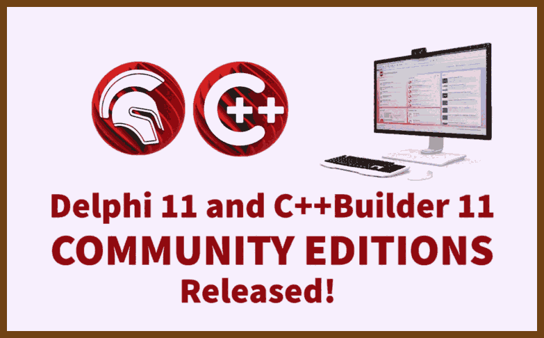
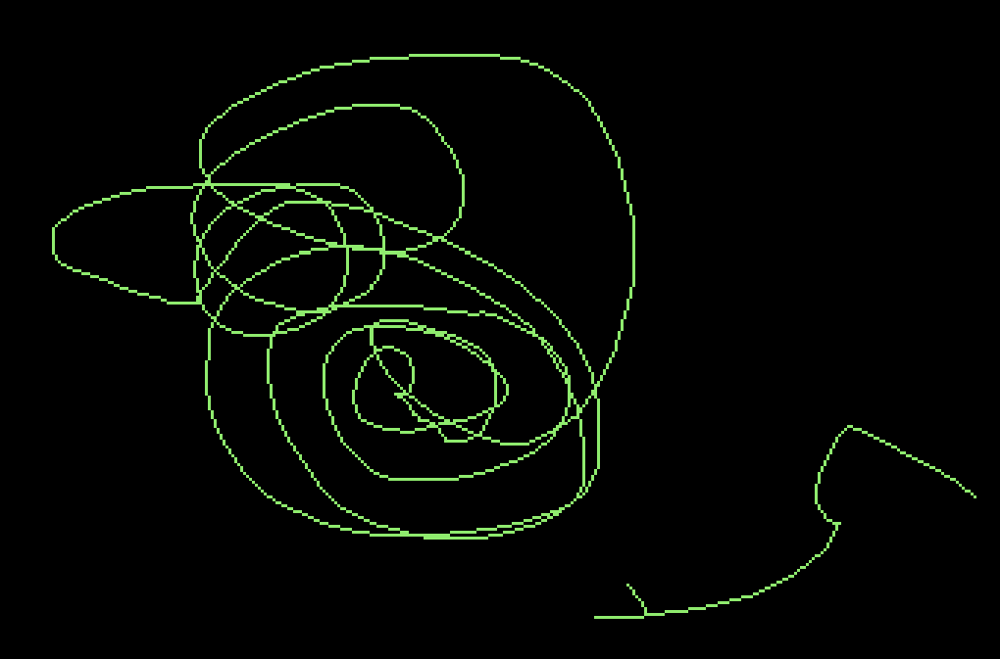
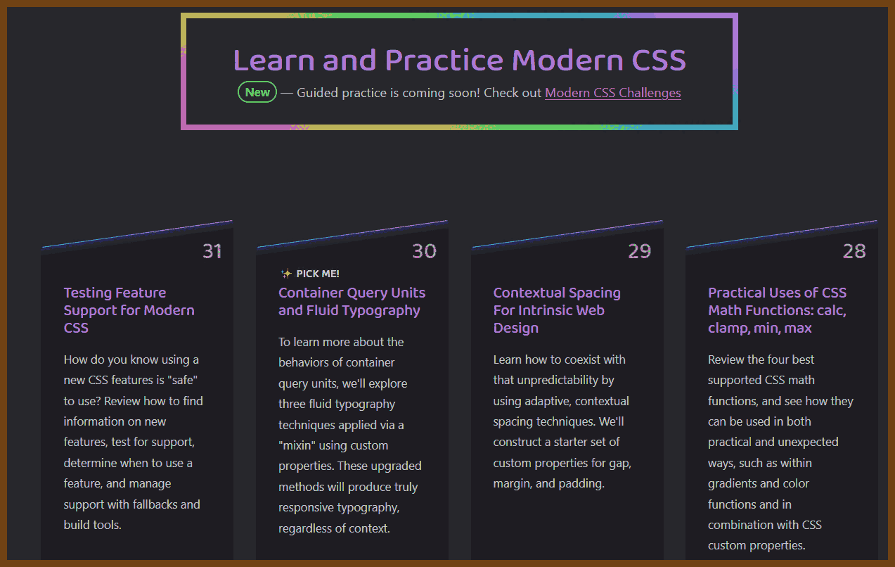
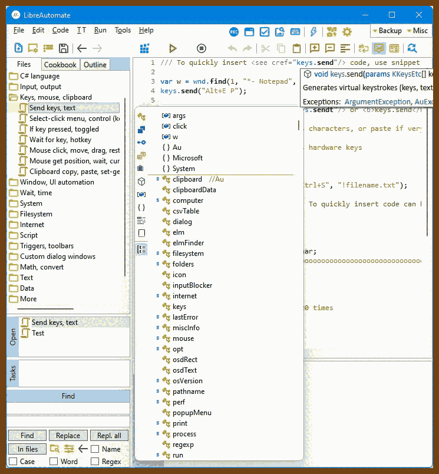

---
layout: post
title:  "Links from my inbox 2023-05-19"
date:   2023-05-19T21:20:00-07:00
categories: links
---


## Good Reads

2023-05-13 [Story: Redis and its creator antirez](https://blog.brachiosoft.com/redis-en/)

> 
>
> n the world of databases, Redis stands out as unique. Instead of the usual tables or documents that are the central focus of most databases, with Redis, you interact directly with low-level data structures such as linked lists and hash tables.
>
> This is all thanks to the innovative design of Redis creator [Salvatore Sanfilippo](http://invece.org/), known online as *antirez*. A master in system programming, antirez prefers to think in terms of data structures like lists, hashes, and sets. The higher-level data representations, such as tables or documents, just didn't suit his taste. When creating Redis, antirez was an amateur in the database field. But perhaps it was this lack of experience that allowed him to bring fresh ideas to the industry.

2023-05-07 [Scaling up the Prime Video audio/video monitoring service and reducing costs by 90% - Prime Video Tech](https://www.primevideotech.com/video-streaming/scaling-up-the-prime-video-audio-video-monitoring-service-and-reducing-costs-by-90)

> Me: Wow, Amazon, thank you for transparency! 
>
> At Prime Video, we offer thousands of live streams to our customers. To ensure that customers seamlessly receive content, Prime Video set up a tool to monitor every stream viewed by customers. This tool allows us to automatically identify perceptual quality issues (for example, block corruption or audio/video sync problems) and trigger a process to fix them.

2023-05-20 [Grokking Simplicity: Taming complex software with functional thinking by Eric Normand - Summary & Notes | Christian B. B. Houmann](https://bagerbach.com/books/grokking-simplicity)
> NOTES ON
> Grokking Simplicity: Taming complex software with functional thinking
> by Eric Normand
>
>  Immutability
>
> Copy-on-write
>
> Implementing copy-on-write operations can help with immutability.
>
> E.g. for adding items to arrays: slice the array (to copy), push the item to the array copy, and return the copied array.
>
> Then you avoid modifying the original.
>
> The basic steps of implementing copy-on-write are:
>
> 1. Make a copy
> 2. Modify copy as you like
> 3. Return copy
>
> Using copy-on-write, you convert write operation into read operations - you never modify the original data.
>
> You can generalize most of these operations, so you don't have to implement copy & return every time you wish to modify something. Take for example this removeItems operation, which is the copy-on-write version of splice:
>
> ```js
> function removeItems(array, idx, count) {
>     const copy = array.slice();
>     copy.splice(idx, count);
>     return copy;
> }
> ```
>
> How do you make something that both reads and writes copy-on-write? Take `Array.shift` for example. You can either split the function into read & write, or you can return two values from the function. The former is preferable. `shift` shifts an array one to the left, i.e. it drops the 0 index element and then returns it. You can imitate the latter part of that operation by simply returning `array[0]`. You can convert the dropping of the 0th element to copy-on-write quite trivially as well: make a copy, use `shift` on the copy, and then return the copy.
>
> And this is what the copy-on-write `shift` operation returning two values would look like:
>
> ```js
> function shift(array) {
>     const array_copy = array.slice();
>     const first = array_copy.shift();
>     return {first, array: array_copy};
> }
> ```

2023-04-24 [Is Critical Thinking the Most Important Skill for Software Engineers? - The Pragmatic Engineer](https://blog.pragmaticengineer.com/critical-thinking/)

> I still remember being in a meeting where a Very Respected Engineer was explaining how they are building a project, and they said something along the lines of "and, of course, idempotency is non-negotiable." I didn't know what idempotency was, and thus I could not tell why it was non-negotiable. I looked around, and everyone was nodding: but I knew I was missing something.

## Retro

2023-05-20 [MyHouse.wad - WAD Releases & Development - Doomworld](https://www.doomworld.com/forum/topic/134292-myhousewad/)

> Video:
>
> 2023-05-20 [MyHouse.WAD - Inside Doom's Most Terrifying Mod - YouTube](https://www.youtube.com/watch?v=5wAo54DHDY0)
>
> 

> Original post:

> Excited to finally release this tribute map. Last August I lost a good childhood friend of mine and took it pretty hard. When I was visiting my hometown for his funeral, I connected with his parents who shared with me some of his old belongings. Among them was a copy of an old map of his backed up on a 3.5” floppy from high school. Thomas and I were into amateur Doom mapping in the early 00s but I had never seen this map of his prior to uncovering it on one of the old floppy discs. As a way of paying tribute to him and all the great memories we had together, I took the plunge and installed Doom Builder in order to polish up his map and add a few modern amenities just for convenience sake.
>
> [Download myhouse.wad](https://drive.google.com/drive/folders/18Nx7kUQwmxUGoXqL6FiUwFY--up64fgo?usp=share_link)

2023-05-20 [Street Fighter II, paper trails](https://fabiensanglard.net/sf2_sheets/index.html)

> 

2023-04-28 [Delphi 11 and C++Builder 11 Community Editions Released!](https://blogs.embarcadero.com/delphi-11-and-cbuilder-11-community-editions-released/)

> Great News!
>
> 


## Projects

2023-05-20 [Map of GitHub](https://anvaka.github.io/map-of-github/)

> Apache Spark in Bigdatia!
>
> 
>
> Thank you, Vu! 

2023-05-20 [pixpaint](https://warms.maxbittker.repl.co/)

> how do I describe this? A very weird paint? 

> 

2023-05-07 🚀 [Modern CSS Solutions](https://moderncss.dev/)

> 

2023-04-30 [Internet in a Box - Mandela's Library of Alexandria](https://internet-in-a-box.org/)

> Internet-in-a-Box “learning hotspots” are used in dozens of countries, to give everyone a chance, e.g. in remote mountain villages in India.
>
> It works without internet — like a community fountain, but for the mind — wirelessly serving anyone nearby with a smartphone, tablet or laptop.
>
> Now you too can put the internet in a box and customize it with the very best free content for your school, clinic or family!
>
> 

## The Era of AI


2023-05-20 [smol-ai/developer: with 100k context windows on the way, it's now feasible for every dev to have their own smol developer](https://github.com/smol-ai/developer)

> ***Human-centric & Coherent Whole Program Synthesis*** aka your own personal junior developer
>
> > [Build the thing that builds the thing!](https://twitter.com/swyx/status/1657578738345979905) a `smol dev` for every dev in every situation
>
> this is a prototype of a "junior developer" agent (aka `smol dev`) that scaffolds an entire codebase out for you once you give it a product spec, but does not end the world or overpromise AGI. instead of making and maintaining specific, rigid, one-shot starters, like `create-react-app`, or `create-nextjs-app`, this is basically [`create-anything-app`](https://news.ycombinator.com/item?id=35942352) where you develop your scaffolding prompt in a tight loop with your smol dev.
>
> AI that is helpful, harmless, and honest is complemented by a codebase that is simple, safe, and smol - <200 lines of Python and Prompts, so this is easy to understand and customize.

2023-05-15 [brexhq/prompt-engineering: Tips and tricks for working with Large Language Models like OpenAI's GPT-4.](https://github.com/brexhq/prompt-engineering#simple-lists)

2023-05-20 [Image Creator from Microsoft Bing](https://www.bing.com/images/create/)

> 

2023-04-26 ➕ [Transformers from Scratch](https://e2eml.school/transformers.html#dot_product)

> 


## CPP 

2023-05-17 [cpp-best-practices/cmake_template](https://github.com/cpp-best-practices/cmake_template)

> "cmake_template" is a C++ Best Practices GitHub template designed for quick C++ project setups. Currently undergoing a major update, it enables Address Sanitizer, Undefined Behavior Sanitizer, treats warnings as errors, and performs static analysis using clang-tidy and cppcheck. It uses CPM for dependencies and provides a basic CLI example, testing examples, and a large Github action testing matrix. It requires cmake and a compiler to use. The project includes a simple usage example of FTXUI, featuring a game.

2023-05-10 [DNedic/lockfree: A collection of lock-free data structures written in standard C++11](https://github.com/DNedic/lockfree)

> What are lock-free data structures?
> Lock-free data structures are data structures that are thread and interrupt safe without having to use mutual exclusion mechanisms. Lock-free data structures are most useful for inter process communication, but due to the efficiency of lockfree, it can safely be used for single threaded uses as well, making it good for general purpose use.

2013-12-25 [How to make smaller C and C++ binaries](http://ptspts.blogspot.com/2013/12/how-to-make-smaller-c-and-c-binaries.html) 

>  This blog post presents several techniques to make the binaries resulting from C or C++ compilation smaller with GCC (or Clang). Please note that almost all techniques are tradeoffs, i.e. a smaller binary can be slower and harder to debug. So don't use the techniques blindly before understanding the tradeoffs.


## C#

2023-05-20 [qgindi/LibreAutomate: C# script editor and automation library for Windows](https://github.com/qgindi/LibreAutomate)

> C# script editor and automation library for Windows.
>
> Some features of the automation library:
>
> - Automate desktop and web UI using keys, mouse and API. Find and click buttons, links, images.
> - Launch programs. Manage files and windows. Transfer and process text and other data.
> - Hotkeys, autotext and other triggers. Auto-replace/expand text when typing. Auto-close windows. Remap keys.
> - Custom toolbars that can be attached to windows or screen edges. And menus.
> - Custom dialog windows of any complexity can be created easily in code.
> - All classes/functions are documented.
> - The library can be used in other programs too. Can be installed from [NuGet](https://www.nuget.org/packages/LibreAutomate).
> - Uses .NET 6.
>   


## Bash

2023-05-01 ⭐ [dylanaraps/pure-sh-bible: 📖 A collection of pure POSIX sh alternatives to external processes.](https://github.com/dylanaraps/pure-sh-bible)

> The goal of this book is to document commonly-known and lesser-known methods of doing various tasks using only built-in POSIX sh features.


## What? O_O

2023-05-20 [j3s.sh](https://j3s.sh/)

> Why jes pets every cat?
>
> 

2023-05-07 [Click 😶](https://clickclickclick.click/) (https://clickclickclick.click/)

> Click.
>
> 

2023-05-03 [Eyecandy - Visual Technique Library](https://eycndy.com/)

> 


## Talks

2023-05-07 [Migrations - The Hardest Actual Problem in Computer Science • Matt Ranney • YOW! 2022 - YouTube](https://www.youtube.com/watch?v=yJOrMDMqeoI)

> Using ***\*randomly generated ids\**** instead of auto-incrementing ones in your database can better protect your data from unauthorized access. Auto-incrementing ids can be easily exposed and guessed, allowing access to your authorization system. This can potentially give competitors insight into your user and order numbers. Implementing a more secure id generation system is a proactive way to maintain confidentiality.

2023-05-06 [3 things I learned from Bill Gates #leadership #leadertok #leadershipd... | TikTok](https://www.tiktok.com/@theclwill/video/7228333233396632874?_r=1&_t=8by0I3Ngtw2&social_sharing=v4)

> 

2023-04-19 [Lightning Talk: How to Win at Coding Interviews - David Stone - CppCon 2022 - YouTube](https://www.youtube.com/watch?v=y872bCqQ_P0)

> Repeat question and clarify the ambiguity
>
> Write an interface
>
> Use a hashmap ;)
