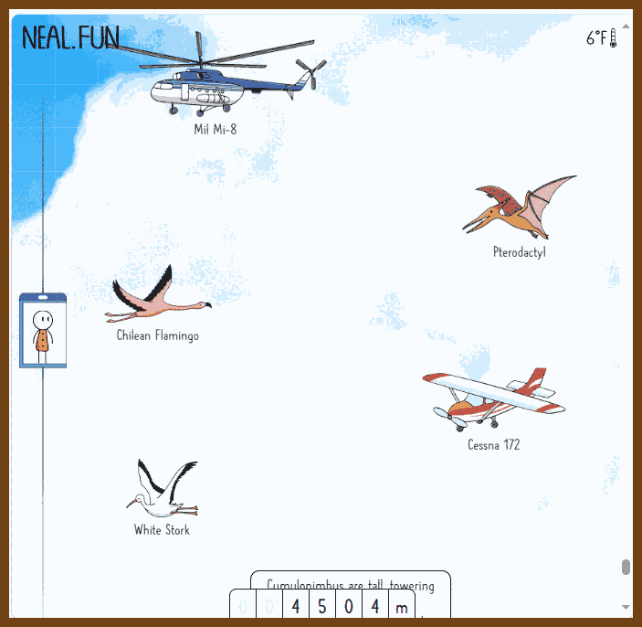
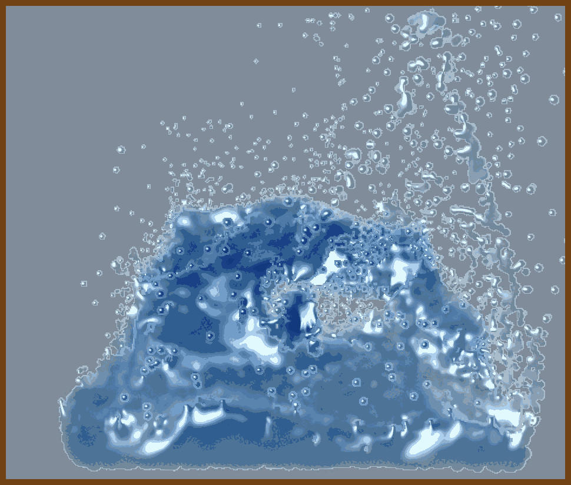

---
layout: post
title:  "Links from my inbox 2023-05-21"
date:   2023-05-21T15:52:00-07:00
categories: links
---


## Good reads

2023-05-21 [Why is OAuth still hard in 2023? | Nango Blog](https://www.nango.dev/blog/why-is-oauth-still-hard)

> Which parameters do they require in the authorize call?
>
> - For Jira, the audience parameter is key (and must be set to a specific fixed value). Google prefers to handle this through different scopes but really cares about the prompt parameter. Meanwhile, somebody at Microsoft discovered the response_mode parameter and demands that you always set it to query.
>
> Problem 1: The OAuth standard is just too big and complex
>
> Problem 2: Everybody’s OAuth is different in subtle ways
>
> Problem 3: Many APIs add nonstandard extensions to OAuth
>
> Problem 4: “invalid_request” — debugging OAuth flows is hard
>
> Problem 5: Cumbersome approvals to build on top of APIs
>
> Problem 6: OAuth security is hard and a moving target
>
> As attacks have been uncovered, and the available web technologies have evolved, the OAuth standard has changed as well. If you’re looking to implement the current security best practices, the OAuth working group has a [rather lengthy guide](https://datatracker.ietf.org/doc/html/draft-ietf-oauth-security-topics) for you. And if you’re working with an API that is still using OAuth 1.0a today, you realize that backwards compatibility is a never-ending struggle.
>
> Luckily, security is getting better with every iteration, but it often comes at the cost of more work for developers. The upcoming OAuth 2.1 standard will make some current best practices mandatory and includes mandatory PKCE (today only a handful of APIs require this) and additional restrictions for refresh tokens.

2023-04-24 🍏  [Some mistakes I made as a new manager](https://www.benkuhn.net/newmgr/)

> I had an unusually hard time becoming a manager: I went back and forth three times before it stuck, mostly because I made lots of mistakes each time. Since then, as I had to grow my team and grow other folks into managing part of it, I’ve seen a lot of other people have varying degrees of a rough time as well—often in similar ways.
>
> Three strategies helped me through it:
>
> - I was open with my manager when I was feeling down—sometimes I’d even explicitly ask him for a pep talk. Because he had a higher-level, longer-term perspective and had been a manager for longer, he was often able to point out ways I was having a big impact without noticing.
> - I asked people for feedback. I found that if I just asked “do you have any feedback for me?” people often wouldn’t, but if I asked more granular questions—“was that meeting useful?”—I would usually learn a lot from it. (See also [§ angsting](https://www.benkuhn.net/newmgr/#angsting-instead-of-asking).)
> - I built up other sources of fun and validation. For a long time, my work was the primary thing that helped me feel good about myself. Diversifying that to include more of friends, relationships, hobbies, Twitter likes, etc. smoothed out the ups and downs.

2023-04-06 [C Strings and my slow descent to madness - by Diego Crespo](https://www.deusinmachina.net/p/c-strings-and-my-slow-descent-to)

> 

2023-05-18 [User Driven UI](https://garden.bradwoods.io/notes/design/user-driven-ui)

> From the author of [Juice](https://garden.bradwoods.io/notes/design/juice)! We use software to solve a problem. When someone chooses a new software product. Instead of solving their problem, we give them another. To learn the UI (User Interface). If the software is at a certain level of complexity, new users will only learn parts of it or not use it at all.
>
> 


## Fun

2023-05-21 [Space Elevator](https://neal.fun/space-elevator/)

> 

2023-04-19 [Water3D](https://oimo.io/works/water3d/)

> - 2023-05-21 [saharan/works: The code of several works on oimo.io/works](https://github.com/saharan/works/)
>
> - [oimo.io/works](https://oimo.io/works)
>
> - https://oimo.io/works/jelly/

> 

2023-04-19 [The Man Who Lives In A Clock - YouTube](https://www.youtube.com/watch?v=gw8jFYTbMDI)

> 

2023-04-16 💗 [Cheat Sheet - Cube Tutorial](https://ryanstutorials.net/rubiks-cube-tutorial/rubiks-cube-cheat-sheet.php)

> This page is a summary of all the steps and algorithms on one page. Only the algorithms are listed here without any explanation. It is intended as a quick reference when you just need a reminder on the algorithms to solve the cube. Visit the previous pages for detailed descriptions.
>
> 


## C++

2023-05-21 [Introduction - Learn WebGPU for C++ documentation](https://eliemichel.github.io/LearnWebGPU/introduction.html)

> 


## C#

2023-04-16 [5 useful extensions for Task T in .NET](https://steven-giesel.com/blogPost/d38e70b4-6f36-41ff-8011-b0b0d1f54f6e/)

>  Fire and forget

```cs
public static void FireAndForget(
  this Task task,
  Action<Exception> errorHandler = null)
{
    task.ContinueWith(t =>
    {
        if (t.IsFaulted && errorHandler != null)
            errorHandler(t.Exception);
    }, TaskContinuationOptions.OnlyOnFaulted);
}
```

> Retry

```cs
var result = await (() => GetResultAsync()).Retry(3, TimeSpan.FromSeconds(1));
```

>  OnFailure

```cs
await GetResultAsync().OnFailure(ex => Console.WriteLine(ex.Message));
```

> 4. Timeout

```cs
await GetResultAsync().WithTimeout(TimeSpan.FromSeconds(1));
```

> 5. Fallback

```cs
var result = await GetResultAsync().Fallback("fallback");
```


## Mental Health 

2023-04-24 [Opening up about my ADHD. Diagnosed at 34, I hope my story can… | by Kyle Gordon | Medium](https://medium.com/@kylegordon/opening-up-about-my-adhd-3dfe6e42bf7c)

> It would be a mistake to write a blog about ADHD without having a summary at the beginning. I know I would need one. So here it is :
>
> I’ve always had focus issues but I misdiagnosed them as problems related to energy. Through school and career I found that the only reliable way for me to motivate myself was to generate stress and consume an unhealthy amount of caffeine. At first doing work just before it’s due, and later in life harnessing it in a more healthy manner by faking early deadlines. Late 2021 I got sick and I couldn’t drink caffeine anymore and stress caused me a good deal of pain. Thought my career was over, so I turned to my doctor and she sent me to be evaluated for ADHD and Bipolar. Turns out I have ADHD and the medication has given me a new lease on life. Please, if you relate to my story at all, pursue help.

2023-04-18 [GitHub - Fillyosopher/Reading-Helper: A dead-simple Bookmarklet and Chrome Extension implementation of something like Bionic Reading](https://github.com/Fillyosopher/Reading-Helper)

> 


## Work

2023-04-25 👷‍♀️ [derwiki/layoff-runbook ](https://github.com/derwiki/layoff-runbook)

> **Layoff Runbook**
>
> Being laid off can be overwhelming and it's easy to miss important tasks. This runbook will help make sure you stay on track.
>
> 

## Other?

2023-04-13 [The Car Mechanics Video Course from How a Car Works](https://www.howacarworks.com/video-course)

> 

## Talks

2023-05-20 [Code Red: The Business Impact of Code Quality • Adam Tornhill • GOTO 2022 - YouTube](https://www.youtube.com/watch?v=aRR0EDazxIk)

> May the code be with you

2023-05-20 [Engineering Documentation • Lorna Jane Mitchell • GOTO 2022 - YouTube](https://www.youtube.com/watch?v=Z5OrR99OpiY)

> 2023-05-20 [Diátaxis](https://diataxis.fr/)

> 2023-05-20 [Vale.sh - A linter for prose](https://vale.sh/)
