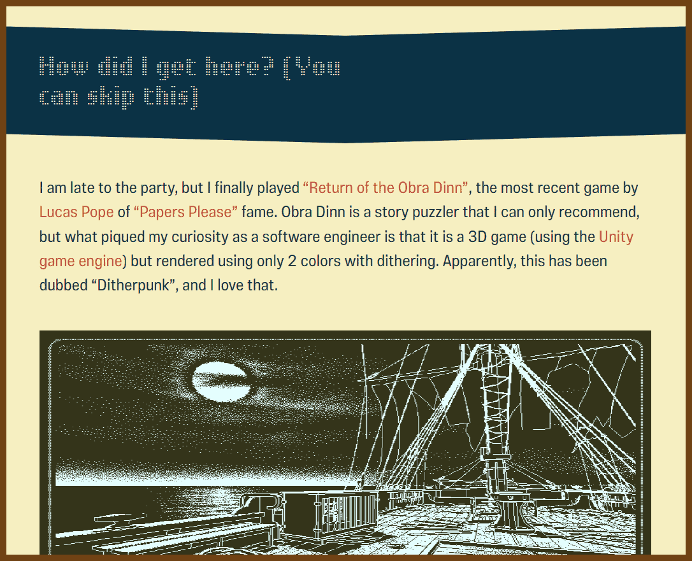
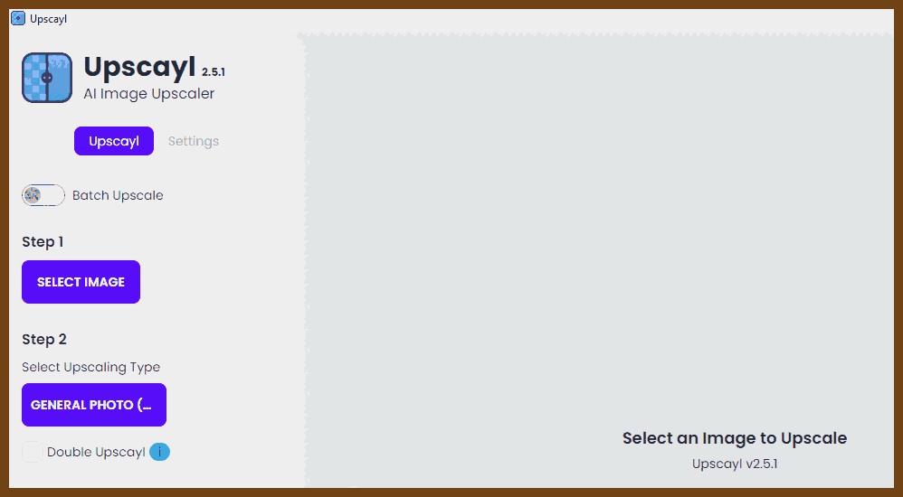
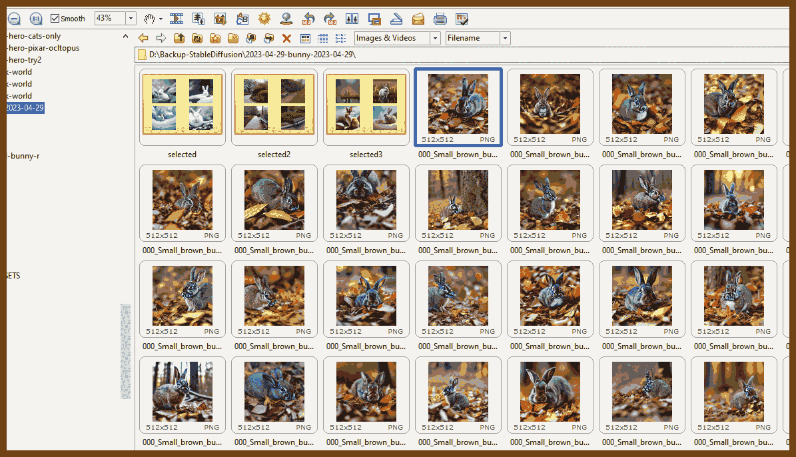
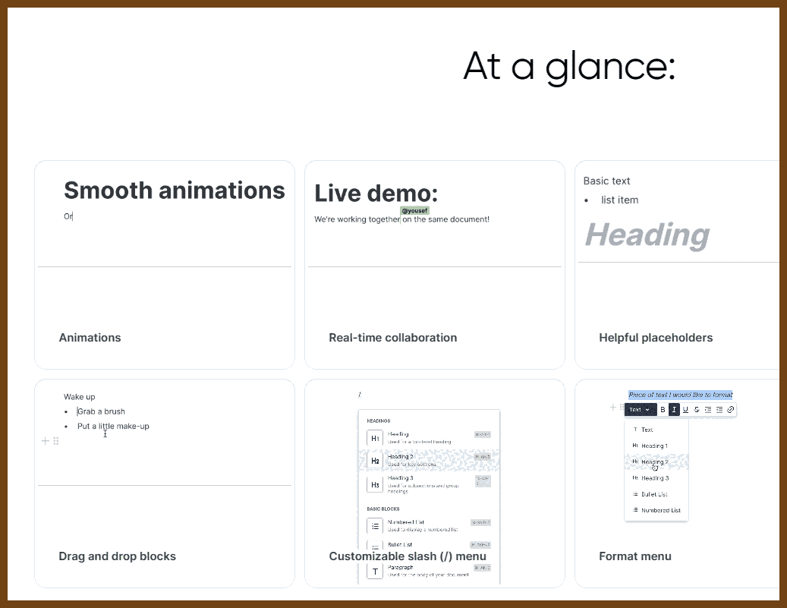
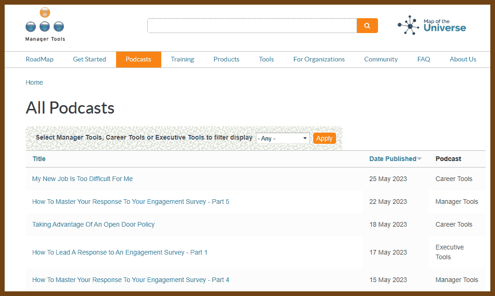

---
layout: post
title:  "Links from my inbox 2023-05-28"
date:   2023-05-28T15:27:00-07:00
categories: links
---


2023-05-28 [Ditherpunk — The article I wish I had about monochrome image dithering — surma.dev](https://surma.dev/things/ditherpunk/)

> 


## Good Reads

2023-05-28 [zakirullin/cognitive-load: 🧠 Cognitive Load Developer's Handbook](https://github.com/zakirullin/cognitive-load/)

> Cognitive load
>
> >  **Cognitive load is how much a developer needs to know in order to complete a task.**
>
> We should strive to reduce the cognitive load in our projects as much as possible.
>
> The average person can hold roughly **four facts** in working memory. Once the cognitive load reaches this threshold, a significant effort is required to understand things.
>
> *Let's say we've been asked to make some fixes to a completely unfamiliar project. We were told that a really smart developer had contributed to it. Lots of cool technologies, fancy libraries and trendy frameworks were used. In other words, **the previous author had a high cognitive load in his head, which we are yet to recreate.***

> 

> Inheritance nightmare
>
> We're tasked to change a few things for our admin users: `🧠`
>
> ```
> AdminController extends UserController extends GuestController extends BaseController
> ```
>
> Ohh, part of the functionality is in `BaseController`, let's have a look: `🧠+`
> Basic role mechanics got introduced in `GuestController`: `🧠++`
> Things got partially altered in `UserController`: `🧠+++`
> Finally we're here, `AdminController`, let's code stuff! `🧠++++`
>
> Oh, wait, there's `SuperuserController` which extends `AdminController`. By modifying `AdminController` we can break things in the inherited class, so let's dive in `SuperuserController` first: `🤯`
>
> Prefer composition over inheritance. We won't go into the details - there are plenty of articles on the subject.

>  Complicated if statements
> 
```go
if val > someConstant // 🧠+
    && (condition2 || condition3) // 🧠+++, prev cond should be true, one of c2 or c3 has be true
    && (condition4 && !condition5) { // 🤯, we're messed up here
    ...
}
```
> 
> Introduce temporary variables with meaningful names:
>
```go
isValid = var > someConstant
isAllowed = condition2 || condition3
isSecure = condition4 && !condition5 
// 🧠, we don't need to remember conditions, there are descriptive variables
if isValid && isAllowed && isSecure {
    ...
}
```
2023-05-28 [Modern work requires attention. Constant alerts steal it - Stack Overflow Blog](https://stackoverflow.blog/2023/05/22/modern-work-requires-attention-constant-alerts-steal-it/)
> We often describe working with focused attention as a flow state. As described in the book Flow: The Psychology of Optimal Experience by Mihaly Csikszentmihalyi, a flow state allows one to become fully engaged and focused on the task at hand. It leads to better results and greater happiness. But it can only happen when you have the attention to focus fully on whatever it is that lies before you.
> Why can’t we focus at work?
> The contemporary workspace, whether in-person or remote, is full of demands on your attention. We have chat programs, email inboxes, and project management apps all throwing notifications our way. In offices, you have other people tapping you on the shoulder and creating general noise (and woe betide those in open offices). Working remotely avoids some of these, but places the entire communication burden on chat and email applications with their little red notifications. These apps promise asynchronous communications, but that doesn’t always happen in practice.

2023-05-24 [How to start a Go project in 2023 | Ben E. C. Boyter](https://boyter.org/posts/how-to-start-go-project-2023/)

> I previously wrote about [starting a Go project in 2018](https://boyter.org/posts/how-to-start-go-project-2018/). A lot has changed since I wrote that and I had been wanting to write an updated version. What follows should be enough for anyone new to Go to get started and ideally start them being productive.
>
> Quick links:
>
> - [Install / Setup](https://boyter.org/posts/how-to-start-go-project-2023/#install--setup)
> - [Starting a Project](https://boyter.org/posts/how-to-start-go-project-2023/#starting-a-project)
> - [Learning Go](https://boyter.org/posts/how-to-start-go-project-2023/#learning-go)
> - [Searching](https://boyter.org/posts/how-to-start-go-project-2023/#searching)
> - [Building / Installing](https://boyter.org/posts/how-to-start-go-project-2023/#building--installing)
> - [Linting / Static Analysis / Security Scanning](https://boyter.org/posts/how-to-start-go-project-2023/#linting--static-analysis--security-scanning)
> - [Profiling](https://boyter.org/posts/how-to-start-go-project-2023/#profiling)
> - [Unit Testing](https://boyter.org/posts/how-to-start-go-project-2023/#unit-testing)
> - [Integration Testing](https://boyter.org/posts/how-to-start-go-project-2023/#integration-testing)
> - [Community](https://boyter.org/posts/how-to-start-go-project-2023/#community)
> - [Multiple Main Entry Points](https://boyter.org/posts/how-to-start-go-project-2023/#multiple-main-entry-points)
> - [OS Specific Code](https://boyter.org/posts/how-to-start-go-project-2023/#os-specific-code)
> - [Docker](https://boyter.org/posts/how-to-start-go-project-2023/#docker)
> - [Useful Tools/Packages](https://boyter.org/posts/how-to-start-go-project-2023/#useful-toolspackages)

2023-05-24 [google/comprehensive-rust: This is the Rust course used by the Android team at Google. It provides you the material to quickly teach Rust to everyone.](https://github.com/google/comprehensive-rust)

> This repository has the source code for Comprehensive Rust 🦀, a multi-day Rust course developed by the Android team. The course covers all aspects of Rust, from basic syntax to generics and error handling. It also includes deep dives on Android, bare-metal, and concurrency.


## Fun 

2023-05-26 [The Fastest Maze-Solving Competition On Earth - YouTube](https://www.youtube.com/watch?v=ZMQbHMgK2rw)

> 

## The Era of AI


2023-05-28 👃 [imartinez/privateGPT: Interact privately with your documents using the power of GPT, 100% privately, no data leaks](https://github.com/imartinez/privateGPT/)
> **Run GPT on your local machine!**
>
> Ask questions to your documents without an internet connection, using the power of LLMs. 100% private, no data leaves your execution environment at any point. You can ingest documents and ask questions without an internet connection!
> The supported extensions are:
>
> - .csv: CSV,
> - .docx: Word Document,
> - .doc: Word Document,
> - .enex: EverNote,
> - .eml: Email,
> - .epub: EPub,
> - .html: HTML File,
> - .md: Markdown,
> - .msg: Outlook Message,
> - .odt: Open Document Text,
> - .pdf: Portable Document Format (PDF),
> - .pptx : PowerPoint Document,
> - .ppt : PowerPoint Document,
> - .txt: Text file (UTF-8),

2023-05-26 [#002 - Donald Trump • The Joe Rogan AI Experience](https://open.spotify.com/episode/2VkvU9SCdH1ryobaNKm4h2)

> > Disclaimer: This video depicts a fictional podcast between Joe Rogan and Donald Trump, with all content generated using AI language models. The ideas and opinions expressed in the podcast are not reflective of the thoughts of Joe Rogan or Donald Trump. The content portrayed in this video is purely for entertainment purposes 
>
> 

2023-05-13 [upscayl/upscayl: 🆙 Upscayl - Free and Open Source AI Image Upscaler for Linux, MacOS and Windows built with Linux-First philosophy.](https://github.com/upscayl/upscayl)

> Upscayl lets you enlarge and enhance low-resolution images using advanced AI algorithms. Enlarge images without losing quality, it's almost like magic!
>
> 

2023-05-06 🎨 [nadermx/backgroundremover: Background Remover lets you Remove Background from images and video using AI with a simple command line interface that is free and open source.](https://github.com/nadermx/backgroundremover)

> BackgroundRemover is a command line tool to remove background from [image](https://github.com/nadermx/backgroundremover#image) and [video](https://github.com/nadermx/backgroundremover#video) using AI, made by [nadermx](https://john.nader.mx/) to power [https://BackgroundRemoverAI.com](https://backgroundremoverai.com/). If you wonder why it was made read this [short blog post](https://johnathannader.com/my-first-open-source-project/).
>
> 

2023-05-29 [FastStone Image Viewer, Screen Capture, Photo Resizer ...](https://www.faststone.org/)

> Not an AI, but helps a lot with managing Stable Diffusion results 

> 


## Projects

2023-05-28 [BlockNote - Javascript Block-Based text editor | BlockNote](https://www.blocknotejs.org/)

> A beautiful text editor that just works. Easily add an editor to your app that users will love. Customize it with your own functionality like custom blocks or AI tooling.
>
> 


## Podcasts

\- 🙊 2023-05-26 [Podcast – You Are Not So Smart](https://youarenotsosmart.com/podcast/)

> 

\- 🙊 2023-05-26 [All Podcasts | Manager Tools](https://www.manager-tools.com/all-podcasts#)

> 

## Work

2023-05-28 [Ask HN: Engineering managers, how do you onboard new hires? | Hacker News](https://news.ycombinator.com/item?id=36029409&)

> [ avinassh](https://news.ycombinator.com/user?id=avinassh)

> 1. A week before their joining, we ship the laptop
> 2. I'd have a calendar ready for them, which gives an overview of what they will be doing for the next three months
> 3. First week goes into setting up the tooling on the machine. Someone from the product team gives an overview and entire product walkthrough. Next, they spend some to play with the product as a user. This week also involves the initial orientation session.
> 4. We use Golang heavily, however, the people joining might not know it. The second week goes into doing the tour of Go.
> 5. Third week they spend on onboarding tutorial that shows how to write a small service, generate APIs, build, and deploy it in our infra.
> 6. Fourth week they will spend shipping a really small feature to the production.
> 7. Since day one, they'd have assigned a buddy who becomes their go-to person. Buddy also explains them about the culture, how things typical done here etc. The buddy also creates a new slack channel just for them, where they can interact.
> 8. They pair with the buddy in the initial weeks, where buddy is the driver.
> 9. First three months, they'd spend working on a feature along with someone which also involves some good amount of pair programming.
>
> [ Tehnix](https://news.ycombinator.com/user?id=Tehnix)

> 
> - Before you start we send an onboarding plan: As detailed as we can for the first 7 days (e.g. onboarding call, intro to this or that, pairing up with another Engineer), and much more high-level of expectations after 30 days and after 3 months
> 
> - Everyone has an "onboarding buddy": This is an Engineer on their team and makes sure the other Engineer feels like it's their responsibility to spend time getting the new Engineer up-to-speed
> 
> - If you're fully remote we try to fly you into our HQ (Copenhagen, Denmark) for the first week. We've had overwhelmingly good feedback on how big of a difference this makes in establishing connections and making people feel a lot more comfortable with the colleagues much earlier on.
> 
> - We focus on giving you a lot of context initially: The organization, the team and their purpose, meeting up with your manager weekly so they can fill in the gaps continuously, intro to the overall tech infrastructure
> 
> - We dive into the specifics via work: Finding smaller projects that are well scoped to get you into the various corners of the teams' domain
> 
> - We knowledge share a lot via PR Reviews: Onboardees always add two people on the PRs to maximize knowledge sharing over speed initially. After a month or two they go down to just the regular 1 person and they themselves also start reviewing code
> 
> - From then on: We freestyle, but have a continuous focus on learning. At this point, people are so unique and varied that we adjust on to their learning style, gaps, etc.
> 
> Everyone in the team is quite communicative. One thing we explicitly focus on is for new people to get comfortable asking in public channels instead of via DMs. This comes naturally to some, but not to others and they need some nudging and you showing off how its safe to do.
> 
> There's many more things we do, but those are some of the important parts of the top of my head :)
> 
> EDIT: Some context around our environment. We have our own CLI tool to quickly setup a dev environment as well as using GitHub Codespaces as a fallback. There's strong coverage of CI for checking everything is good, and things are deployed very often. We try to automate most of our flows, at least as much as we can to keep friction low, but also to minimize "things you need to just know".


## C

2023-05-25 [xorvoid](https://xorvoid.com/sectorc.html)

>  **SectorC: A C Compiler in 512 bytes**
>
> SectorC ([github](https://github.com/xorvoid/sectorc)) is a C compiler written in x86-16 assembly that fits within the 512 byte boot sector of an x86 machine. It supports a subset of C that is large enough to write real and interesting programs. It is quite likely the smallest C compiler ever written.

2023-05-22 [Memory Allocation](https://samwho.dev/memory-allocation/)

> One thing that all programs on your computer have in common is a need for memory. Programs need to be loaded from your hard drive into memory before they can be run. While running, the majority of what programs do is load values from memory, do some computation on them, and then store the result back in memory.
>
> In this post I'm going to introduce you to the basics of memory allocation. Allocators exist because it's not enough to have memory available, you need to use it effectively. We will visually explore how simple allocators work. We'll see some of the problems that they try to solve, and some of the techniques used to solve them. At the end of this post, you should know everything you need to know to write your own allocator.
>
> 

## Research on RSS readers

I haven't found the one that I like yet.

2023-05-26 [Tiny Tiny RSS](https://tt-rss.org/)

2023-05-26 [yang991178/fluent-reader: Modern desktop RSS reader built with Electron, React, and Fluent UI](https://github.com/yang991178/fluent-reader)

2023-05-26 [stringer-rss/stringer: A self-hosted, anti-social RSS reader.](https://github.com/stringer-rss/stringer)

2023-05-26 👃 [Athou/commafeed: Google Reader inspired self-hosted RSS reader.](https://github.com/Athou/commafeed)


## Talks

2023-05-22 [Developer Tools That Shouldn't Be Secrets Christian Heilmann  GOTO 2022 - YouTube](https://www.youtube.com/watch?v=lz-nUdotdx4)

> 
>
> Slides
> 2023-05-22 [More devtools secrets](https://codepo8.github.io/more-developer-tools-tricks/)
> Console.log
> to show variable name in the output, instead of console.log(x), put curly braces
> `console.log({x})`
> so the output will be an object with one property.
>
> 2023-05-22 [Dear Console,… - a collection of code snippets to use in the browser console](https://codepo8.github.io/dearconsole/)
>
> 


See ya!
