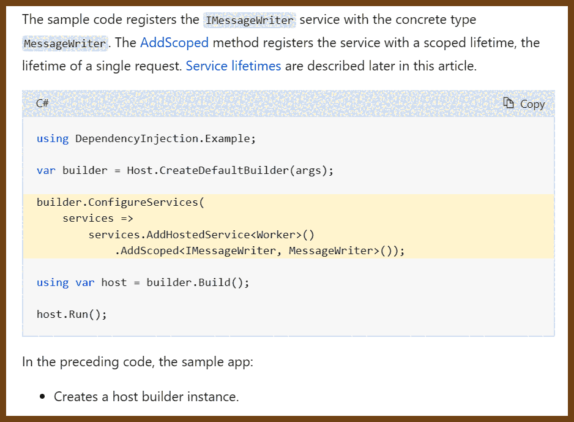
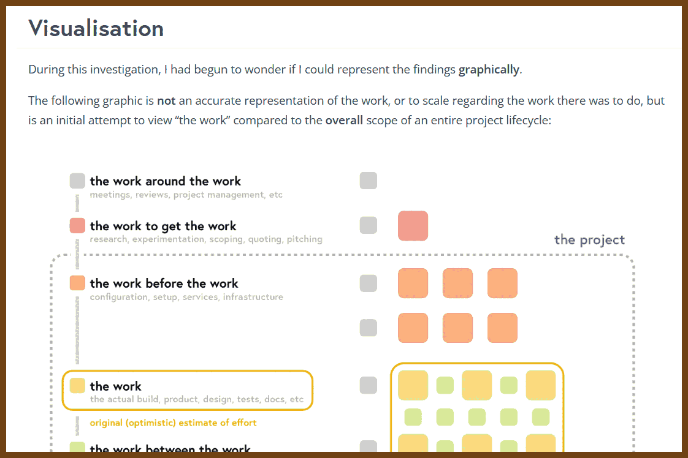
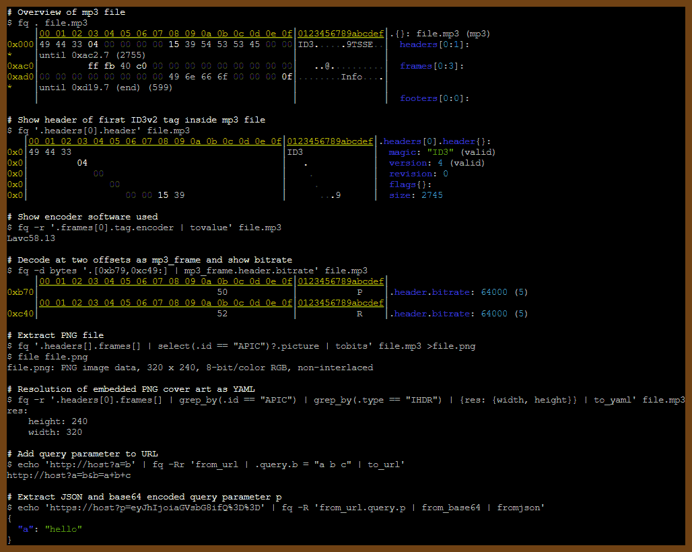
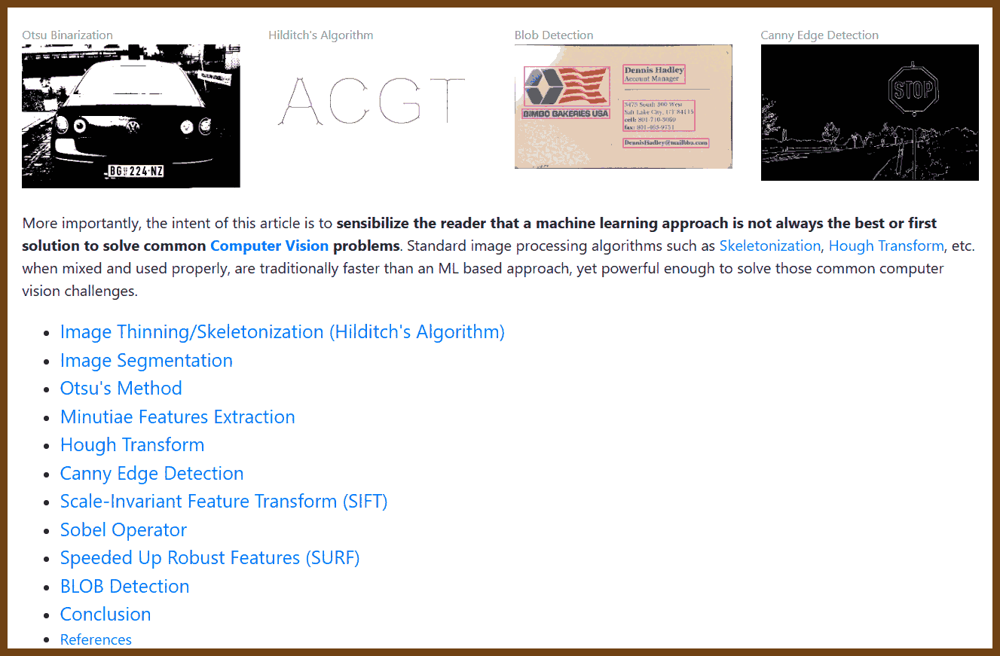
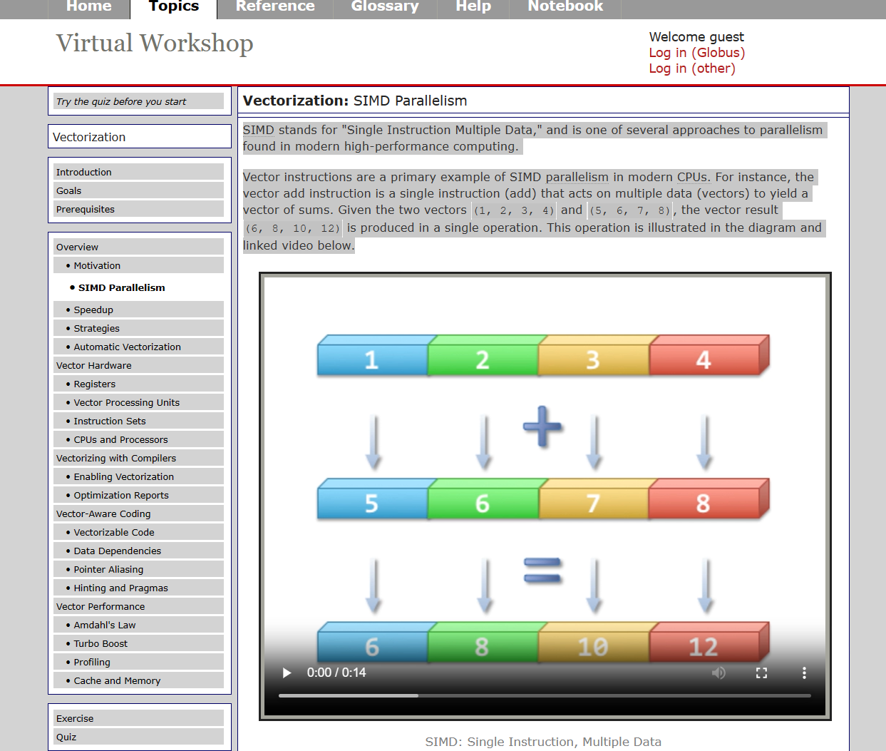
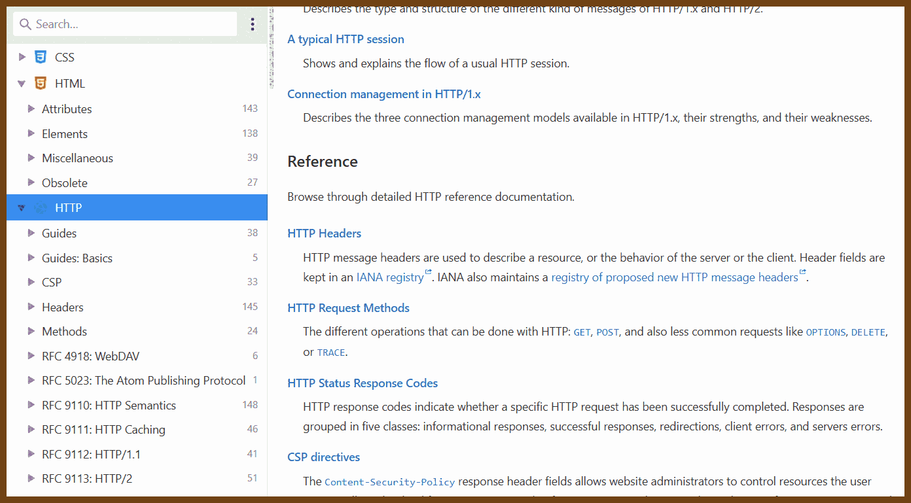

---
layout: post
title:  "Links from my inbox 2023-06-08"
date:   2023-06-08T15:29:00-07:00
categories: links
---

## Good Reads

2023-06-05 [Anything can be a message queue if you use it wrongly enough - Xe Iaso](https://xeiaso.net/blog/anything-message-queue)

> 

## Dependency Injection

2023-06-07 [Dependency Injection](https://www.tutorialsteacher.com/ioc/dependency-injection)

> 

2023-06-07 [Dependency Injection Design Pattern in C# - Dot Net Tutorials](https://dotnettutorials.net/lesson/dependency-injection-design-pattern-csharp/)

> 

2023-06-07 [Dependency injection - .NET | Microsoft Learn](https://learn.microsoft.com/en-us/dotnet/core/extensions/dependency-injection)

> 

2023-06-02 [The work is never just “the work” | Dave Stewart](https://davestewart.co.uk/blog/the-work-is-never-just-the-work/)

> Last year I took on what seemed like a short, easy-to-deliver project, which over the course of a year turned into the kind of “night of the living dead” slog and because of a variety of factors has *never* been easy to estimate.
>
> With the latest phase finally delivered, I wanted to conduct a detailed postmortem to understand why my perception of the *actual* work was so off, and in the process reevaluate everything I know about assumptions and estimation.
>
> In the rest of the article I’ll deep dive my own shortcomings around estimation, as well as present a framework to plan and visualise estimates, hopefully helping both of us clear those lurking feelings of confusion and guilt.
>
> Table of contents:
>
> - [Why is estimating hard](https://davestewart.co.uk/blog/the-work-is-never-just-the-work/#why-is-estimating-hard)
> - [Breaking it down](https://davestewart.co.uk/blog/the-work-is-never-just-the-work/#breaking-it-down)
> - [Reviewing the findings](https://davestewart.co.uk/blog/the-work-is-never-just-the-work/#reviewing-the-findings)
> - [Building it back up](https://davestewart.co.uk/blog/the-work-is-never-just-the-work/#building-it-back-up)
> - [Visualisation](https://davestewart.co.uk/blog/the-work-is-never-just-the-work/#visualisation)
> - [Analysis](https://davestewart.co.uk/blog/the-work-is-never-just-the-work/#analysis)
> - [Modelling](https://davestewart.co.uk/blog/the-work-is-never-just-the-work/#modelling)
> - [Reflection](https://davestewart.co.uk/blog/the-work-is-never-just-the-work/#reflection)
> - [Takeaway](https://davestewart.co.uk/blog/the-work-is-never-just-the-work/#takeaway)
>
> 

2023-05-30 [Factories in Space - Making products for Earth and space](https://www.factoriesinspace.com/)

> Introduction to in-space manufacturing, in-space economy and alternatively new space economy. Related fields include microgravity services, space resources, in-space transport services, orbital economy, cislunar economy, Moon & Mars economies and dozens more.
>
> Overview of commercial microgravity applications. Both for terrestrial use and in-space use. Listing and analysing potential business opportunities to make unique profitable materials and products in microgravity.
>
> Factories in Space is the largest public database of companies active in the emerging in-space economy and in-space manufacturing fields.
>
> 

## How the things work

2023-06-04 🔨 [GPS – Bartosz Ciechanowski](https://ciechanow.ski/gps/)

> Global Positioning System is, without a doubt, one of the most useful inventions of the late 20th century. It made it significantly easier for ships, airplanes, cars, and hikers to figure out where they are with high degree of accuracy.

> One of the most exciting aspects of this system are the satellites surrounding Earth. Here’s a current constellation of active satellites, you can drag the view around to see it from different angles:
>
> 

2023-06-03 [The Pluto Scarab — Hash Functions](https://papa.bretmulvey.com/post/124027987928/hash-functions)

> Hash Functions
>
> Hash functions are functions that map a bit vector to another bit vector, usually shorter than the original vector and usually of fixed length for a particular function.
>
> There are three primary uses for hash functions:
>
> 1. Fast table lookup
> 2. Message digests
> 3. Encryption
>
> **Fast Table Lookup**
>
> Fast table lookup can be implemented using a hash function and a hash table. Elements are found in the hash table by calculating the hash of the element’s key and using the hash value as the index into the table. This is clearly faster than other methods, such as examining each element of the table sequentially to find a match.
>
> **Message Digests**
>
> Message digests allow you to compare two large bit vectors and quickly determine if they are equal. Instead of comparing the vectors bit-by-bit, if the hash values of each bit vector are available you can compare the hash values. If the hash values are different, the original vectors must be different. If the hash values are the same then the original vectors are very likely to be the same if the hash function is good.
>
> Message digests can use either cryptographic or non-cryptographic hash functions. If the purpose of the message digest is to determine if the original message has been tampered with, you would need to use a cryptographic hash function. If you just want to quickly tell if it’s the same as another file with a different name (assuming the hash values have already been computed), you can use a non-cryptographic hash function.
>
> **Encryption**
>
> Encryption is the transformation of data into a form unreadable by anyone without a secret decryption key. Hash functions play an important role in encryption because it is their properties that cause the encrypted data to be unreadable and the original data to be unrecoverable from the encrypted data without the decryption key.
>
> 

## Fun

2023-06-02 [Fold 'N Fly » Paper Airplane Folding Instructions](https://www.foldnfly.com/#/1-1-1-1-1-1-1-1-2)

> 

## Mental Health

2023-05-15 [Taxonomy of procrastination](https://dynomight.net/procrastination/)

> ADHD and procrastination
>
> What I’d like to understand is: Is there a failure mode from having too much willpower?
>
> There’s an angle on this that seems promising at first. People who have ADHD have “low willpower”. This is claimed to be a result of some kind of dopamine (or norepinephrine) dysfunction—either producing too little, or having low-sensitivity receptors. So is there a problem associated with having “too much” dopamine? Perhaps yes—the [dopamine hypothesis](https://en.wikipedia.org/wiki/Dopamine_hypothesis_of_schizophrenia) is that an overly sensitive dopamine system (or [taking lots of meth](https://dynomight.net/p2p-meth/)) causes schizophrenia.
>
> As a cartoon, we might think that:
>
> LOW DOPAMINE
> ↓
> LOW CONFIDENCE IN PREDICTIONS
> ↓
> FORGET HOMEWORK PLAY VIDEO GAMES
>
> And:
>
> HIGH DOPAMINE
> ↓
> EXTREME CONFIDENCE IN PREDICTIONS
> ↓
> HALLUCINATIONS
>
> Nice theory, right? Trouble is, people with ADHD are also [much more likely to develop schizophrenia](https://doi.org/10.1016/j.eurpsy.2013.06.004). So this doesn’t make sense, nothing makes sense.

## The Era of AI

2023-06-07 [Why AI Will Save The World - Marc Andreessen Substack](https://pmarca.substack.com/p/why-ai-will-save-the-world)

> In our new era of AI:
>
> - Every child will have an AI tutor that is infinitely patient, infinitely compassionate, infinitely knowledgeable, infinitely helpful. The AI tutor will be by each child’s side every step of their development, helping them maximize their potential with the machine version of infinite love.
>
> - Every person will have an AI assistant/coach/mentor/trainer/advisor/therapist that is infinitely patient, infinitely compassionate, infinitely knowledgeable, and infinitely helpful. The AI assistant will be present through all of life’s opportunities and challenges, maximizing every person’s outcomes.
>
> ...

2023-06-05 [GPT best practices - OpenAI API](https://platform.openai.com/docs/guides/gpt-best-practices/strategy-write-clear-instructions)

> [Strategy: Write clear instructions](https://platform.openai.com/docs/guides/gpt-best-practices/strategy-write-clear-instructions)
>
> [Tactic: Include details in your query to get more relevant answers](https://platform.openai.com/docs/guides/gpt-best-practices/tactic-include-details-in-your-query-to-get-more-relevant-answers)
>
> In order to get a highly relevant response, make sure that requests provide any important details or context. Otherwise you are leaving it up to the model to guess what you mean.
>
> |                                                 |                                                              |
> | :---------------------------------------------- | :----------------------------------------------------------- |
> | **Worse**                                       | **Better**                                                   |
> | How do I add numbers in Excel?                  | How do I add up a row of dollar amounts in Excel? I want to do this automatically for a whole sheet of rows with all the totals ending up on the right in a column called "Total". |
> | Who’s president?                                | Who was the president of Mexico in 2021, and how frequently are elections held? |
> | Write code to calculate the Fibonacci sequence. | Write a TypeScript function to efficiently calculate the Fibonacci sequence. Comment the code liberally to explain what each piece does and why it's written that way. |
> | Summarize the meeting notes.                    | Summarize the meeting notes in a single paragraph. Then write a markdown list of the speakers and each of their key points. Finally, list the next steps or action items suggested by the speakers, if any. |

2023-04-17 [Understanding Large Language Models - by Sebastian Raschka](https://magazine.sebastianraschka.com/p/understanding-large-language-models)

> 

## Projects

2023-06-08 [axodox/axodox-machinelearning: This repository contains a C++ ONNX implementation of StableDiffusion.](https://github.com/axodox/axodox-machinelearning)

> (Windows Only)
>
> This repository contains a fully C++ implementation of Stable Diffusion-based image synthesis, including the original txt2img, img2img and inpainting capabilities and the safety checker. This solution does not depend on Python and runs the entire image generation process in a single process with competitive performance, making deployments significantly simpler and smaller, essentially consisting a few executable and library files, and the model weights. Using the library it is possible to integrate Stable Diffusion into almost any application - as long as it can import C++ or C functions, but it is most useful for the developers of realtime graphics applications and games, which are often realized with C++.
>
> 2023-06-08 [axodox/unpaint: A simple Windows App for generating AI images with stable diffusion.](https://github.com/axodox/unpaint)

2023-06-04 [This Site is no longer Solar Powered... For Now | Andrew JV Powell](https://www.andrewjvpowell.com/articles/this-site-is-no-longer-solar-powered-for-now/)

> 2023-06-04 [We are now Solar Powered | Andrew JV Powell](https://www.andrewjvpowell.com/articles/we-are-solar-powered/)

> Oh no!
>
> 

2023-06-03 [wader/fq: jq for binary formats - tool, language and decoders for working with binary and text formats](https://github.com/wader/fq)

> 

2023-06-02 [adamritter/fastgron: High-performance JSON to GRON (greppable, flattened JSON) converter](https://github.com/adamritter/fastgron)

2023-06-02 [Sharing WebSocket Connections between Browser Tabs and Windows | Bright Inventions](https://brightinventions.pl/blog/sharing-websocket-connections-between-browser-tabs-and-windows/)

2023-06-02 [How to draw any regular shape with just one JavaScript function | MDN Blog](https://developer.mozilla.org/en-US/blog/javascript-shape-drawing-function/)

2023-05-04 [GitHub - taviso/123elf: A native port of Lotus 1-2-3 to Linux.](https://github.com/taviso/123elf)

2023-04-18 [JSLinux](https://bellard.org/jslinux/vm.html?url=win2k.cfg&mem=192&graphic=1&w=1024&h=768)

> Windows 2000

2023-04-18 [atrosinenko/qemujs: Qemu.js source code with proof-of-concept machine-code-to-WASM JIT.](https://github.com/atrosinenko/qemujs)

2023-05-16 [robdelacruz/lkwebserver: Little Kitten Webserver](https://github.com/robdelacruz/lkwebserver)

> Little Kitten Web Server
>
> A little web server written in C for Linux.
>
> - No external library dependencies
> - Single threaded using I/O multiplexing (select)
> - Supports CGI interface
> - Supports reverse proxy
> - lklib and lknet code available to create your own http server or client
> - Free to use and modify (MIT License)

## C++

2023-06-07 [Modern Image Processing Algorithms Overview & Implementation in C/C++](https://sod.pixlab.io/articles/modern-image-processing-algorithms-implementation.html)

> [Implementing](https://sod.pixlab.io/c_api) modern image processing algorithms in C requires a solid understanding of image representation, data structures, and algorithmic concepts. Uncompressed image data are typically stored as [matrices](https://sod.pixlab.io/api.html#sod_img) or multidimensional arrays, with each element representing a pixel's intensity or color value. **C provides the necessary tools to access and manipulate individual pixels efficiently, making it ideal for algorithm implementation**. Most of the algorithms featured here except the patented [SIFT](https://sod.pixlab.io/articles/modern-image-processing-algorithms-implementation.html#sift) & [SURF](https://sod.pixlab.io/articles/modern-image-processing-algorithms-implementation.html#surf) are already implemented in the open source, embedded, computer vision library [SOD](https://sod.pixlab.io/), and already in production use here at [PixLab](https://pixlab.io/) or [FACEIO](https://faceio.net/).
>
> 

2023-04-18 [Geometry Central](https://geometry-central.net/)

> Geometry-central is a modern C++ library of data structures and algorithms for geometry processing, with a particular focus on surface meshes.
>
> Features include:
>
> - A polished **surface mesh** class, with efficient support for mesh modification, and a system of containers for associating data with mesh elements.
> - Implementations of canonical **geometric quantities** on surfaces, ranging from normals and curvatures to tangent vector bases to operators from discrete differential geometry.
> - A suite of **powerful algorithms**, including computing distances on surface, generating direction fields, and manipulating intrinsic Delaunay triangulations.
> - A coherent set of sparse **linear algebra tools**, based on Eigen and augmented to automatically utilize better solvers if available on your system.

## SIMD

2023-06-02 [Cornell Virtual Workshop: SIMD Parallelism](https://cvw.cac.cornell.edu/vector/overview_simd)

> SIMD stands for "Single Instruction Multiple Data," and is one of [several approaches to parallelism](https://cvw.cac.cornell.edu/parallel/tax.aspx) found in modern high-performance computing.
>
> Vector instructions are a primary example of SIMD parallelism in modern CPUs. For instance, the vector add instruction is a single instruction (add) that acts on multiple data (vectors) to yield a vector of sums. Given the two vectors `(1, 2, 3, 4)` and `(5, 6, 7, 8)`, the vector result `(6, 8, 10, 12)` is produced in a single operation. This operation is illustrated in the diagram and linked video below.

> 

## WebGPU

2023-05-04 [cohost! - "I want to talk about WebGPU"](https://cohost.org/mcc/post/1406157-i-want-to-talk-about-webgpu)

> 
>
> WebGPU is the new WebGL. That means it is the new way to draw 3D in web browsers. It is, in my opinion, very good actually. It is so good I think it will also replace Canvas and become the new way to draw 2D in web browsers. In fact it is *so* good I think it will replace *Vulkan* as well as normal OpenGL, and become just the standard way to draw, in any kind of software, from any programming language. This is pretty exciting to me. WebGPU is a little bit irritating— but only a *little* bit, and it is massively less irritating than any of the things it replaces.

> 

## Seattle

2023-06-07 [Free apps and online maps for walking tours of Seattle - Greater Seattle on the Cheap](https://www.greaterseattleonthecheap.com/free-walking-tours-seattle/)

> 

## Offline docs

2023-06-01 [freeCodeCamp/devdocs: API Documentation Browser](https://github.com/freeCodeCamp/devdocs)

> 2023-06-08 [DevDocs API Documentation](https://devdocs.io/)
>
> 
