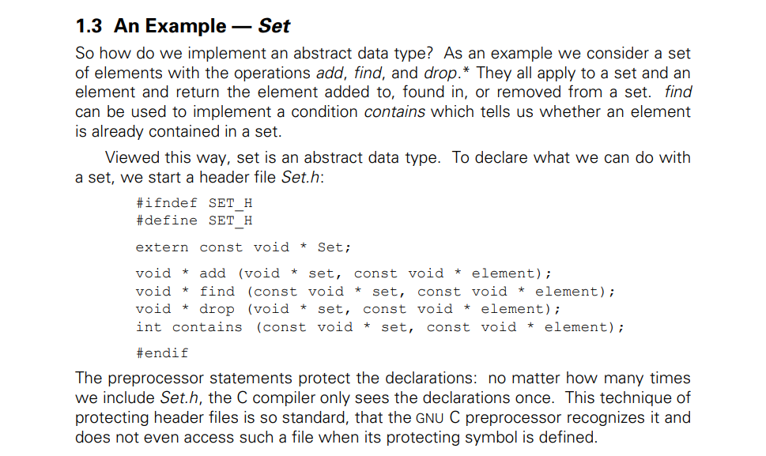

---
layout: post
title:  "Links from my inbox 2023-06-28"
date:   2023-06-28T18:13:00-07:00
categories: links
---

## Good Reads

2023-06-23 [How my online gaming addiction saved my Ph.D. – Advait Sarkar](https://advaitsarkar.wordpress.com/2021/12/17/how-my-online-gaming-addiction-saved-my-phd/)

> Previously, this might have taken me weeks. With JavaScript, I built the prototype in hours. Using web technology had another advantage: it was easy to deploy the study as a website and therefore get many more participants than I would have normally gotten in a lab-based experiment. The study was completed within a month and was published at a good conference.

2023-06-19 [Imaginary Problems Are the Root of Bad Software](https://cerebralab.com/Imaginary_Problems_Are_the_Root_of_Bad_Software)

> In this blog post, the author discusses ***imaginary problems\*** as the root of bad software and how they affect developers, managers, and clients. He:
>
> - Defines *imaginary problems* as problems that are designed to do something other than their intended purpose, and contrast them with *real problems* that have to be solved.
> - Shows how *long chains of communication* and *boredom* can create imaginary problems by changing, misunderstanding, or misrepresenting requirements and specifications.
> - Examines how *corruption, inertia, and fear* can keep imaginary problems alive by preventing or discouraging fixing real problems that threaten the status quo or the livelihoods of others.
> - Provides examples and data from various domains and projects to illustrate the prevalence and impact of imaginary problems, such as online banking, blockchain, and software development.
> - Concludes that imaginary problems are a vicious cycle that prevents software from being reliable, efficient, or user-friendly, and that everyone needs to stop creating and solving them, and start focusing on the real problems.

2023-06-17 [Generating income from open source](https://vadimdemedes.com/posts/generating-income-from-open-source)

> **Open source projects need to charge money for their work.** The author argues that donations are not enough to sustain open source projects and maintainers should adopt different business models to generate revenue. The author suggests several ways to charge money for open source work, such as different licenses, pro features, hosted solutions, or paid support.
>
> **Examples of successful open source businesses.** The author provides several examples of open source projects that have built profitable businesses around their work, such as Metafizzy, Sidekiq, Plausible Analytics, PostHog, Metabase, React Flow, Babel, curl and Filippo Valsorda. The author explains how each project offers value to its customers and what kind of pricing or support they have.
>
> **Advice for open source maintainers.** The author gives some advice for open source maintainers who want to start charging money for their work, such as understanding the value they provide, packaging their product well, letting people discover their paid plans, giving something of value immediately after purchase and offering insurance that their project will be maintained. The author encourages maintainers to try different options and not be ashamed of asking for money.

2023-06-14 [Finish your projects](https://github.com/readme/guides/finish-your-projects)

> This article is about the importance and challenges of finishing a project, especially in the open source community. The author shares his personal experience and insights on how to overcome the obstacles of work and fear that often prevent people from releasing their projects. He also encourages readers to take pride in their finished work and to honor their past and future selves by publishing their projects. He concludes by introducing himself and The ReadME Project, which aims to amplify the voices of open source developers.

2023-06-12 [The Surprising Power of Documentation](https://vadimkravcenko.com/shorts/proper-documentation/)

> 1. Documentation saves time and improves productivity across the company.
> 2. Documentation eradicates guesswork and reinvention of the wheel.
> 3. Documentation enables fast onboarding and helps newcomers navigate startup processes.
> 4. Documentation reduces the reliance on meetings and promotes asynchronous communication.
> 5. Documentation serves as a knowledge repository and facilitates learning from past decisions.
> 6. A documentation-first culture breaks down hierarchical barriers and promotes knowledge sharing.
> 7. Templates, guidelines, and user-friendly tools should be provided to facilitate documentation.
> 8. Resistance to documentation should be addressed through engagement and modeling behavior.
> 9. Documentation should be clear, concise, well-structured, and easily accessible.
> 10. Startups should cultivate a love for documentation and make it a daily practice

## Azure Active Directory

2023-06-29 [Demystifying OAuth, JWTs and Azure AD - Graeme Foster - NDC Oslo 2023 - YouTube](https://www.youtube.com/watch?v=HmvXoW0r83I)

> Good video by Graeme Foster about how AAD OAuth works with demos. Video starts from 16:50

## C++

2023-06-24 👃 [60 terrible tips for a C++ developer](https://pvs-studio.com/en/blog/posts/cpp/1053/)

> 60 Dirty tips for dirty developers ;)
>
> - [Terrible tip N3. Nested macros](https://pvs-studio.com/en/blog/posts/cpp/1053/#IDB41BD4E93A)
> - [Terrible tip N4. Disable warnings](https://pvs-studio.com/en/blog/posts/cpp/1053/#IDC924C5C2DE)
> - [Terrible tip N5. The shorter the variable name is, the better](https://pvs-studio.com/en/blog/posts/cpp/1053/#ID435EA082EE)
> - [Terrible tip N6. Invisible characters](https://pvs-studio.com/en/blog/posts/cpp/1053/#ID94606C1576)
> - [Terrible tip N7. Magic numbers](https://pvs-studio.com/en/blog/posts/cpp/1053/#ID90FBE85088)
> - [Terrible tip N8. int, int everywhere](https://pvs-studio.com/en/blog/posts/cpp/1053/#ID2FB1279C3F)
> - [Terrible tip N9. Global variables](https://pvs-studio.com/en/blog/posts/cpp/1053/#IDA9A515DF38)
> - [Terrible tip N10. The abort function in libraries](https://pvs-studio.com/en/blog/posts/cpp/1053/#ID65E575FE16)
> - [Terrible tip N11. The compiler is to blame for everything](https://pvs-studio.com/en/blog/posts/cpp/1053/#ID65184F1F33)
> - [Terrible tip N12. Feel free to use argv](https://pvs-studio.com/en/blog/posts/cpp/1053/#ID1AB91381F6)
>
> ... and the list goes on and on

2023-06-24 [Make your programs run faster by better using the data cache - Johnny's Software Lab](https://johnnysswlab.com/make-your-programs-run-faster-by-better-using-the-data-cache/)

>  It covers the following topics and tips:
>
> - The concept and importance of **cache memory** and how it compensates for the difference in speed between processor and main memory.
> - The principles of **temporal and spatial locality**, which govern the behavior of real-world programs and affect the cache performance.
> - The tips and rules for **better exploiting the data cache** in different scenarios, such as:
>   - Using **arrays** of classes or structs instead of values, to increase the cache utilization and reduce the cache misses.
>   - Aligning the **starting address of the array** and the **class data** to the cache line size, to avoid splitting the data across multiple cache lines and to optimize the cache access.
>   - Performing **loop interchange** on **matrices**, to move the loop over the innermost position and to eliminate column-wise accesses, which are costly for the cache.
>   - Avoiding **padding** in **classes and structs**, to make sure they are correctly aligned and to reduce the cache overhead.
>   - Sorting the **variables in the declaration** of the classes by size from largest to smallest, to guarantee that the compiler will not insert any padding and to optimize the cache access.
> - The tools and references available to help with the data cache optimization, such as **pahole** and **StuctLayout**, which can help with exploring and visualizing the paddings in the classes.

2023-06-15 [ReactiveX/RxCpp: Reactive Extensions for C++](https://github.com/ReactiveX/RxCpp)

# C

1993 ⭐ [Object-oriented Programming with ANSI-C (1993) [pdf]](https://www.mclibre.org/descargar/docs/libros/ooc-ats.pdf)

> Retro document! but very well written
>
> 

2023-06-14 [Leo Robinovitch @ The Leo Zone](https://theleo.zone/posts/hashmap-in-c/)

> 

## Rust

2023-06-16 [Effective Rust](https://www.lurklurk.org/effective-rust/)

> Effective Rust

> 35 Specific Ways to Improve Your Rust Code

> David Drysdale
>
> 

## RSS

2023-06-23 [Style your RSS feed](https://darekkay.com/blog/rss-styling/)

> RSS is not dead. It is not mainstream, but it's still a thriving protocol, especially among tech users. However, many people do not know what RSS feeds are or how to use them. Most browsers render RSS as raw XML files, which doesn't help users understand what it's all about...

## Projects

2023-06-15 [TypeCell Notebooks](https://www.typecell.org/)

> TypeCell is an open source Typescript live programming environment.
>
> Running code has never been easier :)
>
>  this is what I was looking for
>
> 2023-06-15 [TypeCellOS/TypeCell](https://github.com/TypeCellOS/TypeCell)

## Videos

2023-06-26 [Email vs Capitalism, or, Why We Can't Have Nice Things - Dylan Beattie - NDC Oslo 2023 - YouTube](https://www.youtube.com/watch?v=mrGfahzt-4Q)

> Dylan is amazing speaker ;) fun conversation about the history of email, current limitations and how it works. 

2023-06-17 [Don't Talk to the Police - YouTube](https://www.youtube.com/watch?v=d-7o9xYp7eE)

> I saw it years ago! I remember this video. 
>
> 

