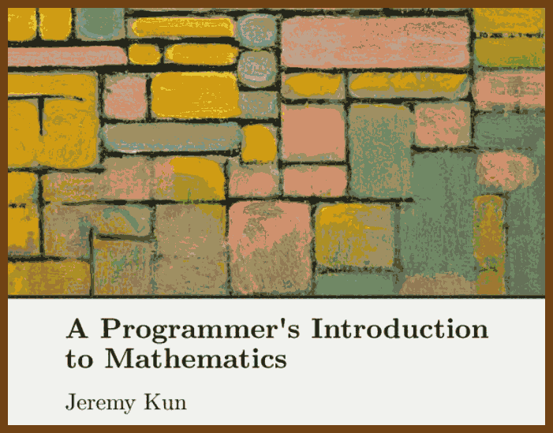
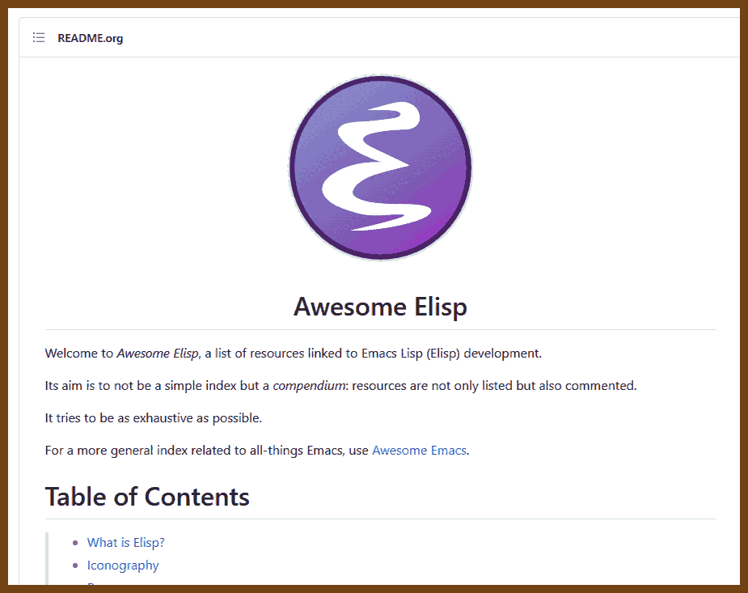
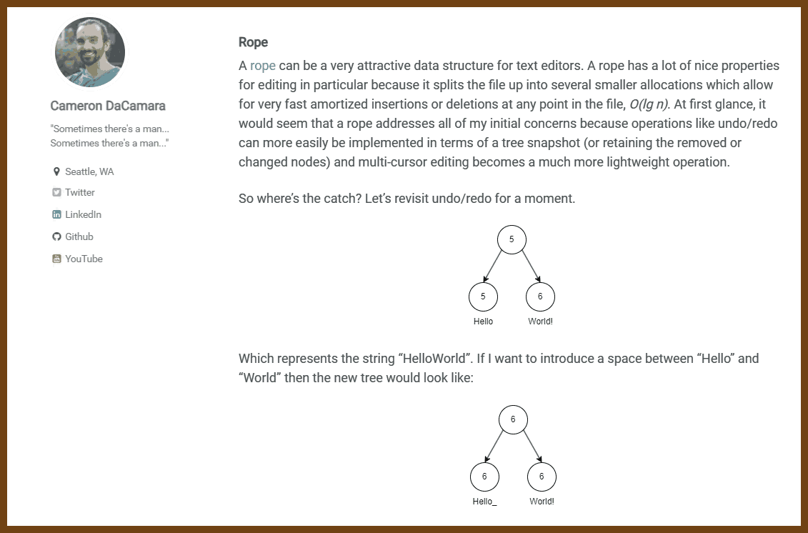

---
layout: post
title:  "Links from my inbox 2023-06-28"
date:   2023-06-28T18:13:00-07:00
categories: links
---


## Good Reads

2023-06-23 [How my online gaming addiction saved my Ph.D. – Advait Sarkar](https://advaitsarkar.wordpress.com/2021/12/17/how-my-online-gaming-addiction-saved-my-phd/)

> Previously, this might have taken me weeks. With JavaScript, I built the prototype in hours. Using web technology had another advantage: it was easy to deploy the study as a website and therefore get many more participants than I would have normally gotten in a lab-based experiment. The study was completed within a month and was published at a good conference.

2023-06-19 [Imaginary Problems Are the Root of Bad Software](https://cerebralab.com/Imaginary_Problems_Are_the_Root_of_Bad_Software)

> In this blog post, the author discusses ***imaginary problems\*** as the root of bad software and how they affect developers, managers, and clients. He:
>
> - Defines *imaginary problems* as problems that are designed to do something other than their intended purpose, and contrast them with *real problems* that have to be solved.
> - Shows how *long chains of communication* and *boredom* can create imaginary problems by changing, misunderstanding, or misrepresenting requirements and specifications.
> - Examines how *corruption, inertia, and fear* can keep imaginary problems alive by preventing or discouraging fixing real problems that threaten the status quo or the livelihoods of others.
> - Provides examples and data from various domains and projects to illustrate the prevalence and impact of imaginary problems, such as online banking, blockchain, and software development.
> - Concludes that imaginary problems are a vicious cycle that prevents software from being reliable, efficient, or user-friendly, and that everyone needs to stop creating and solving them, and start focusing on the real problems.

2023-06-17 [Generating income from open source](https://vadimdemedes.com/posts/generating-income-from-open-source)

> **Open source projects need to charge money for their work.** The author argues that donations are not enough to sustain open source projects and maintainers should adopt different business models to generate revenue. The author suggests several ways to charge money for open source work, such as different licenses, pro features, hosted solutions, or paid support.
>
> **Examples of successful open source businesses.** The author provides several examples of open source projects that have built profitable businesses around their work, such as Metafizzy, Sidekiq, Plausible Analytics, PostHog, Metabase, React Flow, Babel, curl and Filippo Valsorda. The author explains how each project offers value to its customers and what kind of pricing or support they have.
>
> **Advice for open source maintainers.** The author gives some advice for open source maintainers who want to start charging money for their work, such as understanding the value they provide, packaging their product well, letting people discover their paid plans, giving something of value immediately after purchase and offering insurance that their project will be maintained. The author encourages maintainers to try different options and not be ashamed of asking for money.

2023-06-14 [Finish your projects](https://github.com/readme/guides/finish-your-projects)

> This article is about the importance and challenges of finishing a project, especially in the open source community. The author shares his personal experience and insights on how to overcome the obstacles of work and fear that often prevent people from releasing their projects. He also encourages readers to take pride in their finished work and to honor their past and future selves by publishing their projects. He concludes by introducing himself and The ReadME Project, which aims to amplify the voices of open source developers.

2023-06-12 [The Surprising Power of Documentation](https://vadimkravcenko.com/shorts/proper-documentation/)

> 1. Documentation saves time and improves productivity across the company.
> 2. Documentation eradicates guesswork and reinvention of the wheel.
> 3. Documentation enables fast onboarding and helps newcomers navigate startup processes.
> 4. Documentation reduces the reliance on meetings and promotes asynchronous communication.
> 5. Documentation serves as a knowledge repository and facilitates learning from past decisions.
> 6. A documentation-first culture breaks down hierarchical barriers and promotes knowledge sharing.
> 7. Templates, guidelines, and user-friendly tools should be provided to facilitate documentation.
> 8. Resistance to documentation should be addressed through engagement and modeling behavior.
> 9. Documentation should be clear, concise, well-structured, and easily accessible.
> 10. Startups should cultivate a love for documentation and make it a daily practice

2023-07-02 [Hashing](https://samwho.dev/hashing/)

> Hash functions, key to many aspects of computing such as databases, data structures, and security, are explored in this piece. These functions take an input, often a string, and generate a number. If a good hash function is used, it will always return the same number for the same input, while minimizing 'collisions' where different inputs produce the same number. This article evaluates the performance of hash functions, highlighting their efficacy with random and non-random inputs. An effective hash function, like the widely-used murmur3, provides even distribution regardless of input. The 'avalanche effect' is another measure of a good hash function, where a single change in the input results in an average 50% change in the output bits. Understanding hash functions is essential in utilizing key-value pair storing data structures known as maps.


## Books

2023-05-07 [A Programmer's Introduction to Mathematics](https://pimbook.org/)

> 


## Azure Active Directory

2023-06-29 [Demystifying OAuth, JWTs and Azure AD - Graeme Foster - NDC Oslo 2023 - YouTube](https://www.youtube.com/watch?v=HmvXoW0r83I)

> Good video by Graeme Foster about how AAD OAuth works with demos. Video starts from 16:50


## Emacs

2023-07-02 [p3r7/awesome-elisp: 🏵️ A curated list of Emacs Lisp development resources](https://github.com/p3r7/awesome-elisp)

> Awesome List
>
> 

## TypeScript

2023-07-02 [The Concise TypeScript Book (Free and Open Source)](https://github.com/gibbok/typescript-book) by Simone Poggiali

> 

## CSharp

2023-06-29 [Performance tricks I learned from contributing to open source .NET packages - Daniel Marbach - YouTube](https://www.youtube.com/watch?v=pGgsFW7kDKI)
 > [danielmarbach/PerformanceTricksAzureSDK: Performance tricks I learned from contributing to the Azure .NET SDK](https://github.com/danielmarbach/PerformanceTricksAzureSDK) github repository for this talk.
 >
 > LINQ TO COLLECTION-BASED OPERATIONS
 > - Use `Array.Empty<T>()` to represent empty arrays
 > - Use `Enumerable.Empty<T>` to represent empty enumerables
 > - Prevent collections from growing
 >
 > HOW TO DETECT ALLOCATIONS?
 > - Use memory profilers and watch out for excessive allocations of `*__DisplayClass*` or various variants of `Action*` and `Func*`
 > - Use tools like Heap Allocation Viewer (Rider) or Heap Allocation Analyzer (Visual Studio)
 >
 > - Avoid excessive allocations to reduce the GC overhead
 > - Think at least twice before using LINQ or unnecessary enumeration on the hot path
 > - Be aware of closure allocations
 > - Pool and re-use buffers
 > - For smaller local buffers, consider using the stack
 > - Be aware of parameter overloads
 > - Where possible and feasible use value types but pay attention to unnecessary boxing
 > - Move allocations away from the hot-path where possible
 >
 > - [C# 9 - Improving performance using the SkipLocalsInit attribute - Meziantou's blog](https://www.meziantou.net/csharp-9-improve-performance-using-skiplocalsinit.htm)


## C++

2023-06-24 👃 [60 terrible tips for a C++ developer](https://pvs-studio.com/en/blog/posts/cpp/1053/)

> 60 Dirty tips for dirty developers ;)
>
> - [Terrible tip N3. Nested macros](https://pvs-studio.com/en/blog/posts/cpp/1053/#IDB41BD4E93A)
> - [Terrible tip N4. Disable warnings](https://pvs-studio.com/en/blog/posts/cpp/1053/#IDC924C5C2DE)
> - [Terrible tip N5. The shorter the variable name is, the better](https://pvs-studio.com/en/blog/posts/cpp/1053/#ID435EA082EE)
> - [Terrible tip N6. Invisible characters](https://pvs-studio.com/en/blog/posts/cpp/1053/#ID94606C1576)
> - [Terrible tip N7. Magic numbers](https://pvs-studio.com/en/blog/posts/cpp/1053/#ID90FBE85088)
> - [Terrible tip N8. int, int everywhere](https://pvs-studio.com/en/blog/posts/cpp/1053/#ID2FB1279C3F)
> - [Terrible tip N9. Global variables](https://pvs-studio.com/en/blog/posts/cpp/1053/#IDA9A515DF38)
> - [Terrible tip N10. The abort function in libraries](https://pvs-studio.com/en/blog/posts/cpp/1053/#ID65E575FE16)
> - [Terrible tip N11. The compiler is to blame for everything](https://pvs-studio.com/en/blog/posts/cpp/1053/#ID65184F1F33)
> - [Terrible tip N12. Feel free to use argv](https://pvs-studio.com/en/blog/posts/cpp/1053/#ID1AB91381F6)
>
> ... and the list goes on and on

2023-06-24 [Make your programs run faster by better using the data cache - Johnny's Software Lab](https://johnnysswlab.com/make-your-programs-run-faster-by-better-using-the-data-cache/)

>  It covers the following topics and tips:
>
> - The concept and importance of **cache memory** and how it compensates for the difference in speed between processor and main memory.
> - The principles of **temporal and spatial locality**, which govern the behavior of real-world programs and affect the cache performance.
> - The tips and rules for **better exploiting the data cache** in different scenarios, such as:
>   - Using **arrays** of classes or structs instead of values, to increase the cache utilization and reduce the cache misses.
>   - Aligning the **starting address of the array** and the **class data** to the cache line size, to avoid splitting the data across multiple cache lines and to optimize the cache access.
>   - Performing **loop interchange** on **matrices**, to move the loop over the innermost position and to eliminate column-wise accesses, which are costly for the cache.
>   - Avoiding **padding** in **classes and structs**, to make sure they are correctly aligned and to reduce the cache overhead.
>   - Sorting the **variables in the declaration** of the classes by size from largest to smallest, to guarantee that the compiler will not insert any padding and to optimize the cache access.
> - The tools and references available to help with the data cache optimization, such as **pahole** and **StuctLayout**, which can help with exploring and visualizing the paddings in the classes.

2023-06-15 [ReactiveX/RxCpp: Reactive Extensions for C++](https://github.com/ReactiveX/RxCpp)

2023-06-14 [Text Editor Data Structures - invoke::thought()](https://cdacamar.github.io/data%20structures/algorithms/benchmarking/text%20editors/c++/editor-data-structures/) - Cameron DaCamara
> In The Beginning…
>
> I am a strong believer in “experiment and get things working as fast as possible”—essentially, a fail fast mentality. This is not to say that your first pass should ignore optimization, and I refuse to pessimize my code. That said, I started from the simplest possible representation of a text file to start: a giant string.
>
> There are some pretty great properties of having a single string as your text buffer:
>
> 1. It is the most compact possible representation.
> 2. The algorithms for insertion and removal are simple.
> 3. It is very friendly to the rendering process because you can slice up the string into views which can be independently rendered without additional allocation.
> 4. Did I mention it is simple?
>
> Here’s a short example of insertion and deletion:
>
> 


# C

1993 ⭐ [Object-oriented Programming with ANSI-C (1993) [pdf]](https://www.mclibre.org/descargar/docs/libros/ooc-ats.pdf)

> Retro document! but very well written
>
> 

2023-06-14 [Leo Robinovitch @ The Leo Zone](https://theleo.zone/posts/hashmap-in-c/)

> 

2023-07-01 [Few lesser known tricks, quirks and features of C](https://jorengarenar.github.io/blog/less-known-c)

> There are some tricks, quirks and features (some quite fundamental to the language!) which seems to throw even experienced developers off the track. Thus I did a sloppy job of gathering some of them in this post (in no particular order) with even sloppier short explanations and/or examples (or quote of thereof).
>
> - [Array pointers](https://jorengarenar.github.io/blog/less-known-c#array-pointers)
> - [Comma operator](https://jorengarenar.github.io/blog/less-known-c#comma-operator)
> - [Digraphs, trigraphs and alternative tokens](https://jorengarenar.github.io/blog/less-known-c#digraphs-trigraphs-and-alternative-tokens)
> - [Designated initializer](https://jorengarenar.github.io/blog/less-known-c#designated-initializer)
> - [Compound literals](https://jorengarenar.github.io/blog/less-known-c#compound-literals)
> - [Compound literals are lvalues](https://jorengarenar.github.io/blog/less-known-c#compound-literals-are-lvalues)
> - [Multi-character constants](https://jorengarenar.github.io/blog/less-known-c#multi-character-constants)
> - [Bit fields](https://jorengarenar.github.io/blog/less-known-c#bit-fields)
> - [0 bit fields](https://jorengarenar.github.io/blog/less-known-c#0-bit-fields)
> - [`volatile` type qualifier](https://jorengarenar.github.io/blog/less-known-c#volatile-type-qualifier)
> - [`restrict` type qualifier](https://jorengarenar.github.io/blog/less-known-c#restrict-type-qualifier)
> - [`register` type qualifier](https://jorengarenar.github.io/blog/less-known-c#register-type-qualifier)
> - [Flexible array member](https://jorengarenar.github.io/blog/less-known-c#flexible-array-member)
> - [`%n` format specifier](https://jorengarenar.github.io/blog/less-known-c#n-format-specifier)
> - [`%.*` (minimum field width) format specifier](https://jorengarenar.github.io/blog/less-known-c#-minimum-field-width-format-specifier)
> - [Other less known format specifiers](https://jorengarenar.github.io/blog/less-known-c#other-less-known-format-specifiers)
> - [Interlacing syntactic constructs](https://jorengarenar.github.io/blog/less-known-c#interlacing-syntactic-constructs)
> - [`-->` "operator"](https://jorengarenar.github.io/blog/less-known-c#---operator)
> - [`idx[arr\]`](https://jorengarenar.github.io/blog/less-known-c#idxarr)
> - [Negative array indexes](https://jorengarenar.github.io/blog/less-known-c#negative-array-indexes)
> - [Constant string concatenation](https://jorengarenar.github.io/blog/less-known-c#constant-string-concatenation)
> - [Backslash line splicing](https://jorengarenar.github.io/blog/less-known-c#backslash-line-splicing)
> - [Using `&&` and `||` as conditionals](https://jorengarenar.github.io/blog/less-known-c#using--and--as-conditionals)
> - [Compile time assumption checking using `enum`s](https://jorengarenar.github.io/blog/less-known-c#compile-time-assumption-checking-using-enums)
> - [Ad hoc `struct` declaration in the return type of a function](https://jorengarenar.github.io/blog/less-known-c#ad-hoc-struct-declaration-in-the-return-type-of-a-function)
> - ["Nested" `struct` definition is not kept nested](https://jorengarenar.github.io/blog/less-known-c#nested-struct-definition-is-not-kept-nested)
> - [Flat initializer lists](https://jorengarenar.github.io/blog/less-known-c#flat-initializer-lists)
> - [Implicit casting of `void` pointers](https://jorengarenar.github.io/blog/less-known-c#implicit-casting-of-void-pointers)
> - [Static array indices in function parameter declarations](https://jorengarenar.github.io/blog/less-known-c#static-array-indices-in-function-parameter-declarations)
> - [Macro Overloading by Argument List Length](https://jorengarenar.github.io/blog/less-known-c#macro-overloading-by-argument-list-length)
> - [Function types](https://jorengarenar.github.io/blog/less-known-c#function-types)
> - [X-Macros](https://jorengarenar.github.io/blog/less-known-c#x-macros)
> - [Named function parameters](https://jorengarenar.github.io/blog/less-known-c#named-function-parameters)
> - [Combining default, named and positional arguments](https://jorengarenar.github.io/blog/less-known-c#combining-default-named-and-positional-arguments)
> - [Abusing unions for grouping things into namespaces](https://jorengarenar.github.io/blog/less-known-c#abusing-unions-for-grouping-things-into-namespaces)
> - [Unity builds](https://jorengarenar.github.io/blog/less-known-c#unity-builds)
> - [Matching character classes with `sscanf()`](https://jorengarenar.github.io/blog/less-known-c#matching-character-classes-with-sscanf)
> - [Garbage collector](https://jorengarenar.github.io/blog/less-known-c#garbage-collector)
> - [Cosmopolitan Libc](https://jorengarenar.github.io/blog/less-known-c#cosmopolitan-libc)
> - [Inline assembly](https://jorengarenar.github.io/blog/less-known-c#inline-assembly)
> - [Object Oriented Programming](https://jorengarenar.github.io/blog/less-known-c#object-oriented-programming)
> - [Metaprogramming](https://jorengarenar.github.io/blog/less-known-c#metaprogramming)
> - [Evaluate `sizeof` at compile time by causing duplicate case error](https://jorengarenar.github.io/blog/less-known-c#evaluate-sizeof-at-compile-time-by-causing-duplicate-case-error)

2023-06-30 [Structures in C: From Basics to Memory Alignment – Abstract Expression](https://abstractexpr.com/2023/06/29/structures-in-c-from-basics-to-memory-alignment/)

> Structures allow us to combine several variables to create a new data type. Some other languages support the same concept but call it “records”. If you come from object-oriented programming you can think about them as classes without methods.
>
> 


## SIMD

2023-07-02 [Parsing time stamps faster with SIMD instructions – Daniel Lemire's blog](https://lemire.me/blog/2023/07/01/parsing-time-stamps-faster-with-simd-instructions/)

Standard:

```c
#include <time.h>
#include <stdio.h>
int main() {
  char buffer[15];
  struct tm timeinfo;
  time_t rawtime;
  time(&rawtime);
  gmtime_r(&rawtime, &timeinfo);
  size_t len = strftime(buffer, 15, "%Y%m%d%H%M%S", &timeinfo);
  buffer[14] = '\0';
  puts(buffer);
}
```

SIMD:

```c
 __m128i v = _mm_loadu_si128((const __m128i *)date_string);
v = _mm_sub_epi8(v, _mm_set1_epi8(0x30));
__m128i limit =
_mm_setr_epi8(9, 9, 9, 9, 1, 9, 3, 9, 2, 9, 5, 9, 5, 9, -1, -1);
__m128i abide_by_limits = _mm_subs_epu8(v, limit); // must be all zero
const __m128i weights = _mm_setr_epi8(
10, 1, 10, 1, 10, 1, 10, 1, 10, 1, 10, 1, 10, 1, 0, 0);
v = _mm_maddubs_epi16(v, weights);
__m128i limit16 =
_mm_setr_epi16(99,99, 12, 31, 23, 59, 59, -1);
__m128i abide_by_limits16 = _mm_subs_epu16(v, limit16);
__m128i limits = _mm_or_si128(abide_by_limits16,abide_by_limits);
if (!_mm_test_all_zeros(limits, limits)) {
  return false;
}
```

| instructions per stamp     | time per stamp |      |
| :------------------------- | :------------- | ---- |
| standard C with `strptime` | 700            | 46   |
| SIMD approach              | 65             | 7.9  |


## Rust

2023-06-16 [Effective Rust](https://www.lurklurk.org/effective-rust/)

> Effective Rust

> 35 Specific Ways to Improve Your Rust Code

> David Drysdale
>
> 


## Security

2023-06-12 [Desktop Linux Hardening | PrivSec - A practical approach to Privacy and Security](https://privsec.dev/posts/linux/desktop-linux-hardening/)

> 
>
> ToC
>
> - During Installation
>   - [Drive Encryption](https://privsec.dev/posts/linux/desktop-linux-hardening/#drive-encryption)
>   - [Encrypted Swap](https://privsec.dev/posts/linux/desktop-linux-hardening/#encrypted-swap)
> - Privacy Tweaks
>   - [NetworkManager Trackability Reduction](https://privsec.dev/posts/linux/desktop-linux-hardening/#networkmanager-trackability-reduction)
>   - Other Identifiers
>     - [System Counting](https://privsec.dev/posts/linux/desktop-linux-hardening/#system-counting)
>   - [Keystroke Anonymization](https://privsec.dev/posts/linux/desktop-linux-hardening/#keystroke-anonymization)
> - Application Confinement
>   - [Flatpak](https://privsec.dev/posts/linux/desktop-linux-hardening/#flatpak)
>   - [Snap](https://privsec.dev/posts/linux/desktop-linux-hardening/#snap)
>   - [Firejail](https://privsec.dev/posts/linux/desktop-linux-hardening/#firejail)
>   - [Mandatory Access Control](https://privsec.dev/posts/linux/desktop-linux-hardening/#mandatory-access-control)
>   - [Making Your Own Policies/Profiles](https://privsec.dev/posts/linux/desktop-linux-hardening/#making-your-own-policiesprofiles)
>   - [Securing Linux Containers](https://privsec.dev/posts/linux/desktop-linux-hardening/#securing-linux-containers)
> - Security Hardening
>   - [Umask 077](https://privsec.dev/posts/linux/desktop-linux-hardening/#umask-077)
>   - [Microcode Updates](https://privsec.dev/posts/linux/desktop-linux-hardening/#microcode-updates)
>   - [Firmware Updates](https://privsec.dev/posts/linux/desktop-linux-hardening/#firmware-updates)
>   - [Firewall](https://privsec.dev/posts/linux/desktop-linux-hardening/#firewall)
>   - Kernel Hardening
>     - [Runtime Kernel Parameters (sysctl)](https://privsec.dev/posts/linux/desktop-linux-hardening/#runtime-kernel-parameters-sysctl)
>     - Boot Parameters
>       - [CPU mitigations](https://privsec.dev/posts/linux/desktop-linux-hardening/#cpu-mitigations)
>       - [Kernel](https://privsec.dev/posts/linux/desktop-linux-hardening/#kernel)
>       - [Entropy generation](https://privsec.dev/posts/linux/desktop-linux-hardening/#entropy-generation)
>       - [DMA mitigations](https://privsec.dev/posts/linux/desktop-linux-hardening/#dma-mitigations)
>     - [Kernel Modules](https://privsec.dev/posts/linux/desktop-linux-hardening/#kernel-modules)
>     - [Restricting access to /proc and /sys](https://privsec.dev/posts/linux/desktop-linux-hardening/#restricting-access-to-proc-and-sys)
>     - [linux-hardened](https://privsec.dev/posts/linux/desktop-linux-hardening/#linux-hardened)
>     - [grsecurity](https://privsec.dev/posts/linux/desktop-linux-hardening/#grsecurity)
>   - [Hardened Memory Allocator](https://privsec.dev/posts/linux/desktop-linux-hardening/#hardened-memory-allocator)
>   - [Mountpoint Hardening](https://privsec.dev/posts/linux/desktop-linux-hardening/#mountpoint-hardening)
>   - [Disabling SUID](https://privsec.dev/posts/linux/desktop-linux-hardening/#disabling-suid)
>   - [DNSSEC](https://privsec.dev/posts/linux/desktop-linux-hardening/#dnssec)
>   - [Time Synchronization](https://privsec.dev/posts/linux/desktop-linux-hardening/#time-synchronization)
>   - [Pluggable Authentication Modules (PAM)](https://privsec.dev/posts/linux/desktop-linux-hardening/#pluggable-authentication-modules-pam)
>   - Storage Media Handling
>     - [UDisks](https://privsec.dev/posts/linux/desktop-linux-hardening/#udisks)
>     - [autofs](https://privsec.dev/posts/linux/desktop-linux-hardening/#autofs)
>   - [USB Port Protection](https://privsec.dev/posts/linux/desktop-linux-hardening/#usb-port-protection)
> - Secure Boot
>   - [Enrolling your own keys](https://privsec.dev/posts/linux/desktop-linux-hardening/#enrolling-your-own-keys)
>   - [Unified Kernel Image](https://privsec.dev/posts/linux/desktop-linux-hardening/#unified-kernel-image)
>   - Encrypted /boot
>     - [openSUSE](https://privsec.dev/posts/linux/desktop-linux-hardening/#opensuse)
>     - [Other Distributions](https://privsec.dev/posts/linux/desktop-linux-hardening/#other-distributions)
>   - [Notes on Secure Boot](https://privsec.dev/posts/linux/desktop-linux-hardening/#notes-on-secure-boot)


## Projects

2023-06-23 [Style your RSS feed](https://darekkay.com/blog/rss-styling/)

> RSS is not dead. It is not mainstream, but it's still a thriving protocol, especially among tech users. However, many people do not know what RSS feeds are or how to use them. Most browsers render RSS as raw XML files, which doesn't help users understand what it's all about...

2023-06-15 [TypeCell Notebooks](https://www.typecell.org/)

> TypeCell is an open source Typescript live programming environment.
>
> Running code has never been easier :)
>
>  this is what I was looking for
>
> 2023-06-15 [TypeCellOS/TypeCell](https://github.com/TypeCellOS/TypeCell)

2023-07-01 [Announcing Hurl 4.0.0](https://hurl.dev/blog/2023/06/30/announcing-hurl-4.0.0.html)

> [Hurl](https://hurl.dev/) is a command line tool powered by [curl](https://curl.se/), that runs HTTP requests defined in a simple plain text format:

```http
GET https://example.org/api/tests/4567

HTTP 200
[Asserts]
header "x-foo" contains "bar"
certificate "Expire-Date" daysAfterNow > 15
jsonpath "$.status" == "RUNNING"    # Check the status code
jsonpath "$.tests" count == 25      # Check the number of items
jsonpath "$.id" matches /\d{4}/     # Check the format of the id
```

> 

2023-06-30 [Introduction - mdBook Documentation](https://rust-lang.github.io/mdBook/)

> **mdBook** is a command line tool to create books with Markdown. It is ideal for creating product or API documentation, tutorials, course materials or anything that requires a clean, easily navigable and customizable presentation.
>
> - Lightweight [Markdown](https://rust-lang.github.io/mdBook/format/markdown.html) syntax helps you focus more on your content
> - Integrated [search](https://rust-lang.github.io/mdBook/guide/reading.html#search) support
> - Color [syntax highlighting](https://rust-lang.github.io/mdBook/format/theme/syntax-highlighting.html) for code blocks for many different languages
> - [Theme](https://rust-lang.github.io/mdBook/format/theme/index.html) files allow customizing the formatting of the output
> - [Preprocessors](https://rust-lang.github.io/mdBook/format/configuration/preprocessors.html) can provide extensions for custom syntax and modifying content
> - [Backends](https://rust-lang.github.io/mdBook/format/configuration/renderers.html) can render the output to multiple formats
> - Written in [Rust](https://www.rust-lang.org/) for speed, safety, and simplicity
> - Automated testing of [Rust code samples](https://rust-lang.github.io/mdBook/cli/test.html)
>
> This guide is an example of what mdBook produces. mdBook is used by the Rust programming language project, and [The Rust Programming Language](https://doc.rust-lang.org/book/) book is another fine example of mdBook in action.


## Who wrote this?

2023-06-11 [I Created Clippy - YouTube](https://www.youtube.com/watch?v=3kcQzCzSDvc)

> 2023-07-02 [kevan atteberry](https://www.kevanatteberry.com/)
>
> This guy made a monster! Just kidding, Clippy will be awesome!
> The character is there, now it needs AI!
> #ms

2023-06-11 [Inside Task Manager with the Original Author - YouTube](https://www.youtube.com/watch?v=Ve95Nh690l0)

> 2023-07-02 [Dave's Garage - YouTube](https://www.youtube.com/@DavesGarage)
>
> How Task Manager was born, how it works, and insider secrets to using it! For information on my book, "Secrets of the Autistic Millionaire": https://amzn.to/3diQILq
> #ms
> 2023-06-11 [How To Launch Nuclear Missile - YouTube](https://www.youtube.com/watch?v=YchEuqYjMi8)  

## Workplace

2023-07-01 [Leveling Up in Job Interviews for Software Engineers](https://phauer.com/2022/leveling-up-job-interviews/)

2023-07-02 [How you can ~1.5x your salary through negotiation](https://careercutler.substack.com/p/how-you-can-15x-your-salary-through)

## Videos

2023-06-26 [Email vs Capitalism, or, Why We Can't Have Nice Things - Dylan Beattie - NDC Oslo 2023 - YouTube](https://www.youtube.com/watch?v=mrGfahzt-4Q)

> Dylan is amazing speaker ;) fun conversation about the history of email, current limitations and how it works. 

2023-06-17 [Don't Talk to the Police - YouTube](https://www.youtube.com/watch?v=d-7o9xYp7eE)

> I saw it years ago! I remember this video. 
>
> 

