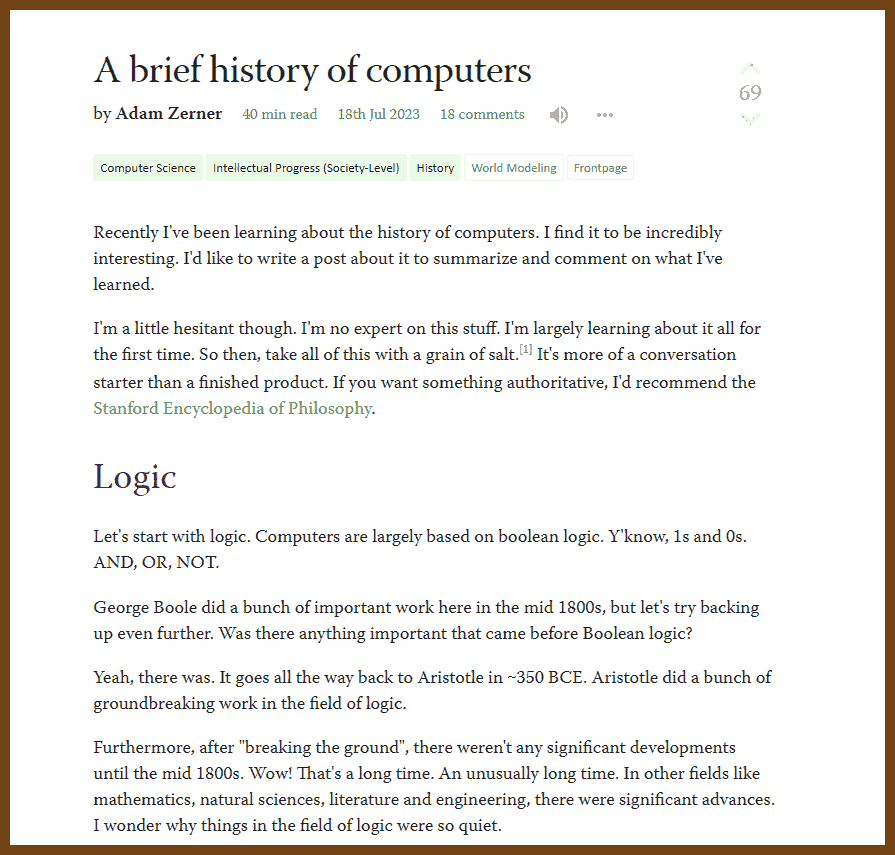
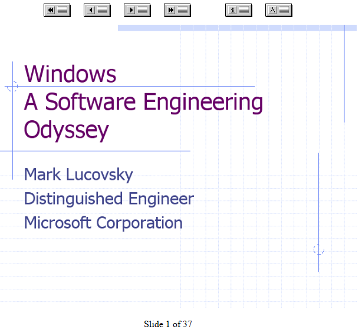
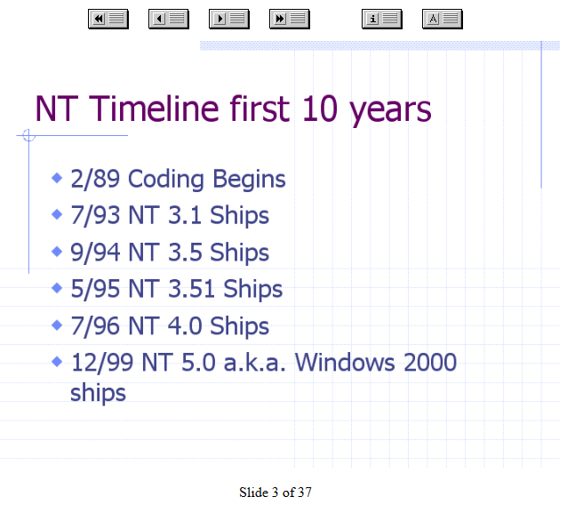
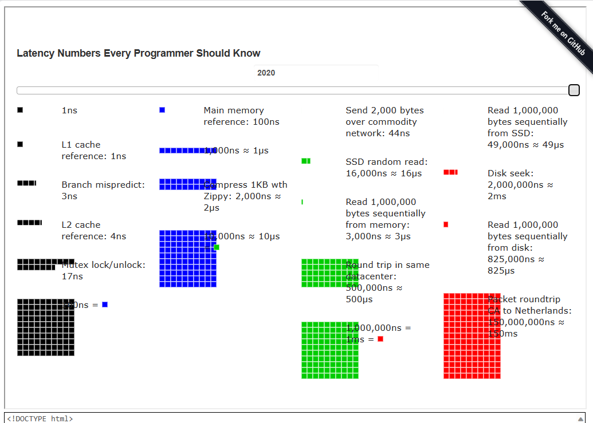
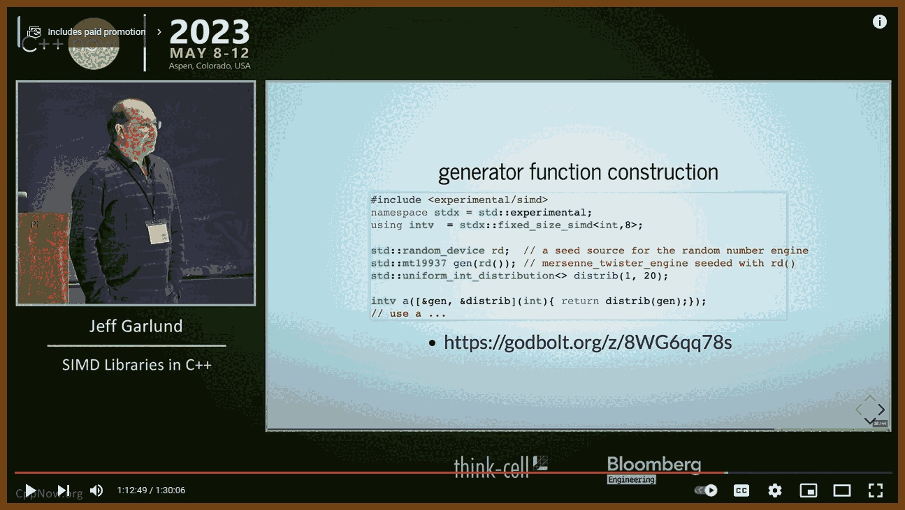
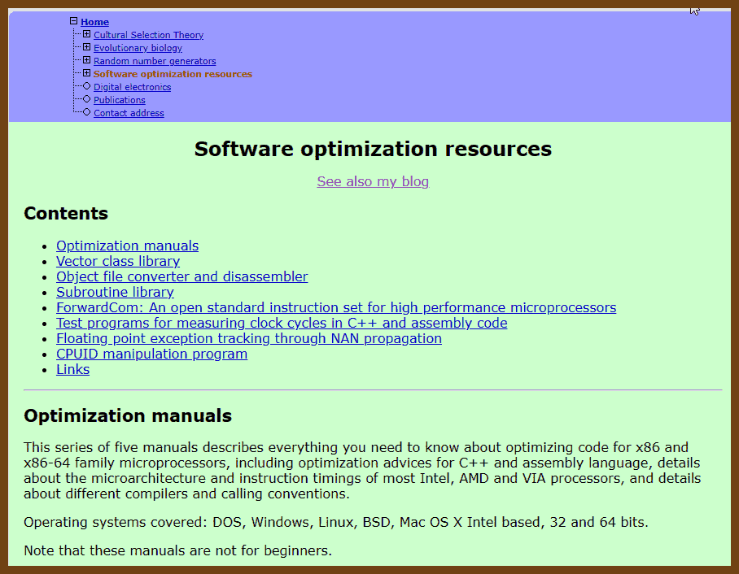
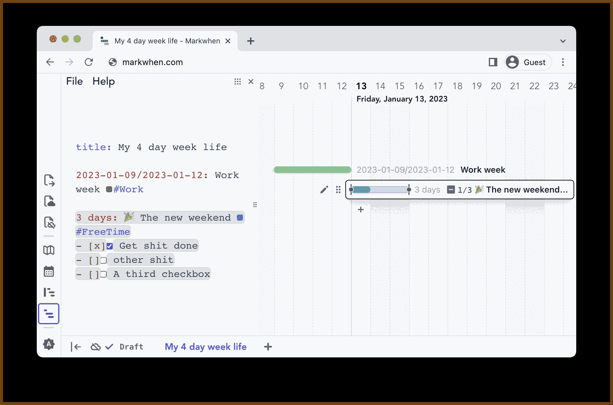
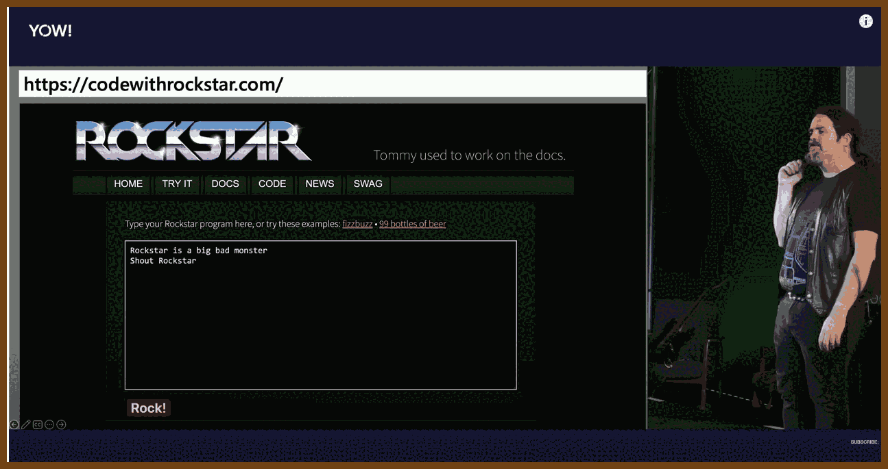
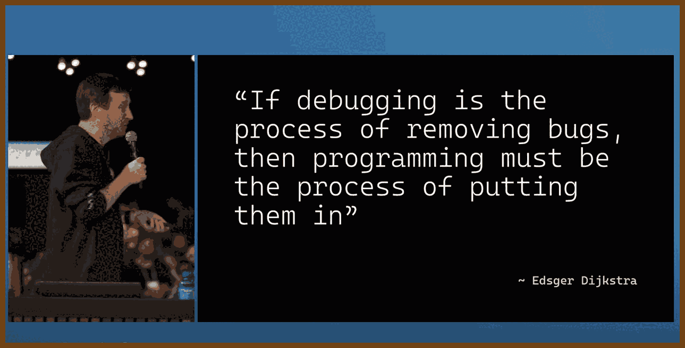

---
layout: post
title:  "Links from my inbox 2023-08-01"
date:   2023-08-01T21:39:00-07:00
categories: links
---

## Good Reads

2023-07-30 [Before you try to do something, make sure you can do nothing - The Old New Thing](https://devblogs.microsoft.com/oldnewthing/20230725-00/?p=108482&)

> When building a new thing, a good first step is to build a thing that *does nothing*. That way, you at least know you are starting from a good place. If I’m building a component that performs an action, I’ll probably do it in these steps:
>
> - Step zero is to write a standalone program to perform the action. This ensures that the action is even possible.
> - Once I have working code to perform the action, I write a component that *doesn’t* perform an action. That at least makes sure I know how to build a component.
> - Next, I register the component for the action, but have the `Invoke` method merely print the message “Yay!” to the debugger without doing anything else. This makes sure I know how to get the component to run at the proper time.
> - Next, I fill in the `Invoke` method with enough code to identify what action to perform and which object to perform it on, print that information to the debugger, and return without actually performing the action. This makes sure I can identify which action is supposed to be done.
> - Finally, I fill in the rest of the `Invoke` method to perform the action on the desired object. For this, I can copy/paste the already-debugged code from step zero.
>
> > This link came from 2023-07-30 [Programming Digest](https://programmingdigest.net/digests/1688)

2023-07-30 [What we talk about when we talk about System Design | mahesh’s blog](https://maheshba.bitbucket.io/blog/2023/07/12/Design.html/)

> The rules for effective design are as follows:
>
> 1. **Late-bind on designs**: The design process should explore the entire design space rather than converging on a single point solution too early, allowing teams to switch between different possibilities until the best solution is found.
> 2. **Each point solution is a DoS attack on the design process**: Discussing designs within the context of the design space accelerates the process, making it easier to compare and iterate on different solutions efficiently.
> 3. **Think in parallel; Design together; Implement in parallel; Review together**: The design and development process should be parallelized and divided into creative thinking, centralized design, parallel implementation, and centralized reviewing. Late-binding to developers is crucial for fostering new ideas.
> 4. **Talk about the problem, not existing systems**: Designing from first principles is more effective than basing solutions solely on existing systems, as they might introduce unnecessary complexity or bias.
> 5. **Always talk about a second application**: Abstractions should be described independently of specific applications to prevent application-specific details from leaking into the abstraction.
> 6. **For each abstraction, build one implementation; plan for a second; hope for a third**: Discussing multiple implementations of an abstraction ensures that the semantics of the abstraction remain independent of implementation details.
> 7. **Abstraction is not free**: Each abstraction layer adds complexity, requiring precise definitions and reasoning in generic ways. Designers must balance concreteness and abstractness.
> 8. **Be critical (but about the right things)**: Designers should critically assess unknown and challenging aspects of a project while recognizing that every well-established system started with rough ideas.
>
> > This link came from 2023-07-30 [Programming Digest](https://programmingdigest.net/digests/1688)

2023-07-25 [Unicode is harder than you think · mcilloni's blog](https://mcilloni.ovh/2023/07/23/unicode-is-hard/)

> Reading the excellent article by JeanHeyd Meneide on [how broken string encoding in C/C++ is](https://thephd.dev/the-c-c++-rust-string-text-encoding-api-landscape) made me realise that Unicode is a topic that is often overlooked by a large number of developers. In my experience, there’s a lot of confusion and wrong expectations on what Unicode is, and what best practices to follow when dealing with strings that may contain characters outside of the ASCII range.
>
> This article attempts to briefly summarise and clarify some of the most common misconceptions I’ve seen people struggle with, and some of the pitfalls that tend to recur in codebases that have to deal with non-ASCII text.

2023-07-22 [The Most Important Coding Habits – PuppyCoding](https://puppycoding.com/2023/07/22/healthy-coding-habits/)

> In this article, the author asserts that the most significant coding habits aren't related directly to the code itself, but rather those that sustain and enhance a programmer's physical health and longevity in the field. This realization comes after suffering from a spinal disc herniation, commonly known as a slipped disc, attributed to poor posture from prolonged keyboard usage.
> The author stresses four crucial habits for healthy coding:
>
> 1. **Daily stretches**: A chiropractor attributed the author's slipped disc to the inactivity of stomach and thigh muscles, which should help support the back but become weak due to extended sitting. To alleviate this, they recommend regular stretching exercises, particularly for the central and lower body, to improve muscle suppleness and support.
> 2. **Regular breaks**: Taking a short break at least once an hour is advised, which apart from maintaining physical health, also aids in refreshing the mind. Breaks often provide a new perspective, making problem-solving easier upon return.
> 3. **Avoid late-night coding**: Working long hours into the night not only leads to poorer quality code but also encourages bad posture. The author suggests establishing a strict cut-off time for work, promoting better mental and physical health.
> 4. **Improving the coding environment**: Investing in an ergonomic setup, including a laptop stand, comfortable chair, and a standing desk, can significantly improve posture and reduce strain.
>    In conclusion, the author regrets not incorporating these habits sooner and encourages fellow programmers, particularly those early in their career, to learn from their mistakes to enjoy a healthier, more prolonged coding career.

2023-07-07 [Excellence is a habit, but so is failure – Andreas Kling – I like computers!](https://awesomekling.github.io/Excellence-is-a-habit-but-so-is-failure/)

> - I didn't become addicted to drugs overnight. It happened over hundreds of moments where I prioritized momentary pleasure over health and safety.
> - I didn't become overweight overnight. It happened over hundreds of moments where I opted for immediate gratification over long-term health.
> - I didn't ruin relationships overnight. It happened over hundreds of moments where I chose comfort over confronting difficult conversations, admitting my mistakes, or even just acknowledging that someone was better than me at something.

## How the things work

2023-07-22 [The "Basics" | Putting the "You" in CPU](https://cpu.land/the-basics)

> 

2023-07-22 [A brief history of computers — LessWrong](https://www.lesswrong.com/posts/vfRpzyGsikujm9ujj/a-brief-history-of-computers)

> 
>
> 

## Retro 

2023-07-14 [Windows: A Software Engineering Odyssey](https://www.usenix.org/legacy/events/usenix-win2000/invitedtalks/lucovsky_html/)

> 
> 

2023-07-09 [Chistory](https://www.bell-labs.com/usr/dmr/www/chist.html)

> The C programming language was devised in the early 1970s as a system implementation language for the nascent Unix operating system. Derived from the typeless language BCPL, it evolved a type structure; created on a tiny machine as a tool to improve a meager programming environment, it has become one of the dominant languages of today. This paper studies its evolution.

## Fun

2023-07-08 [Windows 95 Tips, Tricks, and Tweaks](https://windows95tips.com/)

> 

2023-07-13 [Interview with an Emacs Enthusiast in 2023  Colorized  - YouTube](https://www.youtube.com/watch?v=urcL86UpqZc)

> 

2023-07-28 [My 90's TV!](https://my90stv.com/#YCpvkvNbLd8)

> 

2023-07-25 [Got called to a professor’s office after a complaint his SPARC4 was running slow](https://infosec.exchange/@paco/110772422266480371)

> Back in the day, I got called to a professor’s office (I was IT support in the CS department) and the professor was complaining his Sparc4 was running slow. First thing I did was minimise a window and there was just this black square. Bit by bit roaches slowly moved. Like 0.5 fps. So many xroaches under his xterm that it was just a solid black square.
> The roaches multiply if they’re left alone long enough. This professor NEVER moved windows. So roaches scurried under his windows and then sat there. Never disturbed by being exposed. Slowly multiplying at some rate. Some grad student had thought it would be funny to play a prank on the professor and run xroach on him. But the professor obviously never saw the roaches. So they hid under his windows slowly increasing until finally they soaked up so much RAM that it impaired performance.

2023-07-25 [veltman/clmystery: A command-line murder mystery](https://github.com/veltman/clmystery/tree/master)

> There's been a murder in Terminal City, and TCPD needs your help.
> To figure out whodunit, you need access to a command line.

2023-07-24 [Death Metal English](https://www.invisibleoranges.com/death-metal-english/)

> Normal English: “Commuting to work”
> Death Metal English: “TRANSPORTATION OF THE WAGEBOUND UNTO THE NEXUS OF PERPETUAL QUOTIDIAN ENSLAVEMENT”

## Projects 

2023-07-31 [Numbers Every Programmer Should Know By Year](https://colin-scott.github.io/personal_website/research/interactive_latency.html)

> 

## C++

### C++ Talks and Videos

2023-08-01 [SIMD Libraries in C++ - Jeff Garland - CppNow 2023 - YouTube](https://www.youtube.com/watch?v=hlgCeWC9jxI)

> 
>
> Application libraries:
>
> - simd json https://simdjson.org/
> - parse gigabytes json per second
> - simd in the standard library:
>   - parallel algorithms
>   - mdspan
> - simd crc https://github.com/neurolabusc/simd_crc
> - simd sort https://github.com/intel/x86-simd-sort
> - math https://bitbucket.org/blaze-lib/blaze/src/master/
>
> Developer libraries
>
> - xsimd C++11
>   - 'batch type' is vector type
>   - https://xsimd.readthedocs.io/en/latest/
> - eve (formerly boost.simd) - C++20
>   - Expressive Vector Engine
>   - 'wide type' is vector type
>   - https://jfalcou.github.io/eve/index.html
> - Agner Fog VCL
>   - vector class library
>   - series of vector types
>   - https://www.agner.org/optimize/vectorclass.pdf

### C++  Articles

2023-08-01 💡 [Agner Fog](https://www.agner.org/)

> According to ChatGPT: Agner Fog is a Danish professor known for his work in cultural selection theory, optimization methods, and system development methods. He holds a PhD in Operations Research and has a diverse educational background including sociology, statistics, and computer science.
>
> One of his main contributions to the field of computer science is his development of CPU dispatcher software and comprehensive documentation of instruction latencies and throughputs for various CPU models. His optimization guides and tools are popular among performance-oriented programmers.
>
> In the field of social sciences, he has developed a theory of cultural selection, which is similar to biological evolution but acts on cultural phenomena such as norms, traditions, language, technology, and art.
>
> ---
>
> Software optimization resources
>
> Optimization manuals
>
> #### Optimizing software in C++: An optimization guide for Windows, Linux and Mac platforms
>
> This is an optimization manual for advanced C++ programmers. Topics include: The choice of platform and operating system. Choice of compiler and framework. Finding performance bottlenecks. The efficiency of different C++ constructs. Multi-core systems. Parallelization with vector operations. CPU dispatching. Efficient container class templates. Etc.
>
> File name: optimizing_cpp.pdf, size: 1838972, last modified: 2023-Jul-01.
> [Download](https://www.agner.org/optimize/optimizing_cpp.pdf).
>
> ### The microarchitecture of Intel, AMD and VIA CPUs: An optimization guide for assembly programmers and compiler makers
>
> This manual contains details about the internal working of various microprocessors from Intel, AMD and VIA. Topics include: Out-of-order execution, register renaming, pipeline structure, execution unit organization and branch prediction algorithms for each type of microprocessor. Describes many details that cannot be found in manuals from microprocessor vendors or anywhere else. The information is based on my own research and measurements rather than on official sources. This information will be useful to programmers who want to make CPU-specific optimizations as well as to compiler makers and students of microarchitecture.
>
> File name: microarchitecture.pdf, size: 2472395, last modified: 2023-Jul-01.
> [Download](https://www.agner.org/optimize/microarchitecture.pdf).
>
> ## C++ vector class library
>
> This is a collection of C++ classes, functions and operators that makes it easier to use the the vector instructions (Single Instruction Multiple Data instructions) of modern CPUs without using assembly language. Supports the SSE2, SSE3, SSSE3, SSE4.1, SSE4.2, AVX, AVX2, FMA, XOP, and AVX512F/BW/DQ/VL instruction sets. Includes standard mathematical functions. Can compile for different instruction sets from the same source code.
> [Description and instructions](https://www.agner.org/optimize/vcl_manual.pdf).
> [Message board](https://www.agner.org/forum/viewforum.php?f=1).
> [Source on Github](https://github.com/vectorclass).
> [Nice little instruction video by WhatsaCreel](https://www.youtube.com/watch?v=TKjYdLIMTrI).
>
> [Latest release](https://github.com/vectorclass/version2/releases).
>
> 

2023-07-25 [Getting Friendly With CPU Caches](https://www.ardanlabs.com/blog/2023/07/getting-friendly-with-cpu-caches.html)

> When a CPU needs to access a piece of data, the data needs to travel into the processor from main memory.
>
> The architecture looks something like this:
>
> **Figure 1: CPU Cache**
>
> 

> Figure 1 shows the different layers of memory a piece of data has to travel to be accessible by the processor. Each CPU has its own L1 and L2 cache, and the L3 cache is shared among all CPUs. When the data finally makes its way inside the L1 or L2 cache, the processor can access it for execution purposes. On Intel architectures the L3 cache maintains a copy of what is in L1 and L2.
>
> Performance in the end is about how efficiently data can flow into the processor. As you can see from the diagram, main memory access is about 80 times slower than accessing the L1 cache since the data needs to be moved and copied.
>
> *Note: [Memory Performance in a Nutshell](https://www.intel.com/content/www/us/en/developer/articles/technical/memory-performance-in-a-nutshell.html): The data is from 2016 but what’s important are the latency ratios which are pretty constant.*

2023-07-23 [STX: Main Page](https://lamarrr.github.io/STX/)

>  [lamarrr/STX: C++17 & C++ 20 error-handling and utility extensions.](https://github.com/lamarrr/STX)
>  These monadic types not only make error handling easier but also make the paths more obvious to the compiler for optimizations. Monads can be simply thought of as abstract types of actions. Their monadic nature makes it easy to operate on them as pipelines and in the process eliminate redundant error-handling logic code.
>
>  - `stx::Result<T, E>` : Type for relaying the result of a function that can fail or succeed (with monadic extensions)
>  - `stx::Option<T>` : Type for **safe** optional values (with monadic extensions)

## Markdown

2023-08-01 [mark-when/markwhen: Make a cascading timeline from markdown-like text. Supports simple American/European date styles, ISO8601, images, links, locations, and more.](https://github.com/mark-when/markwhen)

> **Markwhen** is an interactive text-to-timeline tool. Write markdown-ish text and it gets converted into a nice looking cascading timeline.
>
> Use the editor [here](https://markwhen.com/).
>
> This repo is for the view container, not the editor. The editor (markwhen.com) and [VSCode extension](https://marketplace.visualstudio.com/items?itemName=Markwhen.markwhen) are built on top of the view container.

> 

> 2023-08-01 [Show HN: Markwhen: Markdown for Timelines | Hacker News](https://news.ycombinator.com/item?id=36944152)

## Yodeling

> Hyper-realistic portrait of an alpine yodeling girl, her skin textured by highland winds, expressive azure eyes reflecting the vast sky, and lips curved into a melodious call. Every detail from her freckled button nose to her windswept hair contributes to this stunning, picturesque character

2023-08-02 [LESSON 1 - It's Foundational - Yodel-lay-ee-dee](https://www.yodelcourse.org/lesson-1.html)

> 
>
> #### Songs
>
> - 2023-07-04 [Mei Vata is a Appenzeller - Franzl Lang - YouTube](https://www.youtube.com/watch?v=1AcWX_-ez1U)
> - 2023-07-04 [Ich wünsch' mir eine Jodlerbraut - Franzl Lang - YouTube](https://www.youtube.com/watch?v=gqEZa2rrnCY)

**BethWilliamsMusic:**

1 https://www.youtube.com/watch?v=plyd2kzWWYc

2 https://www.youtube.com/watch?v=bTrmN11fkPc

3 https://www.youtube.com/watch?v=Xp1PmnrfFks

## Good Talks!

2023-07-30 [The Art of Code • Dylan Beattie • YOW! 2022 - YouTube](https://www.youtube.com/watch?v=gwLQMuTspxE)

> 
>
> 2023-07-30 [The 128-Language Quine Relay - esoteric.codes](https://esoteric.codes/blog/the-128-language-quine-relay)
> 2023-07-30 [mame/quine-relay: An uroboros program with 100+ programming languages](https://github.com/mame/quine-relay)
> 2023-07-30 [Shakespeare Programming Language – Living London – Carleton College](https://www.carleton.edu/ocs/london/news/shakespeare-programming-language/)
> Hamlet:
> You lying stupid fatherless big smelly half-witted coward! You are as
> stupid as the difference between a handsome rich brave hero and thyself!
> Speak your mind!
> (Will print "H" from "Hello World")
>
> **Sonic PI demo** (minute: 38:00)
> https://sonic-pi.net
> https://youtu.be/gwLQMuTspxE?t=2282
>
> **RockstarLang**
>
> 2023-07-30 [RockstarLang/rockstar: The Rockstar programming language specification](https://github.com/RockstarLang/rockstar)
> https://youtu.be/gwLQMuTspxE?t=2520  (t= 42:00)
>
> Comparison

| Operand | Description                         |
| ------- | ----------------------------------- |
| ==      | your love **is** a lie              |
| !=      | the whisky **ain't** the answer     |
| >       | my heart **is stronger than** steel |
| <       | my soul **is weaker than** water    |
| >=      | my will **is as strong as** a lion  |
| <=      | your lies are **as low as** a snake |

2023-07-15 [Locknote: How JavaScript Happened: A Short History of Programming Languages - Mark Rendle - YouTube](https://www.youtube.com/live/hEdzaIa4Heg?feature=share&t=1516)

> 

> FORTRAN
>
> - IF statement
> - * for multiplication operator
> - i as iterator variable
>
> ALGOL
>
> - Block structure
> - IF ... THEN
> - ELSE ...
> - SWITCH
> - FOR loops
> - Functions
> - Semicolons
> - Backus—Naur Form
>
> LISP
>
> - Functional Programming
> - First-class functions
> - The Heap
> - Garbage collection
>
> Simula
>
> - Classes
> - Inheritance
> - Polymorphism
> - Scope (public / private)
>
> APL
>
> - Dynamic typing
>
> BCPL
>
> - Curly braces
>
> C
>
> - `for (int i = 0; i < 100; i++) { }`
>
> Smalltalk
>
> - Reflection
> - console
> - Virtual Machine
> - Everything being an object
>
> ML
>
> - Arrow function syntax
>
> C++
> try / catch / throw
>
> Self
>
> - prototype-based object orientation
>
> C#
> async/await
