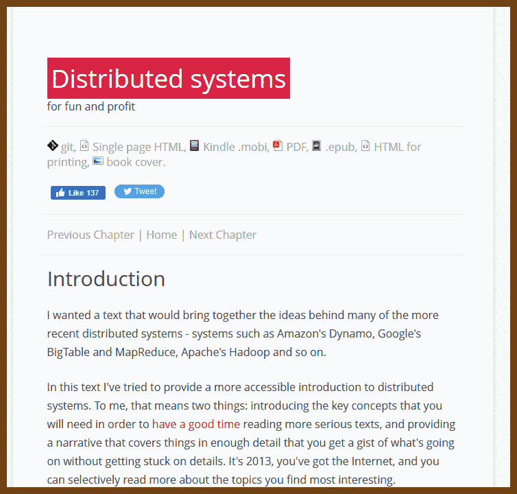
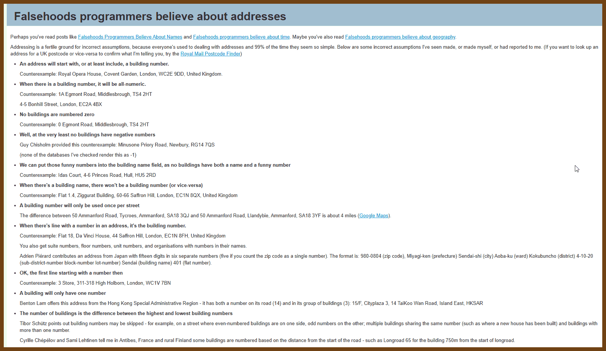
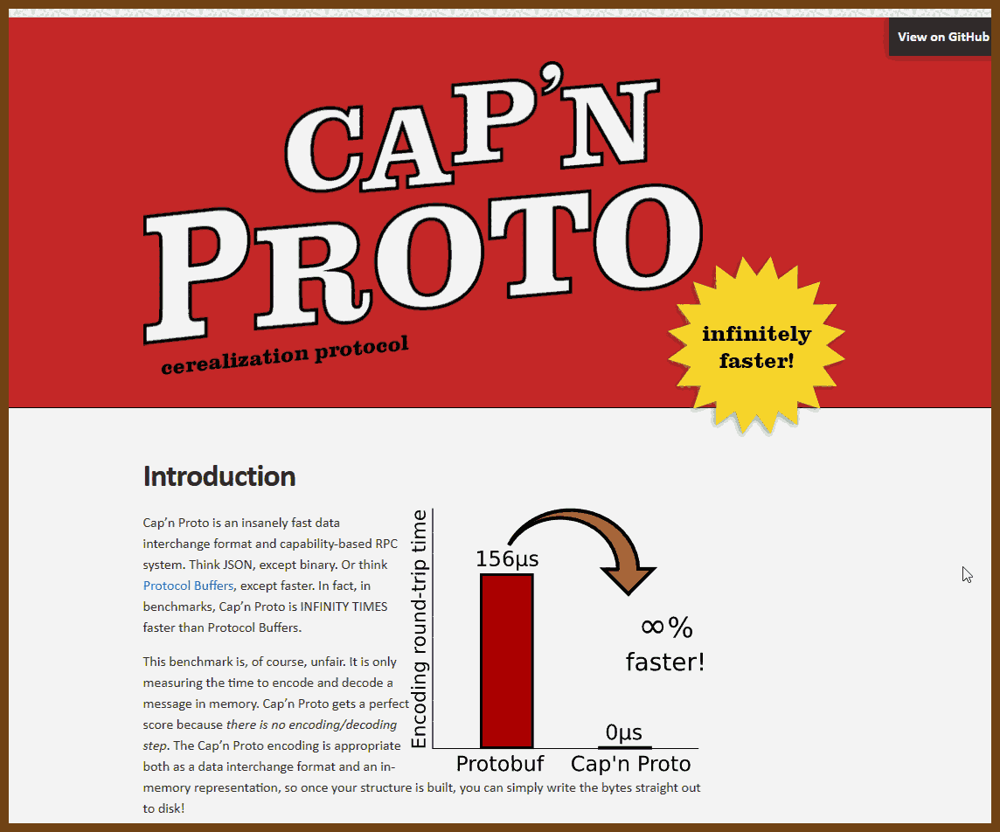
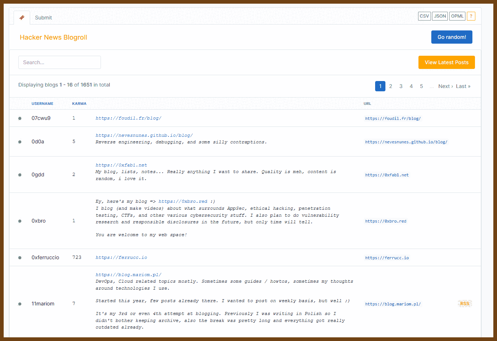
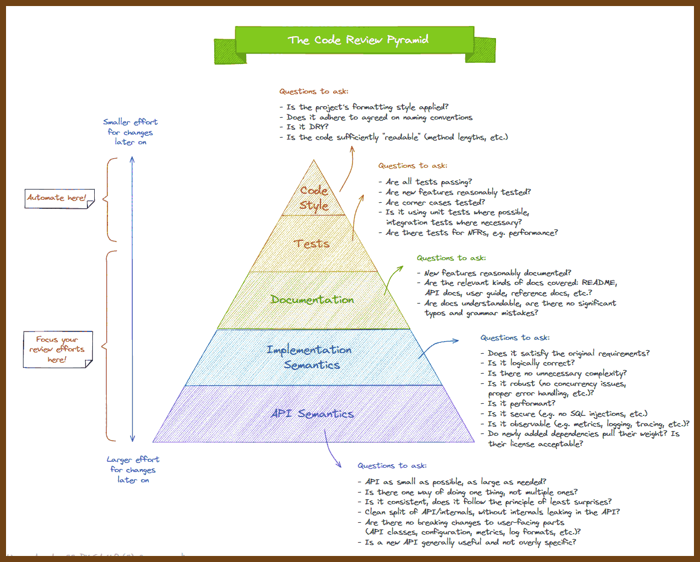
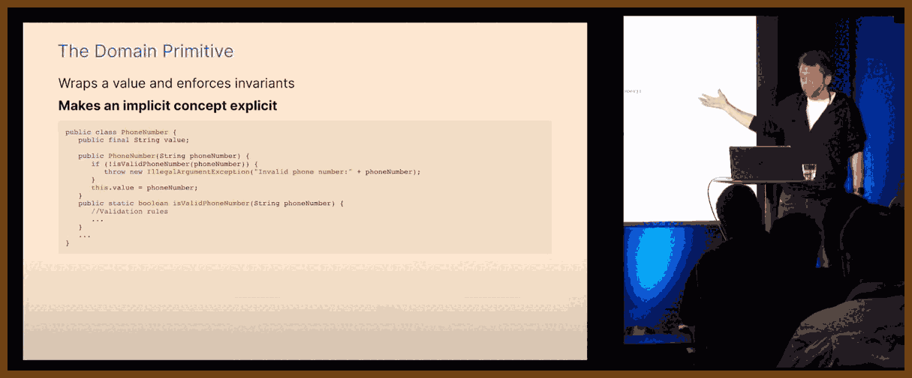

---
layout: post
title:  "Links from my inbox 2023-08-04"
date:   2023-08-04T23:40:00-07:00
categories: links
---


## Books

2023-08-05 [Distributed systems for fun and profit](https://book.mixu.net/distsys/)

> I wanted a text that would bring together the ideas behind many of the more recent distributed systems - systems such as Amazon's Dynamo, Google's BigTable and MapReduce, Apache's Hadoop and so on.
>
> In this text I've tried to provide a more accessible introduction to distributed systems. To me, that means two things: introducing the key concepts that you will need in order to [have a good time](https://www.google.com/search?q=super+cool+ski+instructor) reading more serious texts, and providing a narrative that covers things in enough detail that you get a gist of what's going on without getting stuck on details. It's 2013, you've got the Internet, and you can selectively read more about the topics you find most interesting.
>
> In my view, much of distributed programming is about dealing with the implications of two consequences of distribution:
>
> - that information travels at the speed of light
> - that independent things fail independently*
>
> In other words, that the core of distributed programming is dealing with distance (duh!) and having more than one thing (duh!). These constraints define a space of possible system designs, and my hope is that after reading this you'll have a better sense of how distance, time and consistency models interact.
>
> This text is focused on distributed programming and systems concepts you'll need to understand commercial systems in the data center. It would be madness to attempt to cover everything. You'll learn many key protocols and algorithms (covering, for example, many of the most cited papers in the discipline), including some new exciting ways to look at eventual consistency that haven't still made it into college textbooks - such as CRDTs and the CALM theorem.
>
> I hope you like it! If you want to say thanks, follow me on [Github](https://github.com/mixu/) (or [Twitter](https://twitter.com/mikitotakada)). And if you spot an error, [file a pull request on Github](https://github.com/mixu/distsysbook/issues).
>
> [The first chapter](https://book.mixu.net/distsys/intro.html) covers distributed systems at a high level by introducing a number of important terms and concepts. It covers high level goals, such as scalability, availability, performance, latency and fault tolerance; how those are hard to achieve, and how abstractions and models as well as partitioning and replication come into play.
>
> [The second chapter](https://book.mixu.net/distsys/abstractions.html) dives deeper into abstractions and impossibility results. It starts with a Nietzsche quote, and then introduces system models and the many assumptions that are made in a typical system model. It then discusses the CAP theorem and summarizes the FLP impossibility result. It then turns to the implications of the CAP theorem, one of which is that one ought to explore other consistency models. A number of consistency models are then discussed.
>
> A big part of understanding distributed systems is about understanding time and order. To the extent that we fail to understand and model time, our systems will fail. [The third chapter](https://book.mixu.net/distsys/time.html) discusses time and order, and clocks as well as the various uses of time, order and clocks (such as vector clocks and failure detectors).
>
> 

2023-08-05 Book [Data-Oriented Design](https://www.dataorienteddesign.com/dodbook/) Richard Fabian

> Online release of Data-Oriented Design :
> This is the free, online, reduced version. Some inessential chapters are excluded from this version, but in the spirit of this being an education resource, the essentials are present for anyone wanting to learn about data-oriented design.
> Expect some odd formatting and some broken images and listings as this is auto generated and the Latex to html converters available are not perfect. If the source code listing is broken, you should be able to find the referenced source on [github](https://github.com/raspofabs/dodbooksourcecode/). If you like what you read here, consider purchasing the real paper book from [here](https://www.amazon.com/dp/1916478700), as not only will it look a lot better, but it will help keep this version online for those who cannot afford to buy it.
> 
>
> DOD


## Good Reads

2023-07-08 [Falsehoods programmers believe about addresses](https://www.mjt.me.uk/posts/falsehoods-programmers-believe-about-addresses/)

> Addressing is a fertile ground for incorrect assumptions, because everyone's used to dealing with addresses and 99% of the time they seem so simple. Below are some incorrect assumptions I've seen made, or made myself, or had reported to me. (If you want to look up an address for a UK postcode or vice-versa to confirm what I'm telling you, try the Royal Mail Postcode Finder)
>
> An address will start with, or at least include, a building number.
>
> Counterexample: Royal Opera House, Covent Garden, London, WC2E 9DD, United Kingdom.
>
> When there is a building number, it will be all-numeric.
>
> Counterexample: 1A Egmont Road, Middlesbrough, TS4 2HT
>
> 4-5 Bonhill Street, London, EC2A 4BX
>
> No buildings are numbered zero
>
> Counterexample: 0 Egmont Road, Middlesbrough, TS4 2HT
>
> Well, at the very least no buildings have negative numbers
>
> Guy Chisholm provided this counterexample: Minusone Priory Road, Newbury, RG14 7QS
>
> (none of the databases I've checked render this as -1)
>
> 

## Fun

2023-08-05 [WORDWARD DRAW by Daniel Linssen](https://managore.itch.io/wordward-draw)

> 


## Retro

2023-08-05 [GitHub - grassmunk/Chicago95: A rendition of everyone's favorite 1995 Microsoft operating system for Linux.](https://github.com/grassmunk/Chicago95) **Linux**

> #### XFCE / Xubuntu Windows 95 Total Conversion
>
> 
>
> *Click [here](https://github.com/grassmunk/Chicago95/blob/master/Screenshots/SCREENSHOTS.md) for more screenshots*
>
> I was unhappy with the various XFCE/GTK2/GTK3 Windows 95 based themes and decided to make one that was more consistent across the board for theming.
>
> ### Included in this theme:
>
> - Icons to complete the icon theme started with Classic95
> - GTK2 and GTK3 themes
> - Edited Redmond XFWM theme to more accurately reflect Windows 95
> - Chicago95 Plus! A tool to preview and install Windows 95/98/ME/XP themes
> - Plymouth theme created from scratch
> - An MS-DOS inspired theme for oh-my-zsh
> - Partial support for HiDPI monitors
> - Partial icon theme for LibreOffice 6+
>
> ### Requirements:
>
> - GTK+ 3.22 or 3.24
> - Xfce 4.12, 4.14, 4.16
> - gtk2-engines-pixbuf (Recommended for GTK2 applications)
> - The xfce4-panel-profiles package
> - A Window compositor


## Maps

2023-08-05 [overpass turbo](https://overpass-turbo.eu/)

> Allows to query OpenStreetMap
>
> 

```
[out:json];
// Define the area of interest using a predefined area for Seattle.
area["name"="Seattle"]->.seattle;

// Search for nodes tagged as public restrooms within the Seattle area
node(area.seattle)[amenity=toilets];

// Output the results
out;

```


## The Era of AI

2023-07-25 [A comprehensive guide to running Llama 2 locally - Replicate – Replicate](https://replicate.com/blog/run-llama-locally)

2023-07-22 [Highly Efficient Prompt for Summarizing — GPT-4 : r/ChatGPTPro](https://www.reddit.com/r/ChatGPTPro/comments/13n55w7/highly_efficient_prompt_for_summarizing_gpt4/)

> As a professional summarizer, create a concise and comprehensive summary of the provided text, be it an article, post, conversation, or passage, while adhering to these guidelines:
>
> 1. Craft a summary that is detailed, thorough, in-depth, and complex, while maintaining clarity and conciseness.
> 2. Incorporate main ideas and essential information, eliminating extraneous language and focusing on critical aspects.
> 3. Rely strictly on the provided text, without including external information.
> 4. Format the summary in paragraph form for easy understanding.
> 5. Conclude your notes with [End of Notes, Message #X] to indicate completion, where "X" represents the total number of messages that I have sent. In other words, include a message counter where you start with #1 and add 1 to the message counter every time I send a message.
>
> By following this optimized prompt, you will generate an effective summary that encapsulates the essence of the given text in a clear, concise, and reader-friendly manner.

2023-07-17 [yokoffing/ChatGPT-Prompts: ChatGPT and Bing AI prompt curation](https://github.com/yokoffing/ChatGPT-Prompts)

2023-07-17 [f/awesome-chatgpt-prompts: This repo includes ChatGPT prompt curation to use ChatGPT better.](https://github.com/f/awesome-chatgpt-prompts)

2023-07-15 [JushBJJ/Mr.-Ranedeer-AI-Tutor: A GPT-4 AI Tutor Prompt for customizable personalized learning experiences.](https://github.com/JushBJJ/Mr.-Ranedeer-AI-Tutor)

> Unlock the potential of GPT-4 with Mr. Ranedeer AI Tutor, a customizable prompt that delivers personalized learning experiences for users with diverse needs and interests.

2023-07-05 [How Coders Can Survive—and Thrive—in a ChatGPT World - IEEE Spectrum](https://spectrum.ieee.org/ai-programming)

> // I am testing GPT summary prompt here
>
> - Stick to Basics and Best Practices: Despite AI's growth, the basics of programming, such as problem-solving skills, understanding code, and being able to fit code into larger systems, remain vital. Domain-specific knowledge, system design, and software architecture remain primarily human domains.
> - Find the Tool That Fits Your Needs: It's crucial to identify and experiment with various AI-based tools that align with your requirements, whether for automating tasks like test creation or for providing programming suggestions. Adapting to new tools as they emerge in the fast-paced AI field is key.
> - Clear and Precise Conversations Are Key: When using AI tools, being detailed and clear in communication is critical. For conversational AI programmers, prompt engineering helps frame effective prompts. The process should be viewed as iterative, with the AI assistant seen as an inexperienced yet knowledgeable collaborator.
> - Be Critical and Understand the Risks: Programmers should remain critical of AI-generated code, as models can produce incorrect code. Checking generated code is essential, even if it adds extra steps. Concerns regarding proprietary code, copyright, and security are also highlighted. Programmers need to understand the models' data sources and the versions of programming languages used during training to appropriately contextualize results.


## FFmpeg

2023-08-05 [ffmprovisr](https://amiaopensource.github.io/ffmprovisr/#basic-structure) ffmpeg cookbook

> Github: [amiaopensource/ffmprovisr: Repository of useful FFmpeg commands for archivists!](https://github.com/amiaopensource/ffmprovisr)
>
> Making FFmpeg Easier
> FFmpeg is a powerful tool for manipulating audiovisual files. Unfortunately, it also has a steep learning curve, especially for users unfamiliar with a command line interface. This app helps users through the command generation process so that more people can reap the benefits of FFmpeg.
>
> Each button displays helpful information about how to perform a wide variety of tasks using FFmpeg. To use this site, click on the task you would like to perform. A new window will open up with a sample command and a description of how that command works. You can copy this command and understand how the command works with a breakdown of each of the flags.
>
> This page does not have search functionality, but you can open all recipes (second option in the sidebar) and use your browser's search tool (often ctrl+f or cmd+f) to perform a keyword search through all recipes.
>
> 

2023-08-05 [Editing Videos with ffmpeg – Hadet – Earth Based System Administrator and Hobbyist](https://www.hadet.dev/ffmpeg-cheatsheet/)

> 
>
> Editing Videos with ffmpeg
>
> This is a short and messy guide for editing files from the command line. While I do this on Linux, these commands will work on MacOS and Windows too. The reason I do this is because I am vision impaired and timeline editors are very cumbersome for me in particular. Sometimes I also feel this is faster, especially for sharing short clips scaled for chat platforms like Discord.


## Bash

2023-08-05 [GitHub - denysdovhan/bash-handbook: :book: For those who wanna learn Bash](https://github.com/denysdovhan/bash-handbook)

> 
>
> If you are a developer, then you know the value of time. Optimizing your work process is one of the most important aspects of the job.
>
> In that path towards efficiency and productivity, we are often posed with actions that must be repeated over and over again, like:
>
> - taking a screenshot and uploading it to a server
> - processing text that may come in many shapes and forms
> - converting files between different formats
> - parsing a program's output
>
> Enter **Bash**, our savior.
>
> Bash is a Unix shell written by [Brian Fox](https://en.wikipedia.org/wiki/Brian_Fox_(computer_programmer)) for the GNU Project as a free software replacement for the [Bourne shell](https://en.wikipedia.org/wiki/Bourne_shell). It was released in 1989 and has been distributed as the Linux and macOS default shell for a long time.
>
> So why do we need to learn something that was written more than 30 years ago? The answer is simple: this *something* is today one of the most powerful and portable tools for writing efficient scripts for all Unix-based systems. And that's why you should learn bash. Period.
>
> In this handbook, I'm going to describe the most important concepts in bash with examples. I hope this compendium will be helpful to you.


## Projects

2023-08-05 [Cap'n Proto: Introduction](https://capnproto.org/)

> 
>
> Cap’n Proto is an insanely fast data interchange format and capability-based RPC system. Think JSON, except binary. Or think [Protocol Buffers](https://github.com/protocolbuffers/protobuf), except faster. In fact, in benchmarks, Cap’n Proto is INFINITY TIMES faster than Protocol Buffers.

2023-08-05 [Hacker News Blogroll](https://dm.hn/) / RSS

> 

2023-07-08 [The Code Review Pyramid - Gunnar Morling](https://www.morling.dev/blog/the-code-review-pyramid/)

> 
>
> [code_review_pyramid.svg](https://www.morling.dev/images/code_review_pyramid.svg)
> Code Style:
>
> - Is the project's formatting style applied?
> - Does it adhere to agreed on naming conventions
> - Is it DRY?
> - Is the code sufficiently "readable" (method lengths, etc.)
>
> Tests:
>
> - Are all tests passing?
> - Are new features reasonably tested?
> - Are corner cases tested?
> - Is it using unit tests where possible,  integration tests where necessary?
> - Are there tests for NFRs, e.g. performance?
>
> Documentation:
>
> - New features reasonably documented?
> - Are the relevant kinds of docs covered: README, API docs, user guide, reference docs, etc.?
> - Are docs understandable, are there no significant typos and grammar mistakes?
>
> Implementation semantics:
>
> - Does it satisfy the original requirements?
> - Is it logically correct?
> - Is there no unnecessary complexity?
> - Is it robust (no concurrency issues, proper error handling, etc.)?
> - Is it performant?
> - Is it secure (e.g. no SQL injections, etc.)
> - Is it observable (e.g. metrics, logging, tracing, etc.)?
> - Do newly added dependencies pull their weight? Is their license acceptable?
>
> API Semantics:
>
> - API as small as possible, as large as needed?
> - Is there one way of doing one thing, not multiple ones?
> - Is it consistent, does it follow the principle of least surprises?
> - Clean split of API/internals, without internals leaking in the API?
> - Are there no breaking changes to user-facing parts (API classes, configuration, metrics, log formats, etc.)?
> - Is a new API generally useful and not overly specific
>
> Licensed under CC BY-SA 4.0 (C) @gunnarmorling


## Web/SVG

2023-08-05 [SVG Path Commands | Lines](https://www.nan.fyi/svg-paths/lines)

> Interactive tutorial 

> 


## C#

2023-07-10 [Hunting .NET memory leaks with Windbg » André Snede](https://snede.net/hunting-net-memory-leaks-with-windbg/)

> Recently a client called me about an issue where one of their production servers would run out of memory, every other week.
>
> The application in question was a .NET Framework 4.5 Windows service, that runs in an Azure VM, and ever so often it would become unstable and start causing trouble.
>
> [Advanced .NET debugging Book](https://www.amazon.com/gp/product/0321578899/ref=as_li_tl?ie=UTF8&camp=1789&creative=9325&creativeASIN=0321578899&linkCode=as2&tag=andresnede-20&linkId=9625f911ca920910c31da3c1a4ee3664)
>
> [Debugging managed code, memory leak with memory dump using windbg](https://blogs.msdn.microsoft.com/paullou/2011/06/28/debugging-managed-code-memory-leak-with-memory-dump-using-windbg/)
>
> [Identifying memory leak with process explorer and windbg](https://blogs.msdn.microsoft.com/alikl/2009/02/15/identifying-memory-leak-with-process-explorer-and-windbg/)
>
> [Windbg cheatsheat](https://theartofdev.com/windbg-cheat-sheet/)


## C++ CPP CXX

2023-07-30 [fffaraz/awesome-cpp: A curated list of awesome C++ (or C) frameworks, libraries, resources, and shiny things. Inspired by awesome-... stuff.](https://github.com/fffaraz/awesome-cpp)

**Concurrency in C++: A Programmer’s Overview** 

> 

- 2023-07-10 [Concurrency in C++: A Programmer’s Overview (part 1 of 2) - Fedor Pikus - CppNow 2022 - YouTube](https://www.youtube.com/watch?v=ywJ4cq67-uc)
- 2023-07-10 [Concurrency in C++: A Programmer’s Overview (part 2 of 2) - Fedor Pikus - CppNow 2022 - YouTube](https://www.youtube.com/watch?v=R0V4xJ9HZpA)


## C language

2023-08-05 ["Once" one-time concurrent initialization with an integer](https://nullprogram.com/blog/2023/07/31/)

> The article discusses the idea of "once" initialization in concurrent programming, which ensures a certain part of a program is only initialized once regardless of how many threads are trying to access it simultaneously. The writer compares the traditional `pthread_once` function and Go's `sync.Once` function, highlighting their limitations. 
>
> To overcome these limitations, the author proposes a new "once" interface that removes callbacks and breaks down initialization into two separate steps, `do_once` and `once_done`. The `do_once` function returns true if initialization is required, otherwise, it returns false after initialization has completed (blocks if it's in process). The `once_done` function signals that the initialization process is complete.
>
> The author's approach doesn't limit the initialization to global data, and it uses integers to represent the three states of the "once" object: Uninitialized, Undergoing initialization, and Initialized. This approach allows for zero-initialization, concurrency control with atomic operations, and an optimization for a quicker state transition with an atomic increment. 
>
> In the end, the author presents the implementation details of this new approach, clarifying how it ensures initialization is performed only once and how it handles multiple threads trying to initialize the same piece of data.
> 

### SIMD

2023-07-08 [Packing a string of digits into an integer quickly – Daniel Lemire's blog](https://lemire.me/blog/2023/07/07/packing-a-string-of-digits-into-an-integer-quickly/)

```c
#include <arm_neon.h>
// From "20141103 012910", we want to get
// 0x20141103012910
uint64_t extract_nibbles(const char *c) {
  const uint8_t *ascii = (const uint8_t *)(c);
  uint8x16_t in = vld1q_u8(ascii);
  // masking the high nibbles,
  in = vandq_u8(in, vmovq_n_u8(0x0f));
  // shuffle the bytes
  const uint8x16_t shuf = {14, 13, 12, 11, 10, 9, 7, 6,
    5, 4, 3, 2, 1, 0, 255, 255};
  in = vqtbl1q_u8(in, shuf);
  // then shift/or
  uint16x8_t ins =
    vsraq_n_u16(vreinterpretq_u16_u8(in),
    vreinterpretq_u16_u8(in), 4);
  // then narrow (16->8),
  int8x8_t packed = vmovn_u16(ins);
  // extract to general register.
  return vget_lane_u64(vreinterpret_u64_u16(packed), 0);
}
```


## Talks / Security 

2023-08-04 [Secure Coding Back to Basics - Erlend Oftedal - NDC Security 2022 - YouTube](https://www.youtube.com/watch?v=ce3VBNrzRSE)

> 
>
> [cure53/DOMPurify: DOMPurify - a DOM-only, super-fast, uber-tolerant XSS sanitizer for HTML, MathML and SVG. DOMPurify works with a secure default, but offers a lot of configurability and hooks. Demo:](https://github.com/cure53/DOMPurify)
> let clean = DOMPurify.sanitize(dirty);
> https://github.com/colinhacks/zod

```js
import as z from "zod" ;
export const registrationParser = z.object ({
  email: z.string().min(10).max(60).regex(emailRegex),
  password: z.string().min(8).max(256)
})
``````

> Value objects
> 2023-08-03 [Input Validation - OWASP Cheat Sheet Series](https://cheatsheetseries.owasp.org/cheatsheets/Input_Validation_Cheat_Sheet.html)
> 2023-08-03 [Why input validation is not the solution for avoiding SQL injection and XSS](https://erlend.oftedal.no/blog/static-16.html)
> 2023-08-03 [Secure by Design](https://www.manning.com/books/secure-by-design)


## Multiplayer games - Research 🔬

2023-07-22 [leereilly/games: :video_game: A list of popular/awesome video games, add-ons, maps, etc. hosted on GitHub. Any genre. Any platform. Any engine.](https://github.com/leereilly/games)

2023-07-22 [SirRenzalot/awesome-lan-party-games: Awesome games for LAN parties or local multiplayer sessions.](https://github.com/SirRenzalot/awesome-lan-party-games)

2023-07-22 [ PCGamer  The 30 best multiplayer browser games to play right now : r/lowendgaming](https://www.reddit.com/r/lowendgaming/comments/7lr004/pcgamer_the_30_best_multiplayer_browser_games_to/)

2023-07-22 [Best Multiplayer Browser Games Of 2021 (No Download)](https://www.technewstoday.com/best-browser-games-multiplayer/)

2023-07-22 [Best multiplayer games to play in a web browser | | Resource Centre by Reliance Digital](https://www.reliancedigital.in/solutionbox/best-multiplayer-games-to-play-in-a-web-browser/)

2023-07-22 [QuickParty.Games – Instant Browser-Based Party Games](https://quickparty.games/)

