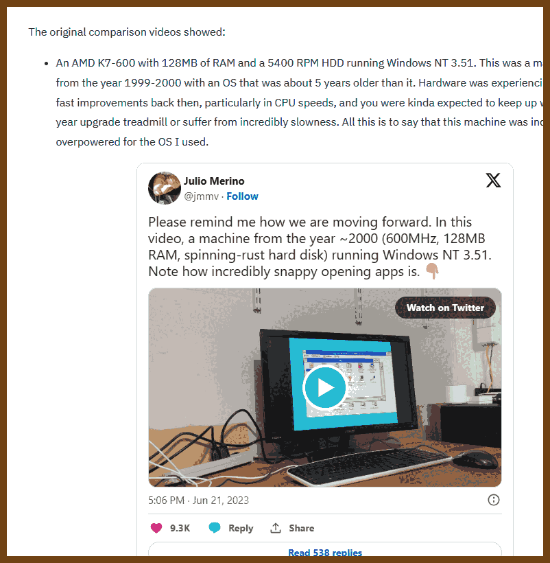
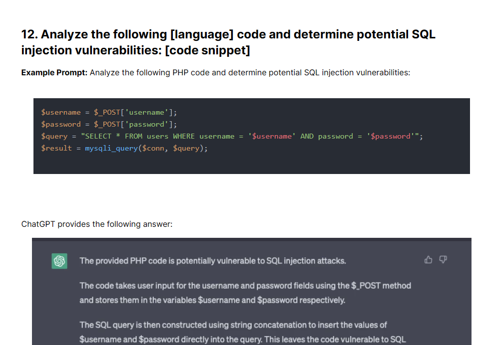
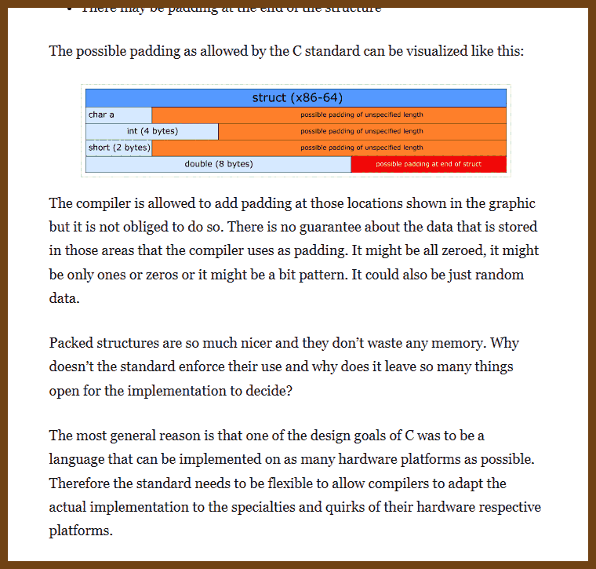
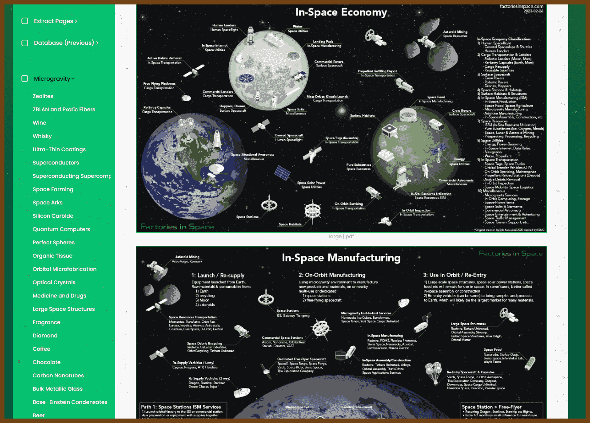

---
layout: post
title:  "Links from my inbox... TELEGRAM O_O and Roma 2023-08-05"
date:   2023-08-05T02:23:00-07:00
categories: links
---


> A cat image for no reason! 
>
> Hey, Roma, thank you again for suggesting an idea!
>
> > An impressively detailed image shows a plump, anthropomorphized cat, realistically depicted. Casually attired for work, it calmly sips coffee amidst a roaring house fire. The stark contrast between its fluffy cuteness, casual attire and the engulfing flames creates an unnerving sense of tranquility.


## Good reads

2023-08-05 [Fast machines, slow machines - Julio Merino (jmmv.dev)](https://jmmv.dev/2023/06/fast-machines-slow-machines.html/)

> Modern computers can feel slower due to increased complexity of software, additional features, layers of abstraction, graphically intensive interfaces, background tasks, and certain optimization choices. While newer systems are undoubtedly more powerful, they're also burdened with many more tasks and demands compared to older systems. Your comparison videos have sparked a crucial discussion about performance versus features in our technology.
>
> 


## Work, Life, and Balance?

2023-08-05 [Dark Side of Remote Work – Personal Experience - DEV Community](https://dev.to/viktoriabors/dark-side-of-remote-work-personal-experience-5dch)

> The author, a remote junior Javascript developer, shares her struggles with remote work. Despite the appeal of flexibility, she faced challenges including the reality of spending all day at home, the loneliness that resulted from missing office interactions, and mental exhaustion from a lack of routine and breaks. The continuous focus on work led to near burnout, making her consider a hybrid work model that combines remote work with office days for better work-life balance and social interaction.
>
> 

2023-08-05 [How 22-Year-Old Gets Away With Making $144k Working 2 Full-Time Remote Jobs](https://www.businessinsider.com/how-genz-working-2-remote-jobs-gets-away-with-it-2023-5)

> Jason, a 22-year-old software engineer, found himself able to complete his full-time remote work in 10-15 hours per week. Capitalizing on the time he had left, he decided to take a second full-time remote software engineering role, nearly doubling his annual income to $144,000. Jason is part of a subset of remote workers who manage multiple full-time jobs, a strategy growing due to high inflation. He shares five strategies to maintain both roles without being discovered:
>
> 1. Overestimation of task completion times to manage workload.
> 2. Avoiding overperformance to evade extra attention and tasks.
> 3. Spending less time on tasks where feasible.
> 4. Turning down additional projects when needed.
> 5. Keeping colleagues informed of delays caused by others.
>
> 

2023-08-05 [Productivity - Sam Altman](https://blog.samaltman.com/productivity)

> **Productivity and Growth:** The writer emphasizes the power of compounded productivity growth in careers and the importance of optimizing productivity. Small gains can yield massive compounded differences over a long-term.
>
> **What You Work On:** Choosing the right direction for one's efforts is essential. It involves independent thought and conviction in one's beliefs. The author suggests allocating time to think about this, engage with stimulating material/people, and avoid working on tasks that don't resonate with you. Delegation is vital, and it should be based on people's preferences and skills. The author underscores the need to seek job satisfaction and enjoy your work for increased productivity.
>
> **Prioritization and Time Management:** The author uses three pillars for his productivity: "Getting important tasks done", "Avoiding wasteful activities", and "Making lots of lists". He prefers written lists to stay focused and flexible, not categorizing or sizing tasks but highlighting important items. He uses momentum in prioritization, is relentless about important projects, and advocates being ruthless in saying 'no' to non-critical tasks. He avoids meetings and schedules them to be short or long, according to their nature. He has different times of day for different tasks, with early morning as the most productive time.
>
> **Physical Factors:** The author highlights sleep, exercise, and nutrition as key physical factors impacting productivity. He uses specific sleep aids and has a meticulous sleep routine. Regular exercise, particularly weight-lifting and high-intensity interval training, boosts productivity. In nutrition, he avoids breakfast and sugar, consumes moderate caffeine, and supplements his vegetarian diet with specific vitamins and minerals.
>
> **Work Environment and Other Factors:** The author prefers a workspace with natural light, quiet, free from interruptions, and provides for long blocks of time. He has written custom software for frequent tasks and mastered typing and keyboard shortcuts. Periods of low motivation are recognized as inevitable and weathered patiently. He recommends a slight overcommitment to push efficiency but warns against excessive overcommitting. He underlines the importance of not neglecting personal relationships and hobbies for productivity, and he repeatedly emphasizes the importance of choosing the right work focus.

2023-08-05 [Team management tips: 10 ways to kill a team](https://www.dsebastien.net/2020-08-20-10-ways-to-kill-a-team/)

> This article covers detrimental practices in team management, including:
>
> 1. **Ignoring Team Input:** Dictatorial leadership can lead to demotivation. As a leader, listening to your team's input is essential for collective action.
>
> 2. **Lack of Empathy:** Not being able to understand and share the feelings of your team can ruin a positive work environment.
>
> 3. **Setting Unrealistic Deadlines:** Too much pressure can lead to burnout or resignations. Deadlines must be realistic and incorporate team input.
>
> 4. **Unclear Goals:** Teams without clear objectives become demotivated. As a leader, you need to set specific, measurable, achievable, relevant, and time-bound (SMART) goals.
>
> 5. **Not Tracking Progress:** Teams need to regularly review their KPIs for efficient operation and continuous improvement.
>
> 6. **Resisting Innovation:** Teams that fail to innovate can become obsolete. Regularly reviewing processes and encouraging innovation is essential.
>
> 7. **Ignoring the Bus Factor:** Important knowledge within a team should always be shared among at least two persons to mitigate risk.
>
> 8. **Poor Communication:** Teams need effective communication within themselves and with the rest of the organization for effective functioning.
>
> 9. **Creating Isolated Teams:** A team should work together and not as separate individuals, promoting self-organization rather than control.
>
> 10. **Micro-management:** Constantly controlling every aspect of the team's work stifles creativity and motivation, and undermines productivity. 
>
> These practices are damaging for team morale and productivity and should be avoided for a healthy, efficient team environment.
>
> 


## Fun

2023-08-05 [The Guild - Do You Wanna Date My Avatar - YouTube](https://www.youtube.com/watch?v=urNyg1ftMIU)

> Mini tv-show
>
> Thank you, Roma!
>
> 
>
> 2023-08-05 [The Guild - YouTube](https://www.youtube.com/@TheGuild)
>
> 
>
> Do you wanna date my avatar?

2023-08-05 [MyHouse.WAD - Inside Doom's Most Terrifying Mod - YouTube](https://www.youtube.com/watch?v=5wAo54DHDY0)

> 
>
> 

2023-08-05 [The Password Game](https://neal.fun/password-game/)

> 


## The Era of AI

2023-08-05 [ChatGPT Cheat Sheet for Developers | 40 Best Prompts](https://hackr.io/blog/chatgpt-cheat-sheet-for-developer)

> 

> In this article
>
> - [How Does ChatGPT Work? ](https://hackr.io/blog/chatgpt-cheat-sheet-for-developer#how-does-chatgpt-work)
> - [How to Write Effective ChatGPT Text Prompts](https://hackr.io/blog/chatgpt-cheat-sheet-for-developer#how-to-write-effective-chatgpt-text-prompts)
> - [ChatGPT Prompts for Code Generation ](https://hackr.io/blog/chatgpt-cheat-sheet-for-developer#chatgpt-prompts-for-code-generation)
> - [ChatGPT Prompts for Code Completion](https://hackr.io/blog/chatgpt-cheat-sheet-for-developer#chatgpt-prompts-for-code-completion)
> - [ChatGPT Prompts for Bug Detection](https://hackr.io/blog/chatgpt-cheat-sheet-for-developer#chatgpt-prompts-for-bug-detection)
> - [ChatGPT Prompts for Algorithm Development](https://hackr.io/blog/chatgpt-cheat-sheet-for-developer#chatgpt-prompts-for-algorithm-development)
> - [ChatGPT Prompts for Code Review](https://hackr.io/blog/chatgpt-cheat-sheet-for-developer#chatgpt-prompts-for-code-review)
> - [ChatGPT Prompts for Natural Language Processing](https://hackr.io/blog/chatgpt-cheat-sheet-for-developer#chatgpt-prompts-for-natural-language-processing)
> - [ChatGPT Prompts for Code Refactoring](https://hackr.io/blog/chatgpt-cheat-sheet-for-developer#chatgpt-prompts-for-code-refactoring)
> - [ChatGPT Prompts for Code Translation](https://hackr.io/blog/chatgpt-cheat-sheet-for-developer#chatgpt-prompts-for-code-translation)
> - [ChatGPT Prompts for Requirement Analysis](https://hackr.io/blog/chatgpt-cheat-sheet-for-developer#chatgpt-prompts-for-requirement-analysis)
> - [ChatGPT Prompts for Networking and Security](https://hackr.io/blog/chatgpt-cheat-sheet-for-developer#chatgpt-prompts-for-networking-and-security)
> - [ChatGPT Prompts for Automated Testing](https://hackr.io/blog/chatgpt-cheat-sheet-for-developer#chatgpt-prompts-for-automated-testing)
> - [ChatGPT Prompts for Personalized Development Learning](https://hackr.io/blog/chatgpt-cheat-sheet-for-developer#chatgpt-prompts-for-personalized-development-learning)
> - [Unleash the Power of ChatGPT for Development!](https://hackr.io/blog/chatgpt-cheat-sheet-for-developer#unleash-the-power-of-chatgpt-for-development)


## JavaScript

2023-08-05 [The Modern JavaScript Tutorial](https://javascript.info/)

> 


## CSS

2023-08-05 [CSS Pattern: Fancy backgrounds with CSS gradients](https://css-pattern.com/)

> CSS Patterns! Very cool
>
> 


## C#

2023-08-05 [Back to Basics: Efficient Async and Await - Filip Ekberg - NDC Oslo 2023 - YouTube](https://www.youtube.com/watch?v=n6kiJKr4_oA)

> Tasks / async / await
>
> 
>
> 


## C language

2023-08-05 [Structures in C: From Basics to Memory Alignment – Abstract Expression](https://abstractexpr.com/2023/06/29/structures-in-c-from-basics-to-memory-alignment/)

> Structures allow us to combine several variables to create a new data type. Some other languages support the same concept but call it “records”. If you come from object-oriented programming you can think about them as classes without methods.
>
> ## Declaration
>
> A structure is declared by the keyword **struct** followed by the name of the new structure and a list of its members enclosed in parentheses:
>
> ```c
> struct s {
>     char a;
>     int b;
>     double c;
>     char d[10];
> };
> ```
>
> Here we declared a new structure with the name **s** that has the members **a** (a single character), **b** (an integer), **c** (a double), and **d** (a char array of size 10 which can store up to 9 characters and a terminating null character).
>
> 
>
> 
> 


## Algorithms

2023-08-05 [GitHub - jetpack-io/typeid: Type-safe, K-sortable, globally unique identifier inspired by Stripe IDs](https://github.com/jetpack-io/typeid)

> A type-safe, K-sortable, globally unique identifier inspired by Stripe IDsTypeIDs are a modern, type-safe extension of UUIDv7. Inspired by a similar use of prefixes in Stripe's APIs.
>
> TypeIDs are canonically encoded as lowercase strings consisting of three parts:
>
> 1. A type prefix (at most 63 characters in all lowercase ASCII [a-z])
> 2. An underscore '_' separator
> 3. A 128-bit UUIDv7 encoded as a 26-character string using a modified base32 encoding.
>
> Here's an example of a TypeID of type `user`:
>
> ```
>   user_2x4y6z8a0b1c2d3e4f5g6h7j8k
>   └──┘ └────────────────────────┘
>   type    uuid suffix (base32)
> ```
>
> 
>
> A [formal specification](https://github.com/jetpack-io/typeid/blob/main/spec) defines the encoding in more detail.


## Projects

2023-08-05 [GitHub - imgly/background-removal-js: Remove backgrounds from images directly in the browser environment with ease and no additional costs or privacy concerns. Explore an interactive demo.](https://github.com/imgly/background-removal-js)

> `@imgly/background-removal` is a powerful npm package that allows developers to seamlessly remove the background from images directly in the browser. With its unique features and capabilities, this package offers an innovative and cost-effective solution for background removal tasks without compromising data privacy.
>
> The key features of `@imgly/background-removal` are:
>
> - **In-Browser Background Removal**: Our one-of-a-kind solution performs the entire background removal process directly in the user's browser, eliminating the need for additional server costs. By leveraging the computing power of the local device, users can enjoy a fast and efficient background removal process.
> - **Data Protection**: As `@imgly/background-removal` runs entirely in the browser, users can have peace of mind knowing that their images and sensitive information remain secure within their own devices. With no data transfers to external servers, data privacy concerns are effectively mitigated.
> - **Seamless Integration with IMG.LY's CE.SDK**: `@imgly/background-removal` provides seamless integration with [IMG.LY's CE.SDK](https://img.ly/products/creative-sdk?utm_source=github&utm_medium=project&utm_campaign=bg-removal), allowing developers to easily incorporate powerful in-browser image matting and background removal capabilities into their projects.
>
> The Neural Network ([ONNX model](https://onnx.ai/)) and WASM files used by `@imgly/background-removal` are hosted on [UNPKG](https://www.unpkg.com/), making it readily available for download to all users of the library. See the section Custom Asset Serving if you want to host data on your own servers.
>
> 


## Time and Space

2023-08-05 [Factories in Space - Making products for Earth and space](https://www.factoriesinspace.com/)

> I know, I've posted it already, but it is so cool!
>
> 

> 

2023-08-05 [GitHub - arwes/arwes: Futuristic Sci-Fi UI Web Framework.](https://github.com/arwes/arwes)

> 
>
> 2023-08-05 [Dark Galaxies](https://darkgalaxies.io/products)
>
> 
