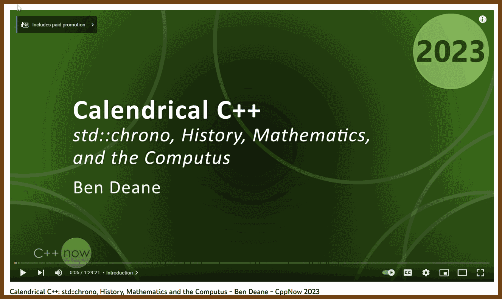
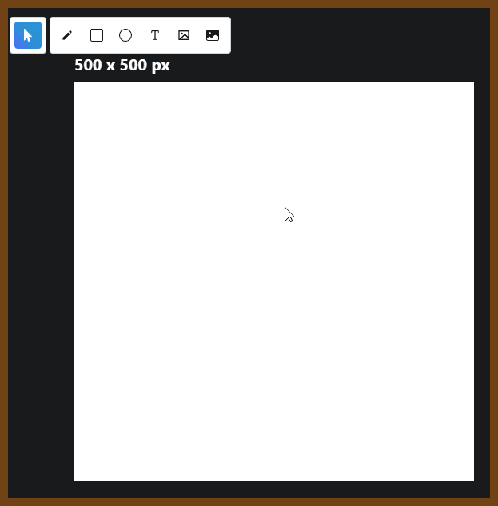
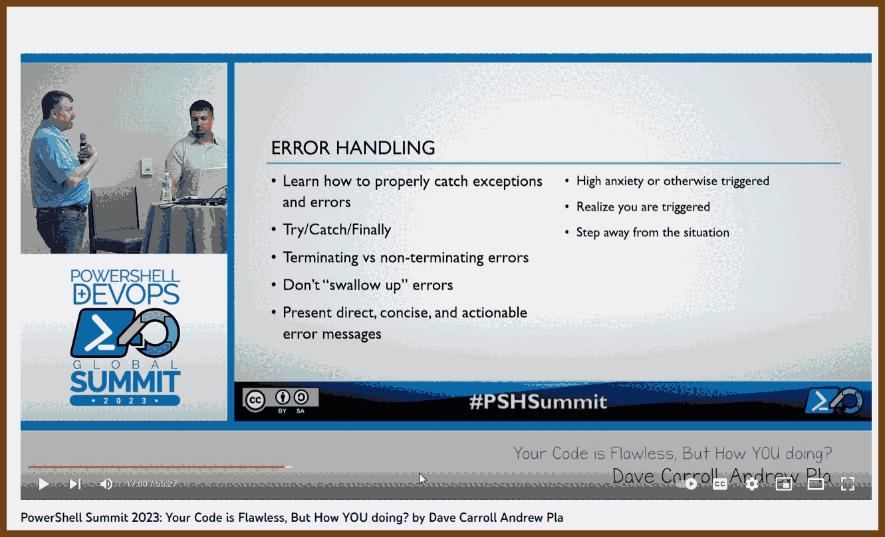

---
layout: post
title:  "Links from my inbox 2023-08-13"
date:   2023-08-13T22:57:00-07:00
categories: links
---


## Good Reads

2023-08-13 [Moving faster](https://www.scattered-thoughts.net/writing/moving-faster/)
> >  From 2023-08-13 [Programming Digest](https://programmingdigest.net/digests/1695)
>
> A list of tools that help to work faster. The caveat here is that you need to spend a lot of time learning and mastering the tools; only then will the tools help you. It is a gradual everyday process rather than one-day learning.  
>
> - **Keyboard Shortcuts**: Learning the keyboard shortcuts for your favorite IDE or editor, as well as for your operating system, can significantly speed up your workflow. These become automatic over time, allowing you to perform complex actions without thinking.
>
> - **Code Syntax**: Familiarity with the syntax of the language you're working in makes writing code a lot smoother. It becomes a low-level skill when you no longer have to think about the basic structure of loops, conditionals, etc., and can focus on the logic you're implementing.
>
> - **Testing Frameworks**: If you're using automated testing (and you should be), learning your testing framework inside and out enables you to quickly write and run tests without having to stop and think about how to do it. This enhances your ability to perform TDD (Test Driven Development) or other testing methodologies without a hitch.
>
> - **Debugging Techniques**: Understanding the ins and outs of your debugging tools and how to quickly diagnose common problems in your code can become a low-level skill. Knowing how to efficiently use breakpoints, inspect variables, and utilize other debugging features saves a lot of time.
>
> - **Git Commands**: If you're using Git or a similar version control system, becoming fluent in common commands enables you to manage your codebase efficiently. Committing, branching, merging, and resolving conflicts can become automatic processes.
>
> - **Touch Typing**: This is a fundamental skill for any professional who spends a significant amount of time on a computer. Being able to type without looking at the keys allows your thoughts to flow directly onto the screen, greatly enhancing your efficiency.
>
> - **Use of Snippets and Templates**: Many editors and IDEs allow you to define snippets or templates for code that you write frequently. This could be something as simple as the boilerplate for a class definition or as complex as a full file template. Being adept at using these can save a lot of time and effort.
>
> - **Build Tools and Automation**: Understanding how to automate repetitive tasks using build tools, scripts, and other automation techniques is a vital low-level skill. It allows you to focus on the higher-level aspects of your work, knowing that the lower-level tasks are handled efficiently.
>
> By turning these into automatic processes, you free up cognitive resources to focus on higher-level problem-solving and decision-making. It can be highly beneficial to invest the time and effort into mastering these low-level skills, as they'll pay off in the long run by enhancing your efficiency, reducing mistakes, and allowing you to produce better-quality code more quickly.
>
> A good practice for developing these skills is to identify areas where you feel you are slowing down or getting stuck frequently and deliberately practice those specific tasks until they become second nature. Whether it's through deliberate practice, reading documentation, or seeking tutorials and guidance, investing in these low-level skills will have long-lasting benefits in your coding career.

2023-08-08 [Articles For Beginning Cyclists](https://www.sheldonbrown.com/beginners.html) 🚴🚵🚵‍♀️🚵‍♂️

> Everything You Wanted To Know About Shifting Your Bicycle's Gears,
> But Were Afraid To Ask.
> This is an introduction to gear shifting, and the basics of how a derailer works. How, why and when to shift gears.
>
> 

2023-08-09 [Jared Ramsey - the last 1%](https://jaredramsey.com/blog/20230808.html)

> So what's in this last 1%? Here are some of the most frequently skipped things I've seen:
>
> - Internal (maintenance) documentation
> - External (how-to/FAQ) documentation
> - Performance metric instrumentation
> - Easy-to-decipher performance metric dashboard
> - Usage metric instrumentation
> - Easy-to-decipher usage metric dashboard
> - Error metric instrumentation
> - Easy-to-decipher error metric dashboard
> - Alerting
> - Automated testing

2023-08-08 [Some tactics for writing in public](https://jvns.ca/blog/2023/08/07/tactics-for-writing-in-public/)
> 1. **Talk About Facts**: By focusing on facts, especially those related to your expertise, you can elicit more productive, fact-based comments.
> 2. **Share Stories**: Sharing personal experiences or stories can encourage relatable and constructive discussions.
> 3. **Ask Technical Questions**: Asking specific questions invites people to contribute and answer, fostering a more engaging and informative conversation.
> 4. **Fix Mistakes**: Being willing to correct mistakes and update content shows humility and a dedication to accurate information.
> 5. **Ask for Examples/Experiences, Not Opinions**: By seeking experiences rather than mere opinions, you can drive more useful dialogue.
> 6. **Start with Context**: Providing context helps readers understand your perspective and relate to the content.
> 7. **Avoid Boring Conversations**: Steering clear of repetitive or uninteresting topics keeps the conversation fresh and engaging.
> 8. **Preempt Common Suggestions**: Acknowledging potential alternative solutions or explaining choices preemptively can prevent repetitive suggestions.
> 9. **Set Boundaries**: By drawing a line on what is acceptable behavior, you can create a more respectful and enjoyable environment for dialogue.
> 10. **Don't Argue**: Recognizing when to avoid fruitless arguments conserves energy and maintains focus on constructive conversations.
> 11. **Analyze Negative Comments**: Instead of dismissing negative feedback outright, seeking to understand and learn from it can turn it into a valuable resource.
> 12. **Embrace Your Feelings**: Lastly, acknowledging your emotional reactions to comments and learning how to manage them helps to maintain a balanced approach to online interactions.


## How the things work

2023-08-14 [Consistency Patterns - System Design](https://systemdesign.one/consistency-patterns/)

> Consistency Models in Distributed Systems
>
> The target audience for this article falls into the following roles:
>
> Tech workers
> Students
> Engineering managers
> The prerequisite to reading this article is fundamental knowledge of system design components. This article does not cover an in-depth guide on individual system design components.
>
> Disclaimer: The system design questions are subjective. This article is written based on the research I have done on the topic and might differ from real-world implementations. Feel free to share your feedback and ask questions in the comments. Some of the linked resources are affiliates. As an Amazon Associate, I earn from qualifying purchases.
>
> 
> 

## Fun

2023-08-09 [LCD, Please by dukope](https://dukope.itch.io/lcd-please) online game; 10 years Papers, please!

> 


## Books

2023-08-13 [Book Make JS Games](https://makejsgames.com/#articles)

> We walk you through the process of making games with the Kaboom.js library. By the end you will have:
>
> Significantly improved your game making skills.
>
> Some fun games to play and showcase.
>
> You can read each tutorial online or one-click download an ebook of the entire collection.

> 


## C++

2023-08-14 [Performance Ninja -- Data Packing Intro - YouTube](https://www.youtube.com/watch?v=-V-oIXrqA2s&list=PLRWO2AL1QAV6bJAU2kgB4xfodGID43Y5d&index=1)

>  2023-08-14 [GitHub - dendibakh/perf-ninja: This is an online course where you can learn and master the skill of low-level performance analysis and tuning.](https://github.com/dendibakh/perf-ninja)
>
> 2023-08-14 [GitHub - dendibakh/perf-book: The book "Performance Analysis and Tuning on Modern CPU"](https://github.com/dendibakh/perf-book)
>
> Performance Ninja Class
> This is an online course where you can learn to find and fix low-level performance issues, for example CPU cache misses and branch mispredictions. It's all about practice. So we offer you this course in a form of lab assignments and youtube videos. You will spend at least 90% of the time analyzing performance of the code and trying to improve it.

> 

### C++ Optimization

2023-08-06 [CPP How branches influence the performance of your code and what can you do about it? - Johnny's Software Lab](https://johnnysswlab.com/how-branches-influence-the-performance-of-your-code-and-what-can-you-do-about-it/)

> from 2023-08-06 [Programming Digest - A newsletter about programming and technology](https://programmingdigest.net/)

2023-08-07 [CPP Crash course introduction to parallelism: SIMD Parallelism - Johnny's Software Lab](https://johnnysswlab.com/crash-course-introduction-to-parallelism-simd-parallelism/)

2023-08-07 [CPP Make your programs run faster by better using the data cache - Johnny's Software Lab](https://johnnysswlab.com/make-your-programs-run-faster-by-better-using-the-data-cache/)

2023-08-07 [CPP Bit Twiddling Hacks](https://graphics.stanford.edu/~seander/bithacks.html#CopyIntegerSign)

```c
Conditionally set or clear bits without branching
bool f;         // conditional flag
unsigned int m; // the bit mask
unsigned int w; // the word to modify:  if (f) w |= m; else w &= ~m; 

w ^= (-f ^ w) & m;

// OR, for superscalar CPUs:
w = (w & ~m) | (-f & m);
```


### C++ Talks

2023-08-09 [Calendrical C++: std::chrono, History, Mathematics and the Computus - Ben Deane - CppNow 2023 - YouTube](https://www.youtube.com/watch?v=qD8HQl1fU5Y)

> This talk is about weird stuff in the history of calendars. Very fun! 
>
> 

> See also: 
>
> - 2023-08-09 [The Problem with Time & Timezones - Computerphile - YouTube](https://www.youtube.com/watch?v=-5wpm-gesOY)
>
> - 2023-08-09 [Internationalis(z)ing Code - Computerphile - YouTube](https://www.youtube.com/watch?v=0j74jcxSunY)


## C#
2023-08-09 [Frugal Cafe](https://frugalcafe.beehiiv.com/)
> Performance optimization in C#
>
> 

## Projects 

2023-08-08 [diogocapela/flatdraw: A simple canvas drawing web app with responsive UI. Made with TypeScript, React, and Next.js.](https://github.com/diogocapela/flatdraw)

> 2023-08-08 [Flatdraw — Simple Canvas Drawing App](https://flatdraw.com/)
>
> 

2023-08-06 [My Favorite Vim Oneliners For Text Manipulation | Muhammad](https://muhammadraza.me/2023/vim-onliners/)

> 


## Mental Health

2023-08-06 [PowerShell Summit 2023: Your Code is Flawless, But How YOU doing? by Dave Carroll Andrew Pla - YouTube](https://www.youtube.com/watch?v=U6bfOx3KUhU)

> Wow, very unexpected talk about more mental health... and Powershell... This is important. 
>
> 


## OAuth2 Corner

Philippe De Ryck:
- 2023-08-06 [AppSec is Too Hard!? - Philippe De Ryck - NDC Security 2022 - YouTube](https://www.youtube.com/watch?v=sUKpUPu151Q)
- 2023-08-06 [Forget about OAuth 2.0. Here comes OAuth 2.1 - Philippe De Ryck - NDC Oslo 2022 - YouTube](https://www.youtube.com/watch?v=Z9DJzVJD_vg)
- 2023-08-06 [draft-ietf-oauth-v2-1-08](https://datatracker.ietf.org/doc/html/draft-ietf-oauth-v2-1-08)
- 2023-08-06 [How Many Days Has It Been Since a JWT alg=none Vulnerability?](https://www.howmanydayssinceajwtalgnonevuln.com/)
- 2023-08-06 [Backend For Frontend Authentication Pattern with Auth0 and ASP.NET Core](https://auth0.com/blog/backend-for-frontend-pattern-with-auth0-and-dotnet/)
2023-08-06 [Backends for Frontends pattern - Azure Architecture Center | Microsoft Learn](https://learn.microsoft.com/en-us/azure/architecture/patterns/backends-for-frontends)
2023-08-06 [Sam Newman - Backends For Frontends](https://samnewman.io/patterns/architectural/bff/)
2023-08-06 [pragmaticwebsecurity.com Recorded sessions](https://pragmaticwebsecurity.com/recordings)
2023-08-06 [pragmaticwebsecurity.com Articles](https://pragmaticwebsecurity.com/articles)

In the context of authentication and authorization, these acronyms refer to specific standards and protocols. Here's an overview:

1. **JAR (JWT-Secured Authorization Request):**
   - **Description**: JAR is a method to secure OAuth 2.0 authorization requests using JWT (JSON Web Tokens). This allows the client to send requests in a way that ensures integrity and possibly confidentiality of the authorization request parameters.
   - **Use**: It's used to protect the content of the authorization request, thus increasing the security of the OAuth 2.0 flow.

2. **PAR (Pushed Authorization Request):**
   - **Description**: PAR enables the client to request authorization from the authorization server without exposing the parameters to the end-user's user-agent. It essentially allows the parameters to be sent directly to the authorization server, returning a URL that the user-agent can be redirected to.
   - **Use**: This enhances the security of the OAuth 2.0 authorization process by reducing exposure of sensitive parameters to possibly malicious user-agents or intermediaries.

3. **RAR (Rich Authorization Requests):**
   - **Description**: RAR is an extension to OAuth 2.0 that provides a way for clients to convey a fine-grained authorization request, using a structured format, both for scope and other authorization parameters.
   - **Use**: This allows for a more detailed and flexible authorization request, suitable for various complex use cases that require more than the basic scopes.

4. **FAPI2 (Financial-grade API Part 2 - Advanced Financial-grade API):**
   - **Description**: FAPI2 is a set of security profiles for OAuth 2.0 and OpenID Connect, designed for high-risk scenarios like financial services and payments. It specifies various security requirements and recommendations to ensure that the authorization process is highly secure.
   - **Use**: It's used to provide robust security measures specifically for financial APIs, where high levels of security are needed.

In summary, these terms are all related to enhancing and extending the security and functionality of the OAuth 2.0 protocol, particularly in scenarios that require high levels of security, such as in financial services.


2023-08-06 [OAuth and the long way to Proof of Possession - Dominick Baier & Steinar Noem - NDC Security 2023 - YouTube](https://www.youtube.com/watch?v=BkigVNNSurI&list=PL03Lrmd9CiGey4D3-wb_2SWTmLJtGHC_j)
- 2023-08-06 [DuendeSoftware/IdentityServer: The most flexible and standards-compliant OpenID Connect and OAuth 2.x framework for ASP.NET Core](https://github.com/DuendeSoftware/IdentityServer)
> The most flexible and standards-compliant OpenID Connect and OAuth 2.x framework for ASP.NET Core
2023-08-06 [Securing SPAs and Blazor Applications using the BFF (Backend for Frontend) Pattern - Dominick Baier - YouTube](https://www.youtube.com/watch?v=hWJuX-8Ur2k&list=PL03Lrmd9CiGey4D3-wb_2SWTmLJtGHC_j&index=2)

2023-08-06 [Securing SPAs and Blazor Applications using the BFF (Backend for Frontend) Pattern - Dominick Baier - YouTube](https://www.youtube.com/watch?v=hWJuX-8Ur2k&list=PL03Lrmd9CiGey4D3-wb_2SWTmLJtGHC_j&index=2)
>  2023-08-06 [YARP Documentation](https://microsoft.github.io/reverse-proxy/)
> We found a bunch of internal teams at Microsoft who were either building a reverse proxy for their service or had been asking about APIs and tech for building one, so we decided to get them all together to work on a common solution, this project. Each of these projects was doing something slightly off the beaten path which meant they were not well served by existing proxies, and customization of those proxies had a high cost and ongoing maintenance considerations.
