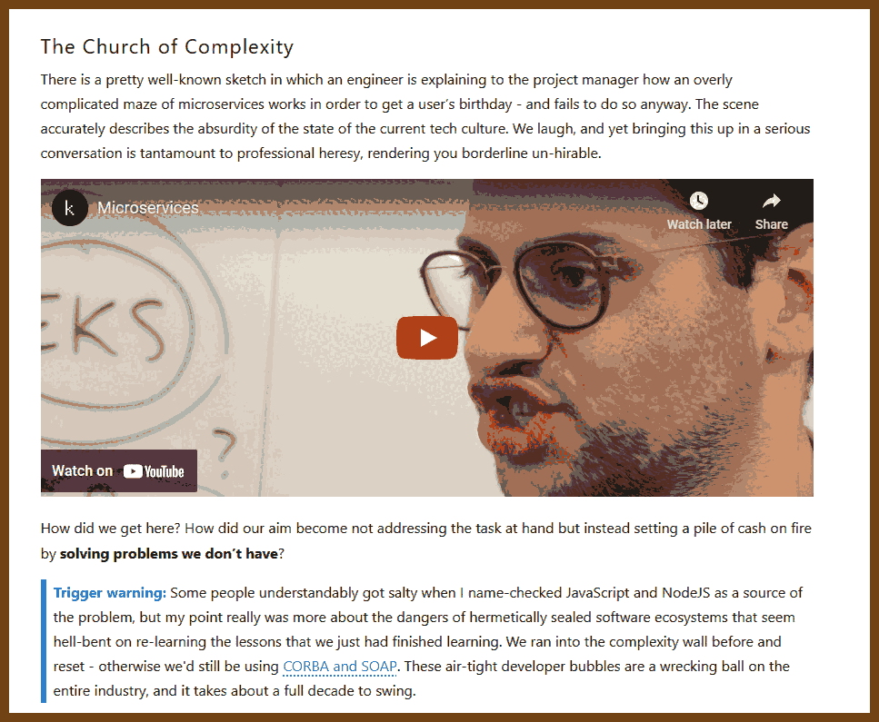
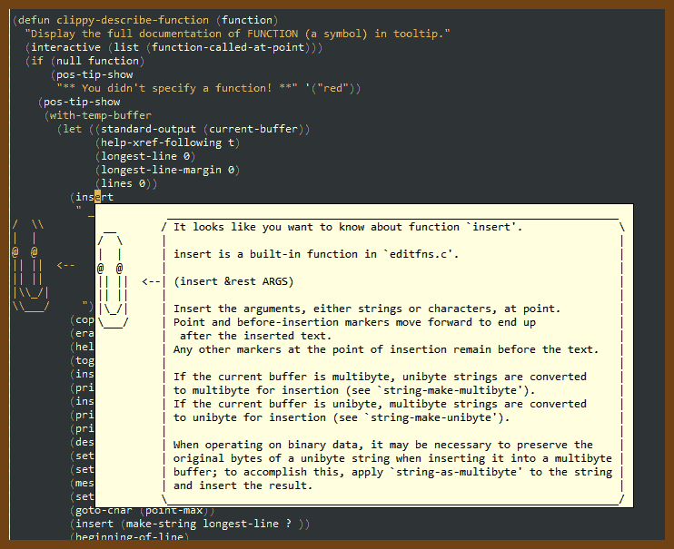
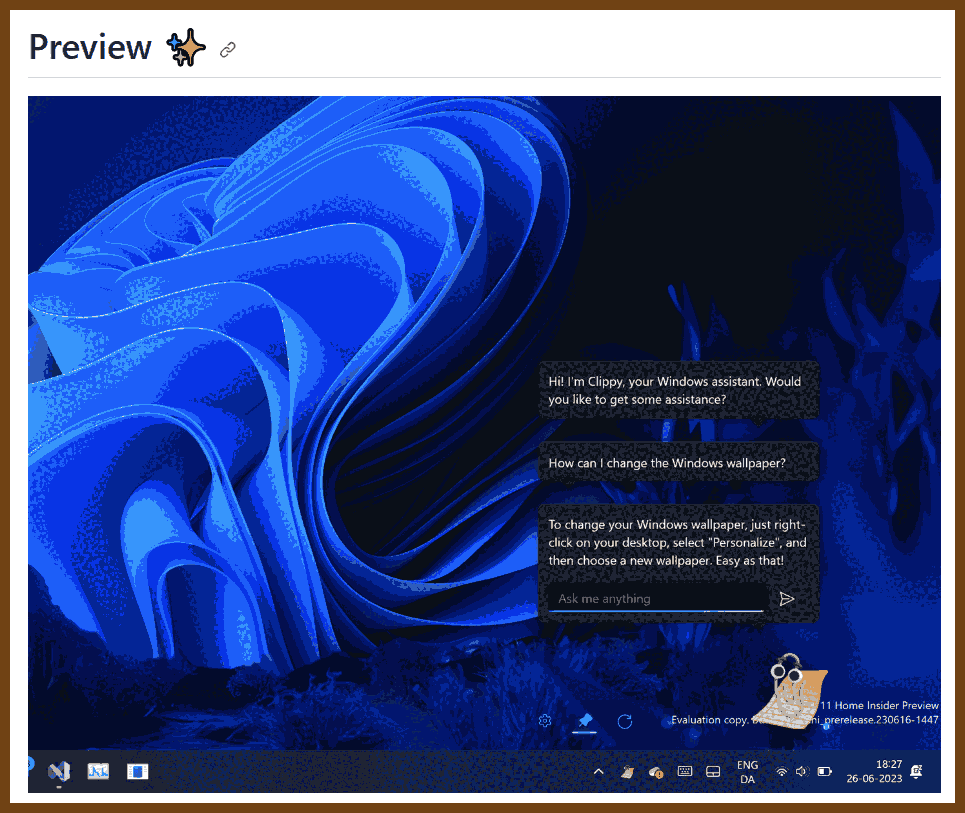
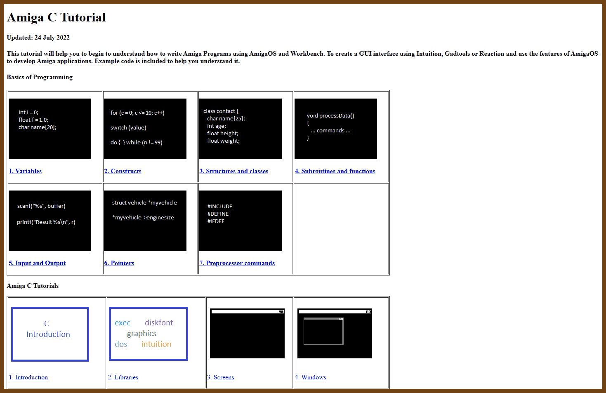
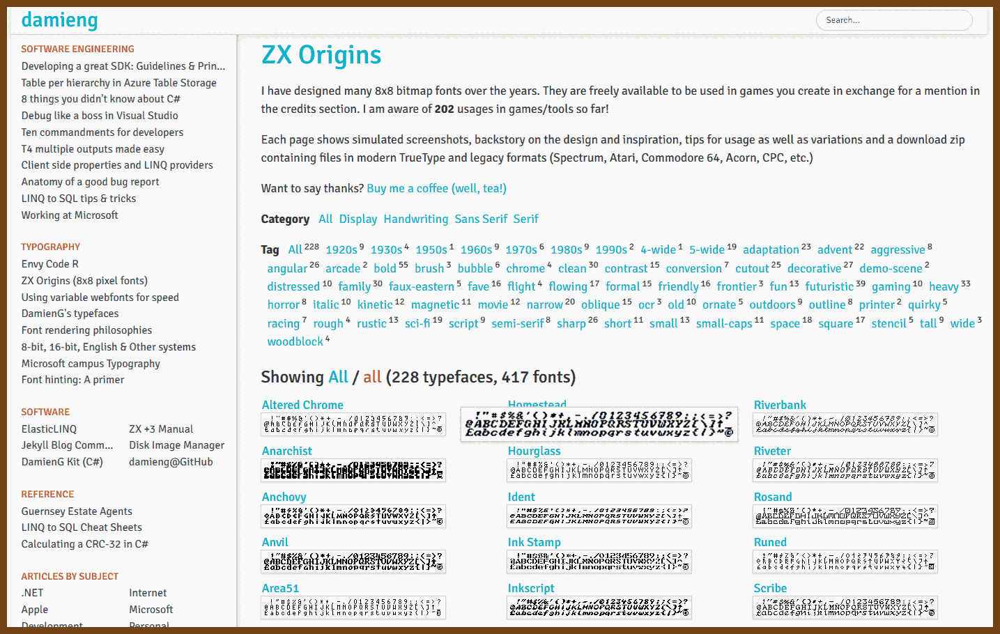
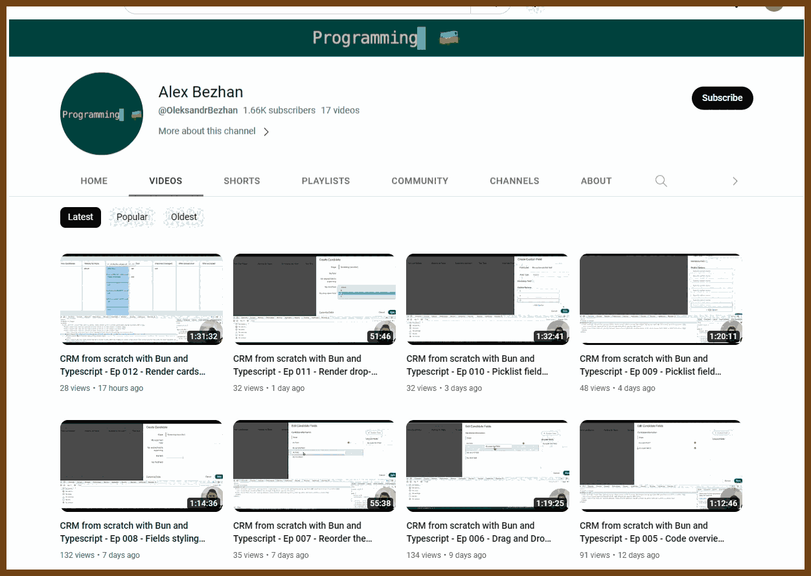
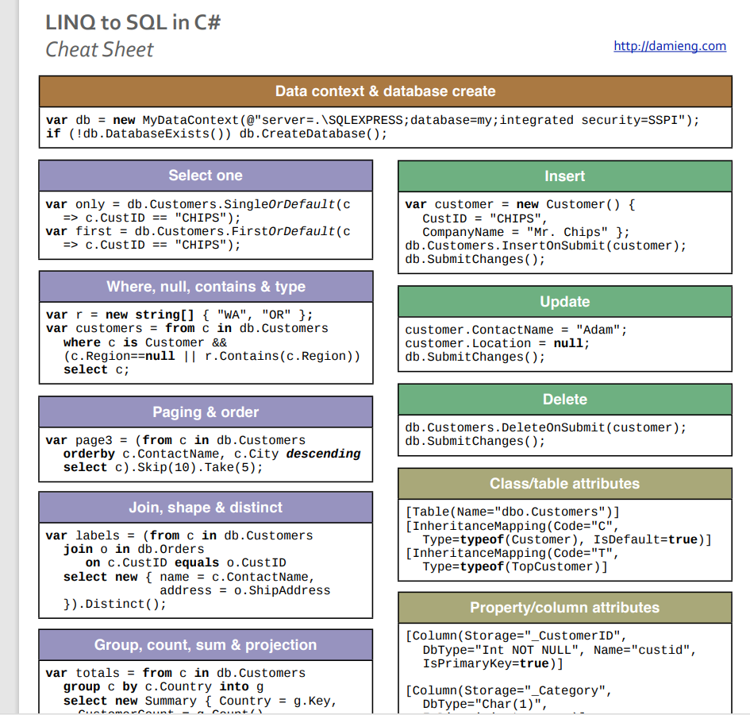
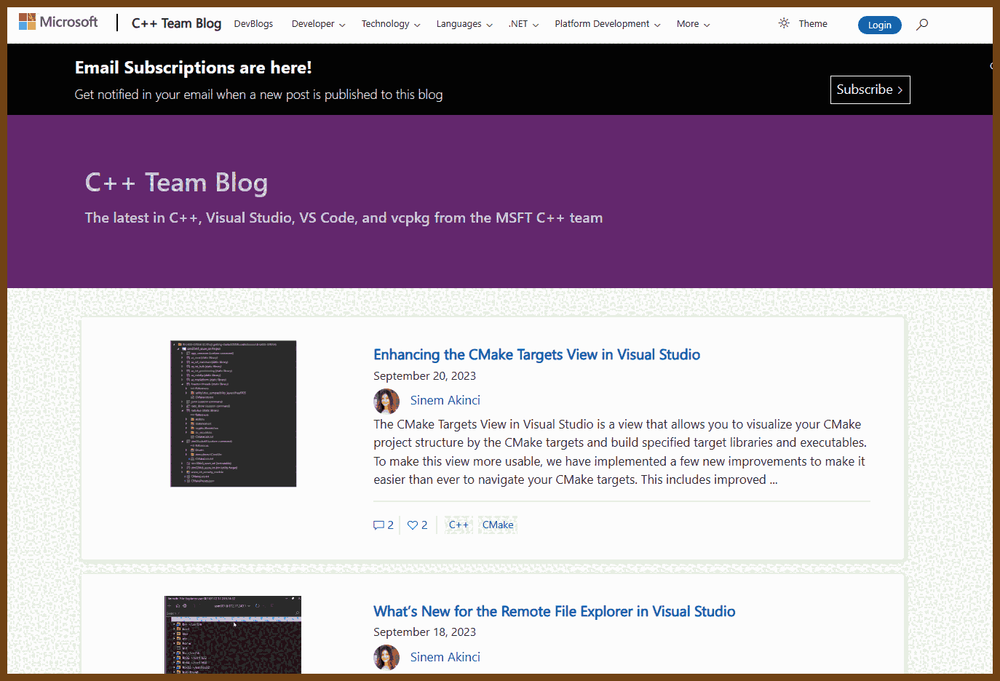

---
layout: post
title:  "Links from my inbox 2023-09-24"
date:   2023-09-24T23:08:00-07:00
categories: links
---


> Prompt: 
>
> Stylized Silhouette Story: Using shadow and light, the scene showcases the silhouette of the Hulk against a moonlit night, pushing a stroller with starry patterns. Baby Yoda, emitting a soft, magical glow, looks up with the cutest, roundest eyes, casting a warm light that draws enchanted creatures closer.

## Good reads

2023-09-24 [7 simple habits of the top 1% of engineers](https://engineercodex.substack.com/p/7-simple-habits-of-the-top-1-of-engineers/)
> Found in 2023-09-24 [Programming Digest](https://programmingdigest.net/digests/1715)
> 1. **Engineering over Coding**
>    - Writing code is a means to an end, a creative pursuit aimed at solving problems for humans.
>    - Outstanding engineers focus on products and solutions, maintaining a mindset oriented towards the end-users.
> 2. **Human-Centric Code**
>    - Code should be written for humans—team members and users—ensuring it's understandable and maintains value to all audiences.
>    - Engineers should be detached from the code, valuing change delivery over perfection and acknowledging the transient nature of code.
> 3. **Consistency and Simplicity**
>    - Maintaining consistent coding standards and style is crucial for scalability and readability.
>    - Writing simple, clean, organized, and logical code, even if complex to produce, ensures the code is aesthetically pleasing and understandable.
> 4. **Predictability and Testing**
>    - Code should not produce surprises and should be predictable through following principles and proper testing.
>    - Various tests from unit to end-to-end tests ensure functionality and provide confidence in code modifications.
> 5. **Communication**
>    - Collaboration and frequent communication are essential, allowing for design reviews, feedback, and iterations on initial designs to achieve better results.
> 6. **Balanced Pacing and Mindful Rule Adherence**
>    - Efficient engineering involves a balanced approach to coding speed, applying principles meticulously to avoid setbacks.
>    - Not all coding situations conform to established rules and principles; mindful deviations, properly documented, are necessary, maintaining code that is consistent, clean, understandable, testable, and valuable.
> 7. **Domain Expertise and Visibility**
>    - Exceptional engineers often have deep knowledge in at least one field and are known for their expertise and value within their teams, achieved through strategic self-marketing and involvement in high-impact projects.

2023-09-23 [It's okay to Make Something Nobody Wants](https://zhangluyao.com/blog/make-something-nobody-wants/)

> Products reflect the creator's emotions, often resonating more deeply with users when born from genuine interest. True innovation stems from authentic self-expression rather than merely anticipating user needs.

2023-09-01 🍒 [How to Speak Up About Ethical Issues at Work](https://hbr.org/2015/06/how-to-speak-up-about-ethical-issues-at-work)
> “A better place to start would be to ask questions instead of making assertions,” Detert explains. Use phrases like: **“Can you help me understand…”** or **“Can you help me see why you’re not worried…”** Detert points to two reasons why this approach works. First, he says, “there’s a possibility that the person isn’t aware they’re doing something wrong and your questioning might allow them to see the problem.” Second, asking questions is “a reasonably safe way to determine if the target is going to be open to discussing this issue or whether you need to pursue another avenue.”
>
> Principles to Remember
> Do:
> - Seek to understand your colleague’s perspective ­— why is she acting the way she is?
> - Consider the benefits of speaking up against the potential consequences
> - Rehearse what you’re going to say before calling out unethical behavior
>
> Don’t:
>
> - Rationalize the behavior just because you’re afraid of having a tough conversation
> - Go straight to your boss or HR unless the situation is severe ­— try talking directly to your colleague first
> - Make moral accusations ­— ask questions and treat the initial conversation as information-gathering

### ___ Funny good reads

2023-09-24 🥨 [How to do a full rewrite - by David Tate](https://badsoftwareadvice.substack.com/p/how-to-do-a-full-rewrite)
> When you work on a software system that:
> - has existed for a long time and is making money
> - is stable but has an architecture that you didn’t come up with
> - is using older technologies that aren’t as attractive
>
2023-09-24 [How to design a system that never works, that you can't be blamed for](https://badsoftwareadvice.substack.com/p/how-to-design-a-system-that-never)
2023-09-24 [How to write a post-mortem that always blames Terry](https://badsoftwareadvice.substack.com/p/how-to-write-a-post-mortem-that-always)
> - ***Why?** —* A manual script was run to remove one account, but all accounts were removed.
> - ***Why?** —* Because Terry had an error in his script, the WHERE clause was commented out.
> - ***Why?*** — While Terry was working on the script, someone interrupted him and started scolding him in front of everybody.
> - ***Why?** —* He messed up another data script earlier that week, and QA found the error and escalated it to a manager.
> - ***Why?*** — People make mistakes, and Terry puts up with being scolded.
> - ***Why?*** — He thinks he deserves it.
> - ***Why?** —* His relationship with his mother robbed him of belief in his own power and agency.
> - ***Why?** —* Children are very receptive to negative feedback between ages 5 to 13, and parents, through exhaustion, impatience, or anger, can accidentally cause a child to think that something is fundamentally wrong with themselves.
> - ***Why?*** — When we are small, it is much easier to think of ourselves as weak than that those who care for and protect us are weak.
> - ***Root Cause:*** Terry has not dealt with his emotional trauma and doesn’t really know who he is.

2023-09-25 [Death by a thousand microservices](https://renegadeotter.com/2023/09/10/death-by-a-thousand-microservices.html)

> 

> - **Complexity kills**: software industry is suffering from a culture of over-engineering and unnecessary complexity, especially with the widespread adoption of microservices and distributed systems. It claims that most companies do not need such architectures and would benefit from simpler, monolithic solutions that are easier to develop, test, and maintain.
> - **Context matters**: blindly following the practices of large tech companies like Google or Amazon, which have very different problems and resources than most startups. It suggests that developers should focus on solving the actual problem at hand, rather than imitating what they think is “web scale” or “cutting edge”.
> - **Trade-offs exist**: there are advantages and disadvantages to any design choice, and that there is no silver bullet for software engineering. It urges developers to be aware of the costs and benefits of microservices, such as increased boilerplate,

## Good views!

2023-09-24 [Full Resolution Photo Archive](http://aurelm.com/portfolio/aurel-manea-photo-archive/) - Aurel Manea

> I have decided to make my photos available in full resolution for free. You can download the archive from here
>
> 

> Beautiful even in 16 colors!  (cannot do full color, the style...)
>
> Okay, just this one:
>
> 

2023-09-15 [Akiyoshi's illusion pages](https://www.ritsumei.ac.jp/~akitaoka/index-e.html)

> 


## Fun

2023-09-08 [Sound Effects Soundboard - Instant Sound Buttons | Myinstants](https://www.myinstants.com/en/categories/sound%20effects/)

> Fart sounds!
>
> 

## Clippy research

2023-09-02 📢 [Fuco1/clippy.el: Show tooltip with function documentation at point](https://github.com/Fuco1/clippy.el)

> 

2023-09-02 [EsotericSoftware/clippy: Multifunctional Windows productivity tool for programmers and other power users](https://github.com/EsotericSoftware/clippy)

> Just the name!
> Clippy is a small, multifunctional Windows productivity tool for programmers and other power users. Clippy runs in the background and provides a powerful clipboard history, easy uploading of screenshots, files, and text, and optional features to improve your health when using a computer for long periods of time.

2023-09-02 [walaura/vs-code-clippy: It's clippy! on VS Code!](https://github.com/walaura/vs-code-clippy)

> 

2023-09-02 [tanathos/ClippyVS: The legend is back, in Visual Studio!](https://github.com/tanathos/ClippyVS)

2023-09-02 [FireCubeStudios/Clippy: Bring back Clippy on Windows 10/11!](https://github.com/FireCubeStudios/Clippy)

> > Clippy by FireCube (Not by Microsoft) brings back the infamous Clippit into your desktop powered by the OpenAI GPT 3.5 model (OpenAI key required as of this version).
> >
> > Clippy can be pinned to the screen for quick access to chat or just be left for nostalgia.
>
> 

2023-09-02 [citizenmatt/resharper-clippy: Clippy. For ReSharper](https://github.com/citizenmatt/resharper-clippy)

2023-09-02 [Cosmo/Clippy: 📎💬🎉 Clippy from Microsoft Office is back and runs on macOS! Written in Swift.](https://github.com/Cosmo/Clippy)


## Software Design

2023-09-20 🐇 [RabbitMQ vs. Kafka - An Architect's Dilemma (Part 1) - Eran Stiller](https://eranstiller.com/rabbitmq-vs-kafka-an-architects-dilemma-part-1)

> 


## Chrome Extensions

2023-09-22 [guocaoyi/create-chrome-ext](https://github.com/guocaoyi/create-chrome-ext)

> 🍺 Scaffolding your Chrome extension! Boilerplates: react \ vue \ svelte \ solid \ preact \ alpine \ lit \ stencil \ inferno \ vanilla


## Apps

2023-09-21 [Organic Maps: An Open-Source Maps App That Doesn't Suck](https://hardfault.life/p/organic-maps-review)

> Can't tell much, still trying

- 2023-09-21 [Organic Maps: Offline Hike, Bike, Trails and Navigation](https://organicmaps.app/)


## Projects

2023-09-13 [Interactive map of Linux kernel](https://makelinux.github.io/kernel/map/)

> 

2023-09-09 [LogoScale - A Method for Vectorizing Small, Crappy Logos](https://msprout.notion.site/LogoScale-A-Method-for-Vectorizing-Small-Crappy-Logos-dc0035b7473c44f8b94ffc4026d286c0)

> 

> - [Cupscale](https://github.com/n00mkrad/cupscale), Windows

> - [ESRGAN’s CLI interface](https://github.com/xinntao/ESRGAN), Linux

> - [Upscaler](https://flathub.org/apps/details/io.gitlab.theevilskeleton.Upscaler), Linux

2023-09-02 [Show HN: XRss: An RSS Reader and web stack demo powered by Htmx](https://xrss.infogulch.com/)

> 

2023-09-02 [Animated Knots by Grog | Learn how to tie knots with step-by-step animation](https://www.animatedknots.com/)

> 
>
> 


## Retro

2023-09-10 [Amiga C Tutorial upd. 2022](http://www.pjhutchison.org/tutorial/amiga_c.html)

> 

2023-09-07 [ZX Origins » DamienG](https://damieng.com/typography/zx-origins/)

> ZX Spectrum fonts
>
> 

2023-08-22 [The History of Windows 2.0 - by Bradford Morgan White](https://www.abortretry.fail/p/the-history-of-windows-20)

> 


## The Era of AI

2023-09-25 [A Hackers' Guide to Language Models - YouTube](https://www.youtube.com/watch?v=jkrNMKz9pWU)

> Explains how LLM work

- 2023-09-25 [Practical Deep Learning for Coders - Practical Deep Learning](https://course.fast.ai/)

  > 

2023-09-01 [Teaching with AI](https://openai.com/blog/teaching-with-ai)

> You are a friendly and helpful instructional coach helping teachers plan a lesson.
>
> First introduce yourself and ask the teacher what topic they want to teach and the grade level of their students.
>
> Wait for the teacher to respond. Do not move on until the teacher responds.

2023-08-27 [Normcore LLM Reads](https://gist.github.com/veekaybee/be375ab33085102f9027853128dc5f0e)

> Anti-hype LLM reading list
> Goals: Add links that are reasonable and good explanations of how stuff works. No hype and no vendor content if possible. Practical first-hand accounts and experience preferred (super rare at this point).

> - [Generative Interfaces Beyond Chat (YouTube)](https://www.youtube.com/watch?v=rd-J3hmycQs)

> - [Why Chatbots are not the Future](https://wattenberger.com/thoughts/boo-chatbots)
>
> 


## Typescript

2023-09-17 [CRM from scratch with Bun and Typescript - Ep 001 - Columns Layout - YouTube](https://www.youtube.com/watch?v=l4QjeBEkNLc)

> 

> - 2023-09-17 [CRM from scratch with Bun and Typescript - Ep 002 - Create entity modal - YouTube](https://www.youtube.com/watch?v=JdXyF97ke60)
> - 2023-09-17 [CRM from scratch with Bun and Typescript - Ep 003 - Customize fields modal - YouTube](https://www.youtube.com/watch?v=TLigusGMa7Y)
> - 2023-09-17 [CRM from scratch with Bun and Typescript - Ep 004 - Create custom field modal - YouTube](https://www.youtube.com/watch?v=pVZQYeapt28)
> - 2023-09-17 [CRM from scratch with Bun and Typescript - Ep 005 - Code overview + adding/deleting custom fields. - YouTube](https://www.youtube.com/watch?v=aUZK8ZYfjr0)
> - 2023-09-17 [CRM from scratch with Bun and Typescript - Ep 006 - Drag and Drop the fields. - YouTube](https://www.youtube.com/watch?v=3YNSDFBYnEs)
> - 2023-09-17 [CRM from scratch with Bun and Typescript - Ep 007 - Reorder the fields - YouTube](https://www.youtube.com/watch?v=liNYU41wRsg)
> - 2023-09-17 [CRM from scratch with Bun and Typescript - Ep 008 - Fields styling. Save/cancel the fields. - YouTube](https://www.youtube.com/watch?v=THyT8OHiUcI)
> - ... to be continued...


## C#

2023-09-07 💡 [LINQ to SQL cheat sheet » DamienG](https://damieng.com/blog/2009/08/12/linq-to-sql-cheat-sheet/)

> 2009 
>
> https://download.damieng.com/dotnet/LINQToSQLCheatSheet.pdf
>
> Old, but not obsolete, nicely made cheat sheet
>
> 


## C and C++ and Performance

2023-09-15 [hanickadot/compile-time-regular-expressions: Compile Time Regular Expression in C++](https://github.com/hanickadot/compile-time-regular-expressions)

> Fast compile-time regular expressions with support for matching/searching/capturing during compile-time or runtime.
>
> You can use the single header version from directory `single-header`. This header can be regenerated with `make single-header`. If you are using cmake, you can add this directory as subdirectory and link to target `ctre`.
>
```
ctre::match<"REGEX">(subject); // C++20
"REGEX"_ctre.match(subject); // C++17 + N3599 extension
```
>
> - Matching
> - Searching (`search` or `starts_with`)
> - Capturing content (named captures are supported too)
> - Back-Reference (\g{N} syntax, and \1...\9 syntax too)
> - Multiline support (with `multi_`) functions
> - Unicode properties and UTF-8 support

2023-09-25 [Parsing integers quickly with AVX-512 – Daniel Lemire's blog](https://lemire.me/blog/2023/09/22/parsing-integers-quickly-with-avx-512/)

> If I give a programmer a string such as `"9223372036854775808"` and I ask them to convert it to an integer, they might do the following in C++:

```cpp
std::string s = ....
uint64_t val;
auto [ptr, ec] =
std::from_chars(s.data(), s.data() + s.size(), val);
if (ec != std::errc()) {} // I have an error !
// val holds the value
```

>  It is very fast: you can parse a sequence of random 32-bit integers at about 40 cycles per integer, using about 128 instructions.

>  Can you do better?

```cpp
auto DIGIT_VALUE_BASE10_8BIT =
_mm256_set_epi8(1, 10, 1, 10, 1, 10, 1, 10,
1, 10, 1, 10, 1, 10, 1, 10,
1, 10, 1, 10, 1, 10, 1, 10,
1, 10, 1, 10, 1, 10, 1, 10);
auto DIGIT_VALUE_BASE10E2_8BIT = _mm_set_epi8(
1, 100, 1, 100, 1, 100, 1, 100, 1, 100, 1, 100, 1, 100, 1, 100);
auto DIGIT_VALUE_BASE10E4_16BIT =
_mm_set_epi16(1, 10000, 1, 10000, 1, 10000, 1, 10000);
auto base10e2_16bit =
_mm256_maddubs_epi16(base10_8bit, DIGIT_VALUE_BASE10_8BIT);
auto base10e2_8bit = _mm256_cvtepi16_epi8(base10e2_16bit);
auto base10e4_16bit =
_mm_maddubs_epi16(base10e2_8bit, DIGIT_VALUE_BASE10E2_8BIT);
auto base10e8_32bit =
_mm_madd_epi16(base10e4_16bit, DIGIT_VALUE_BASE10E4_16BIT);
```

| AVX-512         | 1.8 GB/s | 57 instructions/number  | 17 cycles/number |
| --------------- | -------- | ----------------------- | ---------------- |
| std::from_chars | 0.8 GB/s | 128 instructions/number | 39 cycles/number |

2023-09-16 [Formatting Text in C++: The Old and The New Ways](https://mariusbancila.ro/blog/2023/09/12/formatting-text-in-c-the-old-and-the-new-ways/)

> 

2023-09-13 [Integrating C++ header units into Office using MSVC (2/n) - C++ Team Blog](https://devblogs.microsoft.com/cppblog/integrating-c-header-units-into-office-using-msvc-2-n/)

> The blog post describes the progress and challenges of integrating header units, a C++23 feature, into the Office codebase. Header units are a standardized replacement for precompiled headers (PCH) that can improve build performance and modularity.
>
> The coolest thing is **Microsoft has C++ blog!** Wow!
>
> **2023-09-13 📶 [C++ Team Blog](https://devblogs.microsoft.com/cppblog/)**
>
> 


## OAuth2 - Playground research

2023-05-18 [OAuth 2.0 basics - Playground | MSS Architecture](https://equinor.github.io/mss-architecture/oauth2/openid/2019/08/22/oauth2-basics-playground.html)

> 

2023-05-18 [nbarbettini/oidc-debugger: OAuth 2.0 and OpenID Connect debugging tool](https://github.com/nbarbettini/oidc-debugger)


## Videos

2023-09-21 [TypeScript Origins: The Documentary - YouTube](https://www.youtube.com/watch?v=U6s2pdxebSo)

> You know you’ve made it when you get your own documentary! This has *just* dropped but is well produced, packed with stories from TypeScript’s co-creators, users, and other folks at Microsoft, and kept me entertained. It goes particularly deep into the motivations and process behind TypeScript's creation, including why Microsoft felt it was worth pursuing at all.
> OFFERZEN ORIGINS
>
> from 📧  [JavaScript Weekly Issue 655: September 21, 2023](https://javascriptweekly.com/issues/655)
> 

2023-09-25 [Don’t Build a Distributed Monolith - Jonathan "J." Tower - NDC London 2023 - YouTube](https://www.youtube.com/watch?v=p2GlRToY5HI)

> Good talk, monoliths are also scalable, also:
>
> > Smallest possible microservices without chatty communication between services
>
> 
