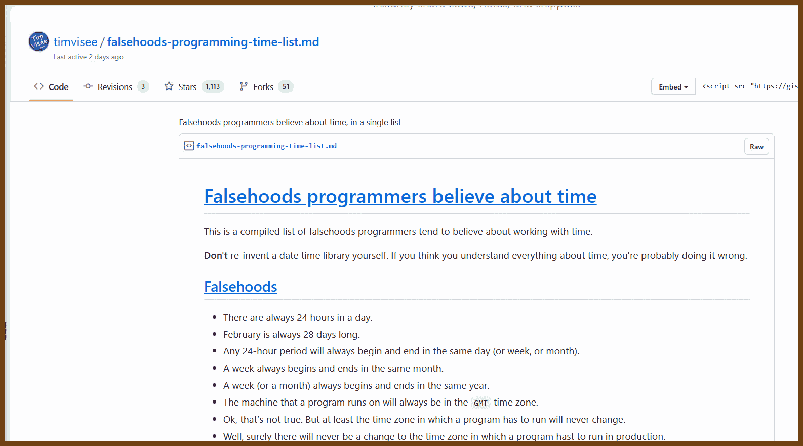
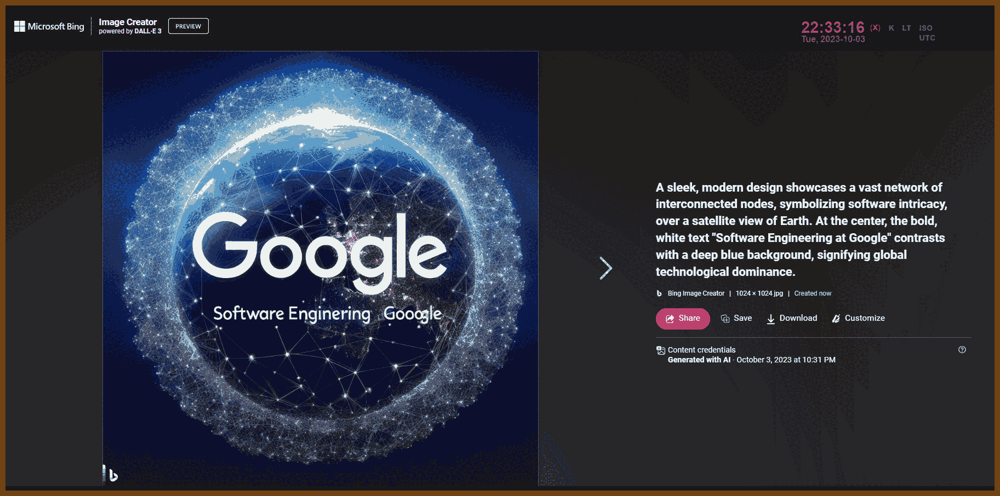
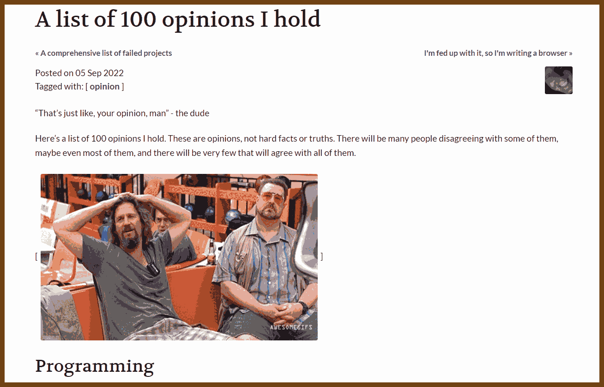
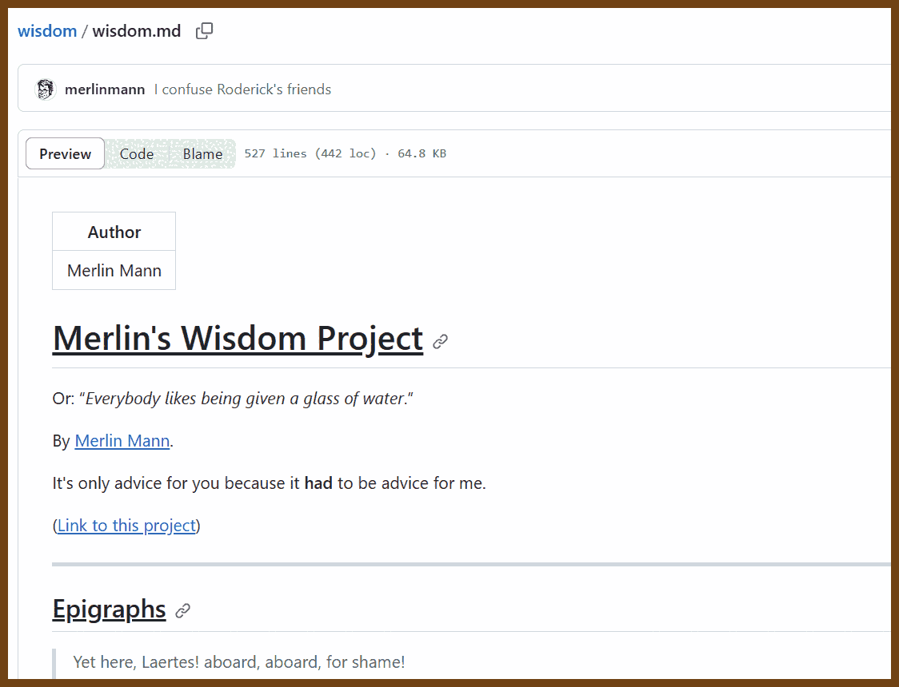
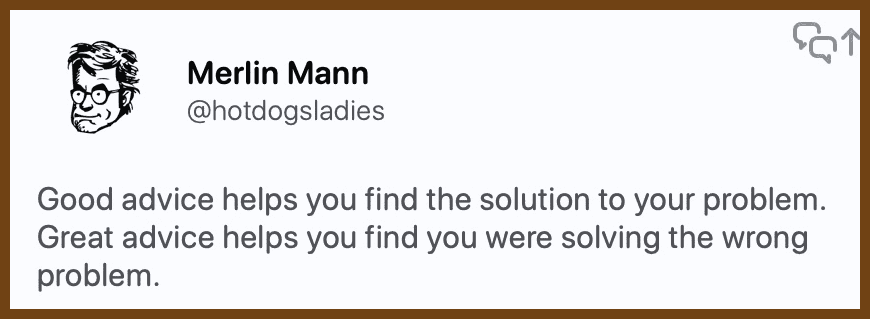
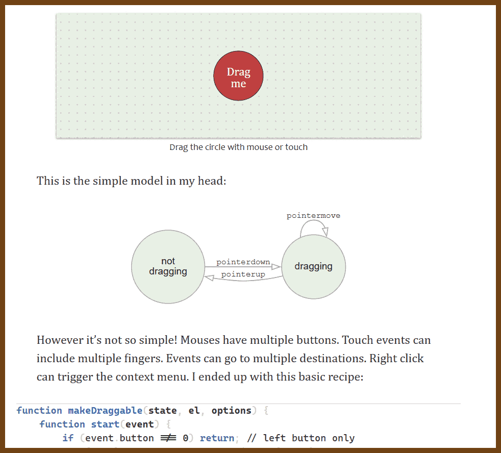
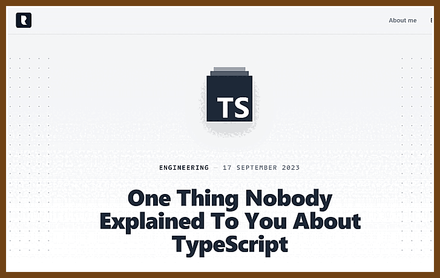
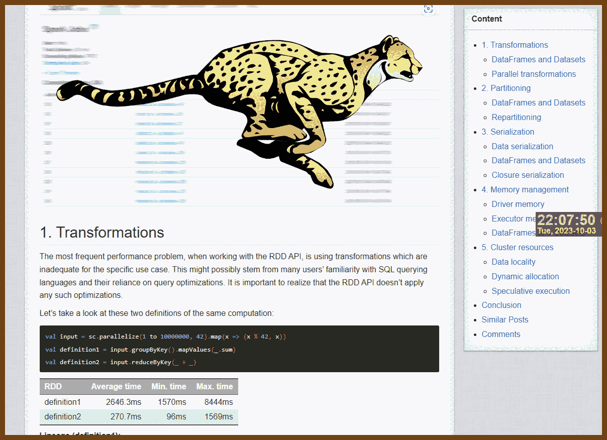
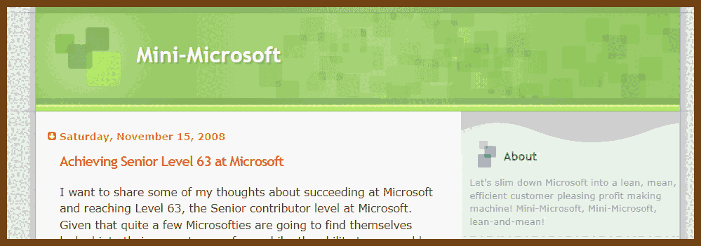

---
layout: post
title:  "Links from my inbox 2023-10-03"
date:   2023-10-03T16:53:00-07:00
categories: links
---


> A room labeled "Bing HQ." Developers huddled around a computer, looking confused. The screen shows jumbled text results from Bing Image Create. One developer says, "It's supposed to generate images, not this gibberish!"

2023-10-04 [A room labeled "Bing HQ." Developers huddled around a computer, looking confused. The screen shows jumbled text results from Bing Image Create. One developer says, "It's supposed to generate images, not this gibberish!" - Image Creator from Microsoft Bing](https://www.bing.com/images/create/a-room-labeled-22bing-hq22-developers-huddled-aroun/651cfa24297f40c499e1cdab675c60e9?FORM=GENCRE)


## Good Reads

2023-10-04 [The Workflow Pattern](https://blog.bittacklr.be/the-workflow-pattern.html)

> 
>
> found in  [Programming Digest](https://programmingdigest.net/digests/1717)

2023-09-21 [Falsehoods programmers believe about time, in a single list](https://gist.github.com/timvisee/fcda9bbdff88d45cc9061606b4b923ca#falsehoods-programmers-believe-about-time)

> - There are always 24 hours in a day.
> - February is always 28 days long.
> - Any 24-hour period will always begin and end in the same day (or week, or month).
> - A week always begins and ends in the same month.
> - A week (or a month) always begins and ends in the same year.
> - The machine that a program runs on will always be in the `GMT` time zone.
> - Ok, that’s not true. But at least the time zone in which a program has to run will never change.
> - Well, surely there will never be a change to the time zone in which a program hast to run in production.
> - The system clock will always be set to the correct local time.
> - The system clock will always be set to a time that is not wildly different from the correct local time.
>
> 

2023-08-24 [How to sabotage your salary negotiation efforts before you even start](https://interviewing.io/blog/sabotage-salary-negotiation-before-even-start)

> Exactly what to say
> For questions about comp expectations at the beginning of the process:
> At this point, I don’t feel equipped to throw out a number because I’d like to find out more about the opportunity first – right now, I simply don’t have the data to be able to say something concrete. If you end up making me an offer, I would be more than happy to iterate on it if needed and figure out something that works. I promise not to accept other offers until I have a chance to discuss them with you.
>
> For questions about comp expectations at the end of the process:
> It sounds like there’s an offer coming, and I’m really excited about it. I’m not sure exactly what number I’m looking for, but if you’d be able to share what an offer package might look like, then I will gladly iterate on it with you if needed and figure out something that works. I promise not to accept other offers until I have a chance to discuss them with you.
>
> For questions about where else you’re interviewing at the beginning of the process:
> I’m currently speaking with a few other companies and am at various stages with them. I’ll let you know if I get to the point where I have an exploding offer, and I promise not to accept other offers until I have a chance to discuss them with you.
>
> For questions about where else you’re interviewing at the end of the process:
> I’m wrapping things up with a few companies and in process with a few more. I promise to keep you in the loop, and I promise not to accept other offers until I have a chance to discuss them with you.

2023-08-15 Book 🚩 [Software Engineering at Google](https://abseil.io/resources/swe-book/html/toc.html)

>We’ve found that expertise and shared communication forums offer great value as an organization scales.  As engineers discuss and answer questions in shared forums, knowledge tends to spread. New experts grow. If you have a hundred engineers writing Java, a single friendly and helpful Java expert willing to answer questions will soon produce a hundred engineers writing better Java code. Knowledge is viral, experts are carriers, and there’s a lot to be said for the value of clearing away the common stumbling blocks for your engineers.
>
>

> **Bing!!!** 
> **A sleek, modern design showcases a vast network of interconnected nodes, symbolizing software intricacy, over a satellite view of Earth. At the center, the bold, white text "Software Engineering at Google" contrasts with a deep blue background, signifying global technological dominance.**
>
> 2023-10-04 [A sleek, modern design showcases a vast network of interconnected nodes, symbolizing software intricacy, over a satellite view of Earth. At the center, the bold, white text "Software Engineering at Google" contrasts with a deep blue background, signifying global technological dominance. - Image Creator from Microsoft Bing](https://www.bing.com/images/create/a-sleek2c-modern-design-showcases-a-vast-network-of/651cf8c4a59b407eb0396da4744eec5b?FORM=GENCRE)
>
> 

> Layered over an abstract representation of code, glowing in Google's iconic colors, sits a polished chrome 'G'. Above it, the title "Software Engineering" is written in modern font, with "at Google" just below, emanating the innovative essence of the tech giant.
>
> 2023-10-04 [Layered over an abstract representation of code, glowing in Google's iconic colors, sits a polished chrome 'G'. Above it, the title "Software Engineering" is written in modern font, with "at Google" just below, emanating the innovative essence of the tech giant. - Image Creator from Microsoft Bing](https://www.bing.com/images/create/layered-over-an-abstract-representation-of-code2c-g/651cf983fa534f03b2e0b933ba2b2a97?FORM=GENCRE)
>
> 


## More Wisdom

2023-10-04 [A list of 100 opinions I hold](https://adayinthelifeof.nl/2022/09/05/100-opinions.html)

> 
>
> - 09 - Log all the things. If you didn’t log it, it didn’t happen.
> - 10 - Don’t assume users are dumb. They will find things you never knew was possible.
> - 11 - Spend most of the time writing the failure paths, not the happy path.
> - 12 - Don’t slap on an index and call it a day. Check your queries, rewrite them and/or create indices accordingly. And hire a DBA.
> - 13 - Javascript is an unreadble async mess.
> - 14 - Scrum is bad
> - 15 - Kanban is better
> - 16 - Just because you say you do scrum, doesn’t mean you do scrum.
> - 17 - you can be “agile” without daily standups, sprints, retrospectives.

2023-09-27 [wisdom/wisdom.md at master · merlinmann/wisdom](https://github.com/merlinmann/wisdom/blob/master/wisdom.md)

> 

> 

> - Sometimes, an email is just a way to say, “I love you.”
> - People think about you much less than you either hope or fear.
> - It’s often easier not to be terrible.
>
> - Buy the nicest screwdrivers you can afford.
> - Every few months, take at least one panorama photo of your kid's room. At least annually, secretly record your kid talking for at least ten minutes. I promise you'll treasure both, and then you will curse yourself for not having done each way more often.
> - Most well-written characters have something they want—or something they *think* they want. The more fascinating characters also have something they don’t want you to know. The best ones also have something they’re not pulling off nearly as well as they think.
> - Related: these are each also true for real people.
>
> 

2023-09-14 [Work Chronicles - Webcomics](https://workchronicles.com/)

> 

> View All [Comics Archives - Work Chronicles](https://workchronicles.com/comics/)


## Good Talks!

2023-10-03 ["Comedy Writing With Small Generative Models" by Jamie Brew - YouTube](https://www.youtube.com/watch?v=M2o4f_2L0No)

2023-10-02 ["Making Hard Things Easy" by Julia Evans (Strange Loop 2023) - YouTube](https://www.youtube.com/watch?v=30YWsGDr8mA)

> [koalaman/shellcheck: ShellCheck, a static analysis tool for shell scripts](https://github.com/koalaman/shellcheck)
> [RFC 9110: HTTP Semantics](https://www.rfc-editor.org/rfc/rfc9110.html)
> [New tool: Mess with DNS!](https://jvns.ca/blog/2021/12/15/mess-with-dns/)
> [mess with dns](https://messwithdns.net/)
> [Float Exposed](https://float.exposed/0x44bf9400)

2023-09-26 [World of Warcraft's Network Serialization and Routing - YouTube](https://www.youtube.com/watch?v=3eQW6SueWsQ)

> I am a Principal Software Engineer, if you are misbehaving, I bring you to my office.
> JAM -- messaging serialization protocol

2023-08-22 [Mark Rickert –Outrage-driven development to take your React Native app up a level (Chain React 2023) - YouTube](https://www.youtube.com/watch?v=-92NMHDH7yU)

> SOME FINAL TIPS AND TRICKS FOR BEING AN ODD DEVELOPER:
>
> 1. Practice using empathy with your users, clients, and team members.
> 2. Consider user security, privacy, and accessibility as core design principles throughout the development process.
> 3. Try to foster a culture of learning and experimentation - remember everyone is at a different point in their learning journey.
> 4. Treat customers, clients, and coworkers how you would want to be treated.
> 5. Measure the impact of your work


## Projects

2023-10-03 [orhun/daktilo: Turn your keyboard into a typewriter! 📇](https://github.com/orhun/daktilo)

> On one side, this is a project with a useless (but funny) goal. On the other side -- this is an awesome sample of cross-platform system app. 
>
> **daktilo** ("typewriter" in Turkish, pronounced *"duck-til-oh"*, derived from the Ancient Greek word [δάκτυλος](https://lsj.gr/wiki/δάκτυλος) for "finger") is a small command-line program that plays typewriter sounds every time you press a key. It also offers the flexibility to customize keypress sounds to your liking. You can use the built-in sound presets to create an enjoyable typing experience, whether you're crafting emails or up to some prank on your boss.
>
> 

2023-10-03 [google/graph-mining](https://github.com/google/graph-mining)

> This project includes some of Google's Graph Mining tools, namely in-memory clustering. Our tools can be used for solving data mining and machine learning problems that either inherently have a graph structure or can be formalized as graph problems.


## Web, JavaScript

2023-10-04 [Draggable objects](https://www.redblobgames.com/making-of/draggable/)

> 


## C and C++

2023-09-30 [philip82148/cpp-dump: An all-round dump function library for C++ that supports even user-defined classes.](https://github.com/philip82148/cpp-dump)

> 


## Typescript

2023-09-30 [One Thing Nobody Explained To You About TypeScript - Redd](https://redd.one/blog/one-thing-nobody-explained-to-you-about-typescript)

> 
>
> Delving deeper into configurations, the article illuminates the necessity of nested configurations for different project layers, advocating for as many TypeScript files as there are layers. This granularity is essential to avoid "unleashing hundreds of ghostly types" and ensuring precise type-checking. As development tools evolve, and while frameworks might abstract complexities, it's emphasized that "TypeScript is still your tool," urging developers to grasp its depths and nuances.


## Rust

2023-10-02 [Writing a Debugger From Scratch - DbgRs Part 1 - Attaching to a Process // TimDbg](https://www.timdbg.com/posts/writing-a-debugger-from-scratch-part-1/)

> 

2023-10-02 [Writing a Debugger From Scratch - DbgRs Part 2 - Register State and Stepping // TimDbg](https://www.timdbg.com/posts/writing-a-debugger-from-scratch-part-2/)
2023-10-02 [Writing a Debugger From Scratch - DbgRs Part 3 - Reading Memory // TimDbg](https://www.timdbg.com/posts/writing-a-debugger-from-scratch-part-3/)
2023-10-02 [Writing a Debugger From Scratch - DbgRs Part 4 - Exports and Private Symbols // TimDbg](https://www.timdbg.com/posts/writing-a-debugger-from-scratch-part-4/)
2023-10-02 [Writing a Debugger From Scratch - DbgRs Part 5 - Breakpoints // TimDbg](https://www.timdbg.com/posts/writing-a-debugger-from-scratch-part-5/) - Tim Misiak

> 2023-10-02 [Programming Digest](https://programmingdigest.net/digests/1717)


## Amazing Apache Spark

> The time has come to publish everything. Everything I have collected so far

### Apache Spark Performance

2023-10-01 [sql - How to measure the execution time of a query on Spark - Stack Overflow](https://stackoverflow.com/questions/34629313/how-to-measure-the-execution-time-of-a-query-on-spark)

> No, using time package is not the best way to measure execution time of Spark jobs. The most convenient and exact way I know of is to use the Spark History Server.
> 2023-10-01 ✨ [Use the extended Spark history server to debug apps - Azure Synapse Analytics | Microsoft Learn](https://learn.microsoft.com/en-us/azure/synapse-analytics/spark/apache-spark-history-server)
> 2023-10-01 [Plan to manage costs for Azure Synapse Analytics - Azure Synapse Analytics | Microsoft Learn](https://learn.microsoft.com/en-us/azure/synapse-analytics/plan-manage-costs)

2023-09-09 [Optimizing Spark jobs for maximum performance](https://michalsenkyr.github.io/2018/01/spark-performance)

>  Let’s take a look at these two definitions of the same computation:

```scala
val input = sc.parallelize(1 to 10000000, 42).map(x => (x % 42, x))
val definition1 = input.groupByKey().mapValues(_.sum)
val definition2 = input.reduceByKey(_ + _)
```

| RDD         | Average time | Min. time | Max. time |
| :---------- | -----------: | --------: | --------: |
| definition1 |     2646.3ms |    1570ms |    8444ms |
| definition2 |      270.7ms |      96ms |    1569ms |

**Lineage (definition1):**

```
(42) MapPartitionsRDD[3] at mapValues at <console>:26 []
 |   ShuffledRDD[2] at groupByKey at <console>:26 []
 +-(42) MapPartitionsRDD[1] at map at <console>:24 []
    |   ParallelCollectionRDD[0] at parallelize at <console>:24 []
```

**Lineage (definition2):**

```
(42) ShuffledRDD[4] at reduceByKey at <console>:26 []
 +-(42) MapPartitionsRDD[1] at map at <console>:24 []
    |   ParallelCollectionRDD[0] at parallelize at <console>:24 []
```

>  The second definition is much faster than the first because it handles data more efficiently in the context of our use case by not collecting all the elements needlessly.

> 


### Apache Spark Azure

2023-10-01 [Azure Storage Data Lake Gen2 Pricing | Microsoft Azure](https://azure.microsoft.com/en-us/pricing/details/storage/data-lake/)

> Data transfer prices for ADLS
> When you write data into GRS accounts, that data will be replicated to another Azure region. The Geo-Replication Data Transfer charge is for the bandwidth of replicating that data to another Azure region. This charge also applies when you change the account replication setting from LRS to GRS or RA-GRS. View the Data transfer prices on Blobs pricing page.

➡2023-10-01 [Azure Data Transfer Costs: Everything You Need To Know • CloudMonitor](https://cloudmonitor.ai/2021/08/azure-data-transfer-costs-everything-you-need-to-know/)

> Azure data transfer within the same availability zone is free of charge, while data transfer between two different availability zones now incurs a cost of $0.01 per GB.
> As mentioned earlier, incoming data traffic or data communicating between Azure services within the same region incur no charges. However, charges start to kick in when data is moved across different Azure regions. These charges depend on the amount of data being transmitted and on the zone from where the traffic is originating. For example, if you transfer data between regions within North America (intra-continental data transfer), you will be charged at a $0.02 per GB rate.

2023-08-28 [The Hitchhiker's Guide to the Data Lake | Azure Storage](https://azure.github.io/Storage/docs/analytics/hitchhikers-guide-to-the-datalake/)

> *A comprehensive guide on key considerations involved in building your enterprise data lake*
>
> > Share this page using https://aka.ms/adls/hitchhikersguide
>
> - The Hitchhiker’s Guide to the Data Lake
>   - [When is ADLS Gen2 the right choice for your data lake?](https://azure.github.io/Storage/docs/analytics/hitchhikers-guide-to-the-datalake/#when-is-adls-gen2-the-right-choice-for-your-data-lake)
>   - [Key considerations in designing your data lake](https://azure.github.io/Storage/docs/analytics/hitchhikers-guide-to-the-datalake/#key-considerations-in-designing-your-data-lake)
>   - [Terminology](https://azure.github.io/Storage/docs/analytics/hitchhikers-guide-to-the-datalake/#terminology)
>   - Organizing and managing data in your data lake
>     - [Do I want a centralized or a federated data lake implementation?](https://azure.github.io/Storage/docs/analytics/hitchhikers-guide-to-the-datalake/#do-i-want-a-centralized-or-a-federated-data-lake-implementation)
>     - [How do I organize my data?](https://azure.github.io/Storage/docs/analytics/hitchhikers-guide-to-the-datalake/#how-do-i-organize-my-data)
>     - [How do I manage access to my data?](https://azure.github.io/Storage/docs/analytics/hitchhikers-guide-to-the-datalake/#how-do-i-manage-access-to-my-data)
>     - [What data format do I choose?](https://azure.github.io/Storage/docs/analytics/hitchhikers-guide-to-the-datalake/#what-data-format-do-i-choose)
>     - [How do I manage my data lake cost?](https://azure.github.io/Storage/docs/analytics/hitchhikers-guide-to-the-datalake/#how-do-i-manage-my-data-lake-cost)
>     - [How do I monitor my data lake?](https://azure.github.io/Storage/docs/analytics/hitchhikers-guide-to-the-datalake/#how-do-i-monitor-my-data-lake)
>   - Optimizing your data lake for better scale and performance
>     - [File sizes and number of files](https://azure.github.io/Storage/docs/analytics/hitchhikers-guide-to-the-datalake/#file-sizes-and-number-of-files)
>     - [File Formats](https://azure.github.io/Storage/docs/analytics/hitchhikers-guide-to-the-datalake/#file-formats)
>     - [Partitioning schemes](https://azure.github.io/Storage/docs/analytics/hitchhikers-guide-to-the-datalake/#partitioning-schemes)
>     - [Use Query Acceleration](https://azure.github.io/Storage/docs/analytics/hitchhikers-guide-to-the-datalake/#use-query-acceleration)
>   - [Recommended reading](https://azure.github.io/Storage/docs/analytics/hitchhikers-guide-to-the-datalake/#recommended-reading)
>
> [Azure Data Lake Storage Gen2 (ADLS Gen2)](https://docs.microsoft.com/azure/storage/blobs/data-lake-storage-introduction) is a highly scalable and cost-effective data lake solution for big data analytics. As we continue to work with our customers to unlock key insights out of their data using ADLS Gen2, we have identified a few key patterns and considerations that help them effectively utilize ADLS Gen2 in large scale Big Data platform architectures.
>
> 

### Apache Spark Code Snippets

2023-09-30 [SharedSparkContext · holdenk/spark-testing-base Wiki](https://github.com/holdenk/spark-testing-base/wiki/SharedSparkContext)\

> Instead of initializing `SparkContext` before every test case or per class you can easily get your `SparkContext` by extending `SharedSparkContext`. `SharedSparkContext` initializes `SparkContext` before all test cases and stops this context after all test cases. For Spark 2.2 and higher you can also share the `SparkContext` (and `SparkSession` if in `DataFrame` tests) between tests by adding `override implicit def reuseContextIfPossible: Boolean = true` to your test.
>
> 2023-09-30 [spark-testing-base/core/src/main/2.0/scala/com/holdenkarau/spark/testing/SharedSparkContext.scala at main · holdenk/spark-testing-base](https://github.com/holdenk/spark-testing-base/blob/main/core/src/main/2.0/scala/com/holdenkarau/spark/testing/SharedSparkContext.scala)


### How Apache Spark works

2023-09-27 [Big Data Processing in Apache Spark: Serialization - DZone](https://dzone.com/articles/on-some-aspects-of-big-data-processing-in-apache-s)

> This post is organized as follows:
>
> - In Section 1, I briefly review [Spark architecture and Spark run modes](https://dzone.com/articles/apache-spark-in-a-nutshell). 
> - In Section 2,  I review [what RDD is](https://dzone.com/articles/what-is-rdd-in-spark-and-why-do-we-need-it) and what operations we can do on it. 
> - In Section 3, I review how Spark creates a physical plan out of a logical plan. 
> - In Section 4, I demonstrate how a physical plan gets executed and where and [how Spark tasks get serialized](https://dzone.com/articles/apache-spark-all-about-serialization). 
> - Finally, in Section 5, I summarize all these as simple rules to avoid the exception. 


### Apache Spark Videos

2023-09-24 [Operational Tips For Deploying Apache Spark - YouTube](https://www.youtube.com/watch?v=5SMyi7LPwFE)

2023-08-28 [Spark Basics  Partitions - YouTube](https://www.youtube.com/watch?v=hvF7tY2-L3U)

2023-04-29 [MIT 6.824 Distributed Systems (Spring 2020) - YouTube](https://www.youtube.com/playlist?list=PLrw6a1wE39_tb2fErI4-WkMbsvGQk9_UB)

> - MIT Distributed Systems (https://www.youtube.com/playlist?list=PLrw6a1wE39_tb2fErI4-W...) - This is a series of lectures by Robert Morris (co-founder of YC) on distributed systems and their properties. The lectures pick a specific tool/technology (Google File System, ZooKeeper, Apache Spark, etc.) and then discusses it. I've really enjoyed reading the papers and watching the lectures.


### Apache Spark Articles

2023-09-05 [Prudent development of Spark jobs in Scala | by Alec Lebedev | Analytics Vidhya | Medium](https://medium.com/analytics-vidhya/playing-with-spark-in-scala-warm-up-game-8bfbb7cfbcc4#77e9)

> Good unit testing coverage
>
> In this article we started exploring working with Spark code in Scala from the software engineering perspective. We created a source code repository in Git and configured a CI/CD pipeline for it in GitLab. We integrated the pipeline to push code coverage metrics to CodeCov.io and implemented unit and integration tests to achieve a high level of coverage. In our unit tests, we experimented with object mocking techniques. In the integration test we generated a sample data set and registered it as a table with SparkSession. We enabled Spark integration with Hive in order to allow the test to write transformed data to a Hive table backed by the local file system. In the next article we will continue this exploration by implementing a data conversion for a practical use case.

2023-08-26 [Spark Partitioning & Partition Understanding - Spark By {Examples}](https://sparkbyexamples.com/spark/spark-partitioning-understanding/)

> FREE ADS!

2023-07-05 [Our journey at F5 with Apache Arrow (part 2): Adaptive Schemas and Sorting to Optimize Arrow Usage | Apache Arrow](https://arrow.apache.org/blog/2023/06/26/our-journey-at-f5-with-apache-arrow-part-2/)

2023-08-05 [Introduction · The Internals of Apache Spark](https://jaceklaskowski.gitbooks.io/mastering-apache-spark/content/)

2023-08-05 [GitHub - awesome-spark/spark-gotchas: Spark Gotchas. A subjective compilation of the Apache Spark tips and tricks](https://github.com/awesome-spark/spark-gotchas)

2023-08-05 [Azure Synapse Spark: Add Scala/Java Libraries | DUSTIN VANNOY](https://dustinvannoy.com/2022/01/05/synapse-spark-add-jars/)

2023-04-29 [Debugging a long-running Apache Spark application: A War Story](https://www.channable.com/tech/debugging-a-long-running-apache-spark-application-a-war-story)


## Security holes

2023-10-01 [Lazarus luring employees with trojanized coding challenges: The case of a Spanish aerospace company](https://www.welivesecurity.com/en/eset-research/lazarus-luring-employees-trojanized-coding-challenges-case-spanish-aerospace-company/)

> The fake recruiter contacted the victim via LinkedIn Messaging, a feature within the LinkedIn professional social networking platform, and sent two coding challenges required as part of a hiring process, which the victim downloaded and executed on a company device. The first challenge is a very basic project that displays the text “Hello, World!”, the second one prints a Fibonacci sequence – a series of numbers in which each number is the sum of the two preceding ones. ESET Research was able to reconstruct the initial access steps and analyze the toolset used by Lazarus thanks to cooperation with the affected aerospace company.


## MS-Files

2023-10-02 ✨✨ 2008!!✨✨ [Mini-Microsoft: Achieving Senior Level 63 at Microsoft](https://minimsft.blogspot.com/2008/11/achieving-senior-level-63-at-microsoft.html)

>  
>  **Aspects of an L63 Contributor**: some random aspects that come to my mind beyond our CSPs:
>
>  - *They can own a room*: they aren't warming a seat but rather can take charge of a conversation and represent such a deep level of knowledge that they gain respect for what they say and earn a good reputation. Their focus stays on accountable results and this person can bring resolution and closure together.
>  - *Expert*: They are sought after to be in meetings, for instance, so that good decisions can be made.
>  - *Results-focused*: they are focused on getting great results and don't entwine their ego to particular solutions. They don't get defensive if their ideas are revealed to have flaws but rather delight in being able to move to a better solution.
>  - *Leadership*: pro-active leadership that convinces team members of the future direction and even helps to implement it. This is a big difference between those who can complain about the way things should be and those you can actually bring it about.
>  - *Solutions, not problems*: following up on the above, they aren't complaining about problems on the team but rather implementing and driving solutions.
>  - *Makes other great*: the team benefits and grows from the person's contributions. Answers questions from the team, from support, from customers. Knows what the team delivers backwards and forwards. They are a good mentor.
>  - *Influence when they can, scare when they must*: they have fundamental skills in influencing people, but if they need to flip into junk-yard dog mode, they can. They don't give up and walk away but rather fight when they need to fight, escalating only when needed and with lots of justification.
>  - *Makes the boss great:* if the team and your boss are succeeding because of you, of course you'll be succeeding too.
>  - *Not doing it for the promotion*: if you're out for a promotion, don't do work specifically chose to get the promotion. This is like meeting the Buddha on the road. If you come up with a pretty plan to justify your promotion, you've already lost it. Such plotting is obvious and actually detrimental to your career. If, however, you've determined what it takes to have a successful career in your group at Microsoft and have started what you need to start and stopped what you need to stop, then you're on the right path.

2023-10-02 [Interview with an Escalation Engineer at Microsoft - YouTube](https://www.youtube.com/watch?v=so06yX3RIek)

> We must learn how to debug!


## Seattle 

2023-09-30 [Unintentional Drug Overdose Data (SUDORS) | Washington State Department of Health](https://doh.wa.gov/data-and-statistical-reports/washington-tracking-network-wtn/opioids/unintentional-drug-overdose-data-sudors)

> 
> 2023-09-30 [WA rolls out new data dashboard on fatal overdoses | The Seattle Times](https://www.seattletimes.com/seattle-news/wa-rolls-out-new-data-dashboard-on-fatal-overdoses/)


## Factorio research

2023-08-28 [R-O-C-K-E-T/Factorio-SAT: Enhancing the Factorio experience with SAT solvers](https://github.com/R-O-C-K-E-T/Factorio-SAT)
2023-08-28 [teoxoy/factorio-blueprint-editor: A feature-rich Factorio Blueprint Editor](https://github.com/teoxoy/factorio-blueprint-editor)
2023-08-28 [FactorioBlueprints/factorio-prints: factorioprints.com](https://github.com/FactorioBlueprints/factorio-prints)
2023-08-28 [factoriolab/factoriolab: Angular-based calculator for factory games like Factorio and Dyson Sphere Program](https://github.com/factoriolab/factoriolab)
2023-08-28 [deniszholob/factorio-cheat-sheet: Cheat Sheet for Factorio](https://github.com/deniszholob/factorio-cheat-sheet)

2023-08-27 [Alternative Friday Factorio Fan Facts](https://alt-f4.blog/)

> 2023-08-27 [AlternativeFFFF/Alt-F4: Alternative Factorio Friday Fan Facts, also known as Alt-F4](https://github.com/AlternativeFFFF/Alt-F4)


2023-08-27 [efokschaner/terraform-provider-factorio: The Terraform Provider for Factorio](https://github.com/efokschaner/terraform-provider-factorio)

2023-08-27 [teoxoy/factorio-blueprint-editor: A feature-rich Factorio Blueprint Editor](https://github.com/teoxoy/factorio-blueprint-editor)

2023-08-27 [drewtato/factorio-css: A CSS framework to make your things look like Factorio](https://github.com/drewtato/factorio-css)
