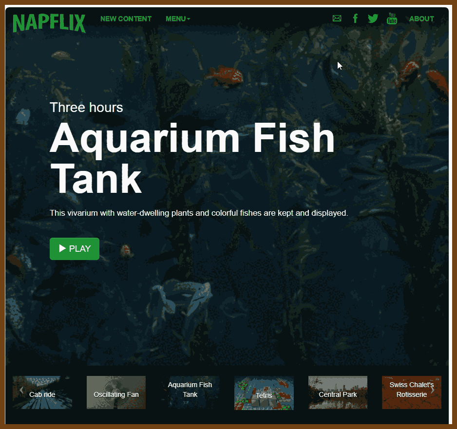
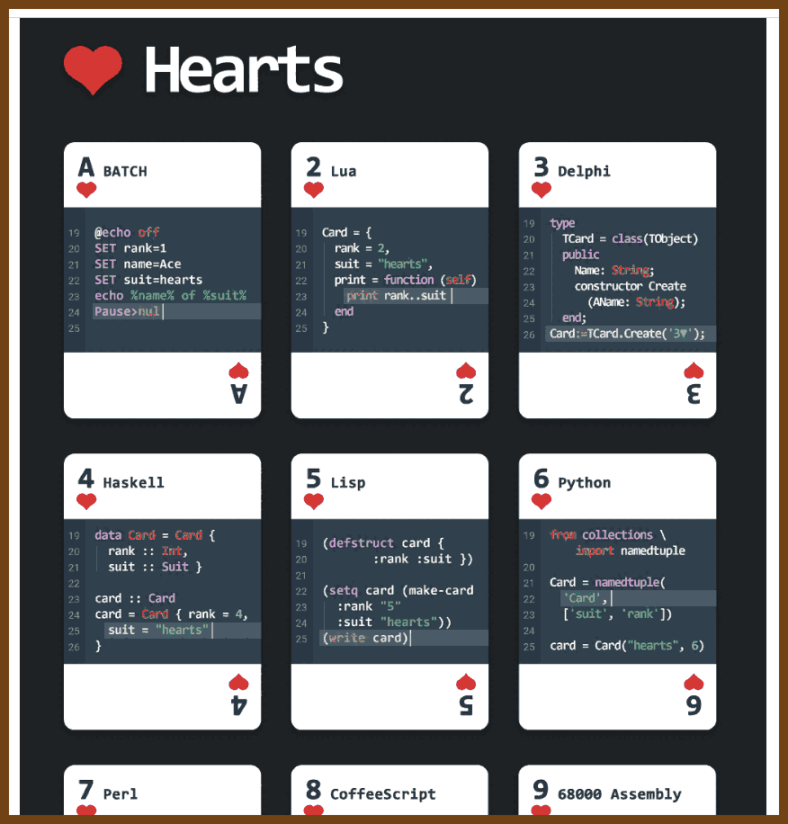
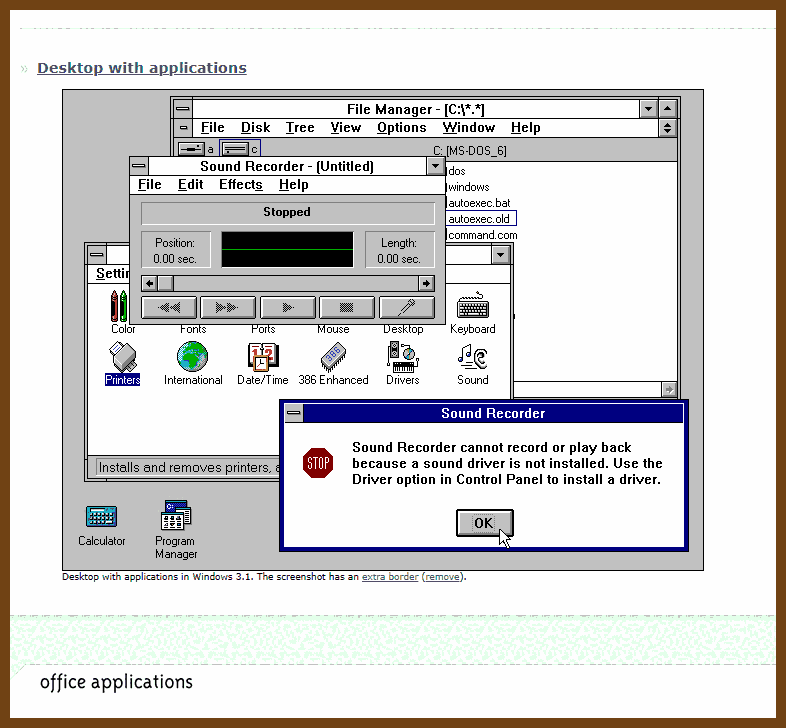
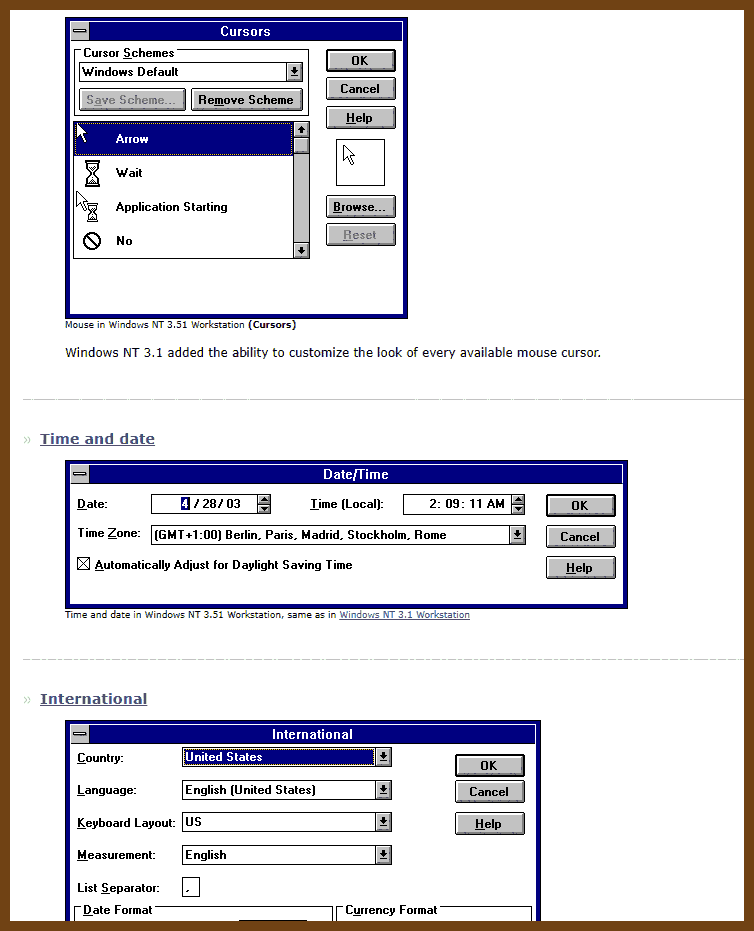
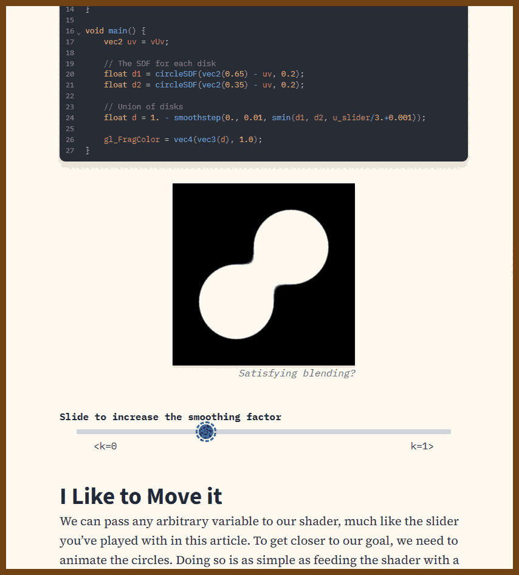

---
layout: post
title:  "Links from my inbox 2023-11-02"
date:   2023-11-02T00:33:00-07:00
categories: links
---

## Good Reads

2023-11-01 [Life Lessons from the Death Bed – Isonomia Quarterly](https://isonomiaquarterly.com/archive/volume-1-issue-2/life-lessons-from-the-death-bed/)

> As part of our graduation requirements, we had to participate in service learning my junior year of high school during the time slot allotted for our theology class. We were given a list of places in our city to volunteer and told to pick one that we’d be interested in. Of course, dozens of girls selected the animal shelter, the park, the library, and daycares. My eyes fell to the bottom of the list, a location with 0 volunteers — our local Hospice.
>
> 

2023-10-29 [Random Thoughts 15 years into Software Engineering](https://roughlywritten.substack.com/p/random-thoughts-15-years-into-software/)

> found in  [How to Make a CPU - Programming Digest](https://newsletter.programmingdigest.net/p/make-cpu/)
>
> **Debuggability is highly underrated.** When writing code, you have to think about how it will execute. You also need to be thinking about how it will fail and how you will debug it *in production*. Leave yourself audit trails, store data in human readable formats, and invest in admin tooling.
>
> **Projects are late, a lot.** This is not unique to software. The reality is that time is constantly moving against us, and when unexpected things happen they can take an order of magnitude longer than we planned. And in software, there’s always more we can add to a given feature or system. Give a best effort, and keep your stakeholders informed of progress and blockers.
>
> **Aggressively manage scope.** Related to the above, protect your project’s scope. Defensively, as people will often try to add things throughout the project. You don’t have to push back if you don’t want, but be transparent about how it will affect the project delivery and communicate it widely. Offensively, look for things you can cut or, my favorite, look for things that you can ship AFTER launch and push to prioritize those at the end. I love a good “fast follow”.
>
> **Staging is pretty much always broken.** I see a lot of younger devs hand wring about testing environments. Don’t get me wrong, testing environments are great and you should use them. But the larger your systems get the harder and harder is to maintain a parallel environment that actually mirrors production in a meaningful way. Make a best effort - but otherwise don’t sweat it and don’t be afraid to test things in production (safely, feature flags are your friend).
>
> **Action is rewarded.** Pointing out problems or complaining is not.
>
> ...

2023-10-27 [Lessons learned from two decades of Site Reliability Engineering](https://sre.google/resources/practices-and-processes/twenty-years-of-sre-lessons-learned/)

> 1. The riskiness of a mitigation should scale with the severity of the outage
> 2. Recovery mechanisms should be fully tested before an emergency
> 3. Canary all changes
> 4. Have a "Big Red Button" -- A "Big Red Button" is a unique but highly practical safety feature: it should kick off a simple, easy-to-trigger action that reverts whatever triggered the undesirable state to (ideally) shut down whatever's happening. 
> 5. Unit tests alone are not enough - integration testing is also needed
> 6. COMMUNICATION CHANNELS! AND BACKUP CHANNELS!! AND BACKUPS FOR THOSE BACKUP CHANNELS!!!
> 7. Intentionally degrade performance modes
> 8. Test for Disaster resilience
> 9. Automate your mitigations
> 10. Reduce the time between rollouts, to decrease the likelihood of the rollout going wrong
> 11. A single global hardware version is a single point of failure

2023-10-27 [Approaching unconventional problems | Manas.Tech](https://manas.tech/blog/2023/10/25/approaching-unconventional-problems/)

> The phone was found!
>
> After having lived in a rural area for almost two years, I’ve learnt to save battery by switching my phone’s wifi off whenever I go into the woods or mountain - but I also know that people don’t usually do that. After confirming this assumption with him, I’ve used my own phone’s tethering feature to create a wifi network with the same name & password as my cousin’s home network - and we started walking around the place. 

## Fun

2023-10-24 [How To Make A CPU - A Simple Picture Based Explanation](https://blog.robertelder.org/how-to-make-a-cpu/)

2023-10-19 [Ex Astris Scientia - Commercially Available Chairs in Star Trek](https://www.ex-astris-scientia.org/database/chairs-trek.htm)

> 

2023-10-17 [Napflix | Siesta Video Platform.](https://napflix.tv/?id=qa12XYa1Ols)

> 

2023-10-17 [GitHub - Bathlamos/Programmers-Playing-Cards: Play cards with style with this fancy programmer’s deck. 52 languages!](https://github.com/Bathlamos/Programmers-Playing-Cards)

> By By
>
> 

## Retro

2023-10-19 [Bill Gates demonstrates Visual Basic (1991) - YouTube Windows 3.1](https://www.youtube.com/watch?v=Fh_UDQnboRw)

> 

2023-10-13 [GUIdebook  Screenshots Windows 95](https://guidebookgallery.org/screenshots/win95)
2023-10-13 [GUIdebook Screenshots Windows 3.1](https://guidebookgallery.org/screenshots/win31)
2023-10-13 [GUIdebook > Screenshots > Windows NT 3.51 Workstation](https://guidebookgallery.org/screenshots/winnt351)

## Metadata Blog

> On distributed systems broad ly defined and other curiosities. The opinions on this site are my own.

- [TiDB: A Raft-based HTAP Database](https://muratbuffalo.blogspot.com/2023/10/tidb-raft-based-htap-database.html)
- [Metastable failures in the wild](https://muratbuffalo.blogspot.com/2023/09/metastable-failures-in-wild.html)

> This paper appeared in OSDI'22. There is a great summary of the paper by Aleksey (one of the authors and my former PhD student, go Aleksey!). There is also a great conference presentation video from Lexiang. Below I will provide a brief overview of the paper followed by my discussion points.

- [Distributed Transactions at Scale in Amazon DynamoDB](https://muratbuffalo.blogspot.com/2023/08/distributed-transactions-at-scale-in.html)

> This paper appeared in July at USENIX ATC 2023. If you haven't read about the architecture and operation of DynamoDB, please first read my summary of the DynamoDB ATC 2022 paper . The big omission in that paper was discussion about transactions. This paper amends that. It is great to see DynamoDB, and AWS in general, is publishing/sharing more widely than before.

- [Detock: High Performance Multi-region Transactions at Scale (Sigmod 2023)](https://muratbuffalo.blogspot.com/2023/07/detock-high-performance-multi-region.html)

> This paper (from Sigmod 2023) is a followup to the deterministic database work that Daniel Abadi has been doing for more than a decade. I like this type of continuous research effort rather than people jumping from one branch to another before exploring the approach in depth.
>
> The backstory for Detock starts with the Calvin paper from 2012. Calvin used a single logically centralized infallible coordinator (which is in fact 3 physical nodes under the raincoat using Paxos for state machine replication) to durably lock-in on the order of oplogs to be executed. The coordinator also gets rid of nondeterminism sources like random or time by filling in those values. The oplogs then get sent to the workers that execute them and materialize the values. The execution is local, where the executors simply follow the logs they receive.

- [Characterizing Microservice Dependency and Performance: Alibaba Trace Analysis](https://muratbuffalo.blogspot.com/2023/03/characterizing-microservice-dependency.html)

> This paper got the best paper award at SOCC 2021. The paper conducts a comprehensive study of large scale microservices deployed in Alibaba clusters.  They analyze the behavior of more than 20,000 microservices in a 7-day period and profile their characteristics based on the 10 billion call traces collected.

- [SQLite: Past, Present, and Future](https://muratbuffalo.blogspot.com/2022/09/sqlite-past-present-and-future.html)

> SQLite is the most widely deployed database engine (or likely even software of any type) in existence. It is found in nearly every smartphone (iOS and Android), computer, web browser, television, and automobile. There are likely over one trillion SQLite databases in active use. (If you are on a Mac laptop, you can open a terminal, type "sqlite3", and start conversing with the SQLite database engine using SQL.)
> SQLite is a single node and (mostly) single threaded online transaction processing (OLTP) database. It has an in-process/embbedded design, and a standalone (no dependencies) codebase ...a single C library consisting of 150K lines of code.  With all features enabled, the compiled library size can be less than 750 KiB. Yet, SQLite can support tens of thousands of transactions per second. Due to its reliability, SQLite is used in mission-critical applications such as flight software. There are over 600 lines of test code for every line of code in SQLite. SQLite is truly the little database engine that could.

- [Warp: Lightweight Multi-Key Transactions for Key-Value Stores](https://muratbuffalo.blogspot.com/2022/05/warp-lightweight-multi-key-transactions.html)

> This paper introduces a simple yet powerful idea to provide efficient multi-key transactions with ACID semantics on top of a sharded NoSQL data store. The Warp protocol prevents serializability cycles forming between concurrent transactions by forcing them to serialize via a chain communication pattern rather than using a parallel 2PC fan-out/fan-in communication. This avoids hotspots associated with fan-out/fan-in communication and prevents wasted parallel work from contacting multiple other servers when traversing them in serial would surface an invalidation/abortion early on in the serialization. I love the elegance of this idea.

## Trending on Github

2023-11-01 [dlemstra/magick-wasm: The WASM library for ImageMagick](https://github.com/dlemstra/magick-wasm)

> ImageMagick is a powerful image manipulation library that supports over [100 major file formats](https://www.imagemagick.org/script/formats.php) (not including sub-formats). With magick-wasm you can use ImageMagick in your web application without doing a callback to an api.

2023-11-01 [xxlong0/Wonder3D: A cross-domain diffusion model for 3D reconstruction from a single image](https://github.com/xxlong0/Wonder3D)

> Single Image to 3D using Cross-Domain Diffusion

2023-11-01 [donnemartin/system-design-primer: Learn how to design large-scale systems. Prep for the system design interview. Includes Anki flashcards.](https://github.com/donnemartin/system-design-primer)

> 

2023-11-01🍒 [InterviewReady/system-design-resources: These are the best resources for System Design on the Internet](https://github.com/InterviewReady/system-design-resources)

> - [Video Processing](https://github.com/InterviewReady/system-design-resources#video-processing)
>
> - [Cluster and Workflow Management](https://github.com/InterviewReady/system-design-resources#cluster-and-workflow-management)
>
> - [Intra-Service Messaging](https://github.com/InterviewReady/system-design-resources#intra-service-messaging)
>
> - [Message Queue Antipattern](https://github.com/InterviewReady/system-design-resources#message-queue-antipattern)
>
> - [Service Mesh](https://github.com/InterviewReady/system-design-resources#service-mesh)
>
> - [Practical System Design](https://github.com/InterviewReady/system-design-resources#practical-system-design)
>
> - [Distributed File System](https://github.com/InterviewReady/system-design-resources#distributed-file-system)
>
>   ...
>
> - [Caching](https://github.com/InterviewReady/system-design-resources#caching)
>
> - [Distributed Consensus](https://github.com/InterviewReady/system-design-resources#distributed-consensus)
>
> - [Authorization](https://github.com/InterviewReady/system-design-resources#authorization)
>
> - [Content Delivery Network](https://github.com/InterviewReady/system-design-resources#content-delivery-network)
>
> - [Testing Distributed Systems](https://github.com/InterviewReady/system-design-resources#testing-distributed-systems)
>
> - [System Design Resources](https://github.com/InterviewReady/system-design-resources#system-design-resources)

2023-11-01 [trimstray/the-book-of-secret-knowledge: A collection of inspiring lists, manuals, cheatsheets, blogs, hacks, one-liners, cli/web tools and more.](https://github.com/trimstray/the-book-of-secret-knowledge)

> 

## JavaScript / Web

2023-10-30 [Sit., (together) devlog 002 – Space Kalimba - Untested](https://untested.sonnet.io/Sit.%2C+(together)+devlog+002+%E2%80%93+Space+Kalimba)

> [Tone.js](https://tonejs.github.io/) Tone.js is a Web Audio framework for creating interactive music in the browser. The architecture of Tone.js aims to be familiar to both musicians and audio programmers creating web-based audio applications. On the high-level, Tone offers common DAW (digital audio workstation) features like a global transport for synchronizing and scheduling events as well as prebuilt synths and effects. Additionally, Tone provides high-performance building blocks to create your own synthesizers, effects, and complex control signals.

## Algebra / Math & Stats

2023-10-30 [Linear Algebra Done Right](https://linear.axler.net/)

> Sheldon Axler:
> I am happy to announce the publication of the fourth edition of *Linear Algebra Done Right* as an Open Access book. The electronic version of the book is now legally free to the world at the link below.
>
> [Linear Algebra Done Right, fourth edition](https://link.springer.com/content/pdf/10.1007/978-3-031-41026-0.pdf)

2023-09-02 [Slava Akhmechet - Linear Algebra for programmers, part 1](https://coffeemug.github.io/spakhm.com/posts/01-lingalg-p1/linalg-p1.html)

> The most important thing about reading this blog post is to not get scared off by the formulas. The post may look like all the crap you normally skim over, so you may be tempted to skim over this one. Don’t! **None of this is hard.** Just read the post top to bottom, and I promise you every individual step and the whole thing put together will make sense.

2023-10-12 [Introduction to Modern Statistics (2nd Ed)](https://openintro-ims2.netlify.app/)

> 

## Apache Spark

2023-10-29 [How to Speed Up Spark Jobs on Small Test Datasets - Blog | luminousmen](https://luminousmen.com/post/how-to-speed-up-spark-jobs-on-small-test-datasets)

> Dealing with small datasets (less than a million entries), can be a peculiar challenge when you've chosen Apache Spark as your go-to tool. Apache Spark is known for its capabilities in handling massive datasets through distributed computing. However, using it for smaller datasets may not always be the most efficient choice. This is most often the case for writing tests, and I’ve noticed that people frequently miss those pieces, but who knows your work better than you?
>
> In this blog post, we'll explore various optimization techniques to fine-tune Apache Spark for small datasets and discuss when it might be worthwhile to consider alternative tools.

## OAuth

2023-10-27 [Grammarly's OAuth mistakes](https://fusionauth.io/blog/grammarly-proves-ciam-not-optional)

> These are companies with millions of active users and hundreds or thousands of employees. These are not startups in a garage. Yet for all three, “Login With Facebook” was insecurely implemented in such a way that user account takeover was a real possibility.
>
> I’m not going to dig into the details in this post. [The article](https://salt.security/blog/oh-auth-abusing-oauth-to-take-over-millions-of-accounts) does a great job of that, including walking through how account takeover could be achieved.

## Graphics

2023-10-27 [A Journey Into Shaders](https://www.mayerowitz.io/blog/a-journey-into-shaders)

> Interactive intro to shaders
> References
>
> - [The book of shaders](https://thebookofshaders.com/)
> - [Inigo Quilez](https://iquilezles.org/)
> - [An introduction to Shader Art Coding (Youtube)](https://www.youtube.com/watch?v=f4s1h2YETNY)
> - [Shadertoy](https://www.shadertoy.com/)
>
> 

