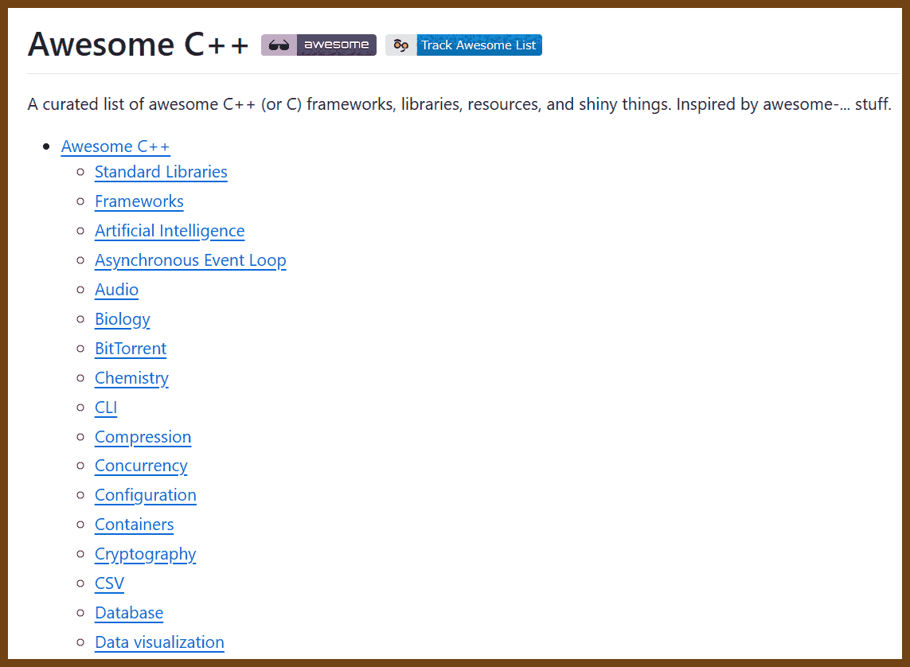
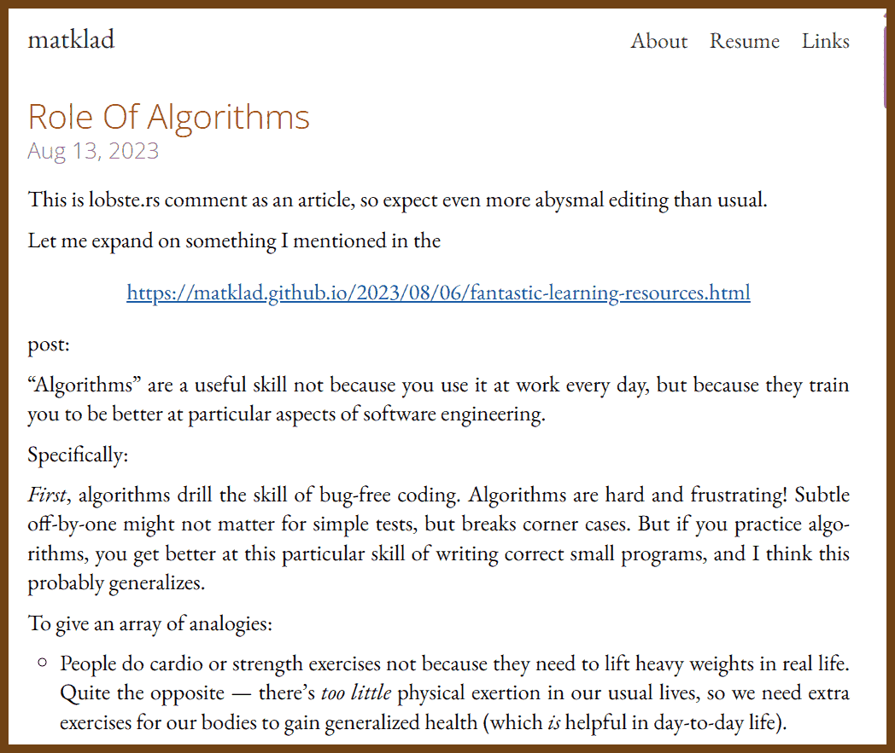
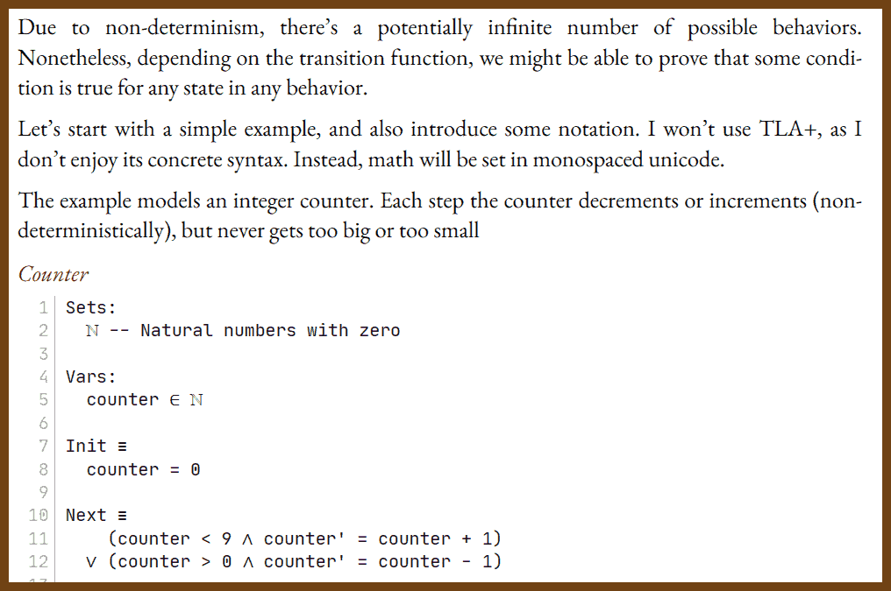

---
layout: post
title:  "Links from my inbox 2023-11-03"
date:   2023-11-03T17:13:00-07:00
categories: links
---


## Good Reads

2023-10-07 [How we manage 200+ open-source repos | Turbot Blog](https://turbot.com/blog/2023/10/repo-management)

> - **Respond Instantly**: Using GitHub actions to monitor issues and PRs in real-time, prioritizing external contributions for prompt responses.
> - **Early Communication**: Ensuring goals and expectations are clear to avoid misalignment with contributors' efforts, as exemplified by a PR that introduced unwanted dependencies.
> - **Treat Contributors Like Team Members**: Collaborating closely with contributors, providing guidance, and merging their work promptly to maintain momentum.
> - **Age Reports**: Employing daily age reports to track and prioritize the resolution of older issues and PRs, preventing stagnation.
> - **Burndown Charts**: Regularly dedicating resources to address outstanding issues, using trend charts to visualize and drive continuous improvement.
> - **Consistency Across Repos**: Automating checks for standardized naming, formatting, documentation, quality, and repository setup to ensure uniformity.
> - **Documentation is Crucial**: Emphasizing high-quality documentation to enhance usability and reduce support inquiries, seeing it as foundational rather than supplementary.

2023-10-06 [America’s Steam Empire – Creatures of Thought](https://technicshistory.com/2023/10/06/americas-steam-empire/)

> The Victorian Era saw the age of steam at its flood tide. Steam-powered ships could decide the fate of world affairs, a fact that shaped empires around the demands of steam, and that made Britain the peerless powerof the age. But steam created or extended commercial and cultural networks as well as military and political ones. Faster communication and transportation allowed imperial centers to more easily project power, but it also allowed goods and ideas to flow more easily along the same links. Arguably, it was more often commercial than imperial interests that drove the building of steamships, the sinking of cables and the laying of rail, although in many cases the two interests were so entangled that they can hardly be separated: the primary attraction of an empire, after all (other than prestige) lay in the material advantages to be extracted from the conquered territories.
> 


## Good Videos

2023-10-06 [New talk: Making Hard Things Easy](https://jvns.ca/blog/2023/10/06/new-talk--making-hard-things-easy/)

> 

2023-10-04 [Iron Man or Ultron: Is AI here to help us or hurt us? - Scott Hanselman - Copenhagen DevFest 2023 - YouTube](https://www.youtube.com/watch?v=RDVKl-27g9M)

> Luck = Hard Work + Opportunity
> Stupid = uninformed
>
> 


## Retro

2023-10-12 [Why does Outlook map Ctrl+F to Forward instead of Find, like all right-thinking programs? - The Old New Thing](https://devblogs.microsoft.com/oldnewthing/20140715-00/?p=503)

> The reason is -- Bill Gates
>
> 


## C and C++

2023-10-29 [fffaraz/awesome-cpp ](https://github.com/fffaraz/awesome-cpp)

> A curated list of awesome C++ (or C) frameworks, libraries, resources, and shiny things. Inspired by awesome-... stuff.
>
> 

2023-10-29 [JesseTG/awesome-qt](https://github.com/JesseTG/awesome-qt)

>  A curated list of awesome tools, libraries, and resources for the Qt framework.
>
> 

2023-10-28 [Skia](https://skia.org/)

> C++ Skia is an open source 2D graphics library which provides common APIs that work across a variety of hardware and software platforms. It serves as the graphics engine for Google Chrome and ChromeOS, Android, Flutter, and many other products.
> https://skia.org/docs/user/modules/canvaskit/
>
> 

2023-10-13 [Embedded C/C++ Unit Testing with Mocks | Interrupt](https://interrupt.memfault.com/blog/unit-test-mocking)

> Writing a unit test from scratch for an embedded software project is almost always an exercise in frustration, patience, and determination. This is because of the constraints, as well as breadth, of embedded software. It combines hardware drivers, operating systems, high-level software, and communication protocols and stacks all within one software package and is usually managed by a single team. Due to these complexities, the number of dependencies of a single file can quickly grow out of control.
>
> 

2023-10-11 [Code duplication for speed](https://voidstar.tech/code_duplication/)

> 

2023-10-08 [Writing C++ to Be Read - Vincent Zalzal - CppNorth 2023 - YouTube](https://www.youtube.com/watch?v=ABnf8NV6yEo)

> Invariant: constraint on dta memebers
>
> - Not all combinations of values are allowed

```cpp
class FullName { // C++20 Spaceship operator
public:
  friend auto operator<=>(const FullName&, const FullName&) = default
}
```

> 🔥 CPP20 initializers/designated initializers for value objects?
>
> 


## Theory

2023-11-02 [Role Of Algorithms](https://matklad.github.io/2023/08/13/role-of-algorithms.html)

> found in 2023-10-17 [Programming Digest](https://programmingdigest.net/digests/1724)
>
> 
>
> - **Linear Search:** Common in old functional languages' associative lists.
> - **Binary Search:** Ubiquitous; partition_point is the fundamental operation.
> - **Quadratic Sorting:** Efficient for small, fixed-size collections.
> - **Merge Sort:** Ideal for sorting on disks and in LSM-trees.
> - **Heap Sort:** Used by kernel for in-place sorting with O(N log N) guarantee.
> - **Binary Heap:** Used in simple timers, Dijkstra's algorithm, k-way merges.
> - **Growable Array:** Most used collection, growth factor optimization matters.
> - **Doubly-Linked List:** Central to rust-analyzer's two-dimensional structure.
> - **Binary Search Tree:** Used in rust-analyzer with offset as implicit key.
> - **AVL Tree:** Not widely used; teaches tree rotation techniques.
> - **Red Black Tree:** Similar to 2-3 and B-trees, used in jemalloc.
> - **B-tree:** Plays nice with memory hierarchy, used in databases and Rust.
> - **Splay Tree:** Known for humorous educational content.
> - **HashTable:** Prevalent, with both chaining and open-addressing variants.
> - **Depth First Search (DFS):** Often coded for dependency resolution in DAGs.
> - **Breadth First Search (BFS):** Common in exploration problems, like directory traversal.
> - **Topological Sort:** Needed for ordering dependent systems, like in rust-analyzer.
> - **Strongly Connected Components:** Relevant for cyclic dependencies and 2-SAT problems.
> - **Minimal Spanning Tree:** Linked to sorting and disjoint set union; used in approximating the traveling salesman problem.
> - **Dijkstra's Algorithm:** A quintessential algorithm connected to heaps, rarely used in practice.
> - **Floyd-Warshall:** Converts automata to regex; a capstone of dynamic programming.
> - **Bellman-Ford:** Theory-rich, showcases shortest path as fixed-point iterations.
> - **Quadratic Substring Search:** Standard in many language libraries.
> - **Rabin-Karp:** Utilizes hashes, similar methods used in rust-analyzer for syntax trees.
> - **Boyer-Moore:** Highly efficient, often outperforms theoretical expectations in real-world searches.
> - **Knuth-Morris-Pratt:** Represents the ideal finite state machine, practical for string search.
> - **Aho-Corasick:** Enhanced Knuth-Morris-Pratt with tries, useful for string searches and fuzzy search implementations.
> - **Edit Distance:** Fundamental in bioinformatics, relates to CPU-level parallelism.

2023-10-17 [Notes on Paxos](https://matklad.github.io/2020/11/01/notes-on-paxos.html)

> 

2023-09-03 🔬 [Raft Consensus Algorithm](https://raft.github.io/)

> 


## 💡 Projects and Ideas

2023-10-13 [The Compact Calendar 2023-2024 – DSri Seah](https://davidseah.com/node/compact-calendar/)

> The Compact Calendar presents days as a continuous candy bar of time. Weeks are presented as a stack of available time with no gaps, making it easier to count-out days naturally as you think.
>
> You can plan up to an entire year on a single sheet of paper! Print out a stack of them and keep them handy for when you need to roughly define project milestones or calculate recurring dates. These are great for taking notes during a planning meeting!
>
> 
>
> 

2023-10-12 [Welcome to Metric-time.com](https://metric-time.com/)

> A bold idea to replace 24h with 10h
>
> 

2023-10-11 [Building an app to learn languages with short stories - Purple Hoisin](https://purplehoisin.com/building-an-app-to-learn-languages-with-short-stories/)

> I have been learning German for a few years now and no, I’m not fluent, and yes I haven’t been as consistent as I should have but I get better every day… or week. To keep it interesting, some say messy, I’m always trying out new ways to learn the language: apps, grammar books, fill-the-word exercises, short stories, magazines, German TV shows, eavesdropping on my German partner’s phone conversations with her friends, etc.
>
> Short stories have been one of my favorites and probably my most consistent method to practice. However, I think there are a few things that could be better when learning a language with short stories:
>
> - You should be able to tap on a word and get a translation. Often you can guess the meaning from its context but if you can't, it's really useful to be able to get it without having to leave the story.
>
> - Ability to adjust the level of the short story (beginner, mid, advanced).
>
> - The stories should be available everywhere; no need to carry a book around. I probably won't be able to use the book in the office.
>
> - Have a mentor available 24x7 that can answer any question about grammar or about the story.
>
> - I want to test my understanding at the end of the short story with questions. Bonus points if someone checks my answers for correctness.
>
> - Include audio to hear the pronunciation and sounds of the language.

2023-10-11 [Building a 42-inch E Ink Art Frame](https://eliot.blog/e-ink-frame)

> 
>
> 


## Mocks & Stubs

2023-10-13 [How to Mock the File System for Unit Testing in .NET - Code Maze](https://code-maze.com/dotnet-unit-testing-mock-file-system/)

> Why Is Unit-Testing the File System Methods Complex?
> Let’s imagine we have a method that reads the content of a file and writes the number of its lines, words, and bytes in a new file. This implementation uses sync APIs for the sake of simplicity:

```csharp
public void WriteFileStats(string filePath, string outFilePath)
{
    var fileContent = File.ReadAllText(filePath, Encoding.UTF8);
    var fileBytes = new FileInfo(filePath).Length;
    var fileWords = Regex.Matches(fileContent, @"\s+").Count + 1;
    var fileLines = Regex.Matches(fileContent, Environment.NewLine).Count + 1; 

    var fileStats = $"{fileLines} {fileWords} {fileBytes}";

    File.AppendAllText(outFilePath, fileStats);
}
```

> Unit testing a method like this one would increase the test complexity and, therefore, would cause code maintenance issues. Let’s see the two main problems.
>
> ...

```csharp
public class FileWrapper : IFile
{
    public override void AppendAllLines(string path, IEnumerable<string> contents)
    {
        File.AppendAllLines(path, contents);
    }

    public override void AppendAllLines(string path, IEnumerable<string> contents, Encoding encoding)
    {
        File.AppendAllLines(path, contents, encoding);
    }
    // ...
}
```

```csharp
using System.IO.Abstractions;

public class FileStatsUtility
{
    private IFileSystem _fileSystem;

    public FileStatsUtility(IFileSystem fileSystem) 
    {
        _fileSystem = fileSystem;
    }

    public void WriteFileStats(string filePath, string outFilePath)
    {
        var fileContent = _fileSystem.File.ReadAllText(filePath, Encoding.UTF8);
        var fileBytes = _fileSystem.FileInfo.FromFileName(filePath).Length;
        var fileWords = this.CountWords(fileContent);
        var fileLines = this.CountLines(fileContent);

        var fileStats = $"{fileLines} {fileWords} {fileBytes}";

        _fileSystem.File.AppendAllText(outFilePath, fileStats);
    }

    private int CountLines(string text) => Regex.Matches(text, Environment.NewLine).Count + 1;

    private int CountWords(string text) => Regex.Matches(text, @"\s+").Count + 1;
}
```

```cs
[TestInitialize]
public void TestSetup() 
{
    _fileSystem = new MockFileSystem();
    _util = new FileStatsUtility(_fileSystem);
}

[TestMethod]
public void GivenExistingFileInInputDir_WhenWriteFileStats_WriteStatsInOutputDir()
{
    var fileContent = $"3 lines{Environment.NewLine}6 words{Environment.NewLine}24 bytes";
    var fileData = new MockFileData(fileContent);
    var inFilePath = Path.Combine("in_dir", "file.txt");
    var outFilePath = Path.Combine("out_dir", "file_stats.txt");
    _fileSystem.AddDirectory("in_dir");
    _fileSystem.AddDirectory("out_dir");
    _fileSystem.AddFile(inFilePath, fileData);

    _util.WriteFileStats(inFilePath, outFilePath);

    var outFileData = _fileSystem.GetFile(outFilePath);
    Assert.AreEqual("3 6 24", outFileData.TextContents);
}
```


## The Era of AI

2023-10-07 [Automatic Pixel Art Generation · Joys of Small Game Development](https://abagames.github.io/joys-of-small-game-development-en/procedural/pixel_art.html)

> Create an image showcasing a collection of retro video game-style spaceships, viewed from above. Each spaceship should be designed within a 32x32 pixel grid, utilizing a 16-color palette. Arrange several of these pixelated spaceships in a visually appealing manner.

> 


### Value objects / research

2023-09-05 [C# - Always valid value objects](https://danielwertheim.se/csharp-always-valid-value-objects/)
2023-09-05 [Value Objects explained · Enterprise Craftsmanship](https://enterprisecraftsmanship.com/posts/value-objects-explained/)


2023-09-05 [Secure by Design](https://www.manning.com/books/secure-by-design?a_aid=sawano&a_bid=0b3fac80&chan=g)

> "Look inside"
> Chapter: 5.1 Domain primitives and invariants
> `Quantity` domain primitive
> The integer value
> Enforces invariants at time of creation
> Provides domain operations to encapsulate behavior

This is a precise and strict code representation of the concept of quantity. In the case study of the anti-Hamlet in chapter 2, you saw an example of how a small ambiguity in the system could lead to customers giving themselves discount vouchers by sending in negative quantities before completing their orders. A domain primitive like the Quantity as created here removes the possibility of some dishonest user sending in a negative value and tricking the system into unintended behavior. Using domain primitives removes a security vulnerability without the use of explicit countermeasures.

2023-09-05 [Improving your Swift code using value objects – Hacking with Swift](https://www.hackingwithswift.com/articles/188/improving-your-swift-code-using-value-objects)

> The solution here is to use a technique from domain-driven design (DDD) called value objects. It’s far from a new technique, but it’s resurfaced in my head because I got to attend a talk by Daniel Sawano – who, by the way, has a whole book on writing code that’s secure by design.

2023-09-05 [Clean architecture with C#: A better design to perform validation in Value Objects - Software Engineering Stack Exchange](https://softwareengineering.stackexchange.com/questions/367735/clean-architecture-with-c-a-better-design-to-perform-validation-in-value-objec)

2023-09-05 [Value Objects: when to create one? · Enterprise Craftsmanship](https://enterprisecraftsmanship.com/posts/value-objects-when-to-create-one/)
2023-09-05 [Implementing Value Objects in Python – DDD in Python](https://dddinpython.com/index.php/2021/11/22/value-objects-in-python/)

- 2023-09-05 🚩 [Domain Model Validation In Kotlin: Part 1 | by Tiberiu Tofan | Medium](https://tibtof.medium.com/domain-model-validation-in-kotlin-part-1-21fa44c60ef3)
  - [Domain Model Validation In Kotlin: Part 2 | by Tiberiu Tofan | Medium](https://tibtof.medium.com/domain-model-validation-in-kotlin-part-2-fb4726ef8f8d)
  - [Domain Model Validation In Kotlin: Part 3 | by Tiberiu Tofan | Medium](https://tibtof.medium.com/domain-model-validation-in-kotlin-part-3-96c3fd4af342)
  - [Domain Model Validation In Kotlin: Part 4 | by Tiberiu Tofan | Medium](https://tibtof.medium.com/domain-model-validation-in-kotlin-part-4-2462b334ca6c)
- [Primitive obsession: so what happens when 2≠2? | LinkedIn](https://www.linkedin.com/pulse/primitive-obsession-so-what-happens-when-22-tomasz-wola%C5%84ski/)
- [Domain Driven Design: Value Objects - YouTube](https://www.youtube.com/watch?v=OIZ-ROcMmI8)
- [Value Objects Like a Pro](https://medium.com/@nicolopigna/value-objects-like-a-pro-f1bfc1548c72)
- [DDD Building Blocks: Value Object](https://domaincentric.net/blog/ddd-building-blocks-in-php-value-object)
- [Value Objects to the rescue!](https://medium.com/swlh/value-objects-to-the-rescue-28c563ad97c6)
- [Primitive Obsession — A Code Smell that Hurts People the Most | by arpit jain | Sixt Research & Development India | Medium](https://medium.com/the-sixt-india-blog/primitive-obsession-code-smell-that-hurt-people-the-most-5cbdd70496e9)

## Really, other

2023-10-27 [List of proverbial phrases - Wikipedia](https://en.wikipedia.org/wiki/List_of_proverbial_phrases)

2023-10-07 [JINJER - Alive In Melbourne - Official Full Concert | Napalm Records - YouTube](https://www.youtube.com/watch?v=vHLouXKjTNQ)

> Awesome music and voice! 

2023-10-06 [Gboard 帽バージョン](https://landing.google.co.jp/caps/)

> 


## Seattle

2023-10-05 [Seattle starter kit: What readers say you need | The Seattle Times](https://www.seattletimes.com/life/seattle-starter-kit-what-readers-say-you-need/)

> 
