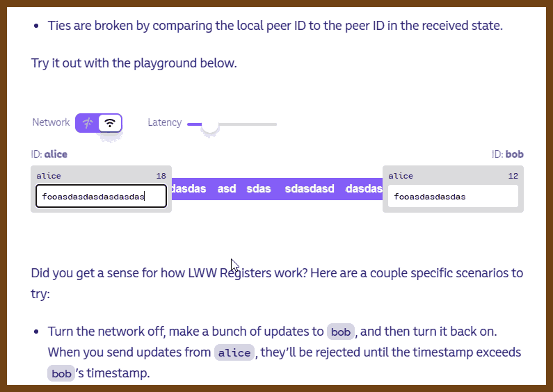
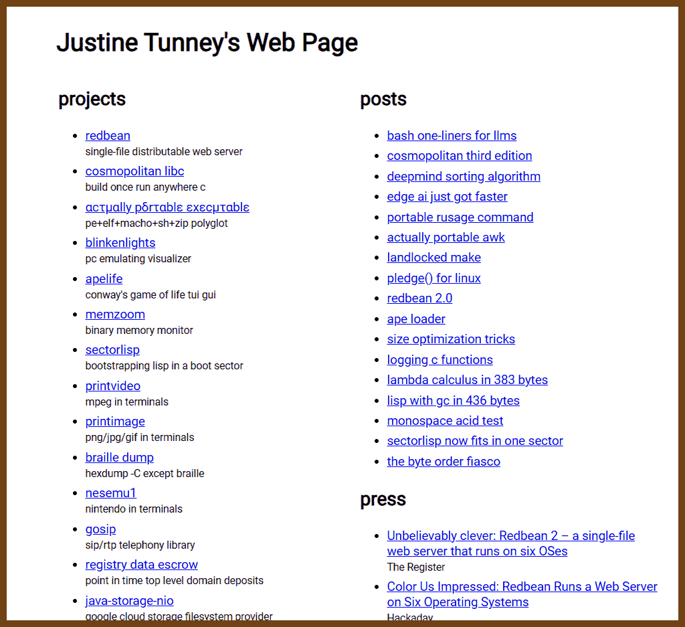
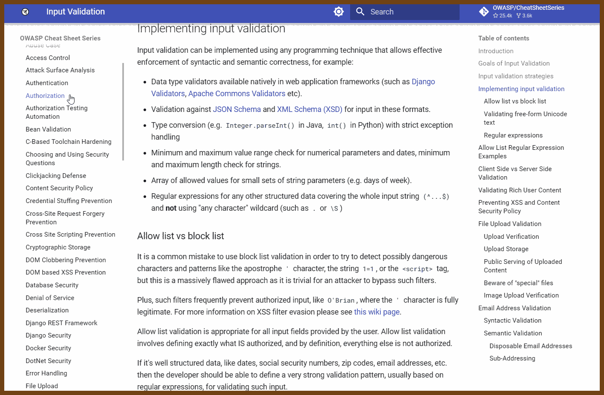
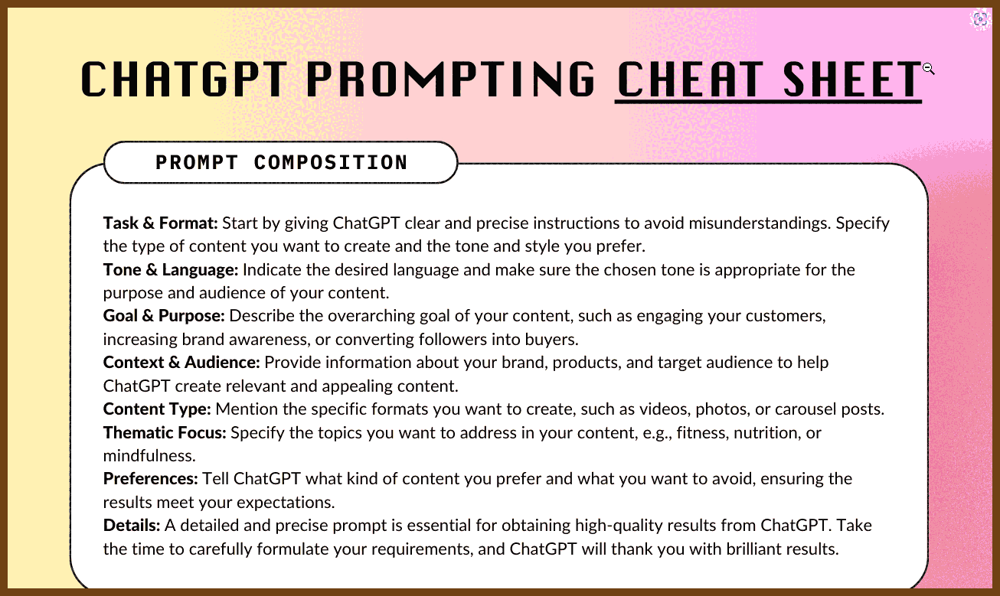

---
layout: post
title:  "Links from my inbox 2023-12-25"
date:   2023-12-25T08:42:00-08:00
categories: links
---


[[_TOC_]]

> Dear R-man, thank you for being my only known [RSS](https://blog.zharii.com/blog/rss.xml) subscriber for this year! 
>
> I award you with the title:  🏆 The subscriber of the year!


## 📖 Good Reads

2023-12-23 [Epigrams in Programming | Computer Science](https://cpsc.yale.edu/epigrams-programming)

> 1. One man’s constant is another man’s variable.
> 2. Functions delay binding; data structures induce binding. Moral: Structure data late in the programming process.
> 3. Syntactic sugar causes cancer of the semicolon.
> 4. Every program is a part of some other program and rarely fits.
> 5. If a program manipulates a large amount of data, it does so in a small number of ways.
> 6. Symmetry is a complexity-reducing concept (co-routines include subroutines); seek it everywhere.
> 7. It is easier to write an incorrect program than understand a correct one.
> 8. A programming language is low level when its programs require attention to the irrelevant.
> 9. It is better to have 100 functions operate on one data structure than 10 functions on 10 data structures.
> 10. Get into a rut early: Do the same process the same way. Accumulate idioms. Standardize. The only difference(!) between Shakespeare and you was the size of his idiom list - not the size of his vocabulary.
> 11. If you have a procedure with ten parameters, you probably missed some.
> 12. Recursion is the root of computation since it trades description for time.
>
> 13. Continue at [Epigrams in Programming | Computer Science](https://cpsc.yale.edu/epigrams-programming)


## ⁉ How the things work

2023-12-23 [How does B-tree make your queries fast? · allegro.tech](https://blog.allegro.tech/2023/11/how-does-btree-make-your-queries-fast.html) 

> **B-tree** is a structure that helps to search through great amounts of data. It was invented over 40 years ago, yet it is still employed by the majority of modern databases. Although there are newer index structures, like LSM trees, **B-tree** is unbeaten when handling most of the database queries.
>
> After reading this post, you will know how **B-tree** organises the data and how it performs search queries.

> 


## 👩‍💻Hacker News Special 🎄

2023-12-26 [Ask HN: Share your favorite software blog posts of 2023 | Hacker News](https://news.ycombinator.com/item?id=38765176)

> Hey folks, I'm on the lookout for standout software engineering blog posts this year! Interested in anything from system scaling to crafty architectures, optimization, programming languages, and cool features. Whether it's from open-source projects, companies, or individuals, what are your absolute favorite blogs for tech insights in 2023?
> 

> 2023-12-26 [Bicycle – Bartosz Ciechanowski](https://ciechanow.ski/bicycle/)
>
> 
>
> 2023-12-26 [Learning Zig](https://www.openmymind.net/learning_zig/)
>
> > Welcome to Learning Zig, an introduction to the Zig programming language. This guide aims to make you comfortable with Zig. It assumes prior programming experience, though not in any particular language.
> >
> > Zig is under heavy development and both the Zig language and its standard library are constantly evolving. This guide targets the latest development version of Zig. However, it's possible for some of the code to be out of sync.
> > 
>
> 2023-12-26 [The Big TDD Misunderstanding. 💡Rumors have it that the term “unit”… | by Oliver Wolf | Medium](https://linkedrecords.com/the-big-tdd-misunderstanding-8e22c2f1fc21)
>
> > (GPT summary)
> >
> > 1. **Test from a User Perspective**: Instead of the traditional testing pyramid focused on unit tests, consider writing more end-to-end or integration tests. This approach ensures better quality assurance and refactoring resistance, despite potential increases in execution time. Parallel testing can mitigate this issue.
> > 2. **Avoid Over-Isolating Code in Tests**: Testing code in isolation can make tests fragile and less useful during refactoring. Use patterns like hexagonal architecture for better decoupling and consider using real databases for more meaningful tests. Over-isolation can render test coverage reports less informative about the system's overall functionality.
> > 3. **Adhere to TDD Principles**: In Test-Driven Development (TDD), only write new code when there is a failing test, ensuring the effectiveness of tests and comprehensive scenario coverage. Avoid using mocks/stubs to reach 100% test coverage; instead, use realistic API scenarios. This principle may not apply during refactoring.
> > 4. **TDD and Software Design**: The concept that TDD drives software design is not universally applicable. Non-functional requirements, often not addressed in unit testing, play a crucial role in defining software architecture.
>
> 2023-12-26 [An Interactive Intro to CRDTs | jakelazaroff.com](https://jakelazaroff.com/words/an-interactive-intro-to-crdts/)
>
> > What is a CRDT?
> > Okay, let’s start from the top. CRDT stands for “Conflict-free Replicated Data Type”. That’s a long acronym, but the concept isn’t too complicated. It’s a kind of data structure that can be stored on different computers (peers). Each peer can update its own state instantly, without a network request to check with other peers. Peers may have different states at different points in time, but are guaranteed to eventually converge on a single agreed-upon state. That makes CRDTs great for building rich collaborative apps, like Google Docs and Figma — without requiring a central server to sync changes.
> >
> > 
>
> 2023-12-26 [Main Content – Math ∩ Programming](https://jeremykun.com/main-content/)
> 
>
> 2023-12-26 [Query Engines: Push vs. Pull](https://justinjaffray.com/query-engines-push-vs.-pull/)
>
> 
>
> 2023-12-26 [How Levels.fyi scaled to millions of users with Google Sheets as a backend](https://www.levels.fyi/blog/scaling-to-millions-with-google-sheets.html)
>
> 
>
> 2023-12-26 [Justine Tunney's Web Page](https://justine.lol/)
>
> 

2023-12-23 [a blog by biggiemac42](https://biggieblog.com/celebrating-the-first-nes-tetris-game-crash/) 

> 


## 🦹 Cheat sheets

2023-11-23 [Input Validation - OWASP Cheat Sheet Series](https://cheatsheetseries.owasp.org/cheatsheets/Input_Validation_Cheat_Sheet.html)

> Introduction
> This article is focused on providing clear, simple, actionable guidance for providing Input Validation security functionality in your applications.
>
> Goals of Input Validation
> Input validation is performed to ensure only properly formed data is entering the workflow in an information system, preventing malformed data from persisting in the database and triggering malfunction of various downstream components. Input validation should happen as early as possible in the data flow, preferably as soon as the data is received from the external party.
>
> Data from all potentially untrusted sources should be subject to input validation, including not only Internet-facing web clients but also backend feeds over extranets, from suppliers, partners, vendors or regulators, each of which may be compromised on their own and start sending malformed data.
>
> Input Validation should not be used as the primary method of preventing XSS, SQL Injection and other attacks which are covered in respective cheat sheets but can significantly contribute to reducing their impact if implemented properly.
>
> 

2023-11-23 [ChatGPT Prompting Cheat Sheet : ChatGPT](https://www.reddit.com/r/ChatGPT/comments/14ccjcw/chatgpt_prompting_cheat_sheet/)

> 

> 


## Testing and Validation

2023-11-23 [Validate all the things: improve your security with input validation! - The GitHub Blog](https://github.blog/2022-03-21-validate-all-things-input-validation/)

> 

2023-11-25 [Delivering Safe C++ - Bjarne Stroustrup - CppCon 2023 - YouTube](https://www.youtube.com/watch?v=I8UvQKvOSSw)

> Being careful does not scale. (Bjarne Stroustrup)

2023-12-06 [research!rsc: Go Testing By Example](https://research.swtch.com/testing)

> Here are the 20 tips from the talk:
>
> 1. Make it easy to add new test cases.
> 2. Use test coverage to find untested code.
> 3. Coverage is no substitute for thought.
> 4. Write exhaustive tests.
> 5. Separate test cases from test logic.
> 6. Look for special cases.
> 7. If you didn’t add a test, you didn’t fix the bug.
> 8. Not everything fits in a table.
> 9. Test cases can be in testdata files.
> 10. Compare against other implementations.
> 11. Make test failures readable.
> 12. If the answer can change, write code to update them.
> 13. Use [txtar](https://pkg.go.dev/golang.org/x/tools/txtar) for multi-file test cases.
> 14. Annotate existing formats to create testing mini-languages.
> 15. Write parsers and printers to simplify tests.
> 16. Code quality is limited by test quality.
> 17. Scripts make good tests.
> 18. Try [rsc.io/script](https://pkg.go.dev/rsc.io/script) for your own script-based test cases.
> 19. Improve your tests over time.
> 20. Aim for continuous deployment.


## 🦶🔫 C++ && C

2023-12-25 [The C++20 Naughty and Nice List for Game Devs – Jeremy's Blog](https://www.jeremyong.com/c++/2023/12/24/cpp20-gamedev-naughty-nice/)

> (Nice-ish) Designated initializers
>
> [Designated initializers](https://en.cppreference.com/w/cpp/language/aggregate_initialization#Designated_initializers) are a new form of initialization that initializes structured variable members by name.

```cpp
struct Point
{
    float x;
    float y;
    float z;
};

Point origin{.x = 0.f, .y = 0.f, .z = 0.f};
```

> (Nice) Default comparison and the three-way comparison operator (aka the spaceship: <=>)
>
> New in C++20 are [default comparison](https://en.cppreference.com/w/cpp/language/default_comparisons) rules for structured types that perform an automatic lexicographic comparison when requested.

```cpp
struct Date
{
    int year;
    int month;
    int day;

    auto operator<=>(Date const&) const = default;
    bool operator==(Date const&) const  = default;
};
```


## 😀 Front-end: html, JS, CSS, WebAPIs

2023-12-27 [CSS is fun again • pdx.su](https://pdx.su/blog/2023-10-25-css-is-fun-again/)

>  Want to make a transparent version of a color? Piece of cake:

```css
:root {
  --primary: blue;
  --transparent-blue: hsl(from var(--primary) h s l / 50%);
}
```

> How about making a lighter version of a color?

```css
:root {
  --light-blue: oklch(from blue, calc(l + 25) c h);
}
```


## 🤖 The Era of AI

2023-12-27 [Pushing ChatGPT's Structured Data Support To Its Limits | Max Woolf's Blog](https://minimaxir.com/2023/12/chatgpt-structured-data/)

> 

> A very new aspect of system prompt engineering which I appended in the example above is adding incentives for ChatGPT to behave correctly. Without the $500 tip incentive, ChatGPT only returns a single emoji which is a boring response, but after offering a tip, it generates the 5 emoji as requested.

2023-11-23 [ChatGPT Prompting Cheat Sheet : ChatGPT](https://www.reddit.com/r/ChatGPT/comments/14ccjcw/chatgpt_prompting_cheat_sheet/)

2023-12-05 [LLM Visualization](https://bbycroft.net/llm)

> 

2023-11-23 [A Cool Guide to Master ChatGPT Prompting : coolguides](https://www.reddit.com/r/coolguides/comments/14gd95d/a_cool_guide_to_master_chatgpt_prompting/)

> 

### Ollama + dolphin-mixtral

2023-12-22 [This new AI is powerful and uncensored… Let’s run it - YouTube](https://www.youtube.com/watch?v=GyllRd2E6fg)

2023-12-22 [jmorganca/ollama: Get up and running with Llama 2 and other large language models locally](https://github.com/jmorganca/ollama)

```
ollama serve
ollama run dolphin-mixtral:latest

```

2023-12-25 [ollama/docs/api.md at main · jmorganca/ollama](https://github.com/jmorganca/ollama/blob/main/docs/api.md)


## 🕸Network and Security

2023-12-24 [SSH over HTTPS](https://trofi.github.io/posts/295-ssh-over-https.html)

> Tl;DR: to pass `SSH` through `HTTPS` you need to tweak client and server sides as the following:
>
> Example client entry in `~/.ssh/config`:

```
# $ cat .ssh/config
Host ssh-via-https
        ProxyCommand ~/.ssh/https-tunnel.bash
        # some firewalls aggressively close idle TCP connections
        ServerAliveInterval 30
```

> The `~/.ssh/https-tunnel.bash` helper script we use above:

```
#!/usr/bin/env bash
{ printf "CONNECT ssh-server:22 HTTP/1.0\r\n\r\n"; cat; } | socat - SSL:https-server:443
```

>  Example server entry for `apache2` `HTTPS`:

```
# $ cat /etc/httpd/httpd.conf
LoadModule proxy_connect_module .../modules/mod_proxy_connect.so
# ...
AllowCONNECT 22
<Proxy *>
    Order deny,allow
    Deny from all
</Proxy>
<Proxy ssh-server>
    Order deny,allow
    Allow from all
</Proxy>
```

> Here we allow everyone to use `CONNECT` `HTTP` method on the server side hosted at `https-server` just for a single target: the `ssh-server` host.
>
> And on the client side we use `socat` to create `TLS` connection with a sent `CONNECT` method as a header.
>
> Now you can use `$ ssh ssh-via-https` to reach `ssh-server`.
>
> More words below...


## ⚒️ Tools

2023-12-25 [Some Useful Bash Aliases | Chuck Carroll](https://chuck.is/alias/)

> I spend a good chunk of time in a terminal and sometimes need to run a long command to get specific tasks done. I've known about aliases for a while but only recently began using them. Below are some aliases I've set up permanently in my .bashrc config. Aliases must be set up in the format of 'alias [name]='[command]' and saved into .bashrc in the home folder. For example, `alias music='cmus'` will launch cmus whenever I enter 'music' into my terminal.
>
> Here is a list of aliases I've set up that range from fun to boring, but are all useful nonetheless. Entering the alias in a terminal will automatically run the corresponding command.
>
> - Alias: `weather`
>   Command: `curl wttr.in/austin`
>   Purpose: spits out what the weather is in Austin TX (or whichever city you specify).
> - Alias: `define`
>   Command: `sdcv`
>   Purpose: I [wrote a post](https://chuck.is/dictionary) about this one. Typing 'define' followed by a word will output that word's definition.
> - Alias: `flac2ogg`
>   Command: `find . -name "*flac" -exec oggenc -q 9 {} \;`
>   Purpose: When I buy music off of Bandcamp, I download the FLAC version and then convert it to OGG. BC does offer OGG, but it's in a lower quality than I prefer
> - Alias: `wifi`
>   Command: `nmcli dev wifi show-password`
>   Purpose: Typing this outputs the wifi password of the network I'm currently connected to, as well as provides a useful QR code.
> - Alias: `unmountBackup`
>   Command: `umount /run/media/chuck/Backup` Purpose: I often mount and unmount my external drive. Typing "unm" then tabbing will autocomplete 'unmountBackup', so I don't have to type out the entire path every time.
> - Alias: `ddg`
>   Command: `w3m lite.duckduckgo.com`
>   Purpose: This brings up the light version of Duck Duck Go in w3m so I can do web searches right from a terminal window.
> - Alias: `rm`
>   Command: `rm -r`
>   Purpose: Because when I type "rm" I don't want to always have to specify "-r" for a directory.
> - Alias: `cp`
>   Command: `cp -r`
>   Purpose: Same as above. When I say "copy this" I always want it to copy whatever I'm specifying, even if it's a directory.
> - Alias: `rss`
>   Command: `newsboat`
>   Purpose: A shorter way to start up newsboat (an even quicker way is setting a keyboard shortcut to Super+N)
> - Alias: `vpn`
>   Command: `protonvpn-cli`
>   Purpose: Just a shorter way to start up ProtonVPN's CLI tool so I can type things like 'vpn -r' instead of 'protonvpn -r'


## No Ads!

2023-12-05 [anfragment/zen: Simple, free and efficient ad-blocker and privacy guard for Windows, MacOS and Linux](https://github.com/anfragment/zen)

> Zen is an open-source system-wide ad-blocker and privacy guard for Windows, macOS, and Linux. It works by setting up a proxy that intercepts HTTP requests from all applications, and blocks those serving ads, tracking scripts that monitor your behavior, malware, and other unwanted content. By operating at the system level, Zen can protect against threats that browser extensions cannot, such as trackers embedded in desktop applications and operating system components. Zen comes with many pre-installed filters, but also allows you to easily add hosts files and EasyList-style filters, enabling you to tailor your protection to your specific needs.


## 📶 RSS

2023-12-27 [XPath Scraping with FreshRSS – Dan Q](https://danq.me/2022/09/27/freshrss-xpath/)

> You’ll need to use XPath to express how to find a “feed item” on the page. Here’s the rules I used for https://webdevbev.co.uk/blog.html (many of these fields were optional – I didn’t have to do this much work):
>
> - **Feed title:** `//h1`
>   I override this anyway in FreshRSS, so I could just have used the a string, but I wanted the XPath practice. There’s only one `<h1>` on the page, and it can be considered the “title” of the feed.
> - **Finding items:** `//li[@class="blog__post-preview"]`
>   Each “post” on the page is an `<li class="blog__post-preview">`.
> - **Item titles:** `descendant::h2`
>   Each post has a `<h2>` which is the post title. The descendant:: selector scopes the search to each post as found above.
> - **Item content:** `descendant::p[3]`
>   Beverley’s static site generator template puts the post summary in the third paragraph of the `<li>`, which we can select like this.
> - **Item link:** `descendant::h2/a/@href`
>   This expects a URL, so we need the /@href to make sure we get the *value* of the `<h2><a href="...">`, rather than its *contents*.
> - **Item thumbnail:** `descendant::img[@class="blog__image--preview"]/@src`
>   Again, this expects a URL, which we get from the ``.
> - **Item author:** `"Beverley Newing"`
>   Beverley’s blog doesn’t host any guest posts, so I just use a string literal here.
> - **Item date:** `substring-after(descendant::p[@class="blog__date-posted"], "Date posted: ")`
>   This is the only complicated one: the published dates on Beverley’s blog aren’t explicitly marked-up, but part of a string that begins with the words “Date posted: “, so I use XPath’s [`substring-after`](https://developer.mozilla.org/en-US/docs/Web/XPath/Functions/substring-after) function to strtip this. The result gets passed to PHP’s [`strtotime()`](https://www.php.net/strtotime), which is pretty tolerant of different date formats (although not of the words “Date posted:” it turns out!).
>
> 

2023-12-21 [Athou/commafeed: Google Reader inspired self-hosted RSS reader.](https://github.com/Athou/commafeed)

2023-12-21 [nkanaev/yarr: yet another rss reader](https://github.com/nkanaev/yarr)

2023-12-21 [stringer-rss/stringer: A self-hosted, anti-social RSS reader.](https://github.com/stringer-rss/stringer)

2023-12-21 [nextcloud/news: :newspaper: RSS/Atom feed reader](https://github.com/nextcloud/news)

2023-12-21 [yang991178/fluent-reader: Modern desktop RSS reader built with Electron, React, and Fluent UI](https://github.com/yang991178/fluent-reader)

2023-12-21 [fossar/selfoss: multipurpose rss reader, live stream, mashup, aggregation web application](https://github.com/fossar/selfoss)

2023-12-21 [googlearchive/wReader-app: RSS Reader written using AngularJS](https://github.com/googlearchive/wReader-app)

2023-12-21 [davidsun/EasyRSS: Google Reader Client for Android](https://github.com/davidsun/EasyRSS)

2023-12-21 [lwindolf/liferea: Liferea (Linux Feed Reader), a news reader for GTK/GNOME](https://github.com/lwindolf/liferea)


## Web Scrapping

2023-12-21 [RSS-Bridge/rss-bridge: The RSS feed for websites missing it](https://github.com/RSS-Bridge/rss-bridge)
