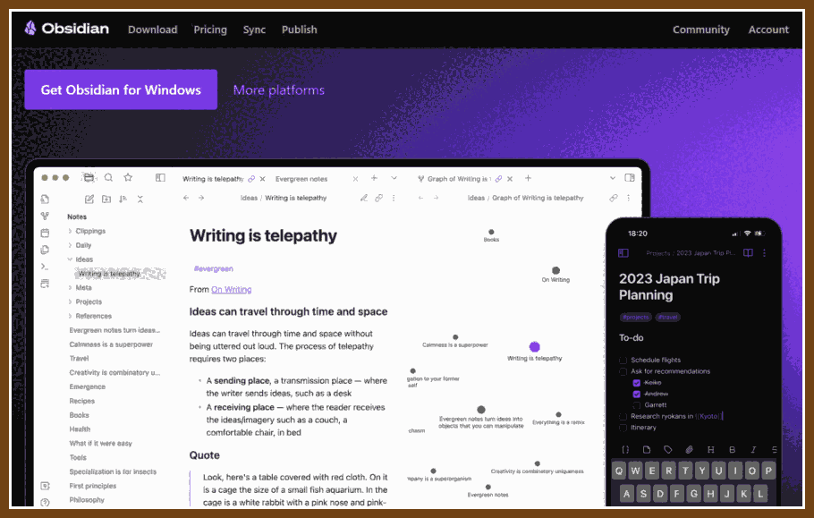
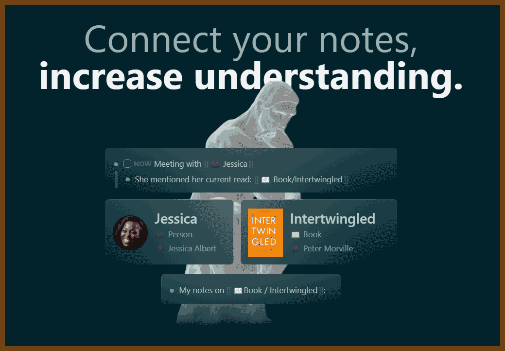
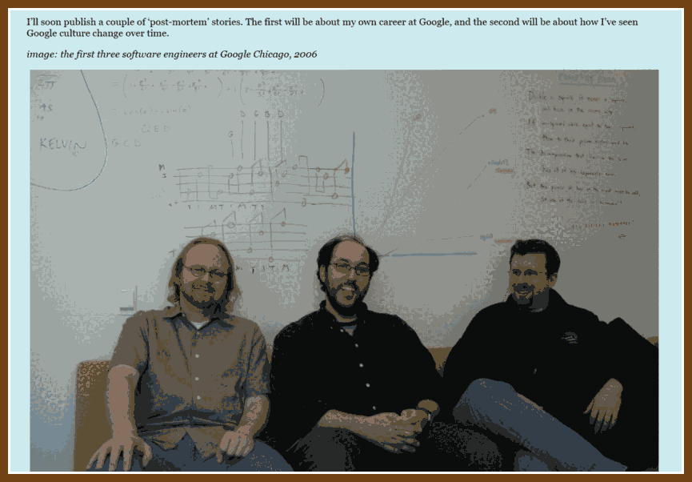
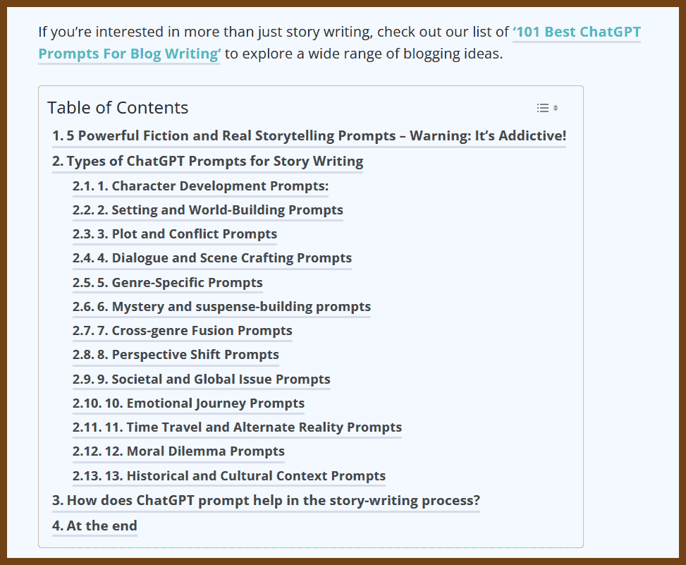
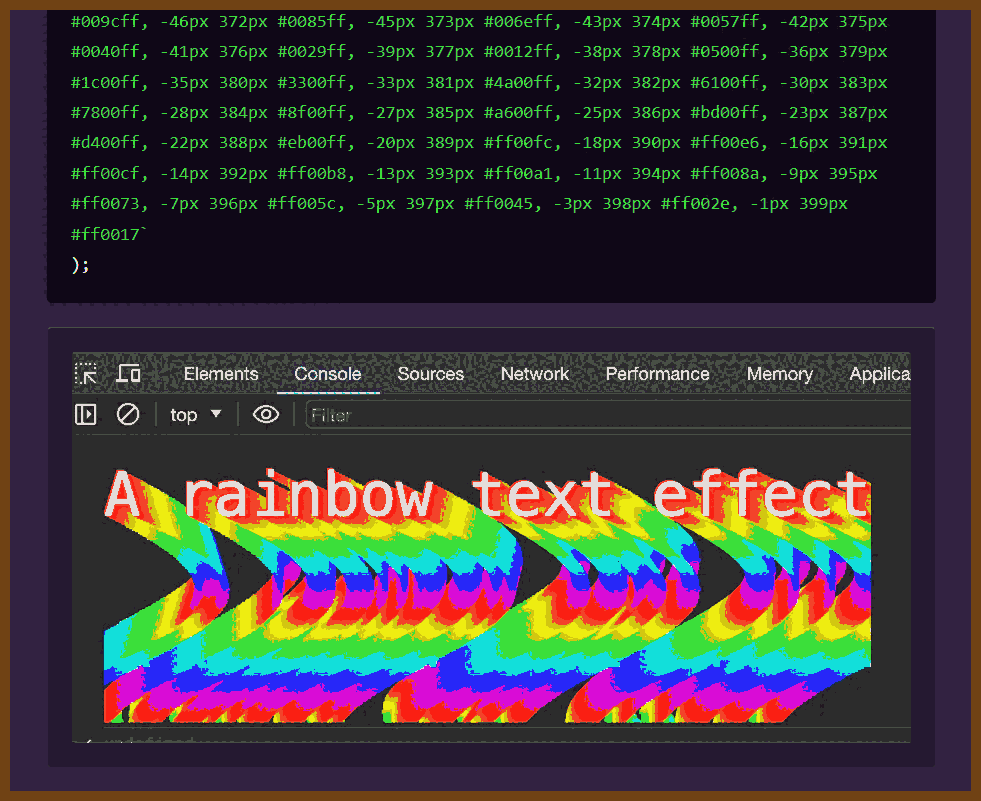

---
layout: post
title:  "Links from my inbox 2024-01-25"
date:   2024-01-25T16:21:00-08:00
categories: links
---


## Good Reads

2024-01-21 [How software engineers create value - by James Samuel](https://softwareleads.substack.com/p/how-software-engineers-create-value/)

> Found in: https://newsletter.programmingdigest.net/p/software-engineers-create-value
>
> I was in an interview with a promising engineer. The candidate had recently passed their video screen interview.I was in an interview with a promising engineer. The candidate had recently passed their video screen interview.
>
> “How does the company make money?" the candidate asked.“How does the company make money?" the candidate asked.
>
> I responded, "We make money by helping customers get from point A to point B. Every time we help a customer meet an appointment, every minute they catch up with a train or flight they would have otherwise missed if not for our service, they pay us for the value we provide.I responded, "We make money by helping customers get from point A to point B. Every time we help a customer meet an appointment, every minute they catch up with a train or flight they would have otherwise missed if not for our service, they pay us for the value we provide.
>
> Likewise, every time we fail to provide that value that's satisfactory to our users, we sabotage our money-making process by losing that customer to competitors. You will be working on XYZ, which allows us to provide delightful services to our users, offer them competitive pricing, and make them come back again."Likewise, every time we fail to provide that value that's satisfactory to our users, we sabotage our money-making process by losing that customer to competitors. You will be working on XYZ, which allows us to provide delightful services to our users, offer them competitive pricing, and make them come back again."
>
> The candidate's eyes lit up. It felt like the candidate had just grasped why the role was important.The candidate's eyes lit up. It felt like the candidate had just grasped why the role was important.
>
> [ = = = ]
>
> They seek to understand how solving a problem benefits a user. They don’t want to write the feature and later discover that customers don’t need it.They seek to understand how solving a problem benefits a user. They don’t want to write the feature and later discover that customers don’t need it.
>
> They break large problems into smaller, incrementally deliverable chunks. Rather than doing a big bang release, they do incremental releases, which shorten the feedback cycle tremendously.They break large problems into smaller, incrementally deliverable chunks. Rather than doing a big bang release, they do incremental releases, which shorten the feedback cycle tremendously.
>
> When they’re blocked or need something, they proactively reach out for help to unblock themselves because they know the longer they’re blocked, the longer the value creation takes.When they’re blocked or need something, they proactively reach out for help to unblock themselves because they know the longer they’re blocked, the longer the value creation takes.
>
> When their PR is stuck in review and reviewers are not forthcoming, they proactively reach out to reviewers in DMs to draw attention to it.When their PR is stuck in review and reviewers are not forthcoming, they proactively reach out to reviewers in DMs to draw attention to it.
>
> When the code is merged, they know their work is not finished until the feature is turned on for users, proactively following up to ensure that the feature can be turned on for users.When the code is merged, they know their work is not finished until the feature is turned on for users, proactively following up to ensure that the feature can be turned on for users.
>
> Exceptional engineers don’t stop at seeing the feature turned on for users; they continue to monitor how users are using the feature, checking quality and reliability metrics, and identifying opportunities and improvements to make the feature more delightful.


## Personal wiki and knowledge management

2022-01-26 [Zim - a desktop wiki](https://zim-wiki.org/)

> Zim is a graphical text editor used to maintain a collection of wiki pages. Each page can contain links to other pages, simple formatting and images. Pages are stored in a folder structure, like in an outliner, and can have attachments. Creating a new page is as easy as linking to a nonexistent page. All data is stored in plain text files with wiki formatting. Various plugins provide additional functionality, like a task list manager, an equation editor, a tray icon, and support for version control.
>
> 

2022-01-19 [Obsidian](https://obsidian.md/) 

> A second brain, for you, forever. Obsidian is a powerful knowledge base on top of
> a local folder of plain text Markdown files.
>
> 

2022-01-19 [logseq A privacy-first, open-source knowledge base](https://logseq.com/) 

>  Logseq is a joyful, open-source outliner that works on top of local plain-text Markdown and Org-mode files. Use it to write, organize and share your thoughts, keep your to-do list, and build your own digital garden.
>
> 

2022-01-19 [Dendron](https://www.dendron.so/)

> 2022-01-19 [Dendron: A personal knowledge management  PKM  solution built on VS Code   Hacker News](https://news.ycombinator.com/item?id=29998680)
>
> 

2022-01-18 [tiddlyroam · your open source external brain](https://tiddlyroam.org/)

> 

2022-01-18 [BookStack Wiki](https://www.bookstackapp.com/) a personal wiki

> 


2022-01-18 ⭐  [About This Website · Gwern.net](https://www.gwern.net/About) **Personal Wiki** 

> The content here varies from statistics to psychology to self-experiments/Quantified Self to philosophy to poetry to programming to anime to investigations of online drug markets or leaked movie scripts (or two topics at once: anime & statistics or anime & criticism or heck anime & statistics & criticism!).I believe that someone who has been well-educated will think of something worth writing at least once a week; to a surprising extent, this has been true. (I added ~130 documents to this repository over the first 3 years.)

> 


## X-Files

2024-01-18 [FAQ on leaving Google - Writings of sussman](https://social.clawhammer.net/blog/posts/2024-01-10-GoogleExitLetter/)

>  I was an Engineering Director with “only” 35 reports (rather than a typical 80+ people), and so it’s likely that some heuristic decided that the business could do fine without me.
>
>  2024-01-18 https://www.red-bean.com/sussman/
>
>  Japanese
>
>  I'm not a [weeb](https://en.wikipedia.org/wiki/Japanophilia) or even much of a fan of anime, but I love linguistics. I studied Spanish, Latin, and German when I was young. During the pandemic I decided I wanted to try a *really different* language, and thus chose Japanese as a challenge. I'm working my way through textbooks and sometimes practice speaking with natives in social media apps.
>
>  2024-01-18 [Google I/O 2012 - The Art of Organizational Manipulation - YouTube](https://www.youtube.com/watch?v=OTCuYzAw31Y)
>
>  > Brian Fitzpatrick, Ben Collins-Sussman
>
>  


## The Era of AI

Mostly about prompt engineering

 

2024-01-23 [10 Easy Ways to Use ChatGPT Strategically : ChatGPTPro](https://www.reddit.com/r/ChatGPTPro/comments/19c48nh/10_easy_ways_to_use_chatgpt_strategically/)

Posted by[u/Senior_tasteey](https://www.reddit.com/user/Senior_tasteey/)

1) 💎 Write from Different Perspectives with ChatGPT

Enhance your writing by having ChatGPT adopt the perspectives of characters from diverse backgrounds or viewpoints.

*Example Prompt:*

```
Topic: Productivity for entrepreneurs  For the above topic, write multiple perspectives from a group with different viewpoints. For each perspective, write in their own voice, using phrases that person would use. 
```

2) 💎 Vary Output Formats with ChatGPT

Get creative with your content by asking ChatGPT to generate it in various formats.

*Example Prompt:*

```
Create a mind map on the topic of using Notion to stay organized as a content creator, listing out the central idea, main branches, and sub-branches. 
```

3) 💎 Generate Purposeful Content with ChatGPT

Inform ChatGPT about your audience and the goal of your content for tailored outputs.

*Example Prompt:*

```
Topic: How to grow your coaching business For audience: Business coaches Content goal: Motivate audience to feel excited about growing their business while teaching them one tip. Writing style: Clear, concise, conversational, down-to-earth, humble, experienced 
```

4) 💎 Use Unconventional Prompts

Explore ChatGPT's creative potential with open-ended or abstract prompts.

*Example Prompts:*

```
Write a poem about copywriting. 
```

```
Describe feeling like an entrepreneur in 10 adjectives. 
```

5) 💎 Ultra-Brainstormer with ChatGPT

Push beyond the generic by asking ChatGPT for unique angles on familiar topics.

*Example Prompt:*

```
Topic: How to double your creative output.   For the topic above, brainstorm new angles or approaches. Prioritize ideas that are uncommon or novel. 
```

6) 💎 Capture Your Writing Style

Guide ChatGPT in creating a style guide based on your own writing.

*Example Prompt:*

```
Analyze the text below for style, voice, and tone. Using NLP, create a prompt to write a new article in the same style, voice, and tone:  [Insert your text here] 
```

7) 💎 Blend in Human-Written Techniques

Combine expert writing advice with ChatGPT's capabilities for enhanced content.

*Example Prompt:*

```
Write a brief post about why copywriting is an essential skill in 2023. Use these strategies: - Use strong persuasive language - Ask questions to transition between paragraphs - Back up main points with evidence and examples - Speak directly to the reader 
```

8) 💎 Experiment with Styles and Tones

Utilize ChatGPT for content in various styles or tones, such as satire or irony.

*Example Prompt:*

```
Give the most ironic, satirical advice you can about using ChatGPT to create more effective content. 
```

9) 💎 Simulate an Expert Persona

Engage with ChatGPT as if it were a customer, co-host, or an expert in a specific field.

*Example Prompt:*

```
You are a talented analyst at a top-tier market research firm, a graduate of Harvard Business School. Coach me to create content that connects with C-level executives at B2B SaaS companies. What open-ended questions do I ask? Prioritize uncommon, expert advice. 
```

10) 💎 Challenge the Conventional Narrative

Encourage ChatGPT to provide perspectives that go against the mainstream narrative.

*Example Prompt:*

```
Topic: Growing your email newsletter

For the above topic, give examples that contradict the dominant narrative. Generate an outline for thought-provoking content that challenges assumptions.
```

If you found this useful, consider getting my [Prompt Engineering Guide](https://godofprompt.ai/prompt-engineering-guide) by clicking [here.](https://godofprompt.ai/prompt-engineering-guide)


2024-01-23 [A cool guide for ChatGPT : ChatGPTPro](https://www.reddit.com/r/ChatGPTPro/comments/19d068g/a_cool_guide_for_chatgpt/)

> 
>
> OpenAI has a guide on their own site that is 100000x better than these "tips":
>
> https://help.openai.com/en/articles/6654000-best-practices-for-prompt-engineering-with-openai-api
>
> https://platform.openai.com/docs/guides/prompt-engineering/strategy-write-clear-instructionsOpenAI 

2024-01-23 [ChatGPT - AnkiX](https://chat.openai.com/g/g-mPyoGmkTR-ankix)

> 2024-01-23 [Reddit Experiment: Trained LLM with Top MCAT Deck (2900 Cards) : Anki](https://www.reddit.com/r/Anki/comments/1844k75/experiment_trained_llm_with_top_mcat_deck_2900/)
>
> GPT AnkiX
>
> AnkiX: Flashcard Creation Assistant. Improve memory retention with intelligently crafted cards. 🌟 4 Card Types: (basic, reversed, typed-in, cloze) 📚 Upload & Learn: From notes to smart flashcards 💫 Seamless Integration: Create Anki import files v0.1.9 Visuals + Interaction Flow Improved

2024-01-21 [130 Magical Chatgpt Prompts For Story Writing](https://aipromptsbank.com/chatgpt-prompts-for-story-writing/)

> 


## Web Technologies

2024-01-18 ⭐ [React Libraries for 2024](https://www.robinwieruch.de/react-libraries/)

> Found in: https://javascriptweekly.com/issues/671
>
> 


## C#

2024-01-16 [An asynchronous lock free ring buffer for logging](https://steven-giesel.com/blogPost/11f0ded8-7119-4cfc-b7cf-317ff73fb671/)

> From 2024-01-16 [Building a self-contained game in C# under 2 kilobytes](https://newsletter.csharpdigest.net/p/building-selfcontained-game-c-2-kilobytes)
>
> From comments: 2024-01-16 [disruptor-net/Disruptor-net: Port of LMAX Disruptor to .NET](https://github.com/disruptor-net/Disruptor-net/tree/master)

2024-01-08 [High-Performance .NET CRON Jobs](https://www.jamesmichaelhickey.com/high-performance-dotnet-cron-jobs/)

> In the .NET ecosystem, there are a few great libraries for scheduling or queuing background work. I created [Coravel](https://github.com/jamesmh/coravel) as an easy way to build .NET applications with more advanced web application features. But it’s mostly known as a background job scheduling library.
>
> I thought it would be fun to play around with the idea of building a basic CRON job system and progressively building it into a more high-performance CRON job processing system.
>
> We’ll start by learning how to use Coravel in a simple scenario. Then, we’ll further configure and leverage Coravel’s features to squeeze more performance out of a single .NET process. Finally, you’ll learn a few advanced techniques to build a high-performance background job processing system.


## C && C++

2024-01-10 [linkdd/aitoolkit: Give a brain to your game's NPCs](https://github.com/linkdd/aitoolkit)

> **AI Toolkit** is a header-only C++ library which provides tools for building the brain of your game's NPCs.
>
> It provides:
>
> - Finite State Machines
> - Behavior Tree
> - Utility AI
> - Goal Oriented Action Planning

2024-01-14 [Assembly, System Calls, and Hardware in C++ - David Sankel - CppNow 2023 - YouTube](https://www.youtube.com/watch?v=7xwjjolDnwg)

> 


## Projects and Tools

2024-01-22 [CSS 3D Clouds](https://spite.github.io/CSS3DClouds/)

> CSS3D Clouds
> An experiment on creating volumetric 3d-like clouds with CSS3 3D Transforms and a bit of Javascript.
>
> 

2024-01-18 [console.delight – Frontend Masters Boost](https://frontendmasters.com/blog/console-delight/)

> Found in: https://javascriptweekly.com/issues/671
>
> Everyone knows you can use console.log() to log text and variables to the console. Did you know you could also render (limited) CSS, SVGs, and even HTML in it?!? I didn’t! It’s a neat technique that can delight the curious and further your brand for curious users.
>
> 
>
> 

2024-01-13 [How You Can Hide Files Inside Images: The Art of Steganography | by Jizoskasa | Jan, 2024 | Medium](https://medium.com/@jizoskasa/how-you-can-hide-files-inside-images-the-art-of-steganography-e5c2200a5671)

> Consider a file named ‘Notes.txt’ you open this and guess what? You see the content of it, which in this case, is any kind of text you wrote inside. However, computers don’t see ‘text’ per se. They interpret everything as binary data, which is essentially a series of 1s and 0s. This binary data, in the case of a ‘.txt’ file, represents the ASCII code of each character, which ranges from 0 to 255. For instance, the ASCII representation for ‘B’ is 01000010, ‘o’ is 01101111, and ‘b’ is 01100010. Thus, ‘Bob’ in your .txt file is represented as 01000010 01101111 01100010 (without spaces).

2024-01-10 [MrBruh's Epic Blog: How I pwned half of America’s fast food chains, simultaneously.](https://mrbruh.com/chattr/)

> This was achieved through a public list of sites using the `.ai` TLD and parsing the site data (and any referenced .js bundles) for references to common Firebase initialisation variables.


## FFmpeg

2024-01-19 [Recipes in FFmpeg - OTTVerse](https://ottverse.com/recipes-in-ffmpeg/)

> FFmpeg is the Swiss Army knife of the audio-video editing, processing, compression, and streaming world. You can practically do anything with FFmpeg when it pertains to building an AV pipeline, and in this tutorial, we cover several popular and valuable uses of FFmpeg..
>
> On this page, you will find ready-to-use snippets for specific use cases, complete with command lines and examples of inputs and outputs to help you understand the use case. For example, blurring a video, cropping it, rotating it clockwise, and so much more!
>
> 


### Seattle 

2024-01-13 [Worried about everyone outside in these frigid temperatures : Seattle](https://www.reddit.com/r/Seattle/comments/1955f26/worried_about_everyone_outside_in_these_frigid/)

> 

> 

> 
