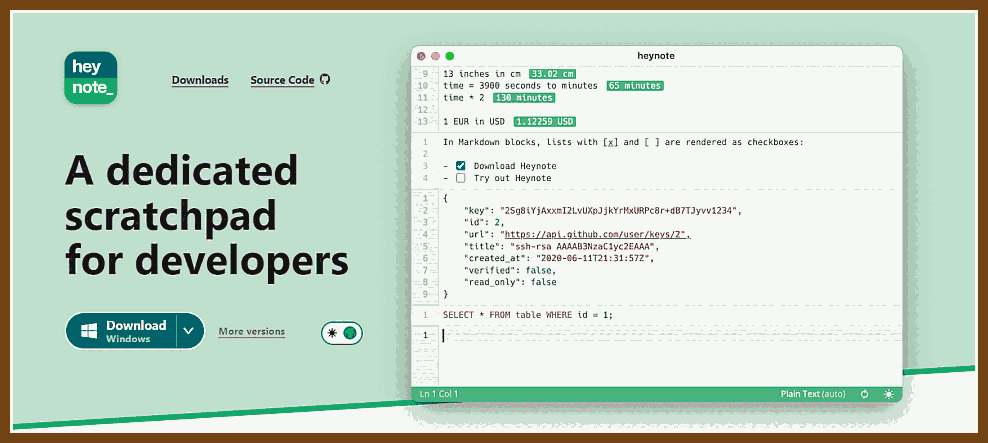
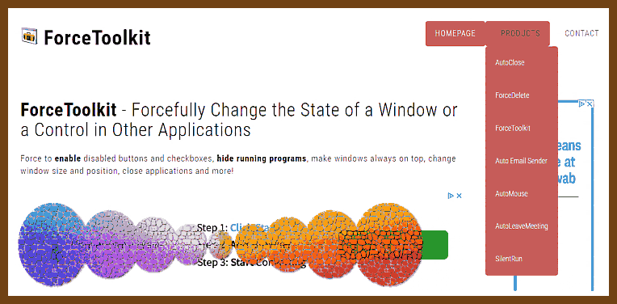
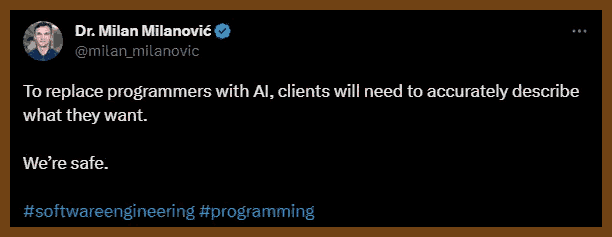
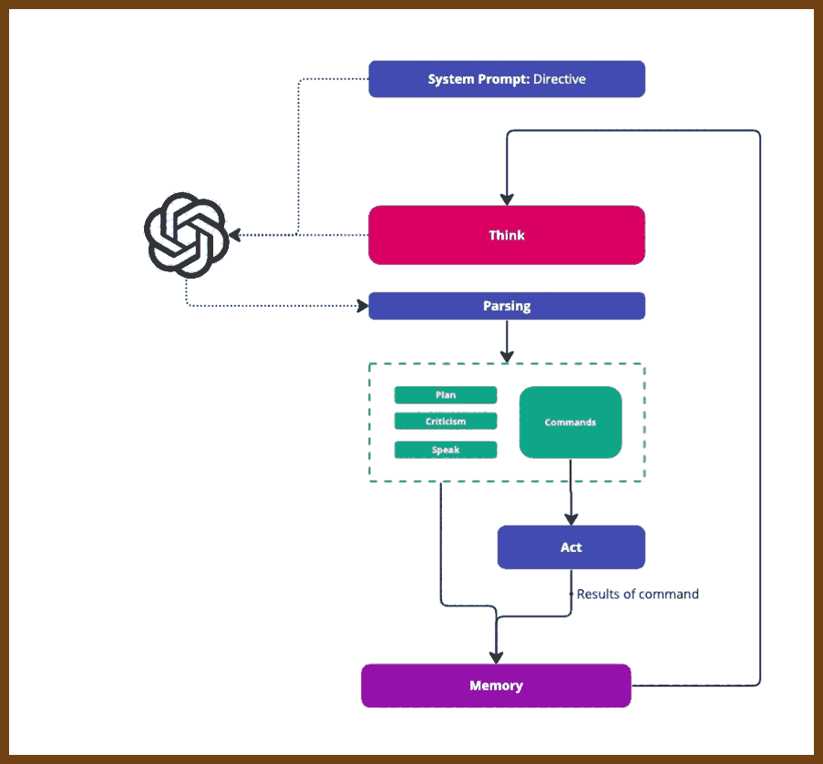

---
layout: post
title:  "Links from my inbox 2024-02-08"
date:   2024-02-08T16:54:00-08:00
categories: links
---


## 🔖 Good Reads

2024-01-27 [Long Term Refactors - Max Chernyak](https://max.engineer/long-term-refactors)

> I have a theory that long refactors get a bad rap because most of them take far longer than we expect. The length leads to stress, an awkward codebase, a confused team, and often no end in sight. Instead, what if we *prepared* an intentional long term refactor? A few years ago, I began trying this method, and it has led to some surprisingly successful results:
>
> - We didn’t need to negotiate business timelines.
> - We didn’t need to compete against business priorities.
> - The team quickly understood and even took ownership of the refactor over time.
> - There was no increase in stress and risk of burnout.
> - PRs were easy to review, no huge diffs.
> - The refactor was consistently and collaboratively re-evaluated by the entire team.
> - We never wasted time refactoring code that didn’t need it.
> - Our feature development remained unblocked.
> - The team expanded their architectural knowledge.
> - The new engineers had a great source of first tasks.
> - We rolled out the refactor gradually, making it easier to QA, and reducing bugs.

2023-12-28 [Developers experience burnout, but 70% of them code on weekends - ShiftMag](https://shiftmag.dev/developer-lifestye-jetbrains-survey-2189/)

> 2023-12-28 [The State of Developer Ecosystem in 2023 Infographic | JetBrains: Developer Tools for Professionals and Teams](https://www.jetbrains.com/lp/devecosystem-2023/)
>
> Almost three-quarters or, more precisely, **73% of developers have experienced burnout,** according to Jet Brains’ report, The State of Developer Ecosystem 2023. The report summarizes insights on developers’ preferred languages and technologies, methodologies, and lifestyles gathered from 26,348 developers from all around the globe.
>
> Another rather unexpected statistic involving three-quarters of developers answers the question of whether they have ever **quit a learning program or a course**. And **75% of respondents said they had.**
>
> The reason? Only a 📌**minority** of developers like learning new tools, technologies, and languages through courses. Instead, they prefer **documentation and APIs ( 67%)** or **blogs and forums (53%)**. When it comes to the type of content they prefer for learning, 53% prefer written content and 45% video. As expected, video content is preferred by respondents aged 21-19.
>
> When asked how much time they spend on learning weekly, 41% of developers said it’s 3 to 8 hours, and 30% of them said it’s one to two hours.
> 2023-12-28 [(4) Developers experience burnout, but 70% of them code on weekends : programming](https://www.reddit.com/r/programming/comments/18sn8f8/developers_experience_burnout_but_70_of_them_code/)
>
> > The **burnout is not from coding and being creative**. The burnout is having to deal with poorly managed projects, bloated processes and other people...
> >
> > ~ ~ ~
> > Exactly. I work on [my open source project](https://thomasmertes.github.io/Seed7Home) **to stay mentally healthy**.
> >
> > Programming in companies is what stresses us. There are countless issues:
> >
> > - Managers who know everything better because they have programmed too (30 years ago for one week in BASIC under DOS).
> > - Programs that tell you what you are allowed to check in (ExpensiveSourceCodeCheckProgram forbids checking in because of rule 12345).
> > - Fellow developers who tell in a scrum meeting that the task has zero storypoints, because it could be done in 1 hour (they take 3 days but the managers just think they are fast and you are slow).
> > - Project owners who start bargaining how many storypoints should be estimated for a story.
> > - Unit tests, that check just mocks, to reach some level of code coverage.
> > - The need to write more XML, Maven, Jenkins, etc. stuff than actual Java (or other language) code.
> > - Bosses doing time estimates without asking you (I have already promised to the customer that this will be finished tomorrow).


## 💡 Ideas

2023-12-23 [Heynote – A dedicated scratchpad for developers](https://heynote.com/)

> 2023-12-23 [Github heyman/heynote](https://github.com/heyman/heynote/)
>
> 2023-12-23 [Show HN: Heynote – A dedicated scratchpad for developers | Hacker News](https://news.ycombinator.com/item?id=38733968)
>
> 

2023-12-10 [chriskiehl/Gooey: Turn (almost) any Python command line program into a full GUI application with one line](https://github.com/chriskiehl/Gooey)

> 

2023-12-21 [Wireflow - Free Wire / User Flow Tool](https://wireflow.co/)

> Free Wire / User Flow Tool
> Wireflow is free, online and open source tool for creating beautiful user flow prototypes. No Photoshop skills required!

> 

2023-12-21 [Catalyst UI Kit](https://catalyst.tailwindui.com/)

> 


2023-11-04 💡 [A New Tool Forcefully Changes the Look and Behavior of a Window or a Control in Other Programs - MSFN](https://msfn.org/a-new-tool-forcefully-changes-the-look-and-behavior-of-a-window-or-a-control-in-other-programs/)

> – Enable Grayed Out Disabled Buttons, Checkboxes and More Controls in Other Applications
> – Force to Hit a Disabled Button
> – Hide a Window or Program to Run it Invisible in the Background
> – Hide Controls and Text in Other Applications
> – Set Windows to Always on Top
> – Forcefully Close Window in Other Programs
> – Redraw / Refresh the UI of Other Programs
> – Forcefully Kill the Process and Close the Program of an Application
> – Change the Window Title
> – Resize the Fixed Size Window
> – Portable ZIP Version Available



2023-11-05 💡 [Note SLAYER](https://note-slayer.com/)

> Your mental battleground for capturing and conquering ideas
>
> 


## 🦶🔫 C && C++

2023-12-28 [Back to Basics: (Range) Algorithms in C++ - Klaus Iglberger - CppCon 2023 - YouTube](https://www.youtube.com/watch?v=eJCA2fynzME)

2023-12-28 [CppCon 2019: Conor Hoekstra “Algorithm Intuition (part 1 of 2)” - YouTube](https://www.youtube.com/watch?v=pUEnO6SvAMo)

2023-12-28 [CppCon 2019: Conor Hoekstra, “Algorithm Intuition (part 2 of 2)” - YouTube](https://www.youtube.com/watch?v=sEvYmb3eKsw)

Docs

- 2023-12-30 [algorithm | Microsoft Learn](https://learn.microsoft.com/en-us/cpp/standard-library/algorithm?view=msvc-170)

2023-12-30 [Learn Contemporary C++ | Concise&Visual Examples | hacking C++](https://hackingcpp.com/index.html)

> 

2023-12-30 [C++ Standard Library Algorithms Visual Overview | hacking C++](https://hackingcpp.com/cpp/std/algorithms.html)

> 
>
> Amazing effort to visualize how the standard algorithms in C++ work. 

2023-12-30 [Best C++ Programming Blogs in 2023 | hacking C++](https://hackingcpp.com/cpp/blogs.html)

> 


2023-12-30 [rothgar/awesome-tuis: List of projects that provide terminal user interfaces](https://github.com/rothgar/awesome-tuis)

> - [CursedGL](https://github.com/saccharineboi/CursedGL) A **C** notcurses-based software rasterizer inspired by OpenGL 1.X that renders directly to the terminal.
> - [FINAL CUT](https://github.com/gansm/finalcut) **C++** library for creating terminal applications with text-based widgets
> - [FTXUI](https://github.com/ArthurSonzogni/FTXUI) 💻 **C++** Functional Terminal User Interface. ❤️
> - [ncurses](https://invisible-island.net/ncurses/announce.html) A classic **C** library with bindings for many languages


2023-12-01 [Compiler Options Hardening Guide for C and C++ | OpenSSF Best Practices Working Group](https://best.openssf.org/Compiler-Hardening-Guides/Compiler-Options-Hardening-Guide-for-C-and-C++.html)

TL;DR: What compiler options should I use?

When compiling C or C++ code on compilers such as GCC and clang, turn on these flags for detecting vulnerabilities at compile time and enable run-time protection mechanisms:

```
-O2 -Wall -Wformat=2 -Wconversion -Wimplicit-fallthrough \
-U_FORTIFY_SOURCE -D_FORTIFY_SOURCE=3 \
-D_GLIBCXX_ASSERTIONS \
-fstrict-flex-arrays=3 \
-fstack-clash-protection -fstack-protector-strong \
-Wl,-z,nodlopen -Wl,-z,noexecstack \
-Wl,-z,relro -Wl,-z,now
```

Note that support for some options may differ between different compilers, e.g. support for [`-D_FORTIFY_SOURCE`](https://best.openssf.org/Compiler-Hardening-Guides/Compiler-Options-Hardening-Guide-for-C-and-C++.html#-D_FORTIFY_SOURCE=3) varies depending on the compiler[2](https://best.openssf.org/Compiler-Hardening-Guides/Compiler-Options-Hardening-Guide-for-C-and-C++.html#fn:Guelton20) and C standard library implementations. See the discussion below for [background](https://best.openssf.org/Compiler-Hardening-Guides/Compiler-Options-Hardening-Guide-for-C-and-C++.html#background) and for [detailed discussion of each option](https://best.openssf.org/Compiler-Hardening-Guides/Compiler-Options-Hardening-Guide-for-C-and-C++.html#recommended-compiler-options).

When compiling code in any of the situations in the below table, add the corresponding additional options:

| When                 | Additional options flags                                     |
| :------------------- | :----------------------------------------------------------- |
| using GCC            | `-Wtrampolines`                                              |
| for executables      | `-fPIE -pie`                                                 |
| for shared libraries | `-fPIC -shared`                                              |
| for x86_64           | `-fcf-protection=full`                                       |
| for aarch64          | `-mbranch-protection=standard`                               |
| for production code  | `-fno-delete-null-pointer-checks -fno-strict-overflow -fno-strict-aliasing -ftrivial-auto-var-init=zero` |


## 😀 Frontend

2023-12-08 [Making noisy SVGs — Daniel Immke](https://daniel.do/article/making-noisy-svgs/)

> 

2023-12-08 [Grainy Gradients | CSS-Tricks - CSS-Tricks](https://css-tricks.com/grainy-gradients/)

> 

2023-12-20 [https://news.ycombinator.com/hn.js](https://news.ycombinator.com/hn.js)

> 2023-12-20 [Hn.js Comments | Hacker News](https://news.ycombinator.com/item?id=38705399)

```js
function $ (id) { return document.getElementById(id); }
function byClass (el, cl) { return el ? el.getElementsByClassName(cl) : [] }
function byTag (el, tg) { return el ? el.getElementsByTagName(tg) : [] }
function allof (cl) { return byClass(document, cl) }
function classes (el) { return (el && el.className && el.className.split(' ')) || []; }
function hasClass (el, cl) { return afind(cl, classes(el)) }
function addClass (el, cl) { if (el) { var a = classes(el); if (!afind(cl, a)) { a.unshift(cl); el.className = a.join(' ')}} }
function remClass (el, cl) { if (el) { var a = classes(el); arem(a, cl); el.className = a.join(' ') } }
function uptil (el, f) { if (el) return f(el) ? el : uptil(el.parentNode, f) }
function upclass (el, cl) { return uptil(el, function (x) { return hasClass(x, cl) }) }
function html (el) { return el ? el.innerHTML : null; }
function attr (el, name) { return el.getAttribute(name) }
function tonum (x) { var n = parseFloat(x); return isNaN(n) ? null : n }
function remEl (el) { el.parentNode.removeChild(el) }
function posf (f, a) { for (var i=0; i < a.length; i++) { if (f(a[i])) return i; } return -1; }
function apos (x, a) { return (typeof x == 'function') ? posf(x,a) : Array.prototype.indexOf.call(a,x) }
function afind (x, a) { var i = apos(x, a); return (i >= 0) ? a[i] : null; }
function acut (a, m, n) { return Array.prototype.slice.call(a, m, n) }
function aeach (fn, a) { return Array.prototype.forEach.call(a, fn) }
function arem (a, x) { var i = apos(x, a); if (i >= 0) { a.splice(i, 1); } return a; }
function alast (a) { return a[a.length - 1] }
function vis (el, on) { if (el) { (on ? remClass : addClass)(el, 'nosee') } }
function setshow (el, on) { (on ? remClass : addClass)(el, 'noshow') }
function noshow (el) { setshow(el, false) }
```


## 🤖🧠  Era of AI

2024-01-04 [The hardest part of building software is not coding, it's requirements - Stack Overflow](https://stackoverflow.blog/2023/12/29/the-hardest-part-of-building-software-is-not-coding-its-requirements/)

> Creating and maintaining software has a lot more in common with driving than playing chess. There are far more variables involved and the rules are based on judgment calls. You may have a desired outcome when you are building software, but it’s unlikely that it's as singular as chess. Software is rarely done; features get added and bugs are fixed; it’s an ongoing exercise. Unlike software, once a chess game is won or lost it's over.
>
> 

2024-02-09 [Achieving Consistent Output from ChatGPT | Logan](https://logana.dev/blog/achieving-consistent-output-from-chatgpt)

> Using Function Calling to get a consistent output
> To address the issue of inconsistent output from GPT API, we can utilize function calling in our API requests. Let's consider an example scenario where we want to build a quiz app and generate a list of quiz questions using GPT API. Before function, we would have to ask the model to respond in a certain format, and manually parse the output. By leveraging function calling, we can ensure that the generated output is consistent.
>
> Here's an example code snippet in TypeScript that demonstrates how to achieve this { ... code ...}

```js
// Make the API request with function calling
const res = await openai.createChatCompletion({
  // Use "gpt-3.5-turbo-0613" or "gpt-4-0613" models for function calling
  model: "gpt-3.5-turbo-0613",
  functions,
  // Force the result to be a function call
  function_call: { name: "generateQuiz" },
  messages,
});

// Extract the function arguments from the API response and parse them
const args = res.data.choices[0].message?.function_call?.arguments || "";
const result = JSON.parse(args);
console.log(result);
```


2024-01-02 [Creating a Calculator App](https://darylrodrigo.notion.site/Creating-a-Calculator-App-79b4593ee6044b9ab2bdfb94641b282e)

- 2024-02-09 [Building a Typescript Version of Auto-GPT: Implementation and Findings](https://darylrodrigo.notion.site/Building-a-Typescript-Version-of-Auto-GPT-Implementation-and-Findings-3a4d30fc6e8c48329ad03ab3f7a4aeed)

> 


## 🔒 Security

2024-02-09 [Technology-best-practices/it_security/server_security/README.md at master · vaquarkhan/Technology-best-practices · GitHub](https://github.com/vaquarkhan/Technology-best-practices/blob/master/it_security/server_security/README.md)

> 


### Bi-i-i-g Emacs link dump, no comments 🐈💨

> Perfect `init.el` is the work of my entire life!

2023-12-10 [Fuzzy Finding with Emacs Instead of fzf - Mastering Emacs](https://www.masteringemacs.org/article/fuzzy-finding-emacs-instead-of-fzf)

2024-02-06 [The Absolute Beginner’s Guide to Emacs - System Crafters](https://systemcrafters.net/emacs-essentials/absolute-beginners-guide-to-emacs/)

2023-12-25 [ashok-khanna/lisp-notes: Repo for Common Lisp by Example and all other useful resources I found online](https://github.com/ashok-khanna/lisp-notes)

2023-12-20 [Improving Emacs isearch Usability with Transient](http://yummymelon.com/devnull/improving-emacs-isearch-usability-with-transient.html)

2023-08-27 [Emacs Elements - YouTube](https://www.youtube.com/@emacselements/videos)
2023-09-05 [emacs-bedrock: Stepping stones to a better Emacs experience](https://sr.ht/~ashton314/emacs-bedrock/)

> From HN comments:
> Treesitter is baked in for syntax, eglot is baked in for language servers (intellisense), project and tab-bar give you scoped workspaces. use-package is baked in for downloading and configuring dependencies.
>
> Modus-themes are also built in now, so you can use modus-operandi and modus-vivendi out of the box. Two incredible themes with a lot of research invested in them.
>
> My config is a few hundred lines of unadulterated elisp now and most of the code is around completion and fuzzy searching.
> Typescript hint init.el:
> 2023-09-05 [prelude/init.el at master · viksit/prelude](https://github.com/viksit/prelude/blob/master/init.el)
> bbatsov's prelude is another nice kit to get started with and learn from:
> https://github.com/bbatsov/prelude
> https://prelude.emacsredux.com/en/latest/

2023-09-02 [chrisdone/elisp-guide: A quick guide to Emacs Lisp programming](https://github.com/chrisdone/elisp-guide)

2023-08-27 [susam/emfy: Tiny init.el for beginners to quickly set up vanilla Emacs](https://github.com/susam/emfy)

2023-09-16 [The Basics of Emacs Configuration - System Crafters](https://systemcrafters.net/emacs-from-scratch/basics-of-emacs-configuration/)

2023-09-14 [Let's Write a Tree-Sitter Major Mode - Mastering Emacs](https://www.masteringemacs.org/article/lets-write-a-treesitter-major-mode)
2023-08-28 [Building tree-sitter languages for Emacs | Nathan's blog](https://www.nathanfurnal.xyz/posts/building-tree-sitter-langs-emacs/)

2023-08-28 [starter-guide\tree-sitter\notes\admin - emacs.git - Emacs source repository](https://git.savannah.gnu.org/cgit/emacs.git/tree/admin/notes/tree-sitter/starter-guide) Emacs Git - treesitter docs.

2023-08-28 [akirakyle/emacs-webkit: An Emacs Dynamic Module for WebKit, aka a fully fledged browser inside emacs](https://github.com/akirakyle/emacs-webkit)

2023-08-28 [karlicoss/cloudmacs: Selfhost your Emacs and access it in browser](https://github.com/karlicoss/cloudmacs)

2023-08-26 [15 Useful Emacs Eshell Tips - YouTube](https://www.youtube.com/watch?v=QEdARsXe9FA)

2023-08-20 [Alexander-Miller/treemacs](https://github.com/Alexander-Miller/treemacs)

2023-08-16 [My Emacs setup for Scala development - Where parallels cross](https://ag91.github.io/blog/2020/10/16/my-emacs-setup-for-scala-development/)

2023-08-16 💡 [emacs-tw/awesome-emacs: A community driven list of useful Emacs packages, libraries and other items.](https://github.com/emacs-tw/awesome-emacs)
2023-08-16 [EmacsWiki: Learning Emacs](https://www.emacswiki.org/emacs/LearningEmacs)

2023-10-14 [Ok I tried Tree-sitter! Here is what I think about it... - YouTube](https://www.youtube.com/watch?v=-8p-Jd9n-_I)

2023-11-19 [Emacs for Distraction-Free Writing](https://lucidmanager.org/productivity/emacs-for-distraction-free-writing/)

> Predictive Text
> **Company mode** is a versatile package that can help you with completing long words. Its main purpose is to assist developers with writing code, but it can also help you complete words.


> Emacs indent -- move block
> C-x TAB
> 2023-11-19 [Getting Started (Company User Manual)](https://company-mode.github.io/manual/Getting-Started.html#Getting-Started)

2023-11-19 [Write Articles, Websites and Books with Emacs Writing Studio](https://lucidmanager.org/tags/emacs/)

> 2023-11-19 [emacs-writing-studio/init.el at master · pprevos/emacs-writing-studio](https://github.com/pprevos/emacs-writing-studio/blob/master/init.el)


2023-11-22 [Using Emacs Series - C'est la Z](https://cestlaz.github.io/stories/emacs/)

> 2023-11-22 [zamansky/dot-emacs](https://github.com/zamansky/dot-emacs)
> 2023-11-22 [Learning Elisp - C'est la Z](https://cestlaz.github.io/tags/elisp/)


2023-11-23 [How do I auto-refresh eww pages? - Emacs Stack Exchange](https://emacs.stackexchange.com/questions/2426/how-do-i-auto-refresh-eww-pages)

2023-11-25 [46.5 Finding Files and URLs at Point | Emacs Docs](https://emacsdocs.org/docs/emacs/FFAP)

> Emacs frontdoor

2023-12-03 [Emacs 29 released! - YouTube](https://www.youtube.com/watch?v=iAjIoKqbmg8)

> treesitter, eglot setup


2023-12-11 [p3r7/awesome-elisp: 🏵️ A curated list of Emacs Lisp development resources](https://github.com/p3r7/awesome-elisp)

2023-12-18 [.emacs.d/lisp/init-ui.el at b7d05c7519bb312ed1f00105fb8c1909eed7b253 · seagle0128/.emacs.d](https://github.com/seagle0128/.emacs.d/blob/b7d05c7519bb312ed1f00105fb8c1909eed7b253/lisp/init-ui.el#L342)
⭐ Huge emacs.el

2023-12-19 ⭐ [org mode is awesome - YouTube](https://www.youtube.com/watch?v=fgizHHd7nOo)

> 9 years old video, wow it's been amazing forever.

### 

## 🧑‍💻 Job Interviews

 2024-01-22 [LEETCODE STRATEGY FOR 2024 | MY PERSONAL APPROACH WHICH GOT ME FAANG OFFERS | END TO END ADVICE - YouTube](https://www.youtube.com/watch?v=ZBmQlFeyEYI)

> 2024-01-22 [Blind 75 LeetCode Questions - LeetCode Discuss](https://leetcode.com/discuss/general-discussion/460599/blind-75-leetcode-questions)
>
> 2024-01-22 [How You Should Approach the NeetCode 150: A Kickstart Guide | by TheConnoisseur | Medium](https://medium.com/@theconnoisseur/how-you-should-approach-the-neetcode-150-a-kickstart-guide-b88b59819108)

2024-01-28 [Blind 75 Leetcode Java - All Questions Solved - YouTube](https://www.youtube.com/watch?v=PieZjz2Pyhw)

2023-12-26 [ByteByteGo | Technical Interview Prep](https://bytebytego.com/)

> 

2023-12-30 [42. Trapping Rain Water - LeetCode Solutions](https://walkccc.me/LeetCode/problems/0042/)

> 
