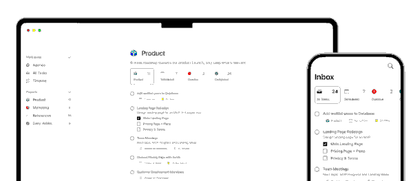
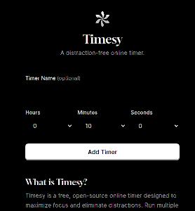
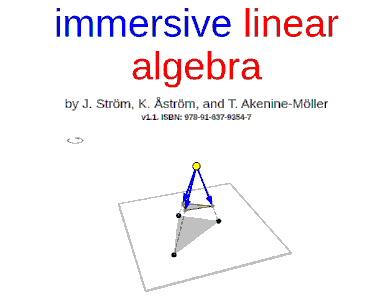
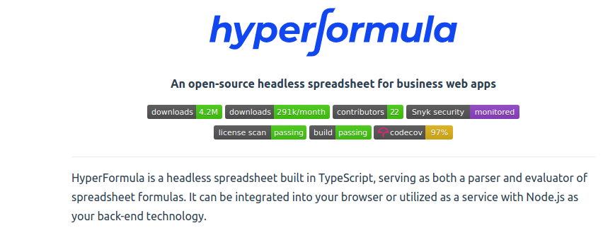
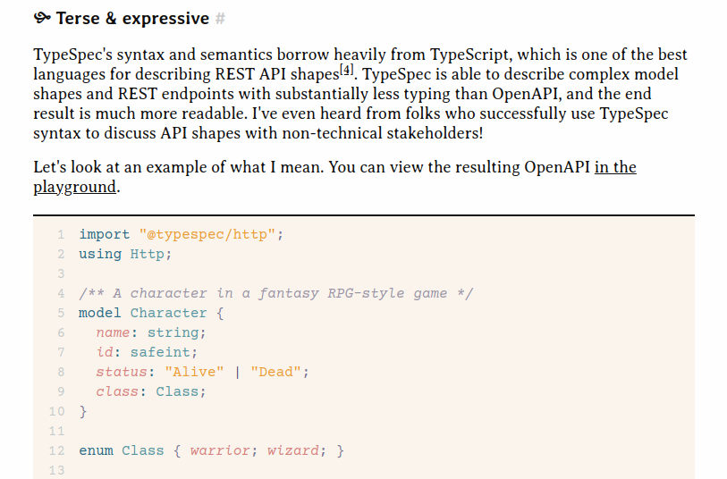
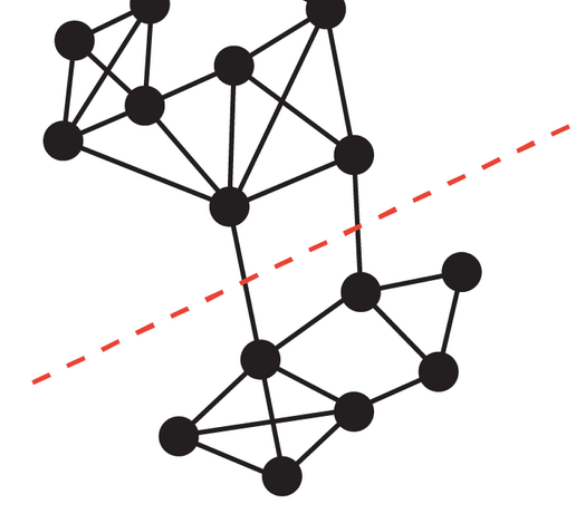
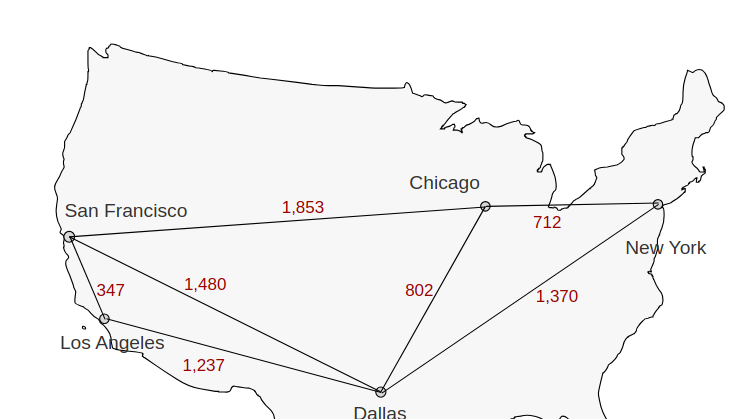
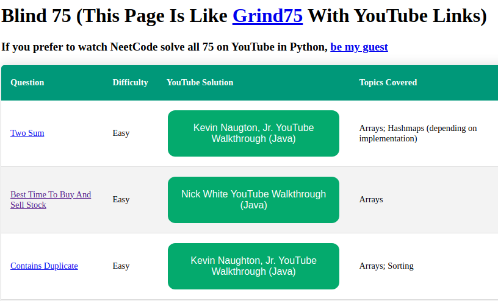
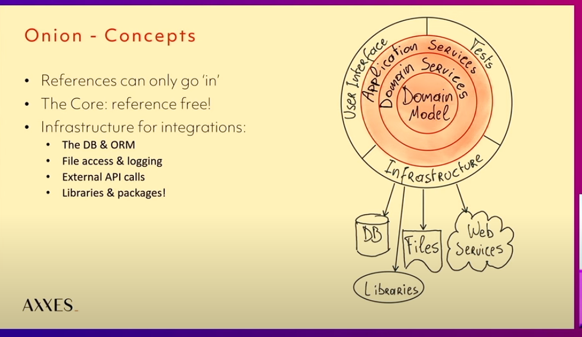

## Good ideas

2024-05-11 [SET.DO | AI-Powered To-do List That Gets Things Done](https://www.set.do/)

> SET.DO researches, schedules and organizes tasks for you. Spend time doing, not planning.
>
> 

2024-05-11 [Timesy: A Distraction-Free Online Timer](https://timesy.app/)

> 

## Fun

2024-05-12 [One Minute Park](https://oneminutepark.tv/)

> One Minute Park is a project offering one-minute videos of parks from around the world, aiming to eventually cover all minutes in a day. Users can contribute by filming 60-second park videos, ensuring steady, unedited footage, and uploading them. 
>
> 

## 

## Math!

2024-05-12 [Immersive Math](https://immersivemath.com/ila/index.html)

>  
>
>  [Preface](https://immersivemath.com/ila/ch00_preface/preface.html)
>
>  A few words about this book.
>
>  [Chapter 1: Introduction](https://immersivemath.com/ila/ch01_introduction/ch01.html)
>
>  How to navigate, notation, and a recap of some math that we think you already know.
>
>  [Chapter 2: Vectors](https://immersivemath.com/ila/ch02_vectors/ch02.html)
>
>  The concept of a vector is introduced, and we learn how to add and subtract vectors, and more.
>
>  [Chapter 3: The Dot Product](https://immersivemath.com/ila/ch03_dotproduct/ch03.html)
>
>  A powerful tool that takes two vectors and produces a scalar.
>
>  [Chapter 4: The Vector Product](https://immersivemath.com/ila/ch04_vectorproduct/ch04.html)
>
>  In three-dimensional spaces you can produce a vector from two other vectors using this tool.
>
>  [Chapter 5: Gaussian Elimination](https://immersivemath.com/ila/ch05_gausselim/ch05.html)
>
>  A way to solve systems of linear equations.
>
>  [Chapter 6: The Matrix](https://immersivemath.com/ila/ch06_matrices/ch06.html)
>
>  Enter the matrix.
>
>  [Chapter 7: Determinants](https://immersivemath.com/ila/ch07_determinants/ch07.html)
>
>  A fundamental property of square matrices.
>
>  [Chapter 8: Rank](https://immersivemath.com/ila/ch08_rank/ch08.html)
>
>  Discover the behaviour of matrices.
>
>  [Chapter 9: Linear Mappings](https://immersivemath.com/ila/ch09_linear_mappings/ch09.html)
>
>  Learn to harness the power of linearity...
>
>  [Chapter 10: Eigenvalues and Eigenvectors](https://immersivemath.com/ila/ch10_eigen/ch10.html)
>
>  This chapter has a value in itself.

## Web development

2024-04-19 [HyperFormula (v2.7.0)](https://hyperformula.handsontable.com/)

> Found in: https://javascriptweekly.com/issues/684
>
> HyperFormula is a headless spreadsheet built in TypeScript, serving as both a parser and evaluator of spreadsheet formulas. It can be integrated into your browser or utilized as a service with Node.js as your back-end technology.
>
> 

2024-03-28 [Write OpenAPI with TypeSpec](https://blog.trl.sn/blog/typespec-for-openapi/)

> Github: [microsoft/typespec](https://github.com/Microsoft/typespec)
>
> 

### 

## Algorithms

2024-03-28 [Binary array set](https://www.nayuki.io/page/binary-array-set)

> Despite the lack of deletion functionality, the data structure is still useful in applications that only add and test but don’t delete – for example, breadth-first search maintains an ever-growing set of visited nodes that shouldn’t be revisited. To compare time complexities with a popular alternative, a balanced binary search tree takes worst-case Θ(log n) time alike for adding, testing, or removing one element.

2024-04-19 [Visualizing Algorithms](https://bost.ocks.org/mike/algorithms/)

> Found in: https://javascriptweekly.com/issues/684
>
> This *fantastic* post is now ten years old, but I revisited it recently and it’s such a joy. Mike Bostock (of D3.js fame) visually guides us through some algorithms using both demos and code.
>
> 

2024-04-17 [Solving the minimum cut problem for undirected graphs](https://research.google/blog/solving-the-minimum-cut-problem-for-undirected-graphs/)

> In the study "Deterministic Near-Linear Time Minimum Cut in Weighted  Graphs," the new approach to solving the minimum cut problem in weighted graphs hinges on an advanced form of **cut-preserving graph sparsification**. This technique meticulously reduces the original graph into a sparser  version by strategically creating well-connected clusters of nodes that  align with potential minimum cuts. These clusters are then contracted  into single nodes, effectively simplifying the graph's complexity while  maintaining the integrity of its critical structural properties. This  method allows the algorithm to maintain deterministic accuracy and  operate efficiently, providing a significant improvement over previous  methods that were either limited to simpler graphs or relied on  probabilistic outcomes.
>
> 

2024-04-02 [Implementing Dijkstra's algorithm for finding the shortest path between two nodes using PriorityQueue in .NET 9](https://andrewlock.net/implementing-dijkstras-algorithm-for-finding-the-shortest-path-between-two-nodes-using-priorityqueue-in-dotnet-9/)

> 

## Interviews

2024-05-22 [14 Patterns to Ace Any Coding Interview Question | HackerNoon](https://hackernoon.com/14-patterns-to-ace-any-coding-interview-question-c5bb3357f6ed)

2024-05-17 [Software Engineer interviews: Everything you need to prepare | Tech Interview Handbook](https://www.techinterviewhandbook.org/software-engineering-interview-guide/)

2024-05-17 [Algorithms Course - Graph Theory Tutorial from a Google Engineer - YouTube](https://www.youtube.com/watch?v=09_LlHjoEiY)

2024-05-17 [Graph Algorithms for Technical Interviews - Full Course - YouTube](https://www.youtube.com/watch?v=tWVWeAqZ0WU)

2024-05-11 [How do you guys get good at DP? : r/leetcode](https://www.reddit.com/r/leetcode/comments/sv82tg/how_do_you_guys_get_good_at_dp/)

> 2024-05-11 [DP for Beginners  Problems | Patterns | Sample Solutions  - LeetCode Discuss](https://leetcode.com/discuss/study-guide/662866/DP-for-Beginners-Problems-or-Patterns-or-Sample-Solutions)
>
> 2024-05-11 [Dynamic Programming - Learn to Solve Algorithmic Problems & Coding Challenges - YouTube](https://www.youtube.com/watch?v=oBt53YbR9Kk) 5 hours of video
>
> 2024-05-11 [neetcode.io Practice](https://neetcode.io/practice) this is the list of problems to practice

2024-04-20 [Blind 75 - evansoohoo.github.io](https://evansoohoo.github.io/CollectionOfReallyGoodInterviewStuff/)

> 

🌟 2024-04-20 [Design Pinterest - TianPan.co](https://tianpan.co/notes/2016-02-13-crack-the-system-design-interview)

> Software Design common interview questions and answers

2024-04-20 [GitHub - donnemartin/system-design-primer: Learn how to design large-scale systems. Prep for the system design interview. Includes Anki flashcards.](https://github.com/donnemartin/system-design-primer)

2024-04-10 [The Amazon Leadership Principles - A Complete Interview Guide](https://www.scarletink.com/p/interviewing-at-amazon-leadership-principles)

> This article provides an in-depth guide to understanding and preparing for the behavioral interview process at Amazon, focusing on the 16 Amazon Leadership Principles. These principles are integral to Amazon's hiring process and are used to evaluate candidates across all levels and job families.
>
> **Amazon Leadership Culture**
>
> - **Decentralization:** Amazon operates with little centralization; each group functions like a startup, establishing its processes and best practices while adhering to the leadership principles.
> - **Bar Raisers:** A select group of experienced Amazonians who deeply understand the leadership principles and ensure that new hires align with them.
>
> **Understanding the Leadership Principles**
>
> - **Importance:** The leadership principles are used daily for hiring, feedback, and decision-making.
> - **Preparation:** Candidates should thoroughly understand and reflect on these principles to succeed in interviews.
>
>  **The 16 Amazon Leadership Principles**
>
> 1. **Customer Obsession:** Prioritizing customer needs and making decisions that benefit them, even at the expense of short-term profits.
> 2. **Ownership:** Thinking long-term, acting on behalf of the entire company, and taking responsibility for outcomes.
> 3. **Invent and Simplify:** Encouraging innovation and simplicity, and being open to ideas from anywhere.
> 4. **Are Right, A Lot:** Having good judgment and being open to diverse perspectives to challenge one's beliefs.
> 5. **Learn and Be Curious:** Continuously learning and exploring new possibilities.
> 6. **Hire and Develop the Best:** Focusing on raising performance bars and developing leaders within the organization.
> 7. **Insist on the Highest Standards:** Maintaining high standards and continually raising the bar for quality.
> 8. **Think Big:** Encouraging bold thinking and looking for ways to serve customers better.
> 9. **Bias for Action:** Valuing speed and taking calculated risks without extensive study.
> 10. **Frugality:** Accomplishing more with less and being resourceful.
> 11. **Earn Trust:** Listening attentively, speaking candidly, and treating others respectfully.
> 12. **Dive Deep:** Staying connected to details, auditing frequently, and being skeptical when metrics differ from anecdotes.
> 13. **Have Backbone; Disagree and Commit:** Challenging decisions respectfully and committing fully once a decision is made.
> 14. **Deliver Results:** Focusing on key business inputs, delivering with the right quality and in a timely manner.
> 15. **Strive to be Earth's Best Employer:** Creating a productive, diverse, and just work environment, leading with empathy, and focusing on employees' growth.
> 16. **Success and Scale Bring Broad Responsibility:** Recognizing the impact of Amazon's actions and striving to make better decisions for customers, employees, partners, and the world.

## Domain Design

2024-04-28 [Moving IO to the edges of your app: Functional Core, Imperative Shell - Scott Wlaschin - YouTube](https://www.youtube.com/watch?v=P1vES9AgfC4)

> 

2024-04-27 [Architecture Modernization: Aligning Software, Strategy, and Structure - Nick Tune - YouTube](https://www.youtube.com/watch?v=v9b0p0OMRqU)

> 

2024-04-27 [Hannes LowetteBuild software like a bag of marbles, not a castle of LEGO® - - YouTube](https://www.youtube.com/watch?v=voPASBjHPu8)

> 

## 
