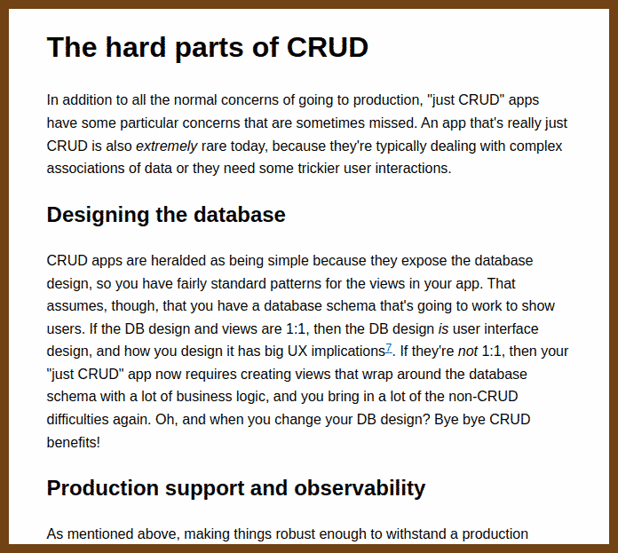
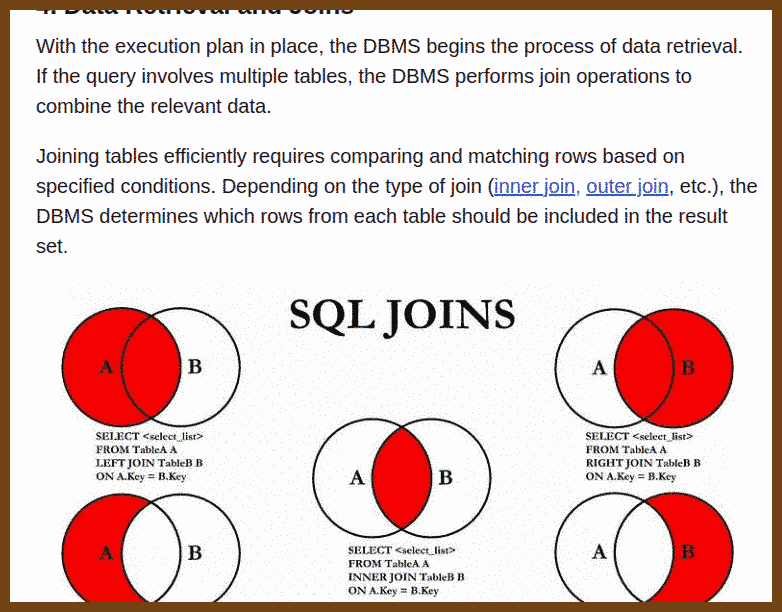
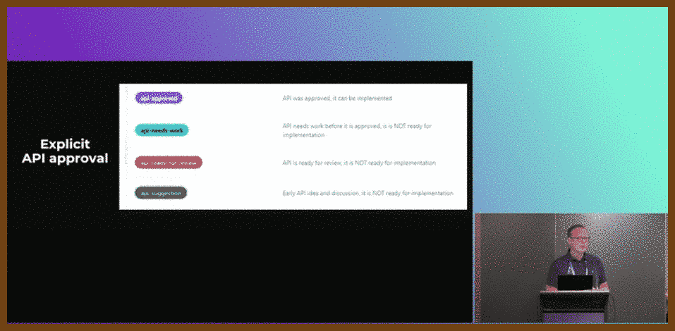
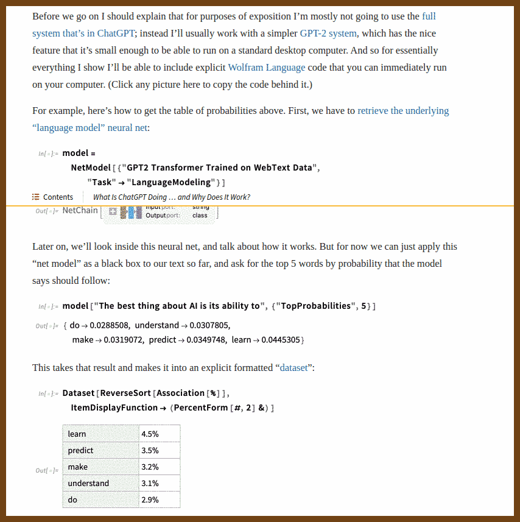
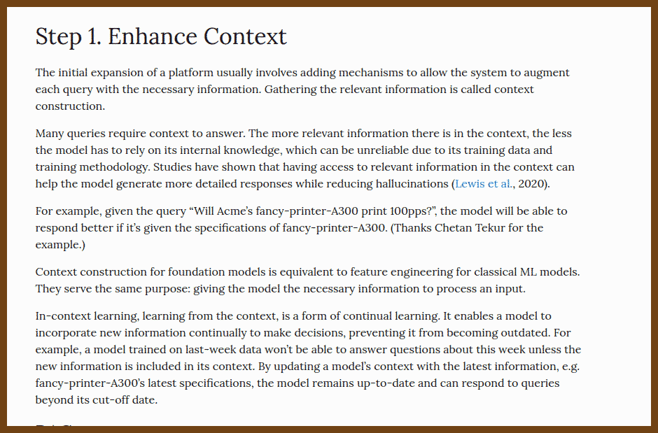

## 📚️ Good Reads

2024-06-16 ✏️  [How to Build Anything Extremely Quickly - Learn How To Learn](https://learnhowtolearn.org/how-to-build-extremely-quickly/)

>  found in  [programmingdigest](https://newsletter.programmingdigest.net/p/documentation-tradeoff/)Outline speedrunning algorithm:
>
>  1. Make an outline of the project
>
>  2. For each item in the outline, make an outline. Do this recursively until the items are small
>
>  3. Fill in each item as fast as possible
>
>     - You’ll get more momentum by speedrunning it, which feels great, and will make you even more productive
>
>     - **DO NOT PERFECT AS YOU GO**. This is a huge and common mistake.
>
>     - Finally, once completely done, go back and perfect
>
>     - Color the title text, figure out if buttons should have 5% or 6% border radius, etc
>
>     - Since you’re done, you’ll be less stressed, have a much clearer mind, and design your project better
>
>     - *And hey, you’ll enjoy the whole process more, and end up making more things over the long run, causing you to learn/grow more*

> 

2024-06-18 [A Long Guide to Giving a Short Academic Talk - Benjamin Noble](https://benjaminnoble.org/blog/short-talk)

> ### Anatomy of a Short Talk
>
> Short academic talks tend to follow a standard format:
>
> - Motivation of the general idea. This can take the form of an illustrative example from the real world or it can highlight a puzzle or gap in the existing scholarship.
> - Ask the research question and preview your answer.
> - A few brief references to the literature you’re speaking to.
> - Your theoretical innovation.
> - An overview of the data underlying the result.
> - Descriptive statistics (if relevant).
> - (Maybe the statistical approach or model, but only if it’s something impressive and/or non-standard. The less Greek the better.)
> - Statistical results IN FIGURE FORM! No regression tables please.
> - Conclusion that restates your main finding. Then, briefly reference your other results (which you have in your appendix slides and would be happy to discuss further in Q&A), and highlight the broader implications of your research.
>
> 

2024-06-26 [What's hidden behind "just implementation details" | nicole@web](https://ntietz.com/blog/whats-behind-just-implementation/)

> Found in  [Programming Digest: Always Measure One Level Deeper](https://newsletter.programmingdigest.net/p/always-measure-one-level-deeper/)
>
> 

2024-06-29 [A Bunch of Programming Advice I’d Give To Myself 15 Years Ago - Marcus' Blog](https://mbuffett.com/posts/programming-advice-younger-self/)

> **If you (or your team) are shooting yourselves in the foot constantly, fix the gun**
>
> Regularly identify and fix recurring issues in your workflow or codebase to simplify processes and reduce errors. Don't wait for an onboarding or major overhaul to address these problems.
>
> **Assess the trade-off you’re making between quality and pace, make sure it’s appropriate for your context**
>
> Evaluate the balance between speed and correctness based on the project's impact and environment. In non-critical applications, prioritize faster shipping and quicker fixes over exhaustive testing.
>
> **Spending time sharpening the axe is almost always worth it**
>
> Invest time in becoming proficient with your tools and environment. Learn shortcuts, become a fast typist, and know your editor and OS well. This efficiency pays off in the long run.
>
> **If you can’t easily explain why something is difficult, then it’s incidental complexity, which is probably worth addressing**
>
> Simplify or refactor complex code that can't be easily explained. This reduces future maintenance and makes your system more robust.
>
> **Try to solve bugs one layer deeper**
>
> Address the root cause of bugs rather than applying superficial fixes. This approach results in a cleaner, more maintainable system.
>
> **Don’t underestimate the value of digging into history to investigate some bugs**
>
> Use version control history to trace the origin of bugs. Tools like `git bisect` can be invaluable for pinpointing changes that introduced issues.
>
> **Bad code gives you feedback, perfect code doesn’t. Err on the side of writing bad code**
>
> Write code quickly to get feedback, even if it’s not perfect. This helps you learn where to focus your efforts and improves overall productivity.
>
> **Make debugging easier**
>
> Implement debugging aids such as user data replication, detailed tracing, and state debugging. These tools streamline the debugging process and reduce time spent on issues.
>
> **When working on a team, you should usually ask the question**
>
> Don’t hesitate to ask more experienced colleagues for help. It’s often more efficient than struggling alone and fosters a collaborative environment.
>
> **Shipping cadence matters a lot. Think hard about what will get you shipping quickly and often**
>
> Optimize your workflow to ensure frequent and fast releases. Simplify processes, use reusable patterns, and maintain a system free of excessive bugs to improve shipping speed.

2024-06-30 [How Does Facebook Manage to Serve Billions of Users Daily?](https://favtutor.com/articles/how-facebook-served-billions-of-requests/)

> Found in 2024-06-30 [Programming Digest: The Itanic Saga](https://newsletter.programmingdigest.net/p/itanic-saga)
>
> You might be wondering, “Well, can’t we just query the database to get the posts that should be shown in the feed of a user?”. Of course, we can – but it won’t be fast enough. The database is more like a warehouse, where the data is stored in a structured way. It’s optimized for storing and retrieving data, but not for serving data fast.
>
> The cache is more like a shelf, where the data is stored in a way that it can be retrieved quickly.

2024-07-15 [How To Know When It's Time To Go](https://thecodist.com/how-to-know-when-its-time-to-go/)

> Found in 2024-07-15 [Ten Years with Microservices :: Programming Digest](https://newsletter.programmingdigest.net/p/ten-years-microservices/)
>
> I retired in 2021 after 40 years as a programmer, not because I couldn't keep up but because I lost interest. Careers evolve, and everyone eventually reaches a point where they can no longer continue as they have. This isn't just about retirement; it can happen anytime. Some people become obsolete due to outdated technology, lose passion, or are forced out by market changes.
>
> Sustaining a long programming career is challenging due to rapid technological shifts. Many of my peers either moved into management or became obsolete. It's essential to be honest with yourself about your ability to keep up and your job satisfaction. Sometimes, leaving programming or transitioning to a different field can bring greater fulfillment.
>
> > "Are you keeping up to date sufficiently to continue the job? Is the job even interesting anymore, or is there something else you would rather do?"
>
> Making informed career decisions is crucial. Age and ability are not necessarily correlated, and personal fulfillment should take priority over financial reasons. Even in retirement, I continue to write code for my generative art practice, finding joy in the complexity and creativity it offers.
>
> > "Programming can be a fun career, a horrible nightmare, or something in between, and it never stands still."
>
> Evaluate your career honestly, be open to change, and explore new opportunities when the current path no longer suits you.

2024-07-18 ‼️ [Panic! at the Tech Job Market](https://matt.sh/panic-at-the-job-market) ‼️

> Warning! This post is too long, but pleasant to read. I actually used Microsoft Edge TTS to read it and spent 2 good hours. 
>
> “I have the two qualities you require to see absolute truth: I am brilliant and unloved.”
>
> "By the power of drawing two lines, we see correlation is causation and you can’t argue otherwise: interest rates go up, jobs go down."
>
> "Nepo companies are the most frustrating because they suck up all the media attention for being outsized celebrity driven fads."
>
> "Initial growth companies are the worst combination of high-risk, low-reward effort-vs-compensation tradeoffs."
>
> "Modern tech hiring... has become a game divorced from meaningfully judging individual experience and impact."
>
> "You must always open your brain live in front of people to dump out immediate answer to a series of pointless problems."
>
> "Your job is physically impossible. You will always feel drained and incompetent because you can’t actually do everything everyday."
>
> "AWS isn’t hands off 'zero-experience needed magic cloud'; AWS is actually 'datacenter as a service.'"
>
> "The company thought they had 10,000 users per day... but my internal metrics showed only 300 users per day actually used the backend APIs."
>
> "Most interview processes don’t even consider a person’s actual work and experience and capability."
>
> "At some point, a switch flipped in the tech job market and 'programmer jobs' just turned into zero-agency task-by-task roles working on other people’s ideas under other people’s priorities to accomplish other people’s goals."

## 🎯 How the things work?

2024-07-15 [How SQL Query works? SQL Query Execution Order for Tech Interview - DEV Community](https://dev.to/somadevtoo/how-sql-query-works-sql-query-execution-order-for-tech-interview-15kb/)

> Found in 2024-07-15 [Ten Years with Microservices :: Programming Digest](https://newsletter.programmingdigest.net/p/ten-years-microservices/)
>
> 

## 📢 Good Talks 

2024-07-13 [What you can learn from an open-source project with 300 million downloads - Dennis Doomen - YouTube](https://www.youtube.com/watch?v=2M-BjisewQI)

> 
>
> Best Practices for Maintaining Fluent Assertions and Efficient Project Development
>
> This talk covers effective techniques and tools for maintaining fluent assertions and managing development projects efficiently. It explores the use of GitHub for version control, emphasizing templates, change logs, and semantic versioning. The speaker also shares insights on tools like Slack, GitKraken, PowerShell, and more, highlighting their roles in streamlining workflows, ensuring code quality, and enhancing collaboration. Ideal for developers and project managers aiming to optimize their development processes and maintain high standards in their projects.

> Tools discussed:
>
> Project Management and Collaboration Tools
>
> **[GitHub](https://github.com/)**: GitHub hosts repositories, tracks issues, and integrates with various tools for maintaining projects. It supports version control and collaboration on code, providing features like pull requests, branch management, and GitHub Actions for CI/CD. Example output: Issues, pull requests, repository branches.
>
> Development and Scripting Tools
>
> **Windows Terminal**: Windows Terminal integrates various command-line interfaces like PowerShell and Bash into a single application, allowing for a seamless command-line experience. Example output: Command outputs from PowerShell, CMD, and Bash.
>
> **[PowerShell](https://docs.microsoft.com/en-us/powershell/)**: PowerShell is a scripting and automation framework from Microsoft, offering a command-line shell and scripting language for system management and automation tasks. Example output: Script execution results, system management tasks.
>
> **[PSReadLine](https://github.com/PowerShell/PSReadLine)**: PSReadLine enhances the PowerShell command-line experience with features like syntax highlighting, history, and better keyboard navigation. Example output: Enhanced command history navigation, syntax-highlighted command input.
>
> **[vors/ZLocation: ZLocation](https://github.com/vors/ZLocation)**: Z Location is a command-line tool that allows quick navigation to frequently accessed directories by typing partial directory names. Example output: Instantly switching to a frequently used directory.
>
> Git and Version Control Tools
>
> **[GitHub Flow Like a Pro with these 13 Git Aliases | You’ve Been Haacked](https://haacked.com/archive/2014/07/28/github-flow-aliases/)**: Git Extensions/Aliases simplify Git command-line usage by providing shorthand commands and scripts to streamline common Git tasks. Example output: Simplified Git commands like `git lg` for a condensed log view.
>
> **[GitKraken](https://www.gitkraken.com/)**: GitKraken is a graphical interface for Git that provides a visual overview of your repository, including branches, commits, and merges, making it easier to manage complex Git workflows. Example output: Visual representation of branch history and commit graphs.
>
> **[JetBrains Rider](https://www.jetbrains.com/rider/)**: JetBrains Rider is an IDE specifically designed for .NET development, providing advanced coding assistance, refactoring, and debugging features to enhance productivity. Example output: Code completion suggestions, integrated debugging sessions.
>
> Code Quality and Formatting Tools
>
> **[EditorConfig](https://editorconfig.org/)**: EditorConfig helps maintain consistent coding styles across different editors and IDEs by defining coding conventions in a simple configuration file. Example output: Automatically formatted code based on `.editorconfig` settings.
>
> **[Sergio0694/PolySharp](https://github.com/Sergio0694/PolySharp)**: PolySharp allows the use of newer C# syntax features in older .NET versions, enabling modern coding practices in legacy projects. Example output: Code using new C# syntax features in older .NET environments.
>
> Build and Deployment Tools
>
> **[Nuke](https://nuke.build/)**: Nuke is a build automation system for .NET that uses C# for defining build steps and pipelines, providing flexibility and type safety. Example output: Automated build and deployment steps written in C#.
>
> **[GitVersion](https://gitversion.net/)**: GitVersion generates version numbers based on Git history, branch names, and tags, ensuring consistent and semantically correct versioning. Example output: Semantic version numbers automatically updated in the project.
>
> Dependency Management and Security Tools
>
> **[Dependabot](https://github.com/dependabot)**: Dependabot automatically scans repositories for outdated dependencies and creates pull requests to update them, helping to keep dependencies up to date and secure. Example output: Pull requests for dependency updates with detailed change logs.
>
> **[CodeQL](https://securitylab.github.com/tools/codeql/)**: CodeQL is a code analysis tool integrated with GitHub that scans code for security vulnerabilities and other issues, providing detailed reports and alerts. Example output: Security alerts and code scanning reports.
>
> Testing and Benchmarking Tools
>
> **[Stryker.NET](https://stryker-mutator.io/)**: Stryker.NET is a mutation testing tool for .NET that modifies code to check if tests detect the changes, ensuring comprehensive test coverage. Example output: Mutation testing reports showing test effectiveness.
>
> **[ArchUnit](https://www.archunit.org/)**: ArchUnit checks architecture rules in Java projects, ensuring that dependencies and structure conform to specified rules. (Similar tools exist for .NET). Example output: Reports on architecture rule violations.
>
> Documentation Tools
>
> **[Docusaurus](https://docusaurus.io/)**: Docusaurus helps build project documentation websites easily, providing a platform for creating and maintaining interactive, static documentation. Example output: Interactive documentation websites generated from markdown files.
>
> Miscellaneous Tools
>
> **[CSpell](https://www.npmjs.com/package/cspell)**: CSpell is an NPM package used for spell checking in code projects, ensuring textual accuracy in code comments, strings, and documentation. Example output: Spell check reports highlighting errors and suggestions.

2024-07-14 [Failure & Change: Principles of Reliable Systems • Mark Hibberd • YOW! 2018 - YouTube](https://www.youtube.com/watch?v=VgDIpEMZenk)

> 
>
> Mark Hibberd's talk "Failure & Change: Principles of **Reliable Systems**" at YOW! 2018 explores building and operating **reliable software systems**, focusing on understanding and managing **failures** in **complex and large-scale systems**.
>
> **Reliability** is defined as consistently performing well. Using **airline engines** as an example, Hibberd illustrates how opting for fewer engines can sometimes be safer due to lower **failure probability** and fewer **knock-on effects**. The key is to control the **scope** and **consequences of failures**.
>
> > "We need to be resilient to failure by controlling the scope and consequences of our failure."
>
> **Redundancy** and **independence** are crucial. Redundancy should be managed carefully to maintain reliability, avoiding tightly coupled systems where a single failure can cascade into multiple failures. **Service granularity** helps manage failures effectively by breaking down systems into smaller, independent services, each handling specific responsibilities and passing values around to maintain independence.
>
> > "Service granularity gives us this opportunity to trade the likelihood of a failure for the consequences of a failure."
>
> In operations, it's essential to implement **health checks** and **monitoring** to detect failures early and **route around them aggressively** to prevent overload and cascading failures. Using **circuit breakers** to cut off communication to failing services allows them to recover.
>
> Designing systems with **independent services** is key. Services should operate independently, using shared values rather than shared states or dependencies. For example, an online chess service can be broken down into services for **pairing**, **playing**, **history**, and **analysis**, each maintaining independence.
>
> Operational strategies include implementing **timeouts** and **retries** to handle slow responses and prevent overloads, and deploying new versions gradually to test against real traffic and verify responses. **Proxies** can interact with unreliable code to maintain a reliable view of data.
>
> > "Timeouts are so important that we probably should have some sort of government-sponsored public service announcement."
>
> **Handling change** in complex systems involves accommodating changes without significant disruptions through continuous deployment and rolling updates. Techniques like **in-production verification** and routing requests to both old and new versions during deployment help ensure reliability.
>
> **Data management** is also crucial. Separating data storage from application logic helps maintain reliability during changes. Avoid coupling data handling directly with services to facilitate easier updates and rollbacks.
>
> > "We want to create situations where we can gracefully roll things out and flatten out this time dimension."
>
> Hibberd emphasizes making informed trade-offs in **architecture**, **redundancy**, and **granularity** to enhance the reliability of software systems. Continuous monitoring, strategic failure handling, and incremental deployment are essential to ensure systems remain resilient and reliable despite inevitable failures and changes.

## 🤖 The Era of AI

2024-07-01 [The limitations of LLMs, or why are we doing RAG? | EDB](https://www.enterprisedb.com/blog/limitations-llm-or-why-are-we-doing-rag)

>
>
>Despite powerful capabilities with many tasks, Large Language Models (LLMs) are not know-it-alls. If you've used ChatGPT or other models, you'll have experienced how they can’t reasonably answer questions about proprietary information. What’s worse, it isn’t just that they don't know about proprietary information, they are unaware of their own limitations and, even if they were aware, they don’t have access to proprietary information. That's where options like Retrieval Augmented Generation (RAG) come in and give LLMs the ability to incorporate new and proprietary information into their answers.

2024-06-18 [What Is ChatGPT Doing … and Why Does It Work?—Stephen Wolfram Writings](https://writings.stephenwolfram.com/2023/02/what-is-chatgpt-doing-and-why-does-it-work/) { writings.stephenwolfram.com }

> 
>
> **It’s Just Adding One Word at a Time**
> That ChatGPT can automatically generate something that reads even superficially like human-written text is remarkable, and unexpected. But how does it do it? And why does it work? My purpose here is to give a rough outline of what’s going on inside ChatGPT—and then to explore why it is that it can do so well in producing what we might consider to be meaningful text. I should say at the outset that I’m going to focus on the big picture of what’s going on—and while I’ll mention some engineering details, I won’t get deeply into them. (And the essence of what I’ll say applies just as well to other current “large language models” [LLMs] as to ChatGPT.)
>
> The first thing to explain is that what ChatGPT is always fundamentally trying to do is to produce a “reasonable continuation” of whatever text it’s got so far, where by “reasonable” we mean “what one might expect someone to write after seeing what people have written on billions of webpages, etc.”

2024-06-22 [Practical Applications of Generative AI: How to Sprinkle a Little AI in Your App - Phil Haack - YouTube](https://www.youtube.com/watch?v=OxHw_u45h7M)

> **Be Positive**
>
> - ✅ Do this: "Explain how to implement a sorting algorithm."
> - ❌ Don't do this: "Don't talk about unrelated algorithms."
> - *Example*: Nike was on the right track when they said, "Just do it." Telling a prompt what not to do can lead it to do just that.
>
> **Give the Model an Out**
>
> - ✅ Do this: "If you don't know the answer, it's okay to say 'I don't know.'"
> - ❌ Don't do this: "You must provide an answer for every question."
> - *Let the model say 'I don’t know' to reduce hallucinations.*
>
> **Break Complex Tasks into Subtasks**
>
> - ✅ Do this: "Write three statements for and against using AI in education. Then use those statements to write an essay."
> - ❌ Don't do this: "Write an essay on AI in education."
> - *Example*: For an essay, ask the AI to write three statements for and against a point. Then have it use those statements to write the essay.
>
> **Ask for Its Chain of Thought**
>
> - ✅ Do this: "Explain why you think using AI can improve customer service."
> - ❌ Don't do this: "Just tell me how AI can improve customer service without any explanation."
> - *Ask it to explain its reasoning. Lately, it seems GPT-4 does this automatically.*
>
> **Check the Model’s Comprehension**
>
> - ✅ Do this: "Do you understand the task of generating a summary of this article?"
> - ❌ Don't do this: "Summarize this article without confirming if you understood the task."
> - *"Do you understand the task?"*

**Links**

> - [AI Demo](https://github.com/haacked/ai-demo) github.com/haacked
> - [Inside GPT — I: Understanding the text generation](https://bit.ly/3QcM5Hj)
> - [GPT Tokenizer](https://observablehq.com/@simonw/gpt-tokenizer) @simonw
> - [Open AI Playground](https://platform.openai.com/playground) platform.openai.com
> - [How GPT works](https://bea.stollnitz.com/blog/how-gpt-works-technical/) bea.stollnitz.com
> - [pgvector-dotnet](https://github.com/pgvector/pgvector-dotnet) github.com/pgvector
> - [Embeddings](https://platform.openai.com/docs/guides/embeddings/what-are-embeddings) platform.openai.com
> - [Wolfram](https://writings.stephenwolfram.com/2023/02/what-is-chatgpt-doing-and-why-does-it-work/) writings.stephenwolfram.com

2024-07-31 [Building A Generative AI Platform](https://huyenchip.com//2024/07/25/genai-platform.html/)

> 
>
> (found in 2024-07-31 [Programming Digest](https://newsletter.programmingdigest.net/))
>
> After studying how companies deploy generative AI applications, I noticed many similarities in their platforms. This post outlines the common components of a generative AI platform, what they do, and how they are implemented. I try my best to keep the architecture general, but certain applications might deviate. This is what the overall architecture looks like.

2024-08-05 📌 [How I Use "AI"](https://nicholas.carlini.com/writing/2024/how-i-use-ai.html) (nicholas.carlini.com)

> 
>
> - To build complete applications for me
> - As a tutor for new technologies
> - To get started with new projects
> - To simplify code
> - For monotonous tasks
> - To make every user a "power user"
> - As an API reference
