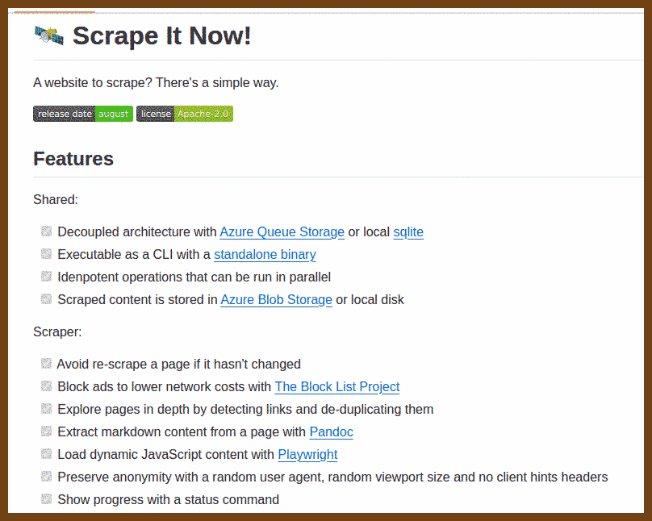
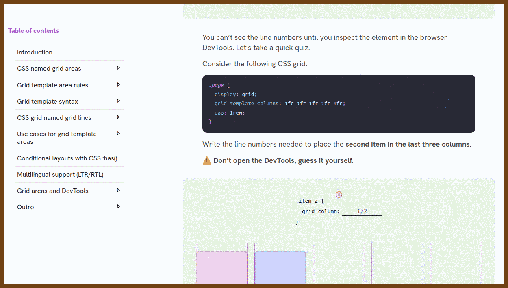
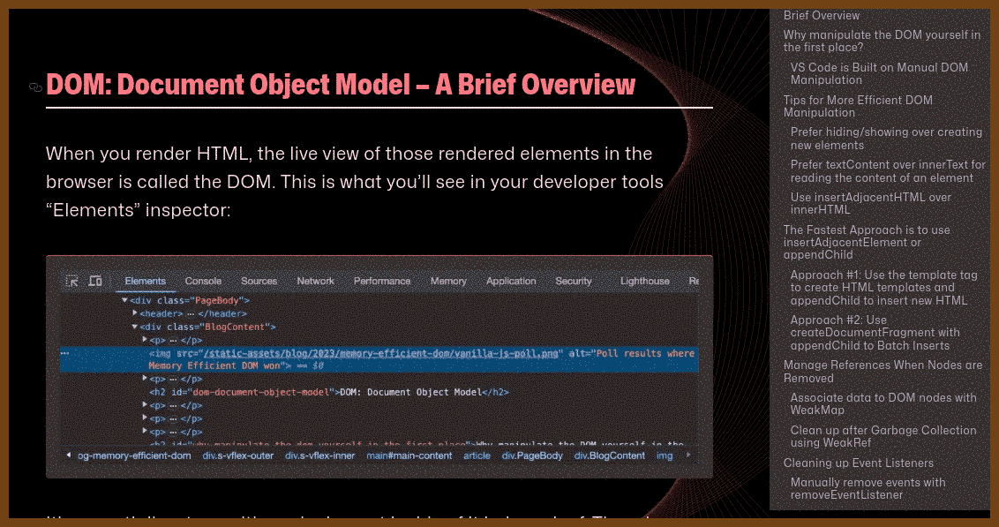
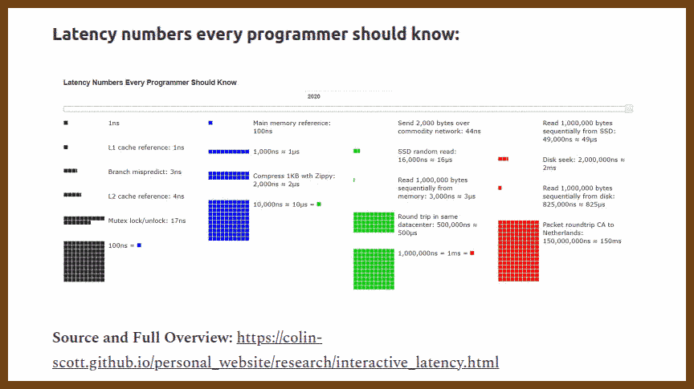
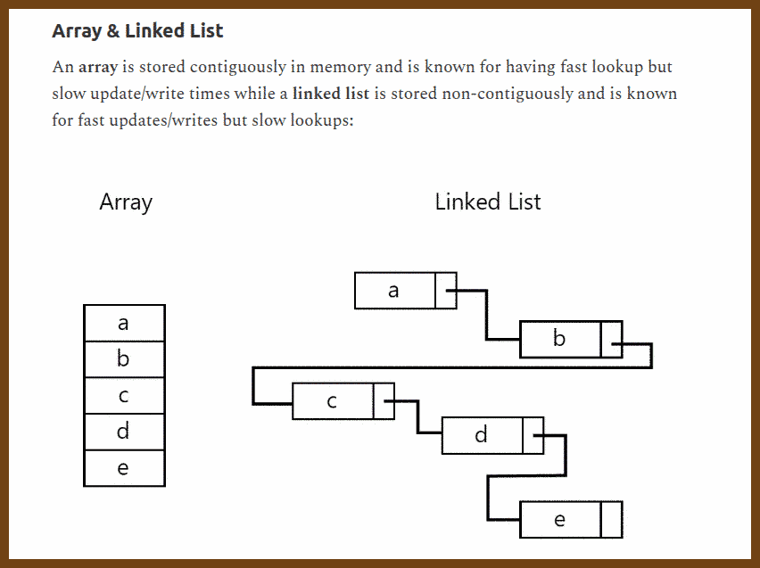
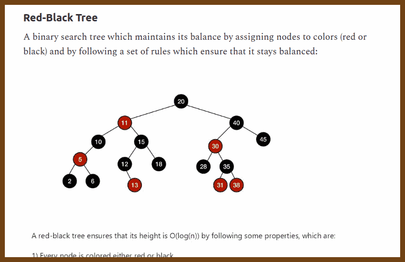

## Newsletters

2024-08-26 [JavaScript Weekly Issue 701: August 22, 2024](https://javascriptweekly.com/issues/701) { javascriptweekly.com }


## Good Reads 

2024-08-26 ⭐️ [On Writing Well | nikhil.bafna](https://zodvik.com/posts/on-writing-well/) { zodvik.com }


## Tech Talks

2024-08-30 [Messaging: The fine line between awesome and awful - Laila Bougria - NDC Oslo 2024 - YouTube](https://www.youtube.com/watch?v=phAaF6OGjKY) { www.youtube.com }


> Here's a digest of the talk:
>
> I started with a light-hearted introduction about my cultural background and how it relates to having a siesta after lunch, which isn’t an option today since I'm giving this talk. About a decade ago, I was working on a project where we were building a retail system from scratch for a client. Initially, we created a **monolithic architecture**, which worked well for a while. However, as the business grew, we faced challenges. We saw increased demand and the architecture started showing its limitations. We experienced issues like **failed requests, high strain on the database**, and even system crashes.
>
> Given the new demands, we decided to evolve our architecture by moving to a **message-based system**. We hoped this would solve our problems by improving performance, increasing resilience, and allowing easier scaling. However, we quickly realized that the transition wasn’t as smooth as expected. Instead of getting faster, the system became slower, and we started experiencing issues with **UI inconsistency**. Customers reported cases where the system didn't reflect their actions, leading to confusion and a poor user experience. We also encountered **duplicate messages and messages arriving out of order**, which led to significant failures and side effects in the system.
>
> One critical lesson we learned was the importance of understanding the **shift from synchronous to asynchronous communication**. In a synchronous system, there's a direct, immediate response. But in an asynchronous system, messages might take a while to process, leading to delays and out-of-order execution. This can cause unexpected behaviors in the system, making troubleshooting a lot more challenging.
>
> To address the issues with **communication patterns**, we explored different messaging patterns like **one-way communication, request-response, and publish-subscribe**. Each has its use case, but we learned that choosing the right pattern is crucial for system stability. For instance, publish-subscribe can be overused, leading to what I call the "passive-aggressive publisher" problem, where a service publishes an event expecting others to act on it, but without direct control, this can cause problems.
>
> A key takeaway is that **decoupling** doesn’t happen automatically in a message-based system. It requires deliberate effort to identify service boundaries and manage coupling properly. When splitting a monolith, it’s crucial to ask the right questions about the domain and not just accept the default ordering of processes. For example, questioning whether the order in which tasks are executed is necessary can help in finding opportunities for parallel execution, thereby improving efficiency.
>
> We also found that managing **SLA (Service Level Agreements)** became essential in an asynchronous environment. We started using **delayed messages** to ensure that tasks were completed within an acceptable time frame. This helped us recover gracefully from both technical and business failures, like handling payment processing delays or credit card issues.
>
> In the end, it’s not just about transitioning to a new architecture but about understanding the trade-offs and challenges that come with it. The key is to balance the benefits of decoupling with the need to maintain order and consistency in the system. By carefully choosing the right communication patterns and managing the inevitable coupling, we can build systems that are both scalable and resilient, even in the face of growing demand.
>
> This journey taught us that evolving a system architecture isn’t just about adopting new technologies but also about adapting our approach to fit the new reality. And sometimes, the lessons learned the hard way are the most valuable ones.
>
> > “One of the things we also observed is that sometimes we would receive duplicate messages, and the thing is, we didn’t really account for that. So that’s when we started to see failures and even side effects sometimes.”
>
> > “If you need a response with any data to continue when you publish an event—no. Then again, passive-aggressive communication and finally if you need any control over who receives or subscribes to that event—also not a good fit.”
>
> The talk emphasizes the importance of thoughtful architecture decisions, especially when transitioning to a message-based system, and the need for continuous collaboration with business stakeholders to align the system’s behavior with business requirements.


## Not a financial advise 

2024-08-30 [Ditch Banks — Go With Money Market Funds and Treasuries](https://thefinancebuff.com/goodbye-banks-credit-unions.html) { thefinancebuff.com }

> 2024-08-30 [Ditch banks – Go with money market funds and treasuries | Hacker News](https://news.ycombinator.com/item?id=41262439) { news.ycombinator.com }


 

## Inspiration

2024-08-30 [YTCH](https://ytch.xyz/) { ytch.xyz }

>  https://news.ycombinator.com/item?id=41247023
> If YouTube had actual channels


2024-08-30 [GlyphDrawing.Club -blog](https://blog.glyphdrawing.club/font-with-built-in-syntax-highlighting/) { blog.glyphdrawing.club }


2024-08-30 [Vanilla JSX](https://vanillajsx.com/) { vanillajsx.com }

> 2024-08-30 [VanillaJSX.com | Hacker News](https://news.ycombinator.com/item?id=41269321) { news.ycombinator.com }


2024-08-30 [Blender Shortcuts](https://hollisbrown.github.io/blendershortcuts/) { hollisbrown.github.io }


## 🏴‍☠️ Borrow it!

2024-08-30 [clemlesne/scrape-it-now: A website to scrape? There's a simple way.](https://github.com/clemlesne/scrape-it-now) { github.com }



> ⭐️ Simplify HTML / Reader view 
>
> 2024-08-30 [aaronsw/html2text: Convert HTML to Markdown-formatted text.](https://github.com/aaronsw/html2text) { github.com }

2024-08-30 [Tracking supermarket prices with playwright](https://www.sakisv.net/2024/08/tracking-supermarket-prices-playwright/) { www.sakisv.net }


## The Era of AI

2024-08-26 [chartdb/chartdb: Free and Open-source database diagrams editor, visualize and design your DB with a single query.](https://github.com/chartdb/chartdb) { github.com }

> Open-source database diagrams editor
> No installations • No Database password required.


2024-08-30 [Deep Live Cam: Real-Time Face Swapping and One-Click Video Deepfake Tool](https://deeplive.cam/) { deeplive.cam }

> 
>
> 


## WebDev

### Charts

2024-08-26 [Let’s Make A Bar Chart Tutorial | Vega](https://vega.github.io/vega/tutorials/bar-chart/) { vega.github.io }

> 

### CSS

2024-08-30 [CSS Grid Areas](https://ishadeed.com/article/css-grid-area/) { ishadeed.com }




### Keyboard / Game Pad

2024-08-26 [jamiebuilds/tinykeys: A tiny (~650 B) & modern library for keybindings.](https://github.com/jamiebuilds/tinykeys) { github.com }

> A tiny (~650 B) & modern library for keybindings. [See Demo](https://jamiebuilds.github.io/tinykeys/)

```js
import { tinykeys } from "tinykeys" // Or `window.tinykeys` using the CDN version

tinykeys(window, {
  "Shift+D": () => {
    alert("The 'Shift' and 'd' keys were pressed at the same time")
  },
  "y e e t": () => {
    alert("The keys 'y', 'e', 'e', and 't' were pressed in order")
  },
  "$mod+([0-9])": event => {
    event.preventDefault()
    alert(`Either 'Control+${event.key}' or 'Meta+${event.key}' were pressed`)
  },
})

```

2024-08-30 [alvaromontoro/gamecontroller.js: A JavaScript library that lets you handle, configure, and use gamepads and controllers on a browser, using the Gamepad API](https://github.com/alvaromontoro/gamecontroller.js/) { github.com }


### Styles

2024-08-26 [Newspaper Style Design](https://codepen.io/silkine/pen/QWBxVX) { codepen.io }


### JavaScript / DOM

2024-08-30 [Patterns for Memory Efficient DOM Manipulation with Modern Vanilla JavaScript – Frontend Masters Boost](https://frontendmasters.com/blog/patterns-for-memory-efficient-dom-manipulation/) { frontendmasters.com }



> This article focuses on optimizing **DOM manipulation** using modern vanilla JavaScript to enhance performance and reduce memory usage in web applications. Understanding and applying these low-level techniques can be crucial in scenarios where performance is a priority, such as in large projects like **Visual Studio Code**, which relies heavily on manual DOM manipulation for efficiency.
>
> The article begins with an overview of the **Document Object Model (DOM)**, explaining that it is a tree-like structure where each HTML element represents a node. The common DOM APIs like `querySelector()`, `createElement()`, and `appendChild()` are introduced, emphasizing that while frameworks like React or Angular abstract these details, knowing how to manipulate the DOM directly can lead to performance gains.
>
> A significant point is the **trade-off between using frameworks and manual DOM manipulation**. While frameworks simplify development, they can also introduce performance overhead through unnecessary re-renders and excessive memory usage. The article argues that in performance-critical applications, direct DOM manipulation can prevent these issues by reducing the garbage collector's workload.
>
> To optimize DOM manipulation, several tips are provided:
>
> - **Hiding or showing elements** is preferred over creating and destroying them dynamically. This approach keeps the DOM more static, leading to fewer garbage collection calls and reduced client-side logic complexity.
> - For example, instead of dynamically creating an element with JavaScript, it’s more efficient to **toggle its visibility** with classes (`el.classList.add('show')` or `el.style.display = 'block'`).
>
> Other techniques discussed include:
>
> - Using **`textContent` instead of `innerText`** for reading content from elements, as it is faster and avoids forcing a reflow.
> - **`insertAdjacentHTML`** is preferred over `innerHTML` because it inserts content without destroying existing DOM elements first.
> - For the fastest performance, the **`<template>` tag** combined with **`appendChild`** or **`insertAdjacentElement`** is recommended for creating and inserting new DOM elements efficiently.
>
> The article also covers advanced techniques for managing memory:
>
> - **`WeakMap` and `WeakRef`** are used to avoid memory leaks by ensuring that references to DOM nodes are properly garbage collected when the nodes are removed from the DOM.
> - Proper cleanup of event listeners is emphasized, including methods like **`removeEventListener`**, using the **`once`** parameter, and employing **event delegation** to minimize the number of event listeners in dynamic components.
>
> For handling multiple event listeners, the **`AbortController`** is introduced as a method to unbind groups of events easily. This can be particularly useful when needing to clean up or cancel multiple event listeners at once.
>
> The article wraps up with **profiling and debugging** advice. It recommends using Chrome DevTools for memory profiling and JavaScript execution time analysis to ensure that DOM operations do not lead to performance bottlenecks or memory leaks.
>
> > "Efficient DOM manipulation isn’t just about using the right methods—it’s also about understanding when and how often you’re interacting with the DOM."
>
> The key takeaway is that while frameworks provide convenience, understanding and utilizing these low-level DOM manipulation techniques can significantly enhance the performance of web applications, particularly in performance-sensitive scenarios.


### TypeScript

2024-08-26 [gruhn/typescript-sudoku: Playing Sudoku in TypeScript while the type checker highlights mistakes.](https://github.com/gruhn/typescript-sudoku) { github.com }


## Markdown

2024-08-26 [Getting Started | Milkdown](https://milkdown.dev/docs/guide/getting-started) { milkdown.dev }


> - 📝 **WYSIWYG Markdown** - Write markdown in an elegant way
> - 🎨 **Themable** - Create your own theme and publish it as an npm package
> - 🎮 **Hackable** - Create your own plugin to support your awesome idea
> - 🦾 **Reliable** - Built on top of [prosemirror](https://prosemirror.net/) and [remark](https://github.com/remarkjs/remark)
> - ⚡ **Slash & Tooltip** - Write faster than ever, enabled by a plugin.
> - 🧮 **Math** - LaTeX math equations support via math plugin
> - 📊 **Table** - Table support with fluent ui, via table plugin
> - 🍻 **Collaborate** - Shared editing support with [yjs](https://docs.yjs.dev/)
> - 💾 **Clipboard** - Support copy and paste markdown, via clipboard plugin
> - 👍 **Emoji** - Support emoji shortcut and picker, via emoji plugin


## SteamDeck

2024-08-30 [mikeroyal/Steam-Deck-Guide: Steam Deck Guide. Learn all about the Tools, Accessories, Games, Emulators, and Gaming Tips that will make your Steam Deck an awesome Gaming Handheld or a Portable Computer Workstation.](https://github.com/mikeroyal/Steam-Deck-Guide) { github.com }


## Job interview Prep

2024-08-30 [Visual Data Structures Cheat-Sheet - by Nick M](https://photonlines.substack.com/p/visual-data-structures-cheat-sheet) { photonlines.substack.com }









## Workplace 

2024-08-30 [The Science of Well-Being | Coursera](https://www.coursera.org/learn/the-science-of-well-being/) { www.coursera.org }


> The Science of Well-Being course by Yale University challenges common assumptions about **happiness** and teaches **evidence-based strategies** for improving well-being.
>
> It explains that **external factors** like wealth have less impact on long-term happiness than we often believe.
>
> **Hedonic adaptation** shows that people quickly return to a baseline level of happiness after changes in their lives, highlighting the need for sustainable sources of well-being.
>
> Practices like **gratitude**, **mindfulness**, and **meditation** are introduced to help shift focus and improve emotional regulation.
>
> The course emphasizes the importance of **social connections** and forming **healthy habits** as key components of happiness.


2024-08-30 [Your life, your volume | Loop Earplugs](https://www.loopearplugs.com/) { www.loopearplugs.com }

> Unfortunately, not a sponsored content. Seriously my colleague, Lisi, recommended these.  


### Burnout 

> Burnout can manifest in different ways depending on the underlying causes. Here’s an expanded explanation of the two types of burnout mentioned:
>
> ### 1. Burnout from Boredom and Routine:
>
> This type of burnout occurs when tasks become monotonous, and there’s a lack of challenge or variety in the work. Over time, this can lead to a sense of disengagement and apathy.
>
> #### Tips to Mitigate This Type of Burnout:
>
> - Introduce Variety: Rotate tasks, take on new projects, or explore different aspects of your role to break the monotony.
> - Set Personal Goals: Establishing new challenges or learning opportunities can reinvigorate your sense of purpose.
> - Take Breaks: Step away from work periodically to reset your mind and come back with fresh energy.
> - Seek Feedback: Regularly ask for feedback to ensure you’re growing and improving in your role, which can make work more engaging.
> - Incorporate Creativity: Find ways to add a creative touch to your work, even in routine tasks, to make them more interesting.
>
> ### 2. Burnout from Too Many Changes and Uncertainty:
>
> This type of burnout arises when there’s a constant state of flux, leading to stress and anxiety due to the unpredictability of work.
>
> #### Tips to Mitigate This Type of Burnout:
>
> - Prioritize and Organize: Break down tasks into manageable steps and prioritize them to regain a sense of control.
> - Embrace Flexibility: Accept that change is inevitable and try to adapt by being flexible and open to new approaches.
> - Develop Coping Strategies: Practice stress-relief techniques like mindfulness, deep breathing, or exercise to manage anxiety.
> - Seek Support: Talk to colleagues, supervisors, or a professional about your concerns to gain perspective and support.
> - Focus on What You Can Control: Concentrate on aspects of your work where you can make an impact, rather than worrying about uncertainties beyond your control.
>
> ### General Tips to Combat Burnout:
>
> - Maintain Work-Life Balance: Ensure you’re taking time for yourself outside of work to recharge.
> - Regular Exercise and Healthy Eating: Physical well-being can greatly influence mental health and resilience.
> - Limit Overtime: Avoid consistently working long hours, which can lead to exhaustion.
> - Take Vacations: Time away from work is crucial for long-term productivity and well-being.
> - Seek Professional Help: If burnout becomes overwhelming, don’t hesitate to consult with a mental health professional.
>


## Personal Blogs

2024-08-26 [Articles](https://codinghelmet.com/articles) { codinghelmet.com }

> Zoran Horvat
>
> 

