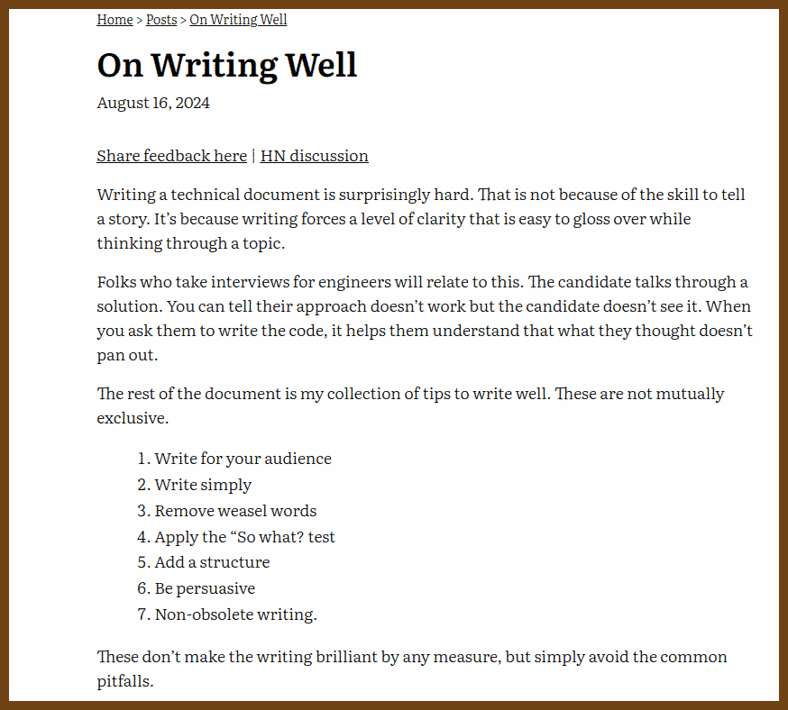
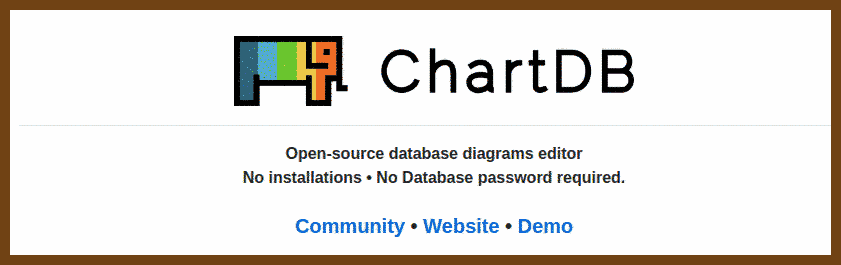
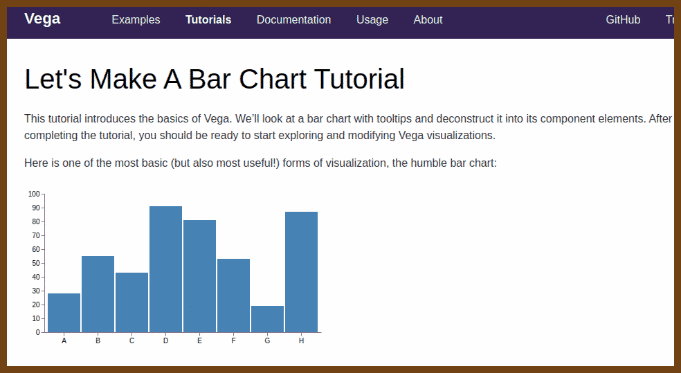
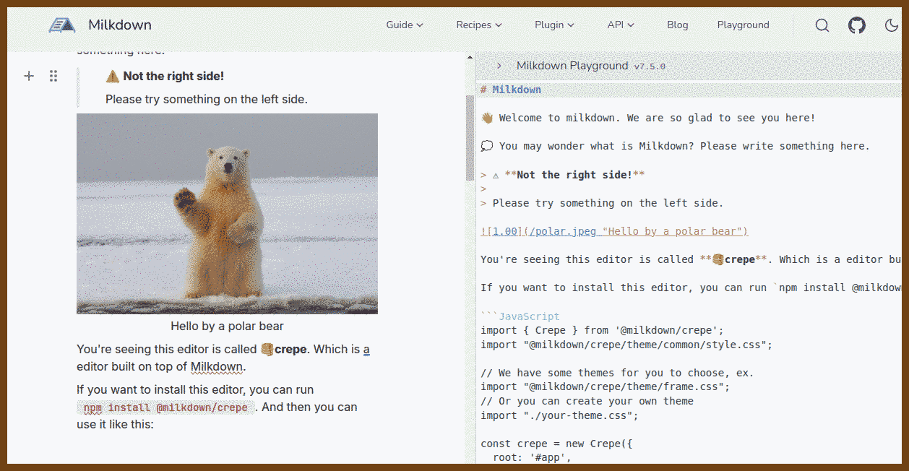

## Newsletters

2024-08-26 [JavaScript Weekly Issue 701: August 22, 2024](https://javascriptweekly.com/issues/701) { javascriptweekly.com }


## Good Reads 

2024-08-26 ⭐️ [On Writing Well | nikhil.bafna](https://zodvik.com/posts/on-writing-well/) { zodvik.com }




## The Era of AI

2024-08-26 [chartdb/chartdb: Free and Open-source database diagrams editor, visualize and design your DB with a single query.](https://github.com/chartdb/chartdb) { github.com }

> Open-source database diagrams editor
> No installations • No Database password required.




## WebDev

### Charts

2024-08-26 [Let’s Make A Bar Chart Tutorial | Vega](https://vega.github.io/vega/tutorials/bar-chart/) { vega.github.io }

> 


### Keyboard / GamePad

2024-08-26 [jamiebuilds/tinykeys: A tiny (~650 B) & modern library for keybindings.](https://github.com/jamiebuilds/tinykeys) { github.com }

> A tiny (~650 B) & modern library for keybindings. [See Demo](https://jamiebuilds.github.io/tinykeys/)

```js
import { tinykeys } from "tinykeys" // Or `window.tinykeys` using the CDN version

tinykeys(window, {
  "Shift+D": () => {
    alert("The 'Shift' and 'd' keys were pressed at the same time")
  },
  "y e e t": () => {
    alert("The keys 'y', 'e', 'e', and 't' were pressed in order")
  },
  "$mod+([0-9])": event => {
    event.preventDefault()
    alert(`Either 'Control+${event.key}' or 'Meta+${event.key}' were pressed`)
  },
})

```


### Styles

2024-08-26 [Newspaper Style Design](https://codepen.io/silkine/pen/QWBxVX) { codepen.io }


## TypeScript

2024-08-26 [gruhn/typescript-sudoku: Playing Sudoku in TypeScript while the type checker highlights mistakes.](https://github.com/gruhn/typescript-sudoku) { github.com }


## Markdown

2024-08-26 [Getting Started | Milkdown](https://milkdown.dev/docs/guide/getting-started) { milkdown.dev }



> - 📝 **WYSIWYG Markdown** - Write markdown in an elegant way
> - 🎨 **Themable** - Create your own theme and publish it as an npm package
> - 🎮 **Hackable** - Create your own plugin to support your awesome idea
> - 🦾 **Reliable** - Built on top of [prosemirror](https://prosemirror.net/) and [remark](https://github.com/remarkjs/remark)
> - ⚡ **Slash & Tooltip** - Write faster than ever, enabled by a plugin.
> - 🧮 **Math** - LaTeX math equations support via math plugin
> - 📊 **Table** - Table support with fluent ui, via table plugin
> - 🍻 **Collaborate** - Shared editing support with [yjs](https://docs.yjs.dev/)
> - 💾 **Clipboard** - Support copy and paste markdown, via clipboard plugin
> - 👍 **Emoji** - Support emoji shortcut and picker, via emoji plugin


## Workplace 

### Burnout 

> Burnout can manifest in different ways depending on the underlying causes. Here’s an expanded explanation of the two types of burnout mentioned:
>
> ### 1. Burnout from Boredom and Routine:
>
> This type of burnout occurs when tasks become monotonous, and there’s a lack of challenge or variety in the work. Over time, this can lead to a sense of disengagement and apathy.
>
> #### Tips to Mitigate This Type of Burnout:
>
> - Introduce Variety: Rotate tasks, take on new projects, or explore different aspects of your role to break the monotony.
> - Set Personal Goals: Establishing new challenges or learning opportunities can reinvigorate your sense of purpose.
> - Take Breaks: Step away from work periodically to reset your mind and come back with fresh energy.
> - Seek Feedback: Regularly ask for feedback to ensure you’re growing and improving in your role, which can make work more engaging.
> - Incorporate Creativity: Find ways to add a creative touch to your work, even in routine tasks, to make them more interesting.
>
> ### 2. Burnout from Too Many Changes and Uncertainty:
>
> This type of burnout arises when there’s a constant state of flux, leading to stress and anxiety due to the unpredictability of work.
>
> #### Tips to Mitigate This Type of Burnout:
>
> - Prioritize and Organize: Break down tasks into manageable steps and prioritize them to regain a sense of control.
> - Embrace Flexibility: Accept that change is inevitable and try to adapt by being flexible and open to new approaches.
> - Develop Coping Strategies: Practice stress-relief techniques like mindfulness, deep breathing, or exercise to manage anxiety.
> - Seek Support: Talk to colleagues, supervisors, or a professional about your concerns to gain perspective and support.
> - Focus on What You Can Control: Concentrate on aspects of your work where you can make an impact, rather than worrying about uncertainties beyond your control.
>
> ### General Tips to Combat Burnout:
>
> - Maintain Work-Life Balance: Ensure you’re taking time for yourself outside of work to recharge.
> - Regular Exercise and Healthy Eating: Physical well-being can greatly influence mental health and resilience.
> - Limit Overtime: Avoid consistently working long hours, which can lead to exhaustion.
> - Take Vacations: Time away from work is crucial for long-term productivity and well-being.
> - Seek Professional Help: If burnout becomes overwhelming, don’t hesitate to consult with a mental health professional.
>


## Personal Blogs

2024-08-26 [Articles](https://codinghelmet.com/articles) { codinghelmet.com }

> Zoran Horvat
>
> 

