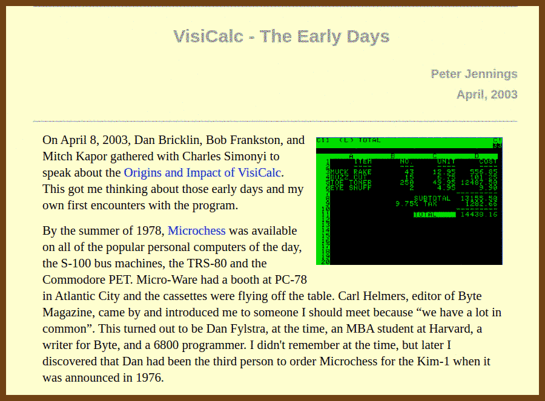
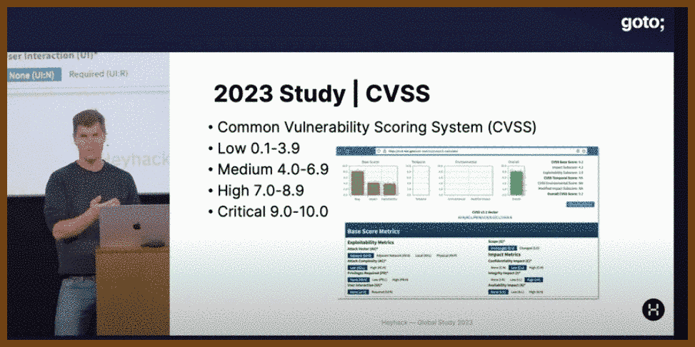
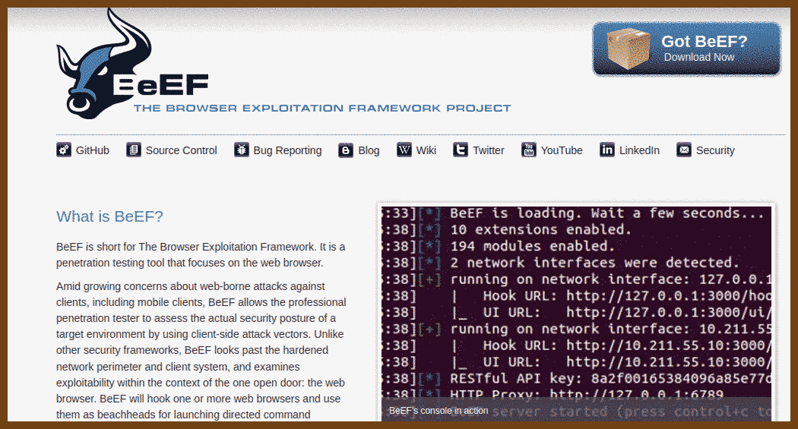
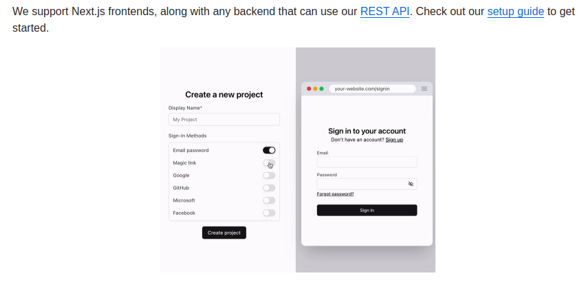

## How the things work

2024-08-31 [Hypervisor From Scratch - Part 1: Basic Concepts & Configure Testing Environment | Rayanfam Blog](https://rayanfam.com/topics/hypervisor-from-scratch-part-1/) { rayanfam.com }

> > # Hypervisor From Scratch
> >
> > - [Hypervisor From Scratch – Part 1: Basic Concepts & Configure Testing Environment](https://rayanfam.com/topics/hypervisor-from-scratch-part-1/)
> > - [Hypervisor From Scratch – Part 2: Entering VMX Operation](https://rayanfam.com/topics/hypervisor-from-scratch-part-2/)
> > - [Hypervisor From Scratch – Part 3: Setting up Our First Virtual Machine](https://rayanfam.com/topics/hypervisor-from-scratch-part-3/)
> > - [Hypervisor From Scratch – Part 4: Address Translation Using Extended Page Table (EPT)](https://rayanfam.com/topics/hypervisor-from-scratch-part-4/)
> > - [Hypervisor From Scratch – Part 5: Setting up VMCS & Running Guest Code](https://rayanfam.com/topics/hypervisor-from-scratch-part-5/)
> > - [Hypervisor From Scratch – Part 6: Virtualizing An Already Running System](https://rayanfam.com/topics/hypervisor-from-scratch-part-6/)
> > - [Hypervisor From Scratch – Part 7: Using EPT & Page-Level Monitoring Features](https://rayanfam.com/topics/hypervisor-from-scratch-part-7/)
> > - [Hypervisor From Scratch – Part 8: How To Do Magic With Hypervisor!](https://rayanfam.com/topics/hypervisor-from-scratch-part-8/)
>
> The source code for **Hypervisor From Scratch** is available on GitHub :
>
> [https://github.com/SinaKarvandi/Hypervisor-From-Scratch/]

2024-08-31 [Reversing Windows Internals (Part 1) - Digging Into Handles, Callbacks & ObjectTypes | Rayanfam Blog](https://rayanfam.com/topics/reversing-windows-internals-part1/) { rayanfam.com }

2024-08-31 [A Tour of Mount in Linux | Rayanfam Blog](https://rayanfam.com/topics/mount-in-linux/) { rayanfam.com }

> 

## (Emacs)

2024-08-31 ⭐️ [The Organized Life - An Expert‘s Guide to Emacs Org-Mode – TheLinuxCode](https://thelinuxcode.com/emacs-org_mode_part1/) { thelinuxcode.com }

2024-08-31 ⭐️ [Mastering Organization with Emacs Org Mode: A Complete Guide for Beginners – TheLinuxCode](https://thelinuxcode.com/emacs-org-mode-tutorial/) { thelinuxcode.com }

> 

2024-08-30 [chrisdone-archive/elisp-guide: A quick guide to Emacs Lisp programming](https://github.com/chrisdone-archive/elisp-guide) { github.com }

> 

2024-08-30 [Getting Started With Emacs Lisp Hands On - A Practical Beginners Tutorial – Ben Windsor – Strat at an investment bank](https://benwindsorcode.github.io/Getting-Started-With-Emacs-Lisp/) { benwindsorcode.github.io }

> 

## Retro / Fun

2024-08-30 [VisiCalc - The Early History - Peter Jennings](https://benlo.com/visicalc/) { benlo.com }

## Security

2024-08-31 [The State of Application Security 2023 • Sebastian Brandes • GOTO 2023 - YouTube](https://www.youtube.com/watch?v=BX0TVzHOJgQ) { www.youtube.com }

> Sebastian, co-founder of **Hey Hack**, a Danish startup focused on **web application security**, presented findings from a large-scale study involving the scanning of nearly 4 million hosts globally. The study uncovered widespread vulnerabilities in web applications, including **file leaks, dangling DNS records, vulnerable FTP servers,** and persistent **cross-site scripting (XSS) issues**.
>
> Key findings include:
>
> - **File leaks**: 29% of organizations had exposed sensitive data like source code, passwords, and private keys.
> - **Dangling DNS records**: Risks of **subdomain takeover** attacks due to outdated DNS entries.
> - **Vulnerable FTP servers**: 7.9% of servers running **ProFTPD 1.3.5** were at risk due to a file copy module vulnerability.
> - **XSS vulnerabilities**: 4% of companies had known XSS issues, posing significant security risks.
>
> Sebastian stressed that **web application firewalls (WAFs)** are not foolproof and cannot replace fixing underlying vulnerabilities. He concluded by emphasizing the importance of early investment in **application security** during the development process to prevent future attacks.
>
> > "We’ve seen lots of leaks or file leaks that are sitting out there—files that you probably would not want to expose to the public internet."
>
> > "Web application firewalls can maybe do something, but they’re not going to save you. It’s much, much better to go ahead and fix the actual issues in your application."

## Inspiration

2024-08-30 [oTranscribe](https://otranscribe.com/) { otranscribe.com }

## Security

2024-08-30 [BeEF - The Browser Exploitation Framework Project](https://beefproject.com/) { beefproject.com }

2024-08-31 [stack-auth/stack: Open-source Clerk/Auth0 alternative](https://github.com/stack-auth/stack) { github.com }

> Stack Auth is a managed user authentication solution. It is developer-friendly and fully open-source (licensed under MIT and AGPL).
>
> Stack gets you started in just five minutes, after which you'll be ready to use all of its features as you grow your project. Our managed service is completely optional and you can export your user data and self-host, for free, at any time.
> 

## The Era of AI

2024-08-30 [MahmoudAshraf97/whisper-diarization: Automatic Speech Recognition with Speaker Diarization based on OpenAI Whisper](https://github.com/MahmoudAshraf97/whisper-diarization) { github.com }

2024-08-30 [openai/whisper: Robust Speech Recognition via Large-Scale Weak Supervision](https://github.com/openai/whisper) { github.com }

2024-08-30 [ggerganov/whisper.cpp: Port of OpenAI's Whisper model in C/C++](https://github.com/ggerganov/whisper.cpp) { github.com }

