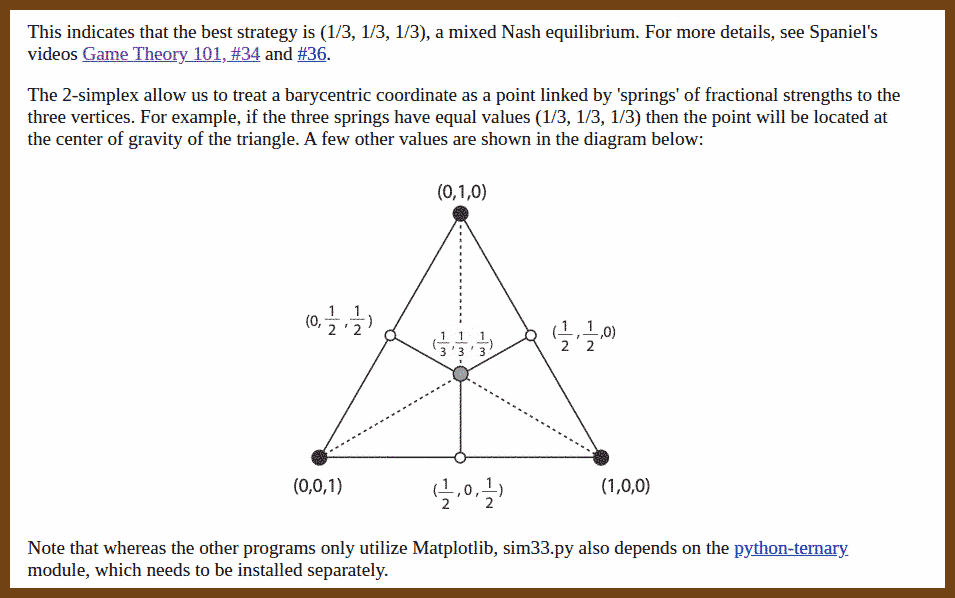
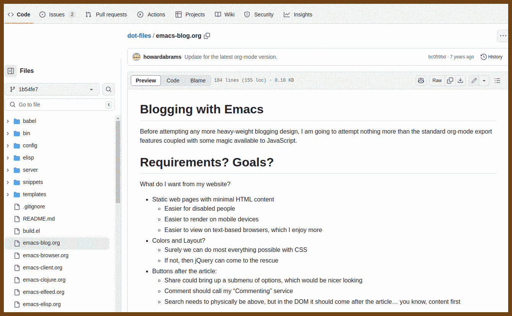
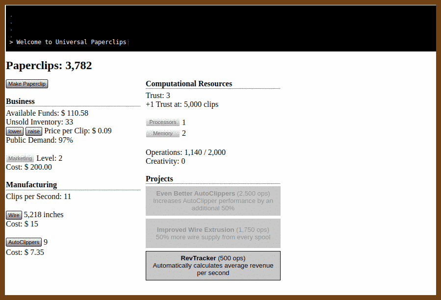
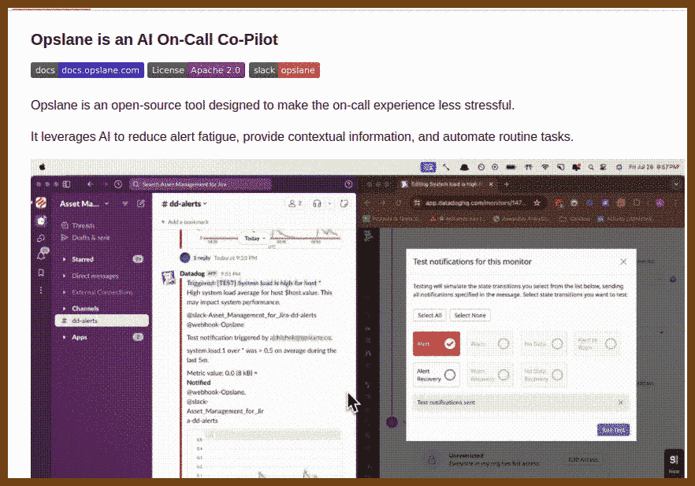
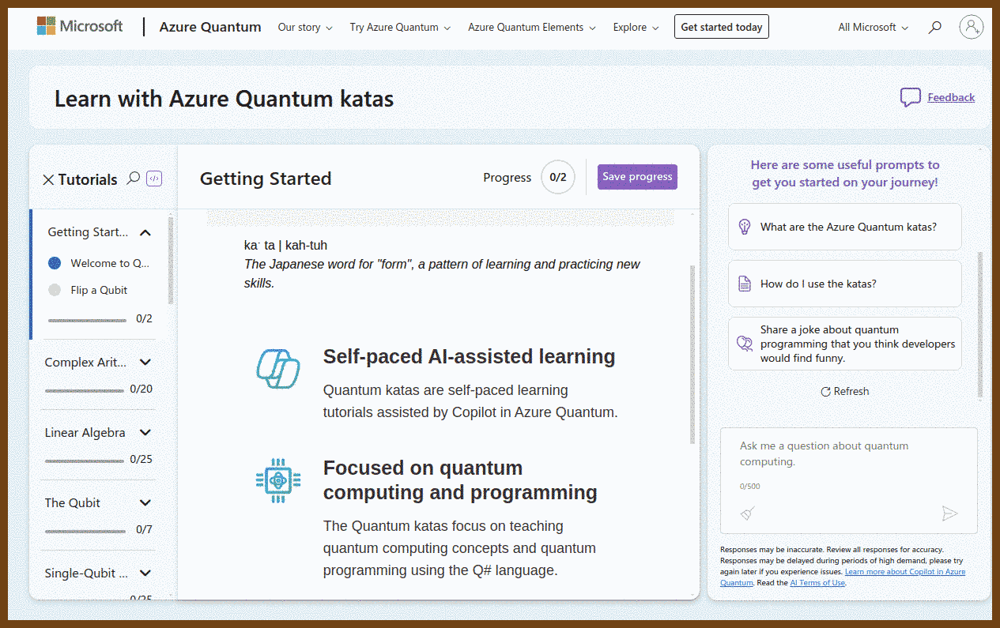
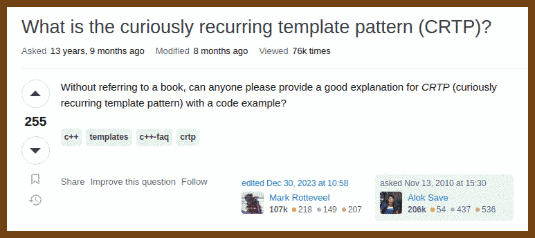
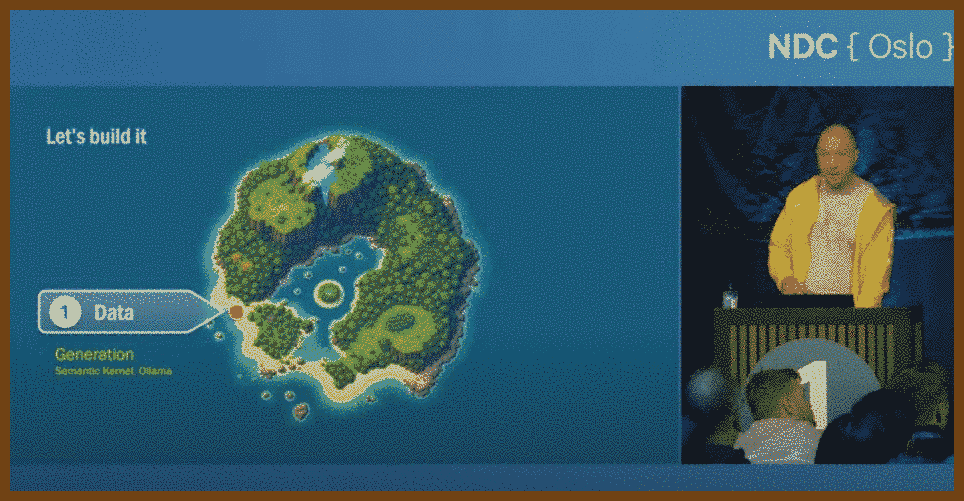

[[_TOC_]]

## How the things work

2024-08-31 [Hypervisor From Scratch - Part 1: Basic Concepts & Configure Testing Environment | Rayanfam Blog](https://rayanfam.com/topics/hypervisor-from-scratch-part-1/) { rayanfam.com }

> # Hypervisor From Scratch
> 
> - [Hypervisor From Scratch – Part 1: Basic Concepts & Configure Testing Environment](https://rayanfam.com/topics/hypervisor-from-scratch-part-1/)
> - [Hypervisor From Scratch – Part 2: Entering VMX Operation](https://rayanfam.com/topics/hypervisor-from-scratch-part-2/)
> - [Hypervisor From Scratch – Part 3: Setting up Our First Virtual Machine](https://rayanfam.com/topics/hypervisor-from-scratch-part-3/)
> - [Hypervisor From Scratch – Part 4: Address Translation Using Extended Page Table (EPT)](https://rayanfam.com/topics/hypervisor-from-scratch-part-4/)
> - [Hypervisor From Scratch – Part 5: Setting up VMCS & Running Guest Code](https://rayanfam.com/topics/hypervisor-from-scratch-part-5/)
> - [Hypervisor From Scratch – Part 6: Virtualizing An Already Running System](https://rayanfam.com/topics/hypervisor-from-scratch-part-6/)
> - [Hypervisor From Scratch – Part 7: Using EPT & Page-Level Monitoring Features](https://rayanfam.com/topics/hypervisor-from-scratch-part-7/)
> - [Hypervisor From Scratch – Part 8: How To Do Magic With Hypervisor!](https://rayanfam.com/topics/hypervisor-from-scratch-part-8/)
>
> The source code for **Hypervisor From Scratch** is available on GitHub :
>
> [https://github.com/SinaKarvandi/Hypervisor-From-Scratch/]

2024-08-31 [Reversing Windows Internals (Part 1) - Digging Into Handles, Callbacks & ObjectTypes | Rayanfam Blog](https://rayanfam.com/topics/reversing-windows-internals-part1/) { rayanfam.com }

2024-08-31 [A Tour of Mount in Linux | Rayanfam Blog](https://rayanfam.com/topics/mount-in-linux/) { rayanfam.com }

> 

2024-09-01 [tandasat/Hypervisor-101-in-Rust: ](https://github.com/tandasat/Hypervisor-101-in-Rust) { github.com } 

> The materials of "Hypervisor 101 in Rust", a one-day long course, to quickly learn hardware-assisted virtualization technology and its application for high-performance fuzzing on Intel/AMD processors.
>
> https://tandasat.github.io/Hypervisor-101-in-Rust/
>
> 

## CRDT

2024-09-01 [Movable tree CRDTs and Loro's implementation – Loro](https://loro.dev/blog/movable-tree) { loro.dev }

> This article introduces the implementation difficulties and challenges of Movable Tree CRDTs when collaboration, and how Loro implements it and sorts child nodes. 

## Art and Assets

2024-09-01 [Public Work by Cosmos](https://public.work/) { public.work }

> 

##  Game Theory 101

2024-09-01 ⭐️  [Game Theory 101 (#1): Introduction - YouTube](https://www.youtube.com/watch?v=NSVmOC_5zrE&list=PLKI1h_nAkaQoDzI4xDIXzx6U2ergFmedo) { www.youtube.com }

> 

2024-09-01 [Finding Nash Equilibria through Simulation](https://coe.psu.ac.th/ad/nashSim/) { coe.psu.ac.th }

> 

## (Emacs)

2024-09-01 [A Simple Guide to Writing & Publishing Emacs Packages](https://spin.atomicobject.com/write-emacs-package/) { spin.atomicobject.com }

> 

2024-09-01 [Emacs starter kit](https://emacs-config-generator.fly.dev/) { emacs-config-generator.fly.dev }

> 

2024-09-01 [dot-files/emacs-blog.org at 1b54fe75d74670dc7bcbb6b01ea560c45528c628 · howardabrams/dot-files](https://github.com/howardabrams/dot-files/blob/1b54fe75d74670dc7bcbb6b01ea560c45528c628/emacs-blog.org#L108) { github.com }

> 

2024-08-31 ⭐️ [The Organized Life - An Expert‘s Guide to Emacs Org-Mode – TheLinuxCode](https://thelinuxcode.com/emacs-org_mode_part1/) { thelinuxcode.com }

2024-08-31 ⭐️ [Mastering Organization with Emacs Org Mode: A Complete Guide for Beginners – TheLinuxCode](https://thelinuxcode.com/emacs-org-mode-tutorial/) { thelinuxcode.com }

> 

2024-08-30 [chrisdone-archive/elisp-guide: A quick guide to Emacs Lisp programming](https://github.com/chrisdone-archive/elisp-guide) { github.com }

> 

2024-08-30 [Getting Started With Emacs Lisp Hands On - A Practical Beginners Tutorial – Ben Windsor – Strat at an investment bank](https://benwindsorcode.github.io/Getting-Started-With-Emacs-Lisp/) { benwindsorcode.github.io }

> 

## Retro / Fun

2024-08-30 [VisiCalc - The Early History - Peter Jennings](https://benlo.com/visicalc/) { benlo.com }

2024-09-01 [paperclips](https://www.decisionproblem.com/paperclips/index2.html) { www.decisionproblem.com }

> 

## Inspiration

2024-09-01 [The Scale of Life](https://www.thescaleoflife.com/) { www.thescaleoflife.com }

> 

2024-09-01 [opslane/opslane: Making on-call suck less for engineers](https://github.com/opslane/opslane) { github.com }

> 

2024-09-01 [Azure Quantum | Learn with quantum katas](https://quantum.microsoft.com/en-us/experience/quantum-katas) { quantum.microsoft.com }

> 

>  2024-09-01 [microsoft/QuantumKatas: Tutorials and programming exercises for learning Q# and quantum computing](https://github.com/microsoft/QuantumKatas?tab=readme-ov-file) { github.com }

2024-09-01 [EP122: API Gateway 101 - ByteByteGo Newsletter](https://blog.bytebytego.com/p/ep122-api-gateway-101) { blog.bytebytego.com }

2024-09-01 [pladams9/hexsheets: A basic spreadsheet application with hexagonal cells inspired by: http://www.secretgeek.net/hexcel.](https://github.com/pladams9/hexsheets) { github.com }

> 

2024-09-01 [Do Quests, Not Goals](https://www.raptitude.com/2024/08/do-quests-not-goals/) { www.raptitude.com }

> The other problem with goals is that, outside of sports, “goal” has become an uninspiring, institutional word. Goals are things your teachers and managers have for you. Goals are made of quotas and Key Performance Indicators. As soon as I write the word “goals” on a sheet of paper I get drowsy.

> 

> Here are some of the quests people took on:
>
> - Declutter the whole house
> - Record an EP
> - Prep six months’ worth of lessons for my students
> - Set up an artist’s workspace
> - Finish two short stories
> - Gain a basic knowledge of classical music
> - Fill every page in a sketchbook with drawings
> - Complete a classical guitar program
> - Make an “If I get hit by a bus” folder for my family

2024-08-30 [oTranscribe](https://otranscribe.com/) { otranscribe.com }

## Security

2024-08-31 [The State of Application Security 2023 • Sebastian Brandes • GOTO 2023 - YouTube](https://www.youtube.com/watch?v=BX0TVzHOJgQ) { www.youtube.com }

> Sebastian, co-founder of **Hey Hack**, a Danish startup focused on **web application security**, presented findings from a large-scale study involving the scanning of nearly 4 million hosts globally. The study uncovered widespread vulnerabilities in web applications, including **file leaks, dangling DNS records, vulnerable FTP servers,** and persistent **cross-site scripting (XSS) issues**.
>
> Key findings include:
>
> - **File leaks**: 29% of organizations had exposed sensitive data like source code, passwords, and private keys.
> - **Dangling DNS records**: Risks of **subdomain takeover** attacks due to outdated DNS entries.
> - **Vulnerable FTP servers**: 7.9% of servers running **ProFTPD 1.3.5** were at risk due to a file copy module vulnerability.
> - **XSS vulnerabilities**: 4% of companies had known XSS issues, posing significant security risks.
>
> Sebastian stressed that **web application firewalls (WAFs)** are not foolproof and cannot replace fixing underlying vulnerabilities. He concluded by emphasizing the importance of early investment in **application security** during the development process to prevent future attacks.
>
> > "We’ve seen lots of leaks or file leaks that are sitting out there—files that you probably would not want to expose to the public internet."
>
> > "Web application firewalls can maybe do something, but they’re not going to save you. It’s much, much better to go ahead and fix the actual issues in your application."

2024-08-30 [BeEF - The Browser Exploitation Framework Project](https://beefproject.com/) { beefproject.com }

2024-08-31 [stack-auth/stack: Open-source Clerk/Auth0 alternative](https://github.com/stack-auth/stack) { github.com }

> Stack Auth is a managed user authentication solution. It is developer-friendly and fully open-source (licensed under MIT and AGPL).
>
> Stack gets you started in just five minutes, after which you'll be ready to use all of its features as you grow your project. Our managed service is completely optional and you can export your user data and self-host, for free, at any time.
> 

## C || C++

2024-09-01 [c++ - What is the curiously recurring template pattern (CRTP)? - Stack Overflow](https://stackoverflow.com/questions/4173254/what-is-the-curiously-recurring-template-pattern-crtp) { stackoverflow.com }

> 
>
> 

## The Era of AI

2024-08-30 [MahmoudAshraf97/whisper-diarization: Automatic Speech Recognition with Speaker Diarization based on OpenAI Whisper](https://github.com/MahmoudAshraf97/whisper-diarization) { github.com }

2024-08-30 [openai/whisper: Robust Speech Recognition via Large-Scale Weak Supervision](https://github.com/openai/whisper) { github.com }

2024-08-30 [ggerganov/whisper.cpp: Port of OpenAI's Whisper model in C/C++](https://github.com/ggerganov/whisper.cpp) { github.com }

2024-09-01 [microsoft/semantic-kernel: Integrate cutting-edge LLM technology quickly and easily into your apps](https://github.com/microsoft/semantic-kernel) { github.com }

2024-09-01 [How to add genuinely useful AI to your webapp (not just chatbots) - Steve Sanderson - YouTube](https://www.youtube.com/watch?v=TSNAvFJoP4M) { www.youtube.com }

> 
>
> The talk presented here dives into the integration of **AI** within applications, particularly focusing on how developers, especially those familiar with .NET and web technologies, can leverage AI to enhance user experiences. Here are the key takeaways and approaches from the session:
>
> **Making Applications Intelligent**: The speaker discusses various interpretations of making an app "intelligent." It’s not just about adding a chatbot. While chatbots can create impressive demos quickly, they may not necessarily be useful in production. For AI to be genuinely beneficial, it must save time, improve job performance, and be accurate. The speaker challenges developers to quantify these benefits rather than rely on assumptions.
>
> > "If you try to put it into production, are people going to actually use it? Well, maybe it depends... does this thing actually save people time and enable them to do their job better than they would have otherwise?"
>
> **Patterns of AI Integration**: The speaker introduces several **UI-level AI enhancements** such as **Smart Components**. These are experiments allowing developers to add AI to the UI layer without needing to rebuild the entire app. An example given is a **Smart Paste** feature that allows users to paste large chunks of text, which AI then parses and fills out the corresponding fields in a form. This feature improves user efficiency by reducing the need for repetitive and mundane tasks.
>
> Another example is the **Smart ComboBox**, which uses **semantic search** to match user input with relevant categories, even when the exact terms do not appear in the list. This feature is particularly useful in scenarios where users may not know the exact terminology.
>
> **Deeper AI Integration**: Moving beyond UI enhancements, the speaker explores deeper layers of AI integration within traditional web applications like e-commerce platforms. For instance, AI can be used to:
>
> - **Semantic Search**: Improve search functionality so that users don't need to know the exact phrasing.
> - **Summarization**: Automatically generate descriptive titles for support tickets to help staff quickly identify issues.
> - **Classification**: Automatically categorize support tickets to streamline workflows and save staff time.
> - **Sentiment Analysis**: Provide sentiment scores to help staff prioritize urgent issues.
>
> > "I think even in this very traditional web application, there's clearly lots of opportunity for AI to add a lot of genuine value that will help your staff actually be more productive."
>
> **Data and AI Integration**: The talk also delves into the importance of data in AI applications. The speaker introduces the **Semantic Kernel**, a .NET library for working with AI, and demonstrates how to generate data using **LLMs (Large Language Models)** locally on the development machine using **Ollama**. The process involves creating categories, products, and related data (like product manuals) in a structured manner.
>
> **Data Ingestion and Semantic Search**: The speaker showcases how to ingest unstructured data, such as PDFs, and convert them into a format that AI can use for semantic search. Using the **PDFPig** library, the speaker demonstrates extracting text from PDFs, chunking it into smaller, meaningful fragments, and then embedding these chunks into a **semantic space**. This allows for efficient, relevant searches within the data, enhancing the AI’s ability to provide accurate information quickly.
>
> **Implementing Inference with AI**: As the talk progresses, the speaker moves on to implementing AI-based inference within a **Blazor** application. By integrating **summarization** directly into the workflow, the application can automatically generate summaries of customer interactions, helping support staff to quickly understand the context of a ticket without reading through the entire conversation history.
>
> > "I want to generate an updated summary for it... Generate a summary of the entire conversation log at that point."
>
> **Function Calling and RAG (Retrieval-Augmented Generation)**: The speaker discusses a more complex AI pattern—**RAG**—which involves the AI model retrieving specific data to answer queries. While standard RAG implementations rely on specific AI platforms, the speaker demonstrates a custom approach that works across various models, including locally run models like **Ollama**. This approach involves checking if the AI has enough context to answer a question and then retrieving relevant information if needed.

## Job interview / Algorithms

2024-09-01 [Understanding B-Trees: The Data Structure Behind Modern Databases - YouTube](https://www.youtube.com/watch?v=K1a2Bk8NrYQ) { www.youtube.com }

> 
