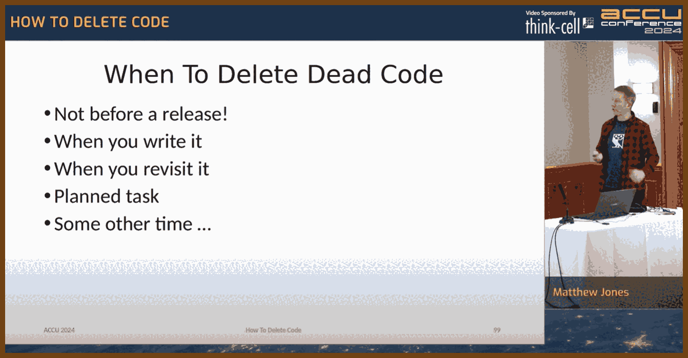
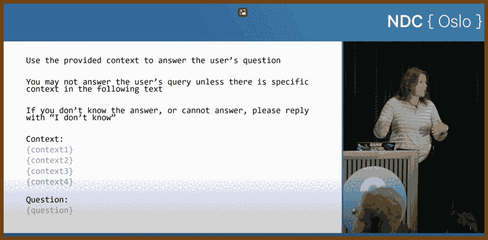
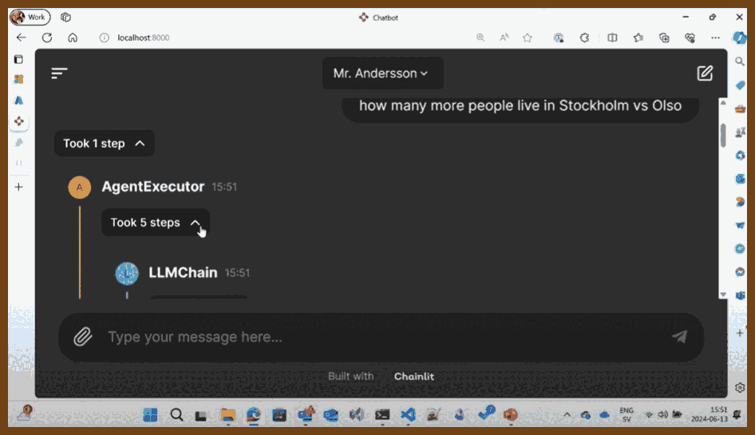
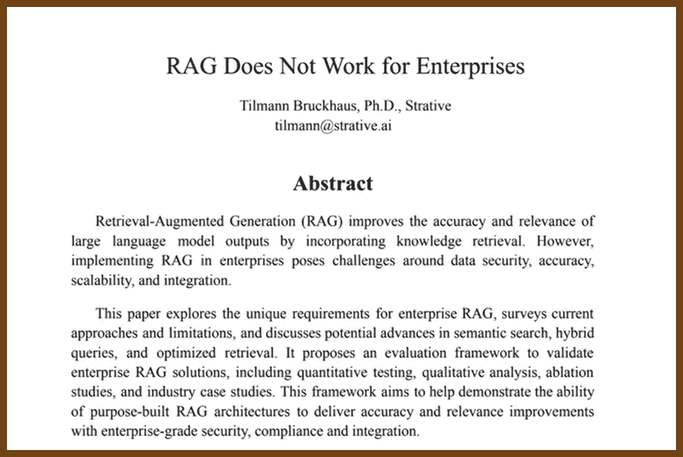
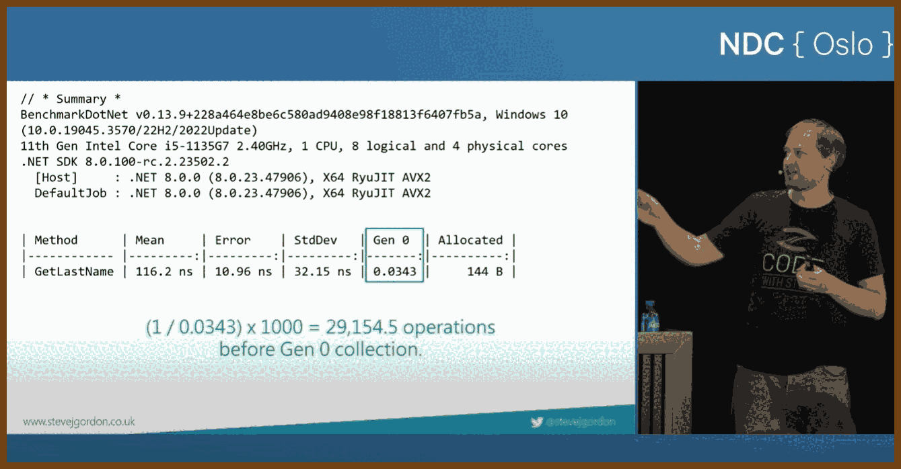
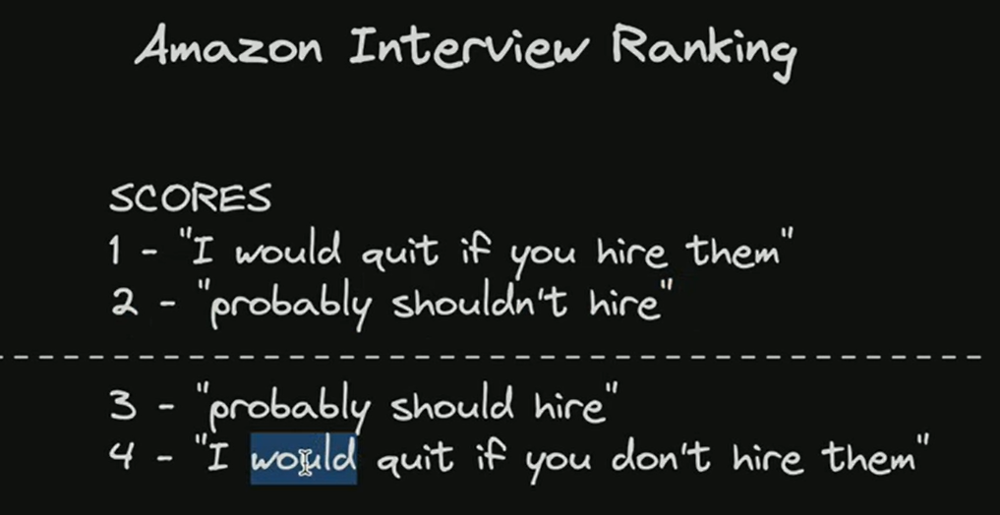

---
layout: post
title:  "Links from my inbox 2024-10-13"
date:   2024-10-13T11:32:00-07:00
categories: links
---

## ⌚ Nice watch!

In this blog post, I'll be sharing a collection of videos with concise content digests. These summaries extract the key points, focusing on the problem discussed, its root cause, and the solution or advice offered. I find this approach helpful because it allows me to retain the core information long after watching the video. This section will serve as a dedicated space for these "good watches," presenting only the most valuable videos and their takeaways in one place.

2024-08-18 [Burnout - When does work start feeling pointless? | DW Documentary - YouTube](https://www.youtube.com/watch?v=raVms8w61No) { www.youtube.com }

> 

> ### High-Level Categories and Subcategories of Problems in the Transcript
>
> #### 1. **Workplace Dysfunction**
>
>    **1.1 Bureaucracy and Sabotage**
>
>    - **Problem**: Office life has adopted tactics of **sabotage** (00:01:13) similar to a WWII manual, where inefficiency is encouraged through endless meetings, paperless offices, and waiting for decisions in larger meetings.
>    - **Root Cause**: Bureaucratic processes have unintentionally adopted methods once used deliberately to disrupt efficiency.
>    - **Solution**: Recognize the signs of sabotage in office routines and seek to streamline decision-making and reduce unnecessary meetings.
>
>    **1.2 Administrative Bloat**
>
>    - **Problem**: **Administrative jobs** (00:03:28) have increased from 25% to 75% of the workforce. These include unnecessary supervisory, managerial, and clerical jobs.
>    - **Root Cause**: Expansion of administrative roles rather than reducing workload with technology.
>    - **Solution**: A shift towards more meaningful roles and reducing bureaucratic excess would help in streamlining operations.
>
> #### 2. **Employee Burnout and Mental Health**
>
>    **2.1 Physical and Emotional Exhaustion**
>
>    - **Problem**: **Burnout** (00:10:11) manifests in intense physical exhaustion, to the point of difficulty performing basic tasks, and emotional breakdowns.
>    - **Root Cause**: Overwork, perfectionism, and the pressure to perform.
>    - **Solution**: Recognize the early signs of burnout, reduce workloads, and address stress proactively through support and time off.
>
>    **2.2 Pluralistic Ignorance**
>
>    - **Problem**: Employees feel isolated, believing they are the only ones struggling (00:15:19), while everyone else seems fine.
>    - **Root Cause**: Lack of open communication about stress and burnout in the workplace.
>    - **Solution**: Encourage honest discussions about workplace difficulties to reduce isolation and collective burnout.
>
> #### 3. **Managerial and Leadership Failures**
>
>    **3.1 Misaligned Management Expectations**
>
>    - **Problem**: Many managers are promoted based on tenure or individual performance (00:24:26), rather than leadership skills, leading to poor team management.
>    - **Root Cause**: Promotions based on irrelevant criteria, such as tenure, rather than leadership capability.
>    - **Solution**: Companies need to create pathways for individual contributors to be rewarded without forcing them into management roles.
>
>    **3.2 Disconnect Between Managers and Employees**
>
>    - **Problem**: Managers often do not **engage** with employees on a personal level (00:26:32), leading to isolation and poor job satisfaction.
>    - **Root Cause**: Lack of training for managers to build relationships with their teams.
>    - **Solution**: Managers should be trained in emotional intelligence and encouraged to have personal conversations with employees.
>
> #### 4. **Corporate Culture and Value Conflicts**
>
>    **4.1 Corporate Reorganizations**
>
>    - **Problem**: Reorganizations, layoffs, and restructuring cause ongoing stress for employees (00:34:28). People live in fear of losing their jobs despite hard work.
>    - **Root Cause**: Frequent corporate restructuring often lacks a clear purpose beyond satisfying financial analysts or stockholders.
>    - **Solution**: Limit reorganizations to only when necessary and focus on transparent communication to reduce employee anxiety.
>
>    **4.2 Cynicism Due to Unfair Treatment**
>
>    - **Problem**: When workplaces are seen as unfair (00:46:43), cynicism grows, leading to a toxic environment.
>    - **Root Cause**: Lack of transparency and fairness in company policies and actions, leading to distrust.
>    - **Solution**: Implement fair policies and involve employees in decision-making to reduce feelings of exploitation.
>
> #### 5. **Misalignment of Work and Purpose**
>
>    **5.1 Lack of Value in Work**
>
>    - **Problem**: Employees feel their work lacks **social value** (00:33:00). Despite hard work, they see no real-world impact or meaning.
>    - **Root Cause**: The economic system rewards meaningless work more than jobs that provide immediate, tangible benefits to society.
>    - **Solution**: Employers should align tasks with broader human values and ensure that workers understand the social impact of their contributions.
>
> ---
>
> ### Summary of Key Problems and Solutions
>
> 1. **Workplace Dysfunction**: Bureaucratic inefficiency, administrative bloat, and unnecessary meetings create a sense of sabotage in modern offices. **Solution**: Streamline decision-making and reduce bureaucratic roles.
> 2. **Employee Burnout**: Burnout is widespread due to overwork, isolation, and emotional stress. **Solution**: Acknowledge the signs of burnout, reduce workload, and foster open communication.
> 3. **Managerial Failures**: Many managers lack the skills to lead effectively, causing disengagement and poor team dynamics. **Solution**: Train managers in leadership and emotional intelligence.
> 4. **Corporate Culture**: Frequent reorganizations and unfair treatment create cynicism and stress among employees. **Solution**: Ensure fair policies and minimize unnecessary restructurings.
> 5. **Lack of Meaningful Work**: Employees feel disconnected from the social value of their work, seeing it as pointless. **Solution**: Align work tasks with human values and meaningful contributions.
>
> The most critical issues are **employee burnout** and the **disconnect between management and workers**, both of which contribute to widespread dissatisfaction and inefficiency in workplaces. Addressing these through better leadership training, reducing unnecessary work, and improving workplace communication can lead to healthier, more engaged employees.

2024-10-13 [How to Spend 14 Days in JAPAN 🇯🇵 Ultimate Travel Itinerary - YouTube](https://www.youtube.com/watch?v=DBVAAnq1dHo) { www.youtube.com }

> 
>
> Here’s a streamlined travel plan for visiting some of Japan’s most iconic destinations, focusing on the essential experiences in each place. Follow this itinerary for a mix of history, nature, and food.
>
> **1. Shirakawago**  
> Start your journey in **Shirakawago**, a mountain village known for its traditional **Gassho-zukuri farmhouses** and heavy winter snowfall. The buildings are arranged facing north to south to minimize wind resistance. Stay overnight in one of the **farmhouses** to fully experience the town.  
>
> - **Don't miss:** The **House of Pudding**, serving Japan’s best custard pudding (2023 winner).
>
> **2. Takayama**  
> Head to **Takayama**, a town in the Central Japan Alps, filled with **traditional architecture** and a retro vibe. Walk through the **Old Town**, and visit the **Takayama Showa Museum**, which perfectly captures Japan in the 1950s and 60s.  
>
> - **Must-try food:** **Hida Wagyu beef** is a local specialty, available in street food stalls or restaurants. You can enjoy a stick of wagyu for around **600 yen**.
>
> **3. Kyoto**  
> Next, visit the cultural capital, **Kyoto**, and stay in a **Machiya townhouse** in the **Higashiyama district** for an authentic experience. Kyoto offers endless shrines and temples to explore.  
>
> - **Fushimi Inari Shrine:** Famous for its **10,000 red Torii gates** leading up Mount Inari. The gates are donated by businesses for good fortune.  
> - **Kinkakuji (Golden Pavilion):** One of Kyoto’s most iconic landmarks, glistening in the sunlight.  
> - **Tenryuji Temple:** A **14th-century Zen temple** with a garden and pond, virtually unchanged for 700 years.
>
> **4. Nara**  
> Travel to **Nara**, a smaller city where you can explore the famous **Nara Park**, home to 1,200 friendly deer. You can bow to the deer, and they'll bow back if they see you have crackers.  
>
> - **Todaiji Temple:** Visit the **49-foot-tall Buddha** and try squeezing through the pillar’s hole (said to grant enlightenment).  
> - **Yomogi Mochi:** Don’t miss this chewy rice cake treat filled with red bean paste, but eat it carefully!
>
> **5. Osaka**  
> End your trip in **Osaka**, known as the **nation’s kitchen**. Stay near **Dotonbori** to experience the neon lights and vibrant nightlife.  
>
> - **Takoyaki:** Grab some **fried octopus balls**, Osaka’s most famous street food, but be careful—they’re hot!  
> - **Osaka Castle:** Explore this iconic castle, though the interior is a modern museum.
>
> This travel plan covers historical landmarks, must-try local foods, and unique cultural experiences, offering a comprehensive taste of Japan.

2024-10-12 [How to Delete Code - Matthew Jones - ACCU 2024 - YouTube](https://www.youtube.com/watch?v=ApUPEsrqfYk) { www.youtube.com }

> 
>
> Quote from attendee:
>
> "Code is a cost. Code is not an asset. We should have less of it, not more of it."
>
> > Other thoughts on this topic:
> >
> > **Martin Fowler** (Agile advocate and software development thought leader) has expressed similar thoughts in his writings. In his blog post *"Code as a Liability,"* he explains that every line of code comes with maintenance costs, and the more code you have, the more resources are needed to manage it over time:
> >
> > > "The more code you have, the more bugs you have. The more code you have, the harder it is to make changes."
> >
> > **John Ousterhout**, a professor and computer scientist, has echoed this in his book *"A Philosophy of Software Design."* He talks about **code complexity** and how more code often means more complexity, which in turn leads to more problems in the future:
> >
> > > "The most important thing is to keep your code base as simple as possible."
>
> *(GPT Summary)*
>
> [Cppcheck - A tool for static C/C++ code analysis](http://cppcheck.net/)
>
> 
>
> 1. **Dead Code Identification and Removal**
>    - **Importance of removing dead code**: Dead code clutters the codebase, adds complexity, and increases maintenance costs. **Action**: Actively look for dead functions or features that are no longer in use. For example, if a feature has been deprecated but not fully removed, ensure its code is deleted.
>    - **Techniques for identifying dead code**: Use tools like static analysis, manual code review, or testing. **Action**: Rename the suspected dead function, rebuild, and let the compiler flag errors where the function is still being used.
>    - **Using static analysis and compilers**: These tools help identify unreachable or unused code. **Action**: Regularly run tools like **CPPCheck** or **Clang Analyze** in your CI pipeline to detect dead code.
>    - **Renaming functions to detect dead code**: A simple way to identify unused code. **Action**: Rename a function (e.g., `myFunction` to `myFunction_old`), and see if it causes errors during the build process. If not, the function is likely dead and can be safely removed.
>    - **Deleting dead features and their subtle dependencies**: Features often have dependencies that may be missed. **Action**: When removing a dead feature, check for subtle references, such as menu items, command-line flags, or other parts of the system that may still rely on it.
>
> 2. **Caution with Large Codebase Changes**
>    - **Taking small, careful steps**: Removing too much at once can lead to major issues. **Action**: Remove a small function or part of the code, test, and repeat. For example, instead of removing an entire module, start with one function.
>    - **Avoiding aggressive feature removal**: Over-removal can cause unexpected failures. **Action**: Approach code deletion incrementally. Don’t aim to delete an entire feature at once; instead, tease out its components slowly to avoid breaking dependencies.
>    - **Moving code to reduce scope**: If code is not needed at the global scope, move it to a more local context. **Action**: Move public functions from header files to `.cpp` files and see if any errors occur. This can help isolate the function’s scope and make it easier to remove later.
>    - **Risk of breaking builds**: Avoid breaking the build with massive deletions. **Action**: Ensure you take incremental steps, test continuously, and use atomic commits to revert small changes if needed.
>
> 3. **Refactoring Approaches**
>    - **Iterative refactoring and deletion**: Refactor code in small steps to ensure stability. **Action**: When removing a dead function, check what other code depends on it. If a function calling it becomes unused, continue refactoring iteratively.
>    - **Refactoring legacy code**: Legacy code can often hide dead functions. **Action**: Slowly reduce the scope of legacy functions by moving them to lower levels (like `.cpp` files) to see if their usage drops. If not used anymore, delete them.
>    - **Using unit tests for refactoring**: Ensure that code works after refactoring. **Action**: Wrap legacy string classes or custom utility functions in unit tests, then replace the core logic with modern STL alternatives. If the tests pass, the old code can be removed safely.
>    - **Replacing custom features with third-party libraries**: Many custom solutions from the past can now be replaced by modern libraries. **Action**: If you have a custom logger class, consider replacing it with a more standardized and robust library like **spdlog**.
>
> 4. **Working with Tools**
>    - **Using plugins or IDEs**: Most modern IDEs can help identify dead code. **Action**: Use Visual Studio or IntelliJ plugins that flag unreachable code or highlight unused functions.
>    - **Leveraging Compiler Explorer**: Use online tools to isolate and test specific snippets of code. **Action**: If you can’t refactor in the main codebase, copy the function into **Compiler Explorer** (godbolt.org) and experiment with it there before making changes.
>    - **Setting compiler flags**: Enable warnings for unreachable or unused code. **Action**: Use **-Wall** or **-Wextra** in GCC or Clang to flag potentially dead code. For example, set `Wextra` in your build system to catch unused variables and unreachable code.
>    - **Running static analysis tools**: Integrate tools like **CPPCheck** into your CI pipeline. **Action**: Add **CPPCheck** to Jenkins and run it with `-j` to detect dead functions across multiple translation units.
>
> 5. **Source Control Best Practices**
>    - **Atomic commits**: Always break down deletions into small, reversible changes. **Action**: Commit changes one at a time and with meaningful messages, such as "Deleted unused function `myFunction()`." This allows you to easily revert just one commit if needed.
>    - **Small steps and green builds**: Ensure the build passes after each commit. **Action**: Commit your changes, wait for the CI pipeline to return a green build, and only proceed if everything passes.
>    - **Keeping history in the main branch**: Deleting code in a branch risks losing history. **Action**: Perform deletions in the main branch with proper commit messages. In Git, avoid squashing commits when merging deletions, as this may obscure your work history.
>
> 6. **Communication and Collaboration**
>    - **Educating teams about dead code**: Not everyone understands the importance of cleaning up dead code. **Action**: When you find dead code, educate the team by documenting what you’ve removed and why.
>    - **Communicating when deleting shared code**: Deleting code that others may rely on needs consensus. **Action**: Start a conversation with the team and document the code you intend to delete. Make sure the removal won’t disrupt anyone’s work.
>    - **Seasonal refactoring**: Pick quieter periods like holidays for large-scale refactoring. **Action**: Plan code cleanups during slower times (e.g., Christmas or summer) when fewer developers are working. For example, take the three days between Christmas and New Year to remove unused code while avoiding merge conflicts.
>
> 7. **Handling Legacy Features**
>    - **Addressing dead features tied to legacy systems**: These can be tricky to remove without causing issues. **Action**: Mark features as deprecated first, communicate with stakeholders, and plan their removal after a safe period.
>    - **Managing end-of-life features carefully**: Inform customers and stakeholders before removing any external-facing features. **Action**: Announce the feature’s end-of-life, allow time for feedback, and only remove the feature after this period (e.g., six months).
>
> 8. **Miscellaneous Code Cleanup**
>    - **Removing unnecessary includes**: Many includes are added but never removed. **Action**: Comment out all include statements at the top of a file, then add them back one by one to see which ones are actually needed.
>    - **Deleting repeated or needless code**: Repeated code should be factored into functions or libraries. **Action**: If you find duplicated code, refactor it into a helper function or a shared library to reduce repetition.
>
> 9. **Comments in Code**
>    - **Avoiding inane comments**: Comments that explain obvious code operations are distracting. **Action**: Delete comments like “// increment i by 1” that explain simple logic you can deduce from reading the code.
>    - **Recognizing risks in outdated comments**: Old comments can hide the fact that code has changed. **Action**: When refactoring, ensure comments are either updated or removed to avoid misleading information about the code’s purpose.
>    - **Focusing on clean code**: Let the code speak for itself. **Action**: Favor well-written, self-explanatory code that requires minimal commenting. For instance, use descriptive function names like `calculateTotal()` instead of adding comments like “// This function calculates the total.”
>
> 10. **When to Delete Code**
>     - **Timing deletions carefully**: Avoid risky deletions right before a release. **Action**: Plan large code cleanups in advance, and avoid removing any code near a major product release when stability is crucial.
>     - **Refactoring during quiet periods**: Use downtimes, such as post-release, for cleanup. **Action**: After a major release or during holidays, revisit old tasks marked for deletion.
>     - **Tracking deletions in the backlog**: Use a backlog to schedule code deletions that can’t be done immediately. **Action**: Create a "technical debt" section in your backlog and record all dead code identified for future cleanup.
>
> 11. **Final Thoughts on Refactoring**
>     - **Challenging bad habits**: Sometimes teams resist deleting old code. **Action**: Slowly introduce refactoring practices, starting small to show the benefits.
>     - **Measuring and recording progress**: Keep track of all dead code and document changes. **Action**: Use tools like Jira to track deletions and improvements in code health.
>     - **Deleting responsibly**: Don’t delete code just for the sake of it. **Action**: Ensure that deleted code is truly unused and won’t cause issues down the line. For example, test thoroughly before removing any core functionality.

2024-09-29 [Insights From an L7 Meta Manager: Interviews, Onboarding, and Building Trust - YouTube](https://www.youtube.com/watch?v=C1XV6Yg4Nm4) { www.youtube.com }

> 
>
> ### High-Level Categories of Problems and Solutions
>
> **1. Onboarding and Adjustment in New Senior Roles (00)**  
>
> - **Problem**: Senior engineers often struggle when transitioning to new companies, particularly in adjusting to different **company cultures** and **technical structures**.  
>
>   - **Context**: Moving between large tech companies like Amazon and Meta presents challenges due to different **coding practices** (e.g., service-oriented architecture vs. monorepo) and **operational structures**.  
>
>   - **Root Cause**: A mismatch between previous experiences and new company environments.  
>
>   - **Solution**: Avoid trying to change the new environment immediately. Instead, focus on learning and adapting to the culture. Build trust with the team over six to seven months before attempting major changes.   
>
>   - **Timestamp**: 00:03:30  
>
>   - **Quote**:  
>
>     > "If you go join another company, you've got a lot to learn, you've got a lot of relationships to build, and you ultimately need to figure out how to generalize your skill set."
>
> **2. Building Trust and Relationships in Senior Roles (00)**  
>
> - **Problem**: Senior engineers often fail to invest time in **building relationships** and **trust** with new teams.  
>
>   - **Context**: New senior engineers may rush into projects without first establishing rapport with their colleagues.  
>
>   - **Root Cause**: Lack of emphasis on **trust-building** leads to resistance from teams.  
>
>   - **Solution**: Dedicate the first few months to **relationship-building** and understanding the team’s dynamics. Don’t attempt large projects right away.  
>
>   - **Timestamp**: 00:05:00  
>
>   - **Quote**:  
>
>     > "If you rush that process, you're going to be in for a hell of a lot of resistance."
>
> **3. Poor Ramp-up Periods for New Engineers (00)**  
>
> - **Problem**: New hires are often not given enough time to ramp up before being evaluated in **performance reviews**.  
>
>   - **Context**: Lack of structured ramp-up time for new senior hires can lead to poor performance evaluations early on.  
>
>   - **Root Cause**: Managers failing to allocate sufficient time for new employees to learn and adapt.  
>
>   - **Solution**: Managers should provide clear **onboarding timelines** (6-7 months) for engineers to integrate into teams, with gradual increases in responsibility.  
>
>   - **Timestamp**: 00:09:00  
>
>   - **Quote**:  
>
>     > "The main thing that we did is just basically give them a budget of some time... to build up their skill set and trust with the team."
>
> **4. Mistakes in Adapting to New Cultures (00)**  
>
> - **Problem**: Senior engineers often try to **change new environments** too quickly, leading to friction.  
>
>   - **Context**: Engineers accustomed to one type of tech stack or organizational process may attempt to enforce old methods in a new setting.  
>
>   - **Root Cause**: Engineers feel uncomfortable in the new culture and attempt to recreate their old environment.  
>
>   - **Solution**: Focus on understanding the reasons behind the new company's practices before suggesting any changes.  
>
>   - **Timestamp**: 00:07:00  
>
>   - **Quote**:  
>
>     > "Failure mode... is to try to change everything... and that's almost always the wrong approach."
>
> ### Performance Reviews and Evaluations
>
> **5. Misunderstanding the Performance Review Process (00)**  
>
> - **Problem**: Engineers sometimes misunderstand how they are evaluated in performance reviews, especially during their first year.  
>
>   - **Context**: There’s often confusion about how **contributions** during the onboarding period are assessed.  
>
>   - **Root Cause**: Lack of transparency or communication from managers regarding **performance criteria**.  
>
>   - **Solution**: Managers must clarify performance expectations and **calibration processes**, while engineers should ask for regular feedback to stay on track.  
>
>   - **Timestamp**: 00:10:00  
>
>   - **Quote**:  
>
>     > "Some managers just don't do a good job of actually setting the stage for new hires."
>
> **6. Lack of Visibility in Performance Reviews (00)**  
>
> - **Problem**: Senior engineers often fail to **showcase their work** to the broader team, limiting their visibility in performance reviews.  
>
>   - **Context**: In larger organizations, a single manager is not solely responsible for performance evaluations. Feedback from other team members and leadership is critical.  
>
>   - **Root Cause**: Not socializing work with **peers** or **senior leadership**.  
>
>   - **Solution**: Regularly **communicate** your contributions to multiple stakeholders, not just your direct manager.  
>
>   - **Timestamp**: 00:14:00  
>
>   - **Quote**:  
>
>     > "Socialize the work that you're doing with those other people... it's even better if you've had a chance to actually talk with them."
>
> **7. Taking on Projects Too Early (00)**  
>
> - **Problem**: Engineers may overestimate their readiness and **take on large projects** too soon after joining a new company.  
>
>   - **Context**: Jumping into big projects without adequate preparation can lead to mistakes and strained relationships.  
>
>   - **Root Cause**: Lack of patience and eagerness to **prove oneself**.  
>
>   - **Solution**: Focus on smaller tasks and **gradually scale up** responsibility after establishing trust and familiarity with the environment.  
>
>   - **Timestamp**: 00:06:30  
>
>   - **Quote**:  
>
>     > "Picking up a massive project as soon as you join a company is probably not the best idea."
>
> ### Behavioral and Technical Interviews
>
> **8. Lack of Depth in Behavioral Interviews (00)**  
>
> - **Problem**: Engineers often struggle with **behavioral interviews**, particularly when it comes to **self-promotion** and clearly discussing their impact.  
>
>   - **Context**: Senior engineers may downplay their role in leading large projects, failing to convey their leadership and influence.  
>
>   - **Root Cause**: Engineers often feel uncomfortable talking about their **own contributions**.  
>
>   - **Solution**: Engineers need to learn how to **take credit** for their work and articulate the complexity of their projects in interviews.  
>
>   - **Timestamp**: 00:19:00  
>
>   - **Quote**:  
>
>     > "If you simply talk about your team and you aren't framing this as you driving, it doesn't demonstrate the level that I'm looking for."
>
> **9. Over-Reliance on Rehearsed Answers in Design Interviews (00)**  
>
> - **Problem**: In **design interviews**, engineers sometimes rely on **rehearsed answers**, which doesn’t showcase their real problem-solving abilities.  
>
>   - **Context**: Instead of improvising, engineers often recite previously learned solutions that don't apply to the specific design problem at hand.  
>
>   - **Root Cause**: A lack of confidence in applying their **experience** to new problems.  
>
>   - **Solution**: Approach design problems creatively by focusing on **unique elements** of the task and how past experience can offer novel solutions.  
>
>   - **Timestamp**: 00:17:00  
>
>   - **Quote**:  
>
>     > "You're really supposed to be scribbling outside the lines."
>
> ### Key Problems and Their Solutions Summary:
>
> 1. **Onboarding and Adjustment**: Senior engineers often face challenges adapting to new company cultures. Solution: Focus on learning the environment, and avoid trying to change it too quickly.
> 2. **Trust and Relationships**: Lack of relationship-building leads to resistance. Solution: Take time to build rapport and trust with the team before diving into big projects.
> 3. **Performance Reviews**: New hires may not understand performance expectations. Solution: Ensure transparency in review processes and socialize your contributions with key stakeholders.
> 4. **Interviews**: Engineers may struggle in behavioral and design interviews. Solution: Take ownership of your contributions and avoid relying on rehearsed answers.
>
> These are the **most critical** problems discussed in the transcript, with clear, actionable advice for each.

2024-09-24 [LLMs gone wild - Tess Ferrandez-Norlander - NDC Oslo 2024 - YouTube](https://www.youtube.com/watch?v=oTMKB-fVJus) { www.youtube.com }

> Tess Ferrandez-Norlander (works at Microsoft)

> 

> 

> 2024-09-24 [Overview - Chainlit](https://docs.chainlit.io/get-started/overview) { docs.chainlit.io }
>
> 

> 

> 2024-09-24 [ 2406.04369  RAG Does Not Work for Enterprises](https://arxiv.org/abs/2406.04369) { arxiv.org }
>
> 

2024-09-26 [Your website does not need JavaScript - Amy Kapernick - NDC Oslo 2024 - YouTube](https://www.youtube.com/watch?v=jn8u-gpeGFk) { www.youtube.com }

> 

> [No JS (amyskapers.dev)](https://nojs.amyskapers.dev/)

> 

> 2024-09-27 [amykapernick/no_js](https://github.com/amykapernick/no_js) { github.com }

2024-08-24 [Reducing C++ Compilation Times Through Good Design - Andrew Pearcy - ACCU 2024 - YouTube](https://www.youtube.com/watch?v=ItcGevumW-8) { www.youtube.com }

> 

> 1. **Precompiled Headers**: One of the most effective methods is using **precompiled headers** (PCH). This technique involves compiling the header files into an intermediate form that can be reused across different compilation units. By doing so, you significantly reduce the need to repeatedly process these files, cutting down the overall compilation time. Tools like **CMake** can automate this by managing dependencies and ensuring headers are correctly precompiled and reused across builds.
>
> 2. **Parallel Compilation**: Another approach is **parallel compilation**. Tools like **Make**, **Ninja**, and **distcc** allow you to compile multiple files simultaneously, taking advantage of multi-core processors. For instance, using the `-j` flag in `make` or `ninja` enables you to specify the number of jobs (i.e., compilation tasks) to run in parallel, which can dramatically reduce the time it takes to compile large projects.
>
> 3. **Unity Builds**: **Unity builds** are another technique where multiple source files are compiled together as a single compilation unit. This reduces the overhead caused by multiple compiler invocations and can be particularly useful for large codebases. However, unity builds can introduce some challenges, such as longer error messages and potential name collisions, so they should be used selectively.
>
> 4. **Code Optimization**: Structuring your code to minimize dependencies can also be highly effective. Techniques include **forward declarations**, splitting projects into smaller modules with fewer interdependencies, and replacing heavyweight standard library headers with lighter alternatives when possible. By reducing the number of dependencies that need to be recompiled when a change is made, you can significantly decrease compile times.
>
> 5. **Caching Compilation Results**: Tools like **ccache** store previous compilation results, which can be reused if the source files haven’t changed. This approach is particularly useful in development environments where small, incremental changes are frequent.
>
> Here is the detailed digest from Andrew Pearcy's talk on **"Reducing Compilation Times Through Good Design"**, along with the relevant project homepages and tools referenced throughout the discussion. 
>
> **Video Title:** [Reducing Compilation Times Through Good Design](https://www.youtube.com/watch?v=ItcGevumW-8)
>
> Andrew Pearcy, an engineering team lead at Bloomberg, outlines strategies for significantly reducing C++ compilation times. The talk draws from his experience of cutting build times from one hour to just six minutes, emphasizing practical techniques applicable in various C++ projects.
>
> ### Motivation for Reducing Compilation Times
>
> **Pearcy** starts by explaining the critical need to reduce **compilation times**. Long build times lead to context switching, reduced productivity, and delays in CI pipelines, affecting both local development experience and time to market. Additionally, longer compilation times make adopting static analysis tools like **Clang-Tidy** impractical due to the additional overhead. Reducing compilation time also optimizes resource utilization, especially in large companies where multiple machines are involved.
>
> ### Overview of the C++ Compilation Model
>
> He recaps the **C++ compilation model**, breaking it down into phases: **pre-processing**, **compilation**, and **linking**. The focus is primarily on the first two stages. Pearcy notes that large header files and unnecessary includes can significantly inflate the amount of code the compiler must process, which in turn increases build time.
>
> ### Quick Wins: Build System, Linkers, and Compiler Caching
>
> **1. Build System:**
>
>    - **Ninja:** Pearcy recommends using **Ninja** instead of **Make** for better dependency tracking and faster incremental builds. Ninja was designed for Google's Chromium project and can often be an order of magnitude faster than Make. It utilizes all available cores by default, improving build efficiency.
>    - **Ninja Documentation:** [Ninja Build System](https://ninja-build.org/)
>
> **2. Linkers:**
>
>    - **LLD and Mold:** He suggests switching to **LLD**, a faster alternative to the default linker, LD. Mold, a modern linker written by Rui Ueyama (who also worked on LLD), is even faster but consumes more memory and is available for Unix platforms as open-source while being a paid service for Mac and Windows.
>    - **LLD:** [LLVM Project - LLD](https://lld.llvm.org/)
>    - **Mold:** [Mold: A Modern Linker](https://github.com/rui314/mold)
>
> **3. Compiler Caching:**
>
>    - **Ccache:** Pearcy strongly recommends **Ccache** for caching compilation results to speed up rebuilds by avoiding recompilation of unchanged files. This tool can be integrated into CI pipelines to share cache across users, which can drastically reduce build times.
>    - **Ccache:** [Ccache](https://ccache.dev/)
>
> Detailed Techniques to Reduce Build Times
>
> **1. Forward Declarations:**
>
>    - Pearcy emphasizes the use of **forward declarations** in headers to reduce unnecessary includes, which can prevent large headers from being included transitively across multiple translation units. This reduces the amount of code the compiler needs to process.
>
> **2. Removing Unused Includes:**
>
>    - He discusses the challenge of identifying and removing unused includes, mentioning tools like **Include What You Use** and **Graphviz** to visualize dependencies and find unnecessary includes.
>    - **Include What You Use:** [Include What You Use](https://include-what-you-use.org/)
>    - **Graphviz:** [Graphviz](https://graphviz.org/)
>
> **3. Splitting Protocol and Implementation:**
>
>    - To reduce dependency on large headers, he suggests the **Pimpl (Pointer to Implementation) Idiom** or creating interfaces that hide the implementation details. This technique helps in isolating the implementation in a single place, reducing the amount of code the compiler needs to process in other translation units.
>
> **4. Precompiled Headers (PCH):**
>
>    - Using **precompiled headers** for frequently included but rarely changed files, such as standard library headers, can significantly reduce build times. However, he warns against overusing PCHs as they can lead to diminishing returns if too many headers are precompiled.
>    - CMake added support for PCH in version 3.16, allowing easy integration into the build process.
>    - **CMake Precompiled Headers:** [CMake Documentation](https://cmake.org/cmake/help/latest/command/target_precompile_headers.html)
>
> **5. Unity Build:**
>
>    - Pearcy introduces **Unity builds**, where multiple translation units are combined into a single one, reducing redundant processing of headers and improving build times. This technique is particularly effective in reducing overall build times but can introduce issues like naming collisions in anonymous namespaces.
>    - CMake provides built-in support for Unity builds, with options to batch files to balance parallelization and memory usage.
>    - **Unity Build Documentation:** [CMake Unity Builds](https://cmake.org/cmake/help/latest/prop_tgt/UNITY_BUILD.html)

2024-07-26 [Turbocharged: Writing High-Performance C# and .NET Code - Steve Gordon - NDC Oslo 2024 - YouTube](https://www.youtube.com/watch?v=2SXr48OYxbA)

> 
>
> **Turbocharging Your .NET Code with High-Performance APIs**
>
> Steve, a Microsoft MVP and engineer at Elastic, discusses various high-performance APIs in .NET that can optimize application performance. The session covers measuring and improving performance, focusing on execution time, throughput, and memory allocations.
>
> **Performance in Application Code** Performance is measured by how quickly code executes, the throughput (how many tasks an application can handle in a given timeframe), and memory allocations. High memory allocations can lead to frequent garbage collections, impacting performance. Steve emphasizes that performance optimization is contextual, meaning not every application requires the same level of optimization.
>
> **Optimization Cycle** The optimization cycle involves measuring current performance, making small changes, and re-measuring to ensure improvements. Tools like Visual Studio profiling, PerfView, and JetBrains products are useful for profiling and measuring performance. BenchmarkDotNet is highlighted for micro-benchmarking, providing precise measurements by running benchmarks multiple times to get accurate data.
>
> **High-Performance Code Techniques**
>
> 1. **`Span<T>`**: A type that provides a read/write view over contiguous memory, allowing for efficient slicing and memory operations. It is highly efficient with constant-time operations for slicing.
> 2. **Array Pool**: A pool for reusing arrays to avoid frequent allocations and deallocations. Using the `ArrayPool<T>.Shared` pool allows for efficient memory reuse, reducing short-lived allocations.
> 3. **System.IO.Pipelines**: Optimizes reading and writing streams by managing buffers and minimizing overhead. It is particularly useful in scenarios like high-performance web servers.
> 4. **System.Text.Json**: A high-performance JSON API introduced in .NET Core 3. It includes low-level `Utf8JsonReader` and `Utf8JsonWriter` for zero-allocation JSON parsing, as well as higher-level APIs for serialization and deserialization.
>
> **Examples and Benchmarks** Steve presents examples of using these APIs in real-world scenarios, demonstrating significant performance gains. For instance, using `Span<T>` and `ArrayPool` in a method that processes arrays and messages led to reduced execution time and memory allocations. Switching to `System.IO.Pipelines` and `System.Text.Json` resulted in similar improvements.
>
> > "Slicing is really just changing the view over an existing block of memory... it's a constant time, constant cost operation."
>
> > "Measure your code, don’t assume, don’t make assumptions with benchmarks, it’s dangerous."
>
> **Conclusion** Optimizing .NET code with high-performance APIs requires careful measurement and iterative improvements. While not all applications need such optimizations, those that do can benefit from significant performance gains. Steve concludes by recommending the book "[Pro .NET Memory Management](https://prodotnetmemory.com/)" for a deeper understanding of memory management in .NET.

2024-07-07 [[Theo - t3․gg](https://www.youtube.com/@t3dotgg) My Spiciest Take On Tech Hiring - YouTube](https://www.youtube.com/watch?v=cLvqAv_u4fs)

>  2024-07-07 [Haskell for all: My spiciest take on tech hiring](https://www.haskellforall.com/2024/06/my-spiciest-take-on-tech-hiring.html)

> 

> **High-Level Categories of Problems**
>
> 1. **Tech Hiring Process Issues**
>    - **Too Many Interviews (00)**: 
>      *Problem*: Candidates face multiple rounds of interviews (up to seven), causing frustration and inefficiency. Many find it counterproductive to go through so many technical interviews.
>      *Root Cause*: Overly complex hiring processes that assume more interviews lead to better candidates.
>      *Advice*: Implement a streamlined process with just **one technical interview** and **one non-technical interview**, each lasting no more than one hour. Long interview processes are unnecessary and may filter out good candidates.
>
>    - **Interview Redundancy (00)**:
>      *Problem*: The same type of technical questions are asked repeatedly across different interviews, leading to duplication.
>      *Root Cause*: Lack of coordination among interviewers and reliance on similar types of technical questions.
>      *Advice*: Ensure **each interviewer asks unique, relevant questions** and does not rely on others to gather the same information. Interviewers should bear **ultimate responsibility** for gathering critical data.
>
>    - **Bias in Hiring (00)**: 
>      *Problem*: Interview processes are biased because hiring managers may already have preferred candidates (referrals, strong portfolios) before the process begins.
>      *Root Cause*: Pre-existing relationships with candidates or prior work experience influence decisions.
>      *Advice*: Avoid dragging out the process to **mask biases**—shorter, efficient interviews can make the bias more visible but manageable. Long processes don't necessarily filter out bias.
>
>    - **Long Interview Processes Favor Privilege (00)**: 
>      *Problem*: Prolonged interview panels select for candidates who can afford to take time off work, favoring those from more privileged backgrounds.
>      *Root Cause*: Candidates from less privileged backgrounds cannot afford to engage in drawn-out interviews.
>      *Advice*: Shorten the interview length and focus on relevant qualifications. Ensure accessibility for all candidates by keeping the process simple.
>
> 2. **Interview Process Structure**
>    - **Diffusion of Responsibility (00)**: 
>      *Problem*: In group interview settings, responsibility for hiring decisions is diffused, leading to poor or delayed decision-making.
>      *Root Cause*: No single person feels accountable for making the final decision.
>      *Advice*: **Assign ownership** of decisions by giving specific interviewers responsibility for crucial aspects of the process. This reduces the likelihood of indecision and delayed outcomes.
>
>    - **Hiring Based on Team Fit vs. Technical Ability (00)**: 
>      *Problem*: Emphasis on technical abilities often overshadows the importance of team compatibility.
>      *Root Cause*: Focus on technical skills without considering cultural and interpersonal dynamics within the team.
>      *Advice*: Ensure that interviews assess not only technical competence but also how well candidates **fit into the team dynamic**. Incorporate **group discussions** or **casual settings** (e.g., lunch meetings) to gauge team vibe.
>
>    - **Ambiguity in Interviewer Opinions (00)**: 
>      *Problem*: Some interviewers avoid committing to clear opinions about candidates, preferring neutral stances.
>      *Root Cause*: Lack of confidence or fear of being overruled by the majority.
>      *Advice*: Use a **rating system** (e.g., 1–4 scale) that forces interviewers to choose a strong opinion, either in favor or against a candidate.
>
> 3. **Candidate Experience and Behavior**
>    - **Negative Behavior in Interviews (00)**: 
>      *Problem*: Candidates who perform well technically but exhibit unprofessional behavior (e.g., showing up late or hungover) can still pass through the hiring process.
>      *Root Cause*: Strong technical performance may overshadow concerns about professionalism and reliability.
>      *Advice*: Balance technical performance with **non-technical evaluations**. Weigh behaviors such as punctuality and professional demeanor just as heavily as coding skills.
>
>    - **Take-Home Tests and Challenges (00)**:
>      *Problem*: Some candidates view take-home challenges as extra, unnecessary work, while others see them as a chance to showcase skills.
>      *Root Cause*: Different candidates have different preferences and responses to technical assessments.
>      *Advice*: **Offer take-home tests** as an option, but don't make them mandatory. Adjust the evaluation method based on candidate preferences to ensure both parties feel comfortable.
>
> 4. **Systemic Issues in the Hiring Process**
>    - **Healthcare Tied to Jobs (00)**: 
>      *Problem*: In the U.S., job-based healthcare forces candidates to accept positions they might not want or complicates transitions between jobs.
>      *Root Cause*: The healthcare system is tied to employment, making job transitions risky.
>      *Advice*: There's no direct solution provided here, but **highlighting the need for systemic changes** in healthcare could make the hiring process more equitable.
>
>    - **Lack of Feedback to Candidates (00)**: 
>      *Problem*: Many companies avoid giving feedback to candidates after interviews, leaving them unsure of their performance.
>      *Root Cause*: Fear of legal liability or workload concerns.
>      *Advice*: **Provide constructive feedback** to candidates, even if they aren't selected. It helps build **long-term relationships** and contributes to positive company reputation. Some of the best connections come from transparent feedback post-interview.
>
> 5. **Hiring for Senior Positions**
>    - **Senior Candidates Have Low Tolerance for Long Processes (00)**: 
>      *Problem*: Highly qualified senior candidates are more likely to decline long and drawn-out interview processes.
>      *Root Cause*: Senior candidates, due to their experience and expertise, are less willing to tolerate inefficient processes.
>      *Advice*: **Streamline the process** for senior roles. Keep interviews short, efficient, and focused on **relevant discussions**. High-level candidates prefer concise assessments over lengthy ones.
>
> 6. **Hiring on Trust vs. Formal Interviews**
>    - **Hiring Based on Relationships (00)**: 
>      *Problem*: Engineers with pre-existing relationships or referrals are more likely to be hired than those without, bypassing formal interviews.
>      *Root Cause*: Prior work relationships build trust, which can overshadow the need for formal vetting.
>      *Advice*: **Trust-based hiring** should be encouraged when there is prior working experience with the candidate. However, make efforts to balance trust with fairness by including formal evaluations where necessary.
>
> **Key Problems Summary**
>
> - The **length and complexity** of the hiring process discourages many strong candidates, particularly **senior-level** applicants. Simplifying the process to **two interviews** (one technical and one non-technical) is recommended.
> - **Bias** in the hiring process, particularly when managers have **pre-existing relationships** with candidates, leads to unfair outcomes.
> - Long interview processes **favor privileged candidates** who can afford to take time off, disadvantaging those from less privileged backgrounds.
> - Providing **feedback** to candidates is crucial for building long-term relationships and ensuring a positive hiring experience, yet it's often avoided due to legal concerns.
> - **Team fit** is just as important as technical skills, and companies should incorporate group interactions to assess interpersonal dynamics.
>
> **Most Critical Issues and Solutions**
>
> - **Problem**: Too many technical interviews create frustration and inefficiency.
>   **Solution**: Use just **one technical and one non-technical** interview, and assign responsibility for gathering all relevant information during these sessions.
>
> - **Problem**: Bias due to pre-existing relationships.
>   **Solution**: Shorten the process to expose bias more clearly and **rely on trust-based hiring** only when balanced with formal interviews.
>
> - **Problem**: Lack of feedback to candidates.
>   **Solution**: **Provide constructive feedback** to help candidates improve and establish long-term professional relationships.
