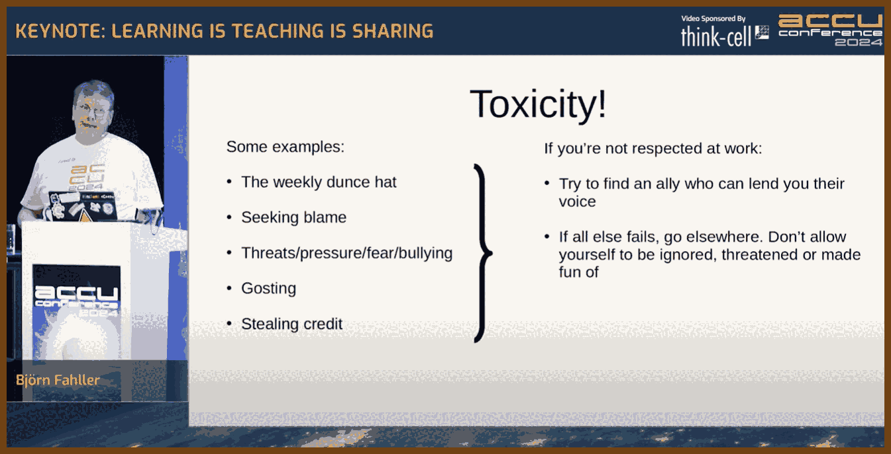
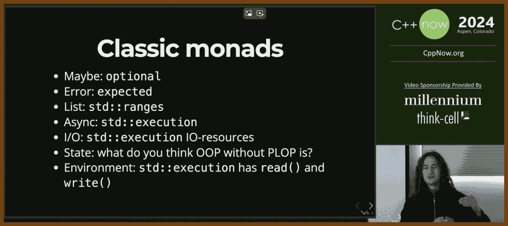
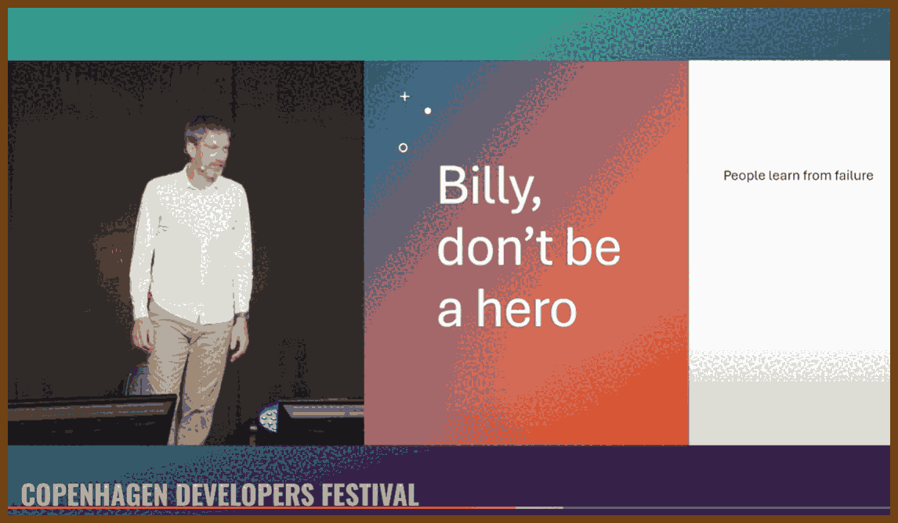
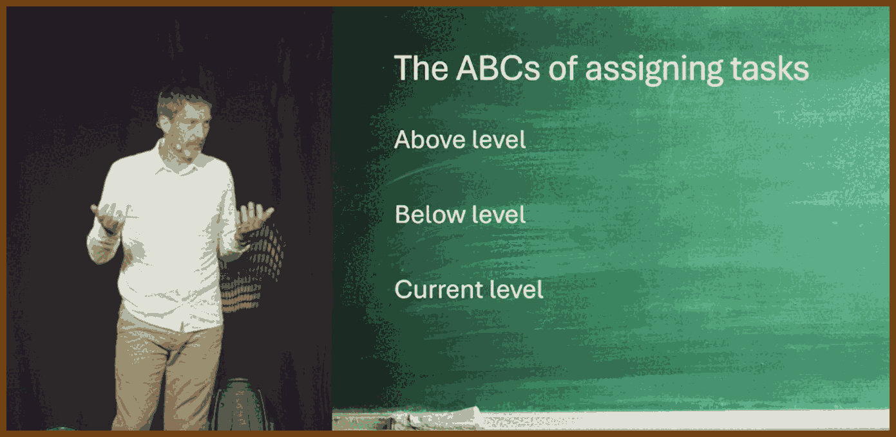
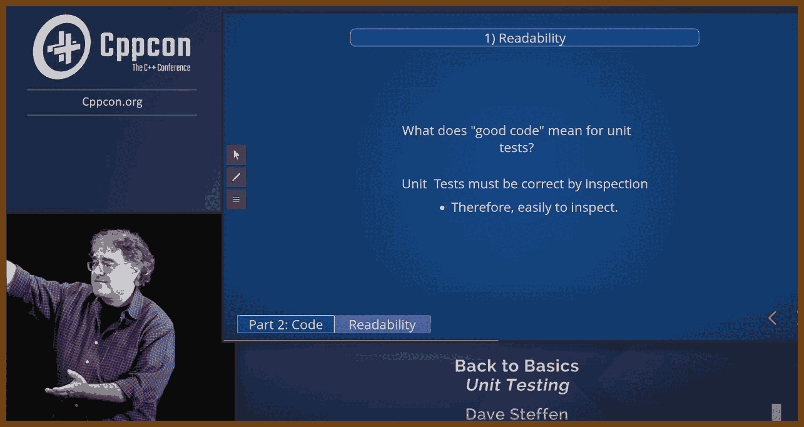

---
layout: post
title:  "Links from my inbox 2024-11-16"
date:   2024-11-16T01:07:00-08:00
categories: links
---

## ⌚ Nice watch!

In this blog post, I'll be sharing a collection of videos with concise content digests. These summaries extract the key points, focusing on the problem discussed, its root cause, and the solution or advice offered. I find this approach helpful because it allows me to retain the core information long after watching the video. This section will serve as a dedicated space for these "good watches," presenting only the most valuable videos and their takeaways in one place.


2024-10-16 [Can Chinese Speakers Read Japanese? - YouTube](https://www.youtube.com/watch?v=ZWsLahVQj9s) { www.youtube.com }

> 

> 

2024-11-03 [Keynote: Learning Is Teaching Is Sharing: Building a Great Software Development Team - Björn Fahller - YouTube](https://www.youtube.com/watch?v=Cjh73F11EJ4) { www.youtube.com }

> 
>
> We attended a talk by Björn Fahller at ACCU 2024, focusing on how *learning, teaching,* and *sharing* are interdependent and critical to team success and personal growth. Below are key steps and ideas that were covered, with some outcomes noted and a few clarifications where needed. 
>
> **1. Emphasizing Open Sharing for Safety and Improvement (13:52-14:36):**
> Fahller shared an anecdote from 1968 about Swedish military aviation, highlighting the importance of allowing team members to communicate openly, especially about mistakes or difficulties, without fear of punishment. This approach encourages honesty and helps prevent repeated mistakes.
>
> > "Military aviation is dangerous... let them openly, and without risk for punishment, share the problems they face while flying."
>
> **Outcome:** Building a safe environment for sharing leads to a culture where team members can discuss failures without fear, helping the team learn from each experience and improve.
>
> > 🤖 GPT: Fahller’s translation suggests he views open communication as essential to growth and trust in teams, especially in high-stakes fields.
>
> **2. Encouraging Question-Asking and Knowledge Sharing (20:00):**
> In discussing "Sharing is Caring," Fahller emphasized the need for team members to bring up issues or observations that might seem trivial to ensure continuous improvement. He gave examples from aviation, such as pointing out gusts of wind affecting landing, to show how small insights can contribute to collective knowledge.
>
> **Outcome:** Actively sharing observations improves understanding and may reveal underlying problems that would otherwise go unnoticed. Open communication is key to refining processes.
>
> > 🤖 GPT: Fahller’s examples reinforce the idea that even seemingly minor details should be voiced -- they may be crucial in the big picture.
>
> **3. Addressing Information Overload in Teams (37:52):**
> New team members often feel overwhelmed by the volume of information shared by experienced team members. Fahller suggested that newcomers should ask experienced members to slow down, provide context, and "paint the scene" so they can understand the background of the tasks.
>
> > "Ask them to paint the scene. What are they trying to achieve? What is it that is not working?"
>
> **Outcome:** When we take the time to explain context to newcomers, it helps bridge knowledge gaps and allows everyone to contribute effectively.
>
> > 🤖 GPT: This approach builds understanding but also patience and humility in experienced team members by reminding them to make knowledge accessible.
>
> **4. Creating a Positive Review Culture (33:47):**
> In discussing code reviews, Fahller contrasted two styles: dismissive comments (e.g., "I don’t understand. Rewrite!") vs. constructive feedback (e.g., "Can you explain why you chose to do it this way?"). He emphasized that reviews should be treated as educational opportunities rather than judgment sessions.
>
> **Outcome:** Constructive reviews foster a growth-oriented environment and allow both the reviewer and reviewee to learn. Constructive feedback motivates improvement, while dismissive comments discourage engagement.
>
> > 🤖 GPT: A consistent, constructive review culture also promotes long-term trust and makes code quality a shared team responsibility.
>
> 
>
> **5. Handling Toxicity in the Workplace (55:45):**
>
> In this segment, Björn Fahller tackled the issue of **toxicity** within teams and its corrosive effects on collaboration, morale, and individual well-being. He addressed specific toxic behaviors that often crop up in workplaces, describing them not as isolated incidents but as patterns that can erode trust and productivity if left unchecked. Fahller’s examples of toxic behavior included:
>
> - **"The weekly dunce hat"** – Singling out someone each week as a scapegoat or object of ridicule, effectively creating an atmosphere of shame and fear.
> - **Blame-seeking** – Looking for someone to hold responsible for problems, rather than investigating issues constructively or as a team.
> - **Threats, pressure, fear, and bullying** – Using intimidation tactics to push individuals into compliance, often stifling creativity, openness, and morale.
> - **Ghosting** – Ignoring someone’s contributions or input entirely, which Fahller noted can make people feel alienated and undervalued.
> - **Stealing credit** – Taking recognition for someone else’s work, which not only demoralizes the actual contributor but also creates a culture of mistrust.
>
> Fahller stressed that these behaviors are not only demoralizing but actively prevent individuals from sharing ideas and asking questions openly. Such an environment can force people into silence and self-protection, hindering the team’s ability to learn from mistakes and innovate. He emphasized that the first step in combating toxicity is **recognition**—understanding and identifying toxic patterns when they appear.
>
> > "If you're not respected at work," Fahller advised, the first course of action is to try to find **an ally**. An ally can provide a supportive voice and help validate one's experiences, which can be especially important if toxic behavior is widespread or normalized within the team. An ally may be able to speak up on your behalf, lend credibility to your concerns, and offer support when you’re confronting challenging dynamics. This shared voice can help to bring attention to the toxicity and, ideally, drive change.
>
> However, Fahller acknowledged that finding an ally may not always be enough. If a toxic environment persists despite attempts to address it, he advised a **more decisive response**: leaving. He argued that individuals should not allow themselves to be "ignored, threatened or made fun of," as staying in such an environment can be mentally and emotionally draining, ultimately leading to burnout and disengagement.
>
> > "If all else fails, go elsewhere. Don’t allow yourself to be ignored, threatened or made fun of." 
>
> This recommendation underscores Fahller's stance that no one should feel compelled to remain in an unchangeable toxic environment. He suggested that people value their self-respect and mental health over job stability if the work culture is irredeemably harmful.
>
> Fahller’s advice reflected a pragmatic approach to toxicity: address it internally if possible, but recognize when to prioritize personal well-being over enduring a dysfunctional work environment. While leaving a job is often a difficult decision, Fahller's message was clear -- don’t compromise on respect and support. A healthy team environment where people feel safe and valued is essential not just for individual satisfaction but also for collective success.

2024-11-03 [Nikhil Suresh - Skills that programmers need, to defend both their code and their careers - YouTube](https://www.youtube.com/watch?v=xlf4oXoP8qI) { www.youtube.com }

> 
>
> In his talk, **Nikhil Suresh**, the director of Hermit Tech, explores the challenges that software engineers face in the corporate world. He begins with an old animal fable about a scorpion and a frog to illustrate the dynamics between programmers and businesses.
>
> > "The scorpion wants to ship a web application but cannot program, so it finds a frog because frogs are incredible programmers."
>
> The scorpion assures the frog that it won't interfere with his work. However, after some time, the scorpion hires an agile consultant and imposes new restrictions, disrupting the frog's workflow. This story mirrors how businesses often unknowingly hinder their own developers.
>
> Nikhil emphasizes that **most companies don't know much about software**, making it difficult for programmers to clearly indicate their value. He refers to **Sturgeon's Law**, which states that "90% of everything is bad," highlighting the prevalence of low standards in the industry.
>
> He shares personal experiences where previous engineers lacked basic competence, such as not setting primary keys in databases or causing exorbitant costs due to misconfigured systems. These anecdotes illustrate that **businesses cannot tell the difference between good and bad programmers**, leading to competent developers being undervalued.
>
> Introducing the concepts of **profit centers** and **cost centers**, Nikhil explains that IT departments are often seen as cost centers, affecting how programmers are treated within organizations. He points out that **being better at programming isn't always highly valued by companies** because they may not see a direct link between technical skill and profit.
>
> To navigate these challenges, Nikhil advises developers to **never call themselves programmers**. He argues that the term doesn't convey meaningful information and can lead to misconceptions.
>
> > "If you tell someone who doesn't program that you're a programmer, their first thought is like, 'Ah, one of those expensive nerds.'"
>
> He recommends reading Patrick McKenzie's article ["Don't Call Yourself a Programmer, and Other Career Advice"](https://www.kalzumeus.com/2011/10/28/dont-call-yourself-a-programmer/), which offers insights into presenting oneself more effectively in the professional sphere.
>
> Nikhil encourages developers to **write about their experiences and share them online**. By doing so, they can showcase their unique ideas and differentiate themselves in the field. He believes that **your unique ideas are what differentiate you from others** and that sharing them helps in building a personal brand.
>
> He also suggests that programmers should **read outside of IT and delve into the humanities**. This broadens their perspectives and provides valuable analogies for complex ideas. Nikhil shares how his involvement in **improvised theater** and reading ["Impro: Improvisation and the Theatre" by Keith Johnstone](https://www.routledge.com/Impro-Improvisation-and-the-Theatre/Johnstone/p/book/9780878301171) helped him understand **status dynamics** in professional interactions.
>
> Understanding these dynamics allows developers to navigate job interviews and workplace relationships more effectively. Nikhil emphasizes the importance of **taking control of your career** and making decisions that enhance your value to both yourself and society.
>
> In conclusion, Nikhil urges developers to recognize that **technical skill isn't the main barrier to having a better career**. Factors like communication, strategic thinking, and understanding corporate dynamics play crucial roles. By focusing on these areas, developers can transform their passion into something that has greater value for both themselves and the broader community.

2024-11-02 [Get old, go slow, write code! - Tobias Modig - NDC Oslo 2024 - YouTube](https://www.youtube.com/watch?v=lfCQhiibI5M) { www.youtube.com }

> 
>
> 📝 Sustainable Software Development Careers: Aging, Quality, and Longevity in Tech
>
> **Introduction**  
> In the fast-evolving world of software development, many professionals feel the pressure to stay young, move fast, and keep up with new trends. But does speed really equal success in this field? This post is for experienced developers, tech managers, and anyone considering a long-term career in software. We'll explore why sustainability in development—focusing on quality, experience, and career longevity—matters and how you can embrace aging as an asset, not a setback.  
>
> **Why You Should Care**  
> The tech industry often promotes rapid career progression and cutting-edge skills over stability and endurance. However, valuing experience, avoiding burnout, and emphasizing quality over speed are essential for creating durable, impactful software and ensuring personal career satisfaction. 
>
> **Embracing Aging as a Developer**  
>
>    Many developers worry about becoming irrelevant as they age, yet experience can be a strength. Research shows the average age of developers is among the lowest across professional fields, meaning many leave the field early. However, experience contributes to problem-solving, architectural insights, and higher quality standards. Older developers often provide unique perspectives that younger professionals may lack, particularly in maintaining and improving code quality.
>
> **Slowing Down for Quality**  
>
>    Too many developers face intense pressure to deliver quickly, often sacrificing quality. This results in technical debt and rushed code that becomes difficult to maintain. The speaker argues that development is a marathon, not a sprint. Slowing down and building sustainable software creates long-term benefits, even if it appears slower at first. By prioritizing thoughtful coding and taking the time to address technical debt, developers can create resilient, maintainable systems.
>
> **Challenges with Traditional Career Progression**  
>
>    Many companies push experienced developers into management roles, which can leave skilled coders dissatisfied and underutilized. Known as the Peter Principle, this approach often results in skilled developers becoming ineffective managers. For those passionate about coding, staying in development roles—rather than climbing the corporate ladder—can offer fulfillment, especially if companies recognize and reward this choice.
>
> **Common Reasons Developers Leave the Field**  
>
>    Major reasons include burnout, shifting to roles with higher prestige, and losing the spark for coding. Additionally, aging can lead to insecurities about keeping up. To combat these trends, developers should prioritize work-life balance, take time to learn, and avoid the mindset that career progression has to mean management.
>
> **Practical Ways to Build a Sustainable Career**  
>
>    - **Commit to Continuous Learning**: Attend conferences, read, and experiment with code to stay current.  
>    - **Focus on Quality over Speed**: Embrace practices like regular code reviews, refactoring, and retrospectives to build robust systems.  
>    - **Build Team Trust and Psychological Safety**: A supportive environment enhances productivity, allowing team members to grow together.
>    - **Incorporate Slack Time**: Give yourself unstructured time to think, learn, and work creatively, helping avoid burnout and stagnation.
>
> **Let Experience Be Your Advantage**  
>
>    Staying relevant as a developer means focusing on the quality of your contributions, leveraging your experience to guide teams, and advocating for sustainable practices that benefit the entire organization. By valuing experience, resisting the rush, and maintaining passion, you can contribute meaningfully to tech at any age.
>
> **Quotes**
>
> >  "Getting old in software development is not a liability—it's an asset. Make those gray hairs your biggest advantage and let your experience shine through in quality code."
>
> > "Software development is not a sprint; it's a marathon. We need to slow down, find a sustainable pace, and stop rushing to deliver at the expense of quality."
>
> > "Don't let your career be dictated by the Peter Principle—just because you're a great developer doesn’t mean you’ll enjoy management. Stay with your passion if it’s coding."
>
> > "Poor quality code isn’t just a short-term fix; it’s a long-term burden. Building things right the first time is the fastest way to long-term success."
>
> > "There’s no need to be Usain Bolt in development; be more like a marathon runner. Set a steady, sustainable pace, focus on quality, and enjoy the journey."

2024-10-29 [The Evolution of Functional Programming in C++ - Abel Sen - ACCU 2024 - YouTube](https://www.youtube.com/watch?v=zmOaBT3i_Hc) { www.youtube.com }

> 

2024-11-04 [Functional C++ - Gašper Ažman - C++Now 2024 - YouTube](https://www.youtube.com/watch?v=bHxvfwTnJhg) { www.youtube.com }

> 

This is procedural version of code that is ugly and has to be modernized with functional programming. 

```cpp
// procedural example
auto is_hostname_in_args(int, char const* const*) -> bool;
auto get_hostname_from_args(int, char const* const*) -> char const*;

auto get_hostname(int argc, char const* const* argv, std::string default_hostname) -> std::string {
    // Split query / getter
    if (is_hostname_in_args(argc, argv)) {
        // Perhaps... might use optional here too?
        return get_hostname_from_args(argc, argv);
    }

    // Ad-hoc Maybe
    if (char const* maybe_host = getenv("SERVICE_HOSTNAME"); 
        maybe_host != nullptr && *maybe_host != '\0') {
        return maybe_host;
    }

    return default_hostname;
}
```

Unfortunately, I cannot provide the function version, because I don't understand it. 

2024-11-07 [Reintroduction to Generic Programming for C++ Engineers - Nick DeMarco - C++Now 2024 - YouTube](https://www.youtube.com/watch?v=tt0-7athgrE) { www.youtube.com }

> 

🔥🔥🔥2024-11-06 [LEADERSHIP LAB: The Craft of Writing Effectively - YouTube](https://www.youtube.com/watch?v=vtIzMaLkCaM) { www.youtube.com }🔥🔥🔥

> 

> found in 2024-11-06 [Blog Writing for Developers](https://rmoff.net/2023/07/19/blog-writing-for-developers/) { rmoff.net }

> **Introduction**
> Writing isn’t just about sharing information; it’s about making an impact. In this insightful lecture, a distinguished writing instructor from the University of Chicago's Writing Program emphasizes that effective writing requires understanding your audience, establishing relevance, and creating a compelling narrative. This article captures the speaker’s key advice on improving writing by focusing on purpose, value, and the reader's needs.
>
> ------
>
> 1. **Focus on Value, Not Originality**
>
> - **Advice**: The speaker challenges the idea that writing must always present something "new" or "original." Instead, writers should prioritize creating valuable content that resonates with their audience.
> - **Application**: Rather than striving for originality alone, focus on producing content that addresses the reader’s concerns or questions. A piece of writing is valuable if it enriches the reader’s understanding or helps solve a problem they care about.
>
> 2. **Define the Problem Clearly**
>
> - **Advice**: To make a piece of writing compelling, start by establishing a problem that is relevant to your audience. A well-defined problem creates a sense of instability or inconsistency, which engages readers and positions the writer as a problem-solver.
> - **Application**: Use contrasting language to highlight instability—words like "but," "however," and "although" signal unresolved issues. This approach shifts the reader’s focus to the problem at hand, making them more receptive to the writer's proposed solution.
>
> 3. **Understand and Address Your Reader’s Needs**
>
> - **Advice**: A writer’s task is to understand the specific needs and concerns of their reading community. This involves identifying problems that resonate with them and framing your thesis or solution in a way that is relevant to their lives or work.
> - **Application**: In academic and professional settings, locate problems in real-world contexts. Rather than presenting background information, articulate a challenge or inconsistency that is specific to the reader’s field or interests, making your argument compelling and directly relevant.
>
> 4. **Use the Language of Costs and Benefits**
>
> - **Advice**: Writers should make it clear how the identified problem affects the reader directly. Frame issues in terms of "costs" and "benefits" to emphasize why addressing the problem is essential.
> - **Application**: Highlight the impact of ignoring the problem versus the benefits of solving it. This approach reinforces the relevance of your writing by aligning it with the reader’s motivations and concerns.
>
> 5. **Beware of the "Gap" Approach**
>
> - **Advice**: Avoid using the concept of a "knowledge gap" as the sole justification for writing on a topic. While identifying gaps in research can work, it often lacks the urgency or impact required to engage readers fully.
> - **Application**: Rather than just pointing out missing information, emphasize the practical implications of filling that gap. Explain how the lack of certain knowledge creates instability or inconsistency in the field, making the need for your insights more compelling.
>
> 6. **Adopt a Community-Centric Perspective**
>
> - **Advice**: Tailor your writing to the specific communities who will read it. Different communities (e.g., narrative historians vs. sociologists) have distinct approaches to problems and value different types of arguments.
> - **Application**: Define and understand the community of readers your work is meant to serve. Address their concerns directly and frame your argument in terms that align with their unique perspectives and values.
>
> 7. **Learn from Published Articles**
>
> - **Advice**: Published work often contains subtle rhetorical cues about what resonates with readers in a specific field. Study these articles to understand the language, structure, and approach that successful writers use.
> - **Application**: Identify patterns in the language of published work within your target field. For instance, if a journal commonly uses cost-benefit language, incorporate it into your writing to align with reader expectations.
>
> 8. **Emphasize Function Over Form**
>
> - **Advice**: Writing should serve a clear function beyond just following formal rules. Effective writing achieves its purpose by clearly communicating the problem and its significance to readers.
> - **Application**: Instead of focusing solely on rules or formalities, think about what your writing needs to accomplish for your audience. Make sure that every section and statement reinforces your overall argument and purpose.

2024-11-08 [Developer Joy – How great teams get s%*t done - Sven Peters - NDC Oslo 2024 - YouTube](https://www.youtube.com/watch?v=zqjyPl5ytZc) { www.youtube.com }

> 
>
> 
>
>
> 
> In today’s fast-evolving tech landscape, “Developer Joy” is emerging as a crucial focus for engineering teams striving to deliver high-quality, innovative software. For those in software engineering or tech management, this concept brings a fresh perspective, shifting away from traditional productivity metrics and emphasizing a developer’s experience, satisfaction, and creativity. By focusing on Developer Joy, teams can foster an environment where developers not only perform optimally but also find deep satisfaction in their craft. This shift is more than just a trend; it’s a rethinking of how we define and sustain productivity in a complex, creative field like software development.
>
> **The Problem with Traditional Productivity Metrics**
>
>    Traditional productivity measures, like lines of code or tasks completed, often fail to capture a developer's real impact. Software development, unlike factory work, requires creativity, problem-solving, and adaptability—traits that are poorly reflected in industrial-era metrics. Instead of simply measuring output, focusing on Developer Joy acknowledges the unique, non-linear nature of coding and innovation. 
>
> **Developer Joy: A New Approach to Productivity**
>
>    Developer Joy isn't about doing more in less time; it’s about creating an environment where developers thrive. When developers are joyful, they produce better code, collaborate more effectively, and sustain their motivation over time. Atlassian’s approach to Developer Joy incorporates several elements to support this environment:
>
>    - **High-quality Code:** Developers enjoy working with well-structured, maintainable code.
>    - **Progressive Workflows:** Fast, friction-free pipelines allow developers to take an idea from concept to deployment quickly.
>    - **Customer Impact:** When developers know they’re making a meaningful difference for users, they feel a greater sense of pride and accomplishment.
>
>  **Tools and Processes to Foster Developer Joy**
>
>    To enable Developer Joy, teams at Atlassian have implemented practical solutions:
>
>    - **Constructive Code Reviews:** By establishing a code review culture where feedback is respectful and constructive, teams can maintain high standards without discouraging or frustrating developers. Guidelines like assuming competence, offering clear reasoning, and avoiding dismissive comments make reviews both productive and uplifting.
>
>    - **Flaky Test Detection:** The Confluence team developed an internal tool that identifies “flaky tests” (tests that fail intermittently) to save developers from unnecessary debugging. This tool boosts productivity by automating the detection and removal of unreliable tests.
>
>    - **The Punit Bot for Review Notifications:** Timely code reviews are essential for maintaining team flow. The Punit Bot automatically notifies team members when their input is needed on pull requests, cutting down waiting times and keeping development on track.
>
> **Cross-Functional, Autonomous Teams**
>
>    Teams need the freedom to work independently while staying aligned on goals. By embedding key functions within each team (like design, QA, and operations), Atlassian ensures that teams can progress without external dependencies. This “stack interchange” model allows each team to flow without bottlenecks.
>
> **Quality Assistance over Quality Assurance**
>
>    Developers at Atlassian don’t rely solely on QA engineers to validate code. Instead, they partner with QA in the planning stage, gaining insights on testing best practices and writing their own test cases. This approach, called “Quality Assistance,” keeps quality embedded throughout the process and gives developers more control over the software they release.
>
>  **Collaborating with Product Teams**
>
>    Effective collaboration with product teams is crucial. Atlassian integrates developers into the full product lifecycle—from understanding the problem to assessing impact after release. This holistic involvement reduces miscommunication, enables rapid adjustments based on early feedback, and fosters a sense of ownership and pride in the end product.
>
> **The Developer Joy Survey: Measuring What Matters**
>
>    To ensure Developer Joy remains high, Atlassian conducts regular “Developer Joy Surveys,” asking developers about their satisfaction in areas such as tool access, wait times, autonomy, and overall work satisfaction. By measuring both satisfaction and importance, teams identify and address specific challenges to ensure joy remains a central part of their development culture.
>
> ---
>
> **Notable Quotes and Jokes**
>
> - “Developer Joy is about creating an environment where developers thrive, not just survive.”
> - “If you can’t measure Developer Joy, you’re probably measuring the wrong thing.”
> - “Code reviews should be about learning, not earning jerk points.”
> - “Productivity isn’t about lines of code; it’s about finding joy in the code you write.”

2024-11-09 [Herding cats: lessons from 15 years of managing engineers at Microsoft - Kevin Pilch - YouTube](https://www.youtube.com/watch?v=eg8Q8jR6tX4) { www.youtube.com }

> 

> 

>  ***Introduction***
>  **Purpose and Relevance**  
>  This talk explores the nuances of managing software engineering teams. It’s particularly relevant for new or seasoned managers, especially those transitioning from technical roles to leadership. The speaker, **Kevin Pilch**, leverages his extensive experience managing engineering teams at Microsoft to provide insights into effective management strategies, challenges, and actionable advice.
>
>  **Target Audience**  
>  Ideal for **current and aspiring managers** of software engineering teams, as well as individual contributors considering a management path.
>
>  ***Main Content***
>
>  **Coaching vs. Teaching**  
>  The emphasis here is on **coaching** engineers rather than simply teaching them. Coaching means asking questions that encourage team members to find solutions independently, fostering growth and engagement. By using the **"ask solution" quadrant approach**, managers can guide engineers toward problem-solving rather than directly offering answers, which enhances ownership and accountability.
>
>  **Focus on Top Performers**  
>  Spend more time supporting **top performers** instead of focusing solely on underperformers. The impact of losing a high performer is significant—they are often **highly sought after** and can easily find other opportunities. Retaining skilled contributors by offering continuous support and new challenges is essential.
>
>  **Importance of Self-Evaluation**  
>  The **self-evaluation process** is a valuable opportunity for engineers to reflect on their career paths, skill gaps, and accomplishments. By encouraging engineers to **take ownership** of self-assessments, managers promote introspection and personal growth, while also creating useful documentation for future managers and potential promotions.
>
>  **Providing Clear Feedback**  
>  When giving performance feedback, it’s essential to **avoid “weasel words”** and sugarcoating, which soften the message and create misunderstandings. Use specific language that correlates to performance expectations—such as **“lower than expected impact”**—to ensure feedback is **clear, actionable**, and direct.
>
>  **Encouraging Constructive Failure**  
>  Allow team members to experience **failure on controlled projects** to enhance learning and resilience. This approach lets engineers learn from mistakes without jeopardizing critical objectives. By creating “safe-to-fail” environments, managers can frame certain projects as experiments and define success metrics upfront, avoiding sunk cost fallacies and confirmation biases.
>
>  **Task Assignment Using the ABC Framework**  
>  Assign tasks based on **complexity relative to each team member’s skill level**. Above-level tasks serve as **stretch assignments** to promote growth, current-level tasks reinforce skills, and below-level tasks include routine but necessary responsibilities that everyone shares. Balancing these types keeps team members **challenged and engaged** while ensuring essential work is completed.
>
>  **Motivating Different Personality Types**  
>  The **SCARF model**—Status, Certainty, Autonomy, Relatedness, Fairness—can help recognize **diverse motivators** across the team. Managers should tailor interactions to each team member’s unique motivators, fostering a supportive environment that avoids triggering negative responses.

2024-11-12 [Success On Your Own Terms - Todd Gardner - CPH DevFest 2024 - YouTube](https://www.youtube.com/watch?v=lRXcxTMH7X4) { www.youtube.com }

> 
>
> **Defining Success on My Own Terms: Lessons from My Journey in Tech**
>
> For over 25 years, I've navigated the ever-changing landscape of the tech industry. This journey has been filled with successes, failures, and invaluable lessons that have shaped not only my career but also my understanding of what success truly means. If you're a developer, entrepreneur, or someone contemplating your own path in tech, perhaps my experiences can offer some insights.
>
> **The Evolution of Success**
>
> My definition of success has shifted throughout my career. It began with a desire for prestige, evolved into a quest for independence, and later transformed into valuing time above all else. I've come to realize that success isn't a fixed destination but a moving target that changes as we grow.
>
> *"The definition of success for me has shifted throughout my career. It used to just mean prestige. Then it meant independence, and then it meant time, and it's probably going to change again."*
>
> **Building Request Metrics**
>
> I founded Request Metrics with the goal of addressing a critical problem: web performance. Initially, we focused on client-side observability, aiming to help developers monitor their websites and applications. However, we soon discovered that web performance is a complex issue, laden with constantly changing metrics and definitions.
>
> **The Challenge of Web Performance**
>
> Developers often struggle with understanding and improving web performance. The industry's metrics seem to continually shift, making it hard to pin down what "fast" truly means. This confusion was costing businesses real money, especially as user expectations for speed grew.
>
> *"It turns out developers don't know how to make things fast, and it's a problem that got a lot more important recently because of a thing Google did called the Core Web Vitals."*
>
> **Google's Core Web Vitals**
>
> The game changed when Google introduced Core Web Vitals—a set of metrics that directly impact search rankings. Suddenly, web performance wasn't just a technical concern but a business-critical issue. Companies that relied on SEO for visibility faced tangible consequences if their websites didn't meet these new standards.
>
> *"Google said, 'This is how fast you need to be,' and if you don't, you're going to lose page rank. So now this suddenly got way more... now there is a cost to do this. If you are an e-commerce store or you are a content publisher... you care a whole lot about the Core Web Vitals; you care about performance."*
>
> **Pivoting to Solve Real Problems**
>
> Recognizing this shift, we pivoted Request Metrics to focus on helping businesses understand and improve their Core Web Vitals. We developed tools that provide clear, actionable insights into performance issues. By doing so, we addressed a real pain point, offering solutions that companies were willing to invest in to protect their search rankings and user experience.
>
> *"We started building a new thing that was all about the Core Web Vitals. It was like, 'This is the problem that we need to solve.' Businesses that depend on their SEO... it's not clear when they're about to lose their SEO ranking because of performance issues. So let's focus on that."*
>
> **Lessons Learned**
>
> Throughout this journey, I've learned several key lessons.
>
> Time is precious. Life is unpredictable, and opportunities can be fleeting. It's crucial to focus on what truly matters and act promptly.
>
> *"First, you don't have as much time as you think. This story can end for any one of us tomorrow... It might all be over tomorrow, so do what you think is important."*
>
> Embracing uncertainty is essential. Feeling unprepared is natural. Many successful endeavors begin without a clear roadmap. Confidence often comes from taking action and learning along the way.
>
> *"Don't worry if you don't know, if you don't feel confident in what you're doing. None of us know what we're doing when we start... They just started and figured it out as they went. You can do that too."*
>
> Building relationships is vital. Success isn't achieved in isolation. Cultivating strong relationships and working collaboratively can open doors you never knew existed.
>
> *"Remember, no matter what you do or what you want out of life, you need to build relationships with people around you. Don't isolate yourself and think you can solve it all by yourself. Those relationships... are going to pay huge dividends that you could never imagine."*
>
> Solving real problems should be a priority. Focus on creating solutions that address genuine needs. If your product solves a real problem, people are more likely to value and pay for it.
>
> *"Be sure to build products that actually solve real problems that cost people money. Otherwise, you might find yourself building something really cool that nobody is ever going to pay you for."*
>
> Adapting and evolving are necessary. Be prepared to change course. Flexibility is key to staying relevant and achieving long-term fulfillment.
>
> *"We found through this we found a problem that was costing money to real people, and this is the path that we're on right now... because now we're solving a problem for people that... it's cheaper to pay us to solve the problem than to deal with the risks."*
>
> Taking risks and shipping early can lead to growth. Don't wait for perfection. Launching early allows you to gather feedback and iterate, which is more valuable than holding back out of fear.
>
> *"If you're going to build something successful and durable... you're going to need people to help. And be sure to build products that actually solve real problems... But you won't hit them unless you ship something, and if you're not embarrassed of it, you're waiting too long. Just throw something together and get it out there and see if anybody cares."*
>
> **Moving Forward**
>
> As I continue on this path, I understand that my definition of success will keep evolving. What's important is to remain true to oneself, prioritize meaningful work, and leverage relationships to create lasting impact.

2024-11-14 [Windows: Under the Covers - From Hello World to Kernel Mode by a Windows Developer - YouTube](https://www.youtube.com/watch?v=Gf-dwrwVcMs) { www.youtube.com }

> 
>
> For programmers and tech enthusiasts, "Hello World" is a rite of passage, a first step in coding. But behind the simplicity of printing "Hello World" on the screen, there lies a deeply intricate process within the Windows operating system. This article uncovers the fascinating journey that a simple `printf` command in C takes, from the initial code execution to the text’s appearance on the screen, traversing multiple layers of software and hardware. If you're curious about what happens behind the scenes of an OS or want a glimpse into the hidden magic of programming, this guide is for you.
>
> 1. **Starting Point: Writing `Hello World` in C**
>    - The classic C code `printf("Hello, World!");` initiates the journey. In this line, the `printf` function doesn't directly display text. Instead, it prepares data for output, setting off a series of calls to the OS to manage the display of the text.
>
> 2. **Processing `printf`: User Mode to Kernel Mode**
>    - The runtime library processes `printf`, identifying format specifiers and preparing raw text to be sent to the output. This initiates a function call, like `WriteFile` or `WriteConsole`, which interacts with Windows’ Win32 API—a vast interface linking programs to system resources.
>    - **Kernel32.dll**: Despite its name, `Kernel32.dll` operates in user mode, providing system access without directly tapping into the kernel. Named for historical reasons, it bridges functions requiring OS kernel resources by keeping security intact.
>
> 3. **Transitioning with System Calls**
>    - System calls serve as gates from user mode (where applications operate) to kernel mode (where core OS processes run). Here, Windows uses the System Descriptor Table and system calls like `int 2E` to cross into kernel mode securely, ensuring only validated programs access system resources.
>
> 4. **Windows Kernel Processing with `ntoskrnl.exe`**
>    - After the system call, `ntoskrnl.exe` checks permissions and validates parameters to ensure secure execution. This step guarantees the program isn’t making unauthorized access attempts, which fortifies Windows against possible exploits.
>
> 5. **Console Management through `csrss.exe`**
>    - The Client Server Runtime Subsystem (`csrss.exe`) manages console windows in user mode. `csrss` updates the display buffer, which holds the text data ready for rendering. It keeps a two-dimensional array of characters, handling all aspects like color, intensity, and style to maintain the console window’s appearance.
>
> 6. **Rendering Text with Graphics Device Interface (GDI)**
>    - GDI takes over for text rendering within the console, providing essential drawing properties like font and color. The console then relies on the Windows Display Driver Model (WDDM), which bridges communication between software and the graphics hardware.
>
> 7. **The GPU and Frame Buffer**
>    - The GPU receives the data, rendering the text by processing pixel-by-pixel instructions into the frame buffer. This buffer, a region of memory storing display data, holds the image of "Hello World" that will appear on screen. The GPU then sends this image to the display via HDMI or another interface.
>
> 8. **From Monitor to Visual Cortex**
>    - The display presents the text through LED pixels, and from there, light travels to the viewer’s eyes. Visual processing occurs in the brain's visual cortex, ultimately registering "Hello World" in the viewer's consciousness—a culmination of hardware, software, and human biology.
>
> **Notable Quotes and Jokes from Dave Plummer:**
>
> - *"Imagine the simplest Windows program you could write...but do you know how the magic happens?"*
> - *"Our journey begins in userland within the heart of your C runtime library."*
> - *"Calling `printf` is like sending a messenger on a long cross-country journey from high-level code to low-level bits and back again."*
> - *"When 'Hello World' pops up on the screen, you’re witnessing the endpoint of a complex, coordinated process..."*

2024-11-14 [In Prompts We Trust - Jiaranai Keatnuxsuo - CPH DevFest 2024 - YouTube](https://www.youtube.com/watch?v=QUkrC38v9Rg) { www.youtube.com }

> 
> For those diving into AI applications, especially prompt engineering with generative AI, understanding trust-building and prompt precision is key to leveraging AI effectively. If you’re an AI practitioner, developer, or someone interested in optimizing how language models generate outputs, this guide explores techniques to achieve trustworthy and accurate AI responses. By improving prompt engineering skills, you’ll better navigate the complexities of AI interactions and make your AI applications more reliable, relevant, and valuable.
>
> 
>
> **Core Techniques and Strategies in Prompt Engineering**
>
> When working with generative AI, the goal is to create prompts that elicit useful, accurate, and relevant responses. This requires understanding both the technical aspects of prompt engineering and the psychological aspects of trust. Here are key techniques for mastering this process:
>
> **The Importance of Trust in AI Outputs**
>
> Trust plays a central role in whether users accept or reject AI-generated outputs. As the speaker noted, “Trust is the bridge between the known and the unknown.” For AI to be effective, especially in high-stakes fields like medicine or government applications, users must feel confident in the system’s reliability and fairness. Factors that foster this trust include:
>
>    - **Accuracy**: Ensuring the output is based on factual information and up-to-date sources.
>    - **Reliability**: Confirming that outputs remain consistent across different scenarios.
>    - **Personalization**: Tailoring responses to individual needs and contexts.
>    - **Ethics**: Adhering to ethical guidelines, avoiding bias, and maintaining cultural sensitivity.
>
> **Precision in Prompt Engineering: Essential Techniques**
>
> To build trust, prompts need to be structured in a way that maximizes clarity and minimizes ambiguity. Key methods include:
>
>    - **Role Prompting**: Assigning specific roles, such as “act as a coding assistant,” guides the model in responding within a particular expertise framework. As the speaker shared, “Role prompting is really good in terms of getting it to go find all those billions of web pages it was trained on.”
>
>    - **Chain of Thought Prompting**: By instructing the model to provide step-by-step reasoning, this method helps in breaking down complex queries and reducing errors. For example, prompting the model to explain each step in a calculation avoids “error piling,” where initial mistakes skew subsequent responses.
>
>    - **System Messages**: Used primarily by developers, system messages define overarching rules or tones for the AI. These instructions are hidden from the end-user but ensure the model stays consistent, ethical, and aligned with specific guidelines.
>
> **Handling AI’s Limitations: Mitigating Hallucinations and Bias**
>
> “Hallucination” refers to instances where AI generates plausible-sounding but incorrect information. The speaker explained, “We all think that hallucination is a bug; it’s actually not a bug—it’s a feature, depending on what you’re trying to do.” For applications where accuracy is crucial, employing techniques like **Retrieval-Augmented Generation (RAG)** helps ground AI responses by referencing reliable external sources.
>
> **Optimizing Prompt Parameters for Desired Outputs**
>
> Adjusting parameters such as **temperature, frequency penalties,** and **presence penalties** can enhance the creativity or precision of AI responses. For example, higher temperatures lead to more creative, varied outputs, while lower settings make responses more predictable and factual. As the speaker noted, “Every word in a prompt matters,” so these settings allow for fine-tuning responses to suit specific needs.
>
> 
>
> **Recap & Call to Action**
>
> Effective prompt engineering isn’t just about crafting prompts—it’s about understanding trust and precision. Key strategies include role prompting, step-by-step guidance, and adjusting AI parameters to manage reliability and relevance. Remember, the goal is to enhance user trust by ensuring outputs are clear, relevant, and ethically sound. Try implementing these techniques in your next AI project to see how they impact the quality and trustworthiness of your results. 

2024-11-14 [Gwern Branwen - How an Anonymous Researcher Predicted AI's Trajectory](https://www.dwarkeshpatel.com/p/gwern-branwen) { www.dwarkeshpatel.com }

> 
>
> Gwern is a pseudonymous researcher and writer. He was one of the first people to see LLM scaling coming. If you've read his [blog](https://gwern.net/), you know he's one of the most interesting polymathic thinkers alive.
>
> In order to protect Gwern's anonymity, I proposed interviewing him in person, and having my friend [Chris Painter](https://x.com/ChrisPainterYup) voice over his words after. This amused him enough that he agreed.

2024-11-16 [Modern & secure adaptive streaming on the Web - Katarzyna Dusza - CPH DevFest 2024 - YouTube](https://www.youtube.com/watch?v=a7SFcDM00vo) { www.youtube.com }

> 
>
> **Introduction**
> In today’s streaming-centric world, the demand for smooth, high-quality, and secure content playback has never been higher. Whether it’s movies, music, or live broadcasts, users expect seamless experiences across multiple devices and network conditions. For developers and media engineers, understanding adaptive streaming and secure content delivery on the web is critical to meet these demands. This guide dives into adaptive streaming, DRM encryption, and decryption processes, providing the essential tools and concepts to ensure secure, efficient media delivery.
>
> **Who This Guide Is For**
> This guide is intended for software engineers, streaming platform developers, and media engineers focused on optimizing web streaming quality and security. Those interested in learning about adaptive bitrate streaming, DRM protocols, and encryption processes will find valuable insights and practical applications.

2024-11-16 [Back to Basics: Unit Testing in C++ - Dave Steffen - CppCon 2024 - YouTube](https://www.youtube.com/watch?v=MwoAM3sznS0) { www.youtube.com }

> 
>
> **Introduction**
>
> In modern software development, unit testing has become a foundational practice, ensuring that individual components of code—specifically functions—perform as expected. For C++ developers, unit testing offers a rigorous approach to quality control, catching bugs early and enhancing code reliability. This article covers the essentials of unit testing in C++, focusing on why and how to apply it effectively in your projects. Whether you’re an experienced developer or a newcomer in C++, this guide will clarify best practices and introduce powerful frameworks to streamline your testing efforts.
>
> **Core Concepts and Challenges in Unit Testing**
>
> **Understanding Unit Testing in C++**  
> Unit testing verifies the smallest unit of code, usually a function, to confirm it works as intended. Over the past decade, it has become essential for software development projects, preventing critical bugs from reaching production and reducing the risk of project failures. While the concept is straightforward, implementing effective unit tests in C++ brings unique challenges, such as determining what to test and choosing the right framework to manage tests efficiently.
>
> **Addressing Key Challenges**  
>
> 1. **Framework Selection**: C++ offers various testing frameworks like Catch2, which simplifies setting up unit tests and provides structured error reporting.
> 2. **Consistent Definitions**: Defining what qualifies as a unit test varies across the industry. This inconsistency can complicate efforts to standardize testing practices.
> 3. **Testing Complexity**: Many projects require extensive, comprehensive testing to cover complex logic, edge cases, and integration points without compromising performance.
>
> **Implementing Unit Tests Effectively**
>
> **Using a Framework**  
> Frameworks like Catch2 streamline test organization, allowing developers to structure tests in isolated, repeatable units. They provide clear output, automated reporting, and enable testing of all components, highlighting each failure without halting the entire test process. The framework choice is critical in ensuring that tests are not only functional but also maintainable and understandable.
>
> **Structure and Placement of Tests**  
> The closer tests are to the code they evaluate, the easier they are to maintain. Best practices recommend keeping test files within the same project structure, allowing for easy updates and reducing the chance of disconnects between tests and the code they assess.
>
> **Scientific Principles in Unit Testing**
>
> Effective unit testing is analogous to scientific experimentation. Each test is an “experiment” designed to verify code behavior by testing specific inputs and expected outcomes. Emphasizing **falsifiability** ensures that tests are objective and replicable, providing clear indications of any issues. Core scientific principles in testing include:
>
> 1. **Repeatability and Replicability**: Tests should yield consistent results on repeated runs.
> 2. **Precision and Accuracy**: Tests should be specific and unambiguous, with clear indications of success or failure.
> 3. **Thorough Coverage**: Effective tests cover all code paths and edge cases, ensuring all possible scenarios are addressed.
>
> **Valid and Invalid Tests: Ensuring Accuracy**
>
> Accurate tests provide clear insights into code functionality. Avoid using the code’s output as its own test standard—known as circular logic—because it cannot reliably reveal bugs. Instead, source test expectations from reliable, external standards or reference calculations to ensure validity and rigor.
>
> **White Box vs. Black Box Testing Approaches**
>
> Two approaches define C++ unit testing:
>
> - **White Box Testing**: Tests directly access private code areas using workarounds like friend classes, allowing tests to examine internal states. However, this method ties tests closely to code structure, making future refactoring more challenging.
> - **Black Box Testing**: Tests only interact with public interfaces, testing expected behaviors from an end-user perspective. Black Box Testing is recommended for maintainability, as it allows refactoring without breaking tests by focusing on behavior rather than code internals.
>
> **Behavior-Driven Development (BDD) and Documentation**
>
> BDD guides developers to create tests focused on expected behaviors, providing intuitive documentation. Each test names and validates a specific behavior, such as "a new cup is empty," which makes understanding the code straightforward for future developers.
>
> **Designing Readable and Maintainable Tests**
>
> Readable and maintainable tests are simple and free of unnecessary complexity. Every unit test should focus on a single behavior, making tests easy to interpret and troubleshoot. This clarity is essential for enabling reviewers to understand test intentions without knowing the code intimately.
>
> **Test-Driven Development (TDD) and Its Role in Design**
>
> TDD reinforces software design by encouraging developers to write tests before code. Known as the **Red-Green-Refactor** cycle, TDD begins with writing a failing test (Red), creating code to make the test pass (Green), and refining the code (Refactor). This practice minimizes bugs from the outset, refines design, and builds a stable foundation of tests to verify code during refactoring.
