---
layout: post
title:  "Links from my inbox 2024-12-01"
date:   2024-12-01T14:27:00-08:00
categories: links
---

## Good Reads

2024-12-01 [Legacy Shmegacy - David Reis on Software](https://davidreiscto.substack.com/p/legacy-shmegacy?r=61pbc&triedRedirect=true&_bhlid=7b63148f971a9b1e15a02f9fc79767c0f906af48) { davidreiscto.substack.com }

> 
>
> People call some code legacy when they are not happy with it. Usually it simply means they did not write it, so they don’t understand it and don’t feel safe changing it. Sometimes it also means the code has low quality[1](https://davidreiscto.substack.com/p/legacy-shmegacy?r=61pbc&triedRedirect=true&utm_source=newsletter.programmingdigest.net&utm_medium=newsletter&utm_campaign=legacy-shmegacy&_bhlid=7b63148f971a9b1e15a02f9fc79767c0f906af48#footnote-1-151953138) or uses obsolete technologies. Interestingly, in most cases the legacy label is about the people who assign it, not the code it labels. That is, if the original authors were still around the code would not be considered legacy at all.
>
> This model allows us to deduce the factors that encourage or prevent some code from becoming legacy:
>
> 1. The longer are programmer’s tenure the less code will become legacy, since authors will be around to appreciate and maintain it.
> 2. The more code is well architected, clear and documented the less it will become legacy, since there is a higher chance the author can transfer it to a new owner successfully.
> 3. The more the company uses pair programming, code reviews, and other knowledge transfer techniques, the less code will become legacy, as people other than the author will have knowledge about it.
> 4. The more the company grows junior engineers the less code will become legacy, since the best way to grow juniors is to hand them ownership of components.
> 5. The more a company uses simple standard technologies, the less likely code will become legacy, since knowledge about them will be widespread in the organization. Ironically if you define innovation as adopting new technologies, the more a team innovates the more legacy it will have. Every time it adopts a new technology, either it won’t work, and the attempt will become legacy, or it will succeed, and the old systems will.
>
> The reason legacy code is so prevalent is that most teams are not good enough at all of the above to avoid it, but maybe you can be.

🥒 2024-12-01 [Tech's $90B Ghost Engineer Problem: Stanford Study Finds 9.5...](https://socket.dev/blog/ghost-engineers) { socket.dev }

> Beyond the economic and productivity concerns, ghost engineers pose significant security risks. Their lack of meaningful engagement can lead to a few critical issues: unreviewed or improperly tested code changes, unnoticed vulnerabilities, and outdated systems left unpatched. A disengaged engineer might also miss—or deliberately ignore—critical security protocols, creating potential entry points for malicious actors.
>
> When these engineers aren't actively involved in maintaining secure practices, they can create blind spots in a company’s defense strategy, increasing the risk of breaches or compliance failures. Threat actors can exploit disengaged engineers through phishing, social engineering, or leveraging neglected updates and poorly reviewed code to infiltrate systems and compromise security. Addressing these gaps requires better oversight and collaborative practices.
>
> Before you start side-eyeing your coworkers, it’s worth noting that measuring productivity in software engineering is notoriously tricky. Commit counts or hours logged are often poor indicators of true impact. Some high-performing engineers—the mythical “10x engineers”—produce significant results with fewer, well-thought-out contributions.
>
> However, the “ghost engineer” trend exposes systemic inefficiencies in talent management and performance evaluation. Remote work policies, once heralded as a game-changer, are now under the microscope. They’ve enabled flexibility for many but have also given rise to the ghost engineering phenomenon. The tug-of-war over remote versus in-office work is likely to intensify as companies grapple with these kinds of leadership and accountability issues.
>
> 

2024-11-30 [The deterioration of Google](https://www.baldurbjarnason.com/2024/the-deterioration-of-google/) { www.baldurbjarnason.com }

> I'm Baldur Bjarnason, a web developer and writer. In my latest essay, I wrote about the decline of Google and its impact on independent publishers. 
>
> 
>
> Here's a quick summary:
>
> 1. **Independent Publishers Struggling**: Many independent sites are shutting down due to a lack of traffic from Google and Facebook.
> 2. **Google's Machine Learning Issues**: Google's attempt to improve search results with machine learning has backfired, letting spam through and delisting quality content.
> 3. **Economic Impact**: Even frugally run sites can't survive on the remaining traffic, leading to significant financial struggles for creators.
> 4. **Algorithm Black Box**: Google's algorithm has become so complex that even their engineers can't fully understand or fix it.
> 5. **Monopoly Power**: Google's monopoly allows it to capture value without improving product utility, leaving users with fewer alternatives.

2024-11-30 [15 Lessons From 15 Years of Indie App Development](https://lukaspetr.com/15-lessons-from-15-years-of-indie-app-development/) { lukaspetr.com }

> Hey there, I'm Lukas Petr, an indie iOS app developer from Prague. Over the past 15 years, I've learned a lot about the ups and downs of indie app development. Here are some key takeaways:
>
> 
>
> 1. **Enjoy the Process**: Loving what you do is crucial. If you don't enjoy the journey, it will be tough to stick with it.
> 2. **Understand Your Motivation**: Know why you're doing this. For me, it's about creating something meaningful and useful.
> 3. **Risk and Reward**: The risk is high, but the reward of fulfilling work and ownership is worth it.
> 4. **Find Your Niche**: Focus on what you believe in and what scratches your own itch.
> 5. **Provide Additional Value**: Aim for sustainable value over time, not just quick gains.
> 6. **Wear Many Hats**: Be prepared to handle everything from development to marketing.
> 7. **Reflect Regularly**: Regular introspection helps you stay on track and improve.
> 8. **Learn and Apply Lessons**: Keep evolving and improving based on your experiences.
> 9. **Find Support**: Surround yourself with people who can help propel you forward.
> 10. **Luck**: Sometimes, success involves a bit of luck, but you have to put yourself out there.
>
> I hope you find these insights helpful. If you're pursuing any creative endeavor, I'm rooting for you! Feel free to reach out if you have any questions or comments.

2024-11-24 [A career ending mistake — Bitfield Consulting](https://bitfieldconsulting.com/posts/career) { bitfieldconsulting.com }

> A career-ending mistake isn't always a catastrophic error like shutting down a nuclear power station or deleting a production database; it's often subtler, like failing to plan for the end of your career. The article explores how many of us rush through our professional lives without a clear destination, highlighting that "career" itself can mean "to rush about wildly." It asks the critical questions: “Where do you want to end up? And is that where you're currently heading?” Instead of drifting, the piece advises us to define what we truly want, as "The indispensable first step to getting what you want is this: decide what you want." Whether you're content in your current role or seeking something more fulfilling, understanding your end goal and working intentionally toward it is key to avoiding a career that feels out of control.
>
> Fun quote:
>
> >  Engineering managers need a solid foundation of technical competence, to be sure, but the work itself is primarily about leading, supervising, hiring, and developing the skills of other technical people. It turns out those are all skills, too, and relatively rare ones.
>
> > Managing people is hard; much harder than programming. Computers just do what you tell them, whether that’s right or wrong (usually wrong). Anyone can get good at programming, if they’re willing to put in enough time and effort. I’m not sure anyone can get good at managing, and most don’t. Most managers are *terrible*.
>
> >  That’s quite a sweeping statement, I know. (Prove me wrong, managers, prove me wrong.) But, really, would a car mechanic last long in the job if they couldn’t fit a tyre, or change a spark plug? Would a doctor succeed if they regularly amputated the wrong leg? We would hope not. But many managers are just as incompetent, in their own field, and yet they seem to get away with it.

2024-11-23 [the tech utopia fantasy is over | ava's blog](https://blog.avas.space/tech-utopia-fantasy/) { blog.avas.space }

> Growing up, I had a positive view of tech, believing it would bring comfort, less work, and personalized assistance. However, the reality has been different, with tech companies failing to deliver on their promises and instead contributing to issues like disinformation, economic inequality, and environmental harm. While there have been some benefits, such as increased political knowledge and social connections, the negatives now overshadow the positives. The tech utopia fantasy is truly dead to me. 

2024-11-18 [Good software development habits | Zarar's blog](https://zarar.dev/good-software-development-habits/) { zarar.dev }

> 1. **Keep Commits Small**: Keep each commit focused on a single change to make it easier to track and revert issues. Code that compiles should be committable.
> 2. **Refactor Continuously**: Follow Kent Beck's advice: make changes easy, then make the easy changes. Frequent, small refactorings prevent complex reworks.
> 3. **Deploy Regularly**: Treat deployed code as the only true measure of progress. Frequent deployments ensure code reliability.
> 4. **Trust the Framework**: Don’t test features already covered by the framework; focus on testing your unique functionality, especially with small components.
> 5. **Organize Independently**: If a function doesn’t fit anywhere, create a new module. It’s better to separate logically independent code.
> 6. **Write Tests First (Sometimes)**: If unsure about an API’s design, start with tests to clarify requirements. TDD doesn’t have to be strict—write code in workable chunks.
> 7. **Avoid Duplication After the First Copy-Paste**: If code is duplicated, it’s time for an abstraction. Consolidating multiple versions is harder than parameterizing one.
> 8. **Accept Design Change**: Designs inevitably get outdated. Good software development is about adapting to change, not achieving a “perfect” design.
> 9. **Classify Technical Debt**: Recognize three types of technical debt: immediate blockers, future blockers, and potential blockers. Minimize the first, address the second, and deprioritize the third.
> 10. **Prioritize Testability in Design**: Hard-to-test code hints at design issues. Improve testability through smaller functions or test utilities to avoid skipping tests.

🔥2024-11-14 [Lessons from my First Exit · mtlynch.io](https://mtlynch.io/lessons-from-my-first-exit/) { mtlynch.io }

> Selling my first business was a journey filled with excitement, stress, and invaluable lessons. I want to share my experiences to help other entrepreneurs who might be considering a similar path. This post is especially relevant for small business owners and startup founders looking to navigate the complexities of a business exit.
>
> ---
>
> Quote:
>
> Used dedicated accounts for the business
>
> Part of what made TinyPilot’s ownership handoff smooth was that its accounts and infrastructure were totally separate from my other business and personal accounts:
>
> - I always sent emails related to the business from my @tinypilotkvm.com email address.
> - I always used @tinypilotkvm.com email addresses whenever signing up for services on behalf of TinyPilot.
> - I kept TinyPilot’s email in a dedicated Fastmail account.
>   - This wasn’t true at the beginning. TinyPilot originally shared a Fastmail account with my other businesses, but I eventually migrated it to its own standalone Fastmail account.
> - I never associated my personal phone number with TinyPilot. Instead, I always used a dedicated Twilio number that forwarded to my real number.
> - All account credentials were in Bitwarden.
>
> After closing, handing over control was extremely straightforward. I just added the new owner to Bitwarden, and they took over from there. There were a few hiccups around 2FA codes I’d forgotten to put in Bitwarden, but we worked those out quickly.
>
> ---
>
> For example, TinyPilot uses the H.264 video encoding algorithm. It’s patented, so we had to get a license from the patent holder before we shipped that feature. During due diligence, we discovered that the patent license forbade me from transferring the license in an asset sale.
>
> I immediately started imagining the worst possible outcome. What if the patent holder realizes they can block the sale, and they demand I pay them $100k? What if the patent holder just can’t be bothered to deal with a tiny business like mine, and they block the sale out of sheer indifference?

🔥 2024-11-08 [Blog Writing for Developers](https://rmoff.net/2023/07/19/blog-writing-for-developers/) { rmoff.net }

> Like a favourite pair of jeans that’s well-worn, comfy, and slightly saggy round the arse, I have a go-to structure for writing. Come to think of it, I use it for lots of conference talks too. It looks like this:
>
> 1. Tell them what you’re going to tell them
> 2. Tell them
> 3. Tell them what you told them
>
> What this looks like in practice is something along these lines:
>
> 1. **An intro**
>
>    What is this thing, and why should the reader ~~give af~~ be interested?
>
>    This could be a brief explanation of why I am interested in it, or why you would want to read my take on it. The key thing is you’re relating to your audience here. Not everyone wants to read everything you write, and that’s ok.
>
>    Let people self-select out (or in, hopefully) at this stage, but make it nice and easy. For example, if you’re writing about data engineering, make it clear to the appdev crowd that they should move on as there’s nothing to see here (or stick around and learn something new, but as a visitor, not the target audience).
>
> 2. **The article itself**
>
> 3. **A recap**
>
>    Make sure you don’t just finish your article with a figurative mic drop—tie up it nicely with a bow (a 🙇🏻 or a 🎀, either works).
>
>    This is where marketing would like to introduce you to the acronym CTA (Call To Action) 😉. As an author you can decide how or if to weave that into your narrative.
>
>    Either way, you’re going to summarise what you just did and give people something to *do* with it next. Are there code samples they can go and run or inspect? A new service to sign up for? A video to watch? Or just a general life reflection upon which to ponder.

2024-11-07 [Monorepo - Our experience](https://ente.io/blog/monorepo-retrospective/) { ente.io }

> We switched to a monorepo nine months ago, and it’s been working well for us. Before, we had multiple repositories, which made things like managing pull requests or syncing changes a hassle. With everything in one place now, the workflow feels smoother and simpler. It wasn’t a decision we overanalyzed; it just felt like the right time to try it, and we’ve been happy with the results.
>
> The main pros? First, there’s less repetitive work. Instead of opening multiple pull requests across repos for a single change, now it’s just one. Submodules, which were always a pain to manage, are mostly gone. Everything that needs to work together stays in sync naturally. Refactoring has also become easier because we can see the whole picture in one place, which encourages code improvements over time. Plus, being in the same repo has made us feel more connected as a team. Even small things, like seeing everyone’s changes when pulling updates, help us stay in the loop without extra effort.
>
> As for cons, we honestly haven’t found many. A common concern is that monorepos can get messy or slow as they grow, but for our small team, it hasn’t been an issue. We kept it simple—no strict rules, just “don’t touch the root folder”—and it’s been fine. It might not work the same for larger teams or projects with different dynamics, but for us, it’s been a clear win.

2024-10-14 [LogLog Games](https://loglog.games/blog/leaving-rust-gamedev/) { loglog.games }

> I spent three years using Rust for game development, and after shipping a few games and writing over 100,000 lines of code, I’m stepping away from it. Rust has some great qualities—its performance is top-notch, and it often lets you refactor confidently. But for fast, iterative development, which is crucial for indie games, it just doesn't align well. The borrow checker and Rust’s strictness often force unnecessary refactoring, slowing down the process of prototyping and testing new ideas. Tools like hot reloading, essential for quick feedback loops, are either clunky or nonexistent in Rust. And while the language excels in many technical areas, its game development ecosystem is still young, with fragmented solutions and limited support for things like GUI and dynamic workflows.
>
> For small teams like ours, the priority is delivering fun, polished games quickly. With Rust, I found myself spending more time fighting the language and its ecosystem than focusing on gameplay. Moving forward, we’re transitioning to tools that better support rapid iteration and creativity, even if they’re less "perfect" on paper.

2024-09-29 [It's hard to write code for computers, but it's even harder to write code for humans · Erik Bernhardsson](https://erikbern.com/2024/09/27/its-hard-to-write-code-for-humans.html) { erikbern.com }

> 
>
> **Onboarding is Key:** Users should get started quickly and see results fast.
> **Fix:** Simplify setup. Remove steps and make the tool easy to use immediately. For example, ensure API tokens are ready without extra configuration. The faster users see success, the more likely they’ll stick around.
>
> **Show Examples First:** Abstract explanations confuse users.
> **Fix:** Use examples instead of long concepts. Show how the tool works with real use cases. When I write docs, I always start with practical examples users can copy and tweak.
>
> **Errors Need Solutions:** Errors frustrate users.
> **Fix:** Make error messages helpful. Suggest fixes and show code snippets. A clear path back to success turns frustration into trust.
>
> **Avoid Too Many Ideas:** Too much upfront information overwhelms users.
> **Fix:** Keep it simple. Focus on a few core ideas to start. When I design a tool, I aim for 3-5 basic concepts that cover most use cases. Fewer concepts, fewer headaches.
>
> **Use Familiar Terms:** New words confuse people.
> **Fix:** Use common terms like "function" instead of inventing new ones. I think about how people already think about code and try to fit my tool into their existing mental model.
>
> **Flexibility Matters:** Rigid tools frustrate creative users.
> **Fix:** Let users program their own solutions with APIs or scripts. Make everything programmable so users can adapt the tool to their needs.
>
> **Don’t Overdo Magic:** Hidden behaviors often fail in edge cases.
> **Fix:** Keep defaults clear and reliable. Avoid adding unnecessary complexity. Unless I’m 99% sure a “magic” behavior will always work, I avoid it. Instead, I focus on being predictable.
>
> **Clarity Over Brevity:** Short, clever code is hard to read.
> **Fix:** Write clear, readable code. Make it easy to follow. I remind myself: people read code far more than they write it.

2024-09-29 [Too much efficiency makes everything worse: overfitting and the strong version of Goodhart’s law | Jascha’s blog](https://sohl-dickstein.github.io/2022/11/06/strong-Goodhart.html) { sohl-dickstein.github.io }

> When you optimize too much, you can make things worse instead of better. This is the essence of the **strong version of Goodhart’s Law**: when a measure becomes the target, over-optimization can degrade what you originally cared about. This principle, often studied as "overfitting" in machine learning, also applies broadly to systems like education, economics, and governance.
>
> **The Problem**: When proxies (measurements or secondary goals) are optimized too well, the actual outcomes worsen. For instance, standardized testing shifts focus from genuine learning to test preparation, undermining education. Similarly, rewarding scientists for publications incentivizes trivial or false findings over meaningful progress. Overfitting to proxies creates harmful side effects, from filter bubbles in social media to inequality in capitalism. 
> How to Fix It: Lessons from Machine Learning
>
> 1. **Better Alignment**: Make proxies closer to real goals. In machine learning, this involves better data collection. In broader systems, it means crafting laws, incentives, and norms that encourage genuine outcomes, like prioritizing long-term learning over test scores.
> 2. **Regularization**: Introduce penalties or costs for extreme behaviors. Just as machine learning uses mathematical constraints, systems can add friction:
>    - Tax extreme wealth disparities or excessive lawsuits.
>    - Impose costs for high-volume actions, like bulk emails or algorithmic trading.
>    - Penalize complexity to discourage harmful optimization.
> 3. **Inject Noise**: Add randomness to disrupt harmful optimization. Examples include:
>    - Randomized selection in competitive admissions to reduce over-preparation.
>    - Random trade processing delays to stabilize financial markets.
>    - Unpredictable testing schedules to encourage holistic studying.
> 4. **Early Stopping**: Halt optimization before it spirals out of control. In systems, this could mean:
>    - Capping time spent on decision-making relative to its stakes.
>    - Freezing certain information flows, like press blackouts before elections.
>    - Splitting monopolies to prevent market over-consolidation.
> 5. **Restrict or Expand Capabilities**:
>    - **Restrict**: Limit system capacities to prevent runaway effects, like capping campaign finances or AI training resources.
>    - **Expand**: In some cases, more capacity reduces trade-offs, such as developing clean energy or transparent information systems.

```latex
BibTeX entry for post:
@misc{sohldickstein20221106,
  author = {Sohl-Dickstein, Jascha},
  title = {{ Too much efficiency makes everything worse: overfitting and the strong version of Goodhart's law }},
  howpublished = "\url{https://sohl-dickstein.github.io/2022/11/06/strong-Goodhart.html}",
  date = {2022-11-06}
}
```

2024-09-29 [Measuring Developers' Jobs-to-be-done - by Abi Noda](https://substack.com/@abinoda/p-148270749) { substack.com }

> 2024-09-29 [Measuring Developers' Jobs-to-be-done | Hacker News](https://news.ycombinator.com/item?id=41636761) { news.ycombinator.com }
>
> Google used to measure how well developer tools worked by evaluating how they supported certain tasks, like "debugging" or "writing code." However, this approach often lacked specificity that would be useful for tooling teams. For instance, "searching for documentation" is a common task, but the reason behind it—whether it's to "explore technical solutions" or "understand the context to complete a work item"—can meaningfully change a developer's experience and how well tools support them in achieving their goal. 
>
> To provide better insights, Google researchers identified the key goals developers are trying to achieve in their work and developed measurements for each goal. In this paper, they explain their process and share an example of how this new approach has benefited their teams.
>
> 

2024-10-05 [Bureaucrat mode - by Andrew Chen - @andrewchen](https://andrewchen.substack.com/p/bureaucrat-mode) { andrewchen.substack.com }

> As companies scale, they often shift from the agile, conviction-driven "[Founder mode](https://paulgraham.com/foundermode.html)" to "**Bureaucrat Mode**," where decision-making slows, and processes dominate. While startups thrive on speed and direct action, large organizations tend to create committees, expand scopes, and reward consensus over outcomes. These tendencies, while rooted in good intentions like collaboration and stability, can cripple innovation and efficiency when scaled excessively.
>
> **The Problem**: Bureaucrat Mode emerges as companies grow, driven by processes meant to manage complexity. However, these processes often become self-perpetuating, encouraging behaviors that prioritize internal metrics, visibility, and team expansion over meaningful results. Bureaucrats, focused on navigating processes rather than solving problems, replicate themselves by hiring others who thrive in such environments. This cycle of self-replication entrenches inefficiency and resistance to change.
>
> 

2024-10-10 [How to make Product give a shit about your architecture proposal – Andy G's Blog](https://gieseanw.wordpress.com/2024/10/09/how-to-make-product-give-a-shit-about-your-architecture-proposal/) { gieseanw.wordpress.com }

> When dealing with Product teams about your architecture proposal, picture yourself as a plumber who's trying to sell different service packages. This analogy highlights how you should present your technical proposals to Product in a way that aligns with their focus on **business value**. They’re not interested in technical jargon; they want to know how your architecture decision translates into a **return on investment**. 
>
> Remember that Product people are looking for results. Instead of overwhelming them with details about **OLTP** systems or **ETL processes**, you need to frame your explanation as a **negotiation** — highlighting the costs and benefits of each option, just like the plumber did with his service packages.
>
> > "Product doesn’t give a shit about how your data is stored. Product cares about products."
>
> The essence here is to avoid diving into the weeds of **indexes** or **table joins** until they understand the impact on **their budget and timeline**. When they ask, “Why is this so expensive?” that’s your cue to explain, in clear terms, the complexity involved in implementing things like **OLAP systems** or setting up **ETL processes**.
>
> Approach your conversation by outlining different “packages” — starting with the 🥇 **platinum package** that covers all technical needs but at a higher cost. This sets the stage for a **value discussion**, where Product sees the full picture and starts to understand the trade-offs involved.
>
> > "Now you can (gently) talk to them about the difference between online transaction processing systems (OLTP) and online analysis processing systems (OLAP)."
>
> The trick is to guide Product through a **step-by-step decision-making process**, laying out each feature as a **line item** on an invoice. This approach helps them grasp which elements of your proposal can be trimmed down or delayed to fit within their budget constraints. For example, if they can't afford a new **OLAP system**, offer scaled-down options, and negotiate on **scope** and **time** rather than **quality**.
>
> 🔥 One of the most crucial points is not to compromise on **quality**. In software development, you should avoid falling into the trap of lowering standards just to meet **short-term goals**. Sacrificing quality often leads to delivering subpar products that can damage customer satisfaction in the long run. As the article states, “What’s worse, delivering something a customer actually hates, or delivering nothing at all?” Maintaining a baseline of quality ensures that even with limited resources, you're delivering something worthwhile.
>
> If the Product team suggests cutting corners to fit the project into a **two-week sprint**, resist the temptation. The **iron triangle of software development** — time, scope, and budget — should always consider **quality** as a **non-negotiable factor**.
>
> Ultimately, you're helping Product to **ruthlessly prioritize** tasks to deliver the best possible outcomes within the given constraints. In these negotiations, **scope** will often be the main variable that can be adjusted to balance the budget and timeline. And when the tables turn, and it’s your idea that needs their buy-in, present it in terms of **ROI** to make a compelling case.
>
> Think like a plumber: when you know the value of what you’re selling, it’s easier to convince others to invest in the **right solution** instead of a **quick fix**. Always push for a solution that maintains a minimum level of quality, even if it means delivering less within the same time frame.

2024-11-03 [Get Me Out Of Data Hell — Ludicity](https://ludic.mataroa.blog/blog/get-me-out-of-data-hell/) { ludic.mataroa.blog }

> 📹 2024-11-03 [Nikhil Suresh - Skills that programmers need, to defend both their code and their careers - YouTube](https://www.youtube.com/watch?v=xlf4oXoP8qI) { www.youtube.com }
>
> This blog narrates an engineer's daily struggle with an overly complex and inefficient **data warehouse system**. Despite working within an ostensibly supportive team, the engineer describes their workplace as a **"Pain Zone,"** rife with convoluted processes, unchecked errors, and cultural dissonance. Here’s a detailed breakdown of the main points:
>
> The story begins with a ritual of starting the day with a senior engineering partner. Together, they embark on a shared mission to navigate the "Pain Zone," their term for the warehouse system plagued by unnecessary complexity. The **data warehouse** in question involves copying text files from different systems, and ideally, this process should require only ten steps. However, the engineer discovers over 104 discrete operations in the architecture diagram, a staggering example of the platform's inefficiency.
>
> > "Retrieve file. Validate file. Save file. Log what you did. Those could all be one point on the diagram...That's ten. Why are there *a hundred and four*?"
>
> The engineer describes the necessity of "Pain Zone navigation," a practice where engineers rely on **pair programming** for moral support to withstand the psychological toll of working in such an environment. The issue isn’t only technical; it’s deeply cultural. A culture that demands velocity while disregarding **craftsmanship** fosters an atmosphere where complexity and inefficiency go unchallenged. This attitude, the author suggests, results in the degradation of code quality, with engineers penalized for trying to refactor code.
>
> To illustrate the dysfunction further, the author recounts a routine task: checking if data from sources like Google Analytics is flowing correctly. What they find instead is garbled JSON strings dumped in the logs without logical structure, with **57,000 distinct entries** where there should be fifty. This revelation shows that for over a year, the team has been collecting "total nonsense" in the logs.
>
> > "We only have *two jobs*. Get the data and log that we got the data. But the logs are nonsense, so we aren't doing the second thing, and because the logs are nonsense *I don't know if we've been doing the first thing.*"
>
> Rather than address this critical error, management insists on working with the erroneous logs to maintain "velocity," a term often implying efficiency but, in this case, prioritizing speed over **accuracy**. The author describes the frustration of being told to parse nonsensical data instead of fixing the core issues—a situation summarized by the team motto: "Stop asking questions, you're only going to hurt yourself."
>
> The cultural disconnect deepens as the author tries to work with data from Twitter, only to find that log events lack an **event ID**. A supposed expert suggests using a column with ambiguous file path strings, each lacking logical identifiers, requiring complex **regular expressions** to infer events.
>
> > "I am expected to use regular expressions *to construct a key in my query*."
>
> In yet another disheartening revelation, the author learns that the `Validated: True` log entries are merely hardcoded placeholders, not actual validation statuses. The logs fail to capture real system states, effectively undermining auditability.
>
> By the end, the author reaches a breaking point, realizing their values diverge sharply from those of the organization. This disconnect prompts them to resign, choosing to invest their time in personal projects and consulting instead. In a closing reflection, they criticize the industry for investing in trendy **tools** like Snowflake and Databricks, without hiring engineers who understand how to design simple, effective systems. 
>
> > "I could build something superior to this with an ancient laptop, an internet connection, and spreadsheets. It would take me a month tops."
>
> This piece is a critique of both **overly complex architectures** and a corporate culture that prioritizes speed over quality. It highlights the importance of valuing craftsmanship and straightforward design in building sustainable and efficient data systems.

2024-11-24 [SciFi book: Manna – Table of Contents | MarshallBrain.com](https://marshallbrain.com/manna) { marshallbrain.com } (RIP Marshall)

> With half of the jobs eliminated by robots, what happens to all the people who are out of work? The book Manna explores the possibilities and shows two contrasting outcomes, one filled with great hope and the other filled with misery.
>
> Join Marshall Brain, founder of HowStuffWorks.com, for a skillful step-by-step walk through of the robotic transition, the collapse of the human job market that results, and a surprising look at humanity’s future in a post-robotic world.
>
> Then consider our options. Which vision of the future will society choose to follow?
>
> 
>
> - 😺 The building we exited was another one of the **terrafoam** projects. **Terrafoam** was a super-low-cost building material, and all of the welfare dorms were made out of it.  (Chapter 4)


## Newsletters

2024-09-20 [JavaScript Weekly Issue 705: September 19, 2024](https://javascriptweekly.com/issues/705) { javascriptweekly.com }

2024-09-29 [Digital signatures and how to avoid them](https://newsletter.programmingdigest.net/p/digital-signatures-and-how-to-avoid-them?_bhlid=d956fc343c0a376ef53a64c12ace03ad03dea6ca&) { newsletter.programmingdigest.net }

2024-09-29 [Implementing Blocked Floyd-Warshall algorithm](https://newsletter.csharpdigest.net/p/implementing-blocked-floyd-warshall-algorithm?_bhlid=bb2b186fa8f2cffed4cac429883b645ff9382fec&) { newsletter.csharpdigest.net }

2024-10-18 [JavaScript Weekly Issue 709: October 17, 2024](https://javascriptweekly.com/issues/709) { javascriptweekly.com }

2024-10-20 [How Discord Reduced Websocket Traffic by 40%](https://newsletter.programmingdigest.net/p/how-discord-reduced-websocket-traffic-by-40?_bhlid=9d1af2512f29ded82d248040489928d97a82d18f&) { newsletter.programmingdigest.net }

2024-10-27 [A Brief Introduction to the .NET Muxer](https://newsletter.csharpdigest.net/p/a-brief-introduction-to-the-net-muxer?_bhlid=c324299126697f5f3be40505849280dbd1938ad4&) { newsletter.csharpdigest.net }

2024-10-27 [That's Not an Abstraction](https://newsletter.programmingdigest.net/p/that-s-not-an-abstraction?_bhlid=7bbc5a6591ff6e0b3fe85ba93d1d5c3dfbc758c4&) { newsletter.programmingdigest.net }

2024-11-17 [Exploring the browser rendering process](https://newsletter.programmingdigest.net/p/exploring-the-browser-rendering-process?_bhlid=8f299cd56ad4a96609abae19c3a4be101c99626e&) { newsletter.programmingdigest.net }

2024-12-01 [Legacy Shmegacy](https://newsletter.programmingdigest.net/p/legacy-shmegacy?_bhlid=bba0aad1e18abffa8615793ad298e9fa1ce7a62c&) { newsletter.programmingdigest.net }


## Working with People

2024-11-23 [Take the Thomas-Kilmann Instrument | Improve How You Resolve Conflict](https://kilmanndiagnostics.com/overview-thomas-kilmann-conflict-mode-instrument-tki/) {kilmanndiagnostics.com}

> 
>
> Related:
>
> * 2024-11-23 [Guide to the Thomas-Kilmann Conflict Model - My Professional Development](https://mypd.co.uk/guide-to-the-thomas-kilmann-conflict-model/) {mypd.co.uk}
> * 2024-11-23 [Thomas-Kilmann Conflict Mode Instrument (TKI®) | The Myers-Briggs Company](https://www.themyersbriggs.com/en-US/Products-and-Services/TKI/) {www.themyersbriggs.com}
>
> In conflict situations, individuals often exhibit different **behavioral strategies** based on their approach to managing disagreements. Avoiding is one strategy, and here are four others, alongside avoiding, commonly identified within conflict management models like the **Thomas-Kilmann Conflict Mode Instrument (TKI):**
>
>  **Avoiding**
>
> - **Behavior:** The individual sidesteps or withdraws from the conflict, neither pursuing their own concerns nor those of the other party.
> - **When it's useful:** When the conflict is trivial, emotions are too high for constructive dialogue, or more time is needed to gather information.
> - **Risk:** Prolonging the issue may lead to unresolved tensions or escalation.
>
> ------
>
> **Competing**
>
> - **Behavior:** The individual seeks to win the conflict by asserting their own position, often at the expense of the other party.
> - **When it's useful:** When quick, decisive action is needed (e.g., in emergencies) or in matters of principle.
> - **Risk:** Can damage relationships and lead to resentment if overused or applied inappropriately.
>
> ------
>
> **Accommodating**
>
> - **Behavior:** The individual prioritizes the concerns of the other party over their own, often sacrificing their own needs to maintain harmony.
> - **When it's useful:** To preserve relationships, resolve minor issues quickly, or demonstrate goodwill.
> - **Risk:** May lead to feelings of frustration or being undervalued if used excessively.
>
> ------
>
> **Compromising**
>
> - **Behavior:** Both parties make concessions to reach a mutually acceptable solution, often splitting the difference.
> - **When it's useful:** When a quick resolution is needed and both parties are willing to make sacrifices.
> - **Risk:** May result in a suboptimal solution where neither party is fully satisfied.
>
> ------
>
> **Collaborating**
>
> - **Behavior:** The individual works with the other party to find a win-win solution that fully satisfies the needs of both.
> - **When it's useful:** When the issue is important to both parties and requires creative problem-solving to achieve the best outcome.
> - **Risk:** Requires time and effort, which may not always be feasible in time-sensitive situations.
>
> ------
>
> Each of these strategies has its strengths and limitations, and the choice of approach often depends on the context of the conflict, the relationship between the parties, and the desired outcomes. 


## Wellbeing

2024-11-03 [On Burnout, Mental Health, And Not Being Okay — Ludicity](https://ludic.mataroa.blog/blog/on-burnout-mental-health-and-not-being-okay/) { ludic.mataroa.blog }

> In this deeply personal blog post, the author reflects on the mental health struggles that many people face, sharing candid experiences with burnout and severe depression. They emphasize that everyone will have times when they are "Not Okay," and it's important to acknowledge this without shame. Through their own journey of overcoming hardship—ranging from academic pressures to toxic workplaces—they highlight the significance of seeking help, making lifestyle changes, and understanding that recovery is possible. The author encourages readers to care for themselves and others, reminding us that empathy and support can make a profound difference in navigating life's challenges.

**✨ New wiki category**:

2024-12-01 [Psy-Burnout (mental wellbeing)](https://blog.zharii.com/docs/psy-burnout) { blog.zharii.com }

> 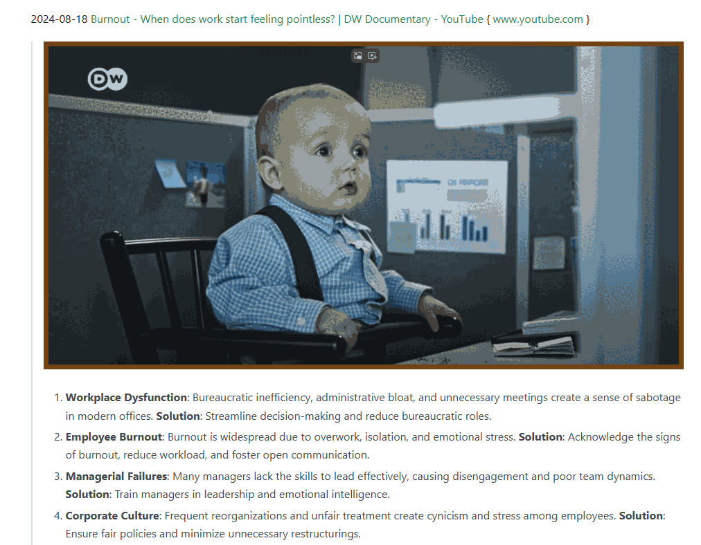


## Fun / Retro

2024-11-23  [calculatorwords.pdf](https://www.mathsquad.com/calculatorwords.pdf) 344 Words You Can Spell On a Calculator

> Compiled by Jim Bennett  2014

> 

<details>
<summary> ALL NUMBERS ARE HERE </summary>


| **English** | **Numbers** | **English** | **Numbers** | **English** | **Numbers** |
| ----------- | ----------- | ----------- | ----------- | ----------- | ----------- |
| BE          | 38          | BEE         | 338         | BEEBE       | 38338       |
| BEES        | 5338        | BEG         | 638         | BEGS        | 5638        |
| BEIGE       | 36138       | BELIE       | 31738       | BELIES      | 531738      |
| BELIZE      | 321738      | BELL        | 7738        | BELLE       | 37738       |
| 8ELLES      | 537738      | BELLIES     | 5317738     | BELLS       | 57738       |
| BESIEGE     | 3631538     | BESIEGES    | 53631538    | BESS        | 5538        |
| BESSEL      | 735538      | BESSIE      | 315538      | BIB         | 818         |
| BIBLE       | 37818       | BIBLES      | 537818      | BIBS        | 5818        |
| BIG         | 618         | BILB0       | 0.8718      | BILE        | 3718        |
| BILGE       | 36718       | BILGES      | 536718      | BILL        | 7718        |
| BILLIE      | 317718      | BILLIES     | 5317718     | BILLS       | 57718       |
| BLESS       | 55378       | BLESSES     | 5355378     | BLIGH       | 46178       |
| BLISS       | 55178       | BLISSES     | 5355178     | BL0B        | 8078        |
| BL0BS       | 58078       | B0B         | 808         | B0BBI       | 18808       |
| B0BBIE      | 318808      | B0BBIES     | 5318808     | B0BBLE      | 378808      |
| B0BBLES     | 5378808     | B0BS        | 5808        | B0G         | 608         |
| B0GGLE      | 376608      | B0GGLES     | 5376608     | B0GIE       | 31608       |
| B0GIES      | 531608      | B0GS        | 5608        | B0IL        | 7108        |
| B0ILS       | 57108       | B0ISE       | 35108       | B0LE        | 3708        |
| B0LES       | 53708       | B0LL        | 7708        | B0LLS       | 57708       |
| BOO         | 008         | BOOB        | 8008        | B00BIES     | 5318008     |
| B00BS       | 58008       | B00GIE      | 316008      | B00GIES     | 5316008     |
| B00LE       | 37008       | B00S        | 5008        | B00ZE       | 32008       |
| B00ZES      | 532008      | B0SE        | 3508        | B0SH        | 4508        |
| B0SS        | 5508        | B0SSES      | 535508      | B0Z0        | 0.208       |
| B0Z0S       | 50208       | EBB         | 883         | EBBS        | 5883        |
| EEL         | 733         | EELS        | 5733        | EGG         | 663         |
| EGGS        | 5663        | EGGSHELL    | 77345663    | EGGSHELLS   | 577345663   |
| EG0         | 0.63        | EG0S        | 5063        | EL8E        | 3873        |
| ELEGIES     | 5316373     | ELI         | 173         | ELIGIBLE    | 37816173    |
| ELISE       | 35173       | ELISEO      | 0.35173     | ELL         | 773         |
| ELLIE       | 31773       | ELLIS       | 51773       | ELLS        | 5773        |
| EL0ISE      | 351073      | ELSE        | 3573        | ELSIE       | 31573       |
| ESSIE       | 31553       | GEE         | 336         | GEES        | 5336        |
| GEESE       | 35336       | GEL         | 736         | GELS        | 5736        |
| GE0         | 0.36        | GE0L0GIES   | 531607036   | GIBBS       | 58816       |
| GIBE        | 3816        | GIBES       | 53816       | GIG         | 616         |
| GIGGLE      | 376616      | GIGGLES     | 5376616     | GIGOLO      | 0.70616     |
| GIGOLOS     | 5070616     | GIGS        | 5616        | GIL         | 716         |
| GILES       | 53716       | GILL        | 7716        | GILLS       | 57716       |
| GISH        | 4516        | GLEE        | 3376        | GLI8        | 8176        |
| GLOB        | 8076        | GLOBE       | 38076       | GLOBES      | 538076      |
| GLOBS       | 58076       | GL0SS       | 55076       | GL0SSES     | 5355076     |
| GL0SSIES    | 53155076    | G0B         | 806         | G0BBLE      | 378806      |
| G0BBLES     | 5378806     | G0BI        | 1806        | G0BS        | 5806        |
| G0EBBELS    | 57388306    | G0ES        | 5306        | G0G         | 606         |
| G0GGLE      | 376606      | G0GGLES     | 5376606     | G0G0L       | 70606       |
| G0LLIES     | 5317706     | G00GLE      | 376006      | G00SE       | 35006       |
| G00SES      | 535006      | G0S         | 506         | G0SH        | 4506        |
| G0SHES      | 534506      | HB0         | 0.84        | HE8E        | 3834        |
| HEEL        | 7334        | HEELS       | 57334       | HEGEL       | 73634       |
| HELI0S      | 501734      | HELL        | 7734        | HELLISH     | 4517734     |
| HELL0       | 0.7734      | HELL0S      | 507734      | HELLS       | 57734       |
| HES         | 534         | HESS        | 5534        | HESSE       | 35534       |
| HIE         | 314         | HIES        | 5314        | HIGH        | 4614        |
| HIGHS       | 54614       | HILL        | 7714        | HILLEL      | 737714      |
| HILLS       | 57714       | HIS         | 514         | HISS        | 5514        |
| HISSES      | 535514      | H0B         | 804         | H0BBES      | 538804      |
| H0BBIES     | 5318804     | H0BBLE      | 378804      | H0BBLES     | 5378804     |
| H0BBS       | 58804       | H0B0        | 0.804       | H0B0ES      | 530804      |
| H0B0S       | 50804       | H0BS        | 5804        | H0E         | 304         |
| H0ES        | 5304        | H0G         | 604         | H0GGISH     | 4516604     |
| H0GS        | 5604        | H0LE        | 3704        | H0LES       | 53704       |
| H0LLIE      | 317704      | H0LLIES     | 5317704     | H0LLIS      | 517704      |
| H0SE        | 3504        | H0SES       | 53504       | IBIS        | 5181        |
| IBISES      | 535181      | IB0         | 0.81        | IGLOOS      | 500761      |
| ILL         | 771         | ILLEGIBLE   | 378163771   | ILLS        | 5771        |
| ISIS        | 5151        | ISLE        | 3751        | ISLES       | 53751       |
| LIZ         | 217         | LIZZIE      | 312217      | L0B         | 807         |
| L0BBIES     | 5318807     | L08E        | 3807        | L08ES       | 53807       |
| L08S        | 5807        | L0G         | 607         | L0GE        | 3607        |
| L0GES       | 53607       | L0G0        | 0.607       | L0G0S       | 50607       |
| L0GS        | 5607        | L0IS        | 5107        | L0LL        | 7707        |
| L0LLS       | 57707       | L00SE       | 35007       | L00SES      | 535007      |
| L0SE        | 3507        | L0SES       | 53507       | L0SS        | 5507        |
| L0SSES      | 535507      | 0BESE       | 35380       | 0BLIGE      | 361780      |
| 0BLIGES     | 5361780     | 0B0E        | 3080        | 0B0ES       | 53080       |
| 0BSESS      | 553580      | 0BSESSES    | 53553580    | 0GLE        | 3760        |
| 0GLES       | 53760       | 0HI0        | 0.140       | 0H0         | 0.40        |
| 0H0S        | 5040        | 0HS         | 540         | 0IL         | 710         |
| 0ILS        | 5710        | 0ISE        | 3510        | 0LE0        | 0.370       |
| 0LLIE       | 31770       | 00ZE        | 3200        | 00ZES       | 53200       |
| 0SL0        | 0.750       | 0ZZIE       | 31220       | SEE         | 335         |
| SEES        | 5335        | SEIZE       | 32135       | SEIZES      | 532135      |
| SELL        | 7735        | SELLS       | 57735       | SHE         | 345         |
| SHELL       | 77345       | SHELLS      | 577345      | SHEOL       | 70345       |
| SHES        | 5345        | SHIES       | 53145       | SHILL       | 77145       |
| SHILLS      | 577145      | SHIL0H      | 407145      | SH0E        | 3045        |
| SH0ES       | 53045       | SH00S       | 50045       | SIEGE       | 36315       |
| SIEGES      | 536315      | SIGH        | 4615        | SIGHS       | 54615       |
| SILL        | 7715        | SILLIES     | 5317715     | SILLS       | 57715       |
| SIL0        | 0.715       | SIL0S       | 50715       | SIS         | 515         |
| SISES       | 53515       | SISSIES     | 5315515     | SIZE        | 3215        |
| SIZES       | 53215       | SIZZLE      | 372215      | SIZZLES     | 5372215     |
| SLEIGH      | 461375      | SLEIGHS     | 5461375     | SL0B        | 8075        |
| SL0BS       | 58075       | SL0E        | 3075        | SL0ES       | 53075       |
| SL0G        | 6075        | SL0GS       | 56075       | SL0SH       | 45075       |
| SL0SHES     | 5345075     | S0B         | 805         | S0BS        | 5805        |
| S0H0        | 0.405       | S0IL        | 7105        | S0ILS       | 57105       |
| S0L         | 705         | S0LE        | 3705        | S0LES       | 53705       |
| S0LI        | 1705        | S0LIS       | 51705       | S0L0        | 0.705       |
| S0L0S       | 50705       | S0LS        | 5705        | ZELIG       | 61732       |
| ZIB0        | 0.812       | Z0E         | 302         | Z00S        | 5002        |

</details>

2024-11-23 [Rendering “modern” Winamp skins in the browser / Jordan Eldredge](https://jordaneldredge.com/notes/webamp-modern/) { jordaneldredge.com }

> 

2024-11-11 [Pieter.com - Pieter's Official Homepage](https://pieter.com/) { pieter.com }

> 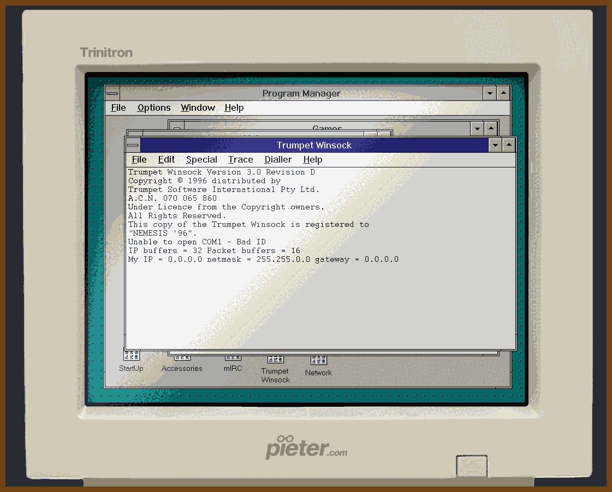

2024-11-07 [MAX SIEDENTOPF — Passport Photos](https://maxsiedentopf.com/passport-photos/) { maxsiedentopf.com }

> 

2024-10-13 [stenzek/duckstation: Fast PlayStation 1 emulator for x86-64/AArch32/AArch64/RV64](https://github.com/stenzek/duckstation) { github.com }

> DuckStation is an simulator/emulator of the Sony PlayStation(TM) console, focusing on playability, speed, and long-term maintainability. The goal is to be as accurate as possible while maintaining performance suitable for low-end devices. 
> 

2024-06-18 [Where Did You Go, Ms. Pac-Man? — Thrilling Tales of Old Video Games](https://www.thrillingtalesofoldvideogames.com/blog/ms-pac-man-disappear-pac-mom)

> 

2024-06-27 [Liquid Layers](https://grantkot.com/ll/)

> 2024-06-27 [Liquid Layers | Hacker News](https://news.ycombinator.com/item?id=40765770)
>
> 

2024-06-27 [Science Fiction Writer Robert J. Sawyer: WordStar: A Writer's Word Processor](https://sfwriter.com/wordstar.htm)

> 

2024-06-28 [Advent of Code 2023 Day 19: Aplenty - YouTube](https://www.youtube.com/watch?v=YHSWVU9jBCU&list=PLsLuABDrJ7ME3vJEOCwGZ97__ZlHFgHvp)

> Advent of Code in Excel
> 

2024-08-29 [Web Design Museum - Discover old websites, apps and software](https://www.webdesignmuseum.org/) { www.webdesignmuseum.org }

> 

2024-09-19 [crowdwave.com](https://www.crowdwave.com/) { www.crowdwave.com }

> Show HN: I made crowdwave – imagine Twitter/Reddit but every post is a voicemail
>
> 

2024-08-28 [Monkeytype | A minimalistic, customizable typing test](https://monkeytype.com/) { monkeytype.com }

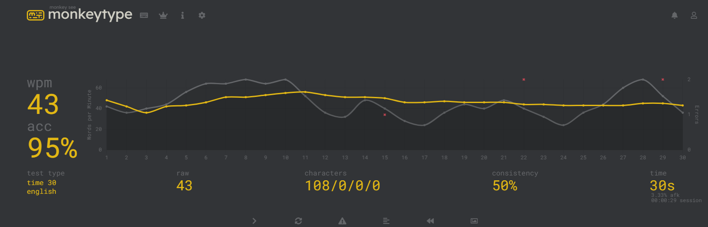


## Inspiration!

> 2024-12-01 [Andrew Ayer in the Fediverse](https://follow.agwa.name/notice/AoZSMI38xcA3TrN1sm) { follow.agwa.name }
>
> I honestly liked the design and layout
>
> 
>
> 2024-12-01 [To the Fediverse!](https://www.fediverse.to/) { www.fediverse.to }
> 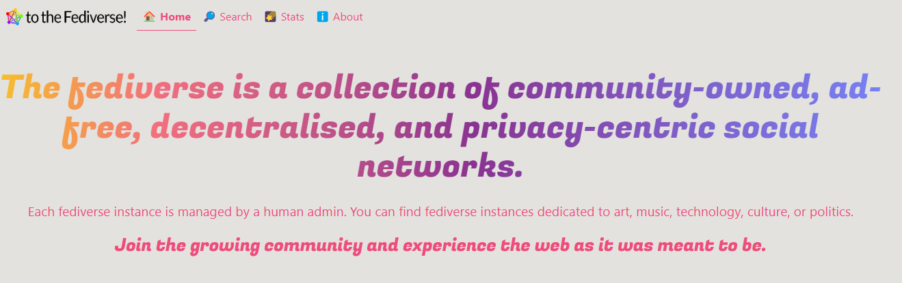

2024-12-01 [Pleroma — a lightweight fediverse server](https://pleroma.social/) { pleroma.social }

> 
>
> 2024-12-01 [src/App.scss · develop · Pleroma / pleroma-fe · GitLab](https://git.pleroma.social/pleroma/pleroma-fe/-/blob/develop/src/App.scss?ref_type=heads) { git.pleroma.social }
> Some good examples for using css variables with scss 
> 

2024-11-30 [GitHub - tldraw/make-real: Draw a ui and make it real](https://github.com/tldraw/make-real) {github.com}

> 2024-11-30 [make real • tldraw](https://makereal.tldraw.com/) {makereal.tldraw.com}
>
> 2024-11-30 [GitHub - SawyerHood/draw-a-ui: Draw a mockup and generate html for it](https://github.com/SawyerHood/draw-a-ui) {github.com} ✨FORK SOURCE✨
>
> 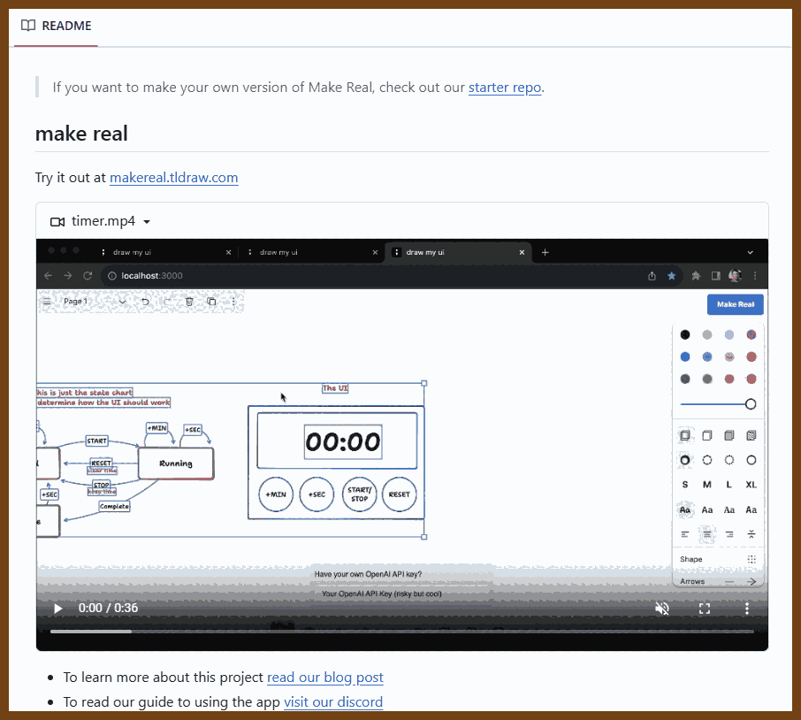
> 
>
> 2024-11-30 [tldraw | Steve Ruiz | Substack](https://tldraw.substack.com/) {tldraw.substack.com}
>
> 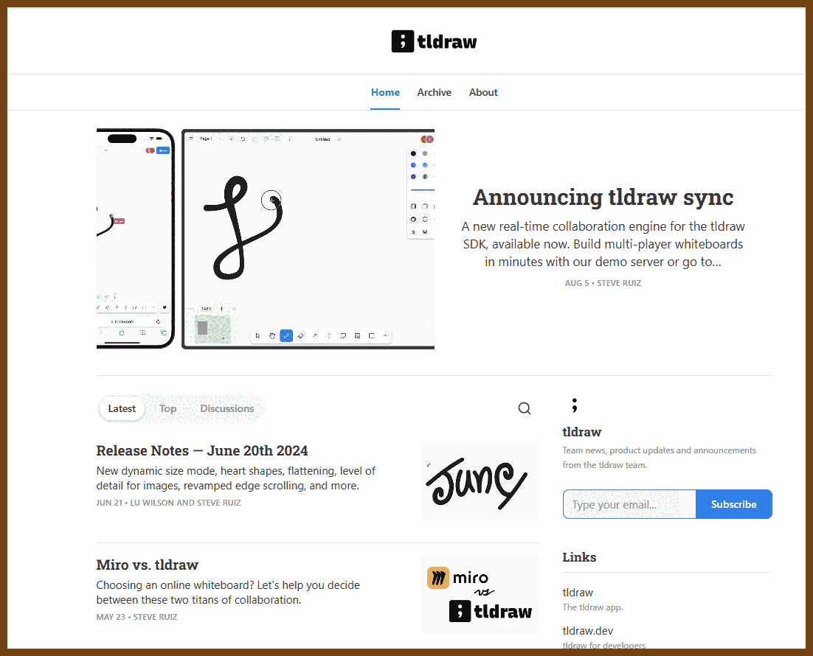

2024-11-27 [Text Blaze: Snippets and Templates for Chrome](https://blaze.today/) {blaze.today}

> 

2024-11-26 [Monocle · Access and transform immutable data](https://www.optics.dev/Monocle/) { www.optics.dev }

> 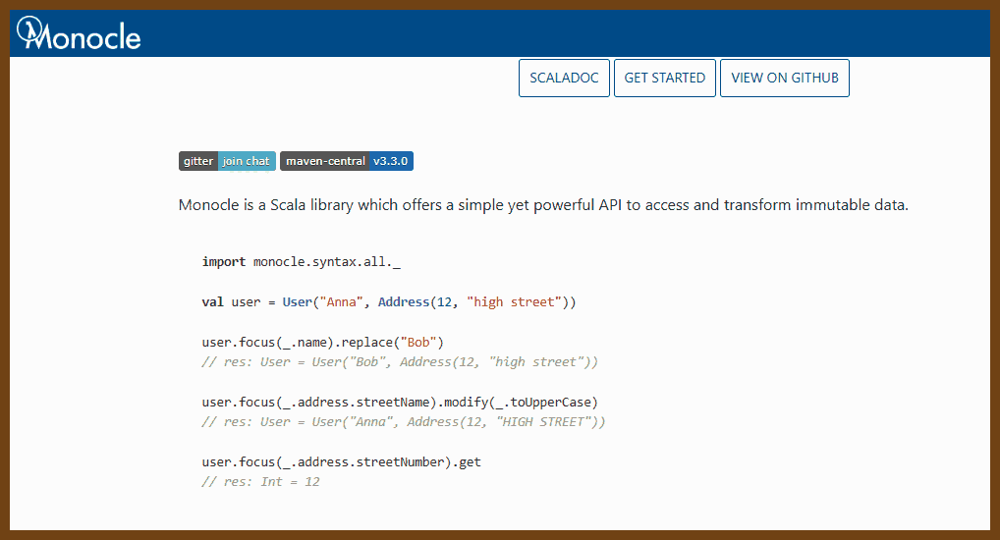

2024-08-28 [The Monospace Web](https://owickstrom.github.io/the-monospace-web/) { owickstrom.github.io }

> 
>
> 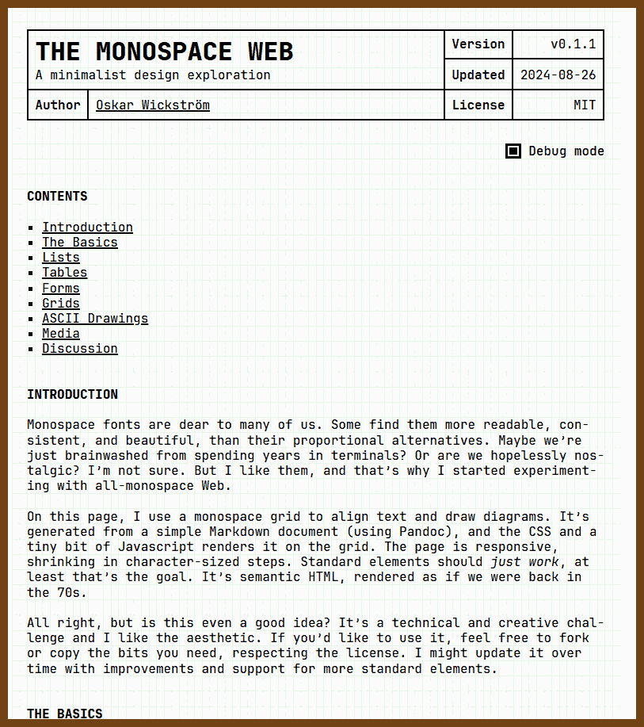

2024-11-24 [triyanox/lla: A modern alternative to ls](https://github.com/triyanox/lla) { github.com }

> aww! ls with plugins! 
>
> 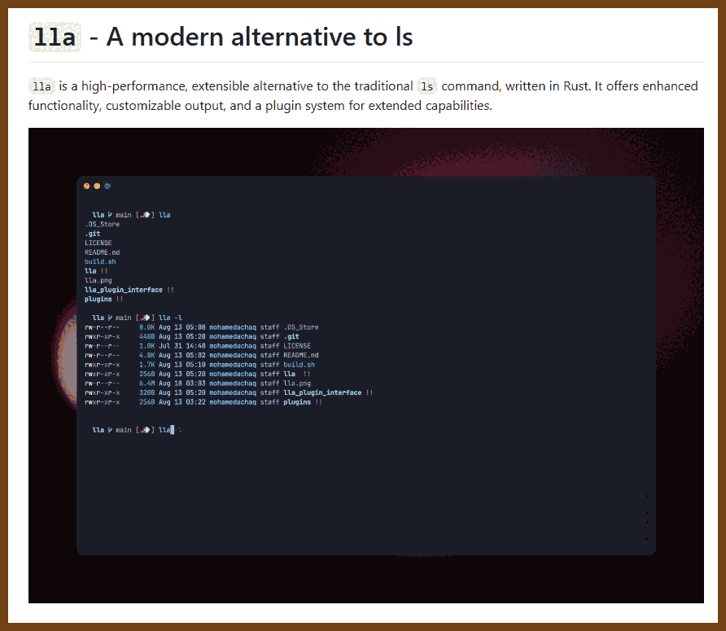
>
> >2024-11-24 [I made an ls alternative for my personal use | Hacker News](https://news.ycombinator.com/item?id=42229003) { news.ycombinator.com }
> >[elashri](https://news.ycombinator.com/user?id=elashri) There seems to be a lot of projects that is now competing to replace ls (for people preferences)
> >
> >For reference, those are the ones I am familiar with. They are somehow active in contrast to things like exa which is not maintained anymore.
> >
> >eza: (https://github.com/eza-community/eza)
> >
> >lsd: (https://github.com/Peltoche/lsd)
> >
> >colorls: (https://github.com/athityakumar/colorls)
> >
> >g: (https://github.com/Equationzhao/g)
> >
> >ls++: (https://github.com/trapd00r/LS_COLORS)
> >
> >logo-ls: (https://github.com/canta2899/logo-ls) - this is forked because main development stopped 4 years ago.
> >
> >Any more?
> >
> >Personally I prefer eza and wrote a zsh plugin that is basically aliases that matches what I have from my muscle memory.

2024-11-24 [Frosted Glass from Games to the Web - tyleo.com](https://www.tyleo.com/html-glass.html) { www.tyleo.com }

> 

2024-11-20 [WebVM - Linux virtualization in WebAssembly](https://webvm.io/) { webvm.io }

```
+~~~~~~~~~~~~~~~~~~~~~~~~~~~~~~~~~~~~~~~~~~~~~~~~~~~~~~~~~~~~~~~~~~~~~~~~~~~~~+
|                                                                             |
| WebVM is a virtual Linux environment running in the browser via WebAssembly |
|                                                                             |
| WebVM is powered by the CheerpX virtualization engine, which enables safe,  |
| sandboxed client-side execution of x86 binaries, fully client-side          |
|                                                                             |
| CheerpX includes an x86-to-WebAssembly JIT compiler, a virtual block-based  |
| file system, and a Linux syscall emulator                                   |
|                                                                             |
| [News] WebVM 2.0: A complete Linux Desktop Environment in the browser:      |
|                                                                             |
| https://labs.leaningtech.com/blog/webvm-20                                  |
|                                                                             |
| Try out the new Alpine / Xorg / i3 WebVM: https://webvm.io/alpine.html      |
|                                                                             |
+~~~~~~~~~~~~~~~~~~~~~~~~~~~~~~~~~~~~~~~~~~~~~~~~~~~~~~~~~~~~~~~~~~~~~~~~~~~~~+
```

2024-11-08 [Home: Mushroom Color Atlas](https://www.mushroomcoloratlas.com/) { www.mushroomcoloratlas.com }

> 

2024-11-07 [Your Hacker News](https://yourhackernews.com/) { yourhackernews.com }

> 

2024-11-07 [Aesop's Fables Interactive Book | Read.gov - Library of Congress](https://read.gov/aesop/) { read.gov }

> 
>
> 

2024-11-07 [McMaster-Carr](https://www.mcmaster.com/) { www.mcmaster.com }

> McMaster-Carr’s website, [www.mcmaster.com](http://www.mcmaster.com), is renowned for its speed, achieved through minimalist design, server-side rendering, and strategic use of technology like ASP.NET and JavaScript libraries. Prefetching techniques preload pages as users hover, ensuring near-instant navigation, while CDNs cache content globally to reduce latency. This streamlined, user-focused approach lets customers quickly access and order from McMaster-Carr’s extensive catalog, making it a leader in industrial supply and a favorite for its seamless, efficient experience.
>
> 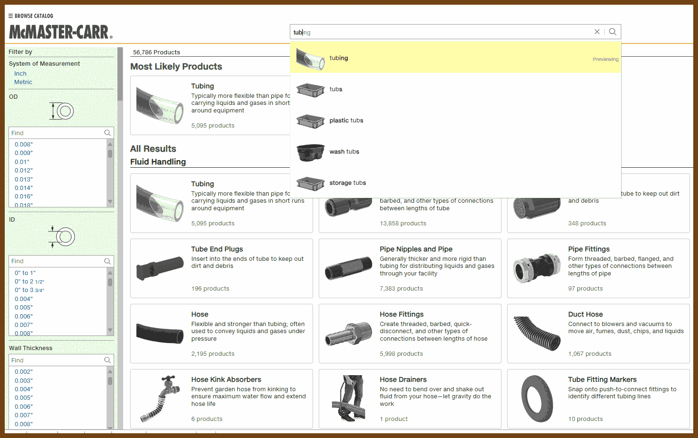

2024-10-05 [Methods of Mandarin](https://isaak.net/mandarinmethods/) { isaak.net }

> I got pretty good in Mandarin within 12 months of rigorous part-time study. I'm not even close to perfectly fluent, but I got far into intermediate fluency. Read my personal story of learning Mandarin here: [isaak.net/mandarin](https://isaak.net/mandarin)
>
> This post on my Methods of Mandarin (MoM) is for fellow language learners and autodidacts. This isn't a thorough how-to guide. I won't be holding your hand. It's more like a personal notebook of what worked for me. I'm sharing my personal Anki deck and then I'll describe all my methods and tips. People's styles and methods differ.

2024-08-29 [sjpiper145/MakerSkillTree: A repository of Maker Skill Trees and templates to make your own.](https://github.com/sjpiper145/MakerSkillTree) { github.com }

> 

2024-09-18 [Dune Shell](https://adam-mcdaniel.github.io/dune-website/) { adam-mcdaniel.github.io }

> 

2024-09-19 [Comic Mono | comic-mono-font](https://dtinth.github.io/comic-mono-font/) { dtinth.github.io }

> 

2024-09-20 [Math4Devs: List of mathematical symbols with their JavaScript equivalent.](https://math4devs.com/) { math4devs.com }

> 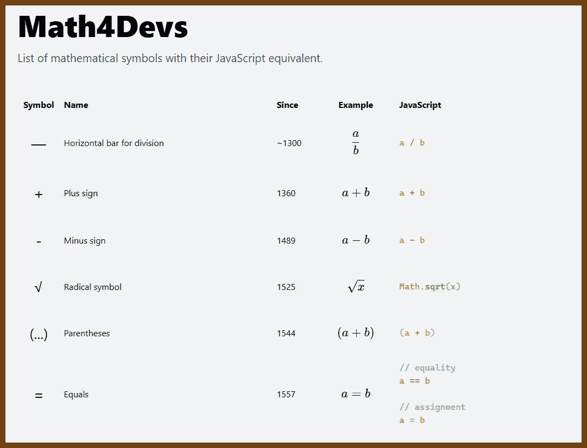

