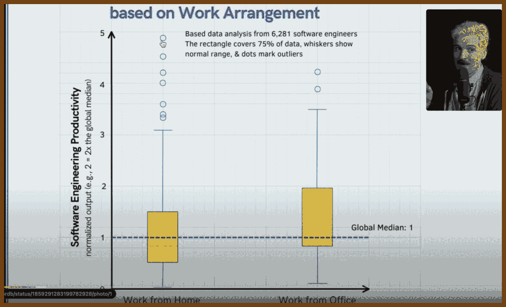
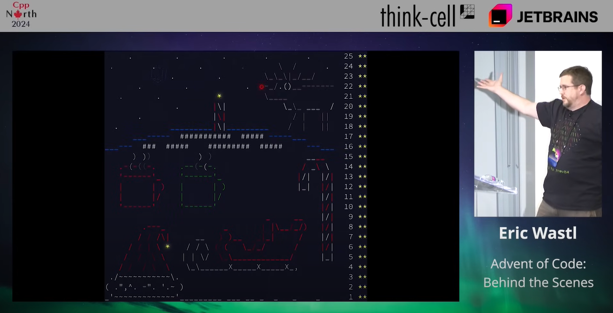
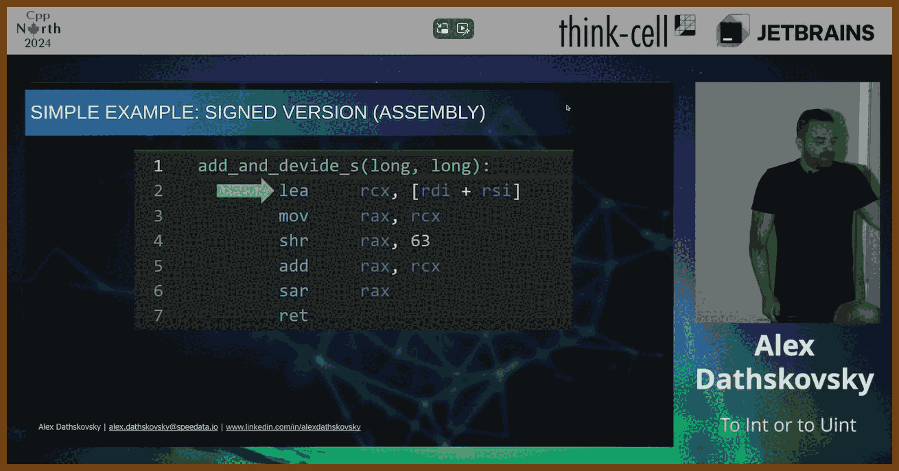
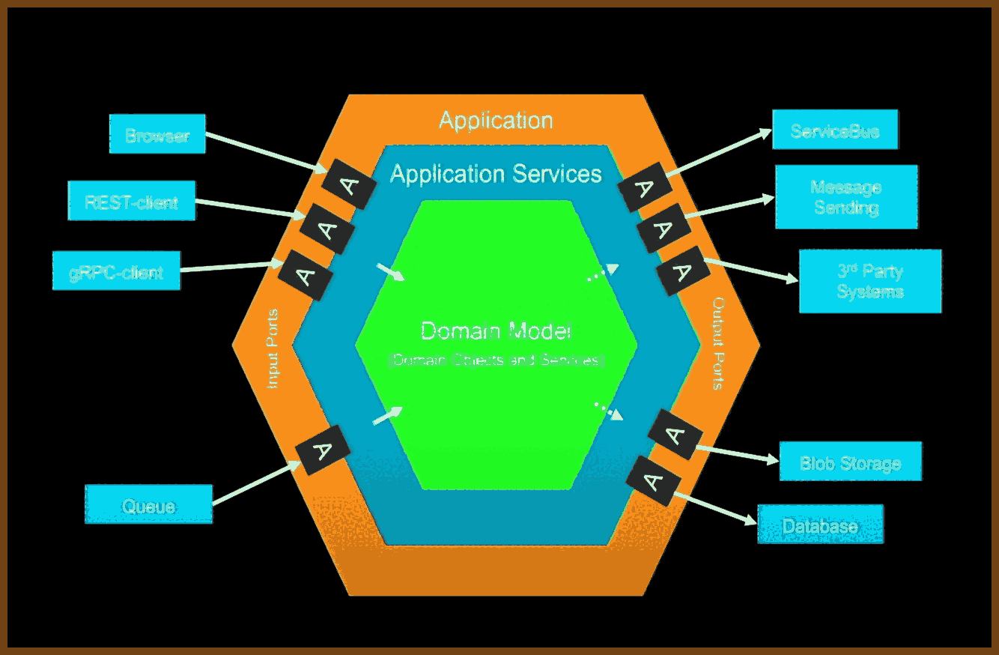
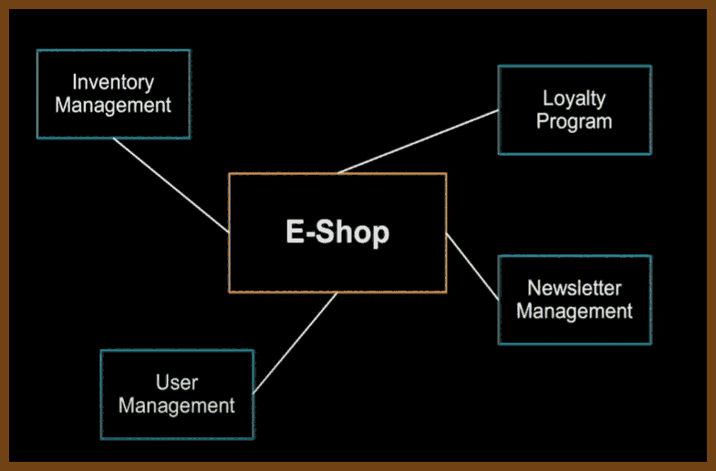

---
layout: post
title:  "Links from my inbox 2024-12-15"
date:   2024-12-15T15:19:00-08:00
categories: links
---

## ⌚ Nice watch!

2024-12-15 [Dependency Injection in C++ - A Practical Guide - Peter Muldoon - C++Now 2024 - YouTube](https://www.youtube.com/watch?v=kCYo2gJ3Y38) { www.youtube.com }

> 

> Long talk! Only list of the topics covered. I personally want to focus on "Inheritance and Virtual Functions" and "Template-Based Dependency Injection" with concepts. Concepts look really cool. 
>
> **Methods of Dependency Injection**
>
> - Link-Time Dependency Injection
>   - Overview and explanation
>   - Issues with link-time DI (fragility, undefined behavior, ODR violations)
>   - Reasons to avoid link-time DI in modern systems
> - Inheritance and Virtual Functions
>   - Base class and derived classes for DI
>   - Interface-based DI (abstract interfaces)
>   - Drawbacks (interface bloat, large interface sizes, tight coupling)
> - Template-Based Dependency Injection
>   - Using templates to achieve DI
>   - Benefits of compile-time DI
>   - Concepts (C++20) for template constraints
>   - Pros and cons of using templates for DI
> - Type Erasure (std::function)
>   - Using `std::function` for DI
>   - Flexibility and run-time benefits
>   - Overhead and runtime costs of `std::function`
> - Null Object Pattern
>   - Creating "null" objects for dependency injection
>   - Use cases and benefits
>   - How to use null objects for testing
> - Setter Injection
>   - Description of setter-based DI
>   - Problems with setter injection (state mutation, initialization order issues)
>   - Why setter injection is generally avoided
> - Method Injection
>   - Description of method-level DI
>   - Pros (clearer interfaces) and cons (interface bloat)
> - Constructor Injection
>   - Constructor-level DI for immutability
>   - Best practices for constructor injection
>   - Drawbacks (API changes, large constructor argument lists)
> - Dependency Suppliers (Factory Functions)
>   - Using supplier functions to control dependency injection
>   - How dependency suppliers differ from service locators

2024-12-14 [Master Tailwind CSS Crash Course 2024 | not a tutorial - YouTube](https://www.youtube.com/watch?v=coMJ4R8GzEA) { www.youtube.com }

> by Ankita Kulkarni
>
> 

```html
/* Introduction */
// This document serves as a comprehensive reference sheet for key Tailwind CSS concepts and utilities.
// Each section focuses on a major topic, providing a functional code sample that covers its subtopics.
// Use this guide as a quick reference for essential Tailwind features.

/* 1. Core Concepts of Tailwind CSS */
<div class="container mx-auto p-6">
  <h1 class="text-4xl font-bold mb-4">Core Concepts of Tailwind CSS</h1>
  <p class="text-gray-600">This paragraph demonstrates text utilities, margin, and padding.</p>
  <button class="bg-blue-500 hover:bg-blue-700 text-white font-bold py-2 px-4 rounded">
    Click Me
  </button>
</div>

/* 2. Responsive Design */
<div class="grid grid-cols-1 sm:grid-cols-2 md:grid-cols-3 gap-4 p-6">
  <div class="bg-red-500 p-4">1</div>
  <div class="bg-green-500 p-4">2</div>
  <div class="bg-blue-500 p-4">3</div>
  <div class="bg-yellow-500 p-4">4</div>
</div>

/* 3. Grid and Flexbox */
<div class="flex flex-col md:flex-row md:justify-between p-6">
  <div class="bg-purple-500 p-4 flex-1">Flex Item 1</div>
  <div class="bg-orange-500 p-4 flex-1">Flex Item 2</div>
  <div class="bg-teal-500 p-4 flex-1">Flex Item 3</div>
</div>

<div class="grid grid-cols-2 md:grid-cols-4 gap-6 p-6">
  <div class="bg-pink-500 h-20"></div>
  <div class="bg-blue-500 h-20"></div>
  <div class="bg-green-500 h-20"></div>
  <div class="bg-red-500 h-20"></div>
</div>

/* 4. Padding, Margins, and Spacing */
<div class="p-10 m-10 bg-gray-100">
  <h2 class="mb-6">Padding and Margin Example</h2>
  <p class="py-4 px-6 bg-white shadow-lg rounded">This box has custom padding and margin.</p>
</div>

/* 5. Borders and Border Radius */
<div class="border-4 border-dashed border-blue-500 rounded-lg p-6 m-6">
  <h2 class="text-xl font-bold">Dashed Border with Radius</h2>
  <p class="mt-4">This container demonstrates border styles and border radius utilities.</p>
</div>

/* 6. Typography and Text Styling */
<div class="p-6">
  <h1 class="text-4xl font-extrabold underline decoration-pink-500">H1 Header</h1>
  <h2 class="text-3xl font-semibold mt-4">H2 Header</h2>
  <p class="text-base text-gray-700 leading-relaxed mt-2">This is a paragraph demonstrating text styling like font size, color, and line height.</p>
</div>

/* 7. Customizing Colors */
<div class="bg-custom-purple text-white p-6">
  <h2 class="text-xl">Custom Color</h2>
  <p>Custom colors can be configured in tailwind.config.js</p>
</div>

/* 8. Box Shadows and Drop Shadows */
<div class="shadow-lg p-6 m-6 bg-white rounded-lg">
  <h2 class="font-bold">Box Shadow Example</h2>
  <p>This container has a large box shadow applied to it.</p>
</div>

/* 9. Customizing Animations and Transitions */
<button class="bg-blue-500 hover:bg-blue-700 text-white font-bold py-2 px-4 rounded transition duration-300 ease-in-out transform hover:scale-105">
  Hover Me
</button>

/* 10. Images and Transformations */


/* 11. State Management */
<input type="text" placeholder="Focus Me" class="focus:outline-none focus:ring-2 focus:ring-blue-500 p-2 border border-gray-300 rounded">

/* 12. Dark Mode in Tailwind */
<div class="dark:bg-gray-800 dark:text-white p-6">
  <h2 class="text-xl">Dark Mode Example</h2>
  <p>This text changes color in dark mode.</p>
</div>

/* 13. Filters and Effects */


/* 14. Custom Utility Classes */
<div class="custom-button bg-blue-500 text-white font-bold py-2 px-4 rounded">
  Custom Button
</div>

/* 15. Advanced Layout Techniques */
<div class="max-w-4xl mx-auto p-6">
  <h2 class="text-2xl font-bold mb-4">Advanced Layout</h2>
  <div class="flex justify-center">
    <div class="w-1/2 bg-red-500 p-4">50% Width</div>
  </div>
</div>

/* 16. Gradients and Backgrounds */
<div class="bg-gradient-to-r from-purple-400 via-pink-500 to-red-500 text-white p-6 rounded-lg">
  <h2 class="text-xl font-bold">Gradient Background</h2>
  <p>This container has a beautiful gradient background.</p>
</div>

/* 17. Customizing Layouts */
<div class="grid grid-cols-2 gap-4">
  <div class="bg-blue-500 h-20"></div>
  <div class="bg-green-500 h-20"></div>
  <div class="bg-red-500 h-20"></div>
  <div class="bg-yellow-500 h-20"></div>
</div>

/* 18. Project Walkthrough */
<div class="p-6">
  <h2 class="text-2xl font-bold mb-4">Project Walkthrough</h2>
  <p class="text-gray-600">This project demonstrates how all the Tailwind concepts come together to create a cohesive layout.</p>
</div>

/* 19. Additional Resources */
<div class="p-6 bg-gray-100">
  <h2 class="text-xl font-bold">Resources</h2>
  <ul class="list-disc pl-6">
    <li>Official Tailwind CSS Documentation</li>
    <li>VS Code Tailwind IntelliSense Plugin</li>
    <li>Learning Responsive Design and Dark Mode</li>
  </ul>
</div>
```

2024-12-10 [What's a Tensor? - YouTube](https://www.youtube.com/watch?v=f5liqUk0ZTw) { www.youtube.com }

> 
> 

> 2024-11-28 [Playing Game on the Mall Wall: Japanese Man's Super-sized Adventure! - YouTube](https://www.youtube.com/watch?v=48blVuWT6rU&list=PL0PEDK73vwEgjUi57EL_XHON8Ro6Etd1z&index=7) { www.youtube.com }
> 

> Nomad Push is a 38-year-old Japanese man who’s homeless and travels all over Japan. On his YouTube channel, he shares his daily life in a really honest and down-to-earth way. You’ll see him doing things like:
>
> - Sleeping in train stations
> - Exploring abandoned houses
> - Cooking simple meals in parks
>
> Even though he’s dealing with tough times, his videos feel positive and show a side of life most people don’t get to see. A lot of people watching his channel say it’s inspiring, and he’s built a big community of fans who support him. When he hit 100,000 subscribers, another YouTuber, Oriental Pearl, even threw a celebration for him, which shows how much people believe in him.
>
> If you’re learning Japanese, this channel is a goldmine. His videos are full of real Japanese conversations, and he adds subtitles to help viewers follow along. It’s great practice for understanding how people actually talk in Japan.
>
> Nomad Push’s channel is like a window into his life and a journey across Japan at the same time. It’s simple, real, and worth checking out if you’re curious about a different way of seeing the world.

2024-12-02 [A Day in the Life of a Japanese Hikikomori (Shut In) - YouTube](https://www.youtube.com/watch?v=pu9Ty9fxTHE) { www.youtube.com }

> 
>
> **Inside the Life of Nito: A *Hikikomori* Turned Game Developer**
>
> Nito, a *hikikomori* living in Kobe, Japan, has spent the past decade in near-total isolation. Far from idle, he has dedicated the last five years to developing *Pull Stay*, an old-school beat-em-up game reflecting his experiences as a recluse. The protagonist, a *hikikomori* himself, battles societal judgment—a theme close to Nito’s heart. Using Unreal Engine, he has self-taught coding, 3D design, and storytelling to bring his vision to life.
>
> **A Creative Path Born from Setbacks**
> After graduating from the University of Tokyo, Nito struggled to find his footing in traditional creative fields like writing and *doujinshi* (independent manga). He shifted to game development when tools like Unreal Engine became accessible. Despite the steep learning curve and his limited English skills, Nito found purpose in creating something meaningful on his own terms.
>
> **Breaking Stereotypes and Defying Odds**
> Nito’s life defies the typical *hikikomori* stereotype of idleness and dependence. His determination and self-taught skills showcase resilience, proving isolation doesn’t equate to lack of ambition. Through *Pull Stay*, he turns personal struggles into a story that others can relate to and enjoy.
>
> **What’s Next?**
> With *Pull Stay* nearing release on Steam, Nito hopes its success will enable him to collaborate with other creators and travel the world. If it doesn’t take off, he plans to use the game as a portfolio to break into the industry. For now, his story serves as an inspiring reminder of the power of creativity and persistence.
>
> Support Nito by checking out *Pull Stay* on [Steam](https://store.steampowered.com/app/1179890/Pull_Stay/) or sharing his journey with others.
>
> https://store.steampowered.com/app/1179890/Pull_Stay/
>
> 

> 2024-11-30 [10% Of Engineers Should Get Fired - YouTube](https://www.youtube.com/watch?v=m9Rvg5zAfT4) { www.youtube.com }
>
> 
>
> **What Are Ghost Engineers?**
> Ghost engineers are unproductive employees contributing less than 10% of a median engineer’s output. They account for up to **10% of the workforce** and cost companies **$90 billion annually**. These individuals often perform minimal tasks, such as making fewer than three commits a month or trivial changes, while collecting full salaries.
>
> **Key Insights:**
>
> - **Economic Impact:** Eliminating ghost engineers could save companies billions and add **$465 billion** to market caps without reducing performance.
> - **Remote Work Paradox:** While top engineers excel remotely, the worst also thrive in remote settings. **14% of remote engineers** are ghost engineers compared to 6% in-office.
> - **Cultural Cost:** Ghost engineers demoralize motivated teammates and occupy roles that could go to skilled newcomers.
> - **Startups’ Advantage:** Startups avoid this issue by demanding accountability from every team member, contributing to their ability to outperform larger organizations.
>
> 
>
> **Why It Matters:**
> Ghost engineers don’t just waste money—they stall innovation, hinder team dynamics, and damage the credibility of remote work. Companies have a unique chance during layoffs to address this inefficiency, open doors to fresh talent, and foster a culture of accountability.
>
> 
>
> **The Way Forward:**
> Fire unproductive workers, improve performance metrics, and rebuild trust in remote work by ensuring accountability. The tech industry’s future depends on tackling this hidden crisis.
>
> Sources:
>
> 2024-11-30 [Yegor Denisov-Blanch on X: "I’m at Stanford and I research software engineering productivity. We have data on the performance of &gt;50k engineers from 100s of companies. Inspired by @deedydas, our research shows: ~9.5% of software engineers do virtually nothing: Ghost Engineers (0.1x-ers) https://t.co/uygyfhK2BW" / X](https://x.com/yegordb/status/1859290734257635439) { x.com }
>
> > 
>
> 2024-11-30 [Tech's $90B Ghost Engineer Problem: Stanford Study Finds 9.5...](https://socket.dev/blog/ghost-engineers) { socket.dev }
>
> > Das [highlighted](https://twitter.com/deedydas/status/1858933470296252575) a few tools of the trade from the “quiet quitting” playbook:
> >
> > - “in a meeting” on slack
> > - scheduled slack, email, code at late hours
> > - private calendar with blocks
> > - mouse jiggler for always online
> > - “this will take 2 weeks” (1 day)
> > - “oh, the spec wasn’t clear”
> > - many small refactors
> > - “build is having issues”
> > - blocked by another team
> > - will take time bcuz obscure tech reason like “race condition”
> > - “can you create a jira for that?”

2024-12-07 [Keynote: Advent of Code, Behind the Scenes - Eric Wastl - YouTube](https://www.youtube.com/watch?v=uZ8DcbhojOw) { www.youtube.com }

> 
>
> 
>
> Hello friends! My name is Eric Wasel, and Advent of Code is a project I created to help programmers improve their skills through small, self-contained challenges. The puzzles start easy and get progressively harder, helping you learn new techniques and develop problem-solving skills. I believe the best way to learn is by solving specific problems, and this project reflects that. We even have C++ in Advent of Code, and I’ll touch on where and how during the talk. Drawing from my experience designing systems for ISPs, auction infrastructure, and marketplaces, Advent of Code is all about celebrating learning, curiosity, and the joy of programming for everyone, no matter their level.

2024-12-07 [To Int or To Uint - Alex Dathskovsky - YouTube](https://www.youtube.com/watch?v=F_peBmYPRYw) { www.youtube.com } {C++}

> 

> 
>
> **This talk provides valuable insights into handling integers in C++.** Integers are fundamental in any program, but improper handling can lead to subtle bugs, undefined behavior, and poor performance. This content explores the complexities of signed and unsigned integers, common mistakes, and how to optimize performance. By understanding these nuances, you'll avoid common pitfalls, write more efficient code, and improve the overall robustness of your applications.

>  **The Basics of Signed and Unsigned Integers**

> **Representation in Memory**
>
> - **Unsigned Integers**: Simple modulo 2 representation. Overflow behavior is well-defined, which means operations that exceed the maximum value wrap around predictably.
> - **Signed Integers**: Historically, C++ supported various representations like one’s complement and two’s complement. Since C++20, two’s complement is the standard. Overflow is undefined, and operations involving signed integers require careful handling to avoid unexpected behavior.
>
> **Performance Considerations**
> Signed integers often involve additional steps in assembly code, such as preserving the sign bit during division or right shifts. This makes operations on signed integers slower compared to their unsigned counterparts, especially in performance-critical code.
> For example, unsigned division by two can be replaced by a simple bit shift. Signed division, on the other hand, requires arithmetic shifts that preserve the sign bit, adding extra overhead.

> **Best Practices for Handling Integers**

> **Use Fixed-Width Integer Types**
> Explicitly use types like `int32_t`, `uint64_t`, and `size_t` when appropriate. These make your code portable and clear about the expected range of values.
>
> **Prefer Signed Types Unless Necessary**
> Unsigned integers should only be used when their wrapping behavior is explicitly desired. For most use cases, signed integers are safer and less prone to subtle bugs.
>
> **Leverage C++20 and C++23 Features**
> Modern C++ provides tools like `std::ssize` and type traits that simplify working with integers. Use these features to avoid common pitfalls and ensure correctness.
>
> **Treat Warnings as Errors**
> Enable strict compiler warnings (`-Wall`, `-Wextra`, and `-Werror`) and sanitizers to catch potential issues early. Compiler tools can often detect problems like signed-unsigned mismatches before they cause runtime errors.
>
> **Avoid Overusing `auto`**
> While `auto` simplifies code, it can obscure type information, leading to unexpected behavior. Be explicit with integer types, especially in loops and arithmetic operations.
>
> **Author:**  Alex Dathskovsky
>
> 2024-12-07 [Demystifying CRTP in C++: What, Why, and How](https://www.cppnext.com/post/demystifying-crtp-in-c-what-why-and-how) { www.cppnext.com }

2024-12-07 [Exposing the not-so-secret practices of the cult of DDD - Chris Klug - - YouTube](https://www.youtube.com/watch?v=ucGhUU7KuaY) { www.youtube.com }

> 
> 

> 

> 

2024-12-07 [Bosses Are FIRING Gen Z Workers Just Months After Hiring Them. - YouTube](https://www.youtube.com/watch?v=tvCPjOxJClg) { www.youtube.com }

> 

> Source: 2024-12-07 [1 in 6 Companies Are Hesitant To Hire Recent College Graduates - Intelligent](https://www.intelligent.com/1-in-6-companies-are-hesitant-to-hire-recent-college-graduates/) { www.intelligent.com }
