## Good Reads

2024-12-28 [Developer with ADHD? You’re not alone. - Stack Overflow](https://stackoverflow.blog/2023/12/26/developer-with-adhd-youre-not-alone/) {stackoverflow.blog}

> **Reddit:** 2024-12-28 [Got ADHD? Program computers? Even close with either? Talk about it here.](https://www.reddit.com/r/ADHD_Programmers/) {www.reddit.com}
>
> Many developers with ADHD feel their job is a perfect fit for how they think and approach problems. “Coding can give ADHD brains exactly the kind of stimulation they crave,” [explains](https://dev.to/abbeyperini/coding-and-adhd-adhd-brains-im1) full-stack developer Abbey Perini. “Not only is coding a creative endeavor that involves constantly learning new things, but also once one problem is solved, there’s always a brand new one to try.”
>
> In addition to a revolving door of fresh challenges that can keep people with ADHD engaged, coding can reward and encourage a state of [hyperfocus](https://health.clevelandclinic.org/hyperfocus-and-adhd/): a frequently cited symptom of ADHD that developer [Neil Peterson](https://adapthd.com/topics/coping-strategies/programming-with-adhd-the-good-the-bad-and-the-hyperfocus/) calls “a state of laser-like concentration in which distractions and even a sense of passing time seem to fade away.”

2024-12-20 [How types make hard problems easy •](https://mayhul.com/posts/type-driven-design/) { mayhul.com }

> 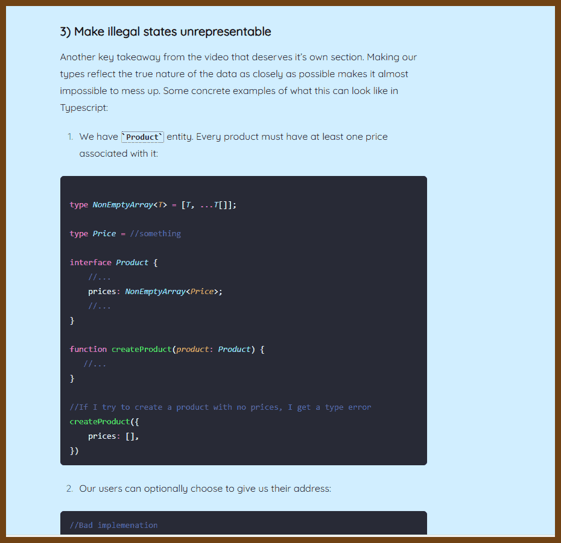

2024-12-16 [The 70% problem: Hard truths about AI-assisted coding](https://addyo.substack.com/p/the-70-problem-hard-truths-about/) { addyo.substack.com }

> found in [programmingdigest issue1798](https://programmingdigest.net/newsletters/1798) { programmingdigest.net }
>
> 
>
> **The hidden cost of "AI Speed"**: When you watch a senior engineer work with AI tools like Cursor or Copilot, it looks like magic. They can scaffold entire features in minutes, complete with tests and documentation. But watch carefully, and you'll notice something crucial: They're not just accepting what the AI suggests. They're constantly:
>
> - Refactoring the generated code into smaller, focused modules
> - Adding edge case handling the AI missed
> - Strengthening type definitions and interfaces
> - Questioning architectural decisions
> - Adding comprehensive error handling
>
> In other words, they're applying years of hard-won engineering wisdom to shape and constrain the AI's output. The AI is accelerating their implementation, but their expertise is what keeps the code maintainable.
>
> **The knowledge paradox:** Here's the most counterintuitive thing I've discovered: AI tools help experienced developers more than beginners. This seems backward – shouldn't AI democratize coding?
>
> The reality is that AI is like having a very eager junior developer on your team. They can write code quickly, but they need constant supervision and correction. The more you know, the better you can guide them.
>
> **This creates what I call the "knowledge paradox":**
>
> - Seniors use AI to accelerate what they already know how to do
> - Juniors try to use AI to learn what to do
> - The results differ dramatically
>
> **I've watched senior engineers use AI to:**
>
> - Rapidly prototype ideas they already understand
> - Generate basic implementations they can then refine
> - Explore alternative approaches to known problems
> - Automate routine coding tasks
>
> **Meanwhile, juniors often:**
>
> - Accept incorrect or outdated solutions
> - Miss critical security and performance considerations
> - Struggle to debug AI-generated code
> - Build fragile systems they don't fully understand

2024-12-16 [A 10 Year Retrospective of a Passionate Software Engineer | by Boris Cherkasky | Nov, 2024 | Medium](https://cherkaskyb.medium.com/a-10-year-retrospective-of-a-passionate-software-engineer-2d0cd7b3d836) { cherkaskyb.medium.com }

> found in [programmingdigest issue1798](https://programmingdigest.net/newsletters/1798) { programmingdigest.net }
>
> 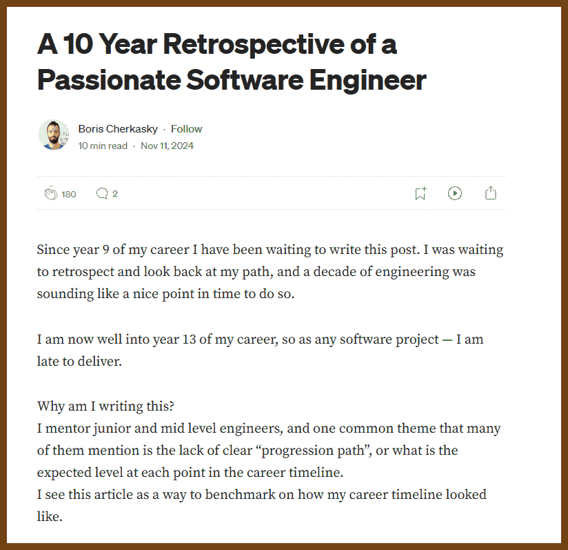
>
> **Take Ownership of Your Career**
> No one is responsible for your career growth but you. While managers may offer guidance, the responsibility to seek opportunities, take initiative, and drive your own development is yours alone. Waiting for someone else to guide your progression will leave you stagnant.
>
> > "No one is responsible for your career path but you."
>
> **Seek Mentorship — It’s a Shortcut to Mastery**
> A mentor can accelerate your growth by giving you insights, sharing their decision-making process, and exposing you to higher-level thinking. Actively seek out senior engineers, build relationships, and ask questions. This can be one of the most effective ways to "level up" faster than self-learning alone.
>
> > "Having a mentor is a force multiplier! It’s literally a means to learn faster, it’s a shortcut!"
>
> **Initiative is Always Rewarded**
> No employer will think less of you for taking initiative. If something is blocked, find a way around it. Push for better solutions, offer new ideas, and take on challenges without being asked. This attitude of "full ownership" sets you apart. Engineers who "unblock themselves" — even by learning disciplines outside their core expertise — become the most valuable contributors.
>
> > "Nothing is more important than making your colleagues feel comfortable and safe working with you."
>
> **The Dunning-Kruger Effect is Real — Be Humble and Self-Aware**
> At some point, you will overestimate your own skills. Recognizing this gap is essential for growth. Take feedback seriously, reflect on your mistakes, and focus on learning through deliberate practice. Switch from "just get it done" to "learn all you need to do it right." This mindset shift will elevate your skill set.
>
> **Master the "Glue Work" That Holds Teams Together**
> It’s not enough to just write code. The ability to **coordinate, track, and organize work** is a rare and valuable skill. Acting as the "glue" between people, projects, and teams will make you indispensable. Track tickets, follow up on blockers, and ensure no one is left behind. Great engineers don’t just "code" — they also **lead, unblock, and delegate**.
>
> **Technical Excellence is Necessary, But Not Sufficient**
> You can be a great coder, but without skills like **communication, empathy, and coordination**, you won’t become a senior engineer. Learn to **bridge the gap between engineers, product managers, and customers**. Senior engineers know how to translate customer requirements into engineering solutions and help their teams grow.
>
> **Learn to See the Business, Not Just the Code**
> As you grow in your career, it’s not just about building "good" software — it’s about building software that drives **business outcomes**. Learn to ask, "How will this impact our KPIs?" and prioritize cost-efficient, high-impact solutions. This business-first mindset can distinguish you as a senior engineer and lead to better decision-making.
>
> > "At one point, we scratched the 'optimal solution' for a good enough, 10x cheaper solution. Engineering is all about tradeoffs."
>
> **Resilience and Observability Are Non-Negotiable Skills**
> Handling production incidents teaches you to value **system reliability, observability, and DevOps**. As you progress, mastering **monitoring, alerting, and on-call response** will become essential. Developers who "speak infrastructure" become highly valuable, as they can ensure stability and avoid system failure.
>
> > "It became clear that being a developer that 'speaks' and understands infrastructure is a superpower, and a differentiating factor."
>
> **Continuous Learning is Not Optional**
> The craft of software engineering evolves rapidly. Relying on daily work alone will not keep you at the top. You need to invest in side learning — read books like *Clean Code* and *Designing Data-Intensive Applications*, attend meetups, seek mentorship, and watch technical talks. Growth requires time and passion outside daily tasks.
>
> > "Learning through daily tasks is not enough for becoming a top-tier engineer. The craft and technology are just too complex and require a lot of passion and time."
>
> **Be a Decent Human Being — It Matters More Than You Think**
> Nothing beats being a kind, respectful, and empathetic teammate. People remember how you make them feel. Psychological safety and trust are essential for high-performing teams. As you grow into senior roles, prioritize creating safe, welcoming environments where people can speak up, share ideas, and fail without fear of judgment.
>
> > "Nothing — and I mean it — Nothing! is more important than being a decent human being, a pleasant colleague, and a pragmatic engineer."

2024-12-15 [Preferring throwaway code over design docs](https://softwaredoug.com/blog/2024/12/14/throwaway-prs-not-design-docs) { softwaredoug.com }

> 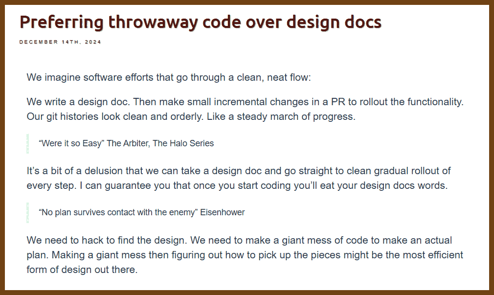
>
> Another important point is on using PRs for documentation. They are one of the best forms of documentation for devs. They’re discoverable - one of the first places you look when trying to understand why code is implemented a certain way. PRs don’t profess to reflect the current state of the world, but a state at a point in time. A historical artifact. On the other hand, most design docs lie to you. They’re [undead documentation](https://softwaredoug.com/blog/2023/10/13/fight-undead-documentation). Unless you’re fastidious of keeping them up to date (most of us aren’t) they reflect an outdated view of reality.

2024-12-14 [3 shell scripts: Kill weasel words, avoid the passive, eliminate duplicates](https://matt.might.net/articles/shell-scripts-for-passive-voice-weasel-words-duplicates/) { matt.might.net }

> 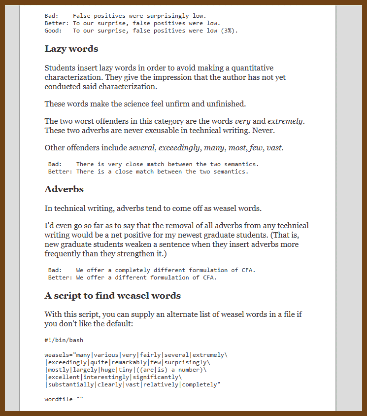

2024-12-11 [From where I left - antirez](https://antirez.com/news/144) { antirez.com }

> The blog post by **Salvatore Sanfilippo (antirez)** reflects on his journey with **Redis**, his departure, and his decision to return. He also shares insights into Redis's past, his thoughts on software licensing, and new technical concepts he's working on, such as vector sets for Redis. Below is a detailed digest of the key points from the article.
>
> After leaving Redis about 4.4 years ago, Salvatore detached himself from the project's code, commits, and technical management. This detachment was not born out of resentment but rather a desire to explore other areas like **writing and embedded projects**, while also spending more time with family. He describes this period as a time to "hack randomly" and explore areas like **neural networks** and **Telegram bots**. However, this "random hacking" eventually left him feeling a lack of purpose, which reignited his desire to **return to the tech world**.
>
> > "Hacking randomly was cool but, in the long run, my feeling was that I was lacking a real purpose, and every day I started to feel a bigger urgency to be part of the tech world again."
>
> Salvatore's return to Redis began during a trip to **New York City** with his 12-year-old daughter. Reflecting on life changes and purpose, he decided to re-engage with Redis. This led to a conversation with the new Redis CEO, **Rowan Trollope**, where they discussed Salvatore's possible role. He proposed becoming a bridge between Redis Labs and the **Redis community**, creating educational materials like **demos, tutorials, and new design concepts**. An agreement was quickly reached, allowing him to rejoin Redis in a **part-time role**.
>
> > "I wrote him an email saying: do you think I could be back in some kind of capacity? Rowan showed interest in my proposal, and quickly we found some agreement."

2024-12-10 [What TDD is ACTUALLY Good For – Axol's Blog](https://theaxolot.wordpress.com/2024/12/08/what-tdd-is-actually-good-for/) { theaxolot.wordpress.com }

> In an [earlier article](https://theaxolot.wordpress.com/2024/08/09/its-your-fault-people-dont-like-tdd/), I tore through some terrible arguments used to advocate for TDD that I see all too often (even by experienced engineers). I said in that piece that I would eventually go through what I think are better arguments for TDD, so that’s what I’m gonna do now.

> **Brownfield** work also lends itself well to TDD, but less so. It depends on the complexity of the new feature, and the extendibility of the codebase. You have to use your best judgment. If it seems like a feature requires significant changes to existing modules, I’d lean on traditional development. However, if you see a gentle path to implementing this new feature, you might reap more benefits with TDD.
>
> **Greenfield** development is a big no-no for TDD (at first). I don’t care how confident you are in what your interfaces will be. **You’re not that good**. Everything you think you know will change in the exploratory phase of a new project as you code, and you’ll strain your sanity by rewriting tests over and over again. Don’t do this, no matter how much your TDD idol pontificates its benefits.
>
> *BuT iF yOuR’e ReWrItInG yOuR tEsTs So MuCh, YoU’rE nOt PrAcTiSiNg TdD pRoPeRlY.”*

2024-12-28 [Ask HN: Are you unable to find employment? | Hacker News](https://news.ycombinator.com/item?id=42531830) { news.ycombinator.com }

> es, this is what everybody I know is experiencing right now.
>
> Caveat lector: This is simply a retelling of my personal experience, YMMV. This is not advice.
>
> What has consistently worked for me: I stopped applying for jobs, and redirected all that effort into creating and publishing open source projects that demonstrate competence in the areas of work I want. And, just as importantly, I contribute to big established open source projects in those areas too.
>
> I did not apply for my current job (started 6 months ago): they solicited me, based on my open source work. All the best jobs I've had have been like that, this is the 3rd time it worked.
>
> When I'm unemployed, I only apply for jobs I actually want, typically spending an hour each on 0-2 extremely targeted applications per week. But I treat churning out new open source stuff as my full time job until somebody notices. In addition to successfully landing me three great jobs over the past decade, this approach has made me a much much better programmer.
>
> Also, I strongly believe spending hours a day writing new code will enhance your ability to pass technical interviews much more than gamified garbage like leetcode.
>
> A huge part of making this work is not living a typical valley lifestyle: I plan my life around the median national salary for a software engineer, and when I'm making more than that it all goes straight into my savings. In the bay, that requires living frugally (by bay standards...), but I can't even begin to put into words how grateful I am to past-decade-me for living like that and giving today-me the freedom to turn down the bad jobs and wait for the good ones. Obviously, I don't have children.
>
> I do a lot more open source than a typical programmer in the valley, but I don't think I'm "exceptional" in any sense: you just have to put in the work. I do feel like I was very lucky to start my career in an extremely open-source-centric role, and in fairness that gives me a leg up here which I am probably inclined to underestimate.


## Working with People

2024-12-05 [How to Grow Professional Relationships | Tejas Kumar](https://tej.as/blog/how-to-grow-professional-relationships-tjs-model) { tej.as }

> In my career, I’ve worked with some extraordinary people while also encountering the barriers of exclusionary cliques and gatekeeping. These experiences prompted me to examine how professional relationships develop, leading to the creation of the **TJS (The Journey to Synergy) Collaboration Model**. This framework identifies seven stages that relationships can pass through, from competitive isolation to productive collaboration.
>
> For those striving to build stronger, more impactful connections—whether in business, creative endeavors, or personal growth—this model offers a clear lens to understand where you stand and how to move forward.
>
> 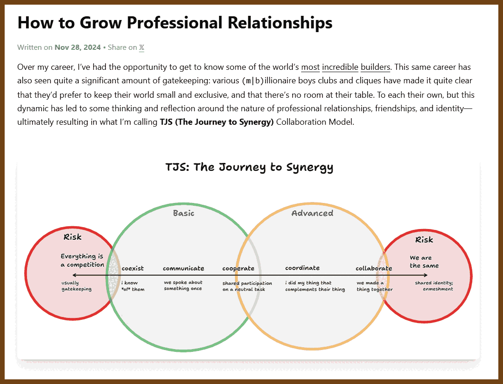
>
> **The 7 Stages of the TJS Collaboration Model: A Quick Digest**
>
> 1. **Everything is a Competition**
>    Relationships are marked by exclusion and a zero-sum mindset. Gatekeeping and discrimination dominate, with little to no collaboration or shared goals.
> 2. **Coexist**
>    Acknowledgment of each other's existence without meaningful interaction. There’s mutual respect but little effort to engage, often due to differing goals, values, or personalities.
> 3. **Communicate**
>    Basic exchange of information occurs, but interactions remain shallow. Conversations may begin, but follow-through and deeper engagement are often lacking.
> 4. **Cooperate**
>    Parties work together on neutral, low-stakes tasks with transactional motives. Cooperation may lead to future opportunities but doesn’t yet involve deep trust or shared investment.
> 5. **Coordinate**
>    One party adopts the other’s goal and takes deliberate steps to align efforts. Trust begins to form as actions are coordinated for mutual benefit, laying the groundwork for deeper collaboration.
> 6. **Collaborate**
>    A shared project is created together, with both parties contributing equally and meaningfully. Trust, understanding, and synergy define this stage, as both sides grow from the partnership.
> 7. **We Are the Same**
>    A toxic state where boundaries dissolve, leading to unhealthy co-dependence. Individuality is lost, and relationships suffer from over-enmeshment and burnout.

2024-12-07 ✨ [The 6 Mistakes You’re Going to Make as a New Manager – Terrible Software](https://terriblesoftware.org/2024/12/04/the-6-mistakes-youre-going-to-make-as-a-new-manager/) { terriblesoftware.org } { people management} {engineering management}

> The right amount of engagement that you should have in your team’s projects is also a tricky subject. Lean in too much, and you’re micromanaging; lean out too much, and you appear disengaged.
>
> To find the right balance, consider the concept of [Guided Autonomy](https://www.linkedin.com/pulse/guided-autonomy-empowering-teams-act-jim-kalbach/). This means setting clear goals and expectations, then stepping back and letting your team figure out how to achieve them.
>
> 
>
> As an individual contributor (IC), your work spoke for itself; people could easily see it. Plain and simple. As a manager, it’s less black and white, and surprisingly, for many new managers, part of your job now involves managing how others see you.
>
> 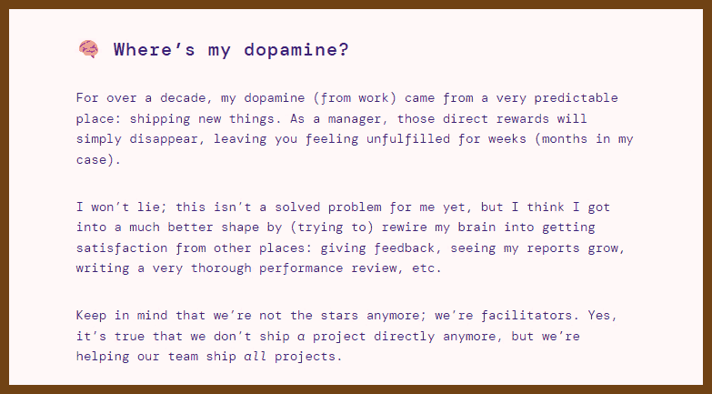

2024-12-07 [1 in 6 Companies Are Hesitant To Hire Recent College Graduates - Intelligent](https://www.intelligent.com/1-in-6-companies-are-hesitant-to-hire-recent-college-graduates/) { www.intelligent.com }

>
>
>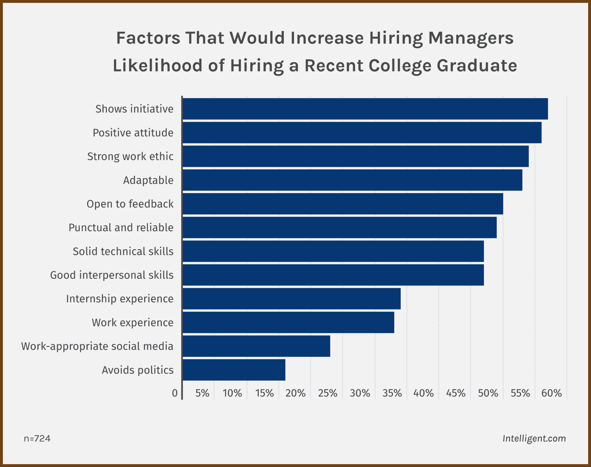

2024-12-09 [The One Good Reason to Become a Manager (and All the Bad Ones) – Terrible Software](https://terriblesoftware.org/2024/12/05/the-one-good-reason-to-become-a-manager-and-all-the-bad-ones/) { terriblesoftware.org }

> 


## Espanso


2024-11-07 [Espanso - A Privacy-first, Cross-platform Text Expander](https://espanso.org/) { espanso.org }

2024-11-07 [espanso/SECURITY.md at master · espanso/espanso](https://github.com/espanso/espanso/blob/master/SECURITY.md) { github.com }

2024-11-07 [Using Espanso to boost Efficiency 🚤 | Alicia's Notes 🚀 — Than...](https://notes.aliciasykes.com/25213/using-espanso-to-boost-efficiency) { notes.aliciasykes.com }

> Really good collection of examples.

```yaml
# Outputs markdown link, with clipboard contents as the URL
- trigger: ":md-link"
  replace: "[$|$]({{clipboard}})"
  vars:
  - name: "clipboard"
    type: "clipboard"

# Creates a HTML anchor element, with clipboard contents as href
- trigger: ":html-link"
  replace: "<a href=\"{{clipboard}}\" />$|$</a>"
  vars:
  - name: "clipboard"
    type: "clipboard"

# Outputs BB Code link, with clipboard contents as the URL
- trigger: ":bb-link"
  replace: "[url={{clipboard}}]$|$[/url]"
  vars:
  - name: "clipboard"
    type: "clipboard"
```

## NiX

2024-08-29 [An unordered list of hidden gems inside NixOS — kokada](https://kokada.dev/blog/an-unordered-list-of-hidden-gems-inside-nixos/) { kokada.dev }

2024-12-04 [Deploying Containers on NixOS](https://bkiran.com/blog/deploying-containers-nixos) { bkiran.com }


## WebDev

2024-12-09 [JSON5 – JSON for Humans | JSON5](https://json5.org/) { json5.org }

> JSON5 is an extension to the popular [JSON](https://tools.ietf.org/html/rfc7159) file format that aims to be easier to **write and maintain \*by hand\* (e.g. for config files)**. It is *not intended* to be used for machine-to-machine communication. (Keep using JSON or other file formats for that. 🙂)

```js
{
  // comments
  unquoted: 'and you can quote me on that',
  singleQuotes: 'I can use "double quotes" here',
  lineBreaks: "Look, Mom! \
No \\n's!",
  hexadecimal: 0xdecaf,
  leadingDecimalPoint: .8675309, andTrailing: 8675309.,
  positiveSign: +1,
  trailingComma: 'in objects', andIn: ['arrays',],
  "backwardsCompatible": "with JSON",
}
```

2024-12-19 [How To Create Multi-Step Forms With Vanilla JavaScript And CSS | CSS-Tricks](https://css-tricks.com/how-to-create-multi-step-forms-with-vanilla-javascript-and-css/) { css-tricks.com }

> 

2024-10-10 [Liskov's Gun: The parallel evolution of React and Web Components – Baldur Bjarnason](https://www.baldurbjarnason.com/2024/liskovs-gun/) { www.baldurbjarnason.com }

2024-10-09 [Why Web Components Failed - YouTube](https://www.youtube.com/watch?v=UrS61kn4gKI) { www.youtube.com }

> 2024-10-09 [Web Components are not Framework Components — and That’s Okay • Lea Verou](https://lea.verou.me/blog/2024/wcs-vs-frameworks/) { lea.verou.me }
>
> 2024-10-09 [JSON•Edit•React](https://carlosnz.github.io/json-edit-react/) { carlosnz.github.io }
>
> 2024-10-09 [CarlosNZ/json-edit-react: React component for editing/viewing JSON/object data](https://github.com/CarlosNZ/json-edit-react#readme) { github.com }

2024-10-10 [player.style - Video & audio player themes for every web player & framework](https://player.style/) { player.style }

> [Show HN: Winamp and other media players, rebuilt for the web with Web Components](https://player.style/) ([player.style](https://news.ycombinator.com/from?site=player.style))
>
> 2024-10-10 [Media Chrome Docs](https://www.media-chrome.org/) { www.media-chrome.org }


## Inspiration!

2024-12-29 [How I Automated My Job Application Process. (Part 1)](https://blog.daviddodda.com/how-i-automated-my-job-application-process-part-1) { blog.daviddodda.com }

> Look, I'll be honest - job hunting sucks.
>
> It's this soul-crushing cycle of copying and pasting the same information over and over again, tweaking your resume for the 100th time, and writing cover letters that make you sound desperate without actually sounding desperate.
>
> But here's the thing: repetitive tasks + structured process = perfect automation candidate.
>
> So I did what any sane developer would do - I built a system to automate the whole damn thing. By the end, I had sent out 250 job applications in 20 minutes. (The irony? I got a job offer before I even finished building it. More on that later.)
>
> Let me walk you through how I did it.
> 2024-12-29 [I automated my job application process | Hacker News](https://news.ycombinator.com/item?id=42531695) { news.ycombinator.com }
>
> - 2024-12-29 [Do Things that Don't Scale](https://paulgraham.com/ds.html) { paulgraham.com }

2024-12-28 [How to Create HTML/ZIP/PNG Polyglot Files | Polyglot-HTML-ZIP-PNG](https://gildas-lormeau.github.io/Polyglot-HTML-ZIP-PNG/SUMMARY.html) { gildas-lormeau.github.io }

> Github: [gildas-lormeau/Polyglot-HTML-ZIP-PNG: Learn how to create HTML/ZIP/PNG polyglot files in JavaScript](https://github.com/gildas-lormeau/Polyglot-HTML-ZIP-PNG)
>
> How to Create HTML/ZIP/PNG Polyglot Files
>
> This article is a summary of the presentation available [here](https://gildas-lormeau.github.io/Polyglot-HTML-ZIP-PNG/). The resulting demo file can be downloaded at the end of the article. The repository can be found at https://github.com/gildas-lormeau/Polyglot-HTML-ZIP-PNG.
>
> Introduction
>
> [SingleFile](https://github.com/gildas-lormeau/SingleFile), a tool for web archiving, commonly stores web page resources as data URIs. However, this approach can be inefficient for large resources. A more elegant solution emerges through combining the ZIP format’s flexible structure with HTML. We’ll then take it a step further by encapsulating this entire structure within a PNG file.

2024-12-26 [Frontend Developer Roadmap: What is Frontend Development?](https://roadmap.sh/frontend) { roadmap.sh }

> by  [Kamran Ahmed (@kamrify) / X](https://x.com/kamrify) { x.com } [kamranahmed.info](https://t.co/eBbUE7Dyku)
>
> 

> 

2024-12-22 [Keeping a CHANGELOG at Work – code.dblock.org | tech blog](https://code.dblock.org/2020/09/01/keep-a-changelog-at-work.html) { code.dblock.org }

> 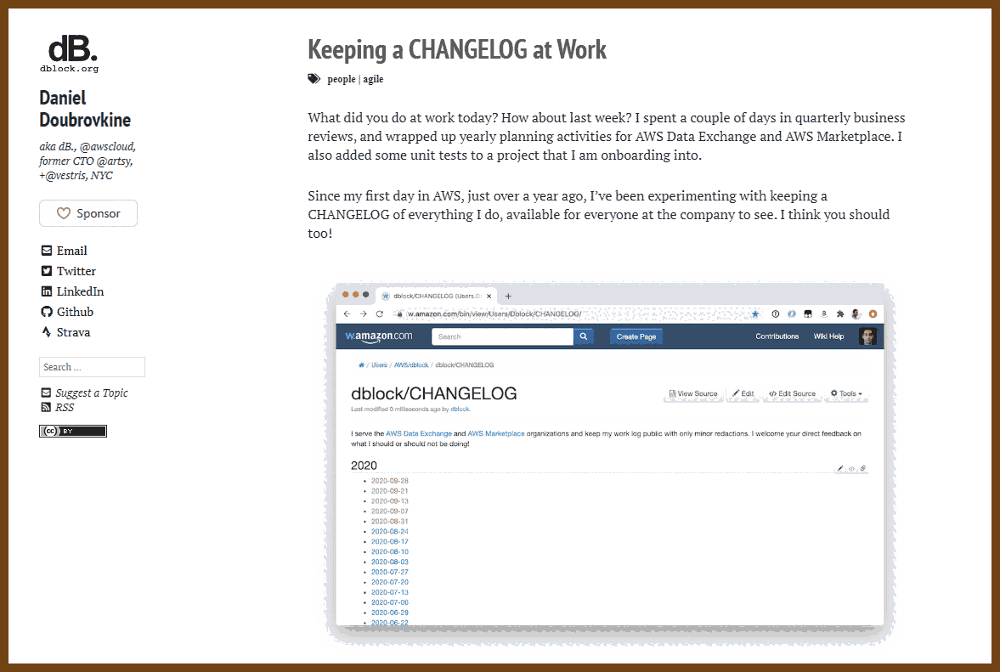

2024-12-22 [Draw all roads in a city at once](https://anvaka.github.io/city-roads/) { anvaka.github.io }

> City Roads: A tool to draw all roads in a city at once
>
> 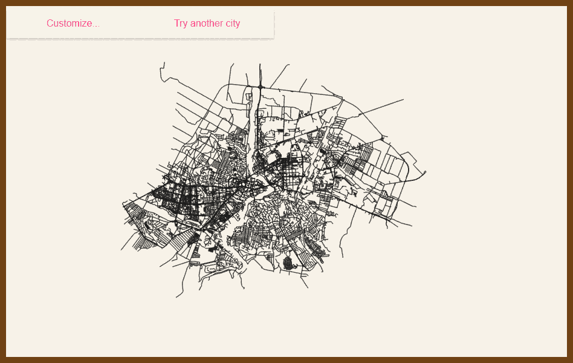

2024-12-21 [Designing a calm web reader | James' Coffee Blog](https://jamesg.blog/2024/11/30/designing-a-calm-web-reader/) { jamesg.blog }

> 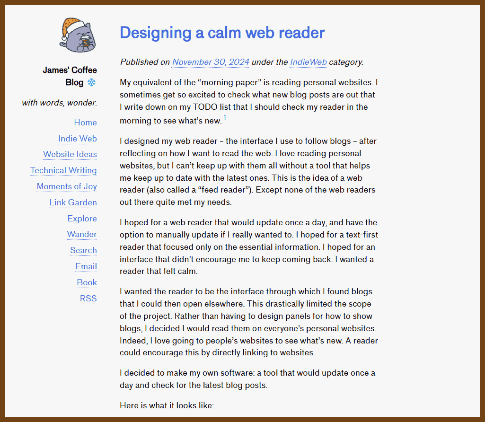

> Github: [capjamesg/web-reader: A minimal web reader.](https://github.com/capjamesg/web-reader)
>
> 2024-12-21 [Show HN: Artemis, a Calm Web Reader | Hacker News](https://news.ycombinator.com/item?id=42471913) { news.ycombinator.com }
>
> 2024-12-21 [Lenns.io - Lenns.io](https://lenns.io/) { lenns.io }
>
> RSS The feed reader
> for people that want to be in control
>
> 2024-12-21 [Instaloader — Download Instagram Photos and Metadata](https://instaloader.github.io/) { instaloader.github.io }

2024-12-21 [Grayjay App - Follow Creators Not Platforms](https://grayjay.app/desktop/) { grayjay.app }

> 

2024-12-20 [apankrat/nullboard: Nullboard is a minimalist kanban board, focused on compactness and readability.](https://github.com/apankrat/nullboard) { github.com }

> Nullboard is a minimalist take on a kanban board / a task list manager, designed to be compact, readable and quick in use.

> 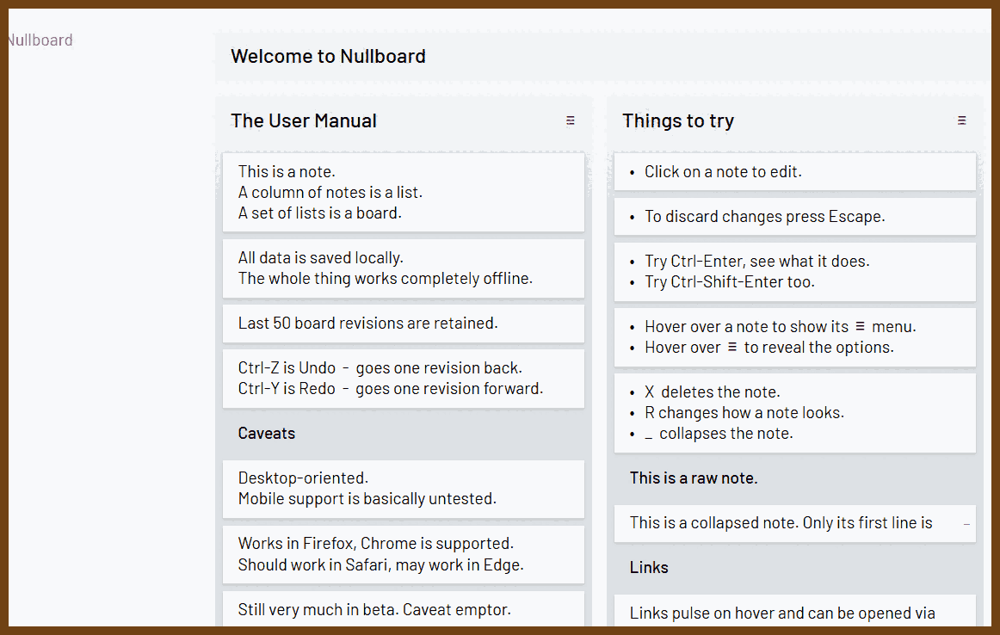

2024-12-20 [mizu.js | Lightweight HTML templating library for any-side rendering](https://mizu.sh/) { mizu.sh }

> 

2024-12-16 [Alien Covenant (Movie Review) — Boy Drinks Ink](https://boydrinksink.com/alien-covenant) { boydrinksink.com }

> 
>
> 

2024-12-16 [Displaying Website Content on an E-Ink Display | Marios Fasold's Website](https://mfasold.net/blog/displaying-website-content-on-an-e-ink-display/) { mfasold.net }

> 

2024-12-13 [Perspective | Perspective](https://perspective.finos.org/) { perspective.finos.org }

> 2024-12-13 [finos/perspective: A data visualization and analytics component, especially well-suited for large and/or streaming datasets.](https://github.com/finos/perspective) { github.com }Perspective is an *interactive* analytics and data visualization component, which is especially well-suited for *large* and/or *streaming* datasets. Use it to create user-configurable reports, dashboards, notebooks and applications, then deploy stand-alone in the browser, or in concert with Python and/or [Jupyterlab](https://jupyterlab.readthedocs.io/en/stable/).
>
> Features
>
> - A fast, memory efficient streaming query engine, written in C++ and compiled for [WebAssembly](https://webassembly.org/), [Python](https://www.python.org/) and [Rust](https://www.rust-lang.org/), with read/write/streaming for [Apache Arrow](https://arrow.apache.org/), and a high-performance columnar expression language based on [ExprTK](https://github.com/ArashPartow/exprtk).
> - A framework-agnostic User Interface packaged as a [Custom Element](https://developer.mozilla.org/en-US/docs/Web/Web_Components/Using_custom_elements), powered either in-browser via WebAssembly or virtually via WebSocket server (Python/Node).
> - A [JupyterLab](https://jupyter.org/) widget and Python client library, for interactive data analysis in a notebook, as well as *scalable* production [Voila](https://github.com/voila-dashboards/voila) applications.

> Found in: ✉️ 2024-12-13 [JavaScript Weekly Issue 716: December 12, 2024](https://javascriptweekly.com/issues/716) { javascriptweekly.com }
>
> 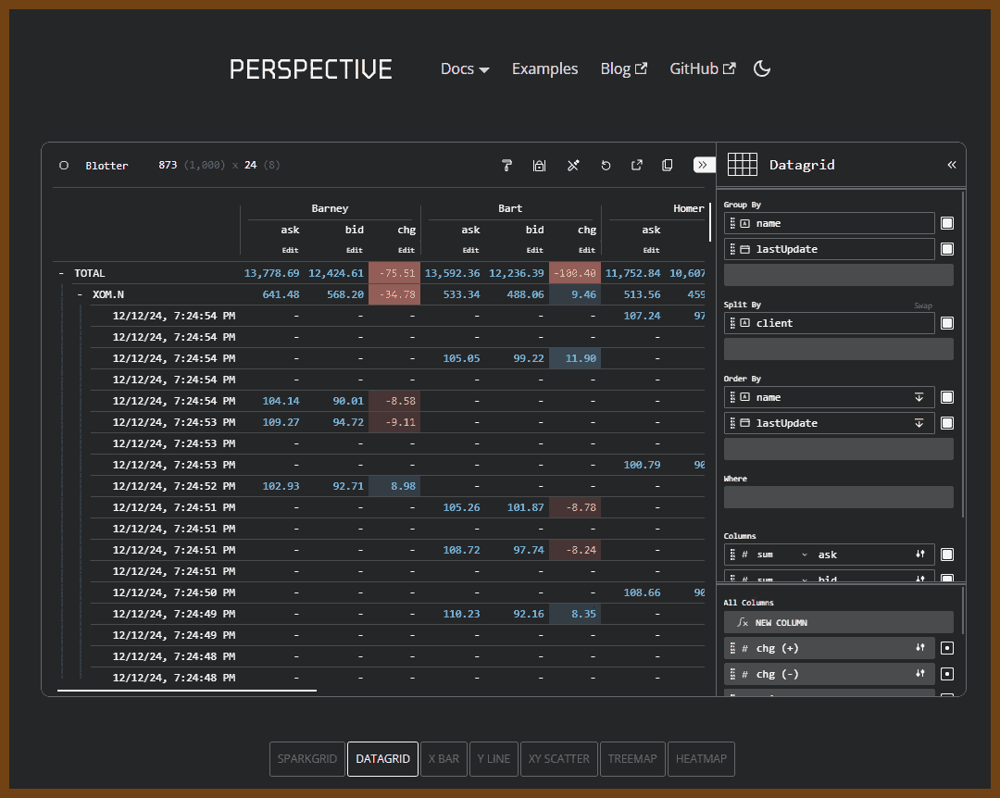

2024-12-13 [Termo - An Easy to use terminal for your browser](https://termo.rajnandan.com/) { termo.rajnandan.com }

> Termo is a simple terminal emulator that can be used to create a terminal-like interface on your website. It is inspired by the terminal emulator in stripe.dev. It is an wrapper on top of xterm.js.
>
> Found in: ✉️ 2024-12-13 [JavaScript Weekly Issue 716: December 12, 2024](https://javascriptweekly.com/issues/716) { javascriptweekly.com }
>
> 

2024-12-07 [ibttf/interview-coder](https://github.com/ibttf/interview-coder) { github.com }

> An invisible desktop application that will help you pass technical interviews
>
> 

2024-12-07 [Install Docker natively on Android Phone and use it as a Home Server | CrackOverflow](https://crackoverflow.com/docs/system_administration/containerization/install-docker-natively-on-android-phone-and-use-it-as-a-home-server/) { crackoverflow.com }

> In this tutorial, we will guide you through the process of installing Docker on your Android phone, specifically using a OnePlus 6T with postmarketOS. I also wrote another [blog post](https://crackoverflow.com/docs/system_administration/containerization/turn_android_phone_to_batteryless_home_server/) explaining how you can run this phone without a battery, allowing it to run forever as long as it remains connected to a power source. If you’re interested, feel free to [check it out!](https://crackoverflow.com/docs/system_administration/containerization/turn_android_phone_to_batteryless_home_server/) This guide can be adapted only for phones on [the postmarketOS device list](https://postmarketos.org/download/). Please note that this process will erase all data on your phone, so it’s important to use a device you don’t need. Let’s get started!
> 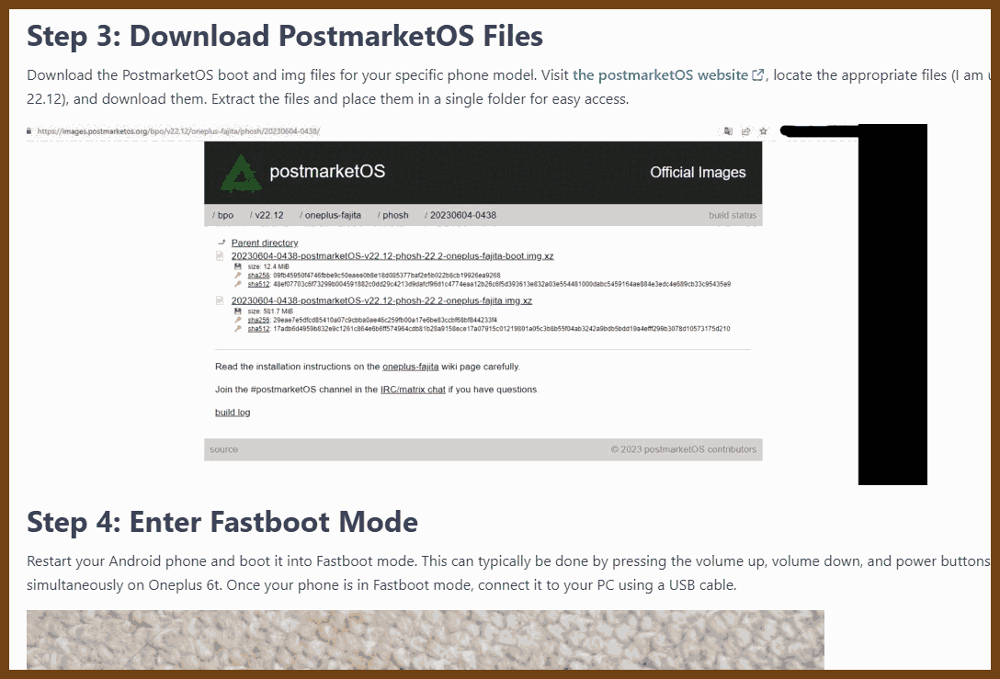


## Database

2024-12-07 [Brian Douglas' Tech Blog - Sensible SQLite defaults](https://briandouglas.ie/sqlite-defaults/) { briandouglas.ie }

> SQLite is cool now. DHH uses it, Laravel defaults to it. Here is a list of *sensible defaults* when using sqlite.

2024-12-20 [vlcn-io/cr-sqlite: Convergent, Replicated SQLite. Multi-writer and CRDT support for SQLite](https://github.com/vlcn-io/cr-sqlite) { github.com }

> "It's like Git, for your data."
>
> CR-SQLite is a [run-time loadable extension](https://www.sqlite.org/loadext.html) for [SQLite](https://www.sqlite.org/index.html) and [libSQL](https://github.com/libsql/libsql). It allows merging different SQLite databases together that have taken independent writes.
>
> In other words, you can write to your SQLite database while offline. I can write to mine while offline. We can then both come online and merge our databases together, without conflict.
>
> **In technical terms:** cr-sqlite adds multi-master replication and partition tolerance to SQLite via conflict free replicated data types ([CRDTs](https://en.wikipedia.org/wiki/Conflict-free_replicated_data_type)) and/or causally ordered event logs.

2024-10-10 [Optimizing Postgres table layout for maximum efficiency](https://r.ena.to/blog/optimizing-postgres-table-layout-for-maximum-efficiency/) { r.ena.to }

> When modeling a Postgres database, you probably don’t give much thought to the order of columns in your tables. After all, it seems like the kind of thing that wouldn’t affect storage or performance. But what if I told you that simply reordering your columns could reduce the size of your tables and indexes by 20%? This isn’t some obscure database trick — it’s a direct result of how Postgres aligns data on disk.
>
> In this post, I’ll explore how column alignment works in Postgres, why it matters, and how you can optimize your tables for better efficiency. Through a few real-world examples, you’ll see how even small changes in column order can lead to measurable improvements.

2024-11-17 [What I Wish Someone Told Me About Postgres | ChallahScript](https://challahscript.com/what_i_wish_someone_told_me_about_postgres/) { challahscript.com }

> I’ve been working professionally for the better part of a decade on web apps and, in that time, I’ve had to learn how to use a lot of different systems and tools. During that education, I found that the official documentation typically proved to be the most helpful.
>
> Except…Postgres. It’s not because the official docs aren’t stellar (they are!)–they’re just *massive*. For the current version (17 at the time of writing), if [printed as a standard PDF on US letter-sized paper](https://www.postgresql.org/files/documentation/pdf/17/postgresql-17-US.pdf), it’s 3,200 pages long. It’s not something any junior engineer can just sit down and read start to finish.
>
> So I want to try to catalog the bits that I wish someone had just told me before working with a Postgres database. Hopefully, this makes things easier for the next person going on a journey similar to mine.
>
> Note that many of these things may also apply to other SQL database management systems (DBMSs) or other databases more generally, but I’m not as familiar with others so I’m not sure what does and does not apply.


## Math

2024-12-18 ✨ [How I Used Linear Algebra to Build an Interactive Diagramming Editor — and Why Matrix Math is Awesome | by Ivan Shubin | Dec, 2024 | ITNEXT](https://itnext.io/how-i-used-linear-algebra-to-build-an-interactive-diagramming-editor-and-why-matrix-math-is-d5bd552f2e8d) { itnext.io }

> 


## C || C++

2024-12-27 [C++ 'Type Erasure' Explained | Dave Kilian's Blog](https://davekilian.com/cpp-type-erasure.html) { davekilian.com } { 2014 }

> I recently stumbled across this pattern on a Hacker News post. It’s a neat toy, but I had a hard time finding a good explanation (most of the information I found jumped straight into examples before really motivating what was going on). In this post, I’ll try to derive the pattern from first principles instead.

CPP Mock libraties:

- 2024-12-27 [rollbear/trompeloeil: Header only C++14 mocking framework](https://github.com/rollbear/trompeloeil/) { github.com }
- 2024-12-27 [eranpeer/FakeIt: C++ mocking made easy. A simple yet very expressive, headers only library for c++ mocking.](https://github.com/eranpeer/FakeIt) { github.com }
- 2024-12-27 [gMock for Dummies | GoogleTest](https://google.github.io/googletest/gmock_for_dummies.html) { google.github.io }

2024-12-21 [Fixing C strings](https://thasso.xyz/2024/12/16/fixing-c-strings.html) { thasso.xyz }

2024-09-29 [It is never too late to write your own C/C++ command-line utilities – Daniel Lemire's blog](https://lemire.me/blog/2024/09/28/it-is-never-too-later-to-write-your-own-c-c-command-line-utilities/) { lemire.me }

> You know those moments when your code feels sluggish, and you wonder if there’s a better way? Sometimes, there is. [Daniel Lemire](https://lemire.me/blog/) recently shared a cool story about swapping a Python script for a custom C++ utility and saving their company a ton of cash. The gist? Their Python script, used to process a JSON file every few seconds, was hogging a full CPU core. They reworked it into a C++ program using some smart libraries like simdjson, and the difference was night and day: over ten times faster, turning a snail into a lightning bolt.
>
> Python is great for getting things up and running quickly, but when performance really matters—like shaving off milliseconds in a process that runs all day—C++ can be a game changer. It takes more effort to write, sure, but the payoff in speed and efficiency can be huge. Of course, it’s not all rainbows; setting up dependencies and dealing with compilation takes extra time. But tools like CMake and CPM are making that part a lot less painful these days.
>
> Python’s convenience makes it perfect for many tasks, but when you’re pushing the limits of performance, don’t be afraid to roll up your sleeves and dive into C++. It’s a little extra work upfront, but when the results are this good, it’s worth it. Plus, you might even impress your team with how much you can squeeze out of your hardware. Sometimes, the old-school tools are still the best ones for the job.

> Python comes with a lot of bundled functionality whereas C++ requires you to give more thought to dependencies. Thankfully CMake with CPM make recovering the dependencies painless:

```cmake
include(cmake/CPM.cmake)
CPMAddPackage("gh:fmtlib/fmt#11.0.2")
CPMAddPackage("gh:simdjson/simdjson@3.10.1")
CPMAddPackage("gh:fastfloat/fast_float@6.1.6")
add_executable(main main.cpp)
target_link_libraries(main fmt::fmt simdjson::simdjson FastFloat::fast_float)
```

2024-11-30 [Everything You Never Wanted To Know About Linker Script · mcyoung](https://mcyoung.xyz/2021/06/01/linker-script/) { mcyoung.xyz }

> 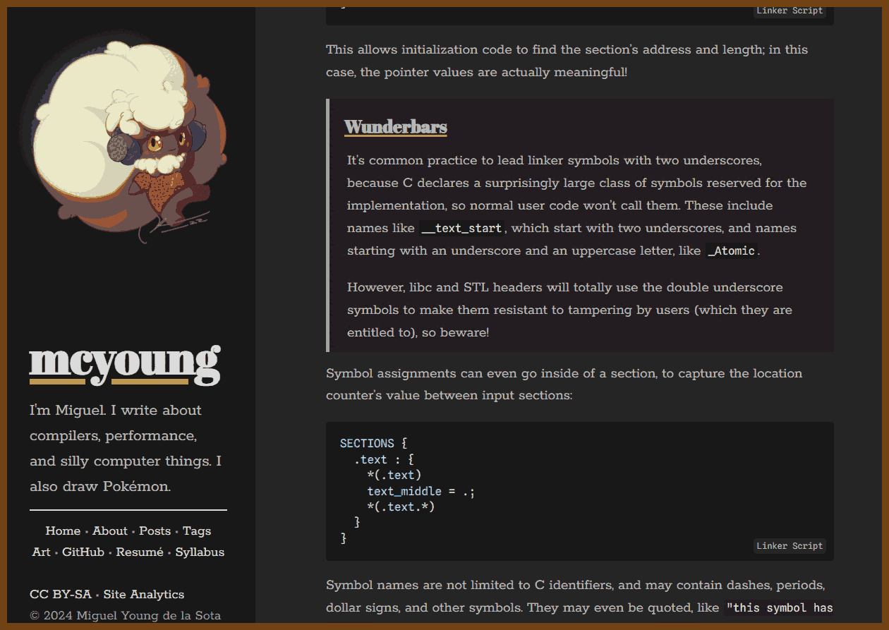

2024-10-13 [Every bug/quirk of the Windows resource compiler (rc.exe), probably - ryanliptak.com](https://www.ryanliptak.com/blog/every-rc-exe-bug-quirk-probably/) { www.ryanliptak.com }

2024-09-13 [Safe C++](https://safecpp.org/draft.html) { safecpp.org }

> Over the past two years, the United States Government has been issuing warnings about memory-unsafe programming languages with increasing urgency. Much of the country’s critical infrastructure relies on software written in C and C++, languages which are very memory *unsafe*, leaving these systems more vulnerable to exploits by adversaries.

2024-09-26 [Embedded Scripting Languages](https://caiorss.github.io/C-Cpp-Notes/embedded_scripting_languages.html) { caiorss.github.io }

2024-09-29 [Few lesser known tricks, quirks and features of C](https://jorenar.com/blog/less-known-c) { jorenar.com }

2024-07-01 [Writing GUI apps for Windows is painful - Samuel Tulach](https://tulach.cc/writing-gui-apps-for-windows-is-painful/)

> 2024-12-21 [ysc3839/win32-darkmode: Example application shows how to use undocumented dark mode API introduced in Windows 10 1809.](https://github.com/ysc3839/win32-darkmode) { github.com }

2024-07-06 [How to implement a hash table (in C)](https://benhoyt.com/writings/hash-table-in-c/)

2024-07-26 [GitHub - cameron314/concurrentqueue: A fast multi-producer, multi-consumer lock-free concurrent queue for C++11](https://github.com/cameron314/concurrentqueue)

2024-08-22 [Do low-level optimizations matter? Faster quicksort with cmov (2020) ](https://cantrip.org/sortfast.html) { cantrip.org }

2024-08-22 [A ToC of the 20 part linker essay  LWN.net ](https://lwn.net/Articles/276782/) { lwn.net }

2024-10-27 [Alternative operator representations - cppreference.com](https://en.cppreference.com/w/cpp/language/operator_alternative) { en.cppreference.com }

2024-10-28 [The Curiously Recurring Template Pattern (CRTP) - Fluent C++](https://www.fluentcpp.com/2017/05/12/curiously-recurring-template-pattern/) { www.fluentcpp.com }

> - The CRTP, episode One: [Definition](https://www.fluentcpp.com/2017/05/12/curiously-recurring-template-pattern/)
> - The CRTP, episode Two: What the CRTP can bring to your code
> - The CRTP, episode Three: [An implementation helper for the CRTP](https://www.fluentcpp.com/2017/05/19/crtp-helper/)

2024-11-07 [marovira/lua: The Lua Programming Language with Modern CMake](https://github.com/marovira/lua) { github.com }

> CMake: This is a bundle of the Lua Programming Language v5.4.4 that provides a modern CMake script for easy inclusion into projects and installation. For usage instructions, see the next section.


## 👂 The Ear of AI

> The Era of AI is now renamed to The Ear of AI because of a silly typo

2024-12-29 [How I run LLMs locally - Abishek Muthian](https://abishekmuthian.com/how-i-run-llms-locally/) { abishekmuthian.com }

> 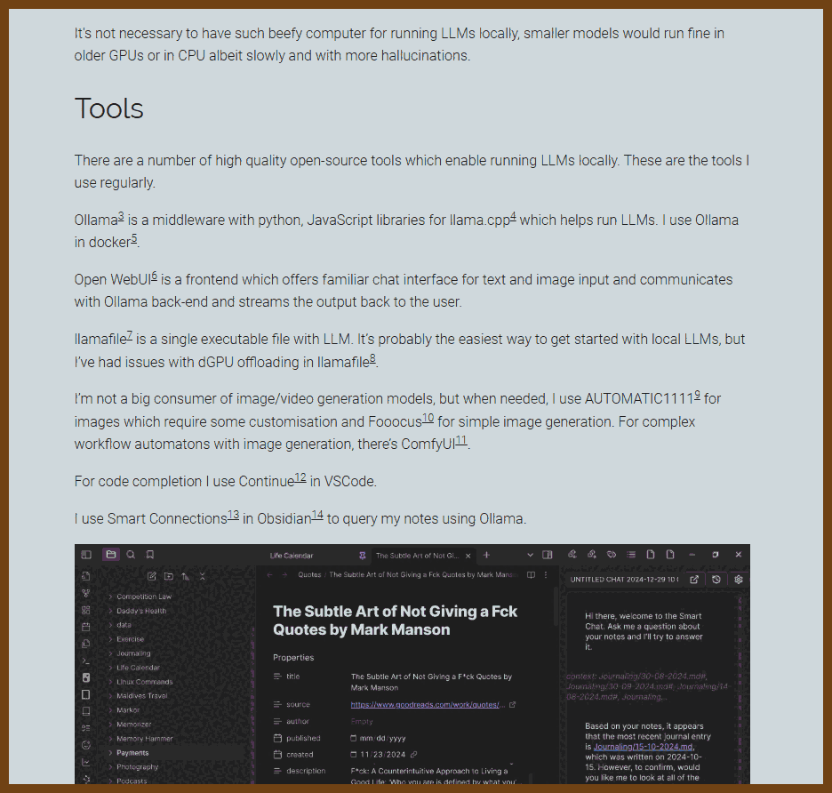

2024-12-21 [A Gentle Introduction to Graph Neural Networks](https://distill.pub/2021/gnn-intro/) { distill.pub }

> This article explores and explains modern graph neural networks. We divide this work into four parts. First, we look at what kind of data is most naturally phrased as a graph, and some common examples. Second, we explore what makes graphs different from other types of data, and some of the specialized choices we have to make when using graphs. Third, we build a modern GNN, walking through each of the parts of the model, starting with historic modeling innovations in the field. We move gradually from a bare-bones implementation to a state-of-the-art GNN model. Fourth and finally, we provide a GNN playground where you can play around with a real-word task and dataset to build a stronger intuition of how each component of a GNN model contributes to the predictions it makes.
> 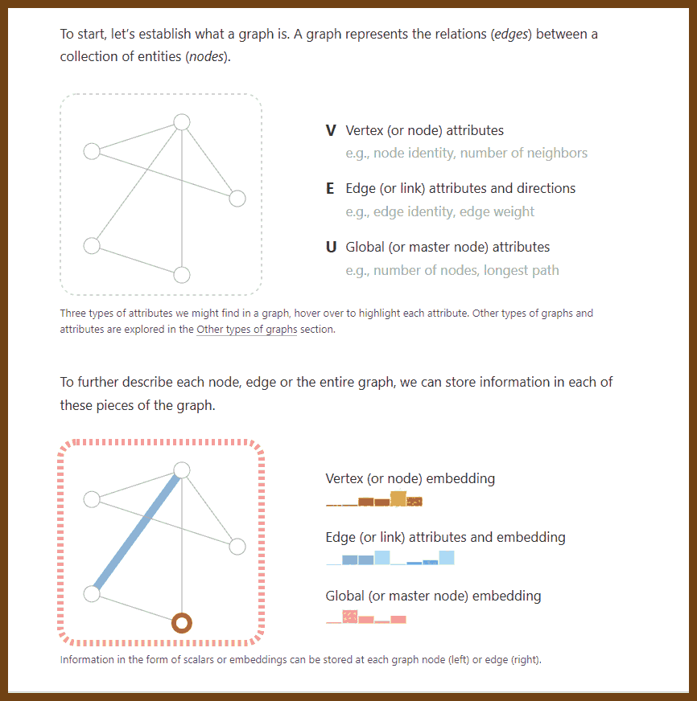

2024-12-21 [OpenAI o3 Breakthrough High Score on ARC-AGI-Pub](https://arcprize.org/blog/oai-o3-pub-breakthrough) { arcprize.org }

> OpenAI's new o3 system - trained on the ARC-AGI-1 Public Training set - has scored a breakthrough **75.7%** on the Semi-Private Evaluation set at our stated public leaderboard $10k compute limit. A high-compute (172x) o3 configuration scored **87.5%**.
>
> ARC-AGI serves as a critical benchmark for detecting such breakthroughs, highlighting generalization power in a way that saturated or less demanding benchmarks cannot. However, it is important to note that ARC-AGI is not an acid test for AGI – as we've repeated dozens of times this year. It's a research tool designed to focus attention on the most challenging unsolved problems in AI, a role it has fulfilled well over the past five years.
>
> Passing ARC-AGI does not equate to achieving AGI, and, as a matter of fact, I don't think o3 is AGI yet. o3 still fails on some very easy tasks, indicating fundamental differences with human intelligence.

2024-12-21 [Building effective agents Anthropic](https://www.anthropic.com/research/building-effective-agents) { www.anthropic.com }

> When building applications with LLMs, we recommend finding the simplest solution possible, and only increasing complexity when needed. This might mean not building agentic systems at all. Agentic systems often trade latency and cost for better task performance, and you should consider when this tradeoff makes sense.
> 

2024-12-15 [They See Your Photos](https://theyseeyourphotos.com/) { theyseeyourphotos.com }

> 

2024-12-12 [A ChatGPT clone, in 3000 bytes of C, backed by GPT-2](https://nicholas.carlini.com/writing/2023/chat-gpt-2-in-c.html) { nicholas.carlini.com }

> 

2024-11-26 [Introducing the Model Context Protocol \ Anthropic](https://www.anthropic.com/news/model-context-protocol) { www.anthropic.com }

> The Model Context Protocol is an open standard that enables developers to build secure, two-way connections between their data sources and AI-powered tools. The architecture is straightforward: developers can either expose their data through MCP servers or build AI applications (MCP clients) that connect to these servers.

2024-11-23 [pingcap/autoflow: pingcap/autoflow is a Graph RAG based and conversational knowledge base tool built with TiDB Serverless Vector Storage. Demo: https://tidb.ai](https://github.com/pingcap/autoflow) { github.com }

> pingcap/autoflow is a Graph RAG based and conversational knowledge base tool built with TiDB Serverless Vector Storage. Demo: [https://tidb.ai](https://tidb.ai/)
>
> 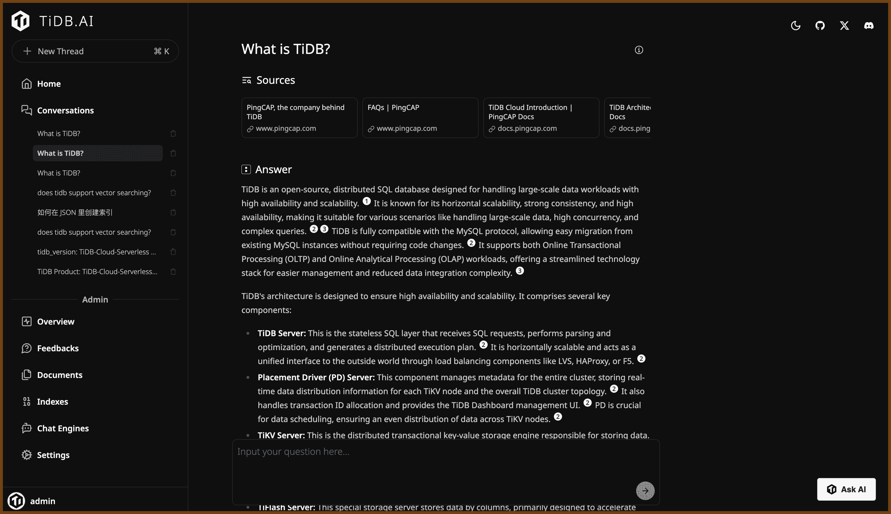

2024-11-22 [AI and Everything Else - Benedict Evans | Slush 2023 - YouTube](https://www.youtube.com/watch?v=xNBiPd2H9J0) { www.youtube.com }

> 2024-11-22 [Presentations — Benedict Evans](https://www.ben-evans.com/presentations) { www.ben-evans.com }

> 
>
> 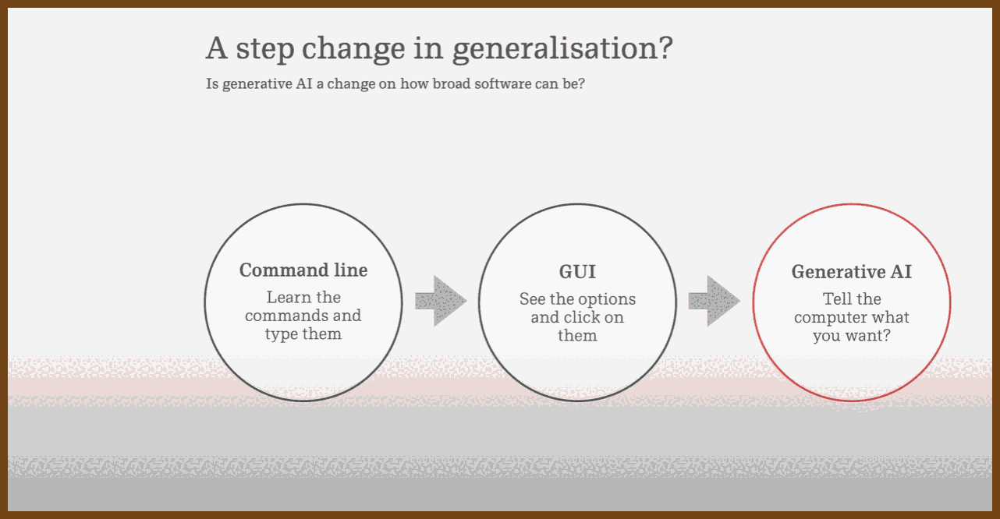

2024-11-14 [AI Makes Tech Debt More Expensive](https://www.gauge.sh/blog/ai-makes-tech-debt-more-expensive) { www.gauge.sh }

> GenAI can’t handle High Complexity
> If you’ve tried tools like Cursor or Aider for professional coding, you know that their performance is highly sensitive to the complexity of the code you’re working on. They provide a dramatic speedup when applying pre-existing patterns, and when making use of existing interfaces or module relationships. However, in ‘high-debt’ environments with subtle control flow, long-range dependencies, and unexpected patterns, they struggle to generate a useful response.

2024-11-07 [TutoriaLLM/TutoriaLLM: Self-hosted environment for programming tutorial by LLM](https://github.com/TutoriaLLM/TutoriaLLM) { github.com }

> TutoriaLLM は、小中学生を対象とした、Web 上で使用できる、LLM によって提供されるセルフホスト型プログラミング学習プラットフォームです。教育コンテンツを制作する人と、そのコンテンツから学ぶ人たちのために設計されています。
>
> TutoriaLLM is a self-hosted programming learning platform for K-12 Education that can be used on the web. It is designed for those who create educational content and those who learn from it.

2024-10-12 [AI Winter Is Coming](https://leehanchung.github.io/blogs/2024/09/20/ai-winter/) { leehanchung.github.io }

2024-08-27 [System Prompts - Anthropic](https://docs.anthropic.com/en/release-notes/system-prompts#july-12th-2024) { docs.anthropic.com }

2024-08-28 [AI Apocalypse: 80% of Projects Crash and Burn, Billions Wasted says RAND Report - SalesforceDevops.net](https://salesforcedevops.net/index.php/2024/08/19/ai-apocalypse/) { Vernon Keenan / salesforcedevops.net }

> The most common cause of AI project failure? It’s not the technology – it’s the people at the top. Business leaders often misunderstand or miscommunicate what problems need to be solved using AI. As one interviewee put it, “They think they have great data because they get weekly sales reports, but they don’t realize the data they have currently may not meet its new purpose.”
>
> Many executives have inflated expectations of what AI can achieve, fueled by salespeople’s pitches and impressive demonstrations. They underestimate the time and resources required for successful AI implementation. One interviewee noted, “Often, models are delivered as 50 percent of what they could have been” due to shifting priorities and unrealistic timelines.
>
> Data quality emerged as the second most significant hurdle. “80 percent of AI is the dirty work of data engineering,” an interviewee stated. “You need good people doing the dirty work—otherwise their mistakes poison the algorithms.”

2024-09-13 [Notes on OpenAI’s new o1 chain-of-thought models](https://simonwillison.net/2024/Sep/12/openai-o1/) { simonwillison.net }

> 2024-09-13 [ 2205.11916  Large Language Models are Zero-Shot Reasoners](https://arxiv.org/abs/2205.11916) { arxiv.org }
>
> Let's think step-by-step

2024-09-18 [zlwaterfield/scramble: Open-Source Grammarly Alternative](https://github.com/zlwaterfield/scramble) { github.com }

> A very simple Chromium and Firefox extension example to fix grammar or rewrite the text on any website

2024-09-18 [WonderWorld](https://kovenyu.com/wonderworld/) { kovenyu.com }

> Interactive Scene Generation
>
> WonderWorld allows real-time rendering and fast scene generation. This allows a user to navigate existing scenes, and specify where and what to generate a new scene. Here are examples where a user specifies scene contents (via text) and locations (via camera movement) to create a virtual world. Videos here are accelerated.

2024-09-18 [STORM](https://storm.genie.stanford.edu/) { storm.genie.stanford.edu }

> 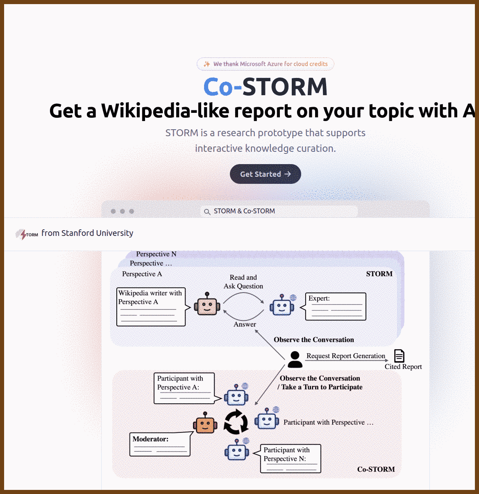

2024-09-18 [punnerud/Local_Knowledge_Graph](https://github.com/punnerud/Local_Knowledge_Graph) { github.com }

> 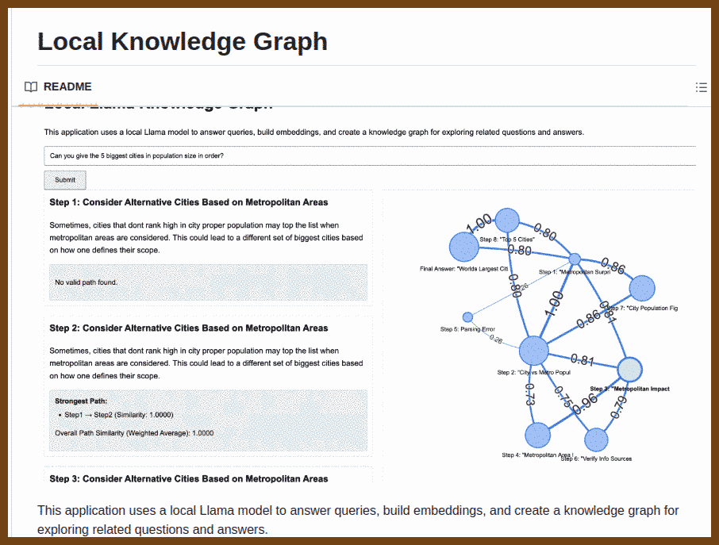

2024-09-01 Discussion thread [Programming with ChatGPT | Hacker News](https://news.ycombinator.com/item?id=41349020) { news.ycombinator.com }

> **[simonw](https://news.ycombinator.com/user?id=simonw) [4 days ago](https://news.ycombinator.com/item?id=41381996) | [prev](https://news.ycombinator.com/item?id=41349020#41384110)**
>
> I'm increasingly building entire functional prototypes from start to finish using Claude 3.5 Sonnet. It's an amazing productivity boost. Here are a few recent examples:
>
> - **[Image Resize Quality Tool](https://tools.simonwillison.net/image-resize-quality)**: This is a tool for dropping in an image and instantly seeing resized versions of that image at different JPEG qualities, each of which can be downloaded. I used to use the (much better) [Squoosh](https://squoosh.app/) for this, but my cut-down version is optimized for my workflow (picking the smallest JPEG version that remains legible). Notes and prompts on how I built it are available [here](https://simonwillison.net/2024/Jul/26/image-resize-and-quality-comparison/).
>
> - **[django-http-debug](https://github.com/simonw/django-http-debug)**: This is an actual open-source Python package I released that was mostly written for me by Claude. It's a webhooks debugger where you can set up a URL, and it will log all incoming requests to a database table for you. Notes on how I built it are available [here](https://simonwillison.net/2024/Aug/8/django-http-debug/).
>
> - **datasette-checkbox**: This is a Datasette plugin that adds toggle checkboxes to any table with `is_` or `has_` columns. An animated demo and prompts showing how I built the initial prototype can be found [here](https://simonwillison.net/2024/Aug/16/datasette-checkbox/).
>
> - **[Gemini BBox Tool](https://tools.simonwillison.net/gemini-bbox)**: This is a tool for trying out Gemini 1.5 Pro's ability to return bounding boxes for items it identifies. You'll need a Gemini API key for this one, or you can check out the demo and notes [here](https://simonwillison.net/2024/Aug/26/gemini-bounding-box-visualization/).
>
> - **[Gemini Chat Tool](https://tools.simonwillison.net/gemini-chat)**: This is a similar tool for trying out different Gemini models (Google released three more yesterday) with a streaming chat interface. Notes on how I built it are available [here](https://tools.simonwillison.net/gemini-chat).
>
> I still see some people arguing that LLM-assisted development like this is a waste of time, and they spend more effort correcting mistakes in the code than if they had written it from scratch themselves.
>
> I couldn't disagree more. My development process has always started with prototypes, and the speed at which I can get a proof-of-concept prototype up and running with these tools is quite frankly absurd.

2024-06-27 [dropofahat.zone](https://dropofahat.zone/)

> 2024-06-27 [I am using AI to drop hats outside my window onto New Yorkers | Hacker News](https://news.ycombinator.com/item?id=40767459)
> 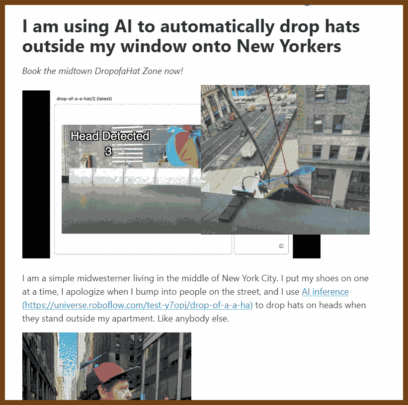

2024-12-26 [Apache NiFi](https://nifi.apache.org/) { nifi.apache.org }

> 
>
> 

> 2024-12-26 [Apache NiFi on Azure - Azure Architecture Center | Microsoft Learn](https://learn.microsoft.com/en-us/azure/architecture/example-scenario/data/azure-nifi) { learn.microsoft.com }
>
> 

