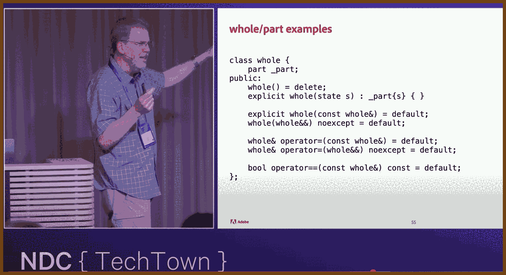
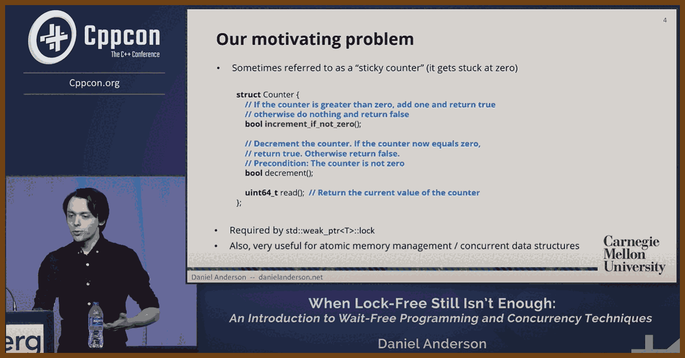

---
layout: post
title:  "Links from my inbox 2025-01-20"
date:   2025-01-20T20:56:00-08:00
categories: links
---


## ⌚ Nice watch!

2025-01-21 [How I Built T3 Chat in 5 Days - YouTube](https://www.youtube.com/watch?v=QLvIoi2s1zY) { www.youtube.com }

> 
> GPT Summary: 
> I developed T3 Chat, an AI chat app that emphasizes speed, usability, and efficient local-first architecture, completing the project in just five days. Motivated by frustrations with existing AI tools, I aimed to create a responsive and seamless experience. Leveraging the **Deep Seek V3 model** for its speed and affordability, I found existing starter kits unsuitable for my needs, prompting me to build a custom solution. The app uses **React**, **React Router**, and **Dexie.js** for its database layer, enabling offline functionality and efficient synchronization between local and cloud data. Switching from server-driven routing to a client-side approach greatly improved navigation and responsiveness.
>
> The development process included significant hurdles. I experimented with tools like Jazz for syncing but found its collaborative-first structure overly restrictive. Instead, I built a custom sync layer, tailoring the data flow to the app's requirements. Performance optimization was critical, with tools like **React Scan** helping to eliminate inefficiencies. Markdown chunking and memoized rendering were implemented to minimize unnecessary re-renders, ensuring a smooth user experience. Payments were integrated with **Stripe**, alongside an onboarding flow that uses inline messages to explain app features. Despite challenges, these deliberate engineering choices resulted in an app that is faster, more responsive, and better tailored to user needs than its competitors.
>
> The tools used include **Deep Seek V3**, **React**, **Dexie.js**, **React Router**, **React Scan**, **Tailwind CSS**, **Vercel AI SDK**, and **Stripe**. Each played a vital role, though some required customization, like Jazz and OpenAuth. The result is an AI chat app that outperforms existing alternatives by leveraging local-first architecture, advanced optimizations, and thoughtful design principles. This project demonstrates how targeted engineering and innovative thinking can create high-performing, user-focused applications.

2025-01-19 [Locknote: Local Reasoning in C++ - Sean Parent - NDC TechTown 2024 - YouTube](https://www.youtube.com/watch?v=bhizxAXQlWc) { www.youtube.com }

> 
> GPT Summary:
>
> The speaker, **Sean Parent**, a senior principal scientist at Adobe, shared insights into improving **software engineering practices** with a focus on **local reasoning**—breaking down complex systems into manageable, verifiable components. He also delved into challenges around reasoning in C++, design principles, and strategies for building reliable systems.
>
> **Core Ideas from the Talk**
>
> **The Root Cause of Software Failures**
>  The talk began with an analysis of why large software systems fail. Despite many failures being attributed to **management issues**, the real challenges often stem from exceeding our ability to **reason about systems**. The software engineering crisis, a problem identified as early as 1968, persists because large systems become too complex to understand or verify.
>
> > "The greatest limitation in writing software is our ability to understand the systems we're creating."
>
> Key failures include lack of tools, poor practices, and an over-reliance on free relationships (unmanaged dependencies between components).
>
> **Local Reasoning**
>  **Local reasoning** is the ability to understand and verify a function or class **independently of its broader context**. This is enabled through clear APIs, **preconditions**, and **postconditions**, which define the contract between the client (caller) and the implementer. The talk focused on achieving local reasoning through careful structuring of functions, arguments, and classes.
>
> **API Contracts and Preconditions**
>  Preconditions and postconditions define the expectations and guarantees of a function:
>
> 1. **Preconditions**: Specify conditions the caller must meet before invoking the function.
> 2. **Postconditions**: Describe the state after the function executes successfully.
> 3. **Invariant Conditions**: Properties that must always hold true within the scope of a function or class.
>
> Preconditions allow implementers to shift responsibility for ensuring valid input to the caller, simplifying function logic.
>
> > "Do not underestimate the power of a precondition. It lets the implementer focus on the valid cases."
>
> **Managing Function Arguments**
>  Function arguments should follow a clear and consistent contract:
>
> - **Let Arguments**: Immutable references (e.g., `const T&`) that are not modified by the function.
> - **In-Out Arguments**: Mutable references (e.g., `T&`) that may be modified by the function.
> - **Sink Arguments**: R-value references (e.g., `T&&`) that are consumed by the function, leaving the caller responsible for ensuring proper ownership transfer.
>
> General rules for arguments:
>
> - **Non-const references** must not be accessed by other threads during the function's execution.
> - **Const references** must not be written to during the function's execution.
>
> These rules enforce **memory safety** and help prevent concurrency issues.
>
> **Avoiding Aliasing and Law of Exclusivity**
>  Aliasing—when multiple references point to the same memory—is a major challenge in reasoning about code. C++ lacks built-in safeguards like Swift’s **exclusive access** or Rust’s **borrow checker**, but developers must enforce similar rules manually:
>
> - Ensure no overlapping projections (references to object parts) are passed to a function.
> - Projections are invalidated if the object they point to is modified.
>
> > "In C++, we have exactly the same rule. We just don't have the language facilities to enforce it."
>
> **Projections and Value Semantics**
>  Projections (e.g., references to parts of an object) enable **value semantics** while maintaining efficiency. Rules for projections include:
>
> - Avoid overlapping mutable projections.
> - Projections are invalidated when the parent object is modified or destroyed.
> - Multiple non-overlapping projections may coexist safely.
>
> **Mutation and Independence**
>  To simplify reasoning, objects must be **independent under mutation**:
>
> 1. Disallow mutation (functional programming).
> 2. Disallow sharing of mutable objects.
> 3. Allow mutation only when there is no sharing (copy-on-write).
>
> Encapsulation and **whole-part relationships** (e.g., an object fully owning its parts) are critical to maintaining independence.
>
> **Encapsulation of Relationships**
>  Extrinsic relationships—connections between objects not captured by a whole-part hierarchy—are a primary source of complexity. These relationships should:
>
> - Be encapsulated within a managing class to enforce **invariants** (e.g., ensuring a pointer remains valid).
> - Be carefully tracked and invalidated when one side of the relationship changes.
>
> > "Containers are examples of classes that manage extrinsic relationships between their parts."
>
> **Complexity and Chaotic Systems**
>  Complex systems often become **chaotic**—unpredictable and impossible to reason about. Examples like the **three-body problem** illustrate how simple rules and relationships can create unpredictable behaviors. Developers must avoid creating chaotic systems by:
>
> - Structuring code into **hierarchies** (e.g., whole-part relationships).
> - Encapsulating relationships within manageable, well-defined classes.
> - Simplifying or abstracting relationships to reduce interconnectedness.
>
> **Free Relationships**
>  Free relationships—unmanaged dependencies—are inherently dangerous. The speaker recommends avoiding them entirely, except in cases where the relationships are **monotonic**:
>
> - Monotonic systems only move forward and never return to a previous state (e.g., immutable variables or conflict-free replicated data types).
>
> **Designing Reliable Code**
>  The speaker provided concrete recommendations for designing reliable, predictable systems:
>
> - **Use small, single-purpose functions**: Each function should have a clear role with well-defined inputs and outputs.
> - **Avoid modifying shared state**: Treat shared state as immutable or use copy-on-write semantics.
> - **Minimize sharing**: Avoid passing shared pointers or references to mutable state in public interfaces.
> - **Write testable, invariant-based classes**: Ensure each class encapsulates its relationships and invariants.
> - **Manage complexity with hierarchies**: Use containment relationships to enforce structure and reasoning.
>
> **Guidelines for APIs**
>
> 1. Functions should clearly specify their scope and effects.
> 2. Use **projections** to allow manipulation of object parts while preserving value semantics.
> 3. Do not pass overlapping projections or invalid references.
> 4. Favor references over shared pointers in function interfaces.
>
> **Addressing Systemic Complexity**
>  When individual relationships between parts become too complex to reason about, step back and define the system as a whole. For example, instead of managing individual moves in chess, define the overall algorithm for playing the game.
>
> **Summary of Best Practices**
>
> 1. Write **clear APIs** with defined preconditions, postconditions, and invariants.
> 2. Avoid shared state unless absolutely necessary, and treat shared state as immutable.
> 3. Design objects for **value semantics**, ensuring independence and disjointedness.
> 4. Encapsulate relationships into classes to simplify reasoning.
> 5. Use **hierarchies and DAGs** to structure complex systems.
> 6. Minimize complexity by managing extrinsic relationships and avoiding chaotic loops.
> 7. Build monotonic systems where possible to allow for distributed, predictable behavior.
>
> > "At some point, individual relationships become too complex. You have to step back and solve the system as a whole."
>
> These principles form a cohesive strategy for creating systems that are easier to reason about, maintain, and scale. By adhering to local reasoning, managing complexity, and encapsulating relationships, developers can build reliable, efficient software.
>
> whole / part snippet: 

```cpp
/**
 * @class whole
 * @brief An example "whole" class that holds a "part" subobject.
 *
 * This class demonstrates a pattern where we:
 * - Disallow default construction.
 * - Provide an explicit constructor taking a required parameter.
 * - Use compiler-generated (default) copy/move constructors and assignment operators.
 * - Provide a default comparison operator.
 *
 * The goal is to ensure that any "whole" object is always in a valid and meaningful state,
 * and that all defaulted functions have consistent semantics with their subobjects.
 */
class whole {
    /**
     * @var _part
     * @brief The subobject/part that this "whole" manages.
     *
     * Storing the part as a member ensures that the "whole" is always composed of
     * a valid "part". We rely on the "part" type to provide its own correctness
     * and invariants.
     */
    part _part;

public:
    /**
     * @brief Delete the default constructor.
     *
     * Reason:
     * - We do not allow a "whole" to exist without explicitly providing
     *   a meaningful state for its subobject.
     * - Prevents accidental creation of a "whole" in an uninitialized or
     *   incomplete state.
     */
    whole() = delete;

    /**
     * @brief Construct a "whole" by providing a required state.
     *
     * @param s A "state" object that the "_part" subobject will be constructed with.
     * Reason:
     * - Ensures that each new "whole" has a valid "part" from the beginning.
     * - Marked explicit to prevent implicit conversions from state -> whole,
     *   forcing a clear constructor call.
     */
    explicit whole(state s)
        : _part{s}
    { }

    /**
     * @brief The copy constructor (defaulted).
     *
     * Reason:
     * - In most cases, compiler-generated copying does exactly what we want:
     *   memberwise copy of the subobjects.
     * - Making it explicit (optional choice here) can prevent some unintentional
     *   conversions, but primarily we’re just acknowledging that it is defaulted.
     */
    explicit whole(const whole&) = default;

    /**
     * @brief The move constructor (defaulted, noexcept).
     *
     * Reason:
     * - We allow moving to be efficient and safe.
     * - noexcept helps with certain optimizations (e.g., containers can move
     *   elements instead of copying if they know it won’t throw).
     */
    whole(whole&&) noexcept = default;

    /**
     * @brief Copy assignment operator (defaulted).
     *
     * Reason:
     * - Same rationale as the copy constructor: a simple memberwise copy
     *   from the other "whole" is typically correct and easiest to maintain.
     */
    whole& operator=(const whole&) = default;

    /**
     * @brief Move assignment operator (defaulted, noexcept).
     *
     * Reason:
     * - Same rationale as the move constructor: move semantics can improve
     *   performance, noexcept promises no exceptions are thrown.
     */
    whole& operator=(whole&&) noexcept = default;

    /**
     * @brief Equality comparison operator (defaulted).
     *
     * @param other The other "whole" to compare with.
     * @return true if the two "whole" objects are equal, false otherwise.
     *
     * Reason:
     * - Defaulted comparison will do a memberwise comparison of "_part"
     *   (assuming "part" itself has an appropriate operator==).
     * - Makes it easy to compare two "whole" objects without manual checks.
     */
    bool operator==(const whole&) const = default;
};

```

2025-01-18 [TPMs and the Linux Kernel: unlocking a better path to hardware security - Ignat Korchagin - YouTube](https://www.youtube.com/watch?v=g8b4K5FQUj8) { www.youtube.com }

> 
> GPT Summary:
>
> - **Introduction to TPMs**: Trusted Platform Modules (TPMs) are passive hardware security chips widely available in modern laptops and servers. They are primarily used for cryptographic key management, platform integrity, and remote attestation, providing hardware-backed security for sensitive operations.
> - **TPMs in Application Development**: Despite their ubiquity, TPMs are rarely used directly by applications. Developers face challenges such as complex interfaces, limited documentation, and the absence of seamless support in common libraries and tools.
> - **Complexity of TPM Interaction**: Using TPMs involves navigating multiple layers:
>   1. **Resource Managers**: Necessary to serialize access to the TPM, which cannot handle multiple concurrent requests. Linux provides an in-kernel resource manager (`/dev/tpmrm0`) to simplify this.
>   2. **TPM Libraries**: Competing implementations (Intel TSS and IBM TSS) have incompatible APIs, forcing developers to make early, limiting choices.
> - **Linux Kernel Key Retention Service**: A subsystem of the Linux kernel that securely stores cryptographic keys in kernel memory, ensuring their isolation from user-space processes. It supports multiple key types (e.g., user, logon, and trusted keys) and organizes keys into hierarchical key rings with fine-grained permissions.
> - **Trusted Keys with TPM Integration**: Trusted keys leverage TPMs to encrypt key material into "wrapped blobs," ensuring plaintext keys are never exposed to user space. The kernel automatically decrypts these blobs when needed, making it a lightweight software HSM.
> - **Key Management Challenges**: Current trusted key implementation requires applications to manage wrapped blobs manually, which complicates key recovery, persistence, and scaling, especially for stateless systems or devices with limited storage.
> - **Key Derivation from TPMs**: A proposed approach uses TPM seed values and application-specific metadata to deterministically derive cryptographic keys. This method eliminates the need for persistent key storage and enables scalable, reproducible key management.
> - **Linux Crypto API and Kernel Key Store Integration**: The Linux Crypto API allows applications to offload cryptographic operations to the kernel using cryptographic sockets. A recent patch integrates this API with the key store, enabling cryptographic operations using kernel-managed keys without exposing them to user space.
> - **Request Key System Call Enhancements**: The `request_key` syscall is extended to allow dynamic retrieval of application-specific keys. A plugin-based architecture lets the kernel call user-space helpers (e.g., TPM-aware plugins) to derive or retrieve keys as needed.
> - **Stateless Key Derivation with TPMs**: The stateless key derivation method uses TPMs to create keys tied to application metadata (e.g., executable paths, user IDs, or code hashes). These keys are reproducible and isolated by design, making them suitable for ephemeral or IoT systems.
> - **Kernel-Based Key Derivation**: A proposed kernel patch would eliminate user-space exposure of key material entirely by performing key derivation directly in the kernel, ensuring plaintext keys remain within secure kernel memory.
> - **Limitations of Current TPM Integration**: Existing systems primarily support symmetric key operations. Asymmetric key functionality, such as signing or private key decryption, remains under development and is expected in future kernel releases.
> - **Improving Accessibility for Developers**: By exposing TPM functionality through the Linux key retention service, developers can leverage hardware-backed security without needing to understand TPM internals, providing a more accessible pathway for application adoption.
> - **Call for Community Feedback**: The speaker sought input on the practicality of proposed solutions for IoT and stateless systems, emphasizing the importance of balancing security, scalability, and developer usability.

2025-01-18 [Memory Safety: Rust vs. C - Robert Seacord - NDC TechTown 2024 - YouTube](https://www.youtube.com/watch?v=YofBgJ2zpBs) { www.youtube.com }

> 
> GPT Summary:**Background and Context**: The talk originates from a memory-safe languages panel led by government and industry stakeholders. There is a push, particularly from governments like the U.S. and other Five Eyes members, to migrate critical systems from **C and C++** to "memory-safe languages" like **Rust**. The speaker, while defending C and C++, acknowledges biases and stresses the importance of fair evaluations between languages.
>
> **Challenges of Defining "Memory-Safe Languages"**: The panel has inconsistently defined key terms. A "low-level memory-safe language" (essentially Rust) is distinguished from garbage-collected ones like Java or Python. The main critique of C/C++ centers not on the inherent inability to ensure memory safety but on the lack of **compiler-enforced memory safety**, leaving discipline and external tools to fill the gap.
>
> **Types of Safety**: The talk breaks down safety concerns into **type safety**, **memory safety**, and **thread safety**, each foundational to broader software **security** and **functional safety**. Functional safety ensures systems like brakes or airplane controls continue operating safely, even under partial failure.
>
> **Arguments for C/C++ in Safety-Critical Systems**: Safety-critical systems in aerospace, automotive, and other domains rely on C/C++ due to decades of tooling, standards (e.g., **ISO 26262**), and expertise. The deterministic nature of these languages aligns with strict timing and behavior guarantees, which are harder to achieve with garbage collection or immature ecosystems.
>
> **Rust's Growing Role and Barriers**: Rust, though promising, faces ecosystem maturity challenges. The availability of Rust-trained engineers, tooling gaps (e.g., in platforms like **MathWorks**), and reliance on interoperability with C APIs present barriers. Rust's adoption in safety-critical domains remains limited due to these hurdles and the immense cost of rewriting existing, battle-tested codebases.
>
> **Security Concerns Beyond Memory Safety**: Eliminating memory safety issues does not address broader vulnerabilities like **input validation**, **SQL injection**, or **business logic errors**. For example, tools in C/C++ like **AddressSanitizer (ASan)** can address memory safety issues but are unsuitable for production. Security is a multi-faceted problem that Rust alone cannot solve.
>
> **Progress in C and C++**: Modern updates in C (e.g., **C23's checked integer operations**) and C++ aim to close gaps in safety. Tools like **UBSan**, **ASan**, and **static analysis** have matured, enabling effective error detection and mitigation in development. The C/C++ ecosystem has advanced to rival or even surpass memory-safe languages in certain safety-critical applications.
>
> **Cost and Practicality of Transition**: Rewriting massive C/C++ systems into Rust or any other language without adding new features is seen as economically unviable. Transition timelines are long, involving curriculum changes, workforce training, and standards development. Safety-critical systems tend to evolve incrementally rather than through wholesale rewrites.
>
> **Critique of the Panel's Conclusions**: The speaker criticizes the panel's narrow focus on memory safety as overly simplistic. Broader issues like ecosystem maturity, tooling availability, and compatibility with safety standards make the wholesale dismissal of C and C++ impractical and misguided.
>
> **Closing Thoughts**: The speaker emphasizes a balanced, pragmatic approach to safety and security. Transitioning to Rust or any new language must account for all engineering realities, including ecosystem readiness, regulatory compliance, and the multifaceted nature of software vulnerabilities.

2025-01-18 [How Simple Is "As Simple As Possible"? - Rendle . - NDC Porto 2024 - YouTube](https://www.youtube.com/watch?v=WfUQHpcLKF4) { www.youtube.com }

> 
>
> **Simplifying Software Development: A Rant on Doing Less, Better**
>
> This is a talk about how we’re overcomplicating software for no good reason. It’s about keeping things simple and just building systems that work instead of getting lost in trends, tools, and buzzwords.
>
> The speaker kicks off with a nostalgic dive into the early days of coding on Tandon 286 machines, soldering RS232 cables by hand, and building monoliths that simply did the job. “We wrote software that people used, they got their jobs done, and went home happy. No internet, no GitHub repos -- just code that worked.”
>
> Fast forward to today, and things are a mess. **Microservices?** Great if you’ve got a thousand developers and a global scale problem. If not, you’re probably just smashing your monolith into tiny, unmanageable pieces. “If you’ve got fewer than 100 programmers and you’re doing microservices, I will find you and kick your shins.”
>
> The same critique extends to **APIs**. SOAP was overkill; REST simplified things (or did it?), but now we’re stuffing APIs with metadata, inventing **gRPC**, or obsessing over “hypermedia” that no one asked for. “Just send some JSON over HTTP and call it a day. We don’t need another doctoral thesis to justify URLs.”
>
> And don’t even get started on **frontends**. React, Angular, Vue -- they’re all bloated monstrosities. “140MB of node modules to load a blank page? What are we even doing?” The solution? Go back to **server-side rendering** or use lightweight tools like **HTMX**. “We solved these problems years ago, but no -- let’s reinvent them with more JavaScript.”
>
> On infrastructure, the speaker points to **Kubernetes** as a classic example of overengineering. “Most of us don’t need it, but we’re running it anyway because it sounds cool. Just use containers properly and let the cloud handle the rest.”
>
> The takeaway is simple: stop making things harder than they need to be. “If you’re adding complexity just to look good on your CV, you’re doing it wrong. Just build stuff that works, keep it simple, and fix it when it breaks. Complexity isn’t clever; it’s stupid.”
>
> The talk wraps with humor but drives the point home: "Stop overcomplicating things. Build what you need. Then go get a beer."

2025-01-13 [Why You're Not Getting Promoted To Senior (ex-Amazon Principal) - YouTube](https://www.youtube.com/watch?v=2TqAC_VGRAc) { www.youtube.com }

> 
>
> To become a senior engineer, understanding **what blocks promotions** and taking deliberate actions to address those barriers is crucial. Based on the advice provided, here are the key takeaways and actionable insights:
>
> One common misconception is that excellent **technical skills** alone will secure a promotion. Many engineers hit a plateau despite being technically competent because they overlook critical non-technical factors. According to the speaker, three specific roadblocks hinder promotions, and addressing these can change your trajectory.
>
> The first roadblock is **ineffective delegation**. Promotions often require demonstrating leadership, and delegation is a cornerstone of this. However, not all delegation styles are equally effective:
>
> - **The Load Balancer**: Merely distributing tasks among the team doesn’t showcase leadership or improve team capabilities. "Tasks come in, and you spread them out to others on your team." This approach doesn't reduce overall workload or scale your impact.
> - **The Decomposer**: Breaking down ambiguous problems into smaller, executable tasks is better, but it's still an expected responsibility at most levels. It doesn’t elevate you as a leader.
> - **The Capability Multiplier**: This is the ideal approach. By assigning challenging problems to team members and coaching them through the process, you scale your impact by developing the team. "You coach them up, tell them how you would handle the situation, and let them handle the problem on their own." The critical elements of this approach are:
>   - Knowing your team’s capabilities to assign tasks slightly outside their comfort zone.
>   - Investing time upfront to coach them while stepping away to give them ownership.
>   - Accepting the possibility of failure as part of their growth.
>
> Effective delegation demonstrates leadership by "creating copies of yourself," a trait highly valued in promotion decisions.
>
> The second roadblock is a **weak relationship with your manager**. Promotions often hinge on managerial support. Managers are hesitant to risk promoting someone who might fail at the next level, as this reflects poorly on them and disrupts team dynamics. The speaker emphasized: "Your manager is the biggest roadblock to getting promoted to senior... They only do that for people that they trust."
>
> To strengthen this relationship:
>
> - Clearly communicate your desire for promotion and ask for specific feedback.
> - Build trust by consistently delivering results and taking ownership of problems.
> - Repair any strained relationships or consider moving to a different team if necessary.
>
> The third roadblock is **failing to demonstrate leadership by owning problems**. To advance to senior engineer, you must show initiative in solving team-level issues. The story of David, an engineer striving for promotion, illustrates this. Despite his technical excellence, his promotion was blocked because he raised problems without presenting solutions. Leadership involves not just identifying issues but also proactively addressing them.
>
> For example:
>
> - If user adoption is low, suggest prioritizing features to improve engagement.
> - If defect rates are high, identify patterns or implement training for improvement.
> - If operational load is causing attrition, propose forming a task force to resolve it.
>
> "High-level ICs are leaders that don't have direct reports. Leaders take ownership of problems and do something about them."
>
> In summary, focus on **scaling through delegation**, **building trust with your manager**, and **demonstrating leadership through problem ownership**. These strategies will position you as a strong candidate for promotion to senior engineer.

[CS50 Cybersecurity - Lecture 1 - Securing Data](https://www.youtube.com/watch?v=X3DVaMnl5n8)

> 

> > Also: 
> >
> > 2024-12-18 [CS50 Cybersecurity - Lecture 2 - Securing Systems - YouTube](https://www.youtube.com/watch?v=9phdZjF8qOk) { www.youtube.com }
>
> **1. Password Security and Hashing**
>
> - **Storing Passwords**: Early systems stored plaintext passwords like "alice: apple," which is insecure.
> - **Hashing Passwords**: Converts passwords into fixed-length strings using a hash function.
> - **Simple vs. Proper Hash Functions**: Early functions were simplistic (A=1, B=2) but proper hashing creates cryptic outputs.
> - **Salting Passwords**: Adds a random value (salt) to passwords before hashing to produce unique hashes. Salt is stored alongside the hash.
> - **Password Authentication**: Input password is hashed and compared to the stored hash.
> - **Hashing Vulnerabilities**: Brute force attacks, rainbow tables, and shared password issues are mitigated with salting.
> - **Best Practices**: Use industry standards like NIST guidelines, avoid creating custom hashing functions, and rely on proven libraries.
>
> **2. Encryption and Cryptography**
>
> - **Cryptography**: Secures data in transit and at rest using encryption.
> - **Types**: Codes (word substitution) and ciphers (character manipulation).
> - **Encryption Keys**: Symmetric encryption uses the same key for encryption/decryption; asymmetric encryption uses a public-private key pair.
> - **Encryption Algorithms**: AES and Triple DES (symmetric); RSA, Diffie-Hellman (asymmetric).
> - **Asymmetric Key Cryptography**: Involves public and private keys; RSA encrypts with a public key, decrypts with a private key.
> - **Key Exchange Problem**: Diffie-Hellman allows two parties to establish a shared secret key without prior communication.
> - **Encryption vs. Hashing**: Hashing is one-way and irreversible; encryption is two-way and reversible.
>
> **3. Digital Signatures and Verification**
>
> - **Digital Signatures**: Authenticate and verify the origin of a message or document.
> - **How They Work**: Message is hashed, then encrypted with a private key to create the signature, which is verified using the public key.
> - **Purpose**: Ensures integrity, authenticity, and non-repudiation of messages or contracts.
>
> **4. Public Key Infrastructure (PKI)**
>
> - **Concept**: Relies on a trusted system to verify public keys belong to specific entities.
> - **Key Roles**: Public keys are shared, private keys are secret. **Certificate Authorities (CAs)** issue digital certificates to confirm key authenticity.
>
> **5. Passkeys and Passwordless Authentication**
>
> - **Passkeys**: Replace passwords with biometrics (fingerprint, face scan) or PINs.
> - **How Passkeys Work**: Device generates a public-private key pair per website. Public key is shared, private key stays on the device.
> - **Authentication Process**: Websites send a challenge; user signs it with the private key. Website verifies using the stored public key.
> - **Benefits**: No need for passwords, increased security, supported by Apple, Google, and Microsoft.
>
> **6. Encryption in Transit vs. Encryption at Rest**
>
> - **Encryption in Transit**: Protects data as it moves from point A to point B. Used in protocols like HTTPS. Prevents "man-in-the-middle" attacks but may allow the middle server (like Gmail) to see the data.
> - **End-to-End Encryption (E2EE)**: Encrypts data so only the sender and recipient can see it. Used by WhatsApp and iMessage. Intermediaries can't decrypt it.
> - **Encryption at Rest**: Encrypts stored data on devices (like hard drives) to protect against theft or loss.
>
> **7. File Deletion and Secure Deletion**
>
> - **File Deletion**: Deleting a file just removes references to it; data is still present until overwritten.
> - **Secure Deletion**: Overwrites 0s, 1s, or random bits to ensure no file remnants remain. Full-disk encryption makes secure deletion automatic.
> - **Device Disposal**: Use full-disk encryption to ensure data is unreadable when selling or giving away devices.
>
> **8. Ransomware Attacks**
>
> - **What is Ransomware?**: Malware encrypts files and demands payment (often in Bitcoin) for the decryption key.
> - **How it Works**: Hackers encrypt system files and request payment to decrypt them.
> - **Prevention**: Use full-disk encryption and regular backups to prevent data loss.
>
> **9. Quantum Computing and Its Impact on Cybersecurity**
>
> - **Quantum Computing**: Uses qubits that can be in multiple states simultaneously, increasing computational power exponentially.
> - **Threat to Security**: Could break current encryption algorithms like RSA due to greater computing power.
> - **Quantum-Safe Cryptography**: Research is underway for "post-quantum cryptography" to withstand quantum attacks.

2024-12-20 [Domain Modeling Made Functional - Scott Wlaschin - KanDDDinsky 2019 - YouTube](https://www.youtube.com/watch?v=2JB1_e5wZmU) { www.youtube.com }

> 
>
> GPT Summary:**Functional Programming for Domain Modeling**: Functional programming simplifies modeling by separating data and behavior. It uses **composable types** to reflect domain concepts clearly, allowing you to model workflows and real-world scenarios with precision.
>
> **Code Reflects the Domain**: Code should represent the domain's shared mental model. Concepts like "suit" or "rank" in a card game are directly encoded into the structure, ensuring that the vocabulary in code matches the language of domain experts.
>
> **Static Typing as a Domain Modeling Tool**: Types are not just for error-checking but are integral to domain modeling. They enforce rules at compile-time, reducing the need for defensive programming or runtime validation. This provides **compile-time unit testing** for domain correctness.
>
> **Composable Type Systems**: Composable type systems build new types from smaller ones using **"and"** (records/tuples) and **"or"** (choices). These allow for flexible, modular designs that adapt to changing domain requirements.
>
> **Eliminating Null Values**: Null values are error-prone and should be replaced with **optional types** (e.g., `Option<T>`), which explicitly represent the presence or absence of a value. This makes code safer and self-documenting.
>
> **Replacing Primitive Types**: Avoid using primitive types like `string` or `int` for domain-specific data. Instead, use **wrappers** (e.g., `EmailAddress` or `CustomerID`) to enforce constraints and ensure clarity.
>
> **Replacing Boolean Flags with Choices**: Boolean flags are ambiguous and prone to misuse. Replace them with **choice types** (e.g., `VerifiedEmail` vs. `UnverifiedEmail`) to enforce business rules explicitly in the type system.
>
> **Immutability in Functional Programming**: Immutability ensures that once data is validated and encapsulated, it cannot change. This eliminates repetitive validation and simplifies reasoning about state changes in the domain.
>
> **Rapid Feedback and Iteration**: Collaborating with domain experts while modeling in code provides immediate feedback. This approach allows adjustments to domain understanding and code simultaneously, shortening feedback loops from weeks to minutes.
>
> **Modeling Constraints Explicitly**: Use types to encode constraints, such as a string with a maximum length (`String50`) or a positive integer for quantities (`OrderQuantity`). This prevents invalid states and enforces constraints at the type level.
>
> **Making Illegal States Unrepresentable**: Design your system so that invalid states (e.g., an unverified email being treated as verified) cannot be represented in the code. This reduces the need for runtime validation and minimizes bugs.
>
> **Separating Domain Logic from Implementation Details**: Keep domain logic independent of technical concerns like database schemas or persistence. This is often referred to as **persistence ignorance**.
>
> **Refactoring Towards Deeper Insight**: As you learn more about the domain, refactor code to introduce new concepts (e.g., `ShuffledDeck` or `VerifiedEmail`). This process evolves the domain model to better reflect reality.
>
> **Explicitly Modeling Relationships and Constraints**: For example, if an entity must have an email or a postal address, model this as a **choice type** (e.g., `EmailOnly`, `AddressOnly`, or `Both`). This avoids ambiguous states and ensures correctness.
>
> **Process Over Product**: The modeling process itself -- collaborating with stakeholders, defining concepts, and refining understanding -- is as important as the resulting code. The shared mental model is the foundation of success.
>
> **Code as a Living Document**: Code is the ultimate source of truth in functional modeling. Unlike UML diagrams or external documentation, code evolves with the domain and remains in sync with business logic.
>
> **Enforcing Business Rules in the Type System**: Business rules like "password resets require a verified email" can be encoded directly in the type system. This eliminates the need for external checks and makes rules unbreakable.
>
> **Modeling Actions with Functions**: Actions in the domain (e.g., dealing a card or verifying an email) are modeled as **functions** with explicit inputs and outputs, reflecting the transformation of domain state.
>
> **Avoiding Programmer Jargon in Domain Models**: Terms like "base class," "factory," or "proxy" should not appear in the domain model. Use only terms that stakeholders understand.
>
> **Facilitating Non-Programmer Feedback**: Modeling in code allows non-developers to participate in reviewing and refining the domain model, ensuring alignment between technical and business perspectives.
>
> **Domain-Driven Design and Functional Programming as Allies**: Functional programming and domain-driven design complement each other, providing tools for creating robust, accurate, and easily understood models of complex domains.
>
> **Use of Algebraic Data Types (ADTs)**: ADTs like records and discriminated unions are powerful tools for expressing complex domain concepts naturally, allowing for greater expressiveness and error prevention.
>
> **Encapsulation of Validation**: Validation is done at the boundaries of the system (e.g., API inputs) and not repeatedly in the domain logic. Once data is validated, it is immutable and safe to use.
>
> **Encouraging Collaboration with Shared Language**: The modeling process ensures that all stakeholders -- developers, domain experts, and product owners -- share a common understanding of the system through a **ubiquitous language**.
>
> **Flexibility and Extensibility**: The compositional approach makes it easier to adapt the domain model to new requirements without introducing significant complexity.

2024-12-20 [Introduction to Wait-free Algorithms in C++ Programming - Daniel Anderson - CppCon 2024 - YouTube](https://www.youtube.com/watch?v=kPh8pod0-gk) { www.youtube.com }

> 
> GPT Summary:**Concurrency Concepts and Lock-Free Programming**: Concurrency issues arise when multiple threads access shared resources simultaneously, potentially causing errors. Lock-based programming avoids these problems but can degrade performance due to contention. Lock-free programming ensures system-wide progress but does not guarantee individual thread progress. Key tools include **atomic operations** like compare-and-swap (CAS), fetch-add, and fetch-sub.
>
> **Weight-Free Algorithms**: Weight-free algorithms improve on lock-free by guaranteeing progress for all threads within bounded steps. This is achieved through collaboration among threads instead of competition. The **helping mechanism**, where threads assist ongoing operations rather than blocking or overriding them, is central to weight-free design.
>
> **Sticky Counter as a Case Study**: A weight-free counter that supports increment, decrement, and read operations was used to demonstrate weight-free algorithm design. Challenges like linearizability, handling "zero" states, and edge cases like thread descheduling were addressed using **flag bits** and the **helping principle**, ensuring correctness and bounded progress.
>
> **Design Challenges and Subtleties**: Weight-free algorithms require significant redesign, as they must enable threads to detect and assist in-progress operations. Concepts like **linearizability** ensure that operations appear to happen in a sequential order, even if they overlap in execution. Testing and formal verification are critical for validating correctness, as subtle bugs can arise in complex concurrent systems.
>
> **Performance Implications**: Weight-free algorithms perform better in high-contention scenarios, especially when operations like reads are frequent. However, performance depends on the workload. Benchmarks showed that while weight-free algorithms often outperform lock-free ones in certain workloads, lock-free approaches can be faster when contention is low or writes dominate.
>
> **Progress Guarantees and Practical Constraints**: The talk clarified terms like blocking (no progress), lock-free (system-wide progress), and weight-free (thread-level progress). It emphasized that real-world constraints, such as thread scheduling and hardware architecture, must be considered when implementing concurrent algorithms.

2025-01-01 ["Junior developers can't think anymore..." - YouTube](https://www.youtube.com/watch?v=2cV33awYGJs) { www.youtube.com }

> 

2025-01-02 [12 Months After Layoff - The Blunt Truth - YouTube](https://www.youtube.com/watch?v=qCoewUd9X4g) { www.youtube.com }

> 

