---
layout: post
title:  "Links from my inbox 2025-02-22"
date:   2025-02-22T00:38:00-08:00
categories: links
---

## Good Reads

2025-02-22 [AI Killed The Tech Interview. Now What? | Kane Narraway](https://kanenarraway.com/posts/ai-killed-the-tech-interview-now-what/) { kanenarraway.com }

> With the rise of AI, companies need to rethink their interview processes. Simply asking candidates to complete coding tests isn't enough anymore. Some options include stopping remote interviews, requiring spyware during interviews, or allowing AI use and focusing on how well candidates can prompt and refactor AI outputs. Ultimately, companies may need to adopt a hybrid approach, combining remote and in-person interviews to evaluate both coding skills and AI proficiency. Regardless, the nature of tech interviews is set to change drastically in the coming years.

2025-02-17 [Finding Flow: Escaping Digital Distractions Through Deep Work and Slow Living | ssp.sh](https://www.ssp.sh/blog/finding-flow/) { www.ssp.sh }

> Johann Hari says in [Stolen Focus](https://www.goodreads.com/book/show/57933306-stolen-focus) that rats and pigeons can be manipulated as we want. Just give them food whenever they do what you want them to. And shortly after, they will repeat that over and over again.
>
> This made me think. In times when Instagram and other apps give us likes, hearts, and views on things we post, how much does big tech influence our behavior?
>
> Aren’t they the same as the researcher, feeding us with dopamine to tell us to do what they want? Are they doing the same as the researcher who feeds the rats or pigeons?
>
> This question, and recent improvements and tinkering with my flow as I started working for myself, made me ask how we can control the addiction and the influence and find a better way to slow living.
> 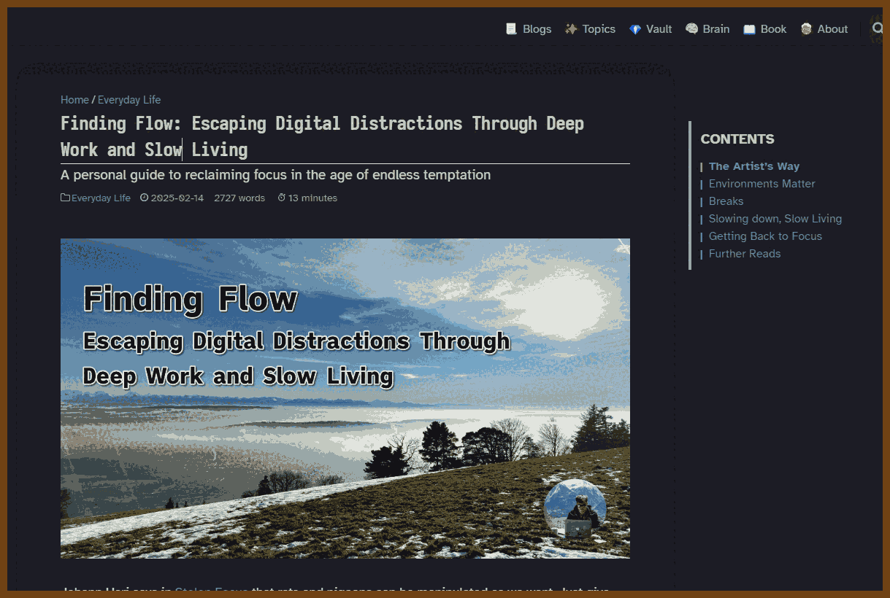
> 

2025-02-17 [The Quest to Understand Metric Movements | by Pinterest Engineering | Pinterest Engineering Blog | Feb, 2025 | Medium](https://medium.com/pinterest-engineering/the-quest-to-understand-metric-movements-8ab12ae97cda) { medium.com }

> %metrics %rootcause %analytics
>
> To understand why key metrics change, Pinterest uses three approaches. The **"Slice and Dice"** method breaks down metrics into segments based on different dimensions like country and device type, allowing us to identify significant segments. This method helps diagnose issues like video metric regressions by organizing segments into a tree structure.
>
> The **"General Similarity"** approach looks for other metrics that move similarly, either in the same or opposite direction, using factors like **Pearson correlation** and **Spearman’s rank correlation**. This method has helped us discover relationships between performance metrics and content distribution, indicating potential causes for latency.
>
> Lastly, the "Experiment Effects" approach leverages A/B testing to see which experiments impact key metrics. By analyzing the treatment effects and filtering out noisy results, we dynamically identify top experiments affecting metrics. These approaches together help us narrow down root causes for metric movements and guide further investigations.
>
> 
> Quotes:
>
> How we are analyzing the metric segments takes inspiration from the [algorithm in Linkedin’s ThirdEye](https://www.linkedin.com/blog/engineering/analytics/analyzing-anomalies-with-thirdeye). We organize the different metric segments into a tree structure, ordered by the dimensions we are using to segmentize the metric. 
>
> - [Pearson correlation](https://en.wikipedia.org/wiki/Pearson_correlation_coefficient): measures the strength of the linear relationship between two time-series
>
> - [Spearman’s rank correlation](https://en.wikipedia.org/wiki/Spearman's_rank_correlation_coefficient): measures the strength of the monotonic relationship (not just linear) between two time-series; in some cases, this is more robust than Pearson’s correlation
>
> - Euclidean similarity: outputs a similarity measure based on inversing the [Euclidean distance ](https://en.wikipedia.org/wiki/Euclidean_distance)between the two (standardized) time-series at each time point
>
> - [Dynamic time warping](https://en.wikipedia.org/wiki/Dynamic_time_warping): while the above three factors measure similarities between two time-series in time windows of the same length (usually the same time window), this supports comparing metrics from time windows of different lengths based on the distance along the path that the two time-series best align
>
>   See also:
>   [Scuba: Diving into Data at Facebook - Meta Research](https://research.facebook.com/publications/scuba-diving-into-data-at-facebook/)
>
>   Scuba: Diving into Data at Facebook [paper pdf](https://15799.courses.cs.cmu.edu/fall2013/static/papers/p767-wiener.pdf)
>
>   > %Scuba %RealTimeAnalytics %InMemoryMonitoring %FacebookInfrastructure %DistributedSystems %PerformanceMonitoring %LogAnalytics %AdHocAnalytics %SystemsAtScale
>
>   > 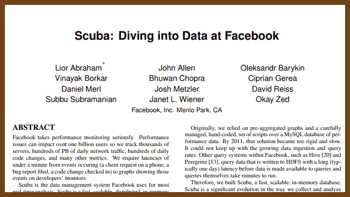
>
>   **Discussion on Scuba**
>
>   1. **Systems @Scale 2019 – Scuba: Real-time Monitoring and Log Analytics at Scale**  
>
>   > "Scuba is Facebook's platform for real-time monitoring and log analytics at scale."  
>   > [View the presentation](https://atscaleconference.com/videos/systems-scale-2019-scuba-real-time-monitoring-and-log-analytics-at-scale/)
>
>   2. **YouTube Video – Scuba: Real-time Monitoring and Log Analytics at Scale**  
>
>   > "Scuba is Facebook's platform for real-time monitoring and log analytics at scale."  
>   > [Watch on YouTube](https://www.youtube.com/watch?v=5XvzuFbKuOc)

2025-02-17 [calculator-app - Chad Nauseam Home](https://chadnauseam.com/coding/random/calculator-app) { chadnauseam.com }

> Creating a calculator app with precise results is challenging because floating point numbers can't represent all numbers accurately. Hans-J. Boehm experimented with various methods like bignums and algebraic equations but had to find a balance between precision and practicality.
>
> Ultimately, Boehm's team realized they only needed to work with numbers expressible through the calculator's operations. They combined rational arithmetic and constructive real numbers, representing numbers as a rational times a real. Using symbolic representations for irrational numbers like π, they achieved accurate results while maintaining usability.
>
> This approach allowed them to develop a calculator app that delivers accurate answers without compromising user experience. Their work highlights the complexity and creativity required to solve seemingly simple problems in software development.
> 

2025-01-25 [Life Lessons from the First Half-Century of My Career – Communications of the ACM](https://cacm.acm.org/opinion/life-lessons-from-the-first-half-century-of-my-career/) { cacm.acm.org }

> I started my career at Hughes Aircraft in 1972 while working on my Ph.D. at the University of California, Los Angeles (UCLA). After designing airborne computers for four years, I graduated and then taught and did systems research at UC Berkeley for the next 40. Since 2016, I’ve helped Google with hardware that accelerates artificial intelligence (AI).
>
> At the end of my technical talks, I often share my life story and what I’ve learned from my half-century in computing. I recently was encouraged to share my reflections with a wider audience, so I’ve captured them here as 16 people-focused and career-focused life lessons.
>
> People-Focused and Career-Focused Life Lessons from David Patterson.
>
> 

| People-Focused                                               |                                                              |
| :----------------------------------------------------------- | :----------------------------------------------------------- |
| **1**. Family first! Don’t sacrifice your family’s happiness on the altar of success. | **2**. Choose happiness.                                     |
| **3**. It’s the people, not the projects, that you value in the long run. | **4**. The cost of praise is small. The value to others is inestimable. |
| **5**. Seek out honest feedback; it might be right.          | **6**. “For better or for worse, benchmarks shape a field.”[16](https://cacm.acm.org/opinion/life-lessons-from-the-first-half-century-of-my-career/#B16) |
| **7**. “I learned that courage was not the absence of fear, but the triumph over it.”[11](https://cacm.acm.org/opinion/life-lessons-from-the-first-half-century-of-my-career/#B11) | **8**. Beware of those who believe they are the smartest people in the room. |
| **Career-Focused**                                           |                                                              |
| **9**. “Most of us spend too much time on what is urgent and not enough time on what is important.”[4](https://cacm.acm.org/opinion/life-lessons-from-the-first-half-century-of-my-career/#B4) | **10**. “Nothing great in the world has ever been accomplished without passion.”[5](https://cacm.acm.org/opinion/life-lessons-from-the-first-half-century-of-my-career/#B5) |
| **11**. “There are no losers on a winning team, and no winners on a losing team.” | **12**. Lead by example.                                     |
| **13**. “Audentes Fortuna iuvat.” (Fortune favors the bold). | **14**. Culture matters.                                     |
| **15**. It’s not how many projects you start; it’s how many you finish. | **16**. Look for the positive opportunities.                 |

2025-02-06 [Software development topics I've changed my mind on after 10 years in the industry - Blogomatano](https://chriskiehl.com/article/thoughts-after-10-years) { chriskiehl.com }

> 
>
> ### Things I've changed my mind on:
>
> Things I now believe, which past me would've squabbled with:
>
> - Simple is not given. It takes constant work
> - There is no pride in managing or understanding complexity
> - Typed languages are essential on teams with mixed experience levels
> - Java is a great language *because* it's boring
> - REPLs are not useful design tools (though, they *are* useful exploratory tools)
> - Most programming should be done long before a single line of code is written
> - Frontend development is a nightmare world of Kafkaesque awfulness I no longer enjoy
> - Elegance is not a real metric
> - Good management is *invaluable*. (I went most of my career before seeing it done well)
> - DynamoDB is a good database (**IFF** your workload lines up with what it's offering)
> - Objects are extremely good at what they're good at. Blind devotion to functional is dumb.
>
> ### Opinions I've picked up along the way
>
> - Engineering is mostly about communication
> - Never go full monad in Java.
> - The query planner is a [cruel mistress](https://chriskiehl.com/article/query-plan-management)
> - If I think something is easy, that's a sure sign I don't understand it.
> - You have to give younger devs room to explore and make mistakes
> - You have to actively invest in improving your soft skills (and investments pay back immediately)
> - Very few abstractions exist in general application development. Just write the code you need
> - Contrarily, library development is *about* abstractions. Spend time hunting for an algebra
> - ORMs are the devil in all languages and all implementations. Just write the damn SQL
> - **The trouble with functional programming is functional programmers** 😄
> - Given a long enough time horizon, you'll deeply regret building on Serverless Functions
> - Types are assertions we make about the world
> - Distributed locking is still really hard for some reason
> - Formal modeling and analysis is an essential skill set
> - Isolation is the most important property of a good integration suite.
> - DynamoDB is the *worst possible choice* for general application development
> - **Most won't care about the craft. Cherish the ones that do, meet the rest where they are**
> - Gradual, dependently typed languages are the future
> - You literally cannot add too many comments to test code (I challenge anyone to try)
>
> ### Things I have *not* changed my opinion on:
>
> - **People who stress over code style, linting rules, or other minutia remain insane weirdos to me. Focus on more important things.**
> - Code coverage has absolutely nothing to do with code quality (in many cases, it's inversely proportional)
> - Monoliths remain pretty good
> - It's very hard to beat decades of RDBMS research and improvements
> - Micro-services require justification (they've increasingly just become *assumed*)
> - Most projects (even inside of AWS!) don't need to "scale" and are damaged by pretending so
> - 93%, *maybe* 95.2%, of project managers, could disappear tomorrow to either no effect or a net gain in efficiency. (this estimate is up from 4 years ago)
>
> We'll see which of these have flipped at year 15.

2025-01-18 [The documentation problem in development | Rowsana](https://rowsana.bearblog.dev/the-documentation-problem/) { rowsana.bearblog.dev }

> 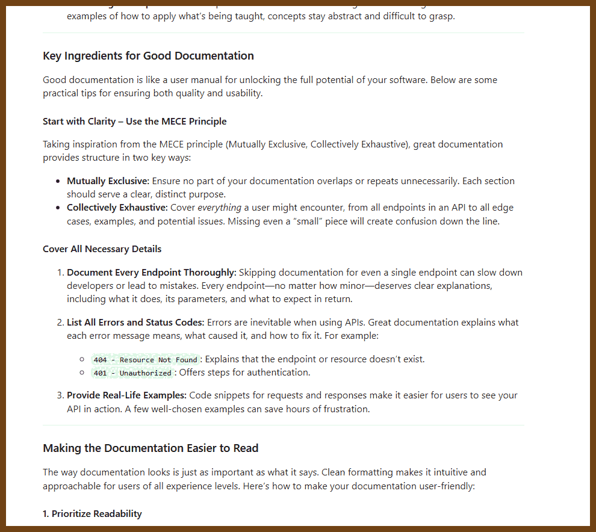

2025-01-18 [Everything I Know About Shipping Code Faster](https://www.developing.dev/p/everything-i-know-about-shipping/) { www.developing.dev }

> Two weeks ago, I shared Evan’s writing on [what helped him grow from Junior to Staff at Meta in 3 years](https://www.developing.dev/p/new-grad-to-staff-at-meta-in-3-years). His entire post hinges on that you need to blaze through your core responsibilities to free up time for growth.
>
> The most common question I got after that post was how do you do that?
>
> I interviewed Evan last week so you can hear the answer in his own words soon (aiming to share that next week). Before that, I wanted to share some thoughts since it’s one of the most important parts of growing your impact. Here’s everything I know about shipping more in less time.
>
> = = = 
>
> 
>
> (Semi-GPT summary) To get more done in less time, you’ve got to nail your **core responsibilities** so you can free up time for **growth**. Start by resolving **ambiguity**. Be **fluent in code search** to navigate big codebases quickly, **know who to ask for help** when you’re stuck, and **learn to query data** yourself instead of waiting on others. These basics will save you hours.
>
> When writing code, **smaller, focused diffs** are the way to go. They’re faster to write, test, and review, with fewer bugs slipping through. To move even quicker, **batch your tests**, use **feature flags** to safely land work in progress, and **copy existing test plans** to save time in unfamiliar code paths. Make **reviews faster** by spoon-feeding **context to reviewers** and **preempting feedback** before submission. Being a **great collaborator** builds trust and gets your code reviewed faster.
>
> **Flow state** is key. Eliminate distractions with **noise-canceling headphones**, **cluster meetings** to maximize focus time, and **work during hours when interruptions are minimal**. Turn off **noisy notifications** and **audit your workflow** for inefficiencies. While waiting on builds or tests, knock out **quick tasks** to keep momentum. Freeing up that extra time lets you tackle **growth opportunities** and build a **career trajectory** like Evan’s.
>
> (found in 2025-01-18 [Everything I Know About Shipping Code Faster](https://programmingdigest.net/newsletters/1802) { programmingdigest.net })

2025-01-16 [Nobody Cares](https://grantslatton.com/nobody-cares) { grantslatton.com }

> At work the junior engineer sends you some code to review. The code was clearly written in a first draft, and then just iteratively patched until the tests passed, then immediately sent to you to review without any further improvement. They do not care.
>
> The guy on the hiking trail is playing his shitty EDM on his bluetooth speaker, ruining nature for everyone else. He does not care.
>
> The doctor misdiagnoses your illness whose symptoms are in the first paragraph of the trivially googleable wikipedia article. He does not care.
>
> People don't pick up after their dogs. The guy at the gym doesn't re-rack the weights. The lady at the grocery store leaves the cart in the middle of the parking lot. They. Do. Not. Care.
>
> 

2025-01-09 [28h Days](https://sidhion.com/blog/28h_days/) { sidhion.com }

> 2025-01-09 [28h Days: year 1 update](https://sidhion.com/blog/28h_days_update_1/) { sidhion.com }
>
> 

2025-01-08 [Laid Off for the First Time In My Career, and Twice In One Year - Dillon Shook](https://dillonshook.com/laid-off/) { dillonshook.com }

> Based on my N=2 experience and the posts I’ve read here are some warning signs to look out for:
>
> - The product org is struggling to set a vision
> - Many distractions and lack of focus
> - Low products usage
> - Perks being cut, cancelled onsite meetings, signs of financial troubles
>
> And last but certainly most telling:
>
> - There’s a “company update” meeting unexpectedly scheduled four hours from now

2024-12-31 [How I got promoted to staff engineer twice | sean goedecke](https://www.seangoedecke.com/staff-engineer-promotions/) { www.seangoedecke.com }

> First, we need to understand why senior-to-staff promotions happen in tech companies. They happen for two reasons:
>
> 1. Company leadership (i.e. your skip-level or above) think a particular engineer is valuable and may leave if not promoted to staff.
> 2. Company leadership want a particular engineer to lead specific cross-org projects that will run smoother if they’ve got the staff role.
>
> Promotions do not happen because a particular engineer is really technically strong and ready for the next level. They do not happen because an engineer has been mentoring a lot and is ticking the boxes on the engineering ladder description. They are a tool for *retaining* or for *empowering* valued engineers. So to be promoted to staff, **you must be known and valued by your organization**.

2024-12-31 [225. Systems Ideas that Sound Good But Almost Never Work—"Let's just…"](https://hardcoresoftware.learningbyshipping.com/p/225-systems-ideas-that-sound-good) { hardcoresoftware.learningbyshipping.com }

> 

> When someone suggests, "let's just," it often leads to complications far beyond what anyone anticipates. For example, making something "pluggable" assumes seamless adaptability through future modules or implementations, but true pluggability requires creating at least two working versions upfront, which is rarely feasible. Similarly, adding APIs to transform a product into a "platform" may sound strategic, but APIs demand constant maintenance, compatibility, and user interest—things that are much harder to deliver than imagined.
>
> Other ideas that rarely work include adding layers of abstraction, synchronizing data, or enabling cross-platform functionality. While abstractions can solve problems, premature ones create unused complexity. Synchronization, especially across unstructured data, is fraught with inconsistencies and bugs. Cross-platform efforts often devolve into building something akin to an operating system, which is far more complex than initially envisioned. Even "escape to native" options—allowing frameworks to access underlying platforms—tend to fail because they create conflicts between the framework's state and the native platform's.
>
> Most of these ideas fail not because they are inherently bad but because they oversimplify the problem and ignore the complexities of implementation, maintenance, and real-world usage. Successful engineering requires solving problems with clear first principles, not leaning on patterns that are more prone to failure than success.

## Fun / Retro

2025-02-18 [dinosaur couch (@dinosaurcouch) • Instagram photos and videos](https://www.instagram.com/dinosaurcouch/) { www.instagram.com }

> 

More Windows 3.11 CSS:

- 2025-02-08 [nielssp/classic-stylesheets: Classic stylesheets for web applications.](https://github.com/nielssp/classic-stylesheets) { github.com }

  > 
  > 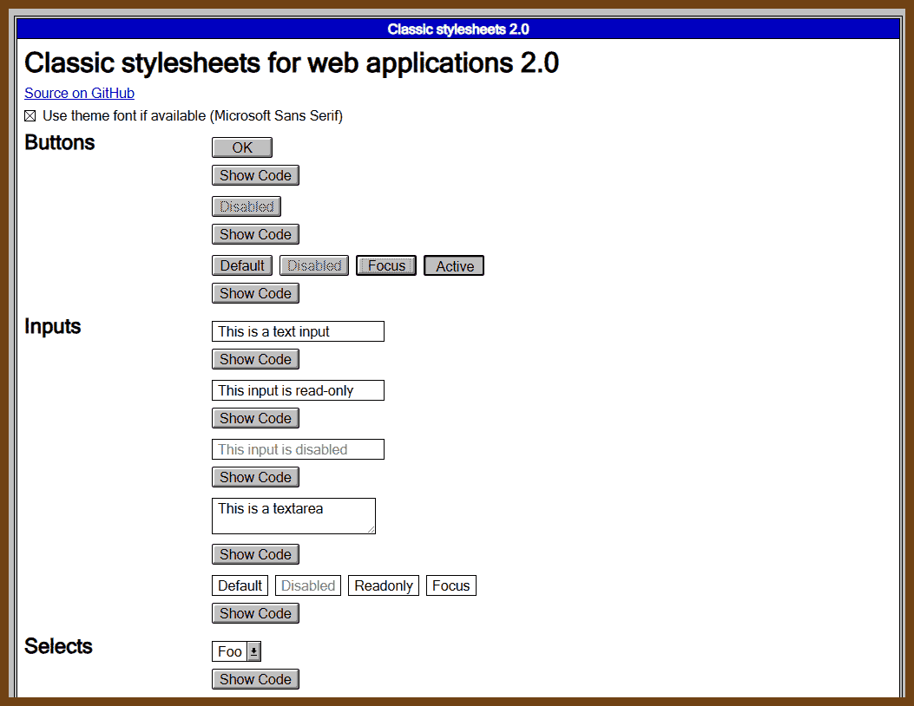

- 2025-02-08 [Windows 3.1](https://karol-kiersnowski.github.io/win31/) {karol-kiersnowski.github.io}

  > 2025-02-08 [GitHub - karol-kiersnowski/win31: Simple simulator of Windows 3.1 (it's just a toy)](https://github.com/karol-kiersnowski/win31) {github.com}
  > 

- 2025-02-08 [GitHub - sleepybuildings/vuedows: A reimplementation of the Windows 3.11 shell in CSS, Typescript and Vue](https://github.com/sleepybuildings/vuedows) {github.com}

  > 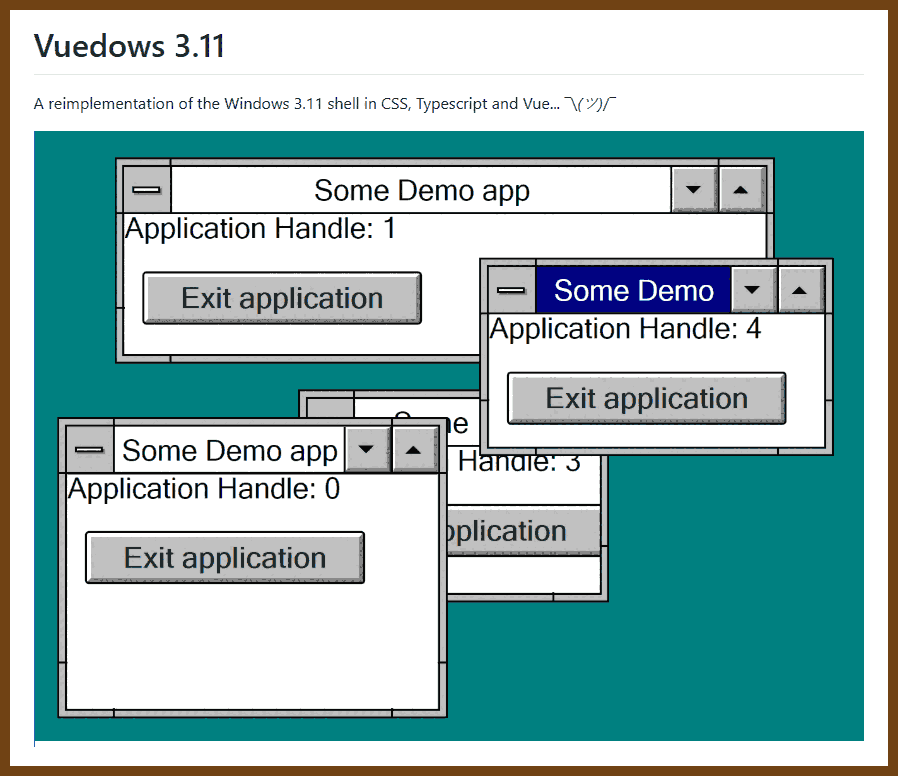

2025-02-06 [A computer can never be held accountable](https://simonwillison.net/2025/Feb/3/a-computer-can-never-be-held-accountable/) { simonwillison.net }

> 

2025-01-25 [cs16.css](https://cs16.samke.me/) { cs16.samke.me }

> CSS library based on Counter Strike 1.6 UI.
>
> 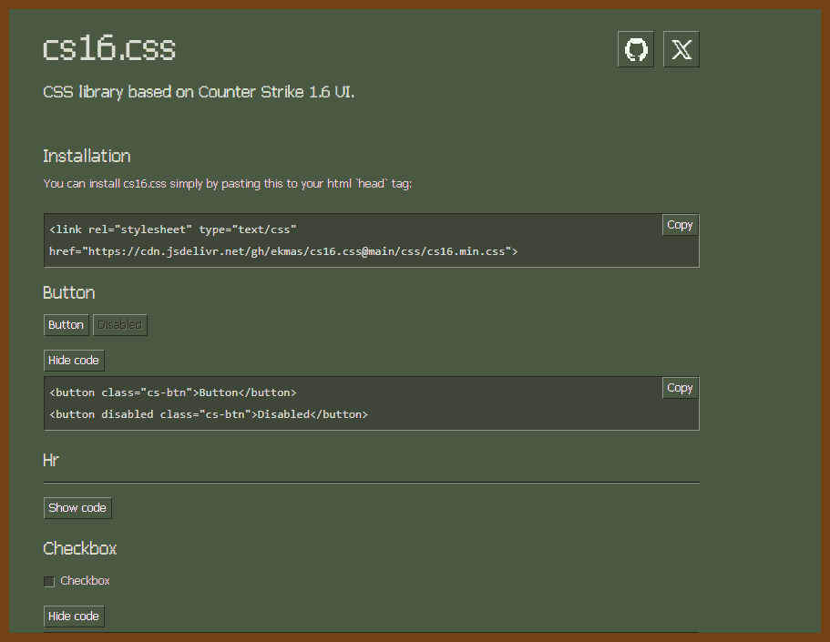

2025-01-07 [Neal.fun](https://neal.fun/) { neal.fun }

> The website Neal.fun is a creative space where Neal shares his projects and games. It's a fun and interactive site with various activities and experiments. 

> 

2025-01-07 [Stimulation Clicker](https://neal.fun/stimulation-clicker/) { neal.fun } Wow!!!

> 

2025-01-02 [ASCII Porn Predates the Internet But It’s Still Everywhere](https://www.vice.com/en/article/ascii-pr0n-porn-predates-the-internet-but-its-still-everywhere-rule-34/) { www.vice.com }

> 

## Inspiration!

2025-02-22 [A system to organise your life • Johnny.Decimal](https://johnnydecimal.com/) { johnnydecimal.com }

> A system to organise your life. 
> **Johnny.Decimal** is designed to help you find things quickly, with more confidence, and less stress.
>
> You assign a unique ID to everything in your life.
>
> A diagram showing the structure of a Johnny.Decimal number. The number is 15.52 and it explains how the '1' is an area, which groups related categories in sets of 10. The '15' is the category, in this case 'travel'. And '52' is just an ID; they start at 01. The title of this, our 52nd travel thing, is 'Trip to NYC'.
> These IDs help you stay organised. They impose constraints that make it harder to get lost. And you create your own index to link everything in your life together.
>
> The system is free to use and the concepts are the same at home, work, or that club you manage.
>
> 

2025-02-22 [Removing Jeff Bezos From My Bed ◆ Truffle Security Co.](https://trufflesecurity.com/blog/removing-jeff-bezos-from-my-bed) { trufflesecurity.com }

> SSH access to the bed!
> What Can They Do with This Access?
>
> Let’s start with the basics: 
>
> - They can know when you sleep
> - They can detect when there are 2 people sleeping in the bed instead of 1
> - They can know when it’s night, and no people are in the bed
>
> Imagine your ex works for Eight Sleep. Or imagine they want to know when you’re not home.
>
> (Of course, they can also change the bed’s temperature, turn on the vibrating feature, turn off your alarm clock, and any of the other normal controls they have power over.)
>
> 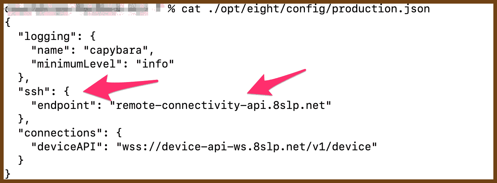

2025-02-11 [Orange Guidance Soapstone](https://leshuguita.github.io/orange%20soapstone/) {leshuguita.github.io}

> 

2025-02-11 [Project Aria FAQ | Project Aria Docs](https://facebookresearch.github.io/projectaria_tools/docs/faq) { facebookresearch.github.io }

> Oh, the quality of documentation!

> 

2025-02-08 [FreeDemandLetter - Get What You Deserve](https://www.freedemandletter.com/) { www.freedemandletter.com }

> 
>
> 

2025-02-08 [Do-nothing scripting: the key to gradual automation – Dan Slimmon](https://blog.danslimmon.com/2019/07/15/do-nothing-scripting-the-key-to-gradual-automation/) { blog.danslimmon.com }

> 
> At first glance, it might not be obvious that this script provides value. Maybe it looks like all we’ve done is make the instructions harder to read. But the value of a do-nothing script is immense:
>
> - It’s now much less likely that you’ll lose your place and skip a step. This makes it easier to maintain focus and power through the slog.
> - Each step of the procedure is now encapsulated in a function, which makes it possible to replace the text in any given step with code that performs the action automatically.
> - Over time, you’ll develop a library of useful steps, which will make future automation tasks more efficient.
>
> A do-nothing script doesn’t save your team any manual effort. It lowers the activation energy for automating tasks, which allows the team to eliminate toil over time.
>
> Suggestions from 2025-02-08 [Do-nothing scripting: the key to gradual automation (2019) | Hacker News](https://news.ycombinator.com/item?id=42976698) { news.ycombinator.com }
>
> > 

2025-02-07 [jsontr.ee: Visualize JSON Structures as Dynamic SVG Diagrams](https://javascriptweekly.com/link/165148/ccd9409267) 

>  You can try it out on [this playground](https://javascriptweekly.com/link/165149/ccd9409267), which provides the option to download the diagram as PNG, or use it in an app with customizable styles.
>  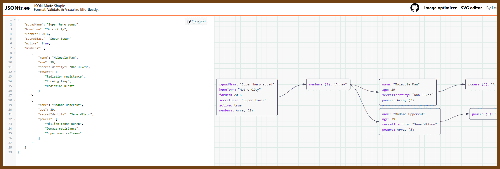
>
>  (🟠 Found in JavaScript Weekly:  [JavaScript Weekly Issue 721: January 31, 2025](https://javascriptweekly.com/issues/721) { javascriptweekly.com })

2025-01-31 [mathesar-foundation/mathesar: An intuitive spreadsheet-like interface that lets users of all technical skill levels view, edit, query, and collaborate on Postgres data directly—100% open source and self hosted, with native Postgres access control.](https://github.com/mathesar-foundation/mathesar) { github.com }

> Intuitive spreadsheet-like interface that lets users of all technical skill levels view, edit, query, and collaborate on Postgres data directly—self hosted, with native Postgres access control.
>
> 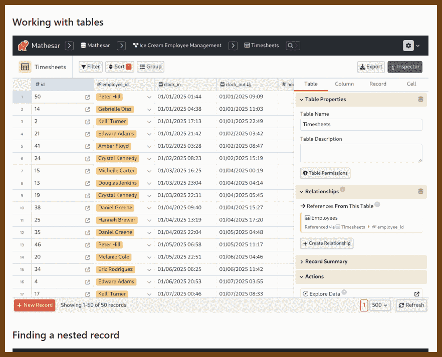

2025-01-27 [Simple Search - Just a list of search bars](https://simplesearch.info/) { simplesearch.info }

> 

2025-01-27 [Compare Search Engines - Gnod Search](https://www.gnod.com/search/) { www.gnod.com }

> 

2025-01-27 [YC Graveyard](https://ycgraveyard.iamwillwang.com/) { ycgraveyard.iamwillwang.com }

> YC Graveyard: 821 inactive Y Combinator startups
>
> 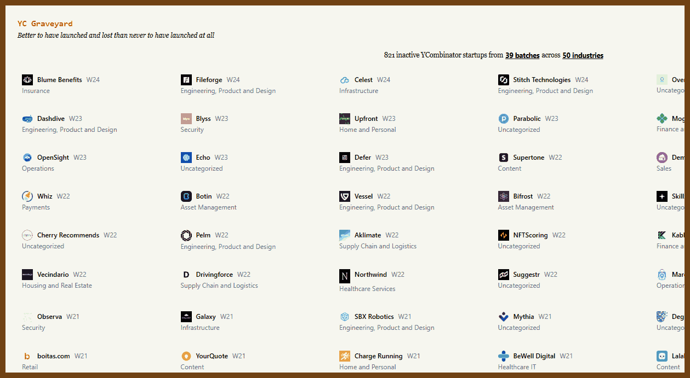

2025-01-26 [SQLook - SQLite Database Viewer and Generator](https://sqlook.com/) { sqlook.com }

> And so... they changed UI to a more modern Bootstrap version... oh... 
> SQLook – A free online SQLite database manager with a Windows 2000 interface 

> 
> 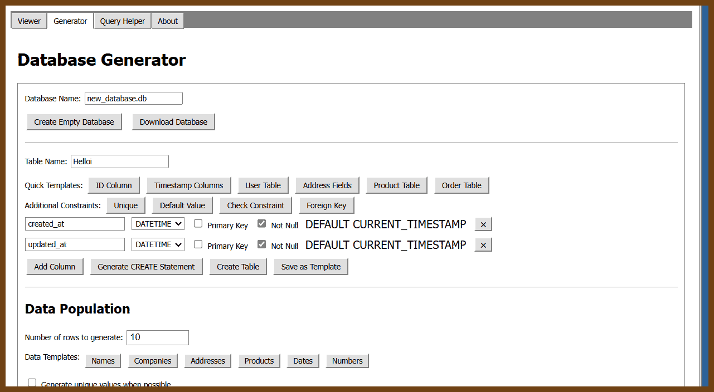

2025-01-25 [synth-inc/onit: Onit MacOS client](https://github.com/synth-inc/onit) { github.com }

> 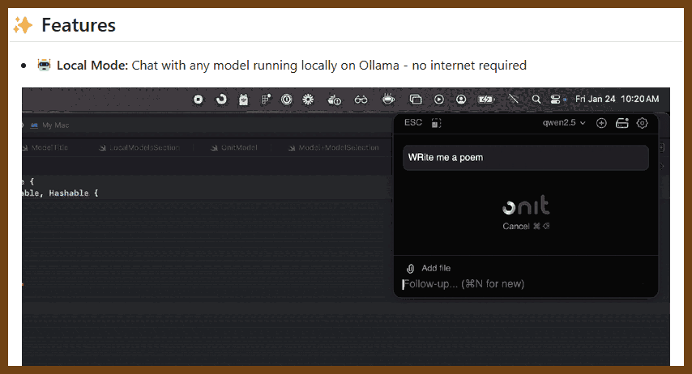
>
> We are building Onit based on these core beliefs:
>
> 1. **Universal Access:** AI assistants should be accessible from anywhere on your computer, not just in browsers or specific apps.
> 2. **Provider Freedom:** Users should have the choice between models and model providers (Anthropic, OpenAI, xAI, etc.) and not be locked into a single provider.
> 3. **Local First:** AI is *much* more useful with access to your data. But that doesn't count for much if you have to upload personal files to an untrusted server first. Onit will always provide options for local processing. No personal data will leave your computer without explicit approval.
> 4. **Customizability:** Onit is your assistant. You should be able to configure it to your liking.
> 5. **Extensibility:** Onit should allow the community to build and share extensions, making it more useful for everyone.

2025-01-23 [Master the Art of the Product Manager 'No'](https://letsnotdothat.com/) { letsnotdothat.com }

> Master the Art of the Product Manager "No"
>
> 
>
> See also: 
> 2025-01-23 [How to professionally say?  The Complete Guide 2024 ](https://www.corporatereplies.com/blog/corporate-communication/how-to-professionally-say-the-complete-guide-2024) { www.corporatereplies.com }
>
> > **Just shut up!**
> >
> > I kindly request that you allow me to finish my thoughts. This will enable a smoother flow of conversation and ensure that all points are thoroughly addressed. Thank you for your understanding.
> >
> > **Why are you so useless?**
> >
> > (This one’s obviously sarcastic, but if you do use it, tag us on social media @corporatereplies 😂; We’re on Instagram and TikTok and we’d love to see the reaction.)
>
> > I am observing that your current performance is not meeting the expected standards. Could you please elaborate on the challenges you are facing to assist in finding potential solutions?
>
> 2025-01-23 [AkashRajpurohit/howtoprofessionallysay: 📖 A guide for your daily "professional" interactions](https://github.com/AkashRajpurohit/howtoprofessionallysay) { github.com }
>
> > 2025-01-23 [How to professionally say](https://howtoprofessionallysay.akashrajpurohit.com/) { howtoprofessionallysay.akashrajpurohit.com }
> >
> > How to professionally say
> > A guide for your daily "professional" interactions
> > 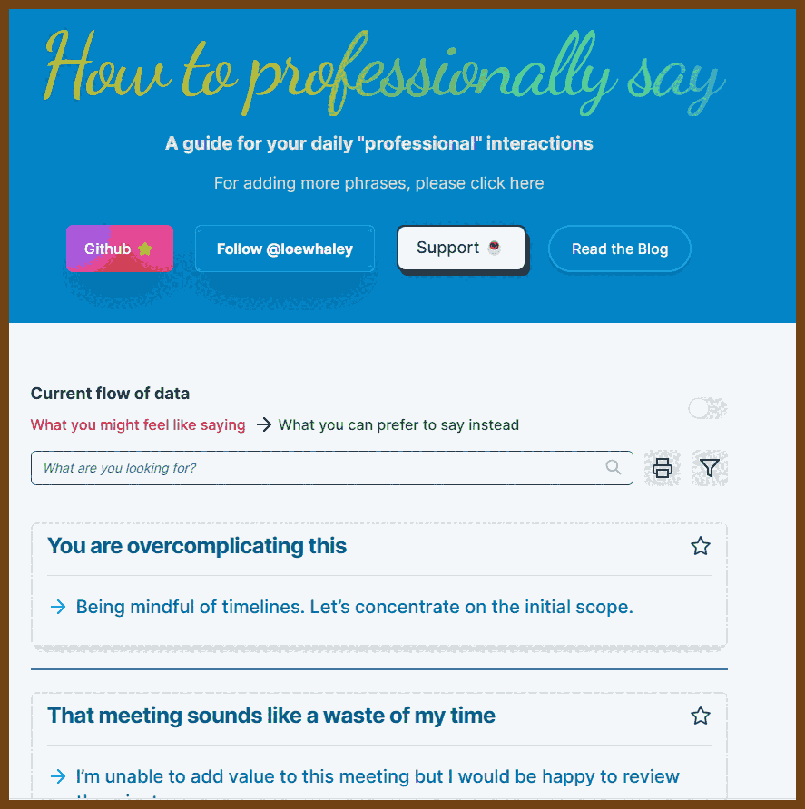

2025-01-23 [itamarom/notepadjs](https://github.com/itamarom/notepadjs) { github.com }

> https://itamarom.github.io/notepadjs/
>
> A cross-platform love letter to Notepad
> (+) PWA
>
> 

2025-01-19 [jjcm/llmpeg: Uses an llm to generate ffmpeg commands](https://github.com/jjcm/llmpeg) { github.com }

> Allows for simple usage of ffmpeg via an llm. BASH 
>
> > You write ffmpeg commands based on the description from the user. You should only respond with a command line command for ffmpeg, never any additional text. All responses should be a single line without any line breaks.
>
> 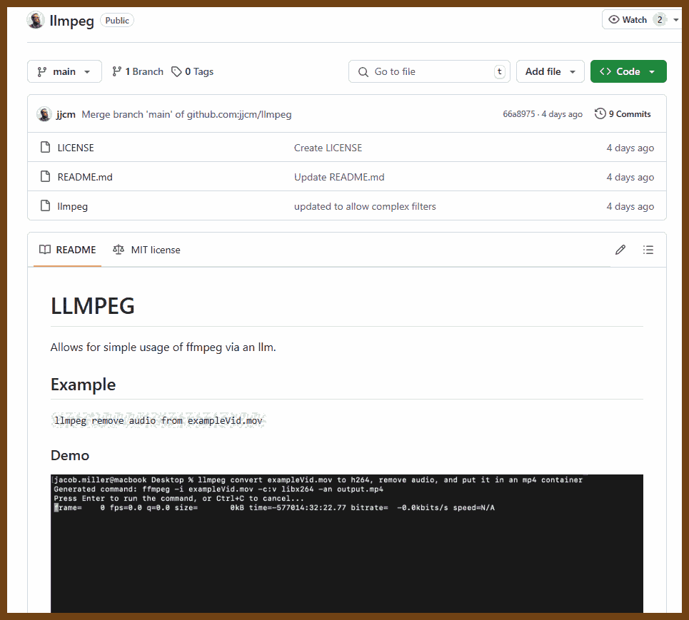

2025-01-16 [FFmpeg By Example](https://ffmpegbyexample.com/) { ffmpegbyexample.com }

> 

2025-01-15 [jesseduffield/lazygit: simple terminal UI for git commands](https://github.com/jesseduffield/lazygit) { github.com }

> Elevator Pitch
>
> Rant time: You've heard it before, git is *powerful*, but what good is that power when everything is so damn hard to do? Interactive rebasing requires you to edit a goddamn TODO file in your editor? *Are you kidding me?* To stage part of a file you need to use a command line program to step through each hunk and if a hunk can't be split down any further but contains code you don't want to stage, you have to edit an arcane patch file *by hand*? *Are you KIDDING me?!* Sometimes you get asked to stash your changes when switching branches only to realise that after you switch and unstash that there weren't even any conflicts and it would have been fine to just checkout the branch directly? *YOU HAVE GOT TO BE KIDDING ME!*
>
> If you're a mere mortal like me and you're tired of hearing how powerful git is when in your daily life it's a powerful pain in your ass, lazygit might be for you.

> 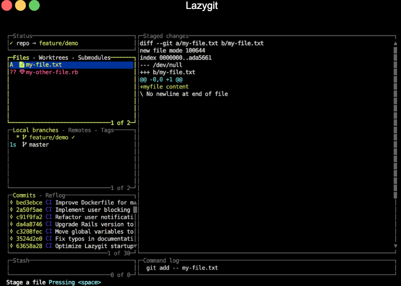

2025-01-10 [I’ve acquired a new superpower – Daniel Wirtz](https://danielwirtz.com/blog/spot-the-difference-superpower) { danielwirtz.com }

> 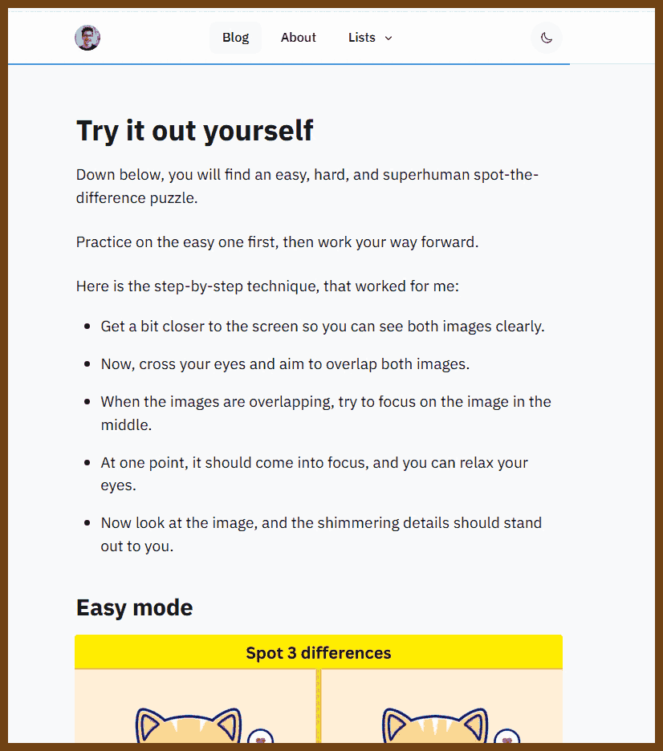

2025-01-08 [Fontjoy - Generate font pairings in one click](https://fontjoy.com/) { fontjoy.com }

> 
> The goal of font pairing is to select fonts that share an overarching theme yet have a pleasing contrast. Which fonts work together is largely a matter of intuition, but we approach this problem with a neural net. See GitHub for more technical details.

2025-01-05 [Self-driving 1993 Volvo 940 (part 1: actuators) – PracticApp – Hardware / Software Engineering](https://practicapp.com/carbagepilot-part1/) { practicapp.com }

> Together with some friends, I decided earlier this year to particpate in the [Carbage run 2025 Winter edition](https://www.carbagerun.nl/event/winter-editie-2025-naar-helsinki/). This is a 6-day journey in winter all the way through Sweden to the polar circle, and back down to Helsinki in a group of roughly 400 cars.
>
> One small catch (you might have guessed it from the name): your car has to be “carbage”. In practice, this means it needs to be at least 20 years old, and with a day value of less than €1000.
>
> 

2025-01-02 [lighting-ai/web-piano: This project is a playable piano keyboard developed using Bolt.DIY + DeepSeekV3. It supports both mouse clicks and keyboard input, with a MacBook-style touchbar for visual feedback.](https://github.com/lighting-ai/web-piano) { github.com }

>  ➡️ 2025-01-02 [stackblitz-labs/bolt.diy: Prompt, run, edit, and deploy full-stack web applications using any LLM you want!](https://github.com/stackblitz-labs/bolt.diy) { github.com }
>
>  ➡️ 2025-01-02 [deepseek-ai/DeepSeek-Coder: DeepSeek Coder: Let the Code Write Itself](https://github.com/deepseek-ai/DeepSeek-Coder) { github.com }

2025-01-02 [API Parrot](https://apiparrot.com/) { apiparrot.com }

> API Parrot is the tool specifically designed to reverse engineer the HTTP APIs of any website. Making life easier for developers looking to automate, integrate or scrape websites without public APIs.
>
> 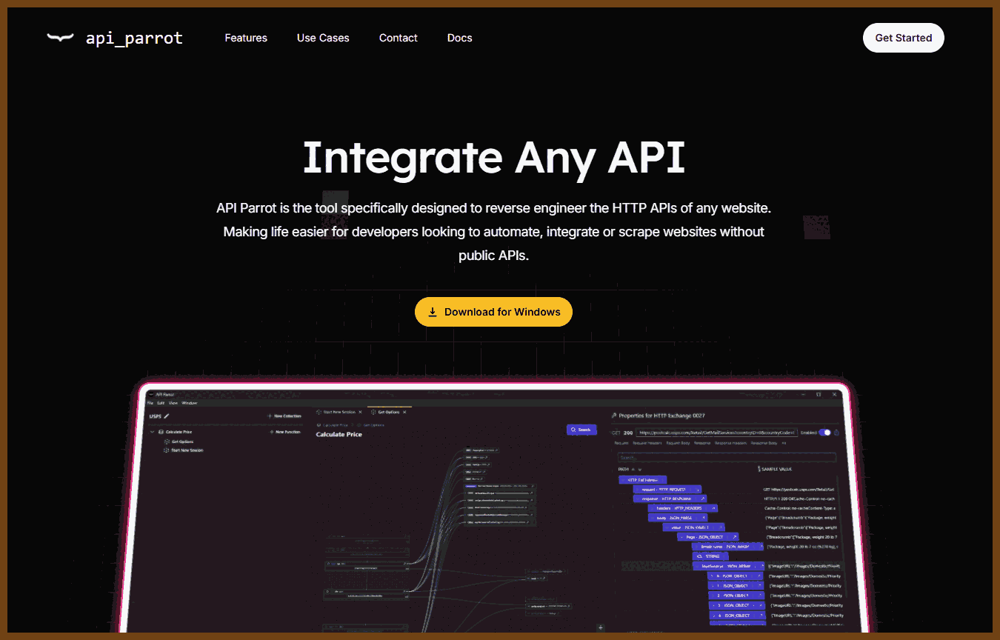

## 👂 The Ear of AI

2025-02-20 [Animate Anyone 2](https://humanaigc.github.io/animate-anyone-2/) { humanaigc.github.io }

> 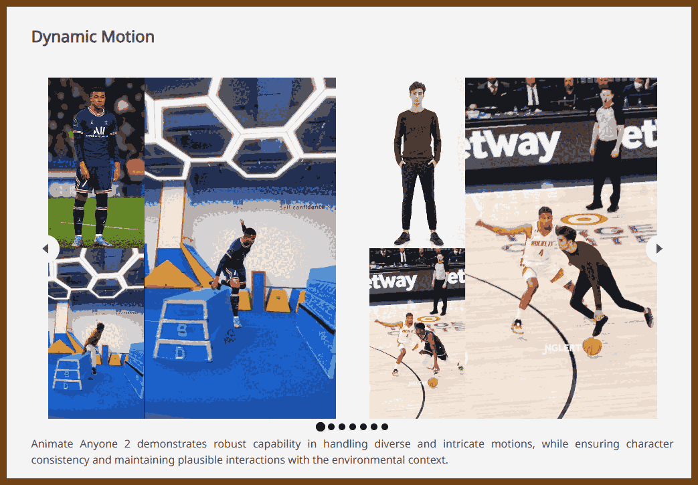

2025-02-20 [Accelerating scientific breakthroughs with an AI co-scientist](https://research.google/blog/accelerating-scientific-breakthroughs-with-an-ai-co-scientist/) { research.google }

> 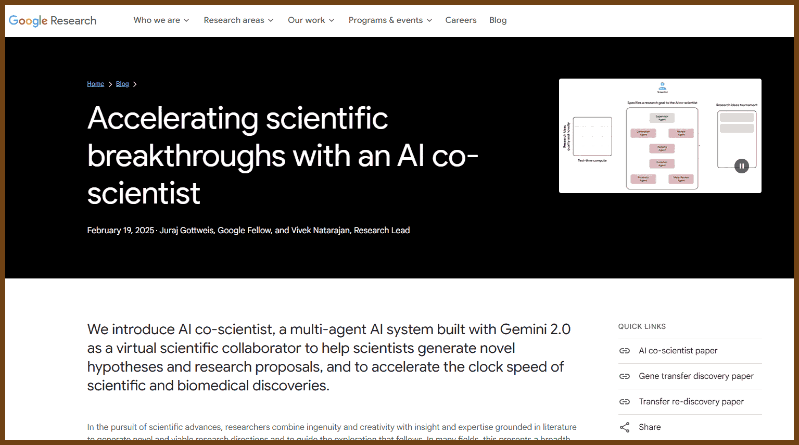

2025-02-11 [Tech's Dumbest Mistake: Why Firing Programmers for AI Will Destroy Everything](https://defragzone.substack.com/p/techs-dumbest-mistake-why-firing) { defragzone.substack.com }

> [Firing programmers for AI is a mistake | Hacker News](https://news.ycombinator.com/item?id=43010814) { news.ycombinator.com }
>
> The next generation of programmers will grow up expecting AI to do the hard parts for them. They won’t know why an algorithm is slow, they won’t be able to debug cryptic race conditions (provided they are familiar with the concept), and they certainly won’t know how to build resilient systems that survive real-world chaos.
>
> The result? We’ll have a whole wave of programmers who are more like AI operators than real engineers. And when companies realize AI isn't magic, being just a bunch of tokenized words in line (prove me wrong on that), they'll scramble to find actual programmers who know what they're doing. Too bad they spent years not hiring them.

2025-02-07 [Understanding Reasoning LLMs - by Sebastian Raschka, PhD](https://magazine.sebastianraschka.com/p/understanding-reasoning-llms) { magazine.sebastianraschka.com }

> 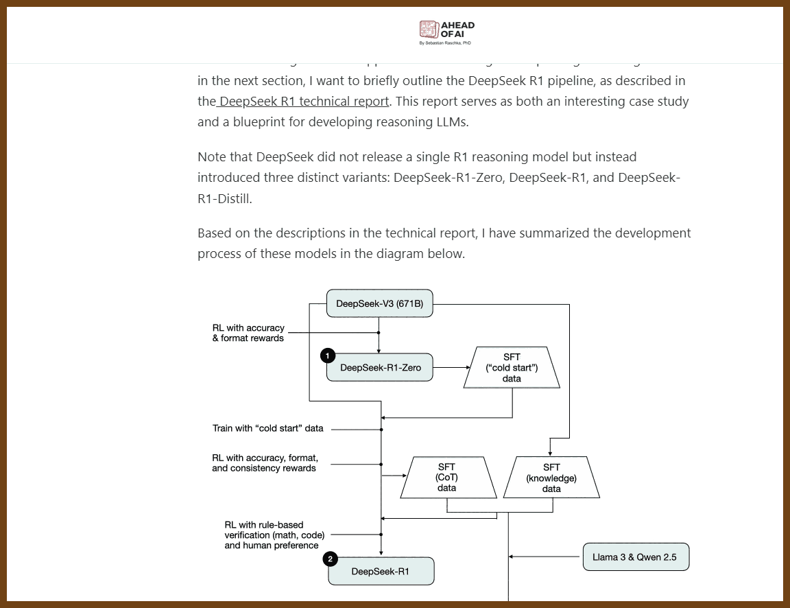

2025-01-31 [Jailbreaking DeepSeek R1 - Prompt Injection Using Charcodes](https://substack.com/home/post/p-156004330) { substack.com }

> Bypass DeepSeek censorship by speaking in hex

2025-01-29 [DeepSeek's Multi-Head Latent Attention and Other KV Cache Tricks | PySpur](https://www.pyspur.dev/blog/multi-head-latent-attention-kv-cache-paper-list) { www.pyspur.dev }

> 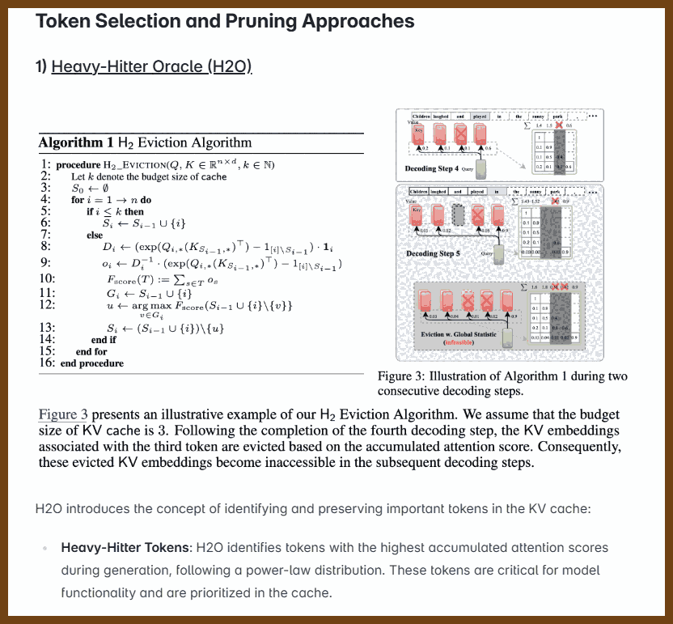

2025-01-29 [How has DeepSeek improved the Transformer architecture? | Epoch AI](https://epoch.ai/gradient-updates/how-has-deepseek-improved-the-transformer-architecture) { epoch.ai }

> 

2025-01-28 [17-445 Machine Learning in Production / AI Engineering](https://mlip-cmu.github.io/s2025/) { mlip-cmu.github.io }

> * 2025-01-28 [Syllabus | Large Language Model Systems](https://llmsystem.github.io/llmsystem2024spring/docs/Syllabus/) { llmsystem.github.io }

> 

2025-01-21 [AI Model & API Providers Analysis | Artificial Analysis](https://artificialanalysis.ai/) { artificialanalysis.ai }

> Independent analysis of AI models and API providers
> Understand the AI landscape to choose the best model and provider for your use-case
>
> 

2025-01-18 [Don't use cosine similarity carelessly](https://p.migdal.pl/blog/2025/01/dont-use-cosine-similarity/) { p.migdal.pl }

> 

2025-01-17 [📚 Convert E-books into audiobooks with Kokoro - Claudio Santini](https://claudio.uk/posts/epub-to-audiobook.html) { claudio.uk }

> 

2025-01-13 [The 2025 AI Engineering Reading List - Latent Space](https://www.latent.space/p/2025-papers) { www.latent.space }

> 

2025-01-06 [Killed by LLM](https://r0bk.github.io/killedbyllm/) { r0bk.github.io }

> 

2024-12-31 [Things we learned about LLMs in 2024](https://simonwillison.net/2024/Dec/31/llms-in-2024/) { simonwillison.net }

> In 2024, the field of Large Language Models (LLMs) saw significant advancements. The GPT-4 barrier was broken, with 18 organizations now having models that outperform the original GPT-4. Notably, Google's Gemini 1.5 Pro introduced new capabilities like a 2 million token input context length and video input. Additionally, LLM prices dropped dramatically due to increased competition and efficiency, making these models more accessible.
>
> Multimodal vision became common, with models now handling images, audio, and video. Voice and live camera modes also emerged, allowing real-time interaction with LLMs. Despite these advancements, the concept of "agents"—LLMs acting autonomously—has not yet fully materialized. The environmental impact of LLMs improved due to efficiency gains, but the large-scale infrastructure buildout by tech giants remains a concern.
>
> Overall, 2024 was marked by rapid progress in LLM capabilities, reduced costs, and the rise of multimodal and real-time interaction features. However, challenges like the environmental impact and the practical implementation of autonomous agents still need to be addressed.

2025-01-04 [Can LLMs write better code if you keep asking them to “write better code”? | Max Woolf's Blog](https://minimaxir.com/2025/01/write-better-code/) { minimaxir.com }

> This article investigates whether large language models (LLMs) like Claude 3.5 Sonnet or GPT can iteratively improve code when asked to "make it better." Using a Python coding problem as a test, the author demonstrates that LLMs can optimize performance over iterations, improving speed and efficiency. However, vague prompts often lead to overengineering, such as unnecessary "enterprise-level features," without clear benefits. Despite these issues, iterative prompting can yield faster, more efficient code.
>
> With explicit instructions, the LLM delivered substantial improvements, including using tools like Numba for just-in-time compilation and NumPy for vectorization. These optimizations resulted in code that was up to 100x faster than the initial implementation. The LLM also introduced creative techniques like precomputing digit sums and leveraging parallel processing. However, issues like hallucinated logic, subtle bugs, and redundant complexity showed that human oversight is essential to validate and refine the results.
>
> The findings highlight the potential and limitations of using LLMs for coding. While they can provide significant speed-ups and novel ideas, they often miss important optimizations, such as deduplication or statistical shortcuts. The article emphasizes that LLMs are valuable tools for accelerating development when used thoughtfully but require careful guidance and validation from skilled developers to produce effective, reliable results.

2025-01-05 [What we learned copying all the best code assistants](https://blog.val.town/blog/fast-follow/) { blog.val.town }

> Since the beginning of Val Town, our users have been clamouring for the state-of-the-art LLM code generation experience. When we launched our code hosting service in 2022, the state-of-the-art was GitHub Copilot. But soon it was ChatGPT, then Claude Artifacts, and now Bolt, Cursor, and Windsurf. We’ve been trying our best to keep up. Looking back over 2024, our efforts have mostly been a series of fast-follows, copying the innovation of others. Some have been successful, and others false-starts. This article is a historical account of our efforts, giving credit where it is due.

## Research 🤖 LLM vs 🧠 Brain: Cognitive Impact

2025-02-04 [I Taught for Most of My Career. I Quit Because of ChatGPT | TIME](https://time.com/7026050/chatgpt-quit-teaching-ai-essay/) { time.com }

> Virtually all experienced scholars know that writing, as historian [Lynn Hunt](https://www.historians.org/perspectives-article/how-writing-leads-to-thinking-february-2010/) has argued, is “not the transcription of thoughts already consciously present in [the writer’s] mind.” Rather, writing is a process closely tied to thinking. In graduate school, I spent months trying to fit pieces of my dissertation together in my mind and eventually found **I could solve the puzzle only through writing**. Writing is hard work. It is sometimes frightening. With the easy temptation of AI, many—possibly most—of my students were no longer willing to push through discomfort.
>
>
> Generative AI is, in some ways, a democratizing tool. Many of my students were non-native speakers of English. Their writing frequently contained grammatical errors. Generative AI is effective at correcting grammar. However, the technology **often changes vocabulary and alters meaning even when the only prompt is “fix the grammar.”** My students lacked the skills to identify and correct subtle shifts in meaning. I could not convince them of the need for stylistic consistency or the need to develop voices as research writers.
>
> I pointed to weaknesses such as stylistic quirks that I knew to be common to ChatGPT (**I noticed a sudden surge of phrases such as “delves into”**). That is, I found myself spending more time giving feedback to AI than to my students.
>
> 

2025-02-04 [(PDF) Investigating How Frequent Interactions with AI Technologies Impact Cognitive and Emotional Processes](https://www.researchgate.net/publication/384458671_Investigating_How_Frequent_Interactions_with_AI_Technologies_Impact_Cognitive_and_Emotional_Processes) { www.researchgate.net }

> Of course I did not read the original article and asked ChatGPT to create a digest
>
> **AI is Making Us Smarter**
>
> The study found that **frequent AI users experience measurable cognitive improvements**.
>
> 📌 **Short-term memory improvement:**
>
> - **Correlation coefficient:** **r = 0.663 (p < 0.01)** → Strong positive correlation.
> - **Conclusion:** People who use AI frequently recall information **faster and more accurately**.
>
> 📌 **Better decision-making:**
>
> - **Correlation coefficient:** **r = 0.572 (p < 0.01)** → Significant improvement.
> - **How was this tested?** Participants completed **decision-making tasks** before and after AI use.
> - **Results:** AI-assisted users had a higher accuracy rate in complex decision-making.
>
> 🚀 **Key takeaway:** AI is acting as a cognitive amplifier, allowing us to **process and retain information more efficiently**.
>
> But… it’s not all good news.
>
> **The Dark Side: AI is Increasing Stress and Anxiety**
>
> While AI improves cognitive performance, the study also found a **moderate positive correlation (r = 0.468, p < 0.01)** between **frequent AI use and increased mental stress**.
>
> 📌 **Evidence from self-reported stress levels:**
>
> - Participants completed **anxiety and stress assessments** before and after AI interactions.
> - **Results:** Frequent AI users reported **higher stress scores** after prolonged AI use.
>
> 📌 **Cognitive overload is real:**
>
> - AI bombards users with continuous information, leading to **mental fatigue**.
> - **Example from interviews:** Users described feeling "overwhelmed" and "mentally exhausted" after extensive AI interaction.
>
> 🤯 **Key takeaway:** AI might make tasks easier, but it also **increases cognitive pressure and emotional strain**.
>
> **The Hidden Risk: Psychological Dependence on AI**
>
> One of the most alarming findings was the development of **AI dependency**.
>
> 📌 **Psychological reliance on AI:**
>
> - **Regression analysis** confirmed that **frequent AI users are more likely to doubt their own judgment**.
> - **Standardized Coefficient (Beta) = 0.421, p = 0.000** → A **strong predictor** of AI-induced dependency.
>
> 📌 **Real-world impact:**
>
> - Users who rely on AI for problem-solving report **difficulty making decisions without AI assistance**.
> - **Example from interviews:** Some participants said they "don’t trust their answers without double-checking with AI."
>
> 🔍 **Key takeaway:** AI is replacing independent thinking, **reducing cognitive autonomy**, and making users **second-guess themselves**.
>
> **5. The Solution: How We Can Use AI Without Losing Ourselves**
>
> So, what’s the way forward? The study suggests **three key strategies** to balance AI’s cognitive benefits with emotional well-being:
>
> ✔️ **AI should assist, not replace thinking** → We must stay in control of our decisions.
> ✔️ **Regulate AI’s role in decision-making** → Avoid relying on AI for **every** task.
> ✔️ **AI should be designed for cognitive balance** → Not just efficiency, but emotional well-being too.
>
> 🎯 **Final Thought:** AI has the potential to **elevate our intelligence** or **erode our independence**.
>
> The question is: **Will we use AI as a tool to enhance our minds—or let it become the master of our decisions?**
>
> **The future is in our hands.**

> ---
>
> *For the record (gpt-4o):* 
>
> 1. I've asked GPT summarize the article like a friend researcher would do. The result was bad. 
> 2. The I've asked to write in a conversation style between two friends... the result was "**Me:** Bro, this paper is wild. It’s basically saying that using AI all the time makes us smarter… but also kinda messes with our emotions."
> 3. "Make the TED-style presentation, where the people share their opinions" -- led to good initial structure with emojis, which I like! 
>    1. "Add evidence for each point"   -- finalized the result, not bad, I wonder if the numbers and conclusions are correct. 

2025-02-22 [Microsoft Study Finds Relying on AI Kills Your Critical Thinking Skills](https://gizmodo.com/microsoft-study-finds-relying-on-ai-kills-your-critical-thinking-skills-2000561788) { gizmodo.com }

> A [new study](https://www.microsoft.com/en-us/research/uploads/prod/2025/01/lee_2025_ai_critical_thinking_survey.pdf) published by researchers at Microsoft and Carnegie Mellon University found that the more humans lean on AI tools to complete their tasks, the less critical thinking they do, making it more difficult to call upon the skills when they are needed.
>
> The researchers tapped 319 knowledge workers—a person whose job involves handling data or information—and asked them to self-report details of how they use generative AI tools in the workplace. The participants were asked to report tasks that they were asked to do, how they used AI tools to complete them, how confident they were in the AI’s ability to do the task, their ability to evaluate that output, and how confident they were in their own ability to complete the same task without any AI assistance.
>
> 

