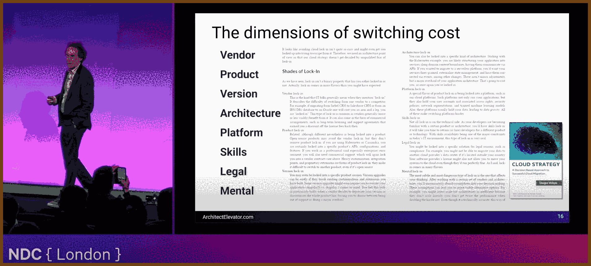
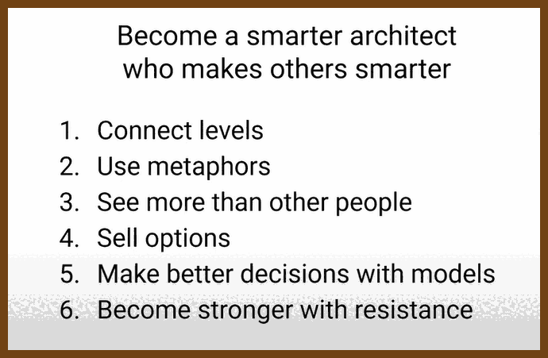
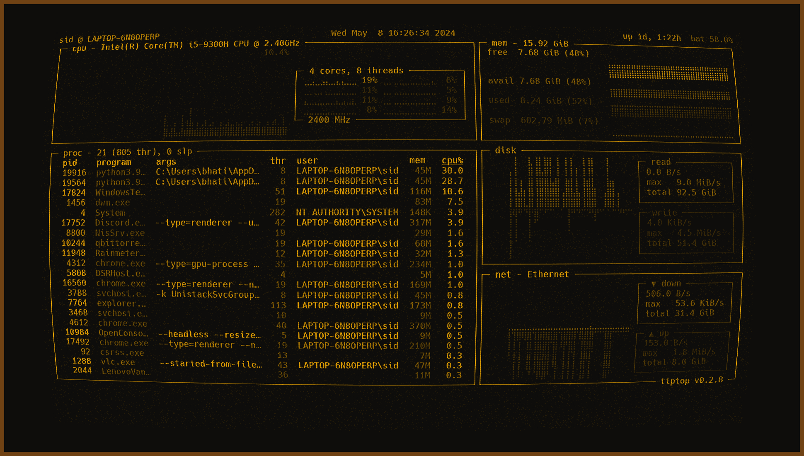
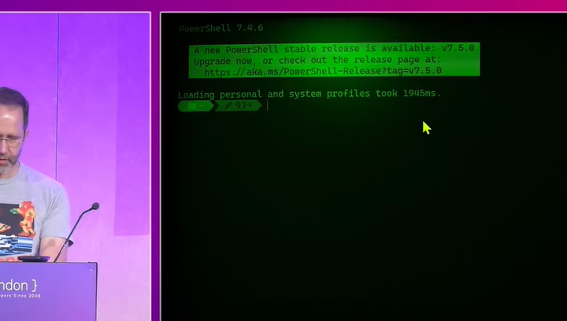
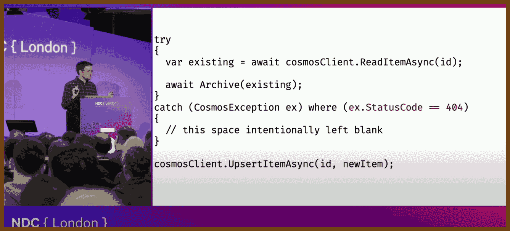
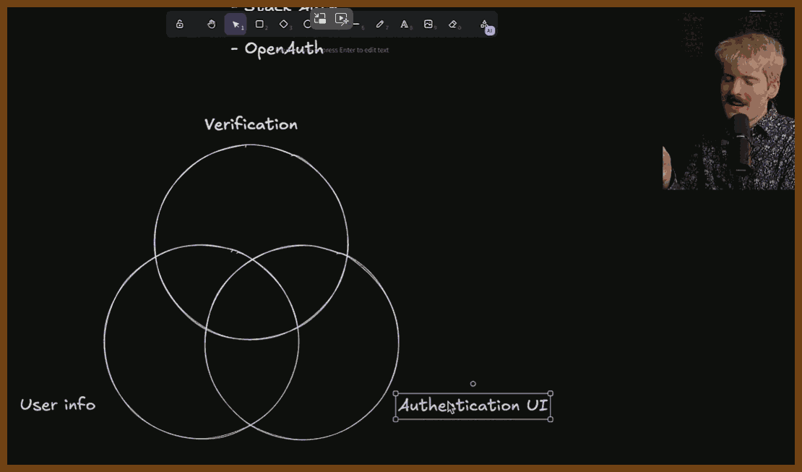
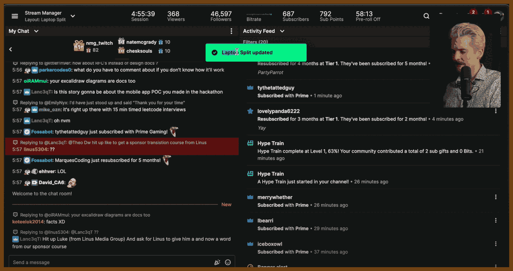
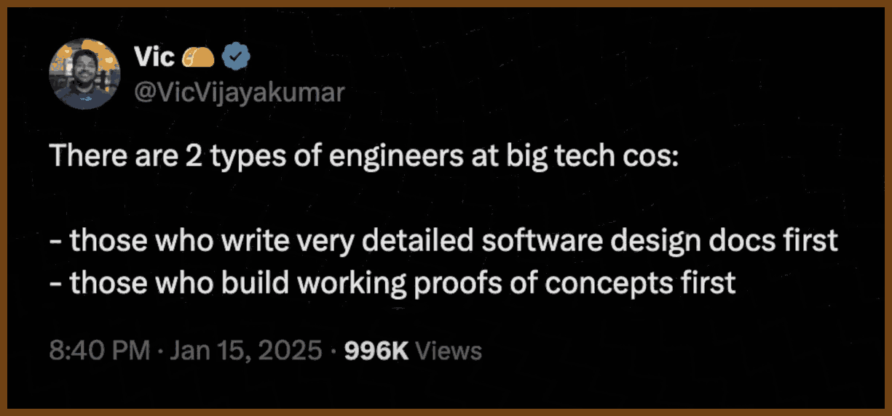

---
layout: post
title:  "Links from my inbox 2025-03-09"
date:   2025-03-09T17:26:00-07:00
categories: links
---


## ⌚ Nice watch!

2025-03-09 [Thinking Like an Architect - Gregor Hohpe - NDC London 2025 - YouTube](https://www.youtube.com/watch?v=xtxfrxf0mfE) { www.youtube.com }

> 
>
> 
>
> 
>
> 
>
> (gpt o3-mini summary)
>
> THINKING LIKE AN ARCHITECT: ESSENTIAL LESSONS FROM GREGOR HOHPE
>
> **See the Whole Picture**
>  Gregor Hohpe urges us to step back from the minutiae and view the entire system. By focusing on the interactions and evolution of components, we can make design choices that serve long-term business goals rather than just immediate fixes.
>
> **Embrace Key Architectural Principles**
>
> - Modularity: Divide complex systems into smaller, independent parts for easier development and maintenance.
> - Abstraction: Simplify complexity by hiding the details that aren’t crucial to the current discussion.
> - Separation of Concerns: Keep different responsibilities distinct to reduce unwanted dependencies and improve clarity.
>
> **Balance Trade-Offs and Make Informed Decisions**
>  Every design choice involves trade-offs between performance, cost, complexity, and flexibility. Hohpe reminds us that there’s rarely a perfect solution—only the best balance for the situation at hand. Thoughtful evaluation prevents technical debt and supports future growth.
>
> **Communicate Clearly and Document Thoughtfully**
>  Great architecture emerges from collaboration. Transparent documentation of decisions, assumptions, and rationales keeps technical teams and business stakeholders aligned, paving the way for smooth implementation and ongoing improvement.
>
> **Learn from Real-World Examples**
>  Through practical case studies, Hohpe illustrates how sound architectural thinking addresses real challenges. These examples demonstrate that adaptability and creative problem-solving are crucial when systems evolve or requirements change unexpectedly.
>
> **Lead with Vision and Foster Continuous Improvement**
>  An effective architect does more than design systems—they act as a bridge between technology and business. By encouraging a culture of continuous learning and collaboration, architects inspire teams to innovate and adapt in a rapidly changing environment.
>
> **Final Thoughts**
>  "Thinking Like an Architect" is a call to adopt a strategic, big-picture approach. Whether you’re designing systems or part of a technical team, the key is to:
>
> - Look beyond immediate challenges and consider future impacts.
> - Communicate openly to ensure all stakeholders are on the same page.
> - Continuously adapt and refine your approach to stay ahead of evolving requirements.
>
> These insights empower you to build systems that not only meet today’s demands but also thrive in the future.

2025-03-09 [Moved-from Objects in C++ - Jon Kalb - CppCon 2024 - YouTube](https://www.youtube.com/watch?v=FUsQPIoYoRM) { www.youtube.com }

> 
>
> **1. C++ Philosophy: Uncompromised Performance**
>
> - **Core Tenet:**
>   C++ is engineered to deliver maximum performance. Every language feature is designed so that, when not used, it incurs zero overhead; when used, it should incur no more cost than a hand‐crafted implementation.
> - **Trade-off with Safety:**
>   Safety features, like automatic checks or initializations, are often omitted or left to the programmer. For instance, leaving variables uninitialized (instead of zeroing them by default) saves time when the variable is immediately overwritten at runtime.
>
> ------
>
> **2. Move Semantics & Moved-from Objects**
>
> - **Move Semantics Explained:**
>   Move semantics were introduced in C++11 to avoid the cost of unnecessary copying. Instead of copying data, resources are transferred (or “moved”) from one object to another.
>
> - **What Are Moved-from Objects?**
>   After a move operation, the source object is left in a “moved-from” state. Kalb stresses that:
>
>   - **Valid but Minimal:** A moved-from object remains valid only enough to be destroyed or assigned a new value.
>
>   - No Other Guarantees:
>
>     Its internal state is undefined for any use other than assignment or destruction.
>
>     > “If you need to know its state after moving, you’re misusing move semantics.”
>
> - **Practical Examples:**
>
>   - **Vectors and Unique Pointers:**
>     The talk details how vector move operations typically zero out the internal pointer and size—ensuring no overhead is added for range checking in common operations.
>   - **Move Constructors & Assignment:**
>     Kalb explains that the move constructor should transfer resource ownership efficiently, without extra checks that might degrade performance.
>
> ------
>
> **3. Embracing Undefined Behavior for Performance**
>
> - **Performance by Omission:**
>   C++ intentionally leaves certain behaviors undefined (for example, reading from an uninitialized variable or accessing a moved-from object) to avoid extra runtime checks. This “undefined behavior” is a deliberate design choice that:
>   - **Maximizes Speed:** No extra conditional tests mean faster code in the common case.
>   - **Shifts Responsibility:** The onus is on the programmer to ensure that only valid operations are performed on objects.
> - **The Zero Overhead Principle:**
>   The language design guarantees that features “when not used” have no overhead. Kalb emphasizes that any additional safety check (like range-checking or state validation in moved-from objects) would hinder performance.
>
> ------
>
> **4. Debate Over Standards and Moved-from Object State**
>
> - Standards Committee’s Note:
>
>   There is an ongoing debate regarding how much “life” a moved-from object should retain:
>
>   - **Fully Formed vs. Partially Formed:**
>     The committee’s stance—documented in non-normative notes and echoed by Herb Sutter—suggests that moved-from objects should remain “fully formed” (i.e., callable for any operation without precondition checks).
>
>   - Kalb’s Perspective:
>
>     He argues that this decision encourages logic errors. Instead, a moved-from object should be treated as “suspended”—only eligible for assignment or destruction.
>
>     > “If you need to query the state of an object that’s been moved from, you’re creating a logic error.”
>
>   - **Real-world Impact:**
>     Implementations (such as those for vector and list) illustrate that ensuring full functionality of moved-from objects can force extra runtime checks, which undermines the zero overhead promise.

2025-03-07 [Keynote: AI without the BS, for humans - Scott Hanselman - NDC London 2025 - YouTube](https://www.youtube.com/watch?v=kYUicaho5k8) { www.youtube.com }

> 

>  Recommended 2025-03-07 [LM Studio - Discover, download, and run local LLMs](https://lmstudio.ai/) { lmstudio.ai }
>
>  

> Fun: 
>
> 
>
> Repo (don't know which one):
>
> - 2025-03-07 [Hammster/windows-terminal-shaders: A small collection of terminal shaders](https://github.com/Hammster/windows-terminal-shaders) { github.com } `retro`
> - 2025-03-07 [rbeesley/windows-terminal-shaders: A small collection of terminal shaders](https://github.com/rbeesley/windows-terminal-shaders) { github.com } `crt`
>
> - My custom modified theme Amber2 for Windows Terminal. 2025-03-07 [Welding-Torch/Amber2: My custom modified theme Amber2 for Windows Terminal.](https://github.com/Welding-Torch/Amber2) { github.com }
>
> > 
> >
> > 

2025-03-06 [Adventures in Spacetime - Kevlin Henney - NDC London 2025 - YouTube](https://www.youtube.com/watch?v=AMkzXZKRlvE) { www.youtube.com }

> 
>
> gpt-4o summary:
>
> `distributed_systems`, `concurrency`, `time_synchronization`, `network_latency`, `cap_theorem`
>
> ```
> Understanding distributed systems means accepting that time is not absolute. Events do not always occur in a clear sequence, and different machines may see different orders of events. Leslie Lamport’s work showed that “happened before” is a partial ordering, not a total one. Logical clocks, like Lamport timestamps, help establish order without relying on unreliable system clocks. This is crucial because networks introduce delays, failures, and inconsistencies that force us to rethink how we model time and causality in software.
> 
> Networks are not reliable, fast, or secure. The classic "fallacies of distributed computing" highlight common false assumptions, such as expecting zero latency, infinite bandwidth, and trustworthy communication. A system might show different data to different users or lose information due to network partitions. The CAP theorem states that in a distributed system, we can only guarantee two of three properties: consistency, availability, and partition tolerance. If the network fails, we must choose between showing potentially outdated data (availability) or refusing to show anything (consistency).
> 
> Software slows down hardware. The speed of light is fast, but software introduces inefficiencies, adding delays beyond physical limits. A distributed system has a "refractive index" like glass slowing down light—it distorts time, making responses slower than ideal. Developers should recognize that their programming environments create a misleading illusion of synchrony and locality. Thinking in terms of partial ordering, network partitions, and failure tolerance leads to better system design. Time is an illusion; software makes it worse.
> ```

2025-03-04 [You’re Doing Exceptions Wrong - Matt Burke - NDC London 2025 - YouTube](https://www.youtube.com/watch?v=oWvX-hdIAQo) { www.youtube.com }

>  `csharp`, `exceptions`, `error-handling`, `best-practices`, `debugging`
>
>  👂used "slides" technique with gpt-o3-mini

> 

I'm a firm believer that exceptions aren't the enemy—they're powerful signals that something's gone wrong in our code. Over the years, I've learned that effective error handling is all about knowing how and where to use exceptions. Below is a detailed digest of the talk along with practical C#-like code examples that directly correspond to the transcript and are supported by the slides.

**Understanding Exception Categories**

Fatal Exceptions are errors you can’t recover from (like out-of-memory or stack overflow). Instead of trying to catch these, you should design your code to avoid them. For example, if recursion might lead to a stack overflow, check your recursion depth first:

```csharp
// Avoid catching fatal exceptions like StackOverflowException.
try {
    RecursiveMethod();
}
catch (StackOverflowException) {
    // You can't reliably recover from a fatal error; let the app crash.
    Environment.FailFast("Stack overflow occurred.");
}
```

Boneheaded Exceptions indicate a bug (such as a null pointer or index out-of-range error). Validate inputs to prevent these errors instead of masking them:

```csharp
// Validate input to avoid a boneheaded exception.
if (index < 0 || index >= myList.Count)
    throw new ArgumentOutOfRangeException(nameof(index), "Index is out of range.");
var value = myList[index];
```

Vexing Exceptions are thrown by poorly designed APIs (like FormatException when parsing). Use safe parsing patterns instead:

```csharp
// Use TryParse to avoid a vexing FormatException.
if (!int.TryParse(userInput, out int result))
    Console.WriteLine("Input is not a valid number.");
else
    Console.WriteLine("Parsed value: " + result);
```

Exogenous Exceptions arise from the external environment (for example, missing files or network errors). Catch these at a higher level to log the error or notify the user:

```csharp
try {
    string content = File.ReadAllText("data.txt");
    Console.WriteLine(content);
}
catch (FileNotFoundException ex) {
    Console.WriteLine("File not found: " + ex.Message);
    // Log the error or provide an alternative action.
}
```

**Best Practices in Exception Handling**

Don’t Hide Errors by avoiding catch blocks that simply return default values; instead, log the error and rethrow it to preserve the context:

```csharp
try {
    ProcessOrder(order);
}
catch (Exception ex) {
    Console.WriteLine("Error processing order: " + ex.Message);
    throw; // Rethrow to preserve the original context.
}
```

Provide Clear, Context-Rich Messages by including detailed error messages that help diagnose issues:

```csharp
if (user == null)
    throw new ArgumentNullException(nameof(user), "User object cannot be null when processing an order.");
```

Assert Your Assumptions using assertions during development to enforce conditions that should always be true:

```csharp
Debug.Assert(order != null, "Order must not be null at this point in the process.");
```

Don’t Overuse Catch Blocks; let exceptions bubble up when you don’t have enough context to handle them. This keeps your code cleaner:

```csharp
public void ProcessData() {
    ValidateData(data);
    SaveData(data);
    // Let exceptions bubble up to a higher-level handler.
}
```

Be Specific with Your Catches by catching only the exceptions you expect. This prevents masking other issues:

```csharp
try {
    string data = File.ReadAllText("config.json");
}
catch (FileNotFoundException ex) {
    Console.WriteLine("Configuration file not found: " + ex.Message);
}
```

Retain the Original Stack Trace when rethrowing exceptions by using a simple throw statement, which preserves all the valuable context:

```csharp
try {
    ProcessPayment(paymentInfo);
}
catch (Exception ex) {
    Console.WriteLine("Payment processing error: " + ex.Message);
    throw; // Preserve the original stack trace.
}
```

Clean Up Resources by using the "using" statement or a finally block to ensure that resources are disposed of correctly, even if an exception occurs:

```csharp
using (var connection = new SqlConnection(connectionString)) {
    connection.Open();
    // Execute database operations.
}
// Or, if not using "using":
SqlConnection connection = new SqlConnection(connectionString);
try {
    connection.Open();
    // Execute operations.
}
finally {
    connection.Dispose();
}
```

**The Philosophy Behind “Throw More, Catch Less”**

I advocate for writing fewer catch blocks and allowing exceptions to propagate to a centralized handler. This keeps error handling centralized and improves observability. For example, a method can validate and throw errors without catching them:

```csharp
public void ProcessOrder(Order order) {
    if (order == null)
        throw new ArgumentNullException(nameof(order), "Order cannot be null.");
    // Process the order...
}
```

In an ASP.NET application, you might use a global exception handler to manage errors consistently:

```csharp
app.UseExceptionHandler("/Error");
```

This approach ensures that errors are visible and managed in one place, making systems more robust and easier to debug.

These principles and code examples are directly derived from the transcript and are supported by the slides, ensuring that they reflect the original content without deviation.

2025-02-08 [3 Ways You’re Screwing up Platform Engineering – And How to Fix It • Steve Smith • GOTO 2024 - YouTube](https://www.youtube.com/watch?v=vQteH0qcVjE) { www.youtube.com }

> 

> **Power Tools Overload**
>
> - **Problem:** Platform teams rely on heavyweight tools (e.g., Kubernetes, Kafka, Istio), creating high maintenance costs and unplanned work for delivery teams.
> - **Solution:** Replace complex tools with lightweight alternatives like Fargate or Kinesis to reduce tech burden.
>
> **Technology Anarchy**
>
> - **Problem:** Teams have too much autonomy without alignment, leading to inconsistent tech stacks, inefficient processes, and slow collaboration.
> - **Solution:** Establish **paved roads** with clear **guidelines, expectations, and business consequences** to balance autonomy with alignment.
>
> **Ticketing Hell**
>
> - **Problem:** Platform teams act as a service desk, requiring tickets for routine tasks, causing bottlenecks, slow progress, and developer frustration.
> - **Solution:** Implement **self-service workflows** to automate common tasks, freeing both platform and delivery teams from excessive manual work.
>
> **Platform as a Product Mindset**
>
> - **Problem:** Teams treat platform engineering as a **project** rather than a **product**, leading to inefficiencies and lack of user focus.
> - **Solution:** Apply **product management principles**, measure internal customer value, and focus on reducing unplanned work to drive adoption and success.

2025-02-03 [The State of Authentication - YouTube](https://www.youtube.com/watch?v=lxslnp-ZEMw) { www.youtube.com }

> 

2025-03-05 [Build first, plan second. - YouTube](https://www.youtube.com/watch?v=rosMfs3pZ_0) { www.youtube.com }

> 
>
> 

> I’ve learned from experience that if you’re going to build a product that truly solves real user needs, **you must start by building a working prototype instead of spending months on a design document**. In my time at big tech—and even more so in medium and small companies—I’ve seen how design docs can lead teams astray, locking in bad assumptions before you even know what you’re building. I call it **"painting a house you haven’t seen yet"**, because when you plan without having built the thing, you’re just imagining complexities that don’t exist in practice.
>
> When I worked on projects like the Twitch dashboard, our elaborate design for a binary tree layout failed to account for real-world issues like varying aspect ratios across devices. **Had we built a proof-of-concept first, we would have discovered these issues early on**, saving us months of wasted effort. Instead, the focus on a rigid spec led us to persist with bad decisions and ultimately delay a product that could have been released sooner.
>
> For me, the only sensible approach is to **prototype, test, and iterate**. Building something tangible exposes hidden complexities and actual user behaviors in ways that a design doc never can. Once you’ve built it and seen how it works in reality, then you can document and refine the design. **If you haven’t built it first, don’t plan it**—this is the only way to avoid locking in mistakes and wasting valuable engineering time.
