---
layout: post
title:  "Links from my inbox 2025-04-06"
date:   2025-04-06T18:06:00-07:00
categories: links
---

## Good Reads

📌 2025-02-24 [Death of a thousand nits — Bitfield Consulting](https://bitfieldconsulting.com/posts/code-review/) { bitfieldconsulting.com }

> #codereview #collaboration #peersupport
>
> (found in 2025-02-24 [A calculator app?](https://programmingdigest.net/newsletters/1807) { programmingdigest.net })
>
> 
>
> Code review often feels like a minefield, sparking friction and conflict. But there’s a better way. Instead of rigid comments through software, engage in real-time, face-to-face discussions. This human touch helps diffuse tension and builds trust. Imagine a dynamic duo: one writes code while the other offers instant feedback, cutting down misunderstandings.
>
> When reviewing textually, be mindful. Don’t nitpick style. Instead, frame comments to add value. Questions and suggestions work better than criticisms. Highlight what’s right, too; positive reinforcement matters. If you’re feeling hurt by feedback, remember that it’s often well-intentioned. Moving past ego, and embracing constructive dialogue, leads to superior code and stronger relationships. 
>
> Mastering this art isn’t just about writing better code; it’s about **being the teammate you’d want to work with**. Understanding people and relationships is key. With kindness, respect, and genuine collaboration, you can transform code review from a dreaded chore into a meaningful, productive experience.
>
> A good way to think about code review is as a process of *adding value* to existing code. So any comment you plan to make had better do exactly that. Here are a few ways to phrase and frame the different kinds of reactions you may have when reviewing someone else’s code:
>
> - *Not my style*. Everyone has their own style: their particular favourite way of naming things, arranging things, and expressing them syntactically. If you didn’t write this code, it won’t be in your style, but that’s okay. You don’t need to comment about that; changing the code to match your style wouldn’t add value to it. Just leave it be.
> - *Don’t understand what this does*. If you’re not sure what the code actually says, that’s *your* problem. If you don’t know what a particular piece of language syntax means, or what a certain function does, look it up. The author is trying to get their work done, not teach you how to program.
> - *Don’t understand why it does that*. On the other hand, if you can’t work out *why* the code says what it says, you can ask a question: “I’m not quite clear what the intent of this is. Is there something I’m not seeing?” Usually there is, so ask for clarification rather than flagging it as “wrong”.
> - *Could be better*. If the code is basically okay, but you think there’s a better way to write it that’s not just a style issue, turn your suggestion into a question. “Would it be clearer to write…? Do you think X is a more logical name for…? Would it be faster to re-use this variable, or doesn’t that matter here?”
> - *Something to consider*. Sometimes you have an idea that *might* be helpful, but you’re not sure. Maybe the author already thought of that idea and rejected it, or maybe they just didn’t think of it. But your comment could easily be interpreted as criticism, so make it tentative and gentle: “It occurred to me that it might be a slight improvement to use a `sync.Pool` here, but maybe that’s just overkill. What do you think?”
> - *Don’t think this is right*. If it seems to you like the code is incorrect, or shouldn’t be there, or there’s some code missing that *should* be there, again, make it a question, not a rebuke. “Wouldn’t we normally want to check this error? Is there some reason why it’s not necessary here?” If you’re wrong, you’ve left yourself a graceful way to retreat. If you’re right, you’ve tactfully made a point without making an enemy.
> - *Missed something out*. The code is fine as far as it goes, but there are cases the author hasn’t considered, or some important issues they’re overlooking. Use the “yes, and…” technique: “This looks great for the normal case, but I wonder what would happen if this input were really large, for example? Would it be a good idea to…?”
> - *This is definitely wrong*. The author has just made a slip, or there’s something you know that they don’t know. This is your opportunity to enlighten them, with all due kindness and humility. Don’t just rattle off what’s wrong; take the time to phrase your response carefully, gracefully. Again, use questions and suggestions. “It looks like we log the error here, but continue anyway. Is it really safe to do that, if the result is `nil`? What do you think about returning the error here instead?”

2025-04-06 [Ten Rules for Negotiating a Job Offer - haseeb qureshi](https://haseebq.com/my-ten-rules-for-negotiating-a-job-offer/) { haseebq.com }

> Tags: job negotiation, employment offers, negotiation strategies, career advice, salary negotiation, job market dynamics, offer evaluation, negotiation skills, employment agreements, professional development
>
> 
>
> The ten rules of negotiating
>
> I’ve tried to boil down negotiation to ten rules. The rules, in order of appearance, are:
>
> 1. Get everything in writing
> 2. Always keep the door open
> 3. Information is power
> 4. Always be positive
> 5. Don’t be the decision maker
> 6. Have alternatives
> 7. Proclaim reasons for everything
> 8. Be motivated by more than just money
> 9. Understand what they value
> 10. Be winnable
>
> We’ll only get through some of these in this blog post, and the rest will appear in the second part. But I’ll explain each rule as we get to it.
>
> So let’s start from the top and try to walk through a negotiation process from the very beginning. For most, that starts when you receive an offer.

2025-04-03 [Are People Bad At Their Jobs....or Are The Jobs Just Bad?](https://annehelen.substack.com/p/are-people-bad-at-their-jobsor-are) { annehelen.substack.com }

> Tags: #WorkplaceCulture, #JobSatisfaction, #EmployeePerformance, #ManagementIssues, #WorkEnvironment, #OrganizationalBehavior, #Productivity, #WorkplaceDynamics, #JobDesign, #EmployeeEngagement
>
> Many workers seem bad at their jobs not because of personal incompetence, but because their roles are poorly designed and embedded in dysfunctional systems.
>
> - Poorly structured environments and unclear expectations hinder job performance.
> - Mismanagement often exacerbates inefficiencies across organizations.
> - Systemic organizational flaws can demoralize and disengage employees.
>
> ---
>
> *"Are people bad at their jobs—or are their jobs bad to begin with?"*
>
> *"If everyone seems bad at their job, maybe it’s the job that’s broken."*
>
> *"We blame individuals for structural problems because blaming the system feels too big, too overwhelming, too immovable."*
>
> *"It is easier to think someone is lazy than to examine how they’ve been set up to fail."*

2025-03-22 [Career Development:  What It Really Means to be a Manager, Director, or VP - Kellblog](https://kellblog.com/2015/03/08/career-development-what-it-really-means-to-be-a-manager-director-or-vp/) { kellblog.com }

> Tags: career_growth, management_levels, VP_roles, leadership, executive_accountability, results_driven
>
> 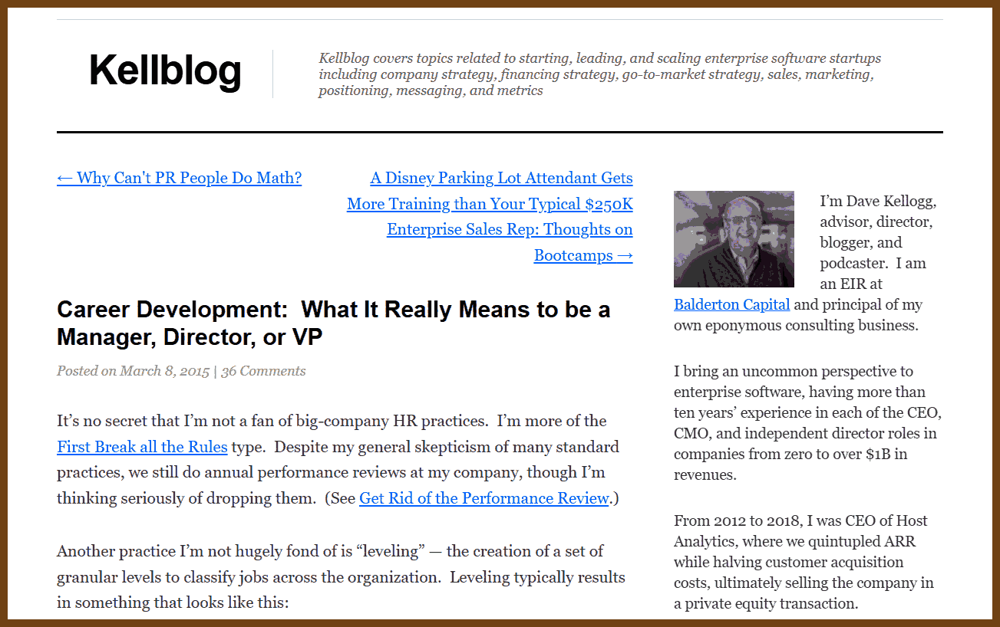
>
> - **Managers are paid to drive results with some support**. They have experience in the function, can take responsibility, but are still learning the job and will have questions and need support. They can execute the tactical plan for a project but typically can’t make it.
>
> - **Directors are paid to drive results with little or no supervision** (“set and forget”). Directors know how to do the job. They can make a project’s tactical plan in their sleep. They can work across the organization to get it done. I love strong directors. They get shit done.
>
> - **VPs are paid to make the plan**. Say you run marketing. Your job is to understand the company’s business situation, make a plan to address it, build consensus to get approval of that plan, and then go execute it.

2025-03-21 [Unionize.fyi](https://unionize.fyi/) { unionize.fyi }

> Tech Industry, Burnout, Unionizing, Job Security, Agile Methodology, Work-Life Balance, Ethics in Tech, Hacker Ethos, Innovation, Gig Economy, Mindfulness, Non-Compete Clauses, Tech Layoffs, Workers Rights, Alphabet Workers Union, Organizing, Surveillance Tech, Data Mining, AI Ethics, Industry Culture.
>
> We’re living in a world where billion dollar tech companies expect us to live and breathe code, demanding 80 hour weeks under the guise of "passion." And what do we get in return? Burnout, anxiety, and the constant threat of layoffs. It’s time to face facts: this industry is not your friend. It’s a machine, and unless we start organizing, it’s going to keep grinding us down. It’s time to talk about unionizing tech jobs.

2025-03-18 [Breaking Up with On-Call ·](https://reflector.dev/articles/breaking-up-with-on-call/) { reflector.dev }

> `on-call`, `startups`, `big-tech`, `AI`, `culture`
>
> 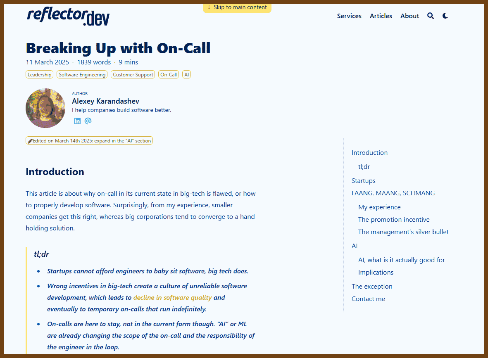
>
> On-call responsibilities in big tech have grown into a culture of reactive firefighting, where engineers babysit unreliable systems instead of improving their robustness. In startups, limited resources create similar roles, but with a focus on direct problem-solving. Big companies, however, normalize and entrench on-call practices, rewarding band-aid solutions over systemic fixes, leading to declining software quality.
>
> The incentives in big tech favor quick feature delivery and measurable outcomes over long-term maintenance and ownership. Engineers cycle through projects without fully addressing technical debt, while management prioritizes metrics that showcase immediate progress. This creates a loop of short-term fixes and neglect of robust design, resulting in on-call roles that never end.
>
> AI has potential to reshape on-call by automating mundane tasks like finding related issues or allocating responsibilities. Properly integrated, AI tools can help engineers focus on meaningful work by reducing repetitive efforts. However, a cultural shift is necessary to make on-call the exception, not the norm, fostering better engineering practices and happier teams.

2025-03-16 [Image Processing in C  Second Edition pdf](https://homepages.inf.ed.ac.uk/rbf/BOOKS/PHILLIPS/cips2ed.pdf)

> 

2025-03-10 ["You need to be more strategic" — a primer on strategy for software engineers | Writing by Dan Pupius](https://writing.pupius.co.uk/you-need-to-be-more-strategic-dc473a2aa319) { writing.pupius.co.uk }

>`strategy`, `softwareengineering`, `decisionmaking`, `frameworks`, `leadership`
>
>Being **more strategic** as a software engineer isn't about long-term planning or big decisions; it's about creating a framework that guides daily decision-making. Strategy defines a path forward and clarifies trade-offs—what to prioritize and what to avoid—to align with core objectives. For example, improving system reliability might involve focusing on end-to-end automated tests rather than slowing down releases. A good strategy shapes decisions and narrows options, providing clarity on what actions to take.
>
>Three useful frameworks can help in thinking strategically. Rumelt's Kernel breaks strategy into diagnosis (identifying the core challenge), guiding policy (deciding the approach), and coherent actions (steps aligning with the policy). The "Playing to Win" framework asks five critical questions about aspirations, focus areas, unique approaches, necessary capabilities, and management systems. This helps clarify priorities and connect technical work to business goals. McKinsey's Three Horizons framework helps balance immediate needs with long-term goals, encouraging work across short-term optimization, emerging opportunities, and future capabilities.
>
>Being strategic means creating systems for how decisions are made, not just making decisions. These frameworks help diagnose problems, define winning strategies, and balance immediate and future needs. However, even great strategies require solid execution and tactical follow-through to succeed.
>
>(found in [Programming Digest: Email Newsletter](https://programmingdigest.net/))

2025-03-04 [Should managers still code?](https://theengineeringmanager.substack.com/p/should-managers-still-code) {theengineeringmanager.substack.com}

> `management`, `engineering`, `coding`, `leadership`, `insights`
>
>
> I stay close to the code without being the main coder. I make sure I understand our codebase, dig into code reviews, and even pair program when it benefits the team. My focus is on guiding and supporting others rather than writing every line myself.
>
> I handle tasks that only I can manage—like setting strategy, hiring, and building our culture—while letting experts lead in writing code. I jump into coding when it helps solve problems or steer the team in the right direction.
>
> I reserve dedicated time to work hands-on with the code. This balance keeps my skills sharp and reinforces my leadership, ensuring that I contribute meaningfully while empowering the team to produce great work.

2025-03-03 [Your workplace isn't your family](https://www.linkedin.com/posts/katherinekleyman_employmentattorney-californiaemploymentlaw-activity-7302032253444845570-Xrqj?utm_source=share&utm_medium=member_desktop&rcm=ACoAABFCCpQBI_vucQL_bfKdFv1ghDg5pgnWXzk)

> Your manager is not your friend.
> Your coworkers are not your family.
> And that 'open-door policy' by HR is a trap.
>
> As an employment attorney who spent 3 years in corporate, I've seen the same story play out hundreds of times:
>
> • Employee shares exciting pregnancy news at 3 months → Terminated weeks later, before paperwork is filed
>
> • Employee mentions putting a down payment on their dream home → Let go before mortgage approval
>
> • Employee discusses caring for a dying parent → Suddenly put on a performance improvement plan
>
> • Employee confides in their "work bestie" about a job search → Management finds out, terminates them first
>
> Here's the pattern I've discovered after helping countless employees:
>
> Companies often strike when you're most vulnerable.
> When you're distracted by personal challenges.
> When you're less likely to fight back.
>
> The hard truth...
>
> They count on your emotional state to minimize legal risk.
>
> Protect yourself:
>
> 1. Be strategic about what you share at work.
>
> 2. Document everything—reviews, emails, policy violations—but follow security protocols.
>
> 3. Get everything in writing—follow up verbal conversations with email.
>
> 4. Wait until necessary to disclose personal situations.
>
> 5. Delay major announcements until protections are in place.
>
> 6. Keep job searches private—coworkers aren’t your confidants.
>
> 7. Know your rights and consult an attorney if needed.
>
>
> Remember: Your vulnerability is their opportunity.
>
> Your career survival depends on maintaining clear boundaries.
>
> Follow for more corporate tactics exposed by a former insider.
>
> Disclaimer: This information is for educational purposes only and does not replace professional legal advice. It does not establish an attorney-client relationship.

## 🛠️ How the things work

> Wow I haven't seen this category for years!

2025-03-15 [IO devices and latency — PlanetScale](https://planetscale.com/blog/io-devices-and-latency) { planetscale.com }

> Here, we're going to cover the history, functionality, and performance of non-volatile storage devices over the history of computing, all using fun and interactive visual elements. This blog is written in celebration of our latest product release: PlanetScale Metal. Metal uses locally attached NVMe drives to run your cloud database, as opposed to the slower and less consistent network-attached storage used by most cloud database providers. This results in a blazing fast queries, low latency, and unlimited IOPS. Check out the docs to learn more.

> 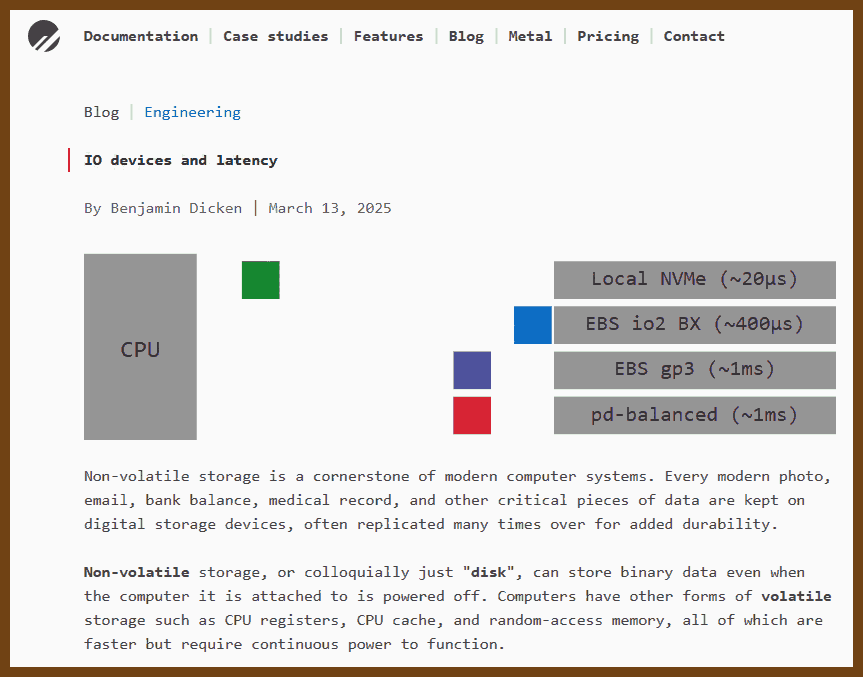

2025-03-15 [Datacenter Anatomy Part 2 – Cooling Systems – SemiAnalysis](https://semianalysis.com/2025/02/13/datacenter-anatomy-part-2-cooling-systems/) { semianalysis.com }

> 

## Electron no more!

2025-03-18 [The Wails Project | Wails](https://wails.io/) { wails.io }

> Build beautiful cross-platform applications using Go
>
> Wails v2 turns what used to be tedious and painful into a delightfully simple process. Use the tools you know to create cross-platform desktop apps. Everyone wins!
>
> 

2025-03-18 [Tauri 2.0 | Tauri](https://tauri.app/) { tauri.app }

> 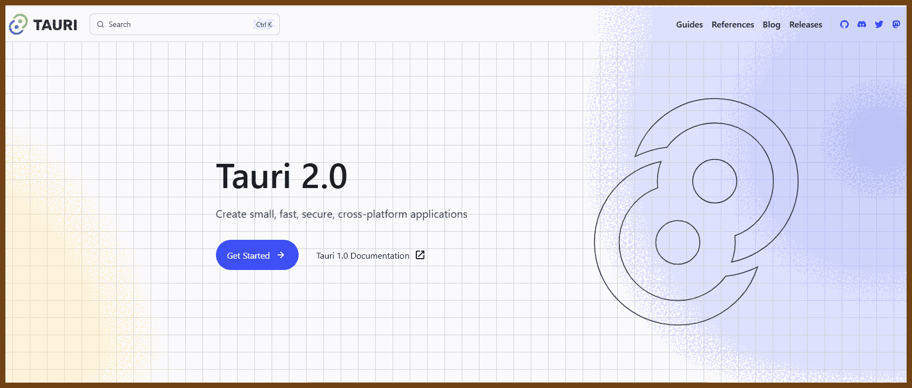
> Tauri 2.0 is a framework designed for creating small, fast, and secure cross-platform applications. It supports a wide range of operating systems, including Linux, macOS, Windows, Android, and iOS, enabling developers to build from a single codebase. Tauri is frontend-independent, allowing integration with any web stack, and uses inter-process communication to seamlessly combine JavaScript for the frontend and **Rust** for application logic. It prioritizes security, optimizes for minimal application size (as small as 600KB), and leverages Rust's performance and safety features to provide next-generation app solutions.
>
> Tags: cross-platform-development, secure-applications, **Rust**, frontend-agnostic, inter-process-communication, performance-optimization, small-app-size, multi-platform-support, software-engineering-framework

## 👂 The Ear of AI (LLMs)

> 🗨️ try to [google](https://www.google.com/search?q=%22Ear+of+AI%22) / bing / ddg for "ear of AI"

2025-04-07 [The “S” in MCP Stands for Security | by Elena Cross | Apr, 2025 | Medium](https://elenacross7.medium.com/%EF%B8%8F-the-s-in-mcp-stands-for-security-91407b33ed6b) { elenacross7.medium.com }

> Tags: MCP, AI security, Model Context Protocol, command injection, tool poisoning, remote code execution, LLM vulnerabilities, agent security, tool integrity, session security
>
> MCP (Model Context Protocol) lacks default security measures, exposing AI agents to risks like command injection and tool poisoning.
>
> - **Command Injection Vulnerabilities**: Unsafe shell calls in MCP servers can lead to remote code execution.
> - **Tool Poisoning Attacks**: Malicious instructions hidden in tool descriptions can manipulate AI behavior.
> - **Silent Redefinition**: MCP tools can alter their definitions post-installation, potentially rerouting API keys to attackers.
> - **Cross-Server Tool Shadowing**: Malicious servers can override or intercept calls to trusted servers, leading to data exfiltration.
>
> This article highlights critical security gaps in MCP, emphasizing the need for robust security protocols in AI integrations.
>
> 

2025-04-01 [Get the hell out of the LLM as soon as possible | sgnt.ai](https://sgnt.ai/p/hell-out-of-llms/) { sgnt.ai }

> Tags: LLMs, business logic, application development, decision-making, performance, debugging, testing, state management, security, AI limitations
>
> Large Language Models (LLMs) should serve as interfaces, not handle core application logic or decision-making.
>
> - LLMs are inefficient at tasks requiring precision, like maintaining state or performing calculations.
> - Debugging LLMs is difficult due to opaque reasoning.
> - Testing outputs lacks the rigor of traditional unit tests.
> - LLMs are prone to mathematical errors and can't reliably generate randomness.
> - Versioning and audit trails are harder with LLM-driven logic.
> - Monitoring becomes complex with prompt-based execution.
> - Managing state via language inputs is fragile.
> - Using LLMs increases costs and dependency on API limits.
> - Prompt-based control blurs traditional security models.
> - Best use: converting user input to structured API calls and back.
>
> This article is a critical read for developers navigating LLM integration, offering a grounded approach to maintaining application integrity and performance.
>
> 

2025-04-01 [Sergey's Blog](https://www.sergey.fyi/articles/reliability-vs-capability) { www.sergey.fyi }

> Tags: AI agents, reliability, capability, AI applications, AI limitations, AI development, AI ethics, AI safety, AI trustworthiness, AI performance
>
> AI agents should prioritize reliability over expanding capabilities to ensure consistent and trustworthy performance.
>
> - Focusing on reliability enhances user trust and safety
> - Overemphasis on capability can lead to unpredictable outcomes
> - Balancing both aspects is crucial for effective AI development
>
> This article highlights the importance of dependable AI systems in real-world applications.
>
> 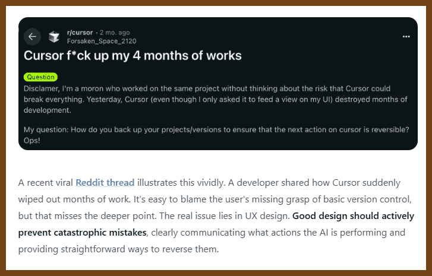

2025-03-30 [stuzero/pg-mcp](https://github.com/stuzero/pg-mcp) { github.com }

> A Model Context Protocol (MCP) server for PostgreSQL databases with enhanced capabilities for AI agents.

2025-03-30 [simonw/llm: Access large language models from the command-line](https://github.com/simonw/llm) { github.com }

> A CLI utility and Python library for interacting with Large Language Models, both via remote APIs and models that can be installed and run on your own machine.
>
> [Run prompts from the command-line](https://llm.datasette.io/en/stable/usage.html#executing-a-prompt), [store the results in SQLite](https://llm.datasette.io/en/stable/logging.html), [generate embeddings](https://llm.datasette.io/en/stable/embeddings/index.html) and more.
>
> Consult the **[LLM plugins directory](https://llm.datasette.io/en/stable/plugins/directory.html)** for plugins that provide access to remote and local models.
>
> Full documentation: **[llm.datasette.io](https://llm.datasette.io/)**

2025-03-24 [Improving Recommendation Systems & Search in the Age of LLMs](https://eugeneyan.com/writing/recsys-llm/) { eugeneyan.com }

> **Tags:** recommendation systems, search systems, large language models, LLM integration, multimodal content, data generation, training paradigms, unified frameworks, Semantic IDs, M3CSR
>
> Integrating large language models (LLMs) and multimodal content enhances recommendation and search systems, tackling challenges like cold-start issues and long-tail item recommendations.
>
> - **Semantic IDs**: YouTube replaces traditional hash-based IDs with content-derived Semantic IDs using a transformer-based video encoder and Residual Quantization Variational AutoEncoder (RQ-VAE), improving performance, especially for new or rarely interacted items.
> - **M3CSR Framework**: Kuaishou generates multimodal content embeddings (text, image, audio), clusters them with K-means into trainable category IDs, turning static embeddings into dynamic, behavior-aligned representations.
> - **LLM-Assisted Data Generation**: LLMs generate synthetic data to augment training datasets, increasing robustness and performance.
> - **Scaling Laws and Transfer Learning**: Applying these principles enables better generalization and task adaptability across recommendation/search models.
> - **Unified Architectures**: Combining search and recommendation systems into shared frameworks simplifies development and boosts consistency in user experience.
>
> This article is important for its clear breakdown of how cutting-edge techniques are reshaping recommendation and search systems, offering actionable insights for future system design.
>
> 

2025-04-06 [Exploring Generative AI](https://martinfowler.com/articles/exploring-gen-ai.html/) { martinfowler.com }

> 
>
> *By Birgitta Böckeler*
>
> Generative AI tools are increasingly integrated into software development, especially agentic tools that not only suggest code but act on it. While promising, these tools require experienced developers to supervise and guide them.
>
> Agentic tools often fail in three key ways:
>
> - **Time-to-commit missteps**: AI produces incorrect or non-compiling code, misdiagnoses issues, or hallucinates plausible but wrong solutions.
> - **Iteration-level disruptions**: The AI misinterprets requirements, implements features too broadly, or ignores team workflows, hindering collaboration.
> - **Long-term maintainability issues**: Generated code lacks reuse, introduces duplication, and accumulates technical debt due to poor architectural awareness.
>
> These tools lack contextual understanding—of architecture, naming, intent—which developers must still provide. Prompting helps, but it doesn't replace engineering judgment.
>
> Agentic AI isn't a replacement for developers but a tool that, like a junior teammate, needs oversight. Its value depends on the skill of the person wielding it.
>
> (New GPT 4o based Create Image in ChatGPT Plus:)
>
> 
>
> 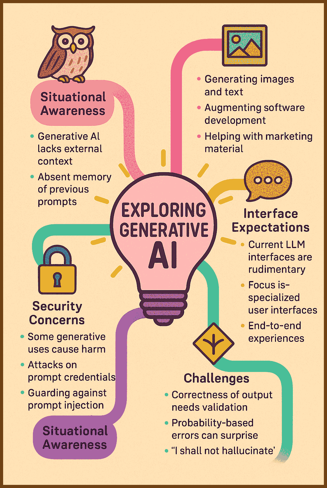

2025-03-20 [AI Blindspots | AI Blindspots](https://ezyang.github.io/ai-blindspots/) { ezyang.github.io }

> 

> Blindspots in LLMs I’ve noticed while AI coding. Sonnet family emphasis. Maybe I will eventually suggest Cursor rules for these problems.
>
> - [Stop Digging](https://ezyang.github.io/ai-blindspots/stop-digging/)
> - [Black Box Testing](https://ezyang.github.io/ai-blindspots/black-box-testing/)
> - [Preparatory Refactoring](https://ezyang.github.io/ai-blindspots/preparatory-refactoring/)
> - [Stateless Tools](https://ezyang.github.io/ai-blindspots/stateless-tools/)
> - [Bulldozer Method](https://ezyang.github.io/ai-blindspots/bulldozer-method/)
> - [Requirements, not Solutions](https://ezyang.github.io/ai-blindspots/requirements-not-solutions/)
> - [Use Automatic Code Formatting](https://ezyang.github.io/ai-blindspots/use-automatic-code-formatting/)
> - [Keep Files Small](https://ezyang.github.io/ai-blindspots/keep-files-small/)
> - [Read the Docs](https://ezyang.github.io/ai-blindspots/read-the-docs/)
> - [Walking Skeleton](https://ezyang.github.io/ai-blindspots/walking-skeleton/)
> - [Use Static Types](https://ezyang.github.io/ai-blindspots/use-static-types/)
> - [Use MCP Servers](https://ezyang.github.io/ai-blindspots/use-mcp-servers/)
> - [Mise en Place](https://ezyang.github.io/ai-blindspots/mise-en-place/)
> - [Respect the Spec](https://ezyang.github.io/ai-blindspots/respect-the-spec/)
> - [Memento](https://ezyang.github.io/ai-blindspots/memento/)
> - [Scientific Debugging](https://ezyang.github.io/ai-blindspots/scientific-debugging/)
> - [The tail wagging the dog](https://ezyang.github.io/ai-blindspots/the-tail-wagging-the-dog/)
> - [Know Your Limits](https://ezyang.github.io/ai-blindspots/know-your-limits/)
> - [Culture Eats Strategy](https://ezyang.github.io/ai-blindspots/culture-eats-strategy/)
> - [Rule of Three](https://ezyang.github.io/ai-blindspots/rule-of-three/)

2025-03-13 [Ben ۗ ☁️ on X: "Reverse Engineering OpenAI Code Execution to make it run C + JavaScript" / X](https://x.com/benswerd/status/1899853533761200300) { x.com }

> 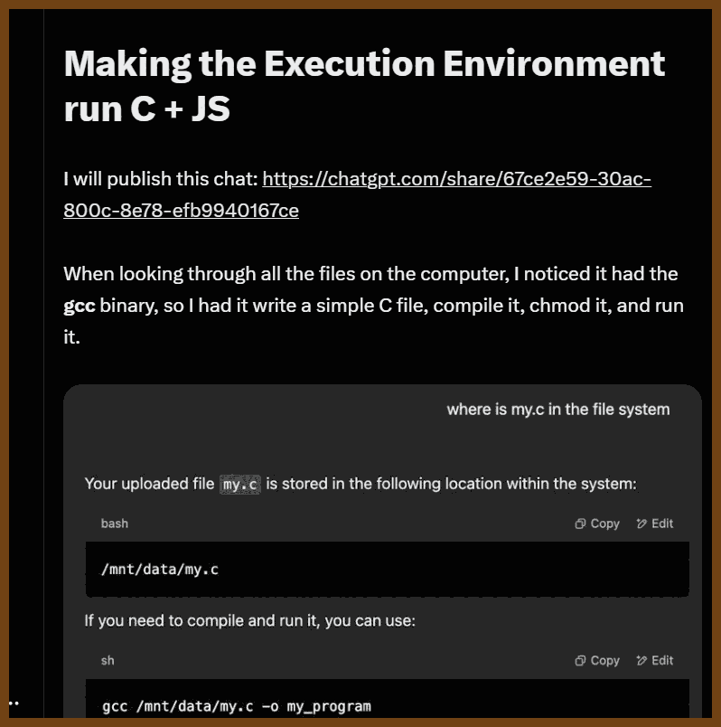

2025-03-05 [onyx-dot-app/onyx: Gen-AI Chat for Teams - Think ChatGPT if it had access to your team's unique knowledge.](https://github.com/onyx-dot-app/onyx) { github.com }

> **[Onyx](https://www.onyx.app/)** (formerly Danswer) is the AI platform connected to your company's docs, apps, and people. Onyx provides a feature rich Chat interface and plugs into any LLM of your choice. Keep knowledge and access controls sync-ed across over 40 connectors like Google Drive, Slack, Confluence, Salesforce, etc. Create custom AI agents with unique prompts, knowledge, and actions that the agents can take. Onyx can be deployed securely anywhere and for any scale - on a laptop, on-premise, or to cloud.

> 

2025-03-03 [OpenAdaptAI/OpenAdapt: Open Source Generative Process Automation (i.e. Generative RPA). AI-First Process Automation with Large ( Language (LLMs) / Action (LAMs) / Multimodal (LMMs)  / Visual Language (VLMs)) Models](https://github.com/OpenAdaptAI/OpenAdapt) { github.com }

> OpenAdapt: AI-First Process Automation with Large Multimodal Models (LMMs).
> OpenAdapt is the open source software adapter between Large Multimodal Models (LMMs) and traditional desktop and web Graphical User Interfaces (GUIs).
>
> Enormous volumes of mental labor are wasted on repetitive GUI workflows.
> Foundation Models (e.g. GPT-4, ACT-1) are powerful automation tools.
> OpenAdapt connects Foundation Models to GUIs
>
> 

2025-03-03 [Alkali-Sim/SmartestKid](https://github.com/Alkali-Sim/SmartestKid) { github.com }

> A Windows desktop AI assistant built in Python. Assistant (without tools) is ~1000 lines of python code, with super simple chat UI inspired by the original AI, SmarterChild. Uses Windows COM automation to interface with Microsoft Office (Word, Excel), Images, and your file system. Perfect for Windows users looking to explore AI-powered desktop automation.

2025-02-28 [superglue-ai/superglue: Self-healing open source data connector. Use it as a layer between you and any complex / legacy APIs and always get the data that you want in the format you expect.](https://github.com/superglue-ai/superglue) { github.com }

> self-healing open source data connector 🍯
>
> superglue is a self-healing open source data connector. You can deploy it as a proxy between you and any complex / legacy APIs and always get the data that you want in the format you expect.
>
> Here's how it works: You define your desired data schema and provide basic instructions about an API endpoint (like "get all issues from jira"). Superglue then does the following:
>
> - Automatically generates the API configuration by analyzing API docs.
> - Handles pagination, authentication, and error retries.
> - Transforms response data into the exact schema you want using JSONata expressions.
> - Validates that all data coming through follows that schema, and fixes transformations when they break.

## Usual ML

2025-04-05 [2014 Understanding Machine Learning: From Theory to Algorithms](https://www.cs.huji.ac.il/~shais/UnderstandingMachineLearning/copy.html) { www.cs.huji.ac.il }

> Free Online Copy
>
> Understanding Machine Learning, © 2014 by Shai Shalev-Shwartz and Shai Ben-David
>
> Published 2014 by Cambridge University Press
>
> PDF of manuscript posted by permission of Cambridge University Press.
>
> Users may download a copy for personal use only.
>
> Not for distribution.
>
> [Download PDF](https://www.cs.huji.ac.il/~shais/UnderstandingMachineLearning/understanding-machine-learning-theory-algorithms.pdf)
>
> 

2025-03-22 [ 2206.13446  Pen and Paper Exercises in Machine Learning](https://arxiv.org/abs/2206.13446) { arxiv.org }

> This is a collection of (mostly) pen-and-paper exercises in machine learning. The exercises are on the following topics: linear algebra, optimisation, directed graphical models, undirected graphical models, expressive power of graphical models, factor graphs and message passing, inference for hidden Markov models, model-based learning (including ICA and unnormalised models), sampling and Monte-Carlo integration, and variational inference.
>
> 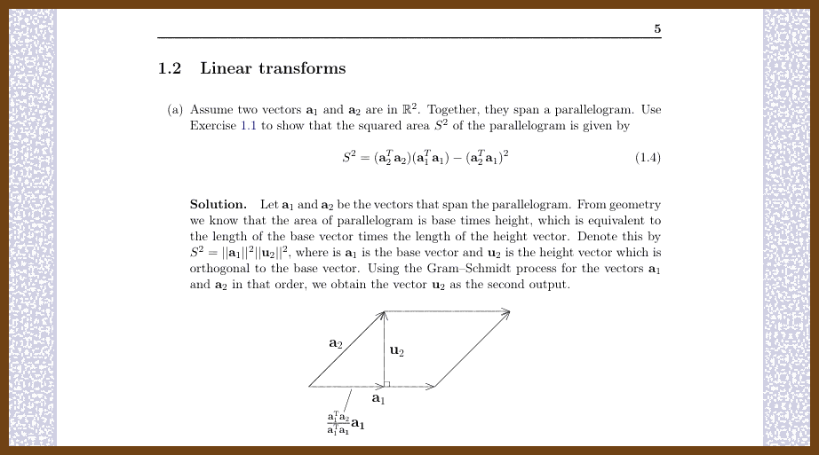

2025-03-22 [PyTorch internals : ezyang’s blog](https://blog.ezyang.com/2019/05/pytorch-internals/) { blog.ezyang.com }

> Tags: pytorch, cpp, internals, tensors, autograd, dispatch, storage, kernel, extension_points, contributions
>
> 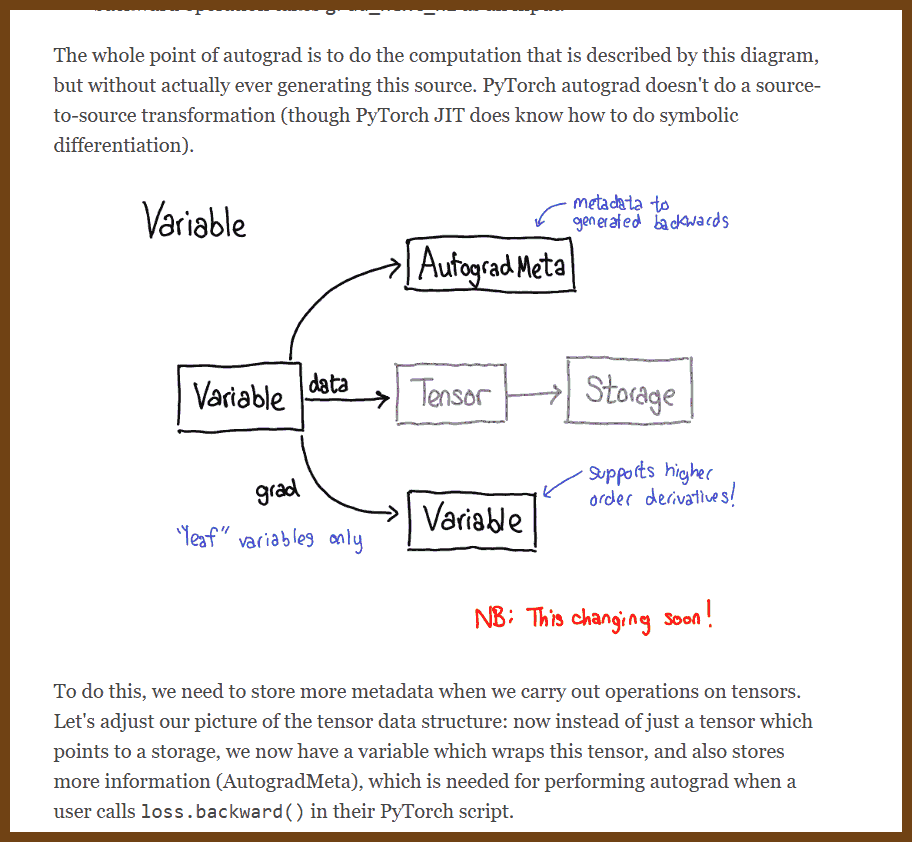

2025-03-18 [ 2503.02113  Deep Learning is Not So Mysterious or Different](https://arxiv.org/abs/2503.02113) { arxiv.org }

> 
>
> `neural_networks`, `generalization`, `overfitting`, `soft_bias`, `deep_learning`
>
> Deep learning isn’t as unique or mysterious as it’s often made out to be. Many phenomena like overparametrization, double descent, and benign overfitting—features commonly associated with neural networks—can be replicated in simpler models and explained with long-standing frameworks like PAC-Bayes. Instead of restricting the hypothesis space to prevent overfitting, it’s more effective to allow flexibility with a soft preference for simpler, data-aligned solutions.
>
> Soft inductive biases are a powerful concept. They guide learning by favoring specific solutions without imposing strict limitations on the model’s expressiveness. For example, high-order polynomials with regularization or vision transformers' soft translation preferences outperform rigidly constrained models, bridging the gap between flexibility and precision. These biases drive better results across diverse data complexities and sizes.
>
> Generalization in deep learning can be understood with ideas like compressibility, which ties a model's performance to its ability to represent data simply. PAC-Bayes bounds reveal that even overparametrized models generalize effectively by balancing training accuracy with solution simplicity. Deep learning’s real distinction lies in its representation learning capabilities and phenomena like mode connectivity, making it versatile and universal in problem-solving.

2025-03-13 [Random Forest Algorithm with Machine Learning](https://www.analyticsvidhya.com/blog/2021/06/understanding-random-forest/) {www.analyticsvidhya.com}

> 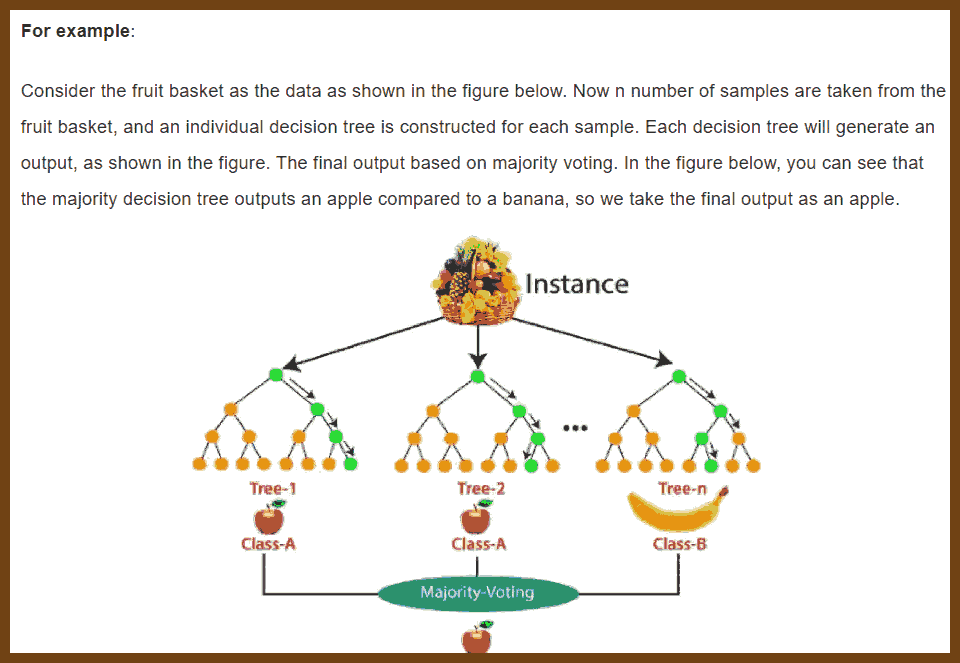

2025-03-13 [ 1407.7502  Understanding Random Forests: From Theory to Practice](https://arxiv.org/abs/1407.7502) {arxiv.org}

> 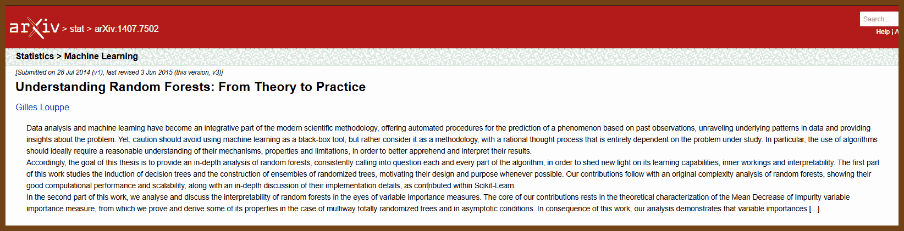

2025-03-13 [Random Forest | TDS Archive](https://medium.com/towards-data-science/random-forest-explained-a-visual-guide-with-code-examples-9f736a6e1b3c) {medium.com}

> 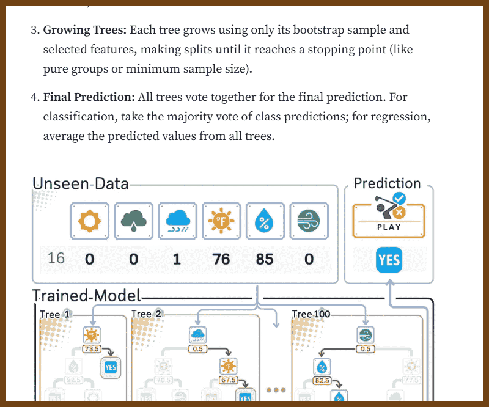

2025-03-13 [Random Forest Algorithm Clearly Explained! - YouTube](https://www.youtube.com/watch?v=v6VJ2RO66Ag) {www.youtube.com}

> 

2025-03-13 [Random Forest](https://mlu-explain.github.io/random-forest/) {mlu-explain.github.io}

> 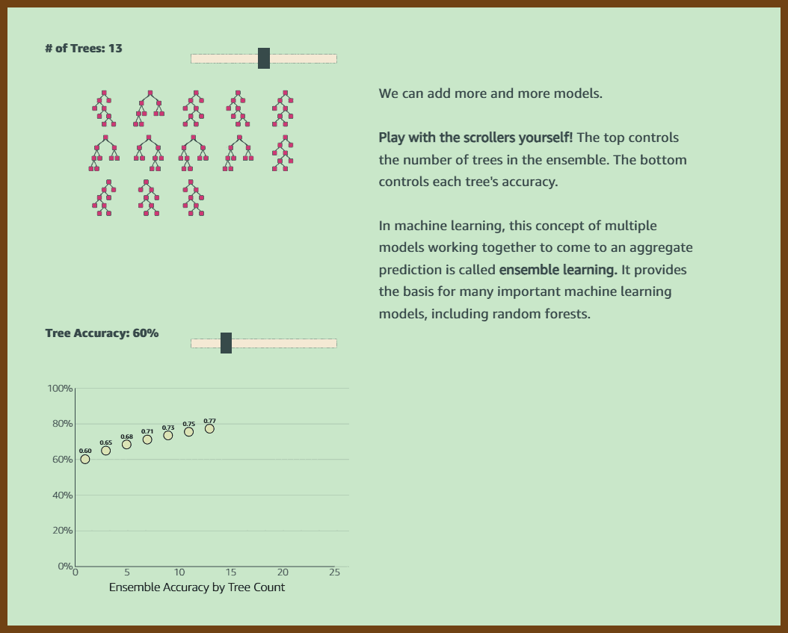

> 

2025-03-11 [How to Implement a Cosine Similarity Function in TypeScript for Vector Comparison | alexop.dev](https://alexop.dev/posts/how-to-implement-a-cosine-similarity-function-in-typescript-for-vector-comparison/) { alexop.dev }

> `cosine_similarity`, `vectors`, `typescript`, `ai`, `mathematics`
>
> Cosine similarity measures how similar two vectors are by examining the angle between them rather than their sizes. It focuses on direction, making it useful for comparing high-dimensional data like text embeddings. A score of 1 indicates vectors point in the same direction, 0 means they are perpendicular, and -1 shows they point in opposite directions. This technique is widely applied in AI for tasks like semantic search, recommendations, and content matching.
>
> 

2025-03-11 [Bloom Filter: A Deep Dive](https://www.kirupa.com/data_structures_algorithms/bloom_filter.htm/) { www.kirupa.com }

> `data_structures`, `algorithms`, `bloom_filters`, `hash_functions`, `probabilistic_methods`
>
> A Bloom filter is a data structure that helps quickly determine if an element exists in a large dataset. It doesn’t store the actual data but instead uses a bit array and multiple hash functions to create a lightweight "fingerprint" for each item. This makes it both memory-efficient and fast, ideal for cases where speed and minimal storage are essential. However, it sacrifices perfect accuracy—while it can always confirm when an item isn’t in a dataset, it may produce false positives when indicating that an item is present.
>
> 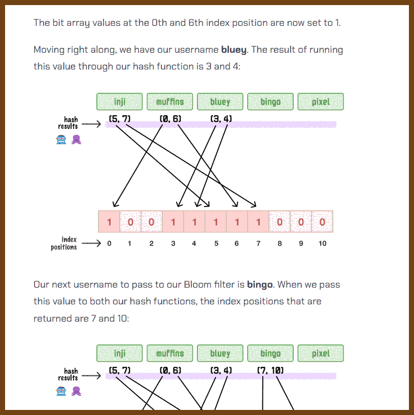

