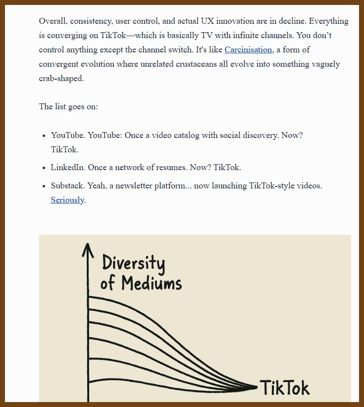
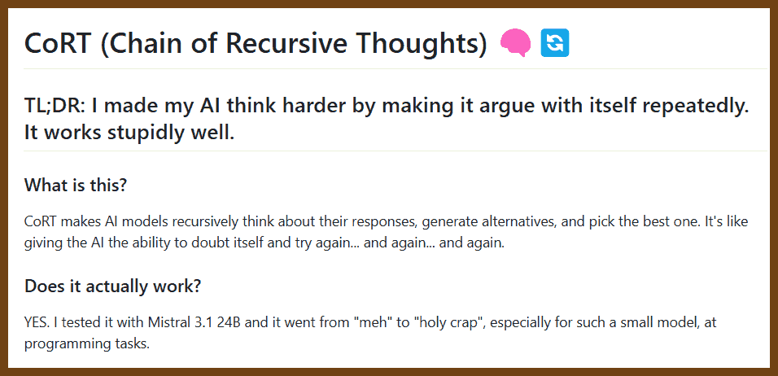
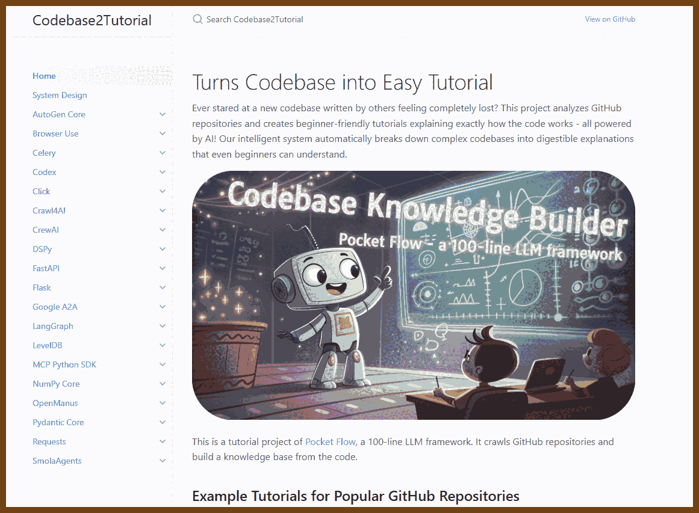
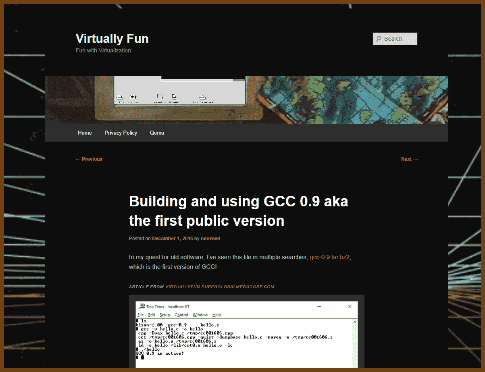
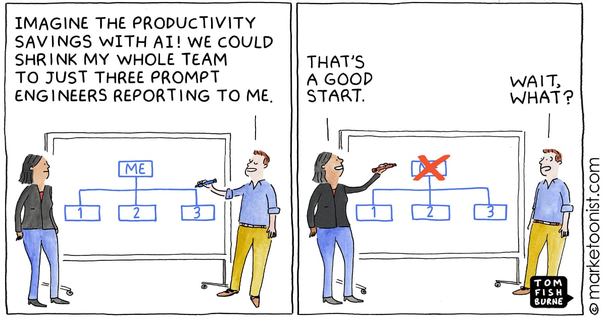
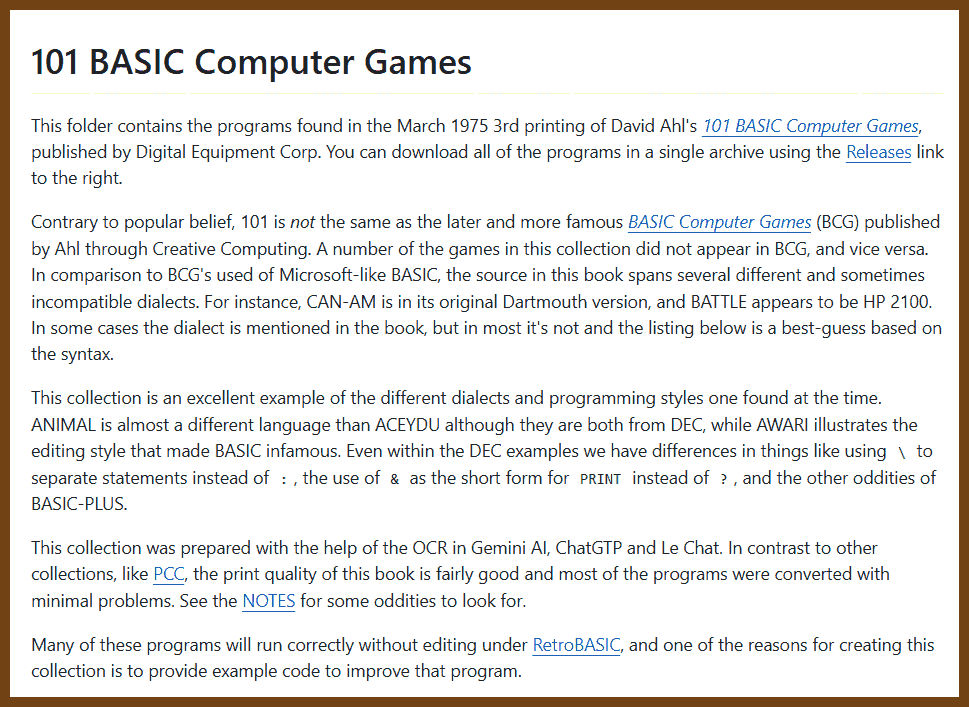
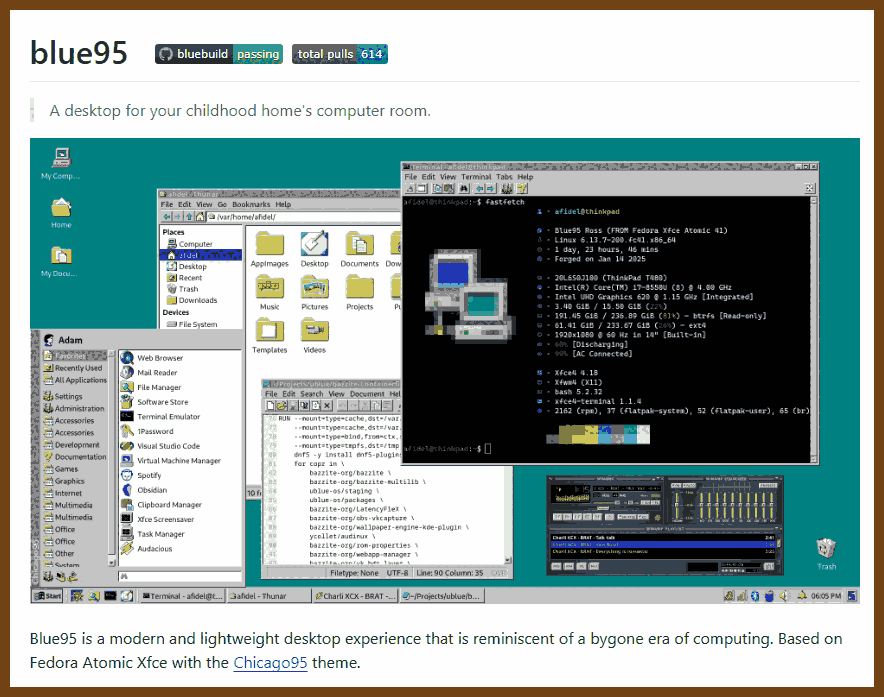

---
layout: post
title:  "Links from my inbox 2025-05-28"
date:   2025-05-28T22:46:00-07:00
categories: links
---


## Good Reads

2025-05-29 [Duplication Is Not the Enemy – Terrible Software](https://terriblesoftware.org/2025/05/28/duplication-is-not-the-enemy/) { terriblesoftware.org }

> 
>
> Developers are taught early on to eliminate code duplication, but this piece argues that premature abstraction is often a bigger danger. Abstracting too early — before understanding how requirements evolve — can lead to bloated, unmanageable code that's harder to change than the original duplication. The post uses a real-world scenario involving bonus calculations to show how well-meaning abstractions become convoluted as requirements change gradually over time. Each small, isolated addition to a shared function seems harmless, but the end result is a mess of parameters and conditionals no one wants to touch.
>
> The author advocates for deferring abstraction until true patterns emerge, emphasizing that superficial similarities often mask fundamentally different needs. Instead of rushing to DRY out code at the first sign of repetition, developers should wait until they have enough insight into what varies and what remains constant. The takeaway: duplication can be an honest, maintainable choice until a meaningful, stable abstraction naturally reveals itself.
>
> *software design, programming principles, DRY, abstraction, code maintenance, real-world development*

2025-05-10 [The Deathbed Fallacy](https://www.hjorthjort.xyz/2018/02/21/the-deathbed-fallacy.html) { www.hjorthjort.xyz }

> 
>
> People often say you should live so your future self won’t have regrets on their deathbed. But the article argues this is flawed thinking. The version of you on your deathbed is not living a full life anymore and can't see the whole picture clearly. That self is focused on recent memories, feels differently about risks, and doesn’t have to deal with long-term consequences.
>
> We also misunderstand our past selves, thinking we know why we made certain choices. But those decisions made sense back then, even if they don't match who we are now. It's better to focus on what makes life good today—like meaningful work, good relationships, and purpose—rather than chasing an imagined regret-free future.
>
> *life-choices, regret, psychology, happiness, decision-making*

2025-05-07 [rate limiter – smudge.ai blog](https://smudge.ai/blog/ratelimit-algorithms) { smudge.ai }

> Tags: rate-limiting, fixed windows, sliding windows, token buckets, API-throttling, burst management, traffic smoothing, Redis, HTTP-429
> 
>
> Visualizes and compares fixed window, sliding window, and token bucket rate-limiting algorithms, analyzing their pros, cons, and real-world applications to guide choosing the right strategy.
>
> - **Fixed window** resets counters each interval; simple and predictable but allows bursts at window edges and has timezone issues.
> - **Sliding window** refills per request for smoother traffic distribution; efficient approximations remove heavy timestamp storage while balancing control and performance.
> - **Token bucket** refills tokens at a constant rate, supporting bursts and enforcing average rates; flexible yet harder to communicate limits.
> - **Implementation tips**: use persistent stores (e.g., Redis), fail open on datastore errors, choose sensible keys (user ID, IP), and expose HTTP 429 with x-ratelimit headers.
>
> This comparative review clarifies how each algorithm manages traffic, aiding developers in selecting and implementing effective throttling mechanisms.

2025-05-03 [Accountability Sinks - by Martin Sustrik - 250bpm](https://250bpm.substack.com/p/accountability-sinks) { 250bpm.substack.com }

> Martin Sustrik explains how bureaucracies often create environments where responsibility becomes untraceable. These “accountability sinks” occur when rigid systems take precedence over individual judgment, making it nearly impossible to determine who made a decision or why. One example is the destruction of a shipment of squirrels at Schiphol Airport in 1999, where strict adherence to policy overrode common sense, and no one could be held directly responsible.
>
> Sustrik warns that such systems can suppress initiative and slow down meaningful action. Still, he notes that not all formal structures are flawed — the problem arises when they prevent people from acting with ownership. Good systems should balance structure with personal responsibility, allowing people to act while still being accountable for their choices.
>
> *bureaucracy, responsibility, organizational design, systems, decision-making*

> ...Holocaust researchers keep stressing one point: The large-scale genocide was possible only by turning the popular hatred, that would otherwise discharge in few pogroms, into a formalized administrative process.
>
> For example, separating the Jews from the rest of the population and concentrating them at one place was a crucial step on the way to the extermination.
>
> In Bulgaria, Jews weren't gathered in ghettos or local "labor camps", but rather sent out to rural areas to help at farms. Once they were dispersed throughout the country there was no way to proceed with the subsequent steps, such as loading them on trains and sending them to the concentration camps...

🔭 2025-04-26 [Observability 2.0 and the Database for It | Greptime](https://greptime.com/blogs/2025-04-25-greptimedb-observability2-new-database) { greptime.com }

> Observability 2.0 challenges the traditional three pillars approach by unifying **metrics**, logs, and traces into a single, context-rich data model called **wide events**. Instead of pre-aggregating metrics or parsing logs after the fact, this model treats raw, high-cardinality event data as the **source of truth**—capturing full system context upfront and allowing dynamic, retrospective computation of metrics and traces. This shift addresses key pain points of observability 1.0: data silos, redundant storage, loss of granularity, and the slow feedback loop of static instrumentation.
>
> **GreptimeDB** is built explicitly for this new paradigm. It ingests wide events directly, supports real-time queries, materialized views, and triggers for alerts, and scales elastically using disaggregated storage and columnar formats. Crucially, it remains backward-compatible with existing tools like Grafana and PromQL while enabling ad-hoc, high-dimensional analysis without the complexity of traditional pre-aggregation pipelines. This design turns observability from a fragmented stack into a **unified** system for both real-time monitoring and deep analytics.
>
> *italics: observability 2.0, wide events, telemetry, data silos, real-time analytics, GreptimeDB, metrics, logs, traces, scalability, unified observability, cloud-native*
>
> 

🔭 2025-04-26 [Observability wide events 101 | Boris Tane](https://boristane.com/blog/observability-wide-events-101/) { boristane.com }

> Tags: observability, wide events, high cardinality, high dimensionality, context-rich logging, distributed tracing, OpenTelemetry, debugging unknown unknowns, structured logging, application monitoring
>
> Wide events are context-rich, high-dimensional logs emitted per service request, enabling deep observability and effective debugging of unforeseen issues beyond the capabilities of traditional logs and metrics.
>
> - Wide events capture comprehensive data per request, including user details, request metadata, database queries, cache operations, and headers, all linked by a unique request ID.
> - They facilitate correlation of events across services, aiding in identifying root causes of issues that traditional logs and metrics might miss.
> - Unlike traditional observability tools, wide events allow for ad-hoc querying across any dimension without pre-aggregation, enhancing flexibility in data analysis.
> - Implementing wide events can be achieved through custom logging or by leveraging distributed tracing frameworks like OpenTelemetry, which standardize context propagation and span creation.
> - Effective tooling for wide events should support fast, flexible querying, raw data access, and affordability, ensuring comprehensive observability without excessive costs.
> - Wide events complement rather than replace traditional metrics, offering deeper insights into application behavior, especially for complex or unexpected issues.
>
> 

2025-04-24 [YAGRI: You are gonna read it](https://www.scottantipa.com/yagri) { www.scottantipa.com }

> As an example, this commonly occurs when implementing a feature to let users delete something. The easy way is to just delete the row from the database, and maybe that's all that the current UI design call for. In this situation, regardless of the requested feature set, as engineers we should maintain good data standards and store:
>
> - who deleted it
> - how they deleted it (with what permission)
> - when
> - why (surrounding context, if possible)
>
> In general, these are some useful fields to store on almost any table:
>
> - created_at
> - updated_at
> - deleted_at (soft deletes)
> - created_by etc
> - permission used during CRUD
>
> This practice will pay off with just a single instance of your boss popping into a meeting and going "wait do we know why that thing was deleted, the customer is worried...".
>
> See also: 
>
> - 2022-10-17 [YAGNI exceptions - lukeplant.me.uk](https://lukeplant.me.uk/blog/posts/yagni-exceptions/)
>
>   > - Applications of [Zero One Many](http://wiki.c2.com/?ZeroOneInfinityRule). If the requirements go from saying “we need to be able to store an address for each user”, to “we need to be able to store two addresses for each user”, 9 times out of 10 you should go straight to “we can store many addresses for each user”
>   > - Versioning. This can apply to protocols, APIs, file formats etc.
>   > - Logging. Especially for after-the-fact debugging, and in non-deterministic or hard to reproduce situations, where it is often too late to add it after you become aware of a problem.
>   > - Timestamps

2025-04-13 [Engineers who won’t commit | sean goedecke](https://www.seangoedecke.com/taking-a-position/) { www.seangoedecke.com }

> found in 2025-04-13 [Microsoft's original source code](https://programmingdigest.net/newsletters/2035?sid=4763653b-6857-490b-8590-516ddcbc8318) { programmingdigest.net }
>
> Tags: #EngineeringLeadership #DecisionMaking #TechnicalResponsibility #SoftwareEngineering #TeamDynamics #ProfessionalGrowth #RiskManagement #WorkplaceCulture #ManagerExpectations #ConfidenceInTech
>
> Strong engineers must take positions in technical discussions, even with partial confidence, to guide teams effectively and prevent poor decisions.
>
> - Remaining non-committal can lead to less-informed individuals making critical decisions, potentially resulting in suboptimal outcomes.
> - Fear of being wrong often drives engineers to avoid commitment, but this behavior can be perceived as cowardice and may burden others with decision-making responsibilities.
> - Managers prefer engineers who provide decisive input; excessive caveats can frustrate leadership and shift decision-making burdens upward.
> - While making incorrect decisions occasionally is acceptable, consistently avoiding commitment can damage credibility and trust.
> - In dysfunctional environments where estimates are penalized unfairly, reluctance to commit is understandable and not criticized.
>
> This article underscores the importance of decisive leadership in engineering roles, highlighting how taking informed stances fosters trust and drives effective team outcomes.
>
> 

2025-04-12 [But what if I really want a faster horse? | exotext](https://rakhim.exotext.com/but-what-if-i-really-want-a-faster-horse) { rakhim.exotext.com }

> 

2025-04-08 [Why Companies Don’t Fix Bugs](https://idiallo.com/blog/companies-dont-fix-bugs) { idiallo.com }

> Tags: corporate bureaucracy, bug fixing, software development, technical debt, product management, legacy code, developer priorities, user experience, corporate inertia, software maintenance
>
> Companies often neglect fixing longstanding software bugs due to bureaucratic hurdles and shifting priorities.
>
> - Bugs not tied to immediate business objectives are deprioritized as "tech debt" and added to the backlog. 
> - High staff turnover leads to loss of institutional knowledge, causing unresolved issues to become relics of the past. 
> - Fear of unintended consequences in legacy systems deters developers from implementing even simple fixes, as "the risk of breaking something far outweighs the reward of fixing a non-critical bug." 
> - Financial incentives focus on new features over user experience improvements, as companies "optimize for metrics that show up on quarterly earnings calls, not for goodwill or user experience." 
>
> This article highlights the systemic challenges within large organizations that hinder effective software maintenance, emphasizing that the issue lies in **"the system that treats user experience as an afterthought."** 
>


## 🛠️ How the things work

2025-04-15 [MCCC: Probability - Monte Carlo Crash Course](https://thenumb.at/Probability/) { thenumb.at }

> Tags: Probability, Random Variables, PMF, PDF, CDF, Joint Distributions, Expectation, Variance, Covariance, Dirac Delta
>
> The article provides a comprehensive overview of continuous probability concepts, contrasting them with discrete probability, and explores foundational topics essential for understanding probabilistic models.
>
> - Introduces random variables, distinguishing between discrete (countable outcomes) and continuous (uncountable outcomes) variables
> - Explains the difference between probability mass functions (PMFs) and probability density functions (PDFs)
> - Discusses cumulative distribution functions (CDFs) and their relation to PDFs
> - Covers joint and marginal distributions, and the concept of dependence
> - Defines expectation, variance, and covariance with mathematical clarity
> - Introduces the Dirac delta function for modeling point probabilities in continuous distributions
>
> This article is valuable for building a strong foundation in probability theory, especially for advanced applications in statistics and data science.
>
> 

2025-04-14 [jlevy/og-equity-compensation: Stock options, RSUs, taxes — read the latest edition: www.holloway.com/ec](https://github.com/jlevy/og-equity-compensation) { github.com }

> Tags: #EquityCompensation #StockOptions #RestrictedStockUnits #TaxImplications #StartupEquity #EmployeeOwnership #VestingSchedules #83bElection #Dilution #PrivateCompanies
>
> A comprehensive guide demystifying equity compensation, providing essential insights into stock options, RSUs, and their tax implications for employees and employers in private U.S. companies.
>
> - Explains various equity types: restricted stock, stock options (ISOs and NSOs), and RSUs, detailing their structures and differences
> - Discusses vesting schedules, including cliffs and acceleration clauses, and their impact on ownership and taxation
> - Highlights tax considerations, such as the 83(b) election, AMT, and timing of exercises, emphasizing potential financial consequences
> - Addresses the significance of fair market value (FMV) and 409A valuations in determining equity worth and tax liabilities
> - Provides guidance on evaluating equity offers, understanding dilution, and making informed decisions during fundraising events
> - Emphasizes the importance of seeking professional advice and understanding legal documents to avoid costly mistakes
>
> This guide is crucial for anyone involved in startup equity, offering clarity on complex topics and aiding in making informed financial and career decisions.

> **Equity compensation** is the practice of granting partial ownership in a company in exchange for work. In its ideal form, equity compensation aligns the interests of individual employees with the goals of the company they work for, which can yield dramatic results in team building, innovation, and longevity of employment. Each of these [contributes](https://github.com/jlevy/og-equity-compensation#history-and-significance) to the creation of value—for a company, for its users and customers, and for the individuals who work to make it a success.


## 👂 The Ear of AI (LLMs)

2025-05-28 [How I used o3 to find CVE-2025-37899, a remote zeroday vulnerability in the Linux kernel’s SMB implementation – Sean Heelan's Blog](https://sean.heelan.io/2025/05/22/how-i-used-o3-to-find-cve-2025-37899-a-remote-zeroday-vulnerability-in-the-linux-kernels-smb-implementation/) { sean.heelan.io }

> 
>
> Using OpenAI’s o3 model, the author discovered CVE-2025-37899, a previously unknown use-after-free vulnerability in the Linux kernel’s SMB implementation, specifically in the `ksmbd` logoff handler. This bug arises when concurrent threads access a shared `sess->user` structure: one thread frees it during session logoff without proper synchronization, while another may still access it, leading to memory corruption or a denial of service. Remarkably, this finding emerged not from advanced agentic frameworks, but through straightforward API use, highlighting o3’s emergent capability in reasoning about complex concurrency issues in kernel code.
>
> As part of evaluating o3, the author benchmarked it against another known use-after-free bug in the Kerberos authentication path (CVE-2025-37778). While o3 found this bug in 8 out of 100 runs (compared to Claude Sonnet 3.7's 3/100), it also surfaced the novel CVE-2025-37899 when analyzing all SMB command handlers together. This discovery suggests LLMs like o3 are beginning to deliver meaningful, non-trivial insights in real-world vulnerability research and could significantly augment expert workflows despite current false positive rates.
>
> What is also interesting:
>
> -  If you’re interested, the code to be analysed is [here](https://github.com/SeanHeelan/o3_finds_cve-2025-37899/blob/master/session_setup_code.prompt) as a single file, created with the [files-to-prompt](https://github.com/simonw/files-to-prompt) tool.
> -  The final decision is what prompt to use. You can find the system prompt and the other information I provided to the LLM in the .prompt files in [this](https://github.com/SeanHeelan/o3_finds_cve-2025-37899) Github repository.
> -  To run the query I then use the `llm` tool ([github](https://github.com/simonw/llm)) like:
>
> *LLM vulnerability research, Linux kernel, ksmbd, CVE-2025-37899, use-after-free, concurrency, o3 model, SMB protocol*

2025-05-23 [The /llms.txt file – llms-txt](https://llmstxt.org/) { llmstxt.org }

> A proposal to standardise on using an /llms.txt file to provide information to help LLMs use a website at inference time.
> 
>
> 

2025-05-23 [https://svelte.dev/llms.txt](https://svelte.dev/llms.txt) { svelte.dev }

> ```
> # Svelte Documentation for LLMs
> 
> > Svelte is a UI framework that uses a compiler to let you write breathtakingly concise components that do minimal work in the browser, using languages you already know — HTML, CSS and JavaScript.
> 
> ## Documentation Sets
> 
> - [Abridged documentation](https://svelte.dev/llms-medium.txt): A shorter version of the Svelte and SvelteKit documentation, with examples and non-essential content removed
> - [Compressed documentation](https://svelte.dev/llms-small.txt): A minimal version of the Svelte and SvelteKit documentation, with many examples and non-essential content removed
> - [Complete documentation](https://svelte.dev/llms-full.txt): The complete Svelte and SvelteKit documentation including all examples and additional content
> 
> ## Individual Package Documentation
> 
> - [Svelte documentation](https://svelte.dev/docs/svelte/llms.txt): This is the developer documentation for Svelte.
> - [SvelteKit documentation](https://svelte.dev/docs/kit/llms.txt): This is the developer documentation for SvelteKit.
> - [the Svelte CLI documentation](https://svelte.dev/docs/cli/llms.txt): This is the developer documentation for the Svelte CLI.
> 
> ## Notes
> 
> - The abridged and compressed documentation excludes legacy compatibility notes, detailed examples, and supplementary information
> - The complete documentation includes all content from the official documentation
> - Package-specific documentation files contain only the content relevant to that package
> - The content is automatically generated from the same source as the official documentation
> ```

2025-05-04 [Time saved by AI offset by new work created, study suggests - Ars Technica](https://arstechnica.com/ai/2025/05/time-saved-by-ai-offset-by-new-work-created-study-suggests/) { arstechnica.com }

> The study revealed that AI chatbots actually **created new job tasks for 8.4 percent of workers**, including some who did not use the tools themselves, offsetting potential time savings. For example, many teachers now spend time detecting whether students use ChatGPT for homework, while other workers review AI output quality or attempt to craft effective prompts.

2025-04-30 [PhialsBasement/Chain-of-Recursive-Thoughts](https://github.com/PhialsBasement/Chain-of-Recursive-Thoughts) { github.com }

> Tags: #AIReasoning #RecursiveThinking #SelfEvaluation #CoRT #Mistral3.1 #OpenSourceAI #PromptEngineering #AIEnhancement #IterativeRefinement #AIProgramming
>
> >  I made my AI think harder by making it argue with itself repeatedly. It works stupidly well
>
> CoRT enhances AI performance by enabling recursive self-evaluation and selection among generated responses.
>
> - CoRT (Chain of Recursive Thoughts) prompts AI models to iteratively generate multiple responses, evaluate them, and select the most suitable one.
> - The process involves the AI determining the number of "thinking rounds" needed, generating three alternative responses per round, evaluating all responses, and selecting the best one.
> - This method was tested with Mistral 3.1 24B, resulting in significant improvements in programming tasks.
> - The repository includes a web UI for user interaction and is licensed under MIT, encouraging open-source collaboration.
>
> 

2025-04-24 [Pete Koomen](https://koomen.dev/essays/horseless-carriages/) { koomen.dev }

> *Tags: AI, software design, system prompts, user prompts, agent builders, automation, AI-native applications, email assistants, generative AI, prompt engineering, product design, LLM agents, user customization, productivity tools, software paradigms, AI integration, old world thinking, AI Slop, horseless carriages, agent tools, security models, prompt injection, user experience, task automation, personalization*
>
> I noticed something interesting the other day: I enjoy using AI to build software more than I enjoy using most AI applications--software built with AI.
>
> When I use AI to build software I feel like I can create almost anything I can imagine very quickly. AI feels like a power tool. It's a lot of fun.
>
> Many AI apps don't feel like that. Their AI features feel tacked-on and useless, even counter-productive.
>
> Most AI features in today’s apps feel ineffective because they’re built on outdated assumptions about how software should work. Instead of rethinking design from the ground up, many teams just bolt AI onto traditional interfaces, leading to frustrating experiences like Gmail’s draft-writing assistant that produces stiff, formal emails no one would actually send. The problem isn’t that the AI models aren’t capable — it’s that the apps constrain them with one-size-fits-all instructions hidden from users.
>
> A better approach is to let users define how these AI agents behave by writing and editing their own “System Prompts” — reusable instructions that teach the model to act in the user’s voice and style. This flips the traditional developer-user relationship on its head: instead of relying on fixed software behavior set by developers, users directly shape how their tools work. The essay argues that the most powerful AI products won’t be fixed agents but *agent builders* — platforms that help users easily create and maintain agents that automate the work they don’t want to do.
>
> 

2025-04-22 [matthewsinclair.com · Intelligence. Innovation. Leadership. Influence.](https://matthewsinclair.com/blog/0178-why-llm-powered-programming-is-more-mech-suit-than-artificial-human) { matthewsinclair.com }

> 
>
> LLM powered coding tools are not replacements for developers but powerful exoskeletons that shift focus from mechanical typing to strategic vision: they shrink weeks of implementation into minutes while making clear that defining business intent and rigorous architectural oversight have never mattered more. In my view seasoned engineers who treat AI as a collaborative partner (delegating boilerplate patterns while personally steering novel or high stakes components) will outperform both solo humans and stand alone AI by harnessing combined strategic judgment and computational horsepower. This centaur style collaboration proves that tomorrow’s top developers will distinguish themselves not by typing speed but by architectural thinking, pattern recognition and the confidence to scrap and rewrite code whenever required.

2025-04-20 [Vibe Coding is not an excuse for low-quality work](https://addyo.substack.com/p/vibe-coding-is-not-an-excuse-for) { addyo.substack.com }

> Tags: #AI_Coding #Vibe_Coding #Code_Quality #Technical_Debt #Software_Maintenance #AI_Generated_Code #Developer_Responsibility #Code_Review #Software_Engineering #AI_Tools
>
> AI-generated code, while efficient, must be critically evaluated to prevent the accumulation of technical debt and ensure maintainable, high-quality software.
>
> - "Vibe coding," which involves using AI to generate code based on minimal prompts, can lead to fragile and unmaintainable software if not properly managed
> - Neglecting thorough testing and review of AI-generated code increases the risk of introducing bugs and security vulnerabilities
> - Developers should not rely solely on AI outputs; instead, they must apply their expertise to validate and refine the code
> - Proper documentation and understanding of AI-generated code are essential to facilitate future maintenance and scalability
>
> This article is important as it underscores the necessity of maintaining professional standards in software development, even when leveraging advanced AI tools, to ensure the delivery of reliable and sustainable software solutions.
>
> 

2025-04-20 [Claude Code Best Practices \ Anthropic](https://www.anthropic.com/engineering/claude-code-best-practices) { www.anthropic.com }

> Tags: Claude Code, agentic coding, best practices, CLAUDE.md, prompt engineering, context management, tool configuration, iterative workflows, AI coding assistants, Anthropic
>
> Claude Code is a flexible command-line tool designed for agentic coding, offering customizable workflows and deep integration with project-specific contexts.
>
> - Utilize CLAUDE.md files to provide Claude with essential project information, such as common commands, code style guidelines, and testing instructions
> - Strategically place CLAUDE.md files in directories to ensure relevant context is automatically included during sessions
> - Regularly refine CLAUDE.md content to enhance instruction adherence, employing emphasis techniques like "IMPORTANT" or "YOU MUST" for critical guidelines
> - Leverage the '#' command to dynamically update CLAUDE.md files during development, facilitating real-time documentation
> - Configure Claude's tool access to align with project requirements, ensuring safe and efficient operations
> - Incorporate planning steps before code generation by instructing Claude to outline its approach, allowing for review and adjustments
> - Use the Escape key to interrupt Claude's processes, preserving context and enabling redirection or modification of tasks
>
> This article is significant as it provides practical strategies for optimizing the use of Claude Code, enhancing productivity and collaboration in software development environments.
>
> 

2025-04-20 [Celery App | Codebase2Tutorial](https://the-pocket.github.io/Tutorial-Codebase-Knowledge/Celery/01_celery_app.html) { the-pocket.github.io }

> Turns Codebase into Easy Tutorial
> Ever stared at a new codebase written by others feeling completely lost? This project analyzes GitHub repositories and creates beginner-friendly tutorials explaining exactly how the code works - all powered by AI! Our intelligent system automatically breaks down complex codebases into digestible explanations
>
> 

2025-04-15 [Stevens: a hackable AI assistant using a single SQLite table and a handful of cron jobs](https://www.geoffreylitt.com/2025/04/12/how-i-made-a-useful-ai-assistant-with-one-sqlite-table-and-a-handful-of-cron-jobs) { www.geoffreylitt.com }

> Tags: #AI_Assistant #SQLite #Cron_Jobs #ValTown #LLM_Integration #Telegram_Bot #Personal_Productivity #Simple_AI_Architecture #Data_Aggregation #Custom_Tools
>
> Geoffrey Litt developed a personal AI assistant, "Stevens," using a single SQLite table and cron jobs to manage daily tasks and communications.
>
> - Stevens compiles daily briefs—including calendar events, weather forecasts, mail notifications, and reminders—sent via Telegram
> - The system operates on Val.town, utilizing its capabilities for storage, scheduling, and communication
> - A single SQLite table, termed the "notebook," stores all relevant data entries, both dated and undated
> - Data is ingested through various importers: Google Calendar API, weather API, OCR-processed USPS mail, and user inputs via Telegram or email
> - The Claude API generates the daily brief, incorporating relevant entries from the notebook
> - The architecture is designed for easy extensibility, allowing additional data sources to be integrated seamlessly
>
> This article illustrates how a minimalist approach can yield a functional and customizable AI assistant, emphasizing the potential of combining simple tools with thoughtful design.
>
> 
>
> 

2025-04-07 [Recent AI model progress feels mostly like bullshit — LessWrong](https://www.lesswrong.com/posts/4mvphwx5pdsZLMmpY/recent-ai-model-progress-feels-mostly-like-bullshit) { www.lesswrong.com }

> 
>
> Tags: AI progress, AI benchmarks, AI applications, AI limitations, AI industry, AI startups, AI evaluation, AI generalization, AI model performance
>
> Recent AI model advancements appear impressive in benchmarks but show limited practical improvement in real-world applications.
>
> - Newer AI models (like GPT-4) often do not outperform older ones (like GPT-3.5) in startup use-cases.
> - Benchmark improvements may reflect training on benchmarks rather than genuine generalization.
> - Suspicion that OpenAI might train directly on benchmark datasets, leading to overfitting.
> - Models seem to do better at pretending to know things, not actually knowing them better.
> - Economic productivity and value-add from newer models are not clearly increasing.
> - The field may be overhyping progress based on synthetic or cherry-picked metrics.
> - There's growing concern over whether current AI evaluation tools are meaningful for real-world deployment.
> - GPT-4 performance in many tasks is mostly identical to GPT-3.5 in business settings.
> - Many claims about major leaps forward are contradicted by practical user experience.
>
> This article is important as it challenges dominant narratives about AI progress and raises critical questions about how we measure and interpret advancement in the field.


## 🗿 X-Files: The Monolith 

2025-05-10 [Monolith Tracker | Monolith Tracker](https://monolithtracker.com/) { monolithtracker.com }

> 

2025-05-10 [The Mystery Of The Utah Monolith - YouTube](https://www.youtube.com/watch?v=GZqTWtAvPB4) { www.youtube.com }

> 

2025-05-10 [Maps Show Where Mysterious Monoliths Have Popped Up Around World - Newsweek](https://www.newsweek.com/mysterious-monolith-colorado-las-vegas-map-1918391) { www.newsweek.com }

> 


## Fun / Retro

2025-05-23 [Building and using GCC 0.9 aka the first public version | Virtually Fun](https://virtuallyfun.com/2016/12/01/building-using-gcc-0-90-aka-first-public-version/) { virtuallyfun.com }

> In my quest for old software, I’ve seen this file in multiple searches, [gcc-0.9.tar.bz2](http://ftp.vim.org/languages/gcc/old-releases/gcc-1/gcc-0.9.tar.bz2), which is the first version of GCC!
>
> [dzharii.github.io/static/ftp/gnu1988.tar.bz2 at master · dzharii/dzharii.github.io](https://github.com/dzharii/dzharii.github.io/blob/master/static/ftp/gnu1988.tar.bz2)
>
> [huangguiyang/gcc-0.9: The first available release, on March 22, 1987.](https://github.com/huangguiyang/gcc-0.9)
>
> However in the same location as GCC is this file [gnu1988.tar.bz2](https://ftp.mirrorservice.org/sites/sources.redhat.com/pub/gcc/old-releases/gcc-1/gnu1988.tar.bz2) which contains all of the current GNU software of 1988! And what is on that tape?
>
> 

2025-05-03 [Home - Marketoonist | Tom Fishburne](https://marketoonist.com/) { marketoonist.com }




2025-04-22 [maurymarkowitz/101-BASIC-Computer-Games](https://github.com/maurymarkowitz/101-BASIC-Computer-Games) { github.com }

> Type-in programs from the original 101 BASIC Computer Games, in their original DEC and Dartmouth dialects. No, this is *not* the same as BASIC Computer Games.
>
> 
>
> 2025-04-22 [maurymarkowitz/RetroBASIC: BASIC interpreter in lex/yacc/c, designed to run practically any early program no matter the dialect - HP, DEC, Dartmouth and others will all run in RetroBASIC.](https://github.com/maurymarkowitz/RetroBASIC) { github.com }

2025-04-15 [tariff · PyPI](https://pypi.org/project/tariff/) { pypi.org }

> Make importing great again! A parody package that imposes tariffs on Python imports.

> 

See also:  [samshadwell/TrumpScript: Make Python great again](https://github.com/samshadwell/TrumpScript) { github.com }

2025-04-15 [JSLinux](https://www.bellard.org/jslinux/) { www.bellard.org }

> Run Linux or other Operating Systems in your browser!
>
> The following emulated systems are available:

| CPU     | OS                  | User Interface | [VFsync](https://vfsync.org/) access | Startup Link                                                 | [TEMU](https://www.bellard.org/tinyemu) Config               | Comment                                                      |
| ------- | ------------------- | -------------- | ------------------------------------ | ------------------------------------------------------------ | ------------------------------------------------------------ | ------------------------------------------------------------ |
| x86     | Alpine Linux 3.12.0 | Console        | Yes                                  | [click here](https://www.bellard.org/jslinux/vm.html?url=alpine-x86.cfg&mem=192) | [url](https://www.bellard.org/jslinux/alpine-x86.cfg)        |                                                              |
| x86     | Alpine Linux 3.12.0 | X Window       | Yes                                  | [click here](https://www.bellard.org/jslinux/vm.html?url=alpine-x86-xwin.cfg&mem=256&graphic=1) | [url](https://www.bellard.org/jslinux/alpine-x86-xwin.cfg)   | Right mouse button for the menu.                             |
| x86     | Windows 2000        | Graphical      | No                                   | [click here](https://www.bellard.org/jslinux/vm.html?url=win2k.cfg&mem=192&graphic=1&w=1024&h=768) | [url](https://www.bellard.org/jslinux/win2k.cfg)             | [Disclaimer.](https://www.bellard.org/jslinux/disclaimer.html) |
| x86     | FreeDOS             | VGA Text       | No                                   | [click here](https://www.bellard.org/jslinux/vm.html?url=freedos.cfg&mem=64&graphic=1&w=720&h=400) | [url](https://www.bellard.org/jslinux/freedos.cfg)           |                                                              |
| riscv64 | Buildroot (Linux)   | Console        | Yes                                  | [click here](https://www.bellard.org/jslinux/vm.html?cpu=riscv64&url=buildroot-riscv64.cfg&mem=256) | [url](https://www.bellard.org/jslinux/buildroot-riscv64.cfg) |                                                              |
| riscv64 | Buildroot (Linux)   | X Window       | Yes                                  | [click here](https://www.bellard.org/jslinux/vm.html?cpu=riscv64&url=buildroot-riscv64-xwin.cfg&graphic=1&mem=256) | [url](https://www.bellard.org/jslinux/buildroot-riscv64-xwin.cfg) | Right mouse button for the menu.                             |
| riscv64 | Fedora 33 (Linux)   | Console        | Yes                                  | [click here](https://www.bellard.org/jslinux/vm.html?cpu=riscv64&url=fedora33-riscv.cfg&mem=256) | [url](https://www.bellard.org/jslinux/fedora33-riscv.cfg)    | Warning: longer boot time.                                   |
| riscv64 | Fedora 33 (Linux)   | X Window       | Yes                                  | [click here](https://www.bellard.org/jslinux/vm.html?cpu=riscv64&url=fedora33-riscv-xwin.cfg&graphic=1&mem=256) | [url](https://www.bellard.org/jslinux/fedora33-riscv-xwin.cfg) | Warning: longer boot time. Right mouse button for the menu.  |

> 

2025-04-14 [ZXSpectrumVault/zx-fonts: Bitmap fonts extracted from ZX Spectrum games](https://github.com/ZXSpectrumVault/zx-fonts) { github.com }

> 2025-04-14 [GitHub - damieng/pixelworld: ZX Spectrum bitmap font tools.](https://github.com/damieng/pixelworld) {github.com}
>
> Nice, the command pw.exe chead "Ace of Aces (1986)(U.S.ch8"
>
> Will create C header file, like:

```cpp
	0x00, 0x6c, 0xc6, 0xc6, 0xee, 0xc6, 0xc6, 0x00, // A 
	0x00, 0xdc, 0xc6, 0xfc, 0xc6, 0xc6, 0xfc, 0x00, // B 
	0x00, 0x6c, 0xc6, 0xc0, 0xc0, 0xc6, 0x6c, 0x00, // C 
	0x00, 0xdc, 0xc6, 0xc2, 0xc2, 0xc6, 0xdc, 0x00, // D 
	0x00, 0xde, 0xc0, 0xfc, 0xc0, 0xc0, 0xde, 0x00, // E 
	0x00, 0xde, 0xc0, 0xfc, 0xc0, 0xc0, 0xc0, 0x00, // F 
	0x00, 0x6c, 0xc6, 0xc0, 0xce, 0xc6, 0x6c, 0x00, // G 
	0x00, 0xc6, 0xc6, 0xde, 0xc6, 0xc6, 0xc6, 0x00, // H 
	0x00, 0x7e, 0x18, 0x18, 0x18, 0x18, 0x7e, 0x00, // I 
	0x00, 0x06, 0x06, 0x06, 0xc6, 0xc6, 0x6c, 0x00, // J 
	0x00, 0xcc, 0xd8, 0xf0, 0xd8, 0xcc, 0xc6, 0x00, // K 
	0x00, 0xc0, 0xc0, 0xc0, 0xc0, 0xc0, 0xfe, 0x00, // L 
	0x00, 0xc2, 0x66, 0x98, 0xc2, 0xc6, 0xc6, 0x00, // M 
	0x00, 0xc6, 0x66, 0x96, 0xca, 0xc4, 0xc2, 0x00, // N 
	0x00, 0x28, 0xc6, 0xc6, 0xc6, 0xc6, 0x28, 0x00, // O 
	0x00, 0xec, 0xc6, 0xc6, 0xec, 0xc0, 0xc0, 0x00, // P 
	0x00, 0x6c, 0xc6, 0xc6, 0xd6, 0xca, 0x6c, 0x04, // Q 
	0x00, 0xec, 0xc6, 0xc6, 0xec, 0xcc, 0xc6, 0x00, // R 

```

2025-04-11 [🚨🚨 That's a lot of YAML 🚨🚨](https://noyaml.com/) { noyaml.com }

> 

2025-03-30 [Claim for a missing tooth](https://tf230.matteason.co.uk/) { tf230.matteason.co.uk }

> 

> 

2025-03-30 [winblues/blue95: A desktop for your childhood home's computer room](https://github.com/winblues/blue95) { github.com }

> Blue95 is a modern and lightweight desktop experience that is reminiscent of a bygone era of computing. Based on Fedora Atomic Xfce with the [Chicago95](https://github.com/grassmunk/Chicago95) theme.
>
> For more screenshots, see [screenshots.md](https://github.com/ledif/blue95/blob/main/docs/screenshots.md).
>
> 

2025-03-20 [ading2210/doompdf: A port of Doom (1993) that runs inside a PDF file](https://github.com/ading2210/doompdf) { github.com }

> This is a Doom source port that runs inside a PDF file.
>
> Play it here: [doom.pdf](https://doompdf.pages.dev/doom.pdf)
>
> 

2025-03-20 [cznic / doomgeneric · GitLab](https://gitlab.com/cznic/doomgeneric/) { gitlab.com }

> After [DOOM](https://en.wikipedia.org/wiki/Doom_(1993_video_game)) was ported to [javascript](https://github.com/Technochips/jsdoom) and even made to run inside a [PDF document](https://github.com/ading2210/doompdf), the time has come for a Go port, don't you think?
>
> This is a CGo-free port of [doomgeneric](https://github.com/bcc2528/doomgeneric_optimize) using [ccgo/v4](https://pkg.go.dev/modernc.org/ccgo/v4).
>
> It is just a proof of concept. Supports only a few Linux/X11 targets. No sound. No plans to work on it more. Merge requests are welcome, though!

2025-02-28 [Michigan TypeScript Founder Successfully Runs Doom Inside Ty...](https://socket.dev/blog/typescript-types-running-doom) { socket.dev }

> 
>
> (found in  [JavaScript Weekly Issue 725: February 28, 2025](https://javascriptweekly.com/issues/725) { javascriptweekly.com })
>
> A curious quirk of TypeScript’s type system is that [it is Turing-complete](https://javascriptweekly.com/link/166289/web) which has led some developers to implement apps entirely *in* the type system. One such developer has spent eighteen months producing 177 *terabytes* of types to get 1993’s Doom running with them. Ridiculous and amazing in equal measure, he [▶️ explains the project in this widely lauded 7-minute video.](https://javascriptweekly.com/link/166290/web) 

2025-02-23 [CEO Simulator: Startup Edition](https://ceosimulator.vercel.app/) { ceosimulator.vercel.app }

> 


