---
layout: post
title:  "Links from my inbox 2025-06-09"
date:   2025-06-09T21:47:00-07:00
categories: links
---

## Software Design

2025-03-24 [Distributed Locking: A Practical Guide - by Oskar Dudycz](https://www.architecture-weekly.com/p/distributed-locking-a-practical-guide/) { www.architecture-weekly.com }

> (found in [Programming Digest: Email Newsletter](https://programmingdigest.net/))
>
> Tags: distributed systems, concurrency, distributed locks, data consistency, Redis, ZooKeeper, etcd, database locks, Kubernetes, fault tolerance, deadlocks, scalability, high availability, lock contention.
>
> 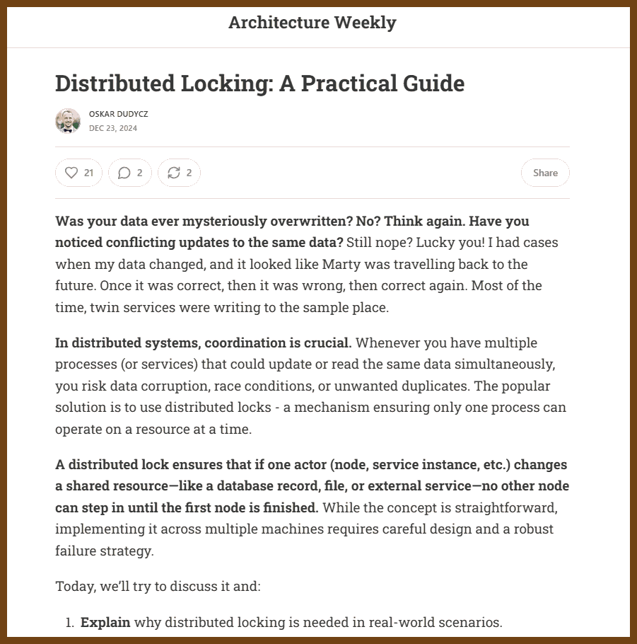

💥 2025-02-09 [Versioning versus Coordination - Marc's Blog](https://brooker.co.za/blog/2025/02/04/versioning.html) { brooker.co.za }

> I want to show you why multi-version concurrency control outdoes locking in distributed databases. By giving each transaction its own snapshot, we never make readers and writers wait on each other, cutting way down on coordination across replicas. I also rely on carefully synchronized physical clocks to get rid of any need for a central version authority, which increases both scalability and availability. This approach hits the sweet spot of guaranteeing read-after-write consistency while still letting us scale horizontally. I am building on David Reed's groundbreaking 1979 work, which underscores how versions help capture consistent states without heavy synchronization. Sure, we need to manage older versions for ongoing transactions, but that is a fair trade-off for the performance and consistency we gain. All in all, versioning is the right choice if you want a fast, truly distributed database system.
>
> 

2024-12-26 [Helm-based deployments for Apache NiFi - Azure Architecture Center | Microsoft Learn](https://learn.microsoft.com/en-us/azure/architecture/guide/data/helm-deployments-apache-nifi) { learn.microsoft.com }

> Azure Deployment and software design hints from Microsoft
>
> 

2024-12-01 [Hexagonal Architecture: A Practical Guide | Booking.com Engineering](https://medium.com/booking-com-development/hexagonal-architecture-a-practical-guide-5bc6d5a6a056) { medium.com }

> 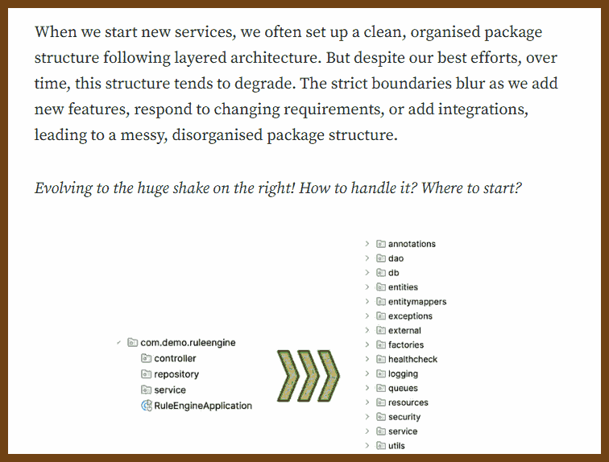
>
> 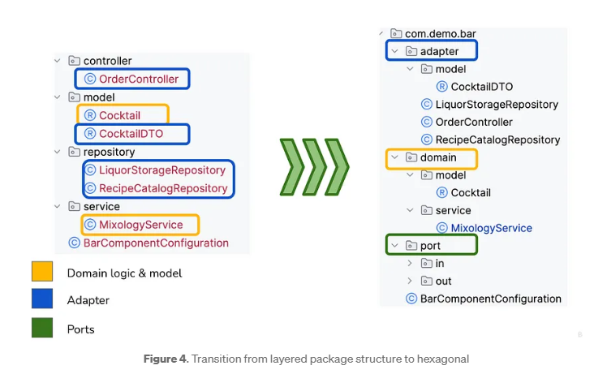

## Algorithms

2025-02-28 [Markov Chains explained visually](https://setosa.io/ev/markov-chains/) { setosa.io }

> **Tags:** Markov chains, stochastic processes, state transitions, transition matrices, probability modeling, weather simulation, PageRank algorithm, visualization, interactive learning, mathematical modeling
>
> Markov chains model systems transitioning between states based on current conditions, useful in simulating real-world phenomena.
>
> - A Markov chain consists of a state space and transition probabilities between states.
> - Transition matrices represent these probabilities, facilitating complex modeling.
> - Applications include weather pattern simulation and Google's PageRank algorithm.
> - Interactive tools enhance understanding of Markov chains.
>
> This article offers a visual, intuitive explanation of Markov chains, making complex concepts accessible through interactive simulations.
>
> 

2025-02-23 [Hash Functions Deep Dive](https://www.kirupa.com/data_structures_algorithms/hash_functions_deep_dive.htm/) { www.kirupa.com }

> 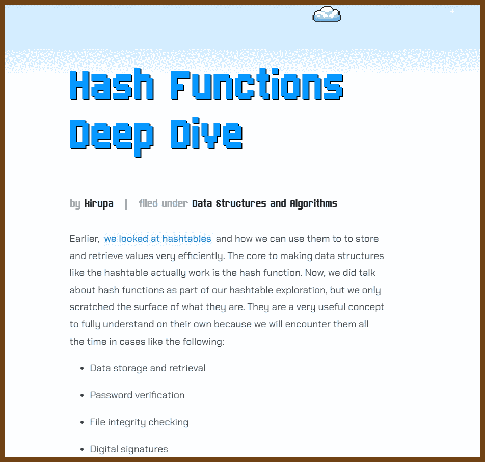
> (found in 2025-02-23 [A calculator app?](https://programmingdigest.net/newsletters/1807) { programmingdigest.net })

2024-09-29 [Raft](https://thesecretlivesofdata.com/raft/) { thesecretlivesofdata.com }

> **Tags:** distributed systems, consensus algorithm, Raft, leader election, log replication, fault tolerance, data consistency, state machine replication, system reliability, interactive visualization
>
> The Raft consensus algorithm ensures distributed systems achieve fault-tolerant data consistency through leader-based log replication and leader election mechanisms.
>
> - Raft decomposes consensus into leader election and log replication to simplify understanding.
> - Leader election occurs when the current leader fails, with nodes voting based on log up-to-dateness.
> - The leader handles client requests, appending entries to its log and replicating them to followers.
> - Entries are committed once a majority acknowledges them, ensuring consistency across nodes.
> - Raft enforces safety properties like election safety, leader append-only, log matching, leader completeness, and state machine safety.
>
> it provides an interactive visualization of the Raft algorithm, making complex distributed system concepts more accessible.

2024-09-29 [Implementing Blocked Floyd-Warshall algorithm for solving all-pairs shortest path problem in C# – Oleg Karasik's blog](https://olegkarasik.wordpress.com/2024/09/26/implementing-blocked-floyd-warshall-algorithm-for-solving-all-pairs-shortest-path-problem-in-c/?_bhlid=fba050748f7c98d10b7ea1cb8eda2af5cdae6574) { olegkarasik.wordpress.com }

> **Tags:** Floyd-Warshall algorithm, blocked algorithm, all-pairs shortest path, C# implementation, CPU cache optimization, vectorization, parallel processing, performance optimization, graph algorithms, computational efficiency
>
> The article presents an optimized C# implementation of the blocked Floyd-Warshall algorithm to solve the all-pairs shortest path problem, leveraging CPU cache, vectorization, and parallel processing for enhanced performance.
>
> - Explanation of CPU cache levels (L1, L2, L3) and their impact on algorithm performance  
> - Detailed comparison between standard and blocked Floyd-Warshall algorithms  
> - Implementation of vectorization techniques to process multiple data points simultaneously  
> - Utilization of parallel processing to distribute computations across multiple CPU cores  
> - Experimental results demonstrating significant performance improvements with the optimized approach  
>
> This article is important as it provides practical insights into enhancing algorithm efficiency through hardware-aware optimizations, offering valuable guidance for developers aiming to improve computational performance.

2024-07-15 [Finding near-duplicates with Jaccard similarity and MinHash - Made of Bugs](https://blog.nelhage.com/post/fuzzy-dedup/)

> Tags: document deduplication, Jaccard similarity, MinHash, locality-sensitive hashing, approximate similarity, large-scale text processing, data deduplication, near-duplicate detection, feature sets, hash functions
>
> The article explores using Jaccard similarity and MinHash techniques to identify approximately duplicate documents efficiently in large datasets.
>
> - Jaccard similarity measures the overlap between two sets as the size of their intersection divided by the size of their union.
> - MinHash approximates Jaccard similarity by hashing document features and comparing the minimum hash values.
> - Combining multiple MinHash values enables detection of near-duplicate documents with high probability.
> - This method scales well, making it useful for large-scale text processing tasks.
>
> This article is interesting because it introduces efficient, scalable methods for detecting near-duplicate documents—an essential challenge in managing large text datasets.

2024-10-18 [trekhleb/javascript-algorithms: 📝 Algorithms and data structures implemented in JavaScript with explanations and links to further readings](https://github.com/trekhleb/javascript-algorithms/tree/master) { github.com }

2025-01-05 [B-Trees: More Than I Thought I'd Want to Know | Ben Congdon](https://benjamincongdon.me/blog/2021/08/17/B-Trees-More-Than-I-Thought-Id-Want-to-Know/) { benjamincongdon.me }

> 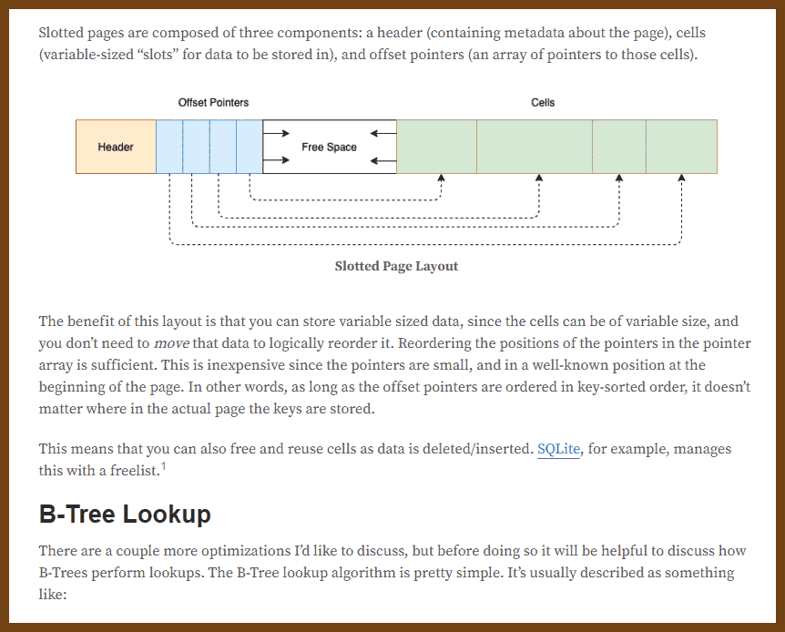

2025-01-05 [Static search trees: 40x faster than binary search · CuriousCoding](https://curiouscoding.nl/posts/static-search-tree/) { curiouscoding.nl }

> 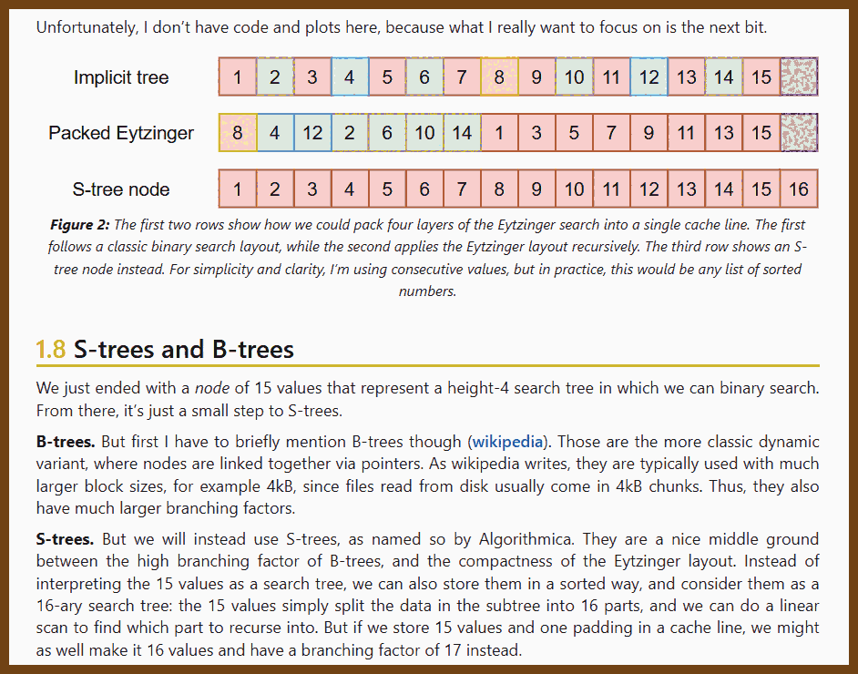

## CRDT Conflict-free replicated data type

2025-01-19 [Learn Yjs by Jamsocket](https://learn.yjs.dev/) { learn.yjs.dev }

> Welcome to Learn Yjs — an interactive tutorial series on building realtime collaborative applications using the Yjs CRDT library.
>
> This very page is an example of a realtime collaborative application. Every other cursor in the garden above is a real live person reading the page right now. Click one of the plants to change it for everyone else!
>
> Learn Yjs starts with the basics of Yjs, then covers techniques for handling state in distributed applications. We’ll talk about what a CRDT is, and why you’d want to use one. We’ll get into some of the pitfalls that make collaborative applications difficult and show how you can avoid them. There will be explorable demos and code exercises so you can get a feel for how Yjs really works.
>
> 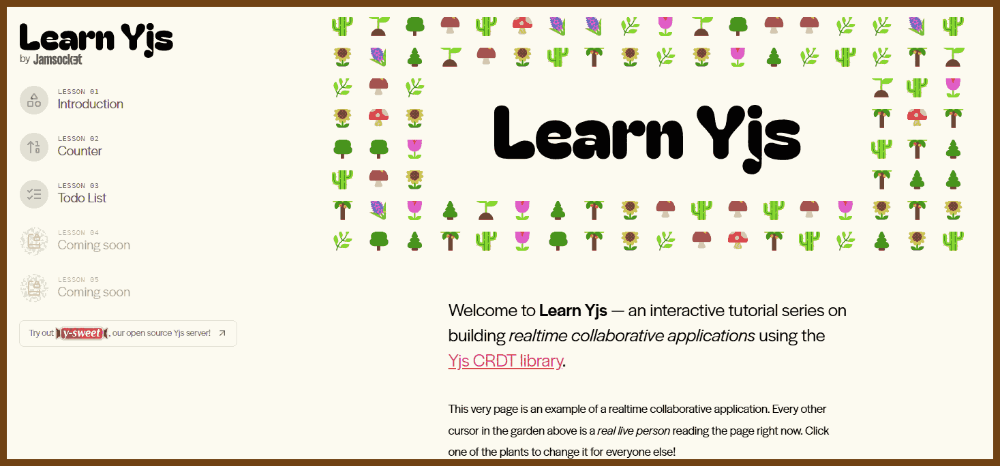

2024-06-27 [Resilient Sync for Local First | Dirk Holtwick](https://holtwick.de/en/blog/localfirst-resilient-sync)

> **Tags:** local-first, data synchronization, resilient sync, CRDT, offline data processing, end-to-end encryption, data exchange format, peer-to-peer communication, data resilience, technology evolution
>
> The article proposes a resilient data synchronization method for local-first applications, enabling offline data processing and secure synchronization using simple, technology-agnostic protocols.
>
> - Introduces a continuous log system where each client records changes sequentially, ensuring data consistency.  
> - Separates large binary data (assets) from content changes to optimize synchronization efficiency.  
> - Highlights benefits such as independent data retrieval, immediate detection of missing data, and compatibility with various storage systems, including file systems and online services.  
> - Discusses potential enhancements like data compression, cryptographic methods for rights management, and implementing logical clocks for improved data chronology.  
>
> This article is important as it addresses the challenges of data synchronization in local-first applications, offering a robust solution that enhances data resilience and user autonomy.
>
> 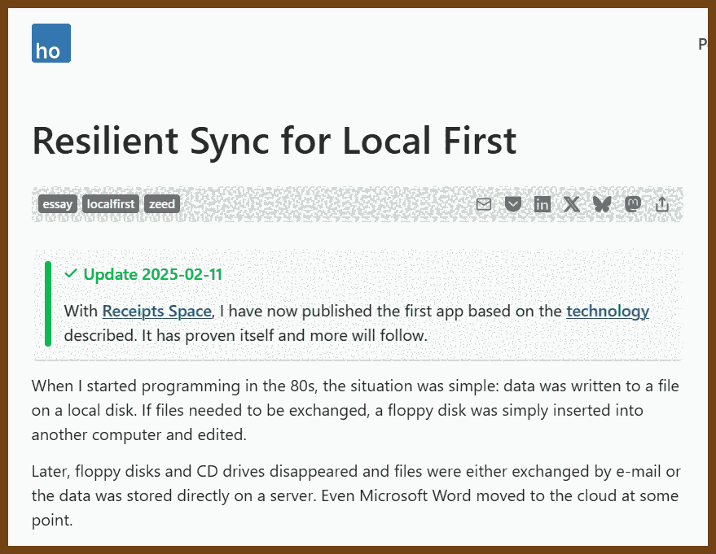

2024-07-30 [Movable tree CRDTs and Loro's implementation – Loro](https://loro.dev/blog/movable-tree)

> Tags: CRDTs, Movable Tree, Loro, Conflict Resolution, Distributed Systems, Collaborative Software, Hierarchical Data, Node Movement, Concurrent Operations, Cycle Prevention
>
> The article discusses implementing Movable Tree CRDTs in collaborative environments, addressing challenges like node movement conflicts and cycle prevention.
>
> - Concurrent operations such as node deletion and movement can lead to conflicts.
> - Moving the same node under different parents requires careful conflict resolution strategies.
> - Concurrent movements causing cycles necessitate specific handling to maintain tree integrity.
>
> Understanding these challenges is crucial for developers working on collaborative applications that manage hierarchical data structures, ensuring data consistency and system reliability.
>
> 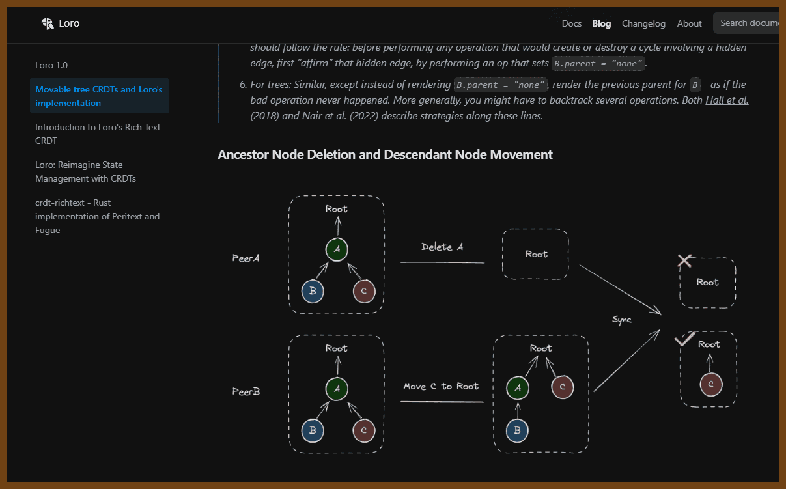

2024-12-07 [Lies I was Told About Collaborative Editing, Part 1: Algorithms for offline editing / Moment devlog](https://www.moment.dev/blog/lies-i-was-told-pt-1) { www.moment.dev }

> Tags: collaborative editing, offline editing, CRDTs, operational transformation, conflict resolution, user experience, data corruption, algorithm limitations, UX design, Moment.dev
>
> Collaborative editing algorithms like CRDTs and OT often mishandle offline editing conflicts, leading to user-perceived data corruption.
>
> - Offline editing increases the likelihood of direct conflicts.
> - CRDTs and OT often resolve these conflicts in unexpected or unintuitive ways.
> - Users interpret unexpected resolutions as data corruption, harming trust.
> - Algorithms lack user intent/context, limiting effective conflict resolution.
>
> This article is important because it challenges assumptions about widely used algorithms and highlights how technical correctness can fail real users.
> 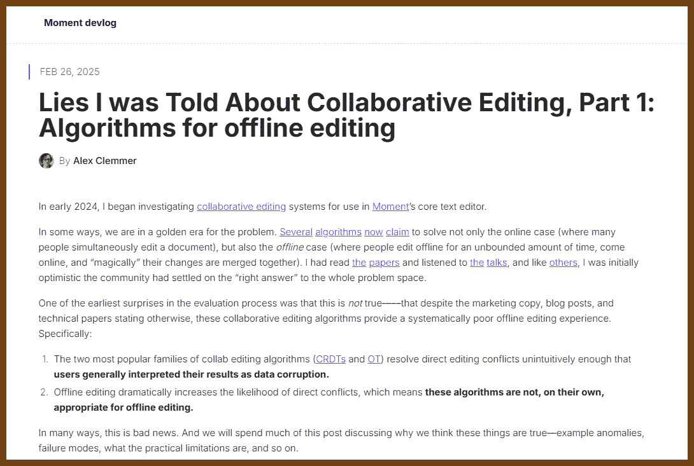

2024-12-18 [vlcn-io/cr-sqlite: Convergent, Replicated SQLite. Multi-writer and CRDT support for SQLite](https://github.com/vlcn-io/cr-sqlite) { github.com }

> Tags: `SQLite`, `CRDT`, `Database Replication`, `Multi-Writer Synchronization`, `Offline Editing`, `Realtime Collaboration`, `Conflict Resolution`, `Data Synchronization`, `vlcn-io`, `cr-sqlite`
>
> CR-SQLite is a SQLite extension enabling seamless merging of independently modified databases using Conflict-Free Replicated Data Types (CRDTs).
>
> - multi-master replication and partition tolerance
> - offline editing and automatic conflict resolution
> - real-time collaboration by merging independent edits
> - Integrates with JavaScript environments, including browser and Node.js
>
> This project is important because it tackles the challenges of syncing distributed databases, making it easier to build collaborative, offline-first apps.
>
> 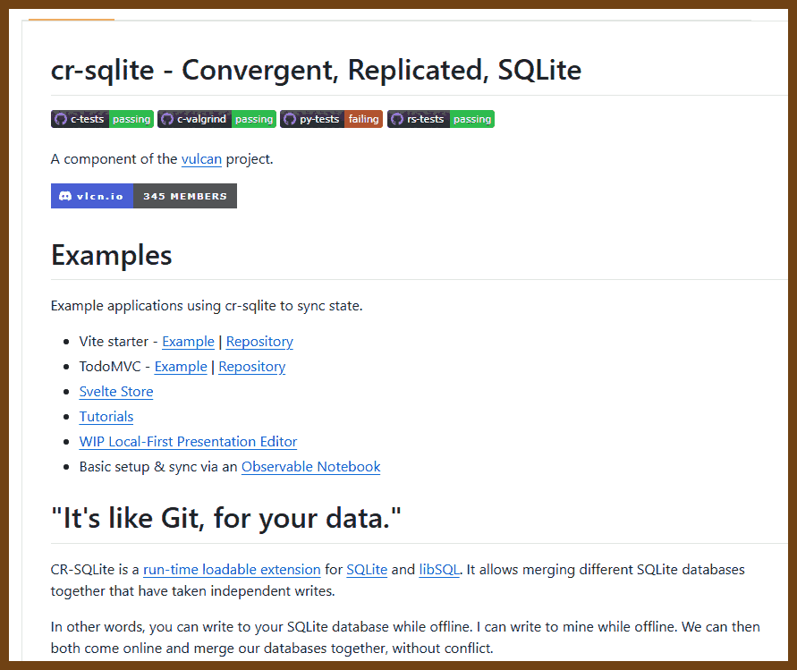"It's like Git, for your data."
>
> CR-SQLite is a [run-time loadable extension](https://www.sqlite.org/loadext.html) for [SQLite](https://www.sqlite.org/index.html) and [libSQL](https://github.com/libsql/libsql). It allows merging different SQLite databases together that have taken independent writes.
>
> In other words, you can write to your SQLite database while offline. I can write to mine while offline. We can then both come online and merge our databases together, without conflict.
>
> **In technical terms:** cr-sqlite adds multi-master replication and partition tolerance to SQLite via conflict free replicated data types ([CRDTs](https://en.wikipedia.org/wiki/Conflict-free_replicated_data_type)) and/or causally ordered event logs.

2024-12-18 [CRDTs and collaborative playground | Cerbos](https://www.cerbos.dev/blog/crdts-and-collaborative-playground) { www.cerbos.dev }

> 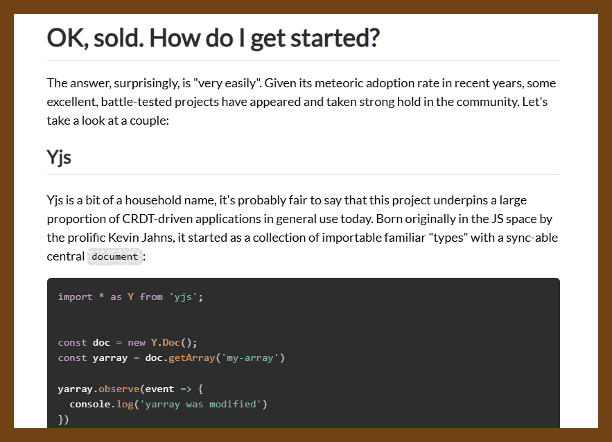
>
> CRDTs are a class of data structures that automatically resolve conflicts in distributed systems, allowing for seamless data synchronization across multiple points without centralized coordination. They're designed for environments where network partitions or latency make constant communication impractical but have since found more generalised use due to their simplicity and elegance.
>
> They're incredibly useful when it comes to developing robust, distributed applications that require real-time collaboration. They enable multiple users to work concurrently on the same dataset, with guarantees of eventual consistency, eliminating the need for complex conflict resolution logic. Does your application need offline support? Good news: you get that for free, too!
>
> The concept was formalised in 2011 when a group of very smart researchers came together and presented [a paper](https://inria.hal.science/inria-00609399v1/document) on the topic; initially motivated by collaborative editing and mobile computing, but its adoption has spread to numerous other applications in the years that followed.
>
> OK, sold. How do I get started?
> The answer, surprisingly, is "very easily". Given its meteoric adoption rate in recent years, some excellent, battle-tested projects have appeared and taken strong hold in the community. Let's take a look at a couple: (...)
>
> 

## Inspiration!

2025-05-04 [tldr pages](https://tldr.sh/) { tldr.sh }

> The tldr pages are a community effort to simplify the beloved [man pages](https://en.wikipedia.org/wiki/Man_page) with practical examples.
>
> 
> Try the [live demo](https://tldr.inbrowser.app/) below, have a look at the [PDF version](https://github.com/tldr-pages/tldr/releases/latest/download/tldr-book.pdf), or follow the [installation instructions](https://tldr.sh/#installation).

2025-02-13 [CoatiSoftware/Sourcetrail: Sourcetrail - free and open-source interactive source explorer](https://github.com/CoatiSoftware/Sourcetrail) { github.com }

> Video: 2025-02-13 [The Diablo Source Code Is Pure Hell (and I am here for it) - YouTube](https://www.youtube.com/watch?v=2VcfTq_dzrg) { www.youtube.com }
>
> 

2025-05-27 [dylanaraps/pure-bash-bible: 📖 A collection of pure bash alternatives to external processes.](https://github.com/dylanaraps/pure-bash-bible) { github.com }

> The goal of this book is to document commonly-known and lesser-known methods of doing various tasks using only built-in `bash` features. Using the snippets from this bible can help remove unneeded dependencies from scripts and in most cases make them faster. I came across these tips and discovered a few while developing [neofetch](https://github.com/dylanaraps/neofetch), [pxltrm](https://github.com/dylanaraps/pxltrm) and other smaller projects.
>
> The snippets below are linted using `shellcheck` and tests have been written where applicable. Want to contribute? Read the [CONTRIBUTING.md](https://github.com/dylanaraps/pure-bash-bible/blob/master/CONTRIBUTING.md). It outlines how the unit tests work and what is required when adding snippets to the bible.
>
> See something incorrectly described, buggy or outright wrong? Open an issue or send a pull request. If the bible is missing something, open an issue and a solution will be found.
>
> 

2025-05-27 [cowtoolz/webcamize: Use almost any camera as a webcam—DSLRs, mirrorless, camcorders, and even point-and-shoots](https://github.com/cowtoolz/webcamize) { github.com } but look at that birds! 

> Webcamize allows you to use basically any modern camera as a webcam on Linux—your DSLR, mirrorless, camcorder, point-and-shoot, and even some smartphones/tablets. It also gets many webcams that don't work out of the box on Linux up and running in a flash.
>
> 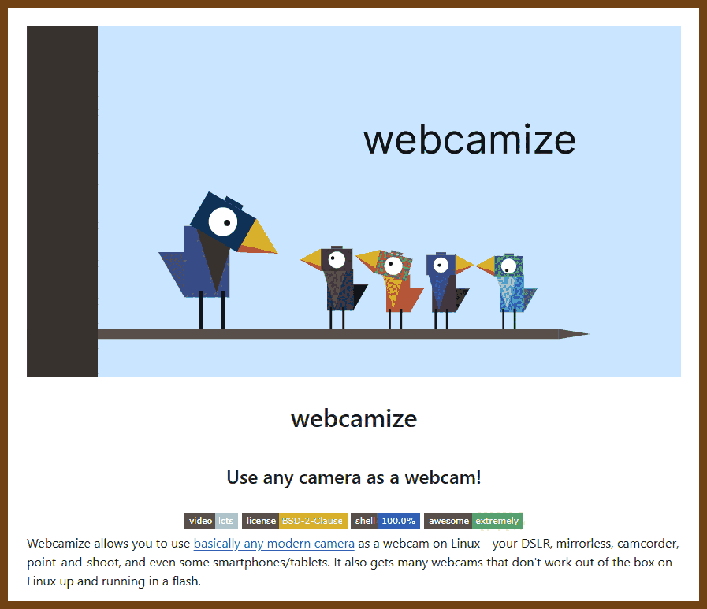

2025-05-24 [Root for Your Friends · Joseph Thacker](https://josephthacker.com/personal/2025/05/13/root-for-your-friends.html) { josephthacker.com }

> Tags: #SupportFriends #Positivity #GrowthMindset #SuccessTogether #CelebrateOthers #GoodVibes #Teamwork #Networking #Kindness #Community
>
> Cheering for your friends helps everyone grow and succeed together.
>
> - Success isn't a competition—helping others win helps you too
> - Supportive friends cheer, share, and give honest advice
> - Be the friend who celebrates others loudly
> - Mutual support builds strong, lasting networks
>
> It’s a good reminder that being kind and supportive leads to better relationships and shared success.

2025-05-24 [A brief history of JavaScript | Deno](https://deno.com/blog/history-of-javascript) { deno.com }

> JavaScript was created in 1995 by Brendan Eich at Netscape to make websites more interactive. He built the first version in just ten days. It was first called Mocha, then LiveScript, and finally JavaScript to take advantage of Java’s popularity.
>
> It became a standard language through ECMAScript and expanded beyond browsers. Node.js allowed JavaScript to run on servers, and later Deno was introduced to fix some of Node.js’s issues.
>
> *JavaScript, history, Brendan Eich, Netscape, ECMAScript, Node.js, Deno, web development*

2025-05-24 [ECMAScript 4: The missing version](https://evertpot.com/ecmascript-4-the-missing-version/) { evertpot.com }

> Tags: ECMAScript, JavaScript, ES4, Programming Languages, Type Systems, Interfaces, Classes, Static Typing, Language Evolution, Web Development
>
> ECMAScript 4 was an ambitious but ultimately abandoned update to JavaScript, introducing features like classes, interfaces, and static typing that were later adopted in ES6 and TypeScript.
>
> - ES4 aimed to modernize JavaScript with features such as classes, interfaces, and static typing, but its complexity and backward incompatibility led to its abandonment.
> - Proposed features included class declarations with access modifiers, interfaces, nominal typing with union types, generics, and new primitive types like `byte`, `int`, and `decimal`.
> - The `like` keyword was introduced to allow structural typing, providing flexibility in type checking.
> - ES4's package system and triple-quoted strings were early attempts at modularity and improved string handling.
> - Flash ActionScript 3 implemented many ES4 concepts, serving as a practical example of the proposed features.
>
> Understanding ES4's history provides insight into JavaScript's evolution and the challenges of balancing innovation with compatibility in language design.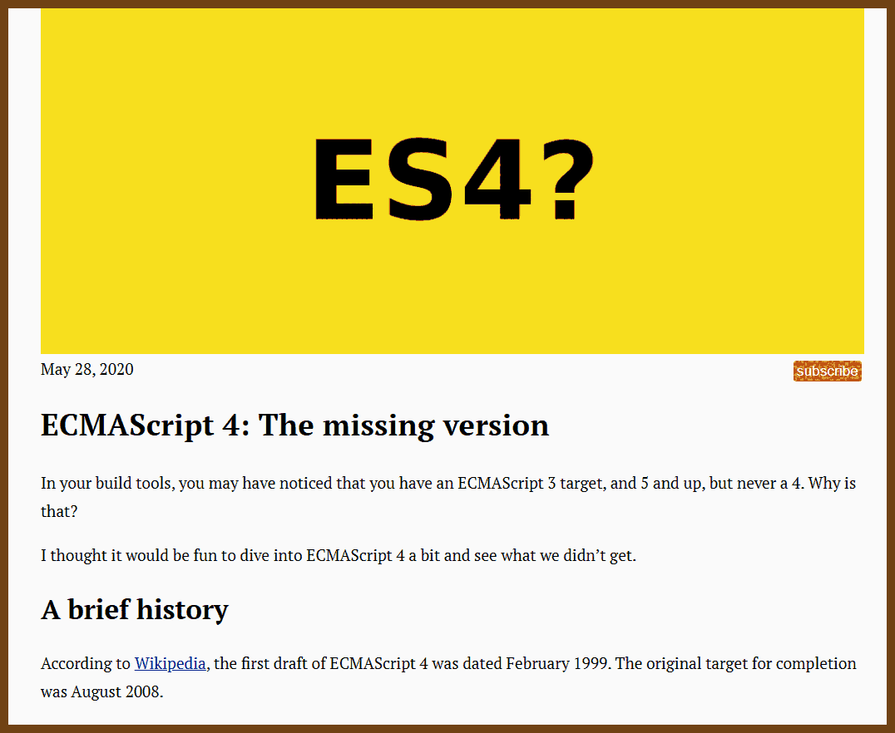

2025-05-03 [Carl Öst Wilkens´ Blog - Minimum viable blog](https://ostwilkens.se/blog/setting-up-blog) { ostwilkens.se }

> 

2025-04-22 [Pipelining might be my favorite programming language feature | MOND←TECH MAGAZINE](https://herecomesthemoon.net/2025/04/pipelining/) { herecomesthemoon.net }

> The author of this blog also adds dithering to the illustrations!
>
> 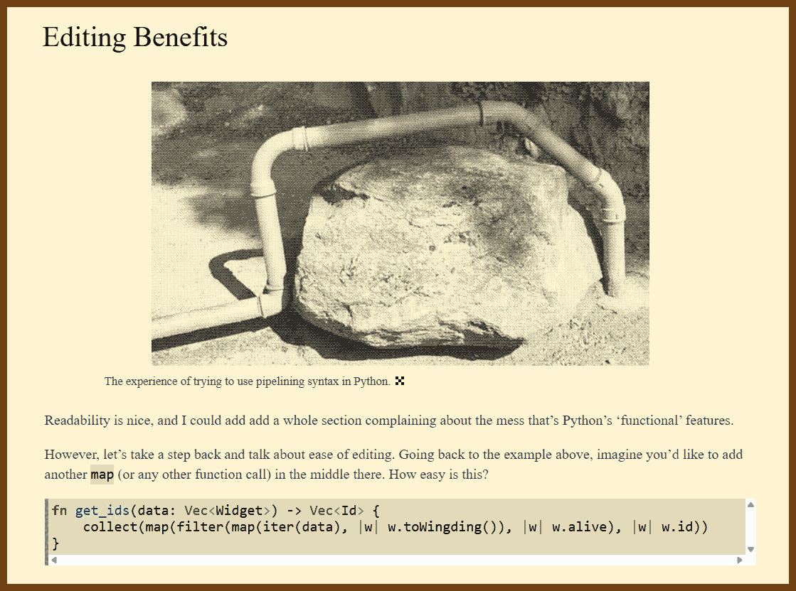

2025-04-15 [SQLite File Format Viewer](https://sqlite-internal.pages.dev/#page=10) { sqlite-internal.pages.dev }

> Tags: SQLite, Database Internals, File Format, Page Structure, B-Tree, Schema, Freelist, Write-Ahead Logging, Overflow Pages, Pointer Map
>
> The SQLite File Format Viewer offers an interactive exploration of SQLite database internals, detailing page structures, B-tree organization, and schema representation.
>
> - **Page Structure**: SQLite databases are divided into fixed-size pages (512 to 65536 bytes), each serving specific roles such as B-tree nodes, freelist entries, or overflow storage.
> - **Database Header**: The first 100 bytes of the database file contain critical metadata, including page size, file format versions, and schema information.
> - **Freelist Management**: Unused pages are tracked in a freelist, allowing efficient reuse of space without immediate file size reduction.
> - **B-Tree Organization**: Tables and indexes are stored using B-tree structures, facilitating efficient data retrieval and storage.
> - **Overflow and Pointer Map Pages**: Large records utilize overflow pages, while pointer map pages assist in managing auto-vacuum and incremental vacuum processes.
>
> This tool is valuable for developers and database administrators seeking a deeper understanding of SQLite's storage mechanisms, aiding in optimization and troubleshooting efforts.
>
> 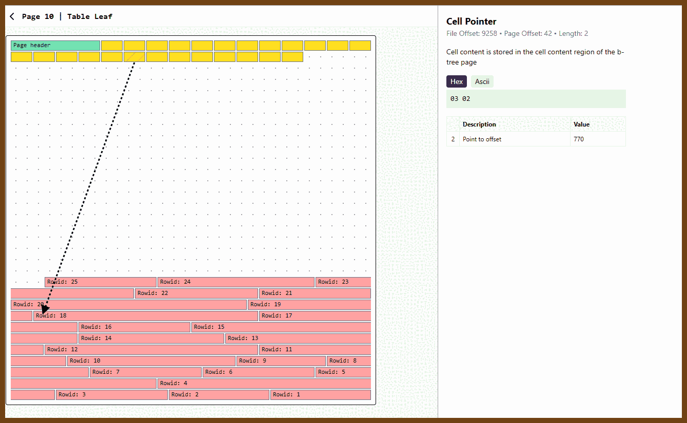

2025-04-15 [Omnom](https://omnom.zone/?src=hn) { omnom.zone }

> Tags: bookmarking, web snapshots, offline access, browser extensions, digital archiving, web preservation, Omnom, GitHub, Firefox, Chrome
>
> Omnom is a tool that enables users to create and manage self-contained snapshots of bookmarked websites for reliable offline access and sharing.
>
> - Omnom ensures saved pages remain accessible even if the original content changes or is removed.
> - The platform offers browser extensions for Firefox and Chrome to facilitate bookmarking and snapshot creation.
> - A read-only demo is available, with the full project hosted on GitHub.
> - Users can explore public bookmarks and snapshots through the Omnom interface.
>
> This article is significant as it introduces a solution for preserving web content, addressing challenges related to content volatility and ensuring consistent access to information.
>
> 

2025-04-13 [WebTUI](https://webtui.ironclad.sh/start/intro/) { webtui.ironclad.sh }

> Tags: WebTUI, Typography, HTML Elements, CSS Styling, Headings, Lists, Blockquotes, Inline Elements, Custom Markers, Typography Block
> WebTUI – A CSS Library That Brings the Beauty of Terminal UIs to the Browser 
>
> 

2025-04-12 [VERT.sh](https://vert.sh/) { vert.sh }

> Open source and self hostable/private file converter
>
> 2025-04-12 [Open source and self hostable/private file converter | Hacker News](https://news.ycombinator.com/item?id=43663865) { news.ycombinator.com }
>
> 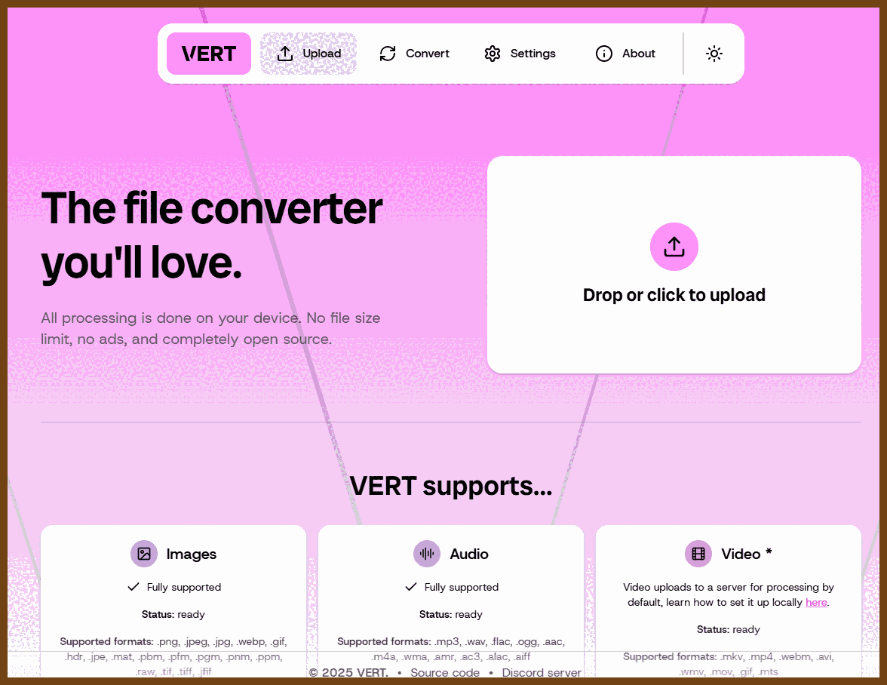

2025-04-07 [What’s Trading on Capitol Hill? - Capitol Trades](https://www.capitoltrades.com/) { www.capitoltrades.com }

> Capital Trades: Tracking Stock Market Transactions of Politicians
>
> HN: [Capital Trades: Tracking Stock Market Transactions of Politicians | Hacker News](https://news.ycombinator.com/item?id=43604052)
>
> Why Capitol Trades?
>
> Tracking Capitol Hill politicians' trades can provide valuable insights for your investment research — and we offer you a free solution to do just that.
>
> CapitolTrades.com is the industry leading resource for political investor intelligence, and a trusted source for media outlets such as the [Wall Street Journal](https://www.wsj.com/articles/131-federal-judges-broke-the-law-by-hearing-cases-where-they-had-a-financial-interest-11632834421) and the [New York Times](https://www.2iqresearch.com/blog/capitol-trades-used-to-explore-congress-member-stock-trades-2022-12-06).
>
> [About Us](https://www.capitoltrades.com/about-us)
>
> 

2025-04-07 [Glamorous Toolkit](https://gtoolkit.com//) { gtoolkit.com }

> Each problem about your system is special. And each problem can be explained through contextual development experiences. Glamorous Toolkit enables you to build such experiences out of micro tools. Thousands of them ... per system. It's called Moldable Development.
>
> 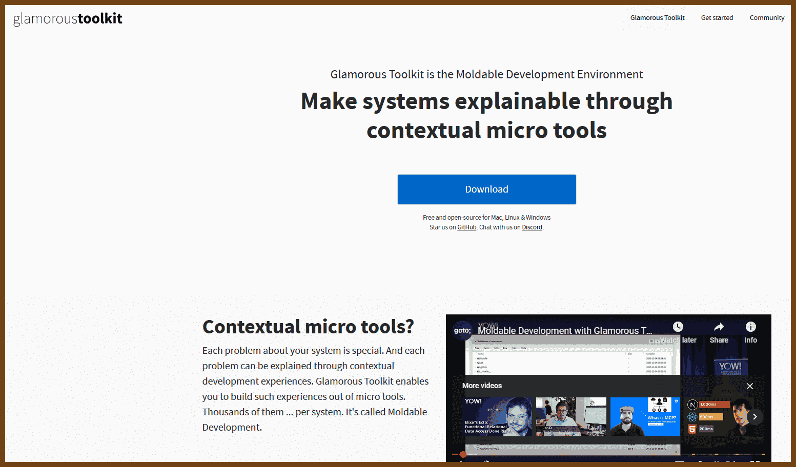

2025-04-05 [Coolify](https://coolify.io/) { coolify.io }

> Self-hosting with superpowers.
> An open-source & self-hostable Heroku / Netlify / Vercel alternative.
> 

2025-04-02 [✱ dori the giant ✱: 13 Animals Made From 13 Circles](https://www.dorithegiant.com/2016/05/13-animals-made-from-13-circles.html) { www.dorithegiant.com }

> 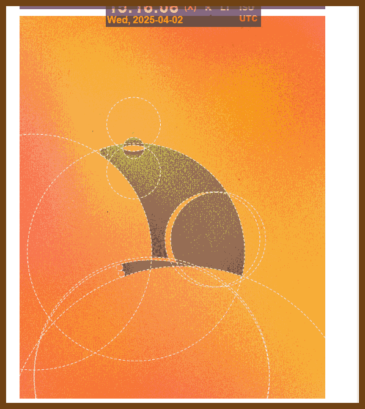

2025-04-01 [Fluentsubs - Watch, Learn, and Master Any Language](https://app.fluentsubs.com/exercises/daily) { app.fluentsubs.com }

> [ Show HN: Duolingo-style exercises but with real-world content like the news](https://app.fluentsubs.com/exercises/daily) ([fluentsubs.com](https://news.ycombinator.com/from?site=fluentsubs.com))
>
> 

2025-04-01 [Generate autounattend.xml files for Windows 10/11](https://schneegans.de/windows/unattend-generator/) { schneegans.de }

> This service lets you create [answer files](https://docs.microsoft.com/en-us/windows-hardware/manufacture/desktop/update-windows-settings-and-scripts-create-your-own-answer-file-sxs) (typically named `unattend.xml` or `autounattend.xml`) to perform **unattended installations** of both Windows 10 and Windows 11, including 24H2. Answer files generated by this service are primarily intended to be used with Windows Setup run from Windows PE to perform clean (rather than upgrade) installations.
>
> 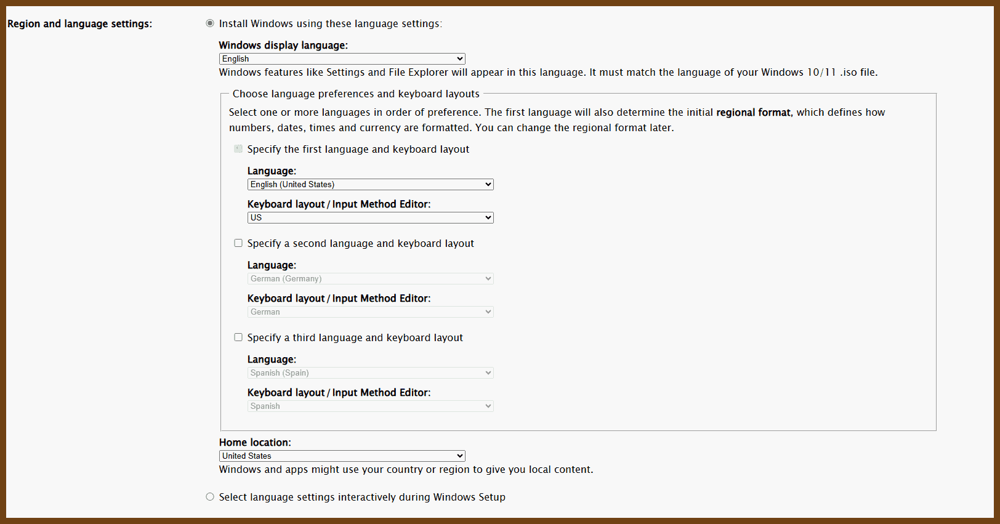

2025-04-01 [A Man Powers Home for 8 Years Using 1,000 Old Laptop Batteries](https://techoreon.com/a-man-powers-home-8-years-laptop-batteries/) { techoreon.com }

> **A man has managed to power his home for eight years with a system using more than 1,000 recycled laptop batteries**. This ingenious project, based on the use of electronic waste, has proven to be an environmentally friendly and economical solution, without the need to even replace batteries over the years.
>
> This system also uses solar panels, which were the origin of his renewable energy project that he started a long time ago and which has been enough for him to live during this time.

2025-03-29 [Train & Weather Tracker with Raspberry Pi & E-Ink](https://sambroner.com/posts/raspberry-pi-train) { sambroner.com }

> I finally built a Raspberry Pi project my wife loves: an e-ink train and weather tracker! If you want to build one yourself, [the Github & instructions are here.](https://github.com/SamBroner/subway-e-ink-tracker)
>
> 

2025-03-29 [Lofi Tab 🐈‍⬛🎧](https://lofitab.com/) { lofitab.com }

> Transform your new tab into a productive and calming lofi experience with todos, weather, clock, and beautiful backgrounds.
>
> 

2025-03-29 [typedgrammar/typed-japanese: Learn Japanese grammar with TypeScript](https://github.com/typedgrammar/typed-japanese) { github.com }

> Tags: TypeScript, Japanese Grammar, Type-Level Programming, Language Learning, Domain-Specific Language, Compiler Verification, Educational Tool, AI-Assisted Learning, Grammar Verification, Open Source
>
> Typed Japanese is a TypeScript library that models Japanese grammar rules at the type level, enabling the construction and verification of grammatically correct Japanese sentences within TypeScript's type system.
>
> By creating a domain-specific language (DSL) based on Japanese grammar, it allows developers to express and validate Japanese sentences using TypeScript's compiler. The project also explores the potential for AI-assisted language learning by providing structured formats for grammar analysis, which can be verified through TypeScript's type checker to improve correctness. 
>
> This innovative approach bridges programming and linguistics, offering a unique tool for both developers and language learners to understand and apply Japanese grammar rules programmatically.
>
> 

2025-03-27 [xan/docs/LOVE_LETTER.md at master · medialab/xan](https://github.com/medialab/xan/blob/master/docs/LOVE_LETTER.md) { github.com }

> *Or why people pretending CSV is dead are wrong*
>
> Every month or so, a new blog article declaring the near demise of CSV in favor of some "obviously superior" format ([parquet](https://parquet.apache.org/), newline-delimited JSON, [MessagePack](https://msgpack.org/) records etc.) find its ways to the reader's eyes. Sadly those articles often offer a very narrow and biased comparison and often fail to understand what makes CSV a seemingly unkillable staple of data serialization.
>
> It is therefore my intention, through this article, to write a love letter to this data format, often criticized for the wrong reasons, even more so when it is somehow deemed "cool" to hate on it. My point is not, far from it, to say that CSV is a silver bullet but rather to shine a light on some of the format's sometimes overlooked strengths.
>
> **CSV is dead simple**
>
> The specification of CSV holds in its title: "comma separated values". Okay, it's a lie, but still, the specification holds in a tweet and can be explained to anybody in seconds: commas separate values, new lines separate rows. Now quote values containing commas and line breaks, double your quotes, and that's it. This is so simple you might even invent it yourself without knowing it already exists while learning how to program.
>
> Of course it does not mean you should not use a dedicated CSV parser/writer because you *will* mess something up.
>
> **CSV is a collective idea**
>
> No one owns CSV. It has no real specification (yes, I know about the controversial ex-post [RFC 4180](https://datatracker.ietf.org/doc/html/rfc4180)), just a set of rules everyone kinda agrees to respect implicitly. It is, and will forever remain, an open and free collective idea.
>
> **CSV is text**
>
> 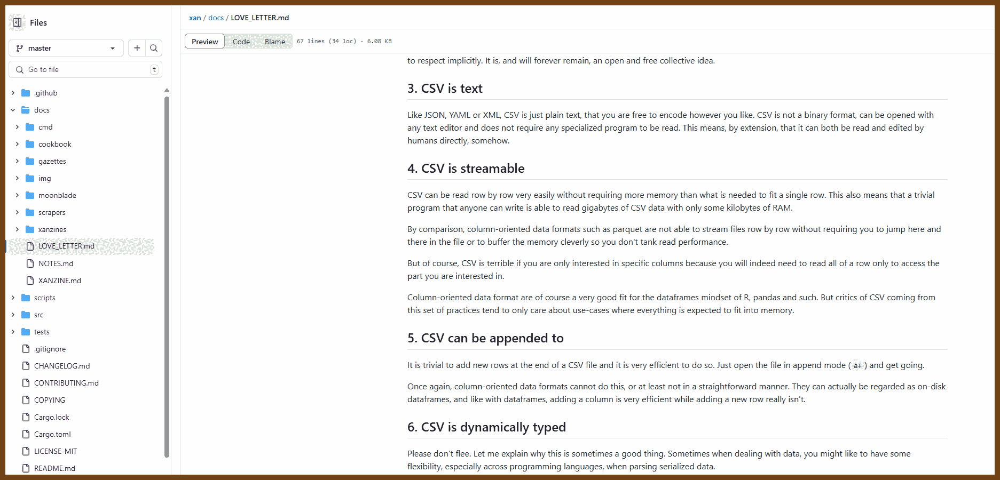

2025-03-25 https://www.slidehero.ai/  [Show HN: I'm a teacher and built an AI presentation tool | Hacker News](https://news.ycombinator.com/item?id=43451141) { news.ycombinator.com }

> 

2025-03-22 [Scallop](https://www.scallop-lang.org/) { www.scallop-lang.org }

> Tags: scallop, datalog, AI_reasoning, pytorch, symbolic_logic, vision, NLP, machine_learning, frameworks, integration
>
> Scallop – A Language for Neurosymbolic Programming 
>
> 

2025-03-20 [Konva - JavaScript Canvas 2d Library](https://konvajs.org/) { konvajs.org }

> JavaScript, Canvas, 2D, Konva, Object-Oriented API, Cross-Platform, Animations, Node Management, Export, Filters, Framework Integration, Drag and Drop, React, Vue, Svelte, Tutorials, Demos, API Reference, Design Editors.
>
> 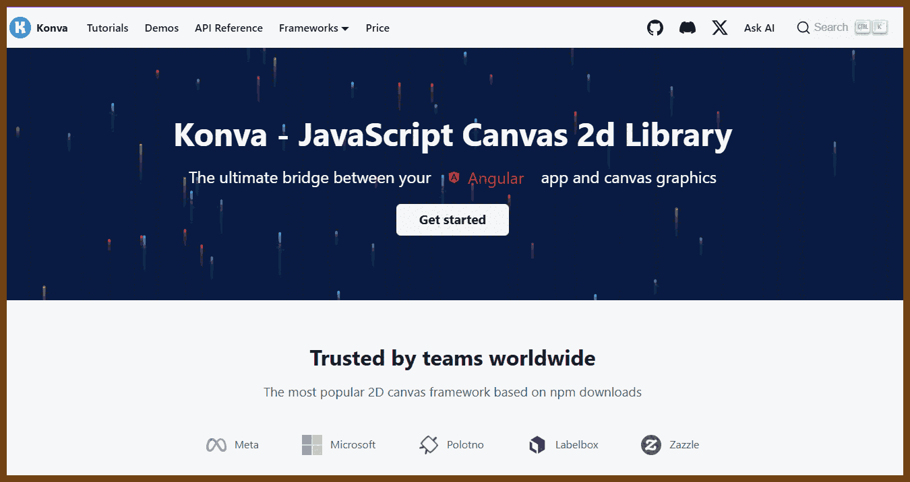

2025-03-16 [👋 Hello, This is Nash](https://keepworking.github.io/nash/) { keepworking.github.io }

> 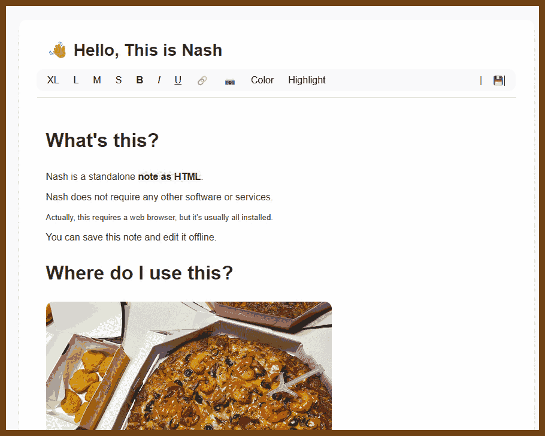

2025-03-15 [Learn | KIRUPA](https://www.kirupa.com/learn/index.htm) { www.kirupa.com }

> Just tags: web development, HTML, CSS, JavaScript, React, animation, data structures, algorithms, UX design, canvas, product development, sorting algorithms, career growth, web design, programming tips, coding tutorials, Flash, ActionScript, web fundamentals, learning resources, developer tools

> 
>
> 

2025-03-15 [codr7/eli: Embedded Lisp Interpreter](https://github.com/codr7/eli) { github.com }

> `eli` represents the culmination of more than 15 years of designing and implementing embedded Lisp interpreters in various languages.
>
> It all began with a craving an embedded Lisp for personal projects, but evolved into one of the deepest rabbit holes I've had the pleasure of falling into.
>
> ## Implementations
>
> 
>
> The following projects implement `eli` in different languges, some are more complete than others. Most work currently happens in [eli-java](https://github.com/codr7/eli-java).
>
> - [C](https://github.com/codr7/alisp)
> - [C#](https://github.com/codr7/sharpl)
> - [Go](https://github.com/codr7/gfun)
> - [Java](https://github.com/codr7/eli-java)
> - [Swift](https://github.com/codr7/sweet)

2025-03-15 [Milk Kanban](https://brodzinski.com/2025/03/milk-kanban.html) { brodzinski.com }

> 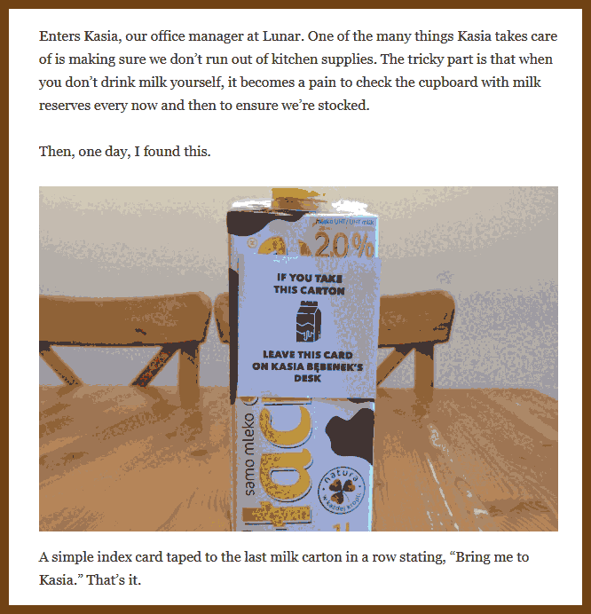

2025-03-13 [MLU-Explain](https://mlu-explain.github.io/) {mlu-explain.github.io}

> Visual explanations of core machine learning concepts
>
> [Machine Learning University (**MLU**)](https://aws.amazon.com/machine-learning/mlu/) is an education initiative from Amazon designed to teach machine learning theory and practical application.
>
> As part of that goal, MLU-Explain exists to teach important machine learning concepts through visual essays in a fun, informative, and accessible manner.
>
> 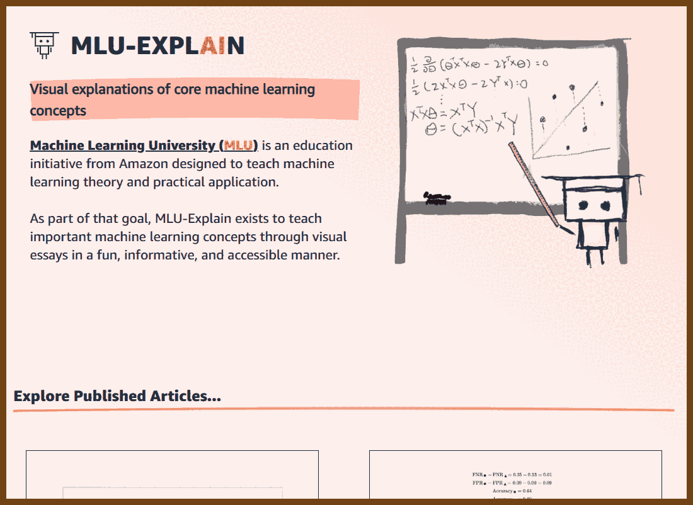

2025-03-13 [kern/filepizza: :pizza: Peer-to-peer file transfers in your browser](https://github.com/kern/filepizza) { github.com }

> Peer-to-peer file transfers in your browser
> Cooked up by Alex Kern & Neeraj Baid while eating Sliver @ UC Berkeley.
>
> Using WebRTC, FilePizza eliminates the initial upload step required by other web-based file sharing services. Because data is never stored in an intermediary server, the transfer is fast, private, and secure.
>
> A hosted instance of FilePizza is available at file.pizza.
>
> 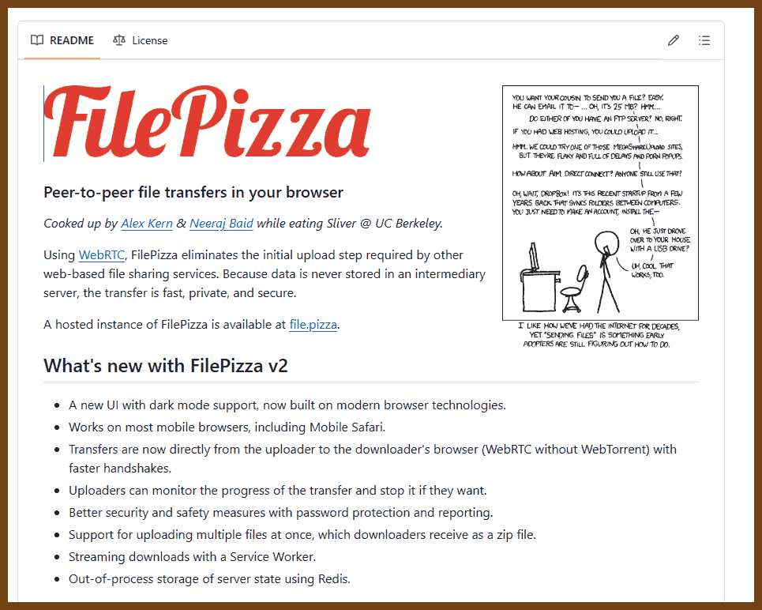

2025-03-01 [The world's most unhinged video wall (made out of Chromebooks)](https://varun.ch/posts/videowall/) { varun.ch }

>` techreuse`, `video_wall`, `software_hack`, `hardware_mods`, `creative_design`
>
>
>My friend and I spent three years turning old Lenovo ThinkPad 11e Chromebooks, which were considered junk, into a fully functional video wall. We repurposed the displays from 10 Chromebooks, synchronized video playback using a custom web app called c-sync, and tackled countless hardware and software challenges along the way. The project involved removing firmware restrictions, installing Linux, and using tools like coreboot to make the laptops boot directly to a web page displaying synchronized video segments.
>
>

2025-02-28 [Troubleshooting: The Skill That Never Goes Obsolete — The Autodidacts](https://www.autodidacts.io/troubleshooting/) { www.autodidacts.io }

> `#troubleshooting`, `#problem-solving`, `#mindset`, `#learning`
> I see troubleshooting as the one skill that never gets outdated. It’s about finding the cause of a problem in any system by stepping back, understanding how things flow, and comparing what should happen with what actually does. I start by checking that I’m working on the right part of the system and then form a clear idea of the issue before diving in.
>
> I use a method that involves testing parts of the system one by one, gathering as much real-time data as possible, and cutting through noise. I form hypotheses, rule out common failure points, and test my ideas by isolating or disconnecting subsystems. This approach helps me avoid wasted effort and speeds up finding the true problem, even when things seem tangled.
>
> I also believe that the best fixes come from learning from each mistake. I write down what I discover, rely on practical testing, and keep my work simple. By respecting the system and knowing when to ask for help or replace only what’s necessary, I turn challenges into opportunities to get better at troubleshooting every time.
>
> 

2025-02-28 [Yaak – The API client for modern developers](https://yaak.app/) { yaak.app }

> 2025-02-28 [mountain-loop/yaak: The most intuitive desktop API client. Organize and execute REST, GraphQL, WebSockets, Server Sent Events, and gRPC 🦬](https://github.com/mountain-loop/yaak) { github.com }
>
> The API client for modern developers
> Yaak is an offline and Git friendly app for HTTP, GraphQL, WebSockets, SSE, and gRPC.
> 

2025-02-25 [corporate.watch | we don't need to work this out for every report](https://corporate.watch/) { corporate.watch }

> I made a site to tell the time in corporate 
>
> 2025-02-25 [Show HN: I made a site to tell the time in corporate | Hacker News](https://news.ycombinator.com/item?id=43162340) { news.ycombinator.com }
>
> 

2025-02-25 [About time… human readable time](https://clockish.co.uk/) { clockish.co.uk }

> 
>
> 

2025-02-24 [European word translator: an interactive map showing "smart" in over 30 languages](https://ukdataexplorer.com/european-translator/?word=smart) { ukdataexplorer.com }

> 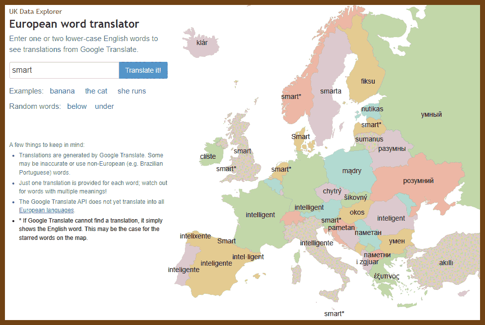
